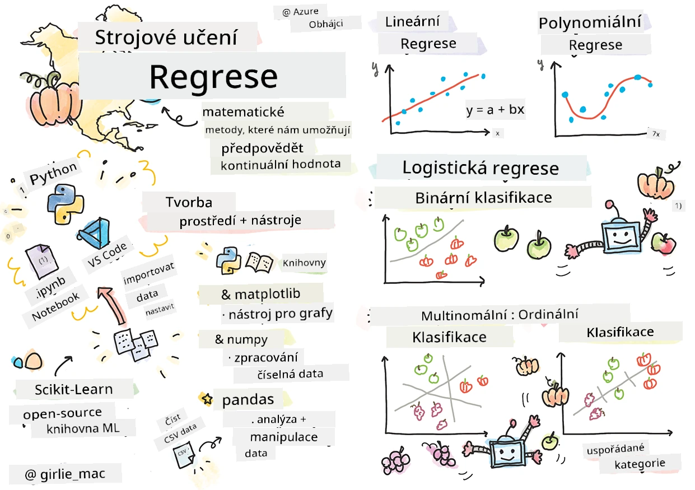
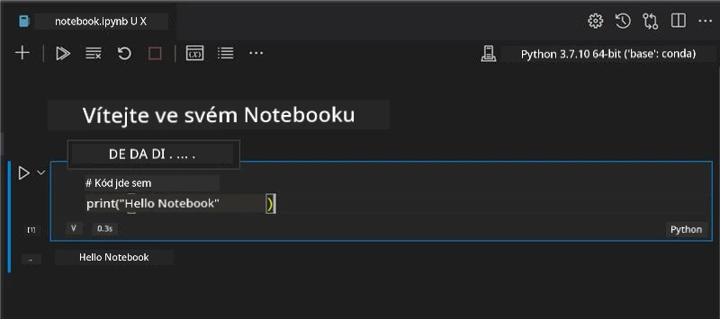
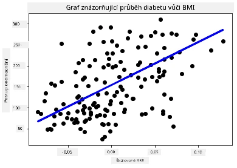

# Začněte s Pythonem a Scikit-learn pro regresní modely



> Sketchnote od [Tomomi Imura](https://www.twitter.com/girlie_mac)

## [Přednáškový kvíz](https://ff-quizzes.netlify.app/en/ml/)

> ### [Tato lekce je dostupná v R!](../../../../2-Regression/1-Tools/solution/R/lesson_1.html)

## Úvod

V těchto čtyřech lekcích objevíte, jak vytvářet regresní modely. Brzy si vysvětlíme, k čemu slouží. Než však začnete, ujistěte se, že máte správné nástroje připravené ke startu!

V této lekci se naučíte, jak:

- Nakonfigurovat váš počítač pro místní úlohy strojového učení.
- Pracovat s Jupyter Notebooky.
- Používat Scikit-learn, včetně instalace.
- Prozkoumat lineární regresi pomocí praktického cvičení.

## Instalace a konfigurace

[](https://youtu.be/-DfeD2k2Kj0 "ML pro začátečníky - Připravte své nástroje pro tvorbu modelů strojového učení")

> 🎥 Klikněte na obrázek výše pro krátké video, ve kterém se naučíte, jak konfigurovat váš počítač pro ML.

1. **Nainstalujte Python**. Ujistěte se, že máte na počítači nainstalovaný [Python](https://www.python.org/downloads/). Python budete používat pro mnoho úloh datové vědy a strojového učení. Většina počítačových systémů již obsahuje instalaci Pythonu. Existují i užitečné [balíčky pro kódování v Pythonu](https://code.visualstudio.com/learn/educators/installers?WT.mc_id=academic-77952-leestott), které některým uživatelům usnadní nastavení.

   Některé použití Pythonu však vyžadují jednu verzi softwaru, zatímco jiné vyžadují verzi jinou. Proto je užitečné pracovat uvnitř [virtuálního prostředí](https://docs.python.org/3/library/venv.html).

2. **Nainstalujte Visual Studio Code**. Ujistěte se, že máte na počítači nainstalovaný Visual Studio Code. Postupujte podle těchto instrukcí k [instalaci Visual Studio Code](https://code.visualstudio.com/) pro základní instalaci. V tomto kurzu budete používat Python ve Visual Studio Code, takže možná budete chtít osvěžit, jak [nastavit Visual Studio Code](https://docs.microsoft.com/learn/modules/python-install-vscode?WT.mc_id=academic-77952-leestott) pro vývoj v Pythonu.

   > Získejte jistotu v Pythonu tím, že projdete tuto sbírku [učebních modulů](https://docs.microsoft.com/users/jenlooper-2911/collections/mp1pagggd5qrq7?WT.mc_id=academic-77952-leestott)
   >
   > [](https://youtu.be/yyQM70vi7V8 "Nastavení Pythonu ve Visual Studio Code")
   >
   > 🎥 Klikněte na obrázek výše pro video: používání Pythonu ve VS Code.

3. **Nainstalujte Scikit-learn** podle [těchto instrukcí](https://scikit-learn.org/stable/install.html). Protože je potřeba používat Python 3, doporučuje se použít virtuální prostředí. Vezměte na vědomí, že pokud knihovnu instalujete na M1 Macu, jsou na výše uvedené stránce speciální instrukce.

1. **Nainstalujte Jupyter Notebook**. Budete potřebovat [nainstalovat balíček Jupyter](https://pypi.org/project/jupyter/).

## Vaše prostředí pro tvorbu ML

Budete používat **notebooky** k vývoji vašeho Python kódu a tvorbě modelů strojového učení. Tento typ souboru je běžným nástrojem datových vědců a poznáte je podle přípony `.ipynb`.

Notebooky jsou interaktivní prostředí, která umožňují vývojáři jak kódovat, tak přidávat poznámky a psát dokumentaci kolem kódu, což je velmi užitečné pro experimentální nebo výzkumné projekty.

[](https://youtu.be/7E-jC8FLA2E "ML pro začátečníky - Nastavte Jupyter Notebooky pro začátek tvorby regresních modelů")

> 🎥 Klikněte na obrázek výše pro krátké video pracovní cvičení.

### Cvičení - práce s notebookem

V této složce naleznete soubor _notebook.ipynb_.

1. Otevřete _notebook.ipynb_ ve Visual Studio Code.

   Spustí se Jupyter server s Pythonem 3+. V notebooku najdete části, které mohou být `spuštěny`, kusy kódu. Blok kódu můžete spustit výběrem ikony vypadající jako tlačítko přehrávání (play).

1. Vyberte ikonu `md` a přidejte trochu markdownu s následujícím textem **# Vítejte ve vašem notebooku**.

   Poté přidejte nějaký Python kód.

1. Napište **print('hello notebook')** ve bloku kódu.
1. Klikněte na šipku pro spuštění kódu.

   Měli byste vidět vytištěné prohlášení:

    ```output
    hello notebook
    ```



Můžete prokládat svůj kód komentáři, aby si notebook sám dokumentoval.

✅ Zamyslete se na chvíli, jak odlišné je pracovní prostředí webového vývojáře oproti datovému vědci.

## Spuštění se Scikit-learn

Nyní když máte Python nastavený ve vašem lokálním prostředí a jste si jistí v Jupyter Notebookech, pojďme si přivyknout i na Scikit-learn (vyslovujte `sci` jako `science`). Scikit-learn poskytuje [rozsáhlé API](https://scikit-learn.org/stable/modules/classes.html#api-ref), které vám pomůže provádět úlohy ML.

Podle jejich [webu](https://scikit-learn.org/stable/getting_started.html) "Scikit-learn je open source knihovna strojového učení, která podporuje učení s učitelem i bez učitele. Poskytuje také různé nástroje pro fitování modelů, předzpracování dat, výběr modelů a hodnocení, a mnoho dalších utilit."

V tomto kurzu budete používat Scikit-learn a další nástroje k vytváření modelů strojového učení, které budou plnit tzv. 'tradiční úlohy strojového učení'. Záměrně jsme vynechali neuronové sítě a hluboké učení, které budou pokryty v našem nadcházejícím kurzu 'AI pro začátečníky'.

Scikit-learn výrazně zjednodušuje vytváření modelů a jejich hodnocení pro použití. Zaměřuje se především na práci s číselnými daty a obsahuje několik připravených datasetů, které můžete užít jako učební pomůcky. Zahrnuje také předem vytvořené modely pro studenty k vyzkoušení. Nejprve si pojďme prohlédnout proces načtení předpřipravených dat a použití vestavěného odhadce — prvního ML modelu se Scikit-learn s některými základními daty.

## Cvičení - váš první notebook se Scikit-learn

> Tento tutoriál byl inspirován [příkladem lineární regrese](https://scikit-learn.org/stable/auto_examples/linear_model/plot_ols.html#sphx-glr-auto-examples-linear-model-plot-ols-py) na webu Scikit-learn.


[](https://youtu.be/2xkXL5EUpS0 "ML pro začátečníky - Váš první projekt lineární regrese v Pythonu")

> 🎥 Klikněte na obrázek výše pro krátké video s průchodem tímto cvičením.

V souboru _notebook.ipynb_ přidruženém k této lekci vymažte všechny buňky stisknutím ikony „koš“.

V této části budete pracovat s malým datasetem o diabetu, který je součástí Scikit-learn pro účely výuky. Představte si, že chcete testovat léčbu pro pacienty s diabetem. Modely strojového učení vám mohou pomoci určit, kteří pacienti by na léčbu reagovali lépe na základě kombinací proměnných. Dokonce i velmi základní regresní model, pokud ho vizualizujete, může ukázat informace o proměnných, které vám pomohou uspořádat vaše teoretické klinické studie.

✅ Existuje mnoho typů regresních metod a kterou zvolíte, závisí na odpovědi, kterou hledáte. Pokud chcete předpovědět pravděpodobnou výšku osoby určitého věku, použijete lineární regresi, protože hledáte **číselnou hodnotu**. Pokud vás zajímá, zda by určitý typ kuchyně měl být považován za veganský nebo ne, hledáte **přiřazení do kategorie**, takže byste použili logistickou regresi. O logistické regresi se naučíte později. Zamyslete se trochu nad otázkami, které můžete datům položit, a která z těchto metod by byla vhodnější.

Pojďme na to.

### Import knihoven

Pro tento úkol naimportujeme některé knihovny:

- **matplotlib**. Je to užitečný [nástroj pro grafy](https://matplotlib.org/) a použijeme jej k vytvoření čárového grafu.
- **numpy**. [numpy](https://numpy.org/doc/stable/user/whatisnumpy.html) je užitečná knihovna pro práci s numerickými daty v Pythonu.
- **sklearn**. To je [knihovna Scikit-learn](https://scikit-learn.org/stable/user_guide.html).

Naimportujte knihovny pro podporu vašich úloh.

1. Přidejte importy tím, že napíšete následující kód:

   ```python
   import matplotlib.pyplot as plt
   import numpy as np
   from sklearn import datasets, linear_model, model_selection
   ```

   Výše importujete `matplotlib`, `numpy` a načítáte `datasets`, `linear_model` a `model_selection` ze `sklearn`. `model_selection` se používá pro rozdělení dat na tréninková a testovací data.

### Dataset diabetu

V vestavěném [diabetickém datasetu](https://scikit-learn.org/stable/datasets/toy_dataset.html#diabetes-dataset) je 442 vzorků dat o diabetu, s 10 proměnnými vlastností, z nichž některé zahrnují:

- věk: věk v letech
- bmi: index tělesné hmotnosti
- bp: průměrný krevní tlak
- s1 tc: T-buňky (typ bílých krvinek)

✅ Tento dataset zahrnuje pojem 'pohlaví' jako důležitou proměnnou vlastnost pro výzkum diabetu. Mnoho lékařských datasetů obsahuje tento typ binární klasifikace. Zamyslete se nad tím, jak takové kategorizace mohou vyloučit určité části populace z léčby.

Teď načtěte data X a y.

> 🎓 Pamatujte, toto je učení s učitelem a potřebujeme pojmenovaný cíl 'y'.

V nové buňce kódu načtěte dataset diabetu zavoláním `load_diabetes()`. Vstup `return_X_y=True` signalizuje, že `X` bude datová matice a `y` bude cílem regrese.

1. Přidejte několik příkazů print pro zobrazení tvaru datové matice a jejího prvního prvku:

    ```python
    X, y = datasets.load_diabetes(return_X_y=True)
    print(X.shape)
    print(X[0])
    ```

    To, co dostáváte zpět jako odpověď, je n-tice. To, co děláte, je přiřazení dvou prvních hodnot n-tice do `X` a `y`. Více se dozvíte [o n-ticích](https://wikipedia.org/wiki/Tuple).

    Vidíte, že tato data mají 442 položek uspořádaných v polích o 10 prvcích:

    ```text
    (442, 10)
    [ 0.03807591  0.05068012  0.06169621  0.02187235 -0.0442235  -0.03482076
    -0.04340085 -0.00259226  0.01990842 -0.01764613]
    ```

    ✅ Zamyslete se nad vztahem mezi daty a cílem regrese. Lineární regrese předpovídá vztahy mezi vlastností X a cílovou proměnnou y. Dokážete najít [cíl](https://scikit-learn.org/stable/datasets/toy_dataset.html#diabetes-dataset) pro dataset diabetu v dokumentaci? Co tento dataset demonstruje vzhledem k tomuto cíli?

2. Dále vyberte část tohoto datasetu k vykreslení tím, že vyberete třetí sloupec datasetu. Můžete to udělat použitím operátoru `:` pro výběr všech řádků a pak výběrem třetího sloupce pomocí indexu (2). Data můžete také přetvarovat na 2D pole - jak je potřeba pro vykreslování - použitím `reshape(n_rows, n_columns)`. Pokud je jeden z parametrů -1, odpovídající rozměr se dopočítá automaticky.

   ```python
   X = X[:, 2]
   X = X.reshape((-1,1))
   ```

   ✅ Kdykoliv vytiskněte data, abyste zkontrolovali jejich tvar.

3. Nyní když máte data připravená k vykreslení, můžete zjistit, zda vám stroj pomůže určit logický rozdělení mezi čísly v tomto datasetu. K tomu je potřeba rozdělit data (X) i cíl (y) na testovací a tréninkové sady. Scikit-learn má snadný způsob, jak toho dosáhnout; můžete rozdělit svá testovací data v daném bodě.

   ```python
   X_train, X_test, y_train, y_test = model_selection.train_test_split(X, y, test_size=0.33)
   ```

4. Nyní jste připraveni trénovat svůj model! Načtěte lineární regresní model a trénujte ho s vašimi tréninkovými sadami X a y pomocí `model.fit()`:

    ```python
    model = linear_model.LinearRegression()
    model.fit(X_train, y_train)
    ```

    ✅ `model.fit()` je funkce, kterou uvidíte v mnoha ML knihovnách jako TensorFlow

5. Poté vytvořte predikci pomocí testovacích dat funkcí `predict()`. To použijete k vykreslení čáry mezi skupinami dat

    ```python
    y_pred = model.predict(X_test)
    ```

6. Teď je čas zobrazit data v grafu. Matplotlib je pro tento úkol velmi užitečný nástroj. Vytvořte rozptylový graf všech testovacích dat X a y a použijte predikci k vykreslení čáry na nejvhodnějším místě mezi skupinami dat modelu.

    ```python
    plt.scatter(X_test, y_test,  color='black')
    plt.plot(X_test, y_pred, color='blue', linewidth=3)
    plt.xlabel('Scaled BMIs')
    plt.ylabel('Disease Progression')
    plt.title('A Graph Plot Showing Diabetes Progression Against BMI')
    plt.show()
    ```

   


   ✅ Zamyslete se trochu nad tím, co se zde odehrává. Přímka prochází mnoha malými datovými body, ale co přesně dělá? Vidíte, jak byste měli být schopni tuto přímku použít k předpovědi, kde by se nový, neviděný datový bod měl ve vztahu k ose y grafu umístit? Zkuste slovy vyjádřit praktické využití tohoto modelu.

Gratulujeme, vytvořili jste svůj první model lineární regrese, vytvořili s ním předpověď a zobrazili ji v grafu!

---
## 🚀Výzva

Vykreslete jinou proměnnou z této datové sady. Tip: upravte tento řádek: `X = X[:,2]`. Vzhledem k cíli této sady dat, co dokážete zjistit o průběhu diabetu jako nemoci?
## [Kvíz po přednášce](https://ff-quizzes.netlify.app/en/ml/)

## Přehled a samostudium

V tomto tutoriálu jste pracovali s jednoduchou lineární regresí, nikoli s univariátní nebo multivariátní lineární regresí. Přečtěte si něco o rozdílech mezi těmito metodami, nebo se podívejte na [toto video](https://www.coursera.org/lecture/quantifying-relationships-regression-models/linear-vs-nonlinear-categorical-variables-ai2Ef)

Přečtěte si více o konceptu regrese a zamyslete se nad tím, na jaké otázky může tato technika odpovědět. Absolvujte tento [návod](https://docs.microsoft.com/learn/modules/train-evaluate-regression-models?WT.mc_id=academic-77952-leestott), aby jste prohloubili své porozumění.

## Zadání

[Jiná datová sada](assignment.md)

---

<!-- CO-OP TRANSLATOR DISCLAIMER START -->
**Prohlášení o omezení odpovědnosti**:
Tento dokument byl přeložen pomocí AI překladatelské služby [Co-op Translator](https://github.com/Azure/co-op-translator). Přestože usilujeme o co největší přesnost, mějte prosím na paměti, že automatizované překlady mohou obsahovat chyby nebo nepřesnosti. Originální dokument v jeho mateřském jazyce by měl být považován za autoritativní zdroj. Pro kritické informace se doporučuje profesionální lidský překlad. Nejsme odpovědní za jakékoli nedorozumění nebo nesprávné interpretace vzniklé použitím tohoto překladu.
<!-- CO-OP TRANSLATOR DISCLAIMER END -->