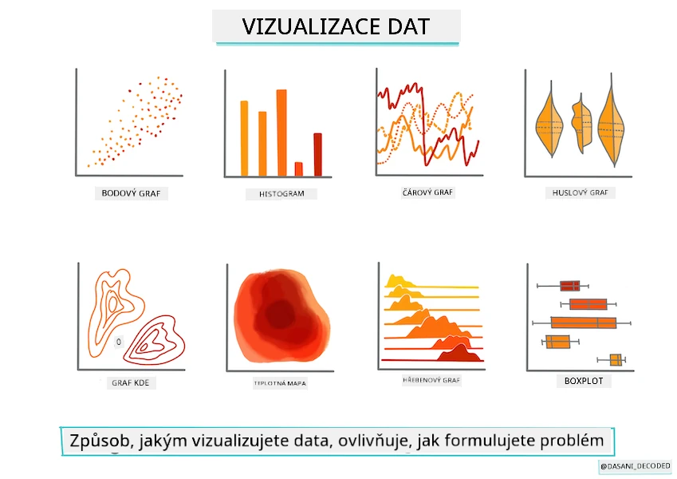
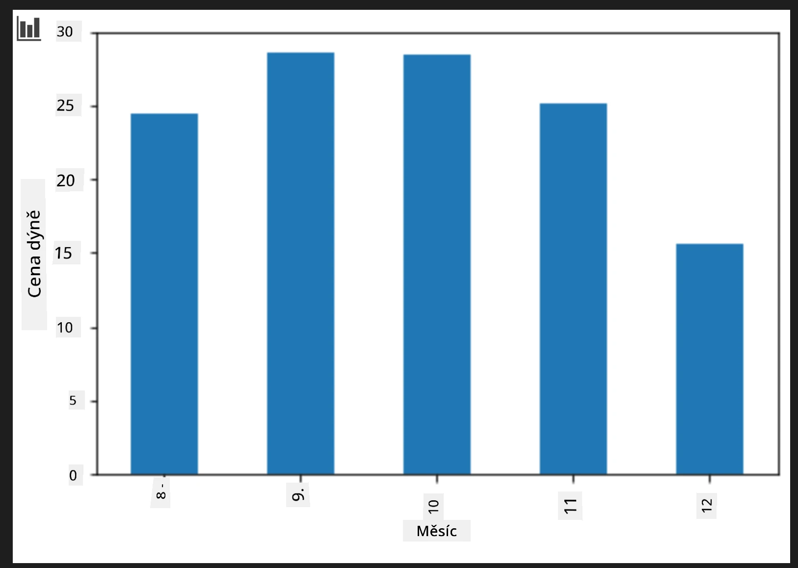
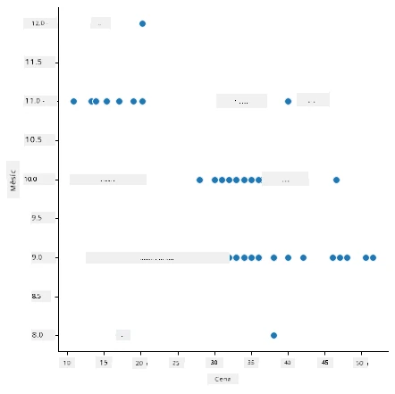
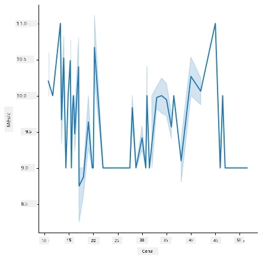
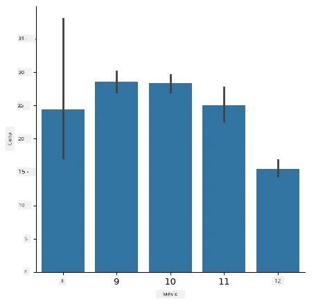
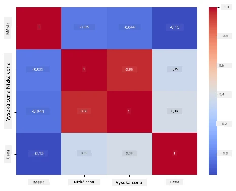

# Vytvoření regresního modelu pomocí Scikit-learn: příprava a vizualizace dat



Infografika od [Dasani Madipalli](https://twitter.com/dasani_decoded)

## [Kvíz před lekcí](https://ff-quizzes.netlify.app/en/ml/)

> ### [Tato lekce je dostupná i v R!](../../../../2-Regression/2-Data/solution/R/lesson_2.html)

## Úvod

Nyní, když máte připravené nástroje potřebné k začátku tvorby strojového učení s Scikit-learn, jste připraveni začít pokládat otázky svým datům. Při práci s daty a aplikaci ML řešení je velmi důležité vědět, jak správně otázky klást, aby bylo možné správně odemknout potenciály vaší datové sady.

V této lekci se naučíte:

- Jak připravit svá data pro tvorbu modelu.
- Jak používat Matplotlib pro vizualizaci dat.
- Jak používat Seaborn pro expresivnější vizualizaci dat.

## Klást správné otázky svým datům

Otázka, na kterou potřebujete znát odpověď, určí, jaký typ ML algoritmů budete využívat. A kvalita odpovědi, kterou obdržíte, bude silně záviset na povaze vašich dat.

Podívejte se na [data](https://github.com/microsoft/ML-For-Beginners/blob/main/2-Regression/data/US-pumpkins.csv) poskytnutá pro tuto lekci. Tento .csv soubor si můžete otevřít ve VS Code. Rychlý pohled okamžitě ukáže, že tam jsou prázdná místa a mix textových a číselných dat. Také je tam zvláštní sloupec s názvem 'Package', kde jsou data smíšená mezi 'sacky', 'koše' a další hodnoty. Data jsou vlastně trochu nepořádek.

[](https://youtu.be/5qGjczWTrDQ "ML pro začátečníky - Jak analyzovat a čistit datovou sadu")

> 🎥 Klikněte na obrázek výše pro krátké video o přípravě dat pro tuto lekci.

Ve skutečnosti není moc běžné dostat datovou sadu, která je zcela připravená k okamžitému použití pro vytvoření ML modelu. V této lekci se naučíte, jak připravit surová data pomocí standardních knihoven Pythonu. Také poznáte různé techniky vizualizace dat.

## Případová studie: 'trh s dýněmi'

V této složce najdete .csv soubor v hlavní složce `data` nazvaný [US-pumpkins.csv](https://github.com/microsoft/ML-For-Beginners/blob/main/2-Regression/data/US-pumpkins.csv), který obsahuje 1757 řádků dat o trhu s dýněmi, rozdělených do skupin podle měst. Jedná se o surová data extrahovaná z [Specialty Crops Terminal Markets Standard Reports](https://www.marketnews.usda.gov/mnp/fv-report-config-step1?type=termPrice), distribuovaná Ministerstvem zemědělství USA.

### Příprava dat

Tato data jsou veřejně dostupná. Lze je stáhnout v mnoha oddělených souborech podle jednotlivých měst ze stránek USDA. Abychom se vyhnuli příliš mnoha samostatným souborům, spojili jsme všechna data ze měst do jedné tabulky, takže jsme data už trochu _připravili_. Nyní se podívejme podrobněji na data.

### Data o dýních - první závěry

Co si o těchto datech všimnete? Už jste viděli, že tam jsou smíšené texty, čísla, prázdná místa a zvláštní hodnoty, které je potřeba pochopit.

Jakou otázku můžete položit těmto datům využitím regresní techniky? Co třeba "Předpovědět cenu dýně na prodej během určitého měsíce". Když se znovu podíváte na data, je potřeba provést některé změny, abyste vytvořili datovou strukturu potřebnou pro tento úkol.
## Cvičení - analyzujte data o dýních

Použijme [Pandas](https://pandas.pydata.org/), (název znamená `Python Data Analysis`) nástroj velmi užitečný pro tvarování dat, pro analýzu a přípravu těchto dat o dýních.

### Nejprve zkontrolujte chybějící data

Nejprve bude potřeba prověřit případná chybějící data:

1. Převeďte data na formát měsíce (jedná se o americká data, takže formát je `MM/DD/YYYY`).
2. Extrahujte měsíc do nového sloupce.

Otevřete soubor _notebook.ipynb_ ve Visual Studio Code a naimportujte tabulku do nového Pandas dataframe.

1. Použijte funkci `head()` k zobrazení prvních pěti řádků.

    ```python
    import pandas as pd
    pumpkins = pd.read_csv('../data/US-pumpkins.csv')
    pumpkins.head()
    ```

    ✅ Jakou funkci použijete pro zobrazení posledních pěti řádků?

1. Zkontrolujte, zda v aktuálním dataframe nejsou chybějící data:

    ```python
    pumpkins.isnull().sum()
    ```

    Nějaká chybějící data jsou, ale možná to pro daný úkol nebude vadit.

1. Aby bylo snazší s dataframe pracovat, vyberte si jen sloupce, které potřebujete, použitím funkce `loc`, která z původního dataframe vybere skupinu řádků (jako první parametr) a sloupců (jako druhý parametr). Výraz `:` znamená "všechny řádky".

    ```python
    columns_to_select = ['Package', 'Low Price', 'High Price', 'Date']
    pumpkins = pumpkins.loc[:, columns_to_select]
    ```

### Druhé, určete průměrnou cenu dýně

Přemýšlejte, jak zjistit průměrnou cenu dýně za daný měsíc. Jaké sloupce byste pro tento úkol vybrali? Tip: potřebujete tři sloupce.

Řešení: vezměte průměr sloupců `Low Price` a `High Price` pro vyplnění nového sloupce Cena, a převeďte sloupec Date tak, aby ukazoval jen měsíc. Naštěstí podle předchozí kontroly chybí data pro datum nebo ceny.

1. Pro výpočet průměru přidejte následující kód:

    ```python
    price = (pumpkins['Low Price'] + pumpkins['High Price']) / 2

    month = pd.DatetimeIndex(pumpkins['Date']).month

    ```

   ✅ Klidně si vytiskněte jakákoliv data pomocí `print(month)`, chcete-li je zkontrolovat.

2. Nyní zkopírujte převedená data do nového Pandas dataframe:

    ```python
    new_pumpkins = pd.DataFrame({'Month': month, 'Package': pumpkins['Package'], 'Low Price': pumpkins['Low Price'],'High Price': pumpkins['High Price'], 'Price': price})
    ```

    Vytištěný dataframe vám ukáže čistou a přehlednou datovou sadu, na které můžete stavět svůj nový regresní model.

### Ale počkejte! Něco tu není v pořádku

Pokud se podíváte na sloupec `Package`, dýně jsou prodávány v mnoha různých konfiguracích. Některé jsou prodávány v měrách '1 1/9 koše', jiné v '1/2 koše', některé po kusech, jiné za libru, a některé ve velkých krabicích různé šířky.

> Dýně se zdá být velmi obtížné vážit konzistentně

Při zkoumání původních dat je zajímavé, že cokoli, kde je `Unit of Sale` rovno 'EACH' nebo 'PER BIN', má také typ `Package` ve znacích palec, koš nebo 'each'. Dýně se zdá být velmi obtížné vážit konzistentně, proto je vyfiltrujme tak, že vybereme jen dýně se stringem 'bushel' ve sloupci `Package`.

1. Přidejte filtr na začátek souboru, pod inicializační import .csv:

    ```python
    pumpkins = pumpkins[pumpkins['Package'].str.contains('bushel', case=True, regex=True)]
    ```

    Pokud nyní vytisknete data, můžete vidět, že se zobrazují jen asi 415 řádků obsahujících dýně podle košů.

### Ale počkejte! Ještě je potřeba něco udělat

Všimli jste si, že množství koše se liší podle řádku? Je potřeba normalizovat ceny tak, aby ukazovaly cenu za koš, takže proveďte matematické úpravy pro standardizaci.

1. Přidejte následující řádky po bloku vytvářejícím nový `new_pumpkins` dataframe:

    ```python
    new_pumpkins.loc[new_pumpkins['Package'].str.contains('1 1/9'), 'Price'] = price/(1 + 1/9)

    new_pumpkins.loc[new_pumpkins['Package'].str.contains('1/2'), 'Price'] = price/(1/2)
    ```

✅ Podle [The Spruce Eats](https://www.thespruceeats.com/how-much-is-a-bushel-1389308) závisí váha koše na typu produktu, protože jde o měření objemu. "Koš rajčat například váží přibližně 56 liber... Listy a zelenina zabírají více místa a váží méně, takže koš špenátu váží pouze 20 liber." Je to poměrně komplikované! Raději nebudeme provádět převod koše na libry, a místo toho budeme ceny uvádět za koš. Toto studium objemu košů dýní však ukazuje, jak je důležité rozumět povaze svých dat!

Nyní můžete analyzovat ceny za jednotku podle jejich měření košem. Pokud data vytisknete znovu, uvidíte, jak jsou standardizovaná.

✅ Všimli jste si, že dýně prodávané po polovině koše jsou velmi drahé? Dokážete přijít na důvod? Tip: malé dýně jsou mnohem dražší než velké, pravděpodobně proto, že jich je v koši mnohem více, vzhledem k nevyužitému prostoru zabranému jednou velkou dutou dýní na koláč.

## Strategie vizualizace

Částí práce datového vědce je ukázat kvalitu a povahu dat, se kterými pracuje. Často vytváří zajímavé vizualizace, tedy grafy, diagramy a schémata, ukazující různé aspekty dat. Tímto způsobem mohou vizuálně ukázat vztahy a mezery, které by jinak byly těžko odhalitelné.

[](https://youtu.be/SbUkxH6IJo0 "ML pro začátečníky - Jak vizualizovat data s Matplotlib")

> 🎥 Klikněte na obrázek výše pro krátké video o tom, jak vizualizovat data pro tuto lekci.

Vizualizace také mohou pomoci určit nejvhodnější techniku strojového učení pro daná data. Například rozptylový graf, který následuje přímku, naznačuje, že data jsou dobrým kandidátem pro úlohu lineární regrese.

Jedna knihovna pro vizualizaci dat, která dobře funguje v Jupyter noteboocích, je [Matplotlib](https://matplotlib.org/) (kterou jste také viděli v předchozí lekci).

> Získejte více zkušeností s vizualizací dat v [těchto návodech](https://docs.microsoft.com/learn/modules/explore-analyze-data-with-python?WT.mc_id=academic-77952-leestott).

## Cvičení - experimentujte s Matplotlib

Zkuste vytvořit základní grafy pro zobrazení nového dataframe, který jste právě vytvořili. Co by základní čárový graf ukázal?

1. Naimportujte Matplotlib na začátku souboru, pod import Pandas:

    ```python
    import matplotlib.pyplot as plt
    ```

1. Znovu spusťte celý notebook pro jeho obnovení.
1. Na konci notebooku přidejte buňku pro vykreslení dat jako box:

    ```python
    price = new_pumpkins.Price
    month = new_pumpkins.Month
    plt.scatter(price, month)
    plt.show()
    ```

    

    Je to užitečný graf? Překvapí vás na něm něco?

    Není příliš užitečný, protože pouze zobrazuje vaše data jako rozptyl bodů pro daný měsíc.

### Aby byl užitečný

Pro zobrazení užitečných dat obvykle potřebujete data nějak seskupit. Zkuste vytvořit graf, kde osa y bude zobrazovat měsíce a graf ukáže rozložení dat.

1. Přidejte buňku, která vytvoří seskupený sloupcový graf:

    ```python
    new_pumpkins.groupby(['Month'])['Price'].mean().plot(kind='bar')
    plt.ylabel("Pumpkin Price")
    ```

    

    Toto je užitečnější vizualizace dat! Zdá se, že nejvyšší cena dýní nastává v září a říjnu. Odpovídá to vašim očekáváním? Proč ano, nebo proč ne?

## Cvičení - experimentujte se Seaborn

Matplotlib je mocný, ale tvorba dokonale vypadajícího grafu může vyžadovat hodně kódu. [Seaborn](https://seaborn.pydata.org/) je knihovna postavená _nad_ Matplotlib navržená pro statistickou vizualizaci dat. Pracuje přímo s Pandas dataframe, aplikuje příjemné výchozí styly a umožňuje vytvářet informativní grafy s mnohem menším množstvím kódu. Protože Seaborn vrací objekty Matplotlib, můžete stále používat vše, co už o Matplotlib víte, k doladění výsledku.

> Pokud ještě nemáte Seaborn nainstalovaný, nainstalujte jej pomocí `pip install seaborn`.

1. Naimportujte Seaborn na začátku notebooku, pod ostatní importy. Obvykle se importuje jako `sns`:

    ```python
    import seaborn as sns
    ```

### Rozptylové grafy pro ukázku vztahů

Velká část prozkoumávání dat před tvorbou modelu spočívá ve hledání _vztahů_ mezi proměnnými. [Rozptylový graf](https://cs.wikipedia.org/wiki/XY_graf) je jedním z nejlepších nástrojů pro toto: pokud body vypadají, že následují přímku, tyto dvě proměnné mohou být korelované, což je dobré znamení, že model lineární regrese by mohl fungovat.

1. Znovu vytvořte scatterplot ceny vůči měsíci, tentokrát pomocí Seaborn funkce [`relplot()`](https://seaborn.pydata.org/generated/seaborn.relplot.html) (relační graf), která pracuje přímo s vašimi databázovými sloupci:

    ```python
    sns.relplot(x="Price", y="Month", data=new_pumpkins)
    ```

    

    Všimněte si, jak předáváte _názvy sloupců_ a dataframe a Seaborn pak za vás přidá popisky os.

2. Můžete změnit graf na čárový pomocí `kind="line"`. Seaborn dokonce vykreslí stinný pruh ukazující interval spolehlivosti kolem čáry:

    ```python
    sns.relplot(x="Price", y="Month", kind="line", data=new_pumpkins)
    ```

    

    Tato konkrétní data jsou poměrně hlučná, takže čárový graf zde není nejjasnější volbou — ale ukazuje, jak snadno lze v Seaborn měnit typ grafu.

### Sloupcové grafy pro zobrazení rozložení


Dříve jste data ručně seskupili, abyste vytvořili pruhový graf pomocí Matplotlib. Seabornova funkce [`catplot()`](https://seaborn.pydata.org/generated/seaborn.catplot.html) (kategorický graf) může seskupování a agregaci udělat za vás. Ve výchozím nastavení `kind="bar"` zobrazuje průměr každé kategorie spolu s černou čarou označující interval spolehlivosti.

1. Vytvořte pruhový graf průměrné ceny za měsíc:

    ```python
    sns.catplot(x="Month", y="Price", data=new_pumpkins, kind="bar")
    ```

    

    To potvrzuje to, co jste viděli v Matplotlibu — ceny vrcholí kolem září a října — ale Seaborn také vizualizuje, jak moc se cena _liší_ v rámci jednotlivých měsíců.

### Tepelné mapy pro zobrazení korelací

Bodové grafy porovnávají vždy dva proměnné najednou. Když máte několik číselných sloupců, [tepelná mapa](https://en.wikipedia.org/wiki/Heat_map) vám umožňuje zobrazit sílu vztahu mezi _každým_ párem sloupců najednou. Toto je běžný způsob, jak zjistit, které prvky jsou nejvíce korelované před výběrem toho, co použít do modelu (a stejný typ grafu se později používá k zobrazení matic záměny v klasifikaci).

1. Vytvořte korelační matici pomocí Pandas a pak ji nakreslete pomocí Seabornovy funkce [`heatmap()`](https://seaborn.pydata.org/generated/seaborn.heatmap.html). Možnost `annot=True` vytiskne hodnoty korelace do každé buňky:

    ```python
    correlations = new_pumpkins[['Month', 'Low Price', 'High Price', 'Price']].corr()
    sns.heatmap(correlations, annot=True, cmap="coolwarm")
    ```

    

    Hodnoty blízké `1` (nebo `-1`) znamenají, že sloupce jsou silně _lineárně_ korelované. Všimněte si, že `Low Price` a `High Price` jsou téměř dokonale korelované. `Month` naopak vykazuje pouze slabou lineární korelaci s cenou — ačkoli pruhový graf výše ukázal zřetelný sezonní vrchol v září a říjnu. To je důležitá lekce: korelační koeficient měří pouze _přímočaré_ vztahy, takže může přehlédnout sezónní či jiné nelineární vzory. ✅ Proč je užitečné podívat se před rozhodnutím, které sloupce použít, jak na tepelnou mapu, *tak* na grafy jako pruhový graf?

### Matplotlib nebo Seaborn?

Obě knihovny stojí za to znát:

- **Matplotlib** vám dává detailní kontrolu nad každým prvkem grafu a je základem, na kterém staví téměř všechny ostatní Python knihovny pro grafiku.
- **Seaborn** poskytuje vyšší úroveň funkcí a atraktivní výchozí nastavení pro statistické grafy, pracuje přímo s datovými rámci a často je rychlejší pro průzkumnou analýzu dat.

Běžný pracovní postup je začít Seabornem pro rychlý průzkum dat a poté přejít do Matplotlibu, když chcete přizpůsobit detaily.

---

## 🚀Výzva

Prozkoumejte různé typy vizualizací, které Matplotlib a Seaborn nabízejí. Které typy jsou nejvhodnější pro regresní problémy?

## [Kvíz po přednášce](https://ff-quizzes.netlify.app/en/ml/)

## Přehled a samostudium

Podívejte se na mnoho způsobů, jak vizualizovat data. Vytvořte seznam dostupných knihoven a poznamenejte, které jsou nejlepší pro různé typy úkolů, například 2D vizualizace vs. 3D vizualizace. Co objevíte?

## Zadání

[Prozkoumání vizualizace](assignment.md)

---

<!-- CO-OP TRANSLATOR DISCLAIMER START -->
**Prohlášení o omezení odpovědnosti**:
Tento dokument byl přeložen pomocí AI překladatelské služby [Co-op Translator](https://github.com/Azure/co-op-translator). Přestože usilujeme o co největší přesnost, mějte prosím na paměti, že automatizované překlady mohou obsahovat chyby nebo nepřesnosti. Originální dokument v jeho mateřském jazyce by měl být považován za autoritativní zdroj. Pro kritické informace se doporučuje profesionální lidský překlad. Nejsme odpovědní za jakékoli nedorozumění nebo nesprávné interpretace vzniklé použitím tohoto překladu.
<!-- CO-OP TRANSLATOR DISCLAIMER END -->