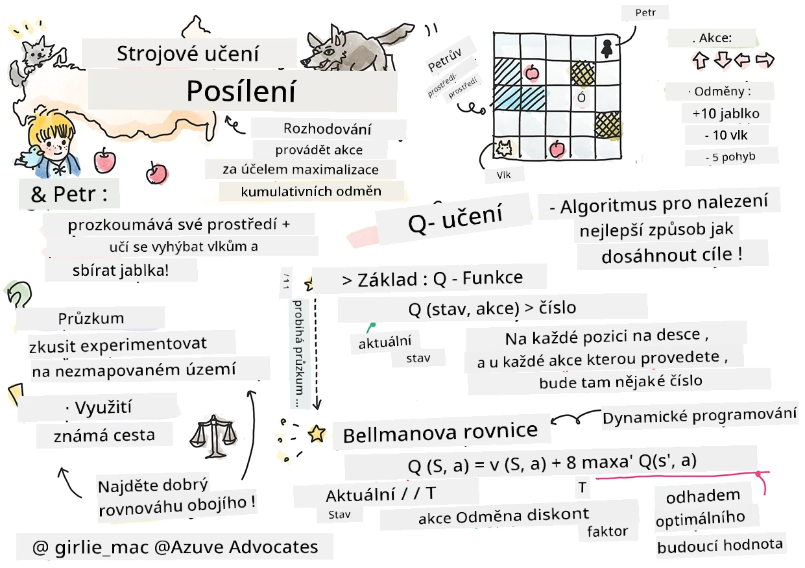

# Úvod do posilovaného učení a Q-učení


> Sketchnote od [Tomomi Imura](https://www.twitter.com/girlie_mac)

Posilované učení zahrnuje tři důležité koncepty: agenta, nějaké stavy a sadu akcí pro každý stav. Provedením akce ve specifikovaném stavu agent obdrží odměnu. Opět si představte počítačovou hru Super Mario. Jste Mario, jste v úrovni hry, stojíte vedle okraje útesu. Nad vámi je mince. Vy jako Mario, v úrovni hry, na konkrétní pozici ... to je váš stav. Posun o krok doprava (akce) by vás přivedl přes hranu, což by vám přineslo nízké číselné skóre. Nicméně stisknutí tlačítka skoku by vám dovolilo získat bod a zůstat naživu. To je pozitivní výsledek a měl by být oceněn kladným číselným skóre.

Použitím posilovaného učení a simulátoru (hry) se můžete naučit, jak hrát hru tak, aby bylo dosaženo maximální odměny, což je přežití a získání co nejvíce bodů.

[](https://www.youtube.com/watch?v=lDq_en8RNOo)

> 🎥 Klikněte na obrázek výše a poslechněte si Dmitryho, jak diskutuje o posilovaném učení

## [Přednáškový kvíz](https://ff-quizzes.netlify.app/en/ml/)

## Požadavky a nastavení

V této lekci budeme experimentovat s kódem v Pythonu. Měli byste být schopni spustit kód Jupyter Notebooku z této lekce, buď na svém počítači nebo někde v cloudu.

Můžete otevřít [notebook lekce](https://github.com/microsoft/ML-For-Beginners/blob/main/8-Reinforcement/1-QLearning/notebook.ipynb) a projít si tuto lekci krok za krokem.

> **Poznámka:** Pokud otevíráte tento kód z cloudu, je také potřeba stáhnout soubor [`rlboard.py`](https://github.com/microsoft/ML-For-Beginners/blob/main/8-Reinforcement/1-QLearning/rlboard.py), který se používá v kódu notebooku. Přidejte jej do stejného adresáře jako notebook.

## Úvod

V této lekci prozkoumáme svět **[Petra a vlka](https://cs.wikipedia.org/wiki/Petr_a_vlk)**, inspirovaný hudební pohádkou od ruského skladatele, [Sergeje Prokofjeva](https://en.wikipedia.org/wiki/Sergei_Prokofiev). Použijeme **posilované učení**, aby Petr prozkoumal své prostředí, sbíral chutná jablka a vyhnul se setkání s vlkem.

**Posilované učení** (RL) je učební technika, která nám umožňuje naučit se optimální chování **agenta** v nějakém **prostředí** pomocí mnoha experimentů. Agent v tomto prostředí by měl mít nějaký **cíl**, definovaný **funkcí odměny**.

## Prostředí

Pro jednoduchost si představme Petrův svět jako čtvercovou desku o rozměrech `width` x `height`, takto:


Každá buňka v této desce může být:

* **země**, po které mohou Petr a další tvory chodit.
* **voda**, po které samozřejmě chodit nelze.
* **strom** nebo **tráva**, místo, kde si můžete odpočinout.
* **jablko**, které představuje něco, co by Petr rád našel, aby se nasytit.
* **vlk**, který je nebezpečný a měl by být vyhnut.

Existuje samostatný Python modul, [`rlboard.py`](https://github.com/microsoft/ML-For-Beginners/blob/main/8-Reinforcement/1-QLearning/rlboard.py), který obsahuje kód pro práci s tímto prostředím. Jelikož tento kód není důležitý pro pochopení našich konceptů, naimportujeme modul a použijeme jej k vytvoření pracovní desky (blok kódu 1):

```python
from rlboard import *

width, height = 8,8
m = Board(width,height)
m.randomize(seed=13)
m.plot()
```

Tento kód by měl vypsat obrázek prostředí podobný tomuto výše.

## Akce a politika

V našem příkladu by Petrův cíl byl najít jablko a zároveň se vyhnout vlkovi a jiným překážkám. Aby toho dosáhl, může v podstatě chodit dokola, dokud nenajde jablko.

Proto může na jakékoli pozici vybírat jednu z následujících akcí: nahoru, dolů, vlevo a vpravo.

Tyto akce definujeme jako slovník a namapujeme je na dvojice odpovídajících změn souřadnic. Například pohyb vpravo (`R`) odpovídá dvojici `(1,0)`. (blok kódu 2):

```python
actions = { "U" : (0,-1), "D" : (0,1), "L" : (-1,0), "R" : (1,0) }
action_idx = { a : i for i,a in enumerate(actions.keys()) }
```

Na závěr je strategie a cíl tohoto scénáře následující:

- **Strategie**, našeho agenta (Petra) je definována tzv. **politikou**. Politika je funkce, která vrací akci pro daný stav. V našem případě je stav problému reprezentován deskou včetně aktuální pozice hráče.

- **Cíl**, posilovaného učení je nakonec naučit se dobrou politiku, která nám umožní problém efektivně vyřešit. Nicméně jako základní přístup vezměme nejjednodušší politiku nazvanou **náhodná chůze**.

## Náhodná chůze

Nejdříve vyřešíme náš problém implementací strategie náhodné chůze. Při náhodné chůzi náhodně vybereme další akci ze povolených akcí, dokud nedosáhneme jablka (blok kódu 3).

1. Implementujte náhodnou chůzi pomocí kódu níže:

    ```python
    def random_policy(m):
        return random.choice(list(actions))
    
    def walk(m,policy,start_position=None):
        n = 0 # počet kroků
        # nastav počáteční pozici
        if start_position:
            m.human = start_position 
        else:
            m.random_start()
        while True:
            if m.at() == Board.Cell.apple:
                return n # úspěch!
            if m.at() in [Board.Cell.wolf, Board.Cell.water]:
                return -1 # snězen vlkem nebo utonut
            while True:
                a = actions[policy(m)]
                new_pos = m.move_pos(m.human,a)
                if m.is_valid(new_pos) and m.at(new_pos)!=Board.Cell.water:
                    m.move(a) # proveď skutečný pohyb
                    break
            n+=1
    
    walk(m,random_policy)
    ```

    Volání `walk` by mělo vrátit délku odpovídající cesty, která se může při různých bězích lišit. 

1. Proveďte experiment chůze několikrát (např. 100x) a vytiskněte získanou statistiku (blok kódu 4):

    ```python
    def print_statistics(policy):
        s,w,n = 0,0,0
        for _ in range(100):
            z = walk(m,policy)
            if z<0:
                w+=1
            else:
                s += z
                n += 1
        print(f"Average path length = {s/n}, eaten by wolf: {w} times")
    
    print_statistics(random_policy)
    ```

    Všimněte si, že průměrná délka cesty je kolem 30-40 kroků, což je dost, vzhledem k tomu, že průměrná vzdálenost k nejbližšímu jablku je kolem 5-6 kroků.

    Můžete také vidět, jak vypadají Petrovy pohyby během náhodné chůze:

    

## Funkce odměny

Abychom naši politiku učinili inteligentnější, musíme pochopit, které kroky jsou „lepší“ než jiné. K tomu je potřeba definovat náš cíl.

Cíl můžeme definovat pomocí **funkce odměny**, která vrací určitou hodnotu skóre pro každý stav. Čím vyšší číslo, tím lepší odměna. (blok kódu 5)

```python
move_reward = -0.1
goal_reward = 10
end_reward = -10

def reward(m,pos=None):
    pos = pos or m.human
    if not m.is_valid(pos):
        return end_reward
    x = m.at(pos)
    if x==Board.Cell.water or x == Board.Cell.wolf:
        return end_reward
    if x==Board.Cell.apple:
        return goal_reward
    return move_reward
```

Zajímavé na funkcích odměny je to, že většinou *dostáváme podstatnou odměnu až na konci hry*. To znamená, že algoritmus by měl nějak pamatovat „dobré“ kroky vedoucí k pozitivní odměně na konci a zvyšovat jejich váhu. Podobně by měly být odrazovány kroky vedoucí k špatným výsledkům.

## Q-učení

Algoritmus, který zde diskutujeme, se nazývá **Q-učení**. V tomto algoritmu je politika definována funkcí (nebo datovou strukturou) nazývanou **Q-tabulka**. Ta zaznamenává „dobrý“ nebo „špatný“ vliv každé akce v daném stavu.

Nazývá se Q-tabulka, protože je často pohodlné ji představit jako tabulku nebo vícerozměrné pole. Protože má naše deska rozměry `width` x `height`, můžeme Q-tabulku reprezentovat pomocí numpy pole tvaru `width` x `height` x `len(actions)`: (blok kódu 6)

```python
Q = np.ones((width,height,len(actions)),dtype=np.float)*1.0/len(actions)
```

Všimněte si, že všechny hodnoty Q-tabulky inicializujeme na stejnou hodnotu, v našem případě 0,25. To odpovídá politice „náhodné chůze“, protože všechny akce v každém stavu jsou stejně dobré. Můžeme předat Q-tabulku funkci `plot` pro vizualizaci tabulky na desce: `m.plot(Q)`.


Ve středu každé buňky je „šípka“, která ukazuje preferovaný směr pohybu. Protože jsou všechny směry stejné, zobrazuje se tečka.

Nyní potřebujeme spustit simulaci, prozkoumat naše prostředí a naučit se lepší rozdělení hodnot v Q-tabulce, které nám umožní najít cestu k jablku mnohem rychleji.

## Podstata Q-učení: Bellmanova rovnice

Jakmile začneme pohybovat, každá akce bude mít odpovídající odměnu, tedy teoreticky můžeme zvolit další akci na základě nejvyšší okamžité odměny. Nicméně v většině stavů tah nepřinese cíl dosáhnout jablko, a proto nemůžeme ihned rozhodnout, který směr je lepší.

> Pamatujte, že ne okamžitý výsledek je důležitý, ale konečný výsledek, kterého dosáhneme na konci simulace.

Abychom mohli zohlednit tuto odloženou odměnu, musíme použít principy **[dynamického programování](https://cs.wikipedia.org/wiki/Dynamick%C3%A9_programov%C3%A1n%C3%AD)**, které nám umožňují uvažovat o našem problému rekurzivně.

Předpokládejme, že jsme nyní ve stavu *s* a chceme přejít do dalšího stavu *s'*. Tímto dostaneme okamžitou odměnu *r(s,a)*, definovanou funkcí odměny, plus nějakou budoucí odměnu. Pokud předpokládáme, že naše Q-tabulka správně odráží „atraktivitu“ každé akce, pak ve stavu *s'* zvolíme akci *a*, která odpovídá maximální hodnotě *Q(s',a')*. Nejlepší možná budoucí odměna ve stavu *s* bude tedy definována jako `max`<sub>a'</sub>*Q(s',a')* (maximum je počítáno přes všechny možné akce *a'* ve stavu *s'*).

To nám dává **Bellmanův vzorec** pro výpočet hodnoty Q-tabule ve stavu *s*, vzhledem k akci *a*:


Zde γ je tzv. **diskontní faktor**, který určuje, do jaké míry byste měli preferovat současnou odměnu před budoucí odměnou a naopak.

## Učební algoritmus

Na základě výše uvedené rovnice nyní můžeme napsat pseudokód našeho učebního algoritmu:

* Inicializujte Q-tabulku Q stejnými čísly pro všechny stavy a akce
* Nastavte rychlost učení α ← 1
* Opakujte simulaci mnohokrát
   1. Začněte na náhodné pozici
   1. Opakujte
        1. Vyberte akci *a* ve stavu *s*
        2. Proveďte akci přesunem do nového stavu *s'*
        3. Pokud narazíme na konec hry, nebo je celková odměna příliš malá - ukončete simulaci  
        4. Spočítejte odměnu *r* v novém stavu
        5. Aktualizujte Q-funkci podle Bellmanovy rovnice: *Q(s,a)* ← *(1-α)Q(s,a)+α(r+γ max<sub>a'</sub>Q(s',a'))*
        6. *s* ← *s'*
        7. Aktualizujte celkovou odměnu a snižte α.

## Využití vs. průzkum

V výše uvedeném algoritmu jsme nespecifikovali, jak přesně vybrat akci v kroku 2.1. Pokud vybíráme akci náhodně, budeme náhodně **průzkoumávat** prostředí a je pravděpodobné, že často zemřeme a budeme prozkoumávat oblasti, kam bychom normálně nešli. Alternativní přístup je **využívat** hodnoty Q-tabulky, které už známe, a zvolit nejlepší akci (s vyšší hodnotou Q) ve stavu *s*. To nás však připraví o průzkum jiných stavů a pravděpodobně nenajdeme optimální řešení.

Nejlepší tedy je najít rovnováhu mezi průzkumem a využíváním. To lze udělat tak, že akci ve stavu *s* zvolíme s pravděpodobností úměrnou hodnotám v Q-tabulce. Na začátku, když jsou všechny hodnoty Q-tabulek stejné, to odpovídá náhodnému výběru, ale jak se učíme více o prostředí, pravděpodobněji půjdeme optimální cestou, přičemž agent si občas zvolí neprozkoumanou cestu.

## Implementace v Pythonu

Jsme nyní připraveni implementovat učební algoritmus. Než to uděláme, potřebujeme také funkci, která převede libovolná čísla v Q-tabulce na vektor pravděpodobností pro odpovídající akce.

1. Vytvořte funkci `probs()`:

    ```python
    def probs(v,eps=1e-4):
        v = v-v.min()+eps
        v = v/v.sum()
        return v
    ```

    Přidáváme několik `eps` k původnímu vektoru, abychom se vyhnuli dělení nulou v počátečním případě, kdy jsou všechny složky vektoru stejné.

Proveďte učební algoritmus přes 5000 experimentů, nazývaných také **epochy**: (blok kódu 8)
```python
    for epoch in range(5000):
    
        # Vyberte počáteční bod
        m.random_start()
        
        # Začněte cestovat
        n=0
        cum_reward = 0
        while True:
            x,y = m.human
            v = probs(Q[x,y])
            a = random.choices(list(actions),weights=v)[0]
            dpos = actions[a]
            m.move(dpos,check_correctness=False) # dovolujeme hráči pohybovat se mimo plán, což ukončuje epizodu
            r = reward(m)
            cum_reward += r
            if r==end_reward or cum_reward < -1000:
                lpath.append(n)
                break
            alpha = np.exp(-n / 10e5)
            gamma = 0.5
            ai = action_idx[a]
            Q[x,y,ai] = (1 - alpha) * Q[x,y,ai] + alpha * (r + gamma * Q[x+dpos[0], y+dpos[1]].max())
            n+=1
```

Po provedení tohoto algoritmu by měla být Q-tabulka aktualizována hodnotami definujícími atraktivitu různých akcí v každém kroku. Můžeme zkusit vizualizovat Q-tabulku vykreslením vektoru v každé buňce, který bude ukazovat požadovaný směr pohybu. Pro jednoduchost kreslíme malý kruh místo šipky.


## Kontrola politiky

Protože Q-tabulka uvádí „atraktivitu“ každé akce v každém stavu, je poměrně jednoduché ji použít k definování efektivní navigace v našem světě. V nejjednodušším případě můžeme vybrat akci odpovídající nejvyšší hodnotě v Q-tabulce: (blok kódu 9)

```python
def qpolicy_strict(m):
        x,y = m.human
        v = probs(Q[x,y])
        a = list(actions)[np.argmax(v)]
        return a

walk(m,qpolicy_strict)
```


> Pokud vyzkoušíte výše uvedený kód několikrát, můžete si všimnout, že se někdy "zasekne" a je potřeba v notebooku stisknout tlačítko STOP k jeho přerušení. To se děje proto, že mohou nastat situace, kdy dva stavy „ukazují“ na sebe z hlediska optimální hodnoty Q (Q-Value), v takovém případě agent skončí pohybováním se mezi těmito stavy donekonečna.

## 🚀Výzva

> **Úkol 1:** Upravte funkci `walk` tak, aby omezila maximální délku cesty na určitý počet kroků (například 100), a sledujte, jak výše uvedený kód tuto hodnotu občas vrací.

> **Úkol 2:** Upravte funkci `walk` tak, aby se nevracela na místa, kde již dříve byla. Tím se zabrání zasekávání funkce `walk`, ovšem agent se může i tak ocitnout „uvězněn“ na místě, ze kterého není schopen uniknout.

## Navigace

Lepší navigační politikou bude ta, kterou jsme používali během tréninku, kombinující využití poznatků a průzkum. V této politice vybereme každou akci s určitou pravděpodobností, úměrnou hodnotám v Q-tabuli. Tato strategie může stále způsobit, že se agent vrátí na místo, které již prozkoumal, ale jak je vidět z níže uvedeného kódu, vede to k velmi krátké průměrné délce cesty k požadovanému cíli (pamatujte, že `print_statistics` spouští simulaci 100x): (kódový blok 10)

```python
def qpolicy(m):
        x,y = m.human
        v = probs(Q[x,y])
        a = random.choices(list(actions),weights=v)[0]
        return a

print_statistics(qpolicy)
```

Po spuštění tohoto kódu byste měli dostat mnohem menší průměrnou délku cesty než dříve, v rozsahu 3–6.

## Zkoumání procesu učení

Jak jsme zmínili, proces učení je rovnováha mezi průzkumem a využíváním získaných znalostí o struktuře problémového prostoru. Viděli jsme, že výsledky učení (schopnost pomoci agentovi najít krátkou cestu k cíli) se zlepšily, ale je také zajímavé sledovat, jak se průměrná délka cesty chová během procesu učení:


Učení lze shrnout takto:

- **Průměrná délka cesty roste**. Vidíme zde, že ze začátku průměrná délka cesty roste. Pravděpodobně je to způsobeno tím, že když o prostředí nic nevíme, je pravděpodobné, že uvízneme ve špatných stavech, vodě nebo vlkovi. Jak se učíme a začneme tyto znalosti používat, můžeme prostředí prozkoumávat déle, ale stále ještě nevíme, kde jsou jablka.

- **Délka cesty klesá, jak se učíme více**. Jakmile se naučíme dost, agentovi se snáz podaří dosáhnout cíle a délka cesty začne klesat. Přesto máme stále otevřený průzkum, takže se často odchylujeme od nejlepší cesty a snažíme se prozkoumat nové možnosti, což dělá cestu delší než optimální.

- **Délka náhle stoupne**. Na tomto grafu také pozorujeme, že v určitém bodě délka náhle vzrostla. To ukazuje na stochastickou povahu procesu a že můžeme v nějakém okamžiku „pokazit“ koeficienty Q-tabule přepsáním novými hodnotami. Toto by mělo být ideálně minimalizováno snížením rychlosti učení (například ke konci tréninku upravujeme hodnoty Q-tabule jen o malou hodnotu).

Celkově je důležité si uvědomit, že úspěch a kvalita procesu učení výrazně závisí na parametrech, jako je rychlost učení, pokles rychlosti učení a diskontní faktor. Tyto hodnoty se často nazývají **hyperparametry**, aby se odlišily od **parametrů**, které optimalizujeme během tréninku (například koeficienty Q-tabule). Proces hledání nejlepších hodnot hyperparametrů nazýváme **optimalizace hyperparametrů** a zaslouží si samostatné téma.

## [Kvíz po přednášce](https://ff-quizzes.netlify.app/en/ml/)

## Zadání 
[Realističtější svět](assignment.md)

---

<!-- CO-OP TRANSLATOR DISCLAIMER START -->
**Prohlášení o omezení odpovědnosti**:
Tento dokument byl přeložen pomocí AI překladatelské služby [Co-op Translator](https://github.com/Azure/co-op-translator). Přestože usilujeme o co největší přesnost, mějte prosím na paměti, že automatizované překlady mohou obsahovat chyby nebo nepřesnosti. Originální dokument v jeho mateřském jazyce by měl být považován za autoritativní zdroj. Pro kritické informace se doporučuje profesionální lidský překlad. Nejsme odpovědní za jakékoli nedorozumění nebo nesprávné interpretace vzniklé použitím tohoto překladu.
<!-- CO-OP TRANSLATOR DISCLAIMER END -->