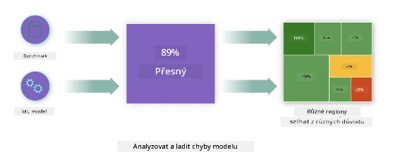
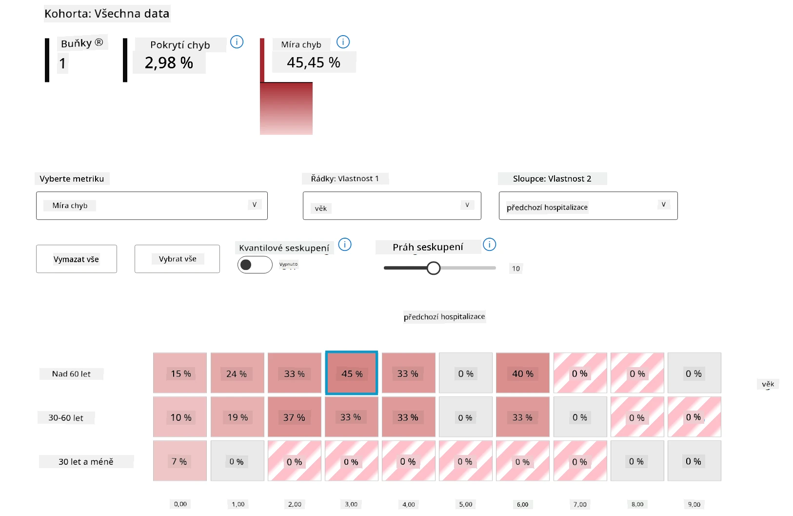
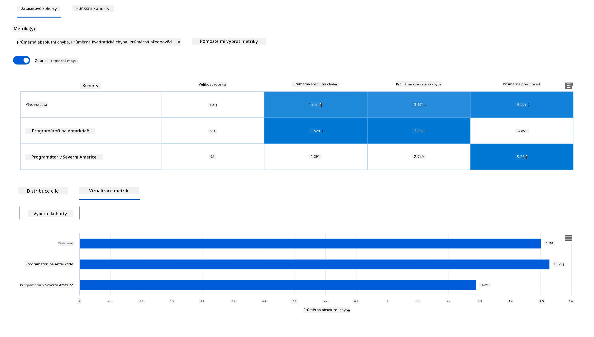
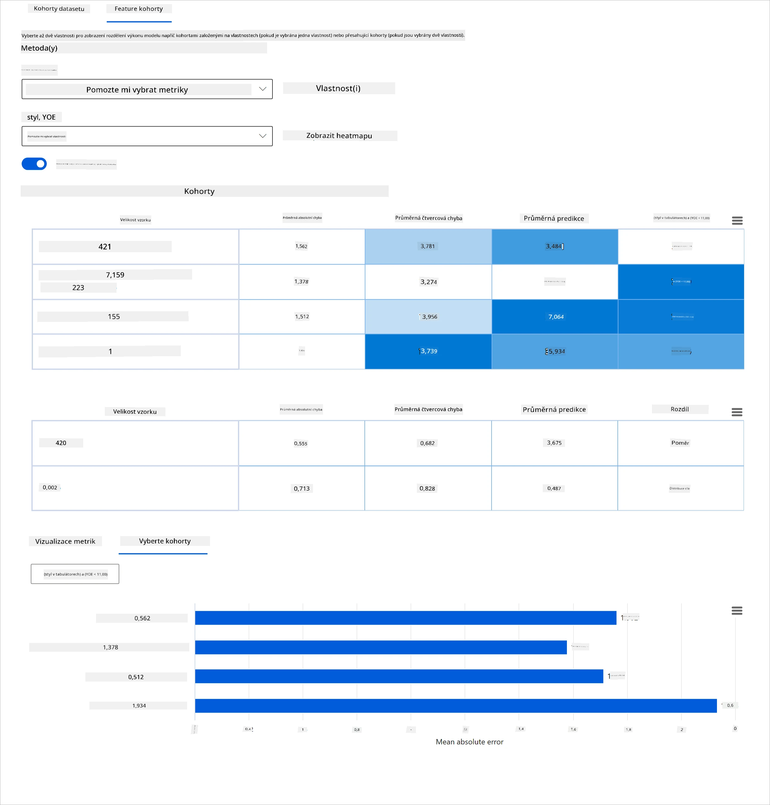
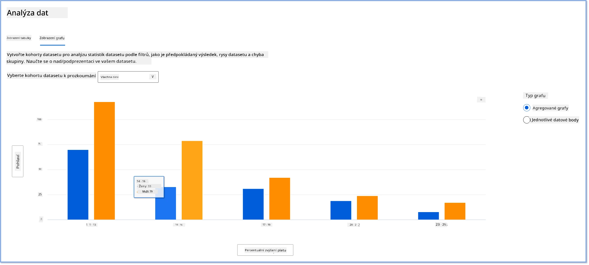
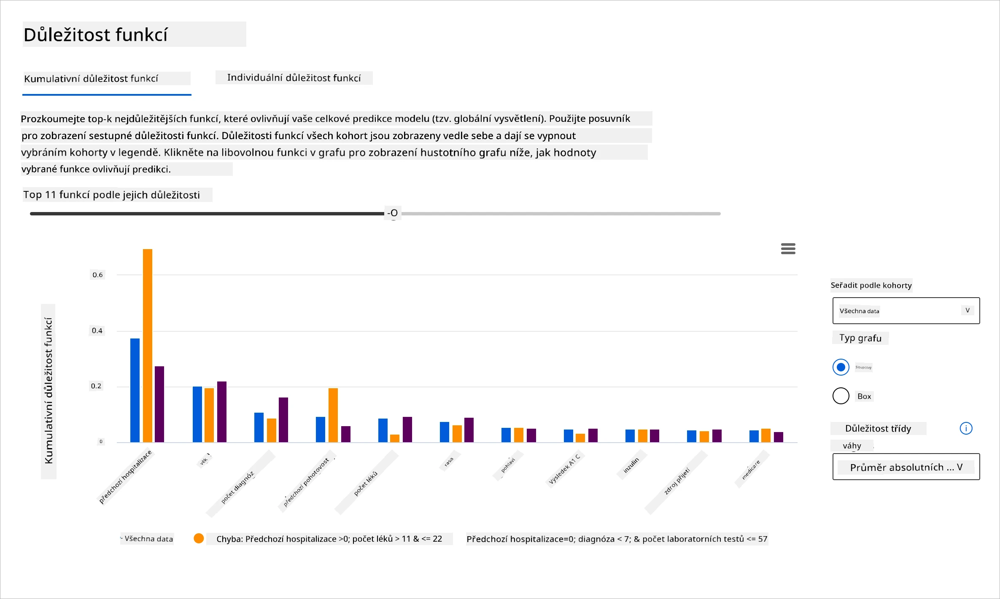
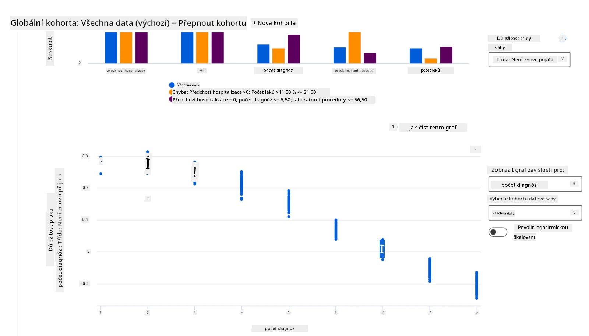

# Postscript: Ladění modelů v strojovém učení pomocí komponent panelu Responsible AI
 

## [Přednáškový kvíz](https://ff-quizzes.netlify.app/en/ml/)
 
## Úvod

Strojové učení ovlivňuje naše každodenní životy. Umělá inteligence nachází uplatnění v některých z nejdůležitějších systémů, které ovlivňují nás jako jednotlivce i naši společnost – od zdravotnictví, financí, vzdělávání až po zaměstnanost. Například systémy a modely jsou zapojeny do každodenního rozhodování, jako jsou zdravotní diagnózy nebo detekce podvodů. V důsledku toho jsou pokroky v AI spolu s urychleným zaváděním vystaveny rostoucím očekáváním společnosti a větší regulaci jako odpovědi na ně. Neustále vidíme oblasti, kde AI systémy nesplňují očekávání; odhalují nové výzvy; a vlády začínají regulovat AI řešení. Proto je důležité tyto modely analyzovat, aby poskytly spravedlivé, spolehlivé, inkluzivní, transparentní a zodpovědné výsledky pro všechny.

V tomto kurzu si ukážeme praktické nástroje, které lze použít k posouzení, zda model má problémy s odpovědnou AI. Tradiční techniky ladění modelů strojového učení bývají založeny na kvantitativních výpočtech, jako je agregovaná přesnost nebo průměrná ztráta chyby. Představte si, co se může stát, když data, která používáte k tvorbě těchto modelů, postrádají určité demografické skupiny, například rasu, pohlaví, politický názor, náboženství, nebo tyto skupiny nepřiměřeně zastupují. Co když se výstup modelu interpretuje tak, že preferuje některou demografickou skupinu? To může zavést nad- nebo podreprezentaci těchto citlivých skupin funkcí, což vede k problémům se spravedlností, inkluzivitou nebo spolehlivostí modelu. Dalším faktorem je, že modely strojového učení jsou považovány za černé skříňky, což ztěžuje pochopit a vysvětlit, co ovlivňuje předpověď modelu. Všechny tyto problémy čelí datoví vědci a vývojáři AI, pokud nemají adekvátní nástroje na ladění a hodnocení spravedlnosti nebo důvěryhodnosti modelu.

V této lekci se naučíte ladit své modely pomocí:

-	**Analýza chyb**: identifikovat, ve kterých částech datového rozdělení má model vysoké míry chyb.
-	**Přehled modelu**: provést komparativní analýzu napříč různými datovými kohortami k odhalení rozdílů ve výkonových metrikách modelu.
-	**Analýza dat**: zkoumat, kde může být v datech nad- nebo podreprezentace, která může naklonit model k preferování jedné demografické skupiny před jinou.
-	**Důležitost funkcí**: pochopit, které funkce ovlivňují předpovědi modelu na globální nebo lokální úrovni.

## Požadavky

Jako předpoklad prosím projděte recenzi [Responsible AI nástrojů pro vývojáře](https://www.microsoft.com/ai/ai-lab-responsible-ai-dashboard)

> 

## Analýza chyb

Tradiční metriky výkonnosti modelu používané k měření přesnosti jsou většinou výpočty založené na správných versus nesprávných předpovědích. Například zjištění, že model je přesný 89 % času s chybovou ztrátou 0,001, lze považovat za dobrý výkon. Chyby však často nejsou rovnoměrně rozděleny ve vašem základním datasetu. Můžete mít skóre přesnosti modelu 89 %, ale objevit, že v různých oblastech dat model selhává 42 % času. Důsledky těchto vzorců selhání v určitých datových skupinách mohou vést k problémům s férovostí nebo spolehlivostí. Je nezbytné pochopit oblasti, kde model funguje dobře nebo ne. Datové oblasti, kde je vysoký počet nepřesností v modelu, se mohou ukázat jako důležitá datová demografie.  

Komponenta Analýza chyb v panelu RAI znázorňuje, jak je selhání modelu rozloženo napříč různými kohortami pomocí vizualizace ve formě stromu. To je užitečné pro identifikaci funkcí nebo oblastí, kde je vysoká míra chyb v datasetu. Viděním, odkud pochází většina nepřesností modelu, můžete začít zkoumat jejich příčinu. Můžete také vytvářet datové kohorty pro provedení analýzy. Tyto datové kohorty pomáhají při ladění zjistit, proč je výkon modelu dobrý v jedné kohortě, ale chybný v jiné.   

Vizualní indikátory na stromové mapě pomáhají rychleji lokalizovat problémové oblasti. Například čím tmavší odstín červené barvy stromový uzel má, tím vyšší je míra chyb.  

Tepelná mapa je další funkcionalitou vizualizace, kterou mohou uživatelé využít k prozkoumání míry chyb pomocí jedné nebo dvou funkcí a najít příčinu modelových chyb v celém datasetu nebo kohortách.

Použijte analýzu chyb, když potřebujete:

* Získat hluboké pochopení, jak jsou selhání modelu rozložena v datasetu a přes několik vstupních a funkčních dimenzí.
* Rozložit agregované výkonové metriky k automatickému objevení chybných kohort pro informování cílených nápravných kroků.

## Přehled modelu

Hodnocení výkonnosti modelu strojového učení vyžaduje získat celkové pochopení jeho chování. To lze dosáhnout přezkoumáním více než jedné metriky, jako je míra chyb, přesnost, vybavování, preciznost nebo MAE (střední absolutní chyba), k nalezení rozdílů mezi výkonovými metrikami. Jedna metrika výkonu může vypadat skvěle, ale jiné metriky mohou odhalit nepřesnosti. Navíc porovnání metrik kvůli rozdílům v celém datasetu nebo kohortách pomáhá osvětlit, kde model funguje dobře a kde ne. To je obzvlášť důležité při sledování výkonu modelu mezi citlivými a necitlivými funkcemi (např. rasa, pohlaví nebo věk pacienta) k odhalení potenciální nespravedlnosti modelu. Například zjištění, že model je chybnější v kohortě s citlivými funkcemi, může odhalit možnou nespravedlnost modelu.

Komponenta Přehled modelu v panelu RAI pomáhá nejen analyzovat výkonové metriky datové reprezentace v kohortě, ale také dává uživatelům možnost porovnat chování modelu napříč různými kohortami.

Funkce analýzy podle funkcí komponenty umožňuje uživatelům zúžit podskupiny dat v konkrétní funkci k identifikaci anomálií na detailní úrovni. Například panel má vestavěnou inteligenci, která automaticky generuje kohorty pro uživatelem vybranou funkci (např. *"time_in_hospital < 3"* nebo *"time_in_hospital >= 7"*). To umožňuje uživateli izolovat konkrétní funkci z větší datové skupiny a zjistit, jestli je klíčovým faktorem pro chybné výsledky modelu.

Komponenta Přehled modelu podporuje dvě třídy metrik rozdílů:

**Rozdíly ve výkonu modelu**: Tyto metriky vypočítávají rozdíl (disparitu) v hodnotách vybrané výkonové metriky mezi podskupinami dat. Několik příkladů:

* Rozdíl v míře přesnosti
* Rozdíl v míře chyb
* Rozdíl v preciznosti
* Rozdíl v vybavování
* Rozdíl ve střední absolutní chybě (MAE)

**Rozdíl v míře výběru**: Tato metrika obsahuje rozdíl v míře výběru (příznivé předpovědi) mezi podskupinami. Příkladem je rozdíl v míře schvalování půjček. Míra výběru znamená podíl datových bodů v každé třídě klasifikovaných jako 1 (v binární klasifikaci) nebo rozdělení hodnot předpovědí (v regresi).

## Analýza dat

> "Pokud data dlouho mučíte, přiznají cokoliv" - Ronald Coase

Tento výrok zní extrémně, ale je pravda, že data lze manipulovat tak, aby podporovala jakýkoliv závěr. Taková manipulace může někdy nastat nevědomky. Jako lidé všichni máme své předsudky a často je těžké si uvědomit, kdy do dat zavádíme zaujatost. Zaručit spravedlnost v AI a strojovém učení zůstává složitou výzvou. 

Data jsou velkou slepou skvrnou pro tradiční výkonové metriky modelů. Můžete mít vysoké skóre přesnosti, ale to ne vždy odráží základní datové zaujatosti, které mohou být ve vašem datasetu. Například, pokud má dataset zaměstnanců 27 % žen na vedoucích pozicích a 73 % mužů na stejných pozicích, model AI pro inzerci pracovních míst trénovaný na těchto datech může cílit převážně na mužské publikum pro pozice vyšší úrovně. Tato nerovnováha v datech zkreslila předpověď modelu tak, že preferuje jedno pohlaví. To odhaluje problém spravedlnosti, kde je pohlaví preferováno v AI modelu.  

Komponenta Analýza dat v panelu RAI pomáhá identifikovat oblasti, kde je v datasetu nad- nebo podreprezentace. Pomáhá uživatelům diagnostikovat příčiny chyb a problémů se spravedlností způsobených nerovnováhou dat nebo nedostatečnou reprezentací konkrétní datové skupiny. Umožňuje vizualizovat dataset na základě předpovězených a skutečných výsledků, skupin s chybami a specifických funkcí. Někdy odhalení nedostatečně zastoupené datové skupiny může také odhalit, že model se neučí dobře, a proto má vysoký počet nepřesností. Model, který má datovou zaujatost, není jen problém spravedlnosti, ale ukazuje, že model není inkluzivní ani spolehlivý.

Použijte analýzu dat, když potřebujete:

* Prozkoumat statistiky svého datasetu výběrem různých filtrů pro rozdělení dat do různých dimenzí (také známých jako kohorty).
* Pochopit rozložení svého datasetu napříč různými kohortami a skupinami funkcí.
* Určit, zda vaše nálezy týkající se spravedlnosti, analýzy chyb a kauzality (odvozené z jiných komponent panelu) jsou výsledkem rozložení vašeho datasetu.
* Rozhodnout, v kterých oblastech je potřeba shromáždit více dat ke zmírnění chyb vyplývajících z problémů s reprezentací, šumu štítků, šumu funkcí, zaujatosti štítků a podobných faktorů.

## Interpretabilita modelu

Modely strojového učení bývají černými skříňkami. Pochopit, které klíčové datové funkce ovlivňují předpověď modelu, může být náročné. Je důležité poskytnout transparentnost, proč model dělá určitý předpověď. Například pokud systém AI předpovídá, že diabetický pacient je ohrožen opětovným přijetím do nemocnice během méně než 30 dnů, měl by být schopen poskytnout podpůrná data, která vedla k této předpovědi. Mít podpůrné indikátory dat přináší transparentnost a pomáhá klinikům nebo nemocnicím činit dobře informovaná rozhodnutí. Navíc schopnost vysvětlit, proč model učinil předpověď u jednotlivého pacienta, umožňuje zodpovědnost vzhledem ke zdravotnickým předpisům. Když používáte modely strojového učení způsoby, které ovlivňují životy lidí, je klíčové pochopit a vysvětlit, co ovlivňuje chování modelu. Vysvětlitelnost a interpretabilita modelu pomáhá odpovídat na otázky v situacích jako jsou:

* Ladění modelu: Proč můj model udělal tuto chybu? Jak mohu svůj model zlepšit?
* Spolupráce člověk-AI: Jak mohu pochopit a důvěřovat rozhodnutím modelu?
* Dodržování předpisů: Splňuje můj model právní požadavky?

Komponenta Důležitost funkcí na panelu RAI vám pomáhá ladit a získat komplexní pochopení, jak model vytváří předpovědi. Je to také užitečný nástroj pro profesionály ve strojovém učení a rozhodovatele k vysvětlování a prokazování vlivu funkcí na chování modelu v rámci dodržování předpisů. Dále mohou uživatelé prozkoumat jak globální, tak lokální vysvětlení, aby ověřili, které funkce ovlivňují předpověď modelu. Globální vysvětlení uvádějí hlavní funkce, které ovlivnily celkovou předpověď modelu. Lokální vysvětlení ukazují, které funkce vedly k předpovědi modelu pro jednotlivý případ. Schopnost hodnotit lokální vysvětlení je také užitečná při ladění nebo auditu konkrétního případu, aby lépe pochopili a interpretovali, proč model udělal přesnou nebo nepřesnou předpověď. 

* Globální vysvětlení: Například, jaké funkce ovlivňují celkové chování modelu předpovědi opětovného přijetí diabetického pacienta do nemocnice?
* Lokální vysvětlení: Například, proč byl diabetický pacient starší 60 let s předchozími hospitalizacemi předpovězen k opětovnému přijetí nebo ne do 30 dnů?

Při ladění modelu a zkoumání jeho výkonu napříč různými kohortami ukazuje Důležitost funkcí míru dopadu, kterou má funkce napříč kohortami. Pomáhá odhalit anomálie při srovnávání úrovně vlivu funkce na chybná předpovědní modelu. Komponenta Důležitost funkcí může ukázat, které hodnoty v funkci pozitivně nebo negativně ovlivnily výsledek modelu. Například pokud model udělal nepřesnou předpověď, komponenta vám umožní detailně rozklíčovat, které funkce nebo hodnoty funkcí vedly k předpovědi. Tato úroveň detailu pomáhá nejen při ladění, ale poskytuje transparentnost a zodpovědnost v auditorských situacích. Nakonec komponenta vám může pomoci identifikovat problém spravedlnosti. Například, pokud citlivá funkce, jako je etnicita nebo pohlaví, je velmi vlivná v řízení předpovědi modelu, může to být znak rasové nebo pohlavní zaujatosti modelu.

Použijte interpretabilitu, když potřebujete:

* Určit, jak důvěryhodné jsou předpovědi vašeho AI systému pochopením, které funkce jsou pro předpovědi nejdůležitější.
* Přistoupit k ladění modelu nejprve jeho pochopením a zjistit, zda model používá zdravé funkce nebo jen falešné korelace.
* Odhalit potenciální zdroje nespravedlnosti tím, že pochopíte, zda model staví předpovědi na citlivých funkcích nebo těch, které jsou s nimi silně korelovány.
* Budovat důvěru uživatelů v rozhodnutí modelu generováním lokálních vysvětlení, která ilustrují jejich výsledky.
* Dokončit regulační audit AI systému k validaci modelů a sledování dopadů rozhodnutí modelu na lidi.

## Závěr

Všechny komponenty panelu RAI jsou praktické nástroje, které vám pomohou vytvářet modely strojového učení, které jsou méně škodlivé a důvěryhodnější pro společnost. Zlepšují prevenci ohrožení lidských práv; diskriminace nebo vylučování určitých skupin z životních příležitostí; a riziko fyzického nebo psychického poškození. Také pomáhají budovat důvěru v rozhodnutí vašeho modelu generováním lokálních vysvětlení, která ilustrují výsledky. Některé potenciální škody lze klasifikovat jako:

- **Přidělování**, pokud je například jedno pohlaví nebo etnicita upřednostňována před jiným.
- **Kvalita služby**. Pokud data trénujete pro jeden konkrétní scénář, ale realita je mnohem složitější, vede to k špatně fungující službě.
- **Stereotypizace**. Přisuzování dané skupině předem přiřazených charakteristik.

- **Diskreditace**. Nespravedlivě kritizovat a označovat něco nebo někoho.
- **Nadměrné nebo nedostatečné zastoupení**. Představa je, že určitá skupina není vidět v určité profesi, a jakákoli služba nebo funkce, která to nadále podporuje, přispívá ke škodě.

### Azure RAI dashboard
 
[Azure RAI dashboard](https://learn.microsoft.com/en-us/azure/machine-learning/concept-responsible-ai-dashboard?WT.mc_id=aiml-90525-ruyakubu) je postaven na open-source nástrojích vyvinutých předními akademickými institucemi a organizacemi včetně Microsoftu, které jsou zásadní pro datové vědce a vývojáře AI, aby lépe porozuměli chování modelů, objevovali a zmírňovali nežádoucí problémy u AI modelů.

- Naučte se používat různé komponenty tím, že si prohlédnete dokumentaci pro RAI dashboard. [docs.](https://learn.microsoft.com/en-us/azure/machine-learning/how-to-responsible-ai-dashboard?WT.mc_id=aiml-90525-ruyakubu)

- Podívejte se na některé ukázkové notebooky pro RAI dashboard [sample notebooks](https://github.com/Azure/RAI-vNext-Preview/tree/main/examples/notebooks) pro ladění scénářů odpovědné AI v Azure Machine Learning.
  
---
## 🚀 Výzva 
 
Abychom zabránili vzniku statistických nebo datových zkreslení od samého začátku, měli bychom: 

- mít mezi lidmi pracujícími na systémech různorodé zázemí a pohledy 
- investovat do datových sad, které odrážejí rozmanitost naší společnosti 
- vyvíjet lepší metody pro detekci a korekci zkreslení, když k němu dojde 

Zamyslete se nad reálnými scénáři, kde je nespravedlnost evidentní při tvorbě a používání modelů. Co dalšího bychom měli zvážit? 

## [Kvíz po přednášce](https://ff-quizzes.netlify.app/en/ml/)
## Revize & Samostudium 
 
V této lekci jste se naučili některé praktické nástroje pro začleňování odpovědné AI v strojovém učení.  

Podívejte se na tento workshop, abyste se podrobněji ponořili do témat: 

- Responsible AI Dashboard: Komplexní řešení pro praktickou implementaci odpovědné AI od Besmira Nushi a Mehrnoosh Sameki

> 🎥 Klikněte na obrázek nahoře pro video: Responsible AI Dashboard: Komplexní řešení pro praktickou implementaci odpovědné AI od Besmira Nushi a Mehrnoosh Sameki
 
Pro další poznatky o odpovědné AI a jak budovat důvěryhodnější modely použijte následující materiály: 

- Microsoft nástroje RAI dashboard pro ladění ML modelů: [Responsible AI tools resources](https://aka.ms/rai-dashboard)

- Prozkoumejte soupravu nástrojů Responsible AI: [Github](https://github.com/microsoft/responsible-ai-toolbox)

- Microsoft RAI resource center: [Responsible AI Resources – Microsoft AI](https://www.microsoft.com/ai/responsible-ai-resources?activetab=pivot1%3aprimaryr4) 

- Výzkumná skupina Microsoftu FATE: [FATE: Fairness, Accountability, Transparency, and Ethics in AI - Microsoft Research](https://www.microsoft.com/research/theme/fate/) 

## Zadání

[Prozkoumejte RAI dashboard](assignment.md)

---

<!-- CO-OP TRANSLATOR DISCLAIMER START -->
**Prohlášení o omezení odpovědnosti**:
Tento dokument byl přeložen pomocí AI překladatelské služby [Co-op Translator](https://github.com/Azure/co-op-translator). Přestože usilujeme o co největší přesnost, mějte prosím na paměti, že automatizované překlady mohou obsahovat chyby nebo nepřesnosti. Originální dokument v jeho mateřském jazyce by měl být považován za autoritativní zdroj. Pro kritické informace se doporučuje profesionální lidský překlad. Nejsme odpovědní za jakékoli nedorozumění nebo nesprávné interpretace vzniklé použitím tohoto překladu.
<!-- CO-OP TRANSLATOR DISCLAIMER END -->