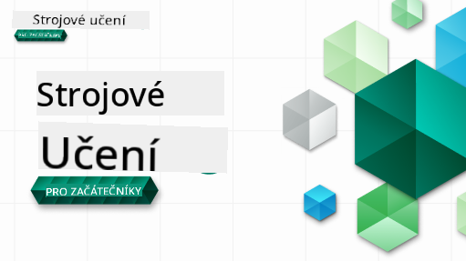

<!--
CO_OP_TRANSLATOR_METADATA:
{
  "original_hash": "1dd12e0cd1de7d05f65abe07bc401c63",
  "translation_date": "2025-09-06T19:07:49+00:00",
  "source_file": "README.md",
  "language_code": "cs"
}
-->
  
  
  
  
  

  
  
  

### 🌐 Podpora více jazyků  

#### Podporováno prostřednictvím GitHub Action (automatizované a vždy aktuální)  

[French](../fr/README.md) | [Spanish](../es/README.md) | [German](../de/README.md) | [Russian](../ru/README.md) | [Arabic](../ar/README.md) | [Persian (Farsi)](../fa/README.md) | [Urdu](../ur/README.md) | [Chinese (Simplified)](../zh/README.md) | [Chinese (Traditional, Macau)](../mo/README.md) | [Chinese (Traditional, Hong Kong)](../hk/README.md) | [Chinese (Traditional, Taiwan)](../tw/README.md) | [Japanese](../ja/README.md) | [Korean](../ko/README.md) | [Hindi](../hi/README.md) | [Bengali](../bn/README.md) | [Marathi](../mr/README.md) | [Nepali](../ne/README.md) | [Punjabi (Gurmukhi)](../pa/README.md) | [Portuguese (Portugal)](../pt/README.md) | [Portuguese (Brazil)](../br/README.md) | [Italian](../it/README.md) | [Polish](../pl/README.md) | [Turkish](../tr/README.md) | [Greek](../el/README.md) | [Thai](../th/README.md) | [Swedish](../sv/README.md) | [Danish](../da/README.md) | [Norwegian](../no/README.md) | [Finnish](../fi/README.md) | [Dutch](../nl/README.md) | [Hebrew](../he/README.md) | [Vietnamese](../vi/README.md) | [Indonesian](../id/README.md) | [Malay](../ms/README.md) | [Tagalog (Filipino)](../tl/README.md) | [Swahili](../sw/README.md) | [Hungarian](../hu/README.md) | [Czech](./README.md) | [Slovak](../sk/README.md) | [Romanian](../ro/README.md) | [Bulgarian](../bg/README.md) | [Serbian (Cyrillic)](../sr/README.md) | [Croatian](../hr/README.md) | [Slovenian](../sl/README.md) | [Ukrainian](../uk/README.md) | [Burmese (Myanmar)](../my/README.md)  

#### Připojte se ke komunitě  

  

# Strojové učení pro začátečníky - učební plán  

> 🌍 Cestujte po světě, zatímco se učíte strojové učení prostřednictvím světových kultur 🌍  

Cloud Advocates ve společnosti Microsoft s potěšením nabízejí 12týdenní učební plán s 26 lekcemi zaměřenými na **strojové učení**. V tomto učebním plánu se naučíte, co se někdy nazývá **klasické strojové učení**, především pomocí knihovny Scikit-learn a bez použití hlubokého učení, které je pokryto v našem [učebním plánu AI pro začátečníky](https://aka.ms/ai4beginners). Tyto lekce můžete kombinovat s naším [učebním plánem Data Science pro začátečníky](https://aka.ms/ds4beginners).  

Cestujte s námi po světě, zatímco aplikujeme tyto klasické techniky na data z různých částí světa. Každá lekce obsahuje kvízy před a po lekci, písemné pokyny k dokončení lekce, řešení, úkoly a další. Náš projektově orientovaný přístup vám umožní učit se prostřednictvím tvorby, což je osvědčený způsob, jak si osvojit nové dovednosti.  

**✍️ Srdečné díky našim autorům** Jen Looper, Stephen Howell, Francesca Lazzeri, Tomomi Imura, Cassie Breviu, Dmitry Soshnikov, Chris Noring, Anirban Mukherjee, Ornella Altunyan, Ruth Yakubu a Amy Boyd  

**🎨 Díky také našim ilustrátorům** Tomomi Imura, Dasani Madipalli a Jen Looper  

**🙏 Speciální poděkování 🙏 našim autorům, recenzentům a přispěvatelům obsahu z řad Microsoft Student Ambassador**, zejména Rishit Dagli, Muhammad Sakib Khan Inan, Rohan Raj, Alexandru Petrescu, Abhishek Jaiswal, Nawrin Tabassum, Ioan Samuila a Snigdha Agarwal  

**🤩 Extra poděkování Microsoft Student Ambassadors Eric Wanjau, Jasleen Sondhi a Vidushi Gupta za naše lekce v R!**  

# Začínáme  

Postupujte podle těchto kroků:  
1. **Forkujte repozitář**: Klikněte na tlačítko "Fork" v pravém horním rohu této stránky.  
2. **Naklonujte repozitář**: `git clone https://github.com/microsoft/ML-For-Beginners.git`  

> [najděte všechny další zdroje pro tento kurz v naší kolekci Microsoft Learn](https://learn.microsoft.com/en-us/collections/qrqzamz1nn2wx3?WT.mc_id=academic-77952-bethanycheum)  

**[Studenti](https://aka.ms/student-page)**, chcete-li použít tento učební plán, forkujte celý repozitář do svého vlastního GitHub účtu a dokončete cvičení sami nebo ve skupině:  

- Začněte kvízem před lekcí.  
- Přečtěte si lekci a dokončete aktivity, přičemž se zastavte a zamyslete při každé kontrolní otázce.  
- Pokuste se vytvořit projekty pochopením lekcí, místo abyste spouštěli řešení kódu; tento kód je však dostupný ve složkách `/solution` v každé projektově orientované lekci.  
- Udělejte kvíz po lekci.  
- Dokončete výzvu.  
- Dokončete úkol.  
- Po dokončení skupiny lekcí navštivte [Diskusní fórum](https://github.com/microsoft/ML-For-Beginners/discussions) a "učte se nahlas" vyplněním příslušného PAT rubriky. PAT je nástroj pro hodnocení pokroku, který je rubrikou, kterou vyplníte pro další rozvoj svého učení. Můžete také reagovat na jiné PAT, abychom se učili společně.  

> Pro další studium doporučujeme sledovat tyto [moduly a učební cesty Microsoft Learn](https://docs.microsoft.com/en-us/users/jenlooper-2911/collections/k7o7tg1gp306q4?WT.mc_id=academic-77952-leestott).  

**Učitelé**, [zahrnuli jsme několik návrhů](for-teachers.md), jak použít tento učební plán.  

---  

## Video průvodce  

Některé lekce jsou dostupné jako krátká videa. Všechna tato videa najdete přímo v lekcích nebo na [playlistu ML pro začátečníky na YouTube kanálu Microsoft Developer](https://aka.ms/ml-beginners-videos) kliknutím na obrázek níže.  

  

---  

## Seznamte se s týmem  

  

**Gif vytvořil** [Mohit Jaisal](https://linkedin.com/in/mohitjaisal)  

> 🎥 Klikněte na obrázek výše pro video o projektu a lidech, kteří ho vytvořili!  

---  

## Pedagogika  

Při vytváření tohoto učebního plánu jsme zvolili dva pedagogické principy: zajistit, aby byl praktický **projektově orientovaný** a aby obsahoval **časté kvízy**. Kromě toho má tento učební plán společné **téma**, které mu dodává soudržnost.  

Zajištěním toho, že obsah odpovídá projektům, je proces pro studenty více poutavý a zlepšuje se uchování konceptů. Nízkostresový kvíz před hodinou nastavuje záměr studenta na učení daného tématu, zatímco druhý kvíz po hodině zajišťuje další uchování. Tento učební plán byl navržen tak, aby byl flexibilní a zábavný a mohl být absolvován celý nebo jen jeho část. Projekty začínají malými úkoly a postupně se stávají složitějšími na konci 12týdenního cyklu. Tento učební plán také obsahuje dodatek o reálných aplikacích ML, který může být použit jako extra kredit nebo jako základ pro diskusi.  

> Najděte náš [Kodex chování](CODE_OF_CONDUCT.md), [Pokyny pro přispívání](CONTRIBUTING.md) a [Pokyny pro překlad](TRANSLATIONS.md). Vaši konstruktivní zpětnou vazbu vítáme!  

## Každá lekce obsahuje  

- volitelný sketchnote  
- volitelné doplňkové video  
- video průvodce (pouze některé lekce)  
- [kvíz před lekcí](https://ff-quizzes.netlify.app/en/ml/)  
- písemnou lekci  
- u projektově orientovaných lekcí, podrobné pokyny, jak projekt vytvořit  
- kontrolní otázky  
- výzvu  
- doplňkové čtení  
- úkol  
- [kvíz po lekci](https://ff-quizzes.netlify.app/en/ml/)  

> **Poznámka k jazykům**: Tyto lekce jsou primárně napsány v Pythonu, ale mnoho z nich je také dostupných v R. Chcete-li dokončit lekci v R, přejděte do složky `/solution` a vyhledejte lekce v R. Tyto lekce obsahují příponu .rmd, která představuje **R Markdown** soubor, který lze jednoduše definovat jako kombinaci `code chunks` (R nebo jiných jazyků) a `YAML header` (který určuje, jak formátovat výstupy, jako je PDF) v `Markdown dokumentu`. Jako takový slouží jako příkladný autorizační rámec pro datovou vědu, protože vám umožňuje kombinovat váš kód, jeho výstup a vaše myšlenky tím, že je zapíšete do Markdownu. Navíc lze R Markdown dokumenty převést na výstupní formáty, jako je PDF, HTML nebo Word.  

> **Poznámka ke kvízům**: Všechny kvízy jsou obsaženy ve složce [Quiz App](../../quiz-app), celkem 52 kvízů po třech otázkách. Jsou propojeny přímo z lekcí, ale aplikaci kvízů lze spustit lokálně; postupujte podle pokynů ve složce `quiz-app` pro lokální hostování nebo nasazení na Azure.  

| Číslo lekce |                             Téma                              |                   Skupina lekcí                   | Cíle učení                                                                                                             |                                                              Propojená lekce                                                               |                        Autor                        |  
| :-----------: | :------------------------------------------------------------: | :-------------------------------------------------: | ------------------------------------------------------------------------------------------------------------------------------- | :--------------------------------------------------------------------------------------------------------------------------------------: | :--------------------------------------------------: |  
|      01       |                Úvod do strojového učení                |      [Úvod](1-Introduction/README.md)       | Naučte se základní koncepty strojového učení                                                                                |                                             [Lekce](1-Introduction/1-intro-to-ML/README.md)                                             |                       Muhammad                       |  
|      02       |                Historie strojového učení                 |      [Úvod](1-Introduction/README.md)       | Naučte se historii tohoto oboru                                                                                         |                                            [Lekce](1-Introduction/2-history-of-ML/README.md)                                            |                     Jen a Amy                      |  
|      03       |                 Spravedlnost ve strojovém učení                  |      [Úvod](1-Introduction/README.md)       | Jaké jsou důležité filozofické otázky týkající se spravedlnosti, které by studenti měli zvážit při vytváření a aplikaci ML modelů? |                                              [Lekce](1-Introduction/3-fairness/README.md)                                               |                        Tomomi                        |  
|      04       |                Techniky strojového učení                      |      [Introduction](1-Introduction/README.md)       | Jaké techniky používají výzkumníci ML k vytváření modelů strojového učení?                                                     |                                          [Lesson](1-Introduction/4-techniques-of-ML/README.md)                                           |                    Chris a Jen                     |
|      05       |                   Úvod do regrese                             |        [Regression](2-Regression/README.md)         | Začněte s Pythonem a Scikit-learn pro regresní modely                                                                          |         [Python](2-Regression/1-Tools/README.md) • [R](../../2-Regression/1-Tools/solution/R/lesson_1.html)         |      Jen • Eric Wanjau       |
|      06       |                Ceny dýní v Severní Americe 🎃                 |        [Regression](2-Regression/README.md)         | Vizualizace a čištění dat jako příprava na ML                                                                                  |          [Python](2-Regression/2-Data/README.md) • [R](../../2-Regression/2-Data/solution/R/lesson_2.html)          |      Jen • Eric Wanjau       |
|      07       |                Ceny dýní v Severní Americe 🎃                 |        [Regression](2-Regression/README.md)         | Vytvoření lineárních a polynomiálních regresních modelů                                                                         |        [Python](2-Regression/3-Linear/README.md) • [R](../../2-Regression/3-Linear/solution/R/lesson_3.html)        |      Jen a Dmitry • Eric Wanjau       |
|      08       |                Ceny dýní v Severní Americe 🎃                 |        [Regression](2-Regression/README.md)         | Vytvoření logistického regresního modelu                                                                                       |     [Python](2-Regression/4-Logistic/README.md) • [R](../../2-Regression/4-Logistic/solution/R/lesson_4.html)      |      Jen • Eric Wanjau       |
|      09       |                          Webová aplikace 🔌                   |           [Web App](3-Web-App/README.md)            | Vytvoření webové aplikace pro použití vašeho trénovaného modelu                                                                |                                                 [Python](3-Web-App/1-Web-App/README.md)                                                  |                         Jen                          |
|      10       |                 Úvod do klasifikace                          |    [Classification](4-Classification/README.md)     | Čištění, příprava a vizualizace dat; úvod do klasifikace                                                                        | [Python](4-Classification/1-Introduction/README.md) • [R](../../4-Classification/1-Introduction/solution/R/lesson_10.html)  | Jen a Cassie • Eric Wanjau |
|      11       |             Lahodná asijská a indická kuchyně 🍜             |    [Classification](4-Classification/README.md)     | Úvod do klasifikátorů                                                                                                          | [Python](4-Classification/2-Classifiers-1/README.md) • [R](../../4-Classification/2-Classifiers-1/solution/R/lesson_11.html) | Jen a Cassie • Eric Wanjau |
|      12       |             Lahodná asijská a indická kuchyně 🍜             |    [Classification](4-Classification/README.md)     | Další klasifikátory                                                                                                            | [Python](4-Classification/3-Classifiers-2/README.md) • [R](../../4-Classification/3-Classifiers-2/solution/R/lesson_12.html) | Jen a Cassie • Eric Wanjau |
|      13       |             Lahodná asijská a indická kuchyně 🍜             |    [Classification](4-Classification/README.md)     | Vytvoření doporučovací webové aplikace pomocí vašeho modelu                                                                    |                                              [Python](4-Classification/4-Applied/README.md)                                              |                         Jen                          |
|      14       |                   Úvod do shlukování                         |        [Clustering](5-Clustering/README.md)         | Čištění, příprava a vizualizace dat; úvod do shlukování                                                                         |         [Python](5-Clustering/1-Visualize/README.md) • [R](../../5-Clustering/1-Visualize/solution/R/lesson_14.html)         |      Jen • Eric Wanjau       |
|      15       |              Zkoumání hudebních chutí v Nigérii 🎧           |        [Clustering](5-Clustering/README.md)         | Zkoumání metody shlukování K-Means                                                                                            |           [Python](5-Clustering/2-K-Means/README.md) • [R](../../5-Clustering/2-K-Means/solution/R/lesson_15.html)           |      Jen • Eric Wanjau       |
|      16       |        Úvod do zpracování přirozeného jazyka ☕️             |   [Natural language processing](6-NLP/README.md)    | Naučte se základy NLP vytvořením jednoduchého bota                                                                             |                                             [Python](6-NLP/1-Introduction-to-NLP/README.md)                                              |                       Stephen                        |
|      17       |                      Běžné úkoly NLP ☕️                     |   [Natural language processing](6-NLP/README.md)    | Prohloubení znalostí NLP pochopením běžných úkolů při práci s jazykovými strukturami                                           |                                                    [Python](6-NLP/2-Tasks/README.md)                                                     |                       Stephen                        |
|      18       |             Překlad a analýza sentimentu ♥️                  |   [Natural language processing](6-NLP/README.md)    | Překlad a analýza sentimentu s Jane Austen                                                                                    |                                            [Python](6-NLP/3-Translation-Sentiment/README.md)                                             |                       Stephen                        |
|      19       |                  Romantické hotely v Evropě ♥️              |   [Natural language processing](6-NLP/README.md)    | Analýza sentimentu s recenzemi hotelů 1                                                                                       |                                               [Python](6-NLP/4-Hotel-Reviews-1/README.md)                                                |                       Stephen                        |
|      20       |                  Romantické hotely v Evropě ♥️              |   [Natural language processing](6-NLP/README.md)    | Analýza sentimentu s recenzemi hotelů 2                                                                                       |                                               [Python](6-NLP/5-Hotel-Reviews-2/README.md)                                                |                       Stephen                        |
|      21       |            Úvod do předpovědi časových řad                   |        [Time series](7-TimeSeries/README.md)        | Úvod do předpovědi časových řad                                                                                               |                                             [Python](7-TimeSeries/1-Introduction/README.md)                                              |                      Francesca                       |
|      22       | ⚡️ Světová spotřeba energie ⚡️ - předpověď časových řad s ARIMA |        [Time series](7-TimeSeries/README.md)        | Předpověď časových řad s ARIMA                                                                                                |                                                 [Python](7-TimeSeries/2-ARIMA/README.md)                                                 |                      Francesca                       |
|      23       |  ⚡️ Světová spotřeba energie ⚡️ - předpověď časových řad s SVR  |        [Time series](7-TimeSeries/README.md)        | Předpověď časových řad s Support Vector Regressor                                                                             |                                                  [Python](7-TimeSeries/3-SVR/README.md)                                                  |                       Anirban                        |
|      24       |             Úvod do posilovaného učení                       | [Reinforcement learning](8-Reinforcement/README.md) | Úvod do posilovaného učení s Q-Learning                                                                                       |                                             [Python](8-Reinforcement/1-QLearning/README.md)                                              |                        Dmitry                        |
|      25       |                 Pomozte Petrovi vyhnout se vlkovi! 🐺        | [Reinforcement learning](8-Reinforcement/README.md) | Posilované učení Gym                                                                                                          |                                                [Python](8-Reinforcement/2-Gym/README.md)                                                 |                        Dmitry                        |
|  Postscript   |            Scénáře a aplikace ML v reálném světě             |      [ML in the Wild](9-Real-World/README.md)       | Zajímavé a odhalující aplikace klasického ML v reálném světě                                                                   |                                             [Lesson](9-Real-World/1-Applications/README.md)                                              |                         Tým                          |
|  Postscript   |            Ladění modelů ML pomocí RAI dashboardu           |      [ML in the Wild](9-Real-World/README.md)       | Ladění modelů strojového učení pomocí komponent Responsible AI dashboardu                                                     |                                             [Lesson](9-Real-World/2-Debugging-ML-Models/README.md)                                              |                         Ruth Yakubu                       |

> [najděte všechny další zdroje pro tento kurz v naší kolekci Microsoft Learn](https://learn.microsoft.com/en-us/collections/qrqzamz1nn2wx3?WT.mc_id=academic-77952-bethanycheum)

## Offline přístup

Tuto dokumentaci můžete spustit offline pomocí [Docsify](https://docsify.js.org/#/). Forkněte tento repozitář, [nainstalujte Docsify](https://docsify.js.org/#/quickstart) na svůj lokální počítač a poté v kořenové složce tohoto repozitáře zadejte `docsify serve`. Webová stránka bude spuštěna na portu 3000 na vašem localhostu: `localhost:3000`.

## PDF

Najděte PDF kurikula s odkazy [zde](https://microsoft.github.io/ML-For-Beginners/pdf/readme.pdf).

## 🎒 Další kurzy 

Náš tým vytváří další kurzy! Podívejte se na:

- [Generativní AI pro začátečníky](https://aka.ms/genai-beginners)
- [Generativní AI pro začátečníky .NET](https://github.com/microsoft/Generative-AI-for-beginners-dotnet)
- [Generativní AI s JavaScriptem](https://github.com/microsoft/generative-ai-with-javascript)
- [Generativní AI s Javou](https://github.com/microsoft/Generative-AI-for-beginners-java)
- [AI pro začátečníky](https://aka.ms/ai-beginners)
- [Data Science pro začátečníky](https://aka.ms/datascience-beginners)
- [ML pro začátečníky](https://aka.ms/ml-beginners)
- [Kybernetická bezpečnost pro začátečníky](https://github.com/microsoft/Security-101) 
- [Webový vývoj pro začátečníky](https://aka.ms/webdev-beginners)
- [IoT pro začátečníky](https://aka.ms/iot-beginners)
- [Vývoj XR pro začátečníky](https://github.com/microsoft/xr-development-for-beginners)
- [Ovládnutí GitHub Copilot pro párové programování](https://github.com/microsoft/Mastering-GitHub-Copilot-for-Paired-Programming)
- [Ovládnutí GitHub Copilot pro vývojáře C#/.NET](https://github.com/microsoft/mastering-github-copilot-for-dotnet-csharp-developers)
- [Vyberte si vlastní dobrodružství s Copilotem](https://github.com/microsoft/CopilotAdventures)

---

**Prohlášení**:  
Tento dokument byl přeložen pomocí služby pro automatický překlad [Co-op Translator](https://github.com/Azure/co-op-translator). I když se snažíme o co největší přesnost, mějte prosím na paměti, že automatické překlady mohou obsahovat chyby nebo nepřesnosti. Za autoritativní zdroj by měl být považován původní dokument v jeho původním jazyce. Pro důležité informace doporučujeme profesionální lidský překlad. Neodpovídáme za žádná nedorozumění nebo nesprávné výklady vyplývající z použití tohoto překladu.