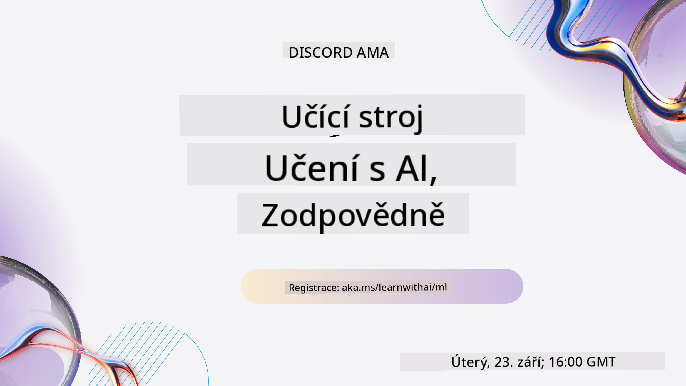
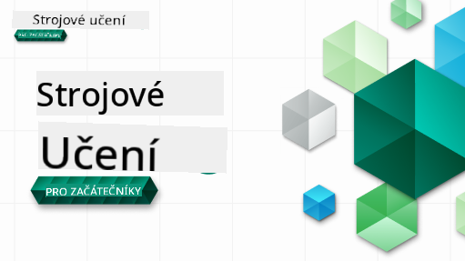

<!--
CO_OP_TRANSLATOR_METADATA:
{
  "original_hash": "ec8385130a8239ad9d827175126a0722",
  "translation_date": "2026-01-01T13:09:02+00:00",
  "source_file": "README.md",
  "language_code": "cs"
}
-->

### 🌐 Vícejazyčná podpora

#### Podporováno pomocí GitHub Action (automatizováno a vždy aktuální)

<!-- CO-OP TRANSLATOR LANGUAGES TABLE START -->
[Arabština](../ar/README.md) | [Bengálština](../bn/README.md) | [Bulharština](../bg/README.md) | [Barmština (Myanmar)](../my/README.md) | [Čínština (zjednodušená)](../zh/README.md) | [Čínština (tradiční, Hong Kong)](../hk/README.md) | [Čínština (tradiční, Macau)](../mo/README.md) | [Čínština (tradiční, Taiwan)](../tw/README.md) | [Chorvatština](../hr/README.md) | [Čeština](./README.md) | [Dánština](../da/README.md) | [Nizozemština](../nl/README.md) | [Estonština](../et/README.md) | [Finština](../fi/README.md) | [Francouzština](../fr/README.md) | [Němčina](../de/README.md) | [Řečtina](../el/README.md) | [Hebrejština](../he/README.md) | [Hindština](../hi/README.md) | [Maďarština](../hu/README.md) | [Indonéština](../id/README.md) | [Italština](../it/README.md) | [Japonština](../ja/README.md) | [Kannadština](../kn/README.md) | [Korejština](../ko/README.md) | [Litevština](../lt/README.md) | [Malajština](../ms/README.md) | [Malajalámština](../ml/README.md) | [Maráthština](../mr/README.md) | [Nepálština](../ne/README.md) | [Nigérijský pidžin](../pcm/README.md) | [Norština](../no/README.md) | [Perština (Farsi)](../fa/README.md) | [Polština](../pl/README.md) | [Portugalština (Brazílie)](../br/README.md) | [Portugalština (Portugalsko)](../pt/README.md) | [Paňdžábština (Gurmukhi)](../pa/README.md) | [Rumunština](../ro/README.md) | [Ruština](../ru/README.md) | [Srbština (cyrilice)](../sr/README.md) | [Slovenština](../sk/README.md) | [Slovinština](../sl/README.md) | [Španělština](../es/README.md) | [Svahilština](../sw/README.md) | [Švédština](../sv/README.md) | [Tagalog (filipínština)](../tl/README.md) | [Tamilština](../ta/README.md) | [Telugština](../te/README.md) | [Thajština](../th/README.md) | [Turečtina](../tr/README.md) | [Ukrajinština](../uk/README.md) | [Urdština](../ur/README.md) | [Vietnamština](../vi/README.md)
<!-- CO-OP TRANSLATOR LANGUAGES TABLE END -->

#### Připojte se k naší komunitě

Probíhá naše série „Learn with AI“ na Discordu — dozvíte se více a připojte se k nám na [Learn with AI Series](https://aka.ms/learnwithai/discord) od 18. do 30. září 2025. Získáte tipy a triky pro používání GitHub Copilot pro datovou vědu.

# Strojové učení pro začátečníky - osnovy kurzu

> 🌍 Cestujte po celém světě, když zkoumáme strojové učení prostřednictvím světových kultur 🌍

Obhájci cloudu ve společnosti Microsoft s radostí nabízejí 12týdenní osnovu s 26 lekcemi věnovanou výhradně **strojovému učení**. V této osnově se seznámíte s tím, co se někdy nazývá **klasické strojové učení**, především s využitím knihovny Scikit-learn a bez hlubokého učení, které je pokryto v našem [kurzu 'AI for Beginners'](https://aka.ms/ai4beginners). Párujte tyto lekce také s naším [kurzem 'Data Science for Beginners'](https://aka.ms/ds4beginners).

Cestujte s námi po světě, když aplikujeme tyto klasické techniky na data z mnoha oblastí světa. Každá lekce obsahuje vstupní a závěrečný kvíz, písemné pokyny k dokončení lekce, řešení, úkol a další. Naše projektově orientovaná pedagogika vám umožní učit se při tvorbě, což je osvědčený způsob, jak se nové dovednosti „uchytí“.

**✍️ Srdečné díky našim autorům** Jen Looper, Stephen Howell, Francesca Lazzeri, Tomomi Imura, Cassie Breviu, Dmitry Soshnikov, Chris Noring, Anirban Mukherjee, Ornella Altunyan, Ruth Yakubu a Amy Boyd

**🎨 Díky také našim ilustrátorům** Tomomi Imura, Dasani Madipalli a Jen Looper

**🙏 Zvláštní poděkování 🙏 našim autorům, recenzentům a přispěvatelům obsahu z řad Microsoft Student Ambassador**, zejména Rishit Dagli, Muhammad Sakib Khan Inan, Rohan Raj, Alexandru Petrescu, Abhishek Jaiswal, Nawrin Tabassum, Ioan Samuila a Snigdha Agarwal

**🤩 Extra poděkování Microsoft Student Ambassadors Eric Wanjau, Jasleen Sondhi a Vidushi Gupta za naše lekce v R!**

# Začínáme

Postupujte podle těchto kroků:
1. **Vytvořte fork repozitáře**: Klikněte na tlačítko "Fork" v pravém horním rohu této stránky.
2. **Klonujte repozitář**:   `git clone https://github.com/microsoft/ML-For-Beginners.git`

> [najděte všechny další zdroje pro tento kurz v naší kolekci Microsoft Learn](https://learn.microsoft.com/en-us/collections/qrqzamz1nn2wx3?WT.mc_id=academic-77952-bethanycheum)

> 🔧 **Potřebujete pomoc?** Podívejte se na náš [průvodce řešením problémů](TROUBLESHOOTING.md) pro řešení běžných potíží s instalací, nastavením a spouštěním lekcí.

**[Studenti](https://aka.ms/student-page)**, chcete-li využít tuto osnovu, vytvořte fork celého repozitáře na svůj GitHub účet a dokončujte cvičení sami nebo ve skupině:

- Začněte úvodním kvízem před přednáškou.
- Přečtěte si přednášku a dokončete aktivity, zastavujte se a přemýšlejte při každé znalostní kontrole.
- Snažte se vytvářet projekty porozuměním lekcí místo pouhého spouštění řešení; přesto jsou tato řešení k dispozici ve složkách `/solution` v každé projektově orientované lekci.
- Udělejte závěrečný kvíz po přednášce.
- Dokončete výzvu.
- Dokončete zadání.
- Po dokončení skupiny lekcí navštivte [diskusní fórum](https://github.com/microsoft/ML-For-Beginners/discussions) a „učte se nahlas“ vyplněním příslušného hodnotícího rubriky PAT. 'PAT' je nástroj pro hodnocení pokroku (Progress Assessment Tool), což je rubrika, kterou vyplníte na podporu svého učení. Můžete také reagovat na jiné PATy, abychom se mohli učit společně.

> Pro další studium doporučujeme sledovat tyto [moduly a učební cesty Microsoft Learn](https://docs.microsoft.com/en-us/users/jenlooper-2911/collections/k7o7tg1gp306q4?WT.mc_id=academic-77952-leestott).

**Učitelé**, poskytli jsme [několik doporučení](for-teachers.md) o tom, jak tuto osnovu používat.

---

## Video průvodci

Některé lekce jsou dostupné jako krátká videa. Vše najdete vložené přímo v lekcích nebo v [playlistu ML for Beginners na kanálu Microsoft Developer YouTube](https://aka.ms/ml-beginners-videos) kliknutím na obrázek níže.

---

## Poznejte tým

**Gif od** [Mohit Jaisal](https://linkedin.com/in/mohitjaisal)

> 🎥 Klikněte na obrázek výše pro video o projektu a lidech, kteří jej vytvořili!

---

## Pedagogika

Při vytváření této osnovy jsme zvolili dva pedagogické principy: zajistit, aby byla praktická a **projektově orientovaná**, a aby obsahovala **časté kvízy**. Kromě toho má tato osnova společné **téma**, které jí dává soudržnost.

Zajistěním, že obsah je v souladu s projekty, je proces pro studenty poutavější a uchování konceptů bude posíleno. Navíc nízkorizikový kvíz před hodinou nastaví záměr studenta k učení tématu, zatímco druhý kvíz po hodině zajistí další uchování znalostí. Tato osnova byla navržena tak, aby byla flexibilní a zábavná a lze ji absolvovat celou nebo částečně. Projekty začínají malé a postupně se během 12týdenního cyklu stávají složitějšími. Tato osnova také obsahuje dodatek o reálných aplikacích ML, který lze použít jako bonusové body nebo jako podklad pro diskusi.

> Najděte náš [Kodex chování](CODE_OF_CONDUCT.md), [Příspěvky](CONTRIBUTING.md), [Překlady](TRANSLATIONS.md) a [Průvodce řešením problémů](TROUBLESHOOTING.md). Vítáme vaši konstruktivní zpětnou vazbu!

## Každá lekce obsahuje

- volitelnou sketchnotu
- volitelné doplňkové video
- video průvodce (pouze některé lekce)
- [úvodní kvíz před přednáškou](https://ff-quizzes.netlify.app/en/ml/)
- písemnou lekci
- u projektově orientovaných lekcí krok za krokem průvodce, jak projekt postavit
- kontrolní znalostní otázky
- výzvu
- doplňující četbu
- zadání
- [závěrečný kvíz po přednášce](https://ff-quizzes.netlify.app/en/ml/)

> **Poznámka o jazycích**: Tyto lekce jsou primárně psány v Pythonu, ale mnohé jsou také dostupné v R. Chcete-li dokončit lekci v R, přejděte do složky `/solution` a vyhledejte lekce v R. Obsahují příponu .rmd, která představuje soubor **R Markdown**, což lze jednoduše definovat jako vložení `code chunks` (v R nebo jiných jazycích) a `YAML header` (který určuje, jak formátovat výstupy, například PDF) v `Markdown document`. Slouží tedy jako vzorový autorský rámec pro datovou vědu, protože vám umožňuje kombinovat váš kód, jeho výstup a vaše poznámky tak, že je zapíšete v Markdownu. Kromě toho lze dokumenty R Markdown vyrenderovat do výstupních formátů, jako jsou PDF, HTML nebo Word.

> **Poznámka o kvízech**: Všechny kvízy jsou obsaženy ve [složce Quiz App](../../quiz-app), celkem 52 kvízů po třech otázkách. Jsou propojeny v lekcích, ale aplikaci s kvízy lze spustit lokálně; postupujte podle pokynů ve složce `quiz-app`, abyste aplikaci hostovali lokálně nebo nasadili do Azure.

| Číslo lekce |                             Téma                              |                   Seskupení lekcí                   | Cíle učení                                                                                                             |                                                              Propojená lekce                                                               |                        Autor                        |
| :-----------: | :------------------------------------------------------------: | :-------------------------------------------------: | ------------------------------------------------------------------------------------------------------------------------------- | :--------------------------------------------------------------------------------------------------------------------------------------: | :--------------------------------------------------: |
|      01       |                Úvod do strojového učení                |      [Úvod](1-Introduction/README.md)       | Naučte se základní koncepty strojového učení                                                                                |                                             [Lekce](1-Introduction/1-intro-to-ML/README.md)                                             |                       Muhammad                       |
|      02       |                Historie strojového učení                 |      [Úvod](1-Introduction/README.md)       | Poznejte historii, která stojí za tímto oborem                                                                                         |                                            [Lekce](1-Introduction/2-history-of-ML/README.md)                                            |                     Jen a Amy                      |
|      03       |                 Spravedlnost a strojové učení                  |      [Úvod](1-Introduction/README.md)       | Jaké jsou důležité filozofické otázky týkající se spravedlnosti, které by studenti měli zvážit při vytváření a aplikaci ML modelů? |                                              [Lekce](1-Introduction/3-fairness/README.md)                                               |                        Tomomi                        |
|      04       |                Techniky pro strojové učení                 |      [Úvod](1-Introduction/README.md)       | Jaké techniky používají výzkumníci v ML k tvorbě modelů?                                                                       |                                          [Lekce](1-Introduction/4-techniques-of-ML/README.md)                                           |                    Chris a Jen                     |
|      05       |                   Úvod do regrese                   |        [Regrese](2-Regression/README.md)         | Začněte s Pythonem a Scikit-learn pro regresní modely                                                                  |         [Python](2-Regression/1-Tools/README.md) • [R](../../2-Regression/1-Tools/solution/R/lesson_1.html)         |      Jen • Eric Wanjau       |
|      06       |                Ceny dýní v Severní Americe 🎃                |        [Regrese](2-Regression/README.md)         | Vizualizujte a čistěte data v přípravě na ML                                                                                  |          [Python](2-Regression/2-Data/README.md) • [R](../../2-Regression/2-Data/solution/R/lesson_2.html)          |      Jen • Eric Wanjau       |
|      07       |                Ceny dýní v Severní Americe 🎃                |        [Regrese](2-Regression/README.md)         | Vytvořte lineární a polynomické regresní modely                                                                                   |        [Python](2-Regression/3-Linear/README.md) • [R](../../2-Regression/3-Linear/solution/R/lesson_3.html)        |      Jen a Dmitry • Eric Wanjau       |
|      08       |                Ceny dýní v Severní Americe 🎃                |        [Regrese](2-Regression/README.md)         | Vytvořte logistický regresní model                                                                                               |     [Python](2-Regression/4-Logistic/README.md) • [R](../../2-Regression/4-Logistic/solution/R/lesson_4.html)      |      Jen • Eric Wanjau       |
|      09       |                          Webová aplikace 🔌                          |           [Webová aplikace](3-Web-App/README.md)            | Vytvořte webovou aplikaci pro použití vašeho natrénovaného modelu                                                                                       |                                                 [Python](3-Web-App/1-Web-App/README.md)                                                  |                         Jen                          |
|      10       |                 Úvod do klasifikace                 |    [Klasifikace](4-Classification/README.md)     | Učistěte, připravte a vizualizujte data; úvod do klasifikace                                                            | [Python](4-Classification/1-Introduction/README.md) • [R](../../4-Classification/1-Introduction/solution/R/lesson_10.html)  | Jen a Cassie • Eric Wanjau |
|      11       |             Lahodné asijské a indické kuchyně 🍜             |    [Klasifikace](4-Classification/README.md)     | Úvod do klasifikátorů                                                                                                     | [Python](4-Classification/2-Classifiers-1/README.md) • [R](../../4-Classification/2-Classifiers-1/solution/R/lesson_11.html) | Jen a Cassie • Eric Wanjau |
|      12       |             Lahodné asijské a indické kuchyně 🍜             |    [Klasifikace](4-Classification/README.md)     | Další klasifikátory                                                                                                                | [Python](4-Classification/3-Classifiers-2/README.md) • [R](../../4-Classification/3-Classifiers-2/solution/R/lesson_12.html) | Jen a Cassie • Eric Wanjau |
|      13       |             Lahodné asijské a indické kuchyně 🍜             |    [Klasifikace](4-Classification/README.md)     | Vytvořte doporučující webovou aplikaci pomocí svého modelu                                                                                    |                                              [Python](4-Classification/4-Applied/README.md)                                              |                         Jen                          |
|      14       |                   Úvod do shlukování                   |        [Shlukování](5-Clustering/README.md)         | Učistěte, připravte a vizualizujte data; úvod do shlukování                                                                |         [Python](5-Clustering/1-Visualize/README.md) • [R](../../5-Clustering/1-Visualize/solution/R/lesson_14.html)         |      Jen • Eric Wanjau       |
|      15       |              Průzkum nigerijských hudebních chutí 🎧              |        [Shlukování](5-Clustering/README.md)         | Prozkoumejte metodu shlukování K-Means                                                                                           |           [Python](5-Clustering/2-K-Means/README.md) • [R](../../5-Clustering/2-K-Means/solution/R/lesson_15.html)           |      Jen • Eric Wanjau       |
|      16       |        Úvod do zpracování přirozeného jazyka ☕️         |   [Zpracování přirozeného jazyka](6-NLP/README.md)    | Naučte se základy NLP vytvořením jednoduchého bota                                                                             |                                             [Python](6-NLP/1-Introduction-to-NLP/README.md)                                              |                       Stephen                        |
|      17       |                      Běžné úlohy NLP ☕️                      |   [Zpracování přirozeného jazyka](6-NLP/README.md)    | Prohlubte své znalosti NLP porozuměním běžným úlohám potřebným při práci s jazykovými strukturami                          |                                                    [Python](6-NLP/2-Tasks/README.md)                                                     |                       Stephen                        |
|      18       |             Překlad a analýza sentimentu ♥️              |   [Zpracování přirozeného jazyka](6-NLP/README.md)    | Překlad a analýza sentimentu na textech Jane Austen                                                                             |                                            [Python](6-NLP/3-Translation-Sentiment/README.md)                                             |                       Stephen                        |
|      19       |                  Romantické hotely Evropy ♥️                  |   [Zpracování přirozeného jazyka](6-NLP/README.md)    | Analýza sentimentu s recenzemi hotelů 1                                                                                         |                                               [Python](6-NLP/4-Hotel-Reviews-1/README.md)                                                |                       Stephen                        |
|      20       |                  Romantické hotely Evropy ♥️                  |   [Zpracování přirozeného jazyka](6-NLP/README.md)    | Analýza sentimentu s recenzemi hotelů 2                                                                                         |                                               [Python](6-NLP/5-Hotel-Reviews-2/README.md)                                                |                       Stephen                        |
|      21       |            Úvod do předpovědí časových řad             |        [Časové řady](7-TimeSeries/README.md)        | Úvod do předpovědí časových řad                                                                                         |                                             [Python](7-TimeSeries/1-Introduction/README.md)                                              |                      Francesca                       |
|      22       | ⚡️ Světová spotřeba energie ⚡️ - předpovědi časových řad pomocí ARIMA |        [Časové řady](7-TimeSeries/README.md)        | Předpovědi časových řad pomocí ARIMA                                                                                              |                                                 [Python](7-TimeSeries/2-ARIMA/README.md)                                                 |                      Francesca                       |
|      23       |  ⚡️ Světová spotřeba energie ⚡️ - předpovědi časových řad pomocí SVR  |        [Časové řady](7-TimeSeries/README.md)        | Předpovědi časových řad pomocí Support Vector Regressor                                                                           |                                                  [Python](7-TimeSeries/3-SVR/README.md)                                                  |                       Anirban                        |
|      24       |             Úvod do učení posilováním             | [Učení posilováním](8-Reinforcement/README.md) | Úvod do učení posilováním s Q-learningem                                                                          |                                             [Python](8-Reinforcement/1-QLearning/README.md)                                              |                        Dmitry                        |
|      25       |                 Pomozte Peterovi vyhnout se vlkovi! 🐺                  | [Učení posilováním](8-Reinforcement/README.md) | Gym pro učení posilováním                                                                                                      |                                                [Python](8-Reinforcement/2-Gym/README.md)                                                 |                        Dmitry                        |
|  Poznámka   |            Scénáře a aplikace ML v reálném světě            |      [ML v praxi](9-Real-World/README.md)       | Zajímavé a poučné aplikace klasického ML v reálném světě                                                               |                                             [Lekce](9-Real-World/1-Applications/README.md)                                              |                         Tým                         |
|  Poznámka   |            Ladění modelů v ML pomocí RAI dashboardu          |      [ML v praxi](9-Real-World/README.md)       | Ladění modelů v strojovém učení pomocí komponentů Responsible AI dashboardu                                                              |                                             [Lekce](9-Real-World/2-Debugging-ML-Models/README.md)                                              |                         Ruth Yakubu                       |

> [Najdete všechny další zdroje pro tento kurz v naší kolekci Microsoft Learn](https://learn.microsoft.com/en-us/collections/qrqzamz1nn2wx3?WT.mc_id=academic-77952-bethanycheum)

## Offline přístup

Tuto dokumentaci můžete spustit offline pomocí [Docsify](https://docsify.js.org/#/). Vytvořte fork tohoto repo, [nainstalujte Docsify](https://docsify.js.org/#/quickstart) na svém počítači, a poté v kořenové složce tohoto repozitáře zadejte `docsify serve`. Web bude dostupný na portu 3000 na vašem localhostu: `localhost:3000`.

## PDFy

Najdete pdf osnovy s odkazy [zde](https://microsoft.github.io/ML-For-Beginners/pdf/readme.pdf).

## 🎒 Další kurzy 

Náš tým vytváří i jiné kurzy! Podívejte se:

<!-- CO-OP TRANSLATOR OTHER COURSES START -->
### LangChain

---

### Azure / Edge / MCP / Agenti

---
 
### Série Generativní AI

[-9333EA?style=for-the-badge&labelColor=E5E7EB&color=9333EA)](https://github.com/microsoft/Generative-AI-for-beginners-dotnet?WT.mc_id=academic-105485-koreyst)
[-C084FC?style=for-the-badge&labelColor=E5E7EB&color=C084FC)](https://github.com/microsoft/generative-ai-for-beginners-java?WT.mc_id=academic-105485-koreyst)
[-E879F9?style=for-the-badge&labelColor=E5E7EB&color=E879F9)](https://github.com/microsoft/generative-ai-with-javascript?WT.mc_id=academic-105485-koreyst)

---
 
### Základní kurzy

---
 
### Série Copilot

<!-- CO-OP TRANSLATOR OTHER COURSES END -->

## Kde získat pomoc

Pokud se zaseknete nebo máte jakékoli otázky ohledně vytváření AI aplikací, připojte se k ostatním studentům a zkušeným vývojářům k diskusím o MCP. Je to podpůrná komunita, kde jsou otázky vítány a znalosti se otevřeně sdílejí.

Pokud máte připomínky k produktu nebo se při vývoji vyskytnou chyby, navštivte:

---

<!-- CO-OP TRANSLATOR DISCLAIMER START -->
Prohlášení o vyloučení odpovědnosti:
Tento dokument byl přeložen pomocí služby pro automatický překlad založené na umělé inteligenci [Co-op Translator](https://github.com/Azure/co-op-translator). I když usilujeme o přesnost, mějte prosím na paměti, že automatické překlady mohou obsahovat chyby nebo nepřesnosti. Původní dokument v jeho zdrojovém jazyce by měl být považován za autoritativní zdroj. Pro důležité informace se doporučuje profesionální lidský překlad. Nejsme odpovědní za jakákoli nedorozumění nebo nesprávné výklady vyplývající z použití tohoto překladu.
<!-- CO-OP TRANSLATOR DISCLAIMER END -->