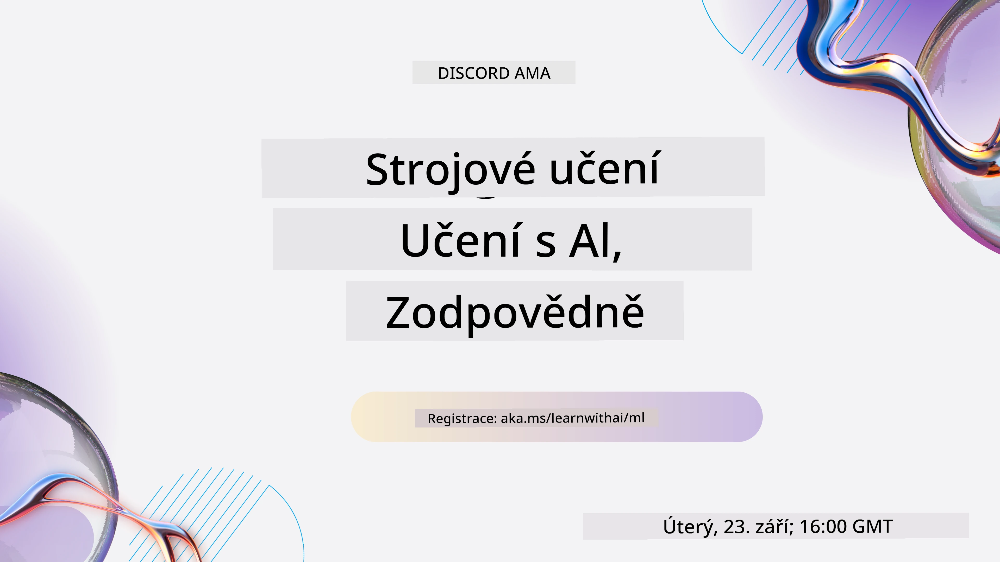
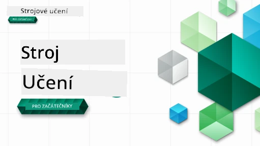

[](https://github.com/microsoft/ML-For-Beginners/blob/master/LICENSE)
[](https://GitHub.com/microsoft/ML-For-Beginners/graphs/contributors/)
[](https://GitHub.com/microsoft/ML-For-Beginners/issues/)
[](https://GitHub.com/microsoft/ML-For-Beginners/pulls/)
[](http://makeapullrequest.com)

[](https://GitHub.com/microsoft/ML-For-Beginners/watchers/)
[](https://GitHub.com/microsoft/ML-For-Beginners/network/)
[](https://GitHub.com/microsoft/ML-For-Beginners/stargazers/)

### 🌐 Podpora více jazyků

#### Podporováno přes GitHub Action (automatizováno a vždy aktuální)

<!-- CO-OP TRANSLATOR LANGUAGES TABLE START -->
[Arabic](../ar/README.md) | [Bengali](../bn/README.md) | [Bulgarian](../bg/README.md) | [Burmese (Myanmar)](../my/README.md) | [Chinese (Simplified)](../zh-CN/README.md) | [Chinese (Traditional, Hong Kong)](../zh-HK/README.md) | [Chinese (Traditional, Macau)](../zh-MO/README.md) | [Chinese (Traditional, Taiwan)](../zh-TW/README.md) | [Croatian](../hr/README.md) | [Czech](./README.md) | [Danish](../da/README.md) | [Dutch](../nl/README.md) | [Estonian](../et/README.md) | [Finnish](../fi/README.md) | [French](../fr/README.md) | [German](../de/README.md) | [Greek](../el/README.md) | [Hebrew](../he/README.md) | [Hindi](../hi/README.md) | [Hungarian](../hu/README.md) | [Indonesian](../id/README.md) | [Italian](../it/README.md) | [Japanese](../ja/README.md) | [Kannada](../kn/README.md) | [Khmer](../km/README.md) | [Korean](../ko/README.md) | [Lithuanian](../lt/README.md) | [Malay](../ms/README.md) | [Malayalam](../ml/README.md) | [Marathi](../mr/README.md) | [Nepali](../ne/README.md) | [Nigerian Pidgin](../pcm/README.md) | [Norwegian](../no/README.md) | [Persian (Farsi)](../fa/README.md) | [Polish](../pl/README.md) | [Portuguese (Brazil)](../pt-BR/README.md) | [Portuguese (Portugal)](../pt-PT/README.md) | [Punjabi (Gurmukhi)](../pa/README.md) | [Romanian](../ro/README.md) | [Russian](../ru/README.md) | [Serbian (Cyrillic)](../sr/README.md) | [Slovak](../sk/README.md) | [Slovenian](../sl/README.md) | [Spanish](../es/README.md) | [Swahili](../sw/README.md) | [Swedish](../sv/README.md) | [Tagalog (Filipino)](../tl/README.md) | [Tamil](../ta/README.md) | [Telugu](../te/README.md) | [Thai](../th/README.md) | [Turkish](../tr/README.md) | [Ukrainian](../uk/README.md) | [Urdu](../ur/README.md) | [Vietnamese](../vi/README.md)

> **Raději klonovat lokálně?**
>
> Tento repozitář obsahuje přes 50 jazykových překladů, což výrazně zvětšuje velikost ke stažení. Pro klonování bez překladů použijte sparse checkout:
>
> **Bash / macOS / Linux:**
> ```bash
> git clone --filter=blob:none --sparse https://github.com/microsoft/ML-For-Beginners.git
> cd ML-For-Beginners
> git sparse-checkout set --no-cone '/*' '!translations' '!translated_images'
> ```
>
> **CMD (Windows):**
> ```cmd
> git clone --filter=blob:none --sparse https://github.com/microsoft/ML-For-Beginners.git
> cd ML-For-Beginners
> git sparse-checkout set --no-cone "/*" "!translations" "!translated_images"
> ```
>
> Získáte vše, co potřebujete pro dokončení kurzu, s mnohem rychlejším stažením.
<!-- CO-OP TRANSLATOR LANGUAGES TABLE END -->

#### Připojte se k naší komunitě

[](https://discord.gg/nTYy5BXMWG)

Máme probíhající sérii Learn with AI na Discordu, dozvíte se více a připojíte se k nám na [Learn with AI Series](https://aka.ms/learnwithai/discord) od 18. do 30. září 2025. Získáte tipy a triky, jak používat GitHub Copilot pro Data Science.



# Strojové učení pro začátečníky – učební plán

> 🌍 Cestujte po celém světě a objevujte strojové učení prostřednictvím světových kultur 🌍

Cloud Advocates ve společnosti Microsoft s potěšením nabízejí 12týdenní, 26-lekční učební plán zaměřený na **strojové učení**. V tomto učebním plánu se naučíte, co se někdy nazývá **klasickým strojovým učením**, používající především knihovnu Scikit-learn a vyhýbající se hlubokému učení, které je pokryto v našem [učebním plánu AI pro začátečníky](https://aka.ms/ai4beginners). Tyto lekce zkombinujte s naším [učebním plánem Data Science pro začátečníky](https://aka.ms/ds4beginners) také!

Cestujte s námi po celém světě, jak aplikujeme tyto klasické techniky na data z mnoha oblastí světa. Každá lekce obsahuje před- a po- lekční kvízy, psané instrukce k dokončení lekce, řešení, úkol a další. Naše projektově orientovaná pedagogika vám umožní učit se při tvorbě, což je osvědčený způsob, jak si nové dovednosti udržet.

**✍️ Upřímné díky našim autorům** Jen Looper, Stephen Howell, Francesca Lazzeri, Tomomi Imura, Cassie Breviu, Dmitry Soshnikov, Chris Noring, Anirban Mukherjee, Ornella Altunyan, Ruth Yakubu a Amy Boyd

**🎨 Díky také našim ilustrátorům** Tomomi Imura, Dasani Madipalli a Jen Looper

**🙏 Zvláštní poděkování 🙏 našim autorům, recenzentům a přispěvatelům obsahu ze studentů Microsoft Student Ambassador**, zejména Rishit Dagli, Muhammad Sakib Khan Inan, Rohan Raj, Alexandru Petrescu, Abhishek Jaiswal, Nawrin Tabassum, Ioan Samuila a Snigdha Agarwal

**🤩 Extra poděkování Microsoft Student Ambassadors Eric Wanjau, Jasleen Sondhi a Vidushi Gupta za naše lekce v R!**

# Začínáme

Postupujte podle těchto kroků:
1. **Vytvořte fork repozitáře**: Klikněte na tlačítko „Fork“ v pravém horním rohu této stránky.
2. **Klonujte repozitář**:   `git clone https://github.com/microsoft/ML-For-Beginners.git`

> 💡 **Tip pro rychlý začátek:** Chcete začít v prohlížeči bez nutnosti lokální instalace Pythonu? Použijte [GitHub Codespaces](https://github.com/features/codespaces), vytvořte si cloudové vývojové prostředí pro svůj fork. Otevřete zelené menu **Code**, vyberte **Codespaces** a vytvořte si kódovací prostor; nainstalujte požadované závislosti každé lekce podle potřeby.

> [najděte všechny další zdroje k tomuto kurzu v naší kolekci Microsoft Learn](https://learn.microsoft.com/en-us/collections/qrqzamz1nn2wx3?WT.mc_id=academic-77952-bethanycheum)

> 🔧 **Potřebujete pomoc?** Podívejte se na náš [Průvodce řešením problémů](TROUBLESHOOTING.md) pro řešení běžných potíží s instalací, nastavením a spuštěním lekcí.


**[Studenti](https://aka.ms/student-page)**, k využití tohoto učebního plánu si vytvořte fork celého repozitáře na svůj účet GitHub a cvičení dokončujte sami nebo ve skupině:

- Začněte přednáškovým kvízem.
- Přečtěte si přednášku a dokončete aktivity, zastavujte se a zvažujte při každé kontrole vědomostí.
- Pokuste se vytvořit projekty pochopením lekcí, nikoliv pouhým spuštěním řešení; ale tento kód je k dispozici ve složkách `/solution` v každé lekci zaměřené na projekt.
- Udělejte po přednášce kvíz.
- Dokončete výzvu.
- Splňte zadání.
- Po dokončení skupiny lekcí navštivte [Diskusní fórum](https://github.com/microsoft/ML-For-Beginners/discussions) a „učte se nahlas“ vyplněním příslušné rubriky PAT. ‚PAT‘ je nástroj pro hodnocení pokroku, který vyplníte pro lepší učení. Také můžete reagovat na ostatní PAT, aby jsme se učili spolu.

> Pro další studium doporučujeme sledovat tyto moduly a vzdělávací cesty na [Microsoft Learn](https://docs.microsoft.com/en-us/users/jenlooper-2911/collections/k7o7tg1gp306q4?WT.mc_id=academic-77952-leestott).

**Učitelé**, připravili jsme [několik návrhů](for-teachers.md), jak tento učební plán využít.

---

## Video návody

Některé lekce jsou dostupné jako krátká videa. Všechny najdete přímo v lekcích nebo v [playlistu ML for Beginners na kanálu Microsoft Developer YouTube](https://aka.ms/ml-beginners-videos) kliknutím na obrázek níže.

[](https://aka.ms/ml-beginners-videos)

---

## Seznamte se s týmem

[](https://youtu.be/Tj1XWrDSYJU)

**Gif vytvořil** [Mohit Jaisal](https://linkedin.com/in/mohitjaisal)

> 🎥 Klikněte na obrázek výše pro video o projektu a lidech, kteří ho vytvořili!

---

## Pedagogika

Při tvorbě tohoto učebního plánu jsme zvolili dvě pedagogické zásady: zajistit, aby byl **projektově orientovaný** s praktickým pojetím a aby obsahoval **časté kvízy**. Navíc má tento učební plán společné **téma** pro lepší propojení.

Díky sladění obsahu s projekty je proces pro studenty zajímavější a zapamatování pojmů se zlepší. Nízkorizikový kvíz před hodinou nastavuje záměr studenta pro naučení tématu, zatímco druhý kvíz po hodině zajistí další upevnění vědomostí. Tento učební plán je navržen tak, aby byl flexibilní a zábavný, lze jej absolvovat celý nebo po částech. Projekty začínají malé a postupně se až do posledního 12týdenního cyklu stávají složitějšími. V učebním plánu je také poscriptum o reálných aplikacích ML, které lze využít jako extra kredit nebo jako podklad k diskusi.

> Najděte náš [Kodex chování](CODE_OF_CONDUCT.md), [Příspěvky](CONTRIBUTING.md), [Překlady](..) a [Řešení problémů](TROUBLESHOOTING.md). Oceňujeme vaše konstruktivní připomínky!

## Každá lekce zahrnuje

- volitelnou sketchnotu
- volitelné doplňkové video
- video průvodce (pouze některé lekce)
- [předešlý warmup kvíz](https://ff-quizzes.netlify.app/en/ml/)
- psanou lekci
- pro projektové lekce krok-za-krokem návody, jak projekt vybudovat
- kontroly znalostí
- výzvu
- doplňkové čtení
- úkol
- [povýsledný kvíz](https://ff-quizzes.netlify.app/en/ml/)

> **Poznámka k jazykům**: Tyto lekce jsou primárně psány v Pythonu, ale mnoho je také dostupných v R. Pro dokončení R lekce přejděte do složky `/solution` a hledejte lekce v R. Mají příponu .rmd, což je **R Markdown** soubor, který lze jednoduše definovat jako vložení `kódových bloků` (v R nebo jiných jazycích) a `YAML hlavičky` (určující formátování výstupů, např. PDF) do `Markdown dokumentu`. Slouží tak jako příkladný editační rámec pro datovou vědu, protože umožňuje kombinovat váš kód, jeho výstupy a vaše myšlenky na jednom místě v Markdownu. R Markdown dokumenty lze navíc vykreslit do formátů jako PDF, HTML nebo Word.

> **Poznámka ke kvízům**: Všechny kvízy jsou v [složce Quiz App](../../quiz-app), celkem 52 kvízů po třech otázkách. Jsou propojené z lekcí, ale kvízovou aplikaci lze spustit i lokálně; postupujte podle návodu ve složce `quiz-app`, abyste aplikaci hostovali lokálně nebo nasadili do Azure.

| Číslo lekce |                              Téma                               |                   Skupina lekcí                   | Cíle učení                                                                                                                   |                                                             Propojená lekce                                                               |                        Autor                        |
| :-----------: | :------------------------------------------------------------: | :-------------------------------------------------: | ------------------------------------------------------------------------------------------------------------------------------- | :--------------------------------------------------------------------------------------------------------------------------------------: | :--------------------------------------------------: |
|      01       |                Úvod do strojového učení                |      [Úvod](1-Introduction/README.md)       | Naučte se základní koncepty strojového učení                                                                                |                                             [Lekce](1-Introduction/1-intro-to-ML/README.md)                                             |                       Muhammad                       |
|      02       |                Historie strojového učení                 |      [Úvod](1-Introduction/README.md)       | Seznamte se s historií tohoto oboru                                                                                         |                                            [Lekce](1-Introduction/2-history-of-ML/README.md)                                            |                     Jen a Amy                      |
|      03       |                 Spravedlnost a strojové učení                  |      [Úvod](1-Introduction/README.md)       | Jaké jsou důležité filozofické otázky kolem spravedlnosti, které by studenti měli zvážit při vytváření a aplikaci modelů ML? |                                              [Lekce](1-Introduction/3-fairness/README.md)                                               |                        Tomomi                        |
|      04       |                Techniky strojového učení                 |      [Úvod](1-Introduction/README.md)       | Jaké techniky používají výzkumníci ML k vytváření modelů ML?                                                                       |                                          [Lekce](1-Introduction/4-techniques-of-ML/README.md)                                           |                    Chris a Jen                     |
|      05       |                   Úvod do regrese                   |        [Regrese](2-Regression/README.md)         | Začněte s Pythonem a Scikit-learn pro regresní modely                                                                  |         [Python](2-Regression/1-Tools/README.md) • [R](../../2-Regression/1-Tools/solution/R/lesson_1.html)         |      Jen • Eric Wanjau       |
|      06       |                Ceny dýní v Severní Americe 🎃                |        [Regrese](2-Regression/README.md)         | Vizualizujte a vyčistěte data jako přípravu na ML                                                                                  |          [Python](2-Regression/2-Data/README.md) • [R](../../2-Regression/2-Data/solution/R/lesson_2.html)          |      Jen • Eric Wanjau       |
|      07       |                Ceny dýní v Severní Americe 🎃                |        [Regrese](2-Regression/README.md)         | Vytvořte lineární a polynomiální regresní modely                                                                                   |        [Python](2-Regression/3-Linear/README.md) • [R](../../2-Regression/3-Linear/solution/R/lesson_3.html)        |      Jen a Dmitry • Eric Wanjau       |
|      08       |                Ceny dýní v Severní Americe 🎃                |        [Regrese](2-Regression/README.md)         | Vytvořte logistický regresní model                                                                                               |     [Python](2-Regression/4-Logistic/README.md) • [R](../../2-Regression/4-Logistic/solution/R/lesson_4.html)      |      Jen • Eric Wanjau       |
|      09       |                          Webová aplikace 🔌                          |           [Webová aplikace](3-Web-App/README.md)            | Vytvořte webovou aplikaci pro použití vašeho natrénovaného modelu                                                                                       |                                                 [Python](3-Web-App/1-Web-App/README.md)                                                  |                         Jen                          |
|      10       |                 Úvod do klasifikace                 |    [Klasifikace](4-Classification/README.md)     | Vyčistěte, připravte a vizualizujte svá data; úvod do klasifikace                                                            | [Python](4-Classification/1-Introduction/README.md) • [R](../../4-Classification/1-Introduction/solution/R/lesson_10.html)  | Jen a Cassie • Eric Wanjau |
|      11       |             Lahodné asijské a indické kuchyně 🍜             |    [Klasifikace](4-Classification/README.md)     | Úvod do klasifikátorů                                                                                                     | [Python](4-Classification/2-Classifiers-1/README.md) • [R](../../4-Classification/2-Classifiers-1/solution/R/lesson_11.html) | Jen a Cassie • Eric Wanjau |
|      12       |             Lahodné asijské a indické kuchyně 🍜             |    [Klasifikace](4-Classification/README.md)     | Další klasifikátory                                                                                                                | [Python](4-Classification/3-Classifiers-2/README.md) • [R](../../4-Classification/3-Classifiers-2/solution/R/lesson_12.html) | Jen a Cassie • Eric Wanjau |
|      13       |             Lahodné asijské a indické kuchyně 🍜             |    [Klasifikace](4-Classification/README.md)     | Vytvořte doporučující webovou aplikaci pomocí vašeho modelu                                                                                    |                                              [Python](4-Classification/4-Applied/README.md)                                              |                         Jen                          |
|      14       |                   Úvod do shlukování                   |        [Shlukování](5-Clustering/README.md)         | Vyčistěte, připravte a vizualizujte svá data; úvod do shlukování                                                                |         [Python](5-Clustering/1-Visualize/README.md) • [R](../../5-Clustering/1-Visualize/solution/R/lesson_14.html)         |      Jen • Eric Wanjau       |
|      15       |              Prozkoumání nigerijských hudebních vkusů 🎧              |        [Shlukování](5-Clustering/README.md)         | Prozkoumejte metodu K-Means                                                                                        |           [Python](5-Clustering/2-K-Means/README.md) • [R](../../5-Clustering/2-K-Means/solution/R/lesson_15.html)           |      Jen • Eric Wanjau       |
|      16       |        Úvod do zpracování přirozeného jazyka ☕️         |   [Zpracování přirozeného jazyka](6-NLP/README.md)    | Naučte se základy NLP vytvořením jednoduchého bota                                                                             |                                             [Python](6-NLP/1-Introduction-to-NLP/README.md)                                              |                       Stephen                        |
|      17       |                      Běžné úlohy NLP ☕️                      |   [Zpracování přirozeného jazyka](6-NLP/README.md)    | Prohlubte své znalosti NLP pochopením běžných úloh spojených se strukturou jazyka                          |                                                    [Python](6-NLP/2-Tasks/README.md)                                                     |                       Stephen                        |
|      18       |             Překlad a analýza sentimentu ♥️              |   [Zpracování přirozeného jazyka](6-NLP/README.md)    | Překlad a analýza sentimentu s Jane Austen                                                                             |                                            [Python](6-NLP/3-Translation-Sentiment/README.md)                                             |                       Stephen                        |
|      19       |                  Romantické hotely v Evropě ♥️                  |   [Zpracování přirozeného jazyka](6-NLP/README.md)    | Analýza sentimentu recenzí hotelů 1                                                                                         |                                               [Python](6-NLP/4-Hotel-Reviews-1/README.md)                                                |                       Stephen                        |
|      20       |                  Romantické hotely v Evropě ♥️                  |   [Zpracování přirozeného jazyka](6-NLP/README.md)    | Analýza sentimentu recenzí hotelů 2                                                                                         |                                               [Python](6-NLP/5-Hotel-Reviews-2/README.md)                                                |                       Stephen                        |
|      21       |            Úvod do predikce časových řad             |        [Časové řady](7-TimeSeries/README.md)        | Úvod do predikce časových řad                                                                                         |                                             [Python](7-TimeSeries/1-Introduction/README.md)                                              |                      Francesca                       |
|      22       | ⚡️ Světová spotřeba energie ⚡️ – predikce časových řad s ARIMA |        [Časové řady](7-TimeSeries/README.md)        | Predikce časových řad pomocí ARIMA                                                                                              |                                                 [Python](7-TimeSeries/2-ARIMA/README.md)                                                 |                      Francesca                       |
|      23       |  ⚡️ Světová spotřeba energie ⚡️ – predikce časových řad s SVR  |        [Časové řady](7-TimeSeries/README.md)        | Predikce časových řad pomocí regresoru s podporou vektorů                                                                           |                                                  [Python](7-TimeSeries/3-SVR/README.md)                                                  |                       Anirban                        |
|      24       |             Úvod do posilovacího učení             | [Posilovací učení](8-Reinforcement/README.md) | Úvod do posilovacího učení s Q-Learning                                                                          |                                             [Python](8-Reinforcement/1-QLearning/README.md)                                              |                        Dmitry                        |
|      25       |                 Pomozte Petrovi vyhnout se vlkovi! 🐺                  | [Posilovací učení](8-Reinforcement/README.md) | Posilovací učení pomocí Gym                                                                                                      |                                                [Python](8-Reinforcement/2-Gym/README.md)                                                 |                        Dmitry                        |
|  Poznámka   |            Reálné scénáře a aplikace ML            |      [ML ve světě](9-Real-World/README.md)       | Zajímavé a odhalující reálné aplikace klasického ML                                                               |                                             [Lekce](9-Real-World/1-Applications/README.md)                                              |                         Tým                         |
|  Poznámka   |            Ladění modelů v ML pomocí dashboardu RAI            |      [ML ve světě](9-Real-World/README.md)       | Ladění modelů ve strojovém učení pomocí komponent dashboardu Responsible AI                                                              |                                             [Lekce](9-Real-World/2-Debugging-ML-Models/README.md)                                              |                     Ruth Yakubu                      |

> [najděte všechny další zdroje pro tento kurz v naší kolekci Microsoft Learn](https://learn.microsoft.com/en-us/collections/qrqzamz1nn2wx3?WT.mc_id=academic-77952-bethanycheum)

## Offline přístup

Tuto dokumentaci můžete spustit offline pomocí [Docsify](https://docsify.js.org/#/). Vytvořte fork tohoto repozitáře, [nainstalujte Docsify](https://docsify.js.org/#/quickstart) na vašem lokálním stroji a pak v kořenové složce tohoto repozitáře zadejte příkaz `docsify serve`. Web bude dostupný na portu 3000 na vašem localhostu: `localhost:3000`.

## PDF

Najdete zde pdf osnovy s odkazy [zde](https://microsoft.github.io/ML-For-Beginners/pdf/readme.pdf).


## 🎒 Další kurzy 

Náš tým vytváří i další kurzy! Podívejte se na:

<!-- CO-OP TRANSLATOR OTHER COURSES START -->
### LangChain
[](https://aka.ms/langchain4j-for-beginners)
[](https://aka.ms/langchainjs-for-beginners?WT.mc_id=m365-94501-dwahlin)
[](https://github.com/microsoft/langchain-for-beginners?WT.mc_id=m365-94501-dwahlin)
---

### Azure / Edge / MCP / Agenti
[](https://github.com/microsoft/AZD-for-beginners?WT.mc_id=academic-105485-koreyst)
[](https://github.com/microsoft/edgeai-for-beginners?WT.mc_id=academic-105485-koreyst)
[](https://github.com/microsoft/mcp-for-beginners?WT.mc_id=academic-105485-koreyst)
[](https://github.com/microsoft/ai-agents-for-beginners?WT.mc_id=academic-105485-koreyst)

---
 
### Série Generativní AI
[](https://github.com/microsoft/generative-ai-for-beginners?WT.mc_id=academic-105485-koreyst)
[-9333EA?style=for-the-badge&labelColor=E5E7EB&color=9333EA)](https://github.com/microsoft/Generative-AI-for-beginners-dotnet?WT.mc_id=academic-105485-koreyst)
[-C084FC?style=for-the-badge&labelColor=E5E7EB&color=C084FC)](https://github.com/microsoft/generative-ai-for-beginners-java?WT.mc_id=academic-105485-koreyst)
[-E879F9?style=for-the-badge&labelColor=E5E7EB&color=E879F9)](https://github.com/microsoft/generative-ai-with-javascript?WT.mc_id=academic-105485-koreyst)

---
 
### Základní vzdělávání
[](https://aka.ms/ml-beginners?WT.mc_id=academic-105485-koreyst)
[](https://aka.ms/datascience-beginners?WT.mc_id=academic-105485-koreyst)
[](https://aka.ms/ai-beginners?WT.mc_id=academic-105485-koreyst)
[](https://github.com/microsoft/Security-101?WT.mc_id=academic-96948-sayoung)
[](https://aka.ms/webdev-beginners?WT.mc_id=academic-105485-koreyst)
[](https://aka.ms/iot-beginners?WT.mc_id=academic-105485-koreyst)
[](https://github.com/microsoft/xr-development-for-beginners?WT.mc_id=academic-105485-koreyst)

---
 
### Série Copilot
[](https://aka.ms/GitHubCopilotAI?WT.mc_id=academic-105485-koreyst)
[](https://github.com/microsoft/mastering-github-copilot-for-dotnet-csharp-developers?WT.mc_id=academic-105485-koreyst)
[](https://github.com/microsoft/CopilotAdventures?WT.mc_id=academic-105485-koreyst)
<!-- CO-OP TRANSLATOR OTHER COURSES END -->

## Jak získat pomoc

Pokud se zaseknete nebo budete mít otázky při učení strojového učení nebo vytváření AI aplikací, nedělejte si starosti — pomoc je k dispozici.

Můžete se připojit k diskuzím s ostatními studenty a vývojáři, klást otázky a sdílet své nápady s komunitou.

- Připojte se ke komunitě, abyste mohli klást otázky a učit se s ostatními
- Diskutujte koncepty strojového učení a projektové nápady
- Získejte rady od zkušených vývojářů

Podpůrná komunita je skvělým způsobem, jak rozvíjet své dovednosti a řešit problémy rychleji.

[Microsoft Foundry Discord Community](https://discord.gg/nTYy5BXMWG)

Pokud narazíte na chyby, problémy nebo máte nápady na zlepšení, můžete také otevřít **Issue** v tomto repozitáři a ohlásit problém.

Pro zpětnou vazbu k produktu nebo pro vyhledávání příspěvků v komunitě navštivte Vývojářské fórum:

[](https://aka.ms/foundry/forum)

## Další tipy pro učení

- Pro větší pochopení si po každé lekci opakujte poznámky.
- Procvičujte si implementaci algoritmů sami.
- Prozkoumejte reálné datasety pomocí naučených konceptů.

---

<!-- CO-OP TRANSLATOR DISCLAIMER START -->
**Prohlášení o omezení odpovědnosti**:
Tento dokument byl přeložen pomocí AI překladatelské služby [Co-op Translator](https://github.com/Azure/co-op-translator). Přestože usilujeme o co největší přesnost, mějte prosím na paměti, že automatizované překlady mohou obsahovat chyby nebo nepřesnosti. Originální dokument v jeho mateřském jazyce by měl být považován za autoritativní zdroj. Pro kritické informace se doporučuje profesionální lidský překlad. Nejsme odpovědní za jakékoli nedorozumění nebo nesprávné interpretace vzniklé použitím tohoto překladu.
<!-- CO-OP TRANSLATOR DISCLAIMER END -->