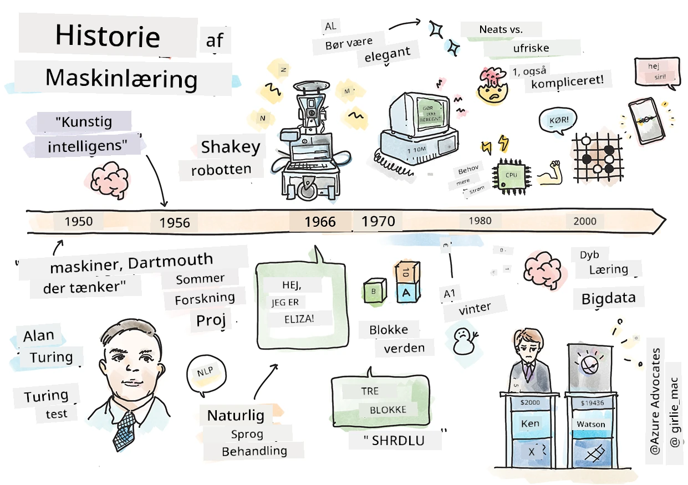
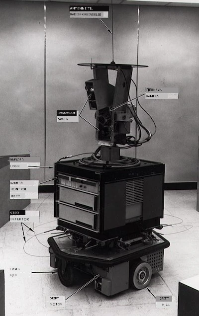
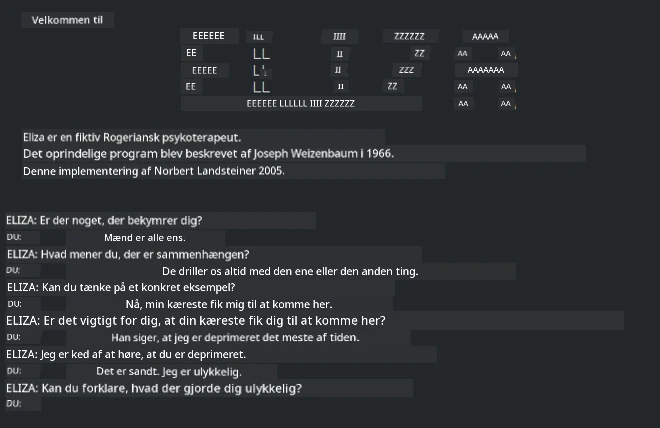

# Historien om maskinlæring

> Sketchnote af [Tomomi Imura](https://www.twitter.com/girlie_mac)

## [Quiz før lektionen](https://ff-quizzes.netlify.app/en/ml/)

---

> 🎥 Klik på billedet ovenfor for en kort video, der gennemgår denne lektion.

I denne lektion vil vi gennemgå de vigtigste milepæle i historien om maskinlæring og kunstig intelligens.

Historien om kunstig intelligens (AI) som felt er tæt sammenvævet med historien om maskinlæring, da de algoritmer og beregningsmæssige fremskridt, der understøtter ML, bidrog til udviklingen af AI. Det er nyttigt at huske, at selvom disse felter som adskilte forskningsområder begyndte at tage form i 1950'erne, forudgik vigtige [algoritmiske, statistiske, matematiske, beregningsmæssige og tekniske opdagelser](https://wikipedia.org/wiki/Timeline_of_machine_learning) denne tid og overlappede den. Faktisk har mennesker tænkt over disse spørgsmål i [hundreder af år](https://wikipedia.org/wiki/History_of_artificial_intelligence): denne artikel beskriver de historiske intellektuelle grundlag for ideen om en 'tænkende maskine.'

---
## Bemærkelsesværdige opdagelser

- 1763, 1812 [Bayes' Sætning](https://wikipedia.org/wiki/Bayes%27_theorem) og dens forgængere. Denne sætning og dens anvendelser ligger til grund for inferens og beskriver sandsynligheden for, at en begivenhed indtræffer baseret på tidligere viden.
- 1805 [Mindste kvadraters teori](https://wikipedia.org/wiki/Least_squares) af den franske matematiker Adrien-Marie Legendre. Denne teori, som du vil lære om i vores Regression-enhed, hjælper med datatilpasning.
- 1913 [Markov-kæder](https://wikipedia.org/wiki/Markov_chain), opkaldt efter den russiske matematiker Andrey Markov, bruges til at beskrive en sekvens af mulige hændelser baseret på en tidligere tilstand.
- 1957 [Perceptron](https://wikipedia.org/wiki/Perceptron) er en type lineær klassifikator opfundet af den amerikanske psykolog Frank Rosenblatt, som ligger til grund for fremskridt inden for dybdelæring.

---

- 1967 [Nærmeste nabo](https://wikipedia.org/wiki/Nearest_neighbor) er en algoritme oprindeligt designet til at kortlægge ruter. I en ML-kontekst bruges den til at opdage mønstre.
- 1970 [Backpropagation](https://wikipedia.org/wiki/Backpropagation) bruges til at træne [feedforward neurale netværk](https://wikipedia.org/wiki/Feedforward_neural_network).
- 1982 [Rekurrente neurale netværk](https://wikipedia.org/wiki/Recurrent_neural_network) er kunstige neurale netværk afledt af feedforward neurale netværk, der skaber temporale grafer.

✅ Lav lidt research. Hvilke andre datoer skiller sig ud som afgørende i historien om ML og AI?

---
## 1950: Maskiner der tænker

Alan Turing, en virkelig bemærkelsesværdig person, der blev stemt [af offentligheden i 2019](https://wikipedia.org/wiki/Icons:_The_Greatest_Person_of_the_20th_Century) som det største videnskabelige geni i det 20. århundrede, krediteres for at have været med til at lægge fundamentet for konceptet om en 'maskine, der kan tænke.' Han kæmpede med skeptikere og sit eget behov for empiriske beviser på dette koncept delvist ved at skabe [Turing-testen](https://www.bbc.com/news/technology-18475646), som du vil udforske i vores NLP-lektioner.

---
## 1956: Dartmouth Summer Research Project

"Dartmouth Summer Research Project om kunstig intelligens var en skelsættende begivenhed for kunstig intelligens som felt," og det var her, at udtrykket 'kunstig intelligens' blev opfundet ([kilde](https://250.dartmouth.edu/highlights/artificial-intelligence-ai-coined-dartmouth)).

> Enhver aspekt af læring eller enhver anden egenskab ved intelligens kan i princippet beskrives så præcist, at en maskine kan laves til at simulere det.

---

Hovedforskeren, matematikprofessor John McCarthy, håbede "at gå videre på basis af antagelsen om, at enhver aspekt af læring eller enhver anden egenskab ved intelligens i princippet kan beskrives så præcist, at en maskine kan laves til at simulere det." Deltagerne inkluderede en anden koryfæ inden for feltet, Marvin Minsky.

Workshoppen tilskrives at have igangsat og opmuntret flere diskussioner herunder "stigningen af symbolske metoder, systemer fokuseret på begrænsede domæner (tidlige ekspertsystemer) og deduktive systemer versus induktive systemer." ([kilde](https://wikipedia.org/wiki/Dartmouth_workshop)).

---
## 1956 - 1974: "De gyldne år"

Fra 1950'erne til midten af 70'erne var optimismen stor om, at AI kunne løse mange problemer. I 1967 udtalte Marvin Minsky selvsikkert, at "Inden for en generation ... vil problemet med at skabe 'kunstig intelligens' være stort set løst." (Minsky, Marvin (1967), Computation: Finite and Infinite Machines, Englewood Cliffs, N.J.: Prentice-Hall)

Forskning i naturlig sprogbehandling blomstrede, søgning blev forfinet og gjort mere kraftfuld, og konceptet 'mikroverdener' blev skabt, hvor simple opgaver blev udført ved hjælp af almindelige sproglige instruktioner.

---

Forskning blev godt finansieret af statslige agenturer, fremskridt blev gjort inden for beregning og algoritmer, og prototyper af intelligente maskiner blev bygget. Nogle af disse maskiner inkluderer:

* [Shakey robotten](https://wikipedia.org/wiki/Shakey_the_robot), som kunne manøvrere og beslutte, hvordan opgaver skulle udføres 'intelligent'.

    
    > Shakey i 1972

---

* Eliza, en tidlig 'chatterbot', kunne samtale med folk og fungere som en primitiv 'terapeut'. Du vil lære mere om Eliza i NLP-lektionerne.

    
    > En version af Eliza, en chatbot

---

* "Blocks world" var et eksempel på en mikroverden, hvor blokke kunne stables og sorteres, og eksperimenter i at lære maskiner at træffe beslutninger kunne testes. Fremskridt bygget med biblioteker såsom [SHRDLU](https://wikipedia.org/wiki/SHRDLU) hjalp med at fremme sprogbehandlingen.

    

    > 🎥 Klik på billedet ovenfor for en video: Blocks world med SHRDLU

---
## 1974 - 1980: "AI Vinter"

I midten af 1970'erne blev det tydeligt, at kompleksiteten ved at lave 'intelligente maskiner' var undervurderet, og at løftet, givet den tilgængelige regnekraft, var blevet overdrevet. Finansieringen tørrede ud, og tilliden til feltet sank. Nogle af de problemer, der påvirkede tilliden, omfattede:
---
- **Begrænsninger**. Regnekraften var for begrænset.
- **Kombinatorisk eksplosion**. Antallet af parametre, der skulle trænes, voksede eksponentielt, efterhånden som mere blev stillet af computere, uden en parallel udvikling af regnekraft og kapacitet.
- **Mangel på data**. Der var mangel på data, hvilket hæmmede processen med at teste, udvikle og forfine algoritmer.
- **Stiller vi de rigtige spørgsmål?**. De spørgsmål, der blev stillet, begyndte at blive stillet spørgsmålstegn ved. Forskere begyndte at modtage kritik af deres tilgange:
  - Turing-testene blev udfordret via blandt andet 'kineserumsteorien', som hævdede, at "programmering af en digital computer kan få den til at se ud som om den forstår sprog, men den kan ikke producere reel forståelse." ([kilde](https://plato.stanford.edu/entries/chinese-room/))
  - Etikken i at introducere kunstige intelligenser som "terapeuten" ELIZA i samfundet blev udfordret.

---

Samtidig begyndte forskellige AI-skoler at forme sig. Et skel blev etableret mellem ["rodet" vs. "pænt AI"](https://wikipedia.org/wiki/Neats_and_scruffies) praksis. _Rodede_ laboratorier rettede programmer i timevis, indtil de havde de ønskede resultater. _Pæne_ laboratorier "fokuserede på logik og formel problemløsning". ELIZA og SHRDLU var velkendte _rodede_ systemer. I 1980'erne, efterhånden som efterspørgslen steg for at gøre ML-systemer reproducerbare, tog den _pæne_ tilgang gradvist føringen, da dens resultater er mere forklarlige.

---
## 1980'ernes Ekspertsystemer

Efterhånden som feltet voksede, blev dets fordel for erhvervslivet klarere, og i 1980'erne steg også udbredelsen af 'ekspertsystemer'. "Ekspertsystemer var blandt de første virkelig succesfulde former for kunstig intelligens (AI) software." ([kilde](https://wikipedia.org/wiki/Expert_system)).

Denne type system er faktisk _hybrid_, bestående delvist af en regelsmotor, der definerer forretningskrav, og en inferensmotor, der udnyttede regelsystemet til at udlede nye fakta.

Denne æra så også stigende opmærksomhed på neurale netværk.

---
## 1987 - 1993: AI 'Frost'

Udbredelsen af specialiseret ekspertsystemhardware havde den uheldige effekt, at den blev for specialiseret. Fremkomsten af personlige computere konkurrerede også med disse store, specialiserede, centraliserede systemer. Demokratiseringen af computere var begyndt og banede til sidst vejen for den moderne eksplosion af big data.

---
## 1993 - 2011

Denne epoke så en ny æra for ML og AI til at kunne løse nogle af de problemer, der tidligere var forårsaget af mangel på data og regnekraft. Mængden af data begyndte at stige hurtigt og blive mere bredt tilgængelig, både til det bedre og det værre, især med fremkomsten af smartphonen omkring 2007. Regnekraften udvidede sig eksponentielt, og algoritmer udviklede sig parallelt. Feltet begyndte at modne, efterhånden som de frihjuleriske dage fra fortiden begyndte at krystallisere til en ægte disciplin.

---
## Nu

I dag berører maskinlæring og AI næsten alle dele af vores liv. Denne æra kræver en omhyggelig forståelse af risiciene og de potentielle effekter af disse algoritmer på menneskeliv. Som Microsofts Brad Smith har sagt: "Informationsteknologi rejser spørgsmål, der går til kernen af fundamentale menneskerettighedsbeskyttelser som privatliv og ytringsfrihed. Disse spørgsmål øger ansvaret for teknologivirksomheder, der skaber disse produkter. Efter vores opfattelse kræver de også en gennemtænkt regeringsregulering og udvikling af normer omkring acceptable anvendelser" ([kilde](https://www.technologyreview.com/2019/12/18/102365/the-future-of-ais-impact-on-society/)).

---

Det må vise sig, hvad fremtiden bringer, men det er vigtigt at forstå disse computersystemer og den software og de algoritmer, de kører med. Vi håber, at dette pensum vil hjælpe dig med at opnå en bedre forståelse, så du kan beslutte det selv.

> 🎥 Klik på billedet ovenfor for en video: Yann LeCun diskuterer historien om dybdelæring i denne lektion

---
## 🚀Udfordring

Dyk ned i et af disse historiske øjeblikke og lær mere om menneskene bag. Der er fascinerende personligheder, og ingen videnskabelig opdagelse er nogensinde skabt i et kulturelt vakuum. Hvad opdager du?

## [Quiz efter lektionen](https://ff-quizzes.netlify.app/en/ml/)

---
## Gennemgang og selvstudie

Her er ting at se og lytte til:

[Denne podcast, hvor Amy Boyd diskuterer AI's udvikling](http://runasradio.com/Shows/Show/739)

---

## Opgave

[Lav en tidslinje](assignment.md)

---

<!-- CO-OP TRANSLATOR DISCLAIMER START -->
**Ansvarsfraskrivelse**:
Dette dokument er blevet oversat ved hjælp af AI-oversættelsestjenesten [Co-op Translator](https://github.com/Azure/co-op-translator). Selvom vi bestræber os på nøjagtighed, skal du være opmærksom på, at automatiserede oversættelser kan indeholde fejl eller unøjagtigheder. Det originale dokument på dets oprindelige sprog bør betragtes som den autoritative kilde. For kritisk information anbefales professionel menneskelig oversættelse. Vi påtager os intet ansvar for misforståelser eller fejltolkninger, der opstår som følge af brugen af denne oversættelse.
<!-- CO-OP TRANSLATOR DISCLAIMER END -->