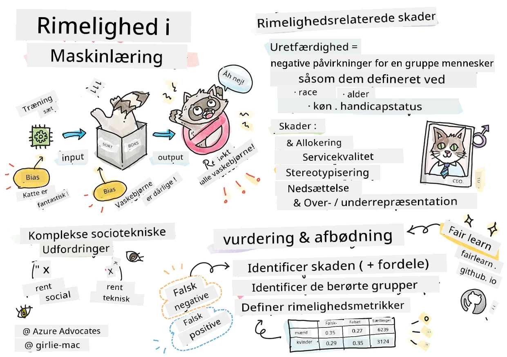
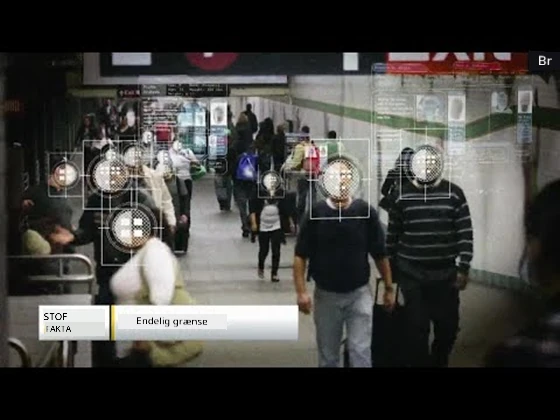

# Opbygning af Maskinlæringsløsninger med ansvarlig AI
 

> Skitsetegning af [Tomomi Imura](https://www.twitter.com/girlie_mac)

## [Forforelæsning quiz](https://ff-quizzes.netlify.app/en/ml/)
 
## Introduktion

I dette curriculum vil du begynde at opdage, hvordan maskinlæring kan og påvirker vores hverdag. Selv nu er systemer og modeller involveret i daglige beslutningstagninger, såsom sundhedsdiagnoser, lån-godkendelser eller registrering af svindel. Derfor er det vigtigt, at disse modeller fungerer godt for at levere resultater, der er pålidelige. Ligesom enhver softwareapplikation vil AI-systemer kunne fejle forventninger eller have uønsket resultat. Derfor er det væsentligt at kunne forstå og forklare adfærden hos en AI-model.

Forestil dig, hvad der kan ske, når de data, du bruger til at opbygge disse modeller, mangler bestemte demografiske grupper, såsom race, køn, politisk synspunkt, religion eller uforholdsmæssigt repræsenterer sådanne demografier. Hvad hvis modellens output fortolkes som favoriserende nogle demografier? Hvad er konsekvensen for anvendelsen? Desuden, hvad sker der, når modellen giver et negativt resultat og er skadelig for mennesker? Hvem er ansvarlig for AI-systemets adfærd? Det er nogle af de spørgsmål, vi vil udforske i dette curriculum.

I denne lektion vil du:

- Øge din bevidsthed om vigtigheden af retfærdighed i maskinlæring og skader relateret til retfærdighed.
- Blive fortrolig med praksissen omkring at undersøge afvigere og usædvanlige scenarier for at sikre pålidelighed og sikkerhed.
- Opnå forståelse for nødvendigheden af at styrke alle ved at designe inkluderende systemer.
- Udforske hvor vigtigt det er at beskytte fortrolighed og datasikkerhed for data og mennesker.
- Se vigtigheden af at have en gennemsigtig tilgang til at forklare AI-modellers adfærd.
- Være opmærksom på, hvordan ansvarlighed er essentiel for at opbygge tillid til AI-systemer.

## Forudsætning

Som forudsætning, tag venligst "Principper for ansvarlig AI" læringssti og se videoen nedenfor om emnet:

Lær mere om ansvarlig AI ved at følge denne [Læringssti](https://docs.microsoft.com/learn/modules/responsible-ai-principles/?WT.mc_id=academic-77952-leestott)

> 🎥 Klik på billedet ovenfor for en video: Microsofts tilgang til ansvarlig AI

## Retfærdighed

AI-systemer bør behandle alle retfærdigt og undgå at påvirke lignende grupper af mennesker på forskellige måder. For eksempel, når AI-systemer leverer vejledning om medicinsk behandling, låneansøgninger eller beskæftigelse, bør de give de samme anbefalinger til alle med lignende symptomer, økonomiske forhold eller faglige kvalifikationer. Hver af os som mennesker bærer rundt på indgroede fordomme, som påvirker vores beslutninger og handlinger. Disse fordomme kan være tydelige i de data, vi bruger til at træne AI-systemer. Sådan manipulation kan nogle gange ske utilsigtet. Det er ofte svært bevidst at vide, hvornår man introducerer bias i data.

**"Uretfærdighed"** omfatter negative påvirkninger, eller "skader", for en gruppe mennesker, såsom dem der er defineret ud fra race, køn, alder eller handicapstatus. De vigtigste skader relateret til retfærdighed kan klassificeres som:

- **Fordeling**, hvis for eksempel et køn eller en etnicitet favoriseres over en anden.
- **Servicekvalitet**. Hvis du træner data til et specifikt scenarie, men virkeligheden er meget mere kompleks, fører det til en dårlig ydende service. For eksempel en håndsæbedispenser, der tilsyneladende ikke kunne genkende mennesker med mørk hud. [Reference](https://gizmodo.com/why-cant-this-soap-dispenser-identify-dark-skin-1797931773)
- **Nedgørelse**. At uretfærdigt kritisere og mærke noget eller nogen. For eksempel blev en billedmærkningsteknologi berygtet for at fejlklassificere billeder af mørkhudede mennesker som gorillaer.
- **Over- eller underrepræsentation**. Ideen er, at en bestemt gruppe ikke ses i et bestemt erhverv, og enhver service eller funktion, der fortsat fremmer det, bidrager til skade.
- **Stereotyper**. At forbinde en given gruppe med forudbestemte karakteristika. For eksempel kan et sprogoversættelsessystem mellem engelsk og tyrkisk have unøjagtigheder på grund af ord med stereotype kønsforbindelser.

> oversættelse til tyrkisk

> oversættelse tilbage til engelsk

Når vi designer og tester AI-systemer, skal vi sikre, at AI er retfærdig og ikke programmeret til at træffe biasede eller diskriminerende beslutninger, som mennesker også er forbudt at gøre. At garantere retfærdighed i AI og maskinlæring forbliver en kompleks socioteknisk udfordring.

### Pålidelighed og sikkerhed

For at opbygge tillid skal AI-systemer være pålidelige, sikre og konsistente under normale og uventede forhold. Det er vigtigt at vide, hvordan AI-systemer vil opføre sig i en række situationer, især når de er afvigere. Når man bygger AI-løsninger, skal der lægges væsentligt fokus på at håndtere en bred vifte af omstændigheder, som AI-løsningerne kan møde. For eksempel skal en selvkørende bil prioritere menneskers sikkerhed højest. Som følge heraf skal AI'en, der driver bilen, tage alle mulige scenarier i betragtning, som bilen kunne støde på, såsom nat, tordenvejr eller snestorm, børn der løber over gaden, kæledyr, vejarbejde mv. Hvor godt et AI-system kan håndtere et bredt spektrum af forhold pålideligt og sikkert, afspejler det niveau af forudseenhed, som dataforsker eller AI-udvikler har haft under design eller test af systemet.

> [🎥 Klik her for en video: ](https://www.microsoft.com/videoplayer/embed/RE4vvIl)

### Inklusivitet

AI-systemer bør designes til at engagere og styrke alle. Når dataforskere og AI-udviklere designer og implementerer AI-systemer, identificerer og håndterer de potentielle barrierer i systemet, som utilsigtet kan udelukke mennesker. For eksempel er der 1 milliard mennesker med handicap på verdensplan. Med AI's fremskridt kan de nemmere få adgang til et bredt udvalg af information og muligheder i deres daglige liv. Ved at håndtere barriererne skabes der muligheder for at innovere og udvikle AI-produkter med bedre oplevelser, som gavner alle.

> [🎥 Klik her for en video: inklusivitet i AI](https://www.microsoft.com/videoplayer/embed/RE4vl9v)

### Sikkerhed og privatliv

AI-systemer bør være sikre og respektere folks privatliv. Folk har mindre tillid til systemer, der sætter deres privatliv, oplysninger eller liv i fare. Når vi træner maskinlæringsmodeller, er vi afhængige af data for at opnå de bedste resultater. Derfor skal dataens oprindelse og integritet tages i betragtning. For eksempel, var dataene brugergenererede eller offentligt tilgængelige? Dernæst, mens vi arbejder med data, er det afgørende at udvikle AI-systemer, som kan beskytte fortrolige oplysninger og modstå angreb. Efterhånden som AI bliver mere udbredt, bliver beskyttelse af privatliv og sikring af vigtige personlige og forretningsmæssige oplysninger mere kritisk og komplekst. Privatlivs- og datasikkerhedsproblemer kræver særlig opmærksomhed for AI, fordi adgang til data er afgørende for AI-systemers evne til at lave præcise og informerede forudsigelser og beslutninger om mennesker.

> [🎥 Klik her for en video: sikkerhed i AI](https://www.microsoft.com/videoplayer/embed/RE4voJF)

- Som industri har vi gjort betydelige fremskridt inden for privatliv og sikkerhed, drevet væsentligt af regulativer som GDPR (Generel forordning om databeskyttelse).
- Alligevel må vi med AI-systemer anerkende spændingen mellem behovet for flere persondata for at gøre systemerne mere personlige og effektive – og privatliv.
- Ligesom ved fødslen af internetforbundne computere ser vi også en stor stigning i antallet af sikkerhedsproblemer relateret til AI.
- Samtidig har vi set AI blive brugt til at forbedre sikkerhed. For eksempel drives de fleste moderne antivirus-scannere i dag af AI-heuristikker.
- Vi skal sikre, at vores Data Science-processer harmonerer med de nyeste privatlivs- og sikkerhedspraksisser.

### Gennemsigtighed
AI-systemer skal være forståelige. En afgørende del af gennemsigtighed er at forklare adfærden af AI-systemer og deres komponenter. For at forbedre forståelsen af AI-systemer kræves det, at interessenter forstår, hvordan og hvorfor de fungerer, så de kan identificere potentielle ydelsesproblemer, sikkerheds- og privatlivsbekymringer, bias, ekskluderende praksisser eller utilsigtede resultater. Vi mener også, at dem, der bruger AI-systemer, bør være ærlige og åbne omkring, hvornår, hvorfor og hvordan de vælger at implementere dem. Samt systemernes begrænsninger. For eksempel, hvis en bank bruger et AI-system til at støtte sine forbruger-lånebeslutninger, er det vigtigt at undersøge resultaterne og forstå, hvilke data der påvirker systemets anbefalinger. Regeringer begynder at regulere AI på tværs af brancher, så dataforskere og organisationer skal kunne forklare, om et AI-system opfylder reglerne, især når der er et uønsket resultat.

> [🎥 Klik her for en video: gennemsigtighed i AI](https://www.microsoft.com/videoplayer/embed/RE4voJF)

- Fordi AI-systemer er så komplekse, er det svært at forstå, hvordan de fungerer og fortolke resultaterne.
- Denne mangel på forståelse påvirker måden, disse systemer administreres, operationaliseres og dokumenteres på.
- Denne mangel på forståelse påvirker vigtigere beslutningerne, som træffes ved hjælp af de resultater, disse systemer producerer.

### Ansvarlighed 
 
De personer, der designer og implementerer AI-systemer, skal være ansvarlige for, hvordan deres systemer opererer. Behovet for ansvarlighed er særligt afgørende ved følsomme teknologier som ansigtsgenkendelse. For nylig har der været en stigende efterspørgsel efter ansigtsgenkendelsesteknologi, især fra retshåndhævende myndigheder, som ser potentialet i teknologien til blandt andet at finde savnede børn. Dog kunne disse teknologier potentielt bruges af en regering til at sætte borgernes grundlæggende friheder på spil ved for eksempel at muliggøre konstant overvågning af specifikke individer. Derfor skal dataforskere og organisationer være ansvarlige for, hvordan deres AI-system påvirker individer eller samfundet.

> 🎥 Klik på billedet ovenfor for en video: Advarsler om masseovervågning via ansigtsgenkendelse

I sidste ende er et af de største spørgsmål for vores generation, som den første generation, der bringer AI til samfundet, hvordan vi sikrer, at computere forbliver ansvarlige over for mennesker, og hvordan vi sikrer, at dem, der designer computere, forbliver ansvarlige over for alle andre.

## Konsekvensvurdering

Før træning af en maskinlæringsmodel er det vigtigt at gennemføre en konsekvensvurdering for at forstå formålet med AI-systemet; hvilken tiltænkt brug der er; hvor det vil blive implementeret; og hvem der vil interagere med systemet. Disse oplysninger er nyttige for bedømmere eller testere, der evaluerer systemet, for at vide, hvilke faktorer der skal tages i betragtning ved identifikation af potentielle risici og forventede konsekvenser.

Følgende er fokusområder ved gennemførelse af en konsekvensvurdering:

* **Negativ påvirkning på individer**. At være opmærksom på eventuelle begrænsninger eller krav, uautoriseret brug eller kendte begrænsninger, der forhindrer systemets ydelse, er vigtigt for at sikre, at systemet ikke bruges på en måde, der kan skade individer.
* **Data krav**. At få forståelse for, hvordan og hvor systemet vil bruge data gør det muligt for bedømmere at undersøge eventuelle datakrav, som man skal være opmærksom på (fx GDPR- eller HIPAA-dataregler). Derudover skal man vurdere, om datakilden eller mængden af data er tilstrækkelig til træning.
* **Oversigt over konsekvenser**. Saml en liste over potentielle skader, der kan opstå ved brug af systemet. Gennem hele ML-livscyklussen skal man gennemgå, om de identificerede problemer er blevet afhjulpet eller løst.
* **Anvendte mål** for hver af de seks kerneprincipper. Vurder, om målene under hvert princip er mødt, og om der er nogen huller.

## Fejlfinding med ansvarlig AI

Ligesom ved fejlfinding af en softwareapplikation er fejlfinding af et AI-system en nødvendig proces til at identificere og løse problemer i systemet. Der er mange faktorer, der kan påvirke en models ydeevne til ikke at opføre sig som forventet eller ansvarligt. De fleste traditionelle målinger af modelpræstation er kvantitative summeringer af modellens præstation, som ikke er tilstrækkelige til at analysere, hvordan en model overtræder principperne for ansvarlig AI. Desuden er en maskinlæringsmodel en sort boks, der gør det svært at forstå, hvad der styrer dens resultat eller give forklaring, når den laver en fejl. Senere i kurset vil vi lære at bruge dashboardet for ansvarlig AI til at hjælpe med fejlfinding af AI-systemer. Dashboardet giver et holistisk værktøj for dataforskere og AI-udviklere til at udføre:

* **Fejl-analyse**. For at identificere fejlfordelingen i modellen, som kan påvirke systemets retfærdighed eller pålidelighed.
* **Modeloversigt**. For at opdage hvor der er forskelle i modellens ydeevne på tværs af datakohorter.
* **Dataanalyse**. For at forstå datadistribution og identificere eventuel bias i data, som kan føre til problemer med retfærdighed, inklusivitet og pålidelighed.
* **Modelfortolkning**. For at forstå, hvad der påvirker eller influerer modellens forudsigelser. Dette hjælper med at forklare modellens adfærd, hvilket er vigtigt for gennemsigtighed og ansvarlighed.

## 🚀 Udfordring
 
For at forhindre, at skader overhovedet opstår, bør vi:

- have en mangfoldighed af baggrunde og perspektiver blandt de mennesker, der arbejder med systemerne
- investere i datasæt, der afspejler samfundets mangfoldighed
- udvikle bedre metoder gennem hele maskinlæringslivscyklussen til at opdage og korrigere ansvarlig AI, når det opstår

Tænk på virkelige scenarier, hvor en models upålidelighed er tydelig i modelbygning og brug. Hvad ellers bør vi overveje?

## [Efterforelæsning quiz](https://ff-quizzes.netlify.app/en/ml/)

## Opsummering & Selvlæring
 

I denne lektion har du lært nogle grundlæggende begreber inden for retfærdighed og uretfærdighed i maskinlæring.  
 
Se denne workshop for at dykke dybere ned i emnerne: 

- I jagten på ansvarlig AI: At omsætte principper til praksis af Besmira Nushi, Mehrnoosh Sameki og Amit Sharma

> 🎥 Klik på billedet ovenfor for en video: RAI Toolbox: Et open-source rammeværk til at bygge ansvarlig AI af Besmira Nushi, Mehrnoosh Sameki og Amit Sharma

Læs også: 

- Microsofts RAI ressourcecenter: [Responsible AI Resources – Microsoft AI](https://www.microsoft.com/ai/responsible-ai-resources?activetab=pivot1%3aprimaryr4) 

- Microsofts FATE forskergruppe: [FATE: Fairness, Accountability, Transparency, and Ethics in AI - Microsoft Research](https://www.microsoft.com/research/theme/fate/) 

RAI Toolbox: 

- [Responsible AI Toolbox GitHub repository](https://github.com/microsoft/responsible-ai-toolbox)

Læs om Azure Machine Learnings værktøjer til at sikre retfærdighed:

- [Azure Machine Learning](https://docs.microsoft.com/azure/machine-learning/concept-fairness-ml?WT.mc_id=academic-77952-leestott) 

## Opgave

[Udforsk RAI Toolbox](assignment.md)

---

<!-- CO-OP TRANSLATOR DISCLAIMER START -->
**Ansvarsfraskrivelse**:
Dette dokument er blevet oversat ved hjælp af AI-oversættelsestjenesten [Co-op Translator](https://github.com/Azure/co-op-translator). Selvom vi bestræber os på nøjagtighed, skal du være opmærksom på, at automatiserede oversættelser kan indeholde fejl eller unøjagtigheder. Det originale dokument på dets oprindelige sprog bør betragtes som den autoritative kilde. For kritisk information anbefales professionel menneskelig oversættelse. Vi påtager os intet ansvar for misforståelser eller fejltolkninger, der opstår som følge af brugen af denne oversættelse.
<!-- CO-OP TRANSLATOR DISCLAIMER END -->