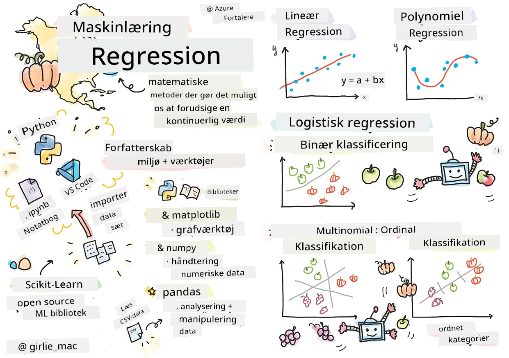
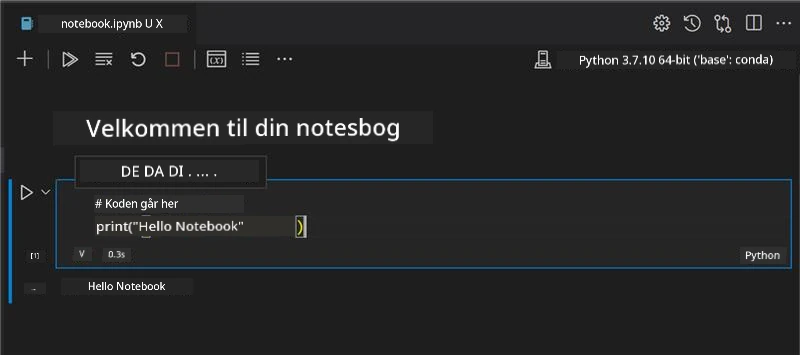
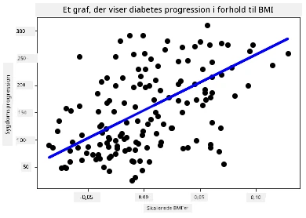

# Kom godt i gang med Python og Scikit-learn til regressionsmodeller



> Sketchnote af [Tomomi Imura](https://www.twitter.com/girlie_mac)

## [For-forelæsning quiz](https://ff-quizzes.netlify.app/en/ml/)

> ### [Denne lektion findes også i R!](../../../../2-Regression/1-Tools/solution/R/lesson_1.html)

## Introduktion

I disse fire lektioner vil du opdage, hvordan man bygger regressionsmodeller. Vi vil snart diskutere, hvad disse bruges til. Men før du gør noget, skal du sikre dig, at du har de rette værktøjer på plads for at begynde processen!

I denne lektion vil du lære at:

- Konfigurere din computer til lokale maskinlæringsopgaver.
- Arbejde med Jupyter Notebooks.
- Bruge Scikit-learn, inklusive installation.
- Udforske lineær regression med en praktisk øvelse.

## Installationer og konfigurationer

[](https://youtu.be/-DfeD2k2Kj0 "ML for begyndere -Opsæt dine værktøjer klar til at bygge maskinlæringsmodeller")

> 🎥 Klik på billedet ovenfor for en kort video, der viser, hvordan du konfigurerer din computer til ML.

1. **Installer Python**. Sørg for, at [Python](https://www.python.org/downloads/) er installeret på din computer. Du vil bruge Python til mange data science- og maskinlæringsopgaver. De fleste computersystemer inkluderer allerede en Python-installation. Der findes også nyttige [Python Coding Packs](https://code.visualstudio.com/learn/educators/installers?WT.mc_id=academic-77952-leestott) tilgængelige, som kan lette opsætningen for nogle brugere.

   Nogle anvendelser af Python kræver dog én version af softwaren, mens andre kræver en anden version. Af denne grund er det nyttigt at arbejde inden for et [virtuelt miljø](https://docs.python.org/3/library/venv.html).

2. **Installer Visual Studio Code**. Sørg for, at du har Visual Studio Code installeret på din computer. Følg disse instruktioner for at [installere Visual Studio Code](https://code.visualstudio.com/) til den grundlæggende installation. Du kommer til at bruge Python i Visual Studio Code i dette kursus, så du vil måske opfriske, hvordan man [konfigurerer Visual Studio Code](https://docs.microsoft.com/learn/modules/python-install-vscode?WT.mc_id=academic-77952-leestott) til Python-udvikling.

   > Bliv fortrolig med Python ved at arbejde gennem denne samling af [Læringsmoduler](https://docs.microsoft.com/users/jenlooper-2911/collections/mp1pagggd5qrq7?WT.mc_id=academic-77952-leestott)
   >
   > [](https://youtu.be/yyQM70vi7V8 "Opsæt Python med Visual Studio Code")
   >
   > 🎥 Klik på billedet ovenfor for en video: brug af Python i VS Code.

3. **Installer Scikit-learn**, ved at følge [disse instruktioner](https://scikit-learn.org/stable/install.html). Da du skal sikre dig, at du bruger Python 3, anbefales det, at du bruger et virtuelt miljø. Bemærk, hvis du installerer dette bibliotek på en M1 Mac, er der særlige instruktioner på den linkede side ovenfor.

1. **Installer Jupyter Notebook**. Du skal [installere Jupyter-pakken](https://pypi.org/project/jupyter/).

## Dit ML forfattermiljø

Du kommer til at bruge **notebooks** til at udvikle din Python-kode og skabe maskinlæringsmodeller. Denne type fil er et almindeligt værktøj for dataforskere, og de kan identificeres ved deres suffix eller filendelse `.ipynb`.

Notebooks er et interaktivt miljø, som tillader udvikleren både at kode og tilføje noter og skrive dokumentation omkring koden, hvilket er ganske hjælpsomt til eksperimentelle eller forskningsorienterede projekter.

[](https://youtu.be/7E-jC8FLA2E "ML for begyndere - Opsæt Jupyter Notebooks for at starte med at bygge regressionsmodeller")

> 🎥 Klik på billedet ovenfor for en kort video, der gennemgår denne øvelse.

### Øvelse - arbejd med en notebook

I denne mappe finder du filen _notebook.ipynb_.

1. Åbn _notebook.ipynb_ i Visual Studio Code.

   En Jupyter-server vil starte med Python 3+ i gang. Du vil finde områder af notebooken, der kan `køres`, stykker af kode. Du kan køre en kodeblok ved at vælge ikonet, der ligner en afspilningsknap.

1. Vælg `md`-ikonet og tilføj lidt markdown, og følgende tekst **# Velkommen til din notebook**.

   Tilføj derefter noget Python-kode.

1. Skriv **print('hello notebook')** i kodeblokken.
1. Vælg pilen for at køre koden.

   Du skulle gerne se den udskrevne sætning:

    ```output
    hello notebook
    ```



Du kan folde din kode sammen med kommentarer for at selvdokumentere notebooken.

✅ Tænk et øjeblik over, hvor forskelligt en webudviklers arbejdsmiljø er i forhold til en dataforskers.

## Oppe og køre med Scikit-learn

Nu hvor Python er sat op i dit lokale miljø, og du er fortrolig med Jupyter Notebooks, lad os blive lige så fortrolige med Scikit-learn (udtales `sci` som i `science`). Scikit-learn tilbyder et [omfattende API](https://scikit-learn.org/stable/modules/classes.html#api-ref) for at hjælpe dig med at udføre ML-opgaver.

Ifølge deres [hjemmeside](https://scikit-learn.org/stable/getting_started.html), "er Scikit-learn et open source maskinlæringsbibliotek, der understøtter superviseret og usuperviseret læring. Det tilbyder også forskellige værktøjer til modeltilpasning, dataprvbehandling, modelvalg og evaluering samt mange andre hjælpemidler."

I dette kursus vil du bruge Scikit-learn og andre værktøjer til at bygge maskinlæringsmodeller for at udføre det, vi kalder 'traditionelle maskinlærings'-opgaver. Vi har bevidst undgået neurale netværk og dyb læring, da de bedre dækkes i vores kommende 'AI for Beginners' pensum.

Scikit-learn gør det enkelt at bygge modeller og evaluere dem til brug. Det fokuserer primært på at bruge numeriske data og indeholder adskillige færdiglavede datasæt til brug som læringsværktøjer. Det inkluderer også forberedte modeller, som studerende kan prøve. Lad os først udforske processen med at indlæse forberedte data og bruge en indbygget estimator — den første ML-model med Scikit-learn med nogle grundlæggende data.

## Øvelse - din første Scikit-learn notebook

> Denne tutorial er inspireret af [eksemplet på lineær regression](https://scikit-learn.org/stable/auto_examples/linear_model/plot_ols.html#sphx-glr-auto-examples-linear-model-plot-ols-py) på Scikit-learns websted.


[](https://youtu.be/2xkXL5EUpS0 "ML for begyndere - Dit første lineære regressionsprojekt i Python")

> 🎥 Klik på billedet ovenfor for en kort video, der gennemgår denne øvelse.

I filen _notebook.ipynb_ tilknyttet denne lektion, ryd alle cellerne ved at trykke på 'skraldespands' ikonet.

I denne sektion vil du arbejde med et lille datasæt om diabetes, som er indbygget i Scikit-learn til læringsformål. Forestil dig, at du ønskede at teste en behandling for diabetespatienter. Maskinlæringsmodeller kan hjælpe dig med at afgøre, hvilke patienter der ville reagere bedre på behandlingen, baseret på kombinationer af variable. Selv en meget basal regressionsmodel, når den visualiseres, kan vise oplysninger om variable, der ville hjælpe dig med at organisere dine teoretiske kliniske forsøg.

✅ Der findes mange typer regressionsmetoder, og hvilken du vælger afhænger af det svar, du søger. Hvis du vil forudsige den sandsynlige højde for en person i en given alder, vil du bruge lineær regression, da du søger en **numerisk værdi**. Hvis du er interesseret i at finde ud af, om en bestemt type køkken skal betragtes som vegansk eller ej, søger du en **kategori-tildeling**, så du ville bruge logistisk regression. Du lærer mere om logistisk regression senere. Tænk lidt over nogle spørgsmål, du kan stille om data, og hvilken af disse metoder der ville være mere passende.

Lad os komme i gang med denne opgave.

### Importer biblioteker

Til denne opgave vil vi importere nogle biblioteker:

- **matplotlib**. Det er et nyttigt [grafværktøj](https://matplotlib.org/) og vi vil bruge det til at lave en linjeplot.
- **numpy**. [numpy](https://numpy.org/doc/stable/user/whatisnumpy.html) er et nyttigt bibliotek til håndtering af numeriske data i Python.
- **sklearn**. Dette er [Scikit-learn](https://scikit-learn.org/stable/user_guide.html) biblioteket.

Importer nogle biblioteker til at hjælpe med dine opgaver.

1. Tilføj imports ved at skrive følgende kode:

   ```python
   import matplotlib.pyplot as plt
   import numpy as np
   from sklearn import datasets, linear_model, model_selection
   ```

   Ovenfor importerer du `matplotlib`, `numpy` og du importerer også `datasets`, `linear_model` og `model_selection` fra `sklearn`. `model_selection` bruges til at opdele data i trænings- og testdatasæt.

### Diabetes-datasættet

Det indbyggede [diabetes datasæt](https://scikit-learn.org/stable/datasets/toy_dataset.html#diabetes-dataset) indeholder 442 datapunkter om diabetes, med 10 feature variabler, nogle af dem inkluderer:

- alder: alder i år
- bmi: kropsmasseindeks
- bp: gennemsnitligt blodtryk
- s1 tc: T-celler (en type hvide blodlegemer)

✅ Dette datasæt inkluderer begrebet 'køn' som en feature variabel vigtig for forskning omkring diabetes. Mange medicinske datasæt inkluderer denne type binær klassifikation. Tænk lidt over, hvordan kategoriseringer som denne kan udelukke visse dele af en befolkning fra behandlinger.

Nu skal du indlæse X- og y-dataene.

> 🎓 Husk, dette er superviseret læring, og vi har brug for et navngivet 'y' mål.

I en ny kodecelle, indlæs diabetes datasættet ved at kalde `load_diabetes()`. Inputtet `return_X_y=True` signalerer, at `X` vil være en datamatricer, og `y` vil være regressionsmålet.

1. Tilføj nogle print-kommandoer for at vise formen af datamatrixen og dens første element:

    ```python
    X, y = datasets.load_diabetes(return_X_y=True)
    print(X.shape)
    print(X[0])
    ```

    Det, du får tilbage som respons, er en tuple. Det, du gør, er at tildele de to første værdier i tuplen til henholdsvis `X` og `y`. Læs mere [om tuples](https://wikipedia.org/wiki/Tuple).

    Du kan se, at disse data har 442 elementer formet som arrays med 10 elementer:

    ```text
    (442, 10)
    [ 0.03807591  0.05068012  0.06169621  0.02187235 -0.0442235  -0.03482076
    -0.04340085 -0.00259226  0.01990842 -0.01764613]
    ```

    ✅ Tænk lidt over forholdet mellem dataene og regressionsmålet. Lineær regression forudsiger sammenhænge mellem feature X og målvariablen y. Kan du finde [målet](https://scikit-learn.org/stable/datasets/toy_dataset.html#diabetes-dataset) for diabetes datasættet i dokumentationen? Hvad demonstrerer dette datasæt, givet målet?

2. Vælg derefter en del af dette datasæt til at plotte ved at vælge den 3. kolonne af datasættet. Det kan du gøre ved at bruge `:` operatoren til at vælge alle rækker, og derefter vælge den 3. kolonne ved hjælp af indekset (2). Du kan også omforme dataene til at være et 2D-array — som krævet for plotning — ved at bruge `reshape(n_rows, n_columns)`. Hvis en af parametrene er -1, beregnes den tilsvarende dimension automatisk.

   ```python
   X = X[:, 2]
   X = X.reshape((-1,1))
   ```

   ✅ Print dataene ud når som helst for at tjekke deres form.

3. Nu hvor du har data klar til at blive plottet, kan du se, om en maskine kan hjælpe med at bestemme en logisk opdeling mellem tallene i dette datasæt. For at gøre dette skal du opdele både dataene (X) og målet (y) i test- og træningssæt. Scikit-learn har en ligetil måde at gøre dette på; du kan opdele dine testdata på et givent punkt.

   ```python
   X_train, X_test, y_train, y_test = model_selection.train_test_split(X, y, test_size=0.33)
   ```

4. Nu er du klar til at træne din model! Indlæs den lineære regressionsmodel og træne den med dine X- og y træningssæt ved hjælp af `model.fit()`:

    ```python
    model = linear_model.LinearRegression()
    model.fit(X_train, y_train)
    ```

    ✅ `model.fit()` er en funktion, du vil se i mange ML-biblioteker såsom TensorFlow

5. Opret derefter en forudsigelse ved hjælp af testdata, brug funktionen `predict()`. Dette vil blive brugt til at tegne linjen mellem datagrupper

    ```python
    y_pred = model.predict(X_test)
    ```

6. Nu er det tid til at vise dataene i et plot. Matplotlib er et meget nyttigt værktøj til denne opgave. Lav et scatterplot af alle X- og y testdata, og brug forudsigelsen til at tegne en linje på det mest passende sted, mellem modellens datagrupperinger.

    ```python
    plt.scatter(X_test, y_test,  color='black')
    plt.plot(X_test, y_pred, color='blue', linewidth=3)
    plt.xlabel('Scaled BMIs')
    plt.ylabel('Disease Progression')
    plt.title('A Graph Plot Showing Diabetes Progression Against BMI')
    plt.show()
    ```

   


   ✅ Tænk lidt over, hvad der foregår her. En ret linje løber gennem mange små datapunkter, men hvad gør den egentlig? Kan du se, hvordan du burde kunne bruge denne linje til at forudsige, hvor et nyt, uset datapunkt skal placeres i forhold til plottets y-akse? Prøv at formulere den praktiske anvendelse af denne model.

Tillykke, du har bygget din første lineære regressionsmodel, lavet en forudsigelse med den og vist den i et plot!

---
## 🚀Udfordring

Plot en anden variabel fra dette datasæt. Tip: rediger denne linje: `X = X[:,2]`. Med dette datasæts målvariabel, hvad kan du opdage om progressionen af diabetes som sygdom?
## [Quiz efter forelæsning](https://ff-quizzes.netlify.app/en/ml/)

## Gennemgang & Selvstudium

I denne vejledning arbejdede du med simpel lineær regression fremfor univariat eller multiple lineære regression. Læs lidt om forskellene mellem disse metoder, eller se [denne video](https://www.coursera.org/lecture/quantifying-relationships-regression-models/linear-vs-nonlinear-categorical-variables-ai2Ef)

Læs mere om konceptet regression og tænk over, hvilke slags spørgsmål der kan besvares med denne teknik. Tag denne [vejledning](https://docs.microsoft.com/learn/modules/train-evaluate-regression-models?WT.mc_id=academic-77952-leestott) for at fordybe din forståelse.

## Opgave

[Et andet datasæt](assignment.md)

---

<!-- CO-OP TRANSLATOR DISCLAIMER START -->
**Ansvarsfraskrivelse**:
Dette dokument er blevet oversat ved hjælp af AI-oversættelsestjenesten [Co-op Translator](https://github.com/Azure/co-op-translator). Selvom vi bestræber os på nøjagtighed, skal du være opmærksom på, at automatiserede oversættelser kan indeholde fejl eller unøjagtigheder. Det originale dokument på dets oprindelige sprog bør betragtes som den autoritative kilde. For kritisk information anbefales professionel menneskelig oversættelse. Vi påtager os intet ansvar for misforståelser eller fejltolkninger, der opstår som følge af brugen af denne oversættelse.
<!-- CO-OP TRANSLATOR DISCLAIMER END -->