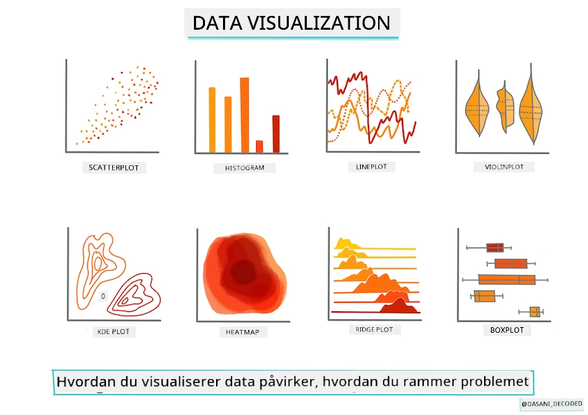
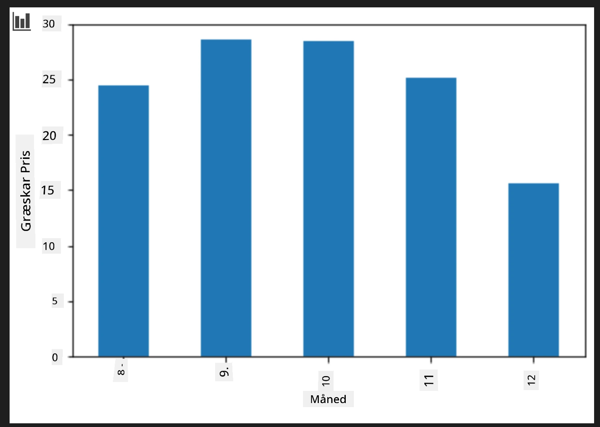
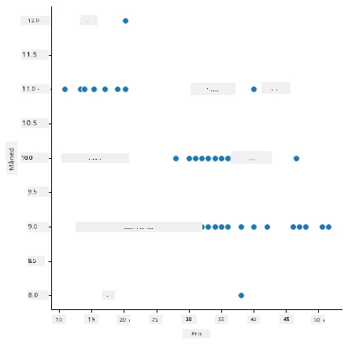
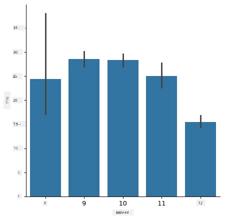
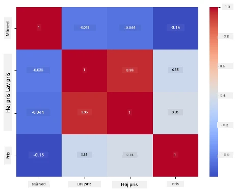

# Byg en regressionsmodel med Scikit-learn: forbered og visualiser data



Infografik af [Dasani Madipalli](https://twitter.com/dasani_decoded)

## [For-forelæsning quiz](https://ff-quizzes.netlify.app/en/ml/)

> ### [Denne lektion findes også i R!](../../../../2-Regression/2-Data/solution/R/lesson_2.html)

## Introduktion

Nu hvor du er sat op med de værktøjer, du har brug for til at begynde at angribe maskinlæringsmodelbygning med Scikit-learn, er du klar til at begynde at stille spørgsmål til dine data. Når du arbejder med data og anvender ML-løsninger, er det meget vigtigt at forstå, hvordan man stiller det rigtige spørgsmål for ordentligt at låse op for potentialerne i dit datasæt.

I denne lektion vil du lære:

- Hvordan du forbereder dine data til modelbygning.
- Hvordan du bruger Matplotlib til datavisualisering.
- Hvordan du bruger Seaborn til mere udtryksfuld datavisualisering.

## At stille det rette spørgsmål til dine data

Det spørgsmål, du har brug for svar på, vil afgøre, hvilken type ML-algoritmer du vil anvende. Og kvaliteten af det svar, du får tilbage, vil i høj grad afhænge af karakteren af dine data.

Tag et kig på de [data](https://github.com/microsoft/ML-For-Beginners/blob/main/2-Regression/data/US-pumpkins.csv), der er leveret til denne lektion. Du kan åbne denne .csv-fil i VS Code. En hurtig gennemgang viser straks, at der er tomme felter og en blanding af tekststrenge og numeriske data. Der er også en mærkelig kolonne kaldet 'Package', hvor dataene er en blanding af 'sække', 'beholdere' og andre værdier. Dataene er faktisk en smule rodede.

[](https://youtu.be/5qGjczWTrDQ "ML for begyndere - Hvordan man analyserer og rengør et datasæt")

> 🎥 Klik på billedet ovenfor for en kort video, der gennemgår forberedelsen af dataene til denne lektion.

Det er faktisk ikke særlig almindeligt at få et datasæt, der er helt klar til brug direkte til at oprette en ML-model. I denne lektion vil du lære at forberede et råt datasæt ved hjælp af standard Python-biblioteker. Du vil også lære forskellige teknikker til at visualisere dataene.

## Case study: 'græskarmarkedet'

I denne mappe finder du en .csv-fil i rodmappen `data` kaldet [US-pumpkins.csv](https://github.com/microsoft/ML-For-Beginners/blob/main/2-Regression/data/US-pumpkins.csv), som indeholder 1757 linjer data om markedet for græskar, sorteret i grupper efter by. Dette er rådata udtrukket fra [Specialty Crops Terminal Markets Standard Reports](https://www.marketnews.usda.gov/mnp/fv-report-config-step1?type=termPrice) distribueret af United States Department of Agriculture.

### Forberedelse af data

Disse data er offentligt tilgængelige. De kan downloades i mange separate filer, pr. by, fra USDA’s websted. For at undgå for mange separate filer har vi samlet alle bydata i et regneark, så vi har allerede _forberedt_ dataene lidt. Lad os nu tage et nærmere kig på dataene.

### Græskardataene - tidlige konklusioner

Hvad bemærker du om disse data? Du så allerede, at der er en blanding af tekst, tal, tomme felter og mærkelige værdier, som du skal forstå.

Hvilket spørgsmål kan du stille til disse data ved brug af en regressionsmetode? Hvad med "Forudsig prisen på et græskar til salg i en given måned"? Ser man igen på dataene, er der nogle ændringer, du skal foretage for at skabe den datastruktur, der er nødvendig for opgaven.
## Øvelse - analyser græskardata

Lad os bruge [Pandas](https://pandas.pydata.org/) (navnet står for `Python Data Analysis`) – et værktøj meget nyttigt til at forme data – til at analysere og forberede disse græskardata.

### Først, tjek for manglende datoer

Du skal først tage skridt til at tjekke for manglende datoer:

1. Konverter datoerne til månedsformat (det er amerikanske datoer, så formatet er `MM/DD/YYYY`).
2. Ekstraher måneden til en ny kolonne.

Åbn filen _notebook.ipynb_ i Visual Studio Code, og importer regnearket til en ny Pandas dataframe.

1. Brug `head()`-funktionen til at se de første fem rækker.

    ```python
    import pandas as pd
    pumpkins = pd.read_csv('../data/US-pumpkins.csv')
    pumpkins.head()
    ```

    ✅ Hvilken funktion ville du bruge til at se de sidste fem rækker?

1. Tjek om der mangler data i den nuværende dataframe:

    ```python
    pumpkins.isnull().sum()
    ```

    Der mangler data, men måske gør det ikke noget for den aktuelle opgave.

1. For at gøre din dataframe nemmere at arbejde med, vælg kun de kolonner, du har brug for, ved hjælp af `loc`-funktionen, som udtrækker fra den oprindelige dataframe en gruppe af rækker (angivet som første parameter) og kolonner (angivet som anden parameter). Udtrykket `:` i eksemplet nedenfor betyder "alle rækker".

    ```python
    columns_to_select = ['Package', 'Low Price', 'High Price', 'Date']
    pumpkins = pumpkins.loc[:, columns_to_select]
    ```

### For det andet, bestem gennemsnitsprisen på græskar

Tænk over, hvordan du bestemmer gennemsnitsprisen på et græskar i en given måned. Hvilke kolonner ville du vælge til denne opgave? Tip: du får brug for 3 kolonner.

Løsning: tag gennemsnittet af kolonnerne `Low Price` og `High Price` for at udfylde den nye kolonne Pris, og konverter kolonnen Dato til kun at vise måneden. Heldigvis ifølge kontrollen ovenfor, mangler der ikke data for datoer eller priser.

1. For at beregne gennemsnittet skal du tilføje følgende kode:

    ```python
    price = (pumpkins['Low Price'] + pumpkins['High Price']) / 2

    month = pd.DatetimeIndex(pumpkins['Date']).month

    ```

   ✅ Føl dig fri til at printe hvilke data du vil tjekke ved at bruge `print(month)`.

2. Kopier derefter dine konverterede data ind i en frisk Pandas dataframe:

    ```python
    new_pumpkins = pd.DataFrame({'Month': month, 'Package': pumpkins['Package'], 'Low Price': pumpkins['Low Price'],'High Price': pumpkins['High Price'], 'Price': price})
    ```

    Udskriver du din dataframe, vil du se et rent, ordentligt datasæt, som du kan bygge din nye regressionsmodel på.

### Men vent! Der er noget mærkeligt her

Hvis du ser på kolonnen `Package`, sælges græskar i mange forskellige konfigurationer. Nogle sælges i mål som '1 1/9 bushel', og nogle i '1/2 bushel', nogle pr. græskar, nogle pr. pund, og nogle i store kasser med varierende bredder.

> Græskar er tilsyneladende meget svære at veje konsekvent

Når man dykker ned i de oprindelige data, er det interessant, at alt med `Unit of Sale` lig med 'EACH' eller 'PER BIN' også har `Package`-typen per tomme, per beholder eller 'each'. Græskar synes at være vanskelige at veje konsekvent, så lad os filtrere dem ved kun at vælge græskar med strengen 'bushel' i deres `Package`-kolonne.

1. Tilføj et filter øverst i filen, under den indledende .csv-import:

    ```python
    pumpkins = pumpkins[pumpkins['Package'].str.contains('bushel', case=True, regex=True)]
    ```

    Hvis du printer dataene nu, kan du se, at du kun får de ca. 415 rækker, der indeholder græskar betalt per bushel.

### Men vent! Der er en sidste ting at gøre

Lagde du mærke til, at bushel-mængden varierer pr. række? Du skal normalisere priserne, så du viser prisen per bushel, så lav noget matematik for at standardisere det.

1. Tilføj disse linjer efter blokken, der opretter new_pumpkins-dataframen:

    ```python
    new_pumpkins.loc[new_pumpkins['Package'].str.contains('1 1/9'), 'Price'] = price/(1 + 1/9)

    new_pumpkins.loc[new_pumpkins['Package'].str.contains('1/2'), 'Price'] = price/(1/2)
    ```

✅ Ifølge [The Spruce Eats](https://www.thespruceeats.com/how-much-is-a-bushel-1389308) afhænger vægten af en bushel af typen af afgrøder, da det er et mål for rumfang. "En bushel tomater f.eks. vejer omkring 56 pund... Blade og grønne planter fylder mere plads med mindre vægt, så en bushel spinat vejer kun 20 pund." Det hele er meget kompliceret! Lad os ikke bøvle med at omregne bushel til pund, men prissæt i stedet efter bushel. Alt dette studie af bushels græskar viser dog, hvor vigtigt det er at forstå karakteren af dine data!

Nu kan du analysere prisen pr. enhed baseret på deres bushel-mål. Hvis du printer dataene en gang mere, kan du se, hvordan det er standardiseret.

✅ Lagde du mærke til, at græskar solgt pr. halv bushel er meget dyre? Kan du regne ud hvorfor? Tip: små græskar er meget dyrere end store, sandsynligvis fordi der er så mange flere af dem pr. bushel, givet den ubrugte plads optaget af et stort hulgræskar til tærter.

## Visualiseringsstrategier

En del af dataforskerens rolle er at demonstrere kvaliteten og karakteren af de data, de arbejder med. For at gøre dette skaber de ofte interessante visualiseringer, eller plots, grafer og diagrammer, der viser forskellige aspekter af dataene. På denne måde kan de visuelt vise sammenhænge og huller, som ellers er svære at opdage.

[](https://youtu.be/SbUkxH6IJo0 "ML for begyndere - Hvordan man visualiserer data med Matplotlib")

> 🎥 Klik på billedet ovenfor for en kort video, der gennemgår visualisering af dataene til denne lektion.

Visualiseringer kan også hjælpe med at afgøre, hvilken maskinlæringsteknik der er mest egnet til dataene. En scatterplot, der ser ud til at følge en linje, indikerer f.eks., at dataene er en god kandidat til en lineær regressionsøvelse.

Et datavisualiseringsbibliotek, der fungerer godt i Jupyter-notebooks, er [Matplotlib](https://matplotlib.org/) (som du også så i den tidligere lektion).

> Få mere erfaring med datavisualisering i [disse vejledninger](https://docs.microsoft.com/learn/modules/explore-analyze-data-with-python?WT.mc_id=academic-77952-leestott).

## Øvelse - eksperimenter med Matplotlib

Prøv at lave nogle grundlæggende plots for at vise den nye dataframe, du netop har oprettet. Hvad ville en grundlæggende linjeplot vise?

1. Importer Matplotlib øverst i filen, under Pandas-importen:

    ```python
    import matplotlib.pyplot as plt
    ```

1. Kør hele notebook'en igen for at opdatere.
1. Nederst i notebook'en, tilføj en celle til at plotte data som en kasse:

    ```python
    price = new_pumpkins.Price
    month = new_pumpkins.Month
    plt.scatter(price, month)
    plt.show()
    ```

    

    Er dette et nyttigt plot? Overrasker noget ved det dig?

    Det er ikke særligt nyttigt, da det blot viser dine data som en spredning af punkter i en given måned.

### Gør det nyttigt

For at få diagrammer til at vise nyttige data, skal man normalt gruppere dataene på en eller anden måde. Lad os prøve at oprette et plot, hvor y-aksen viser månederne, og dataene demonstrerer fordelingen af data.

1. Tilføj en celle til at oprette et grupperet søjlediagram:

    ```python
    new_pumpkins.groupby(['Month'])['Price'].mean().plot(kind='bar')
    plt.ylabel("Pumpkin Price")
    ```

    

    Dette er en mere nyttig datavisualisering! Det ser ud til at indikere, at den højeste pris for græskar forekommer i september og oktober. Opfylder det dine forventninger? Hvorfor eller hvorfor ikke?

## Øvelse - eksperimenter med Seaborn

Matplotlib er kraftfuldt, men det kan tage meget kode at producere et poleret diagram. [Seaborn](https://seaborn.pydata.org/) er et bibliotek bygget _oven på_ Matplotlib, der er designet til statistisk datavisualisering. Det arbejder direkte med Pandas dataframes, anvender attraktive standardstile og lader dig skabe informative plots med langt mindre kode. Fordi Seaborn returnerer Matplotlib-objekter, kan du stadig bruge alt, hvad du allerede ved om Matplotlib til at finjustere resultatet.

> Hvis du ikke allerede har Seaborn installeret, så installer det med `pip install seaborn`.

1. Importer Seaborn øverst i notebook'en, under de andre imports. Det importeres sædvanligvis som `sns`:

    ```python
    import seaborn as sns
    ```

### Scatterplots til at vise relationer

En stor del af at udforske data før opbygning af en model er at lede efter _relationer_ mellem variabler. Et [scatter plot](https://en.wikipedia.org/wiki/Scatter_plot) er et af de bedste værktøjer til dette: hvis punkterne ser ud til at følge en linje, kan de to variabler være korrelerede, hvilket er et godt tegn på, at en lineær regressionsmodel kan fungere.

1. Genskab scatterplottet fra før med pris til måned, denne gang ved brug af Seaborns [`relplot()`](https://seaborn.pydata.org/generated/seaborn.relplot.html) (relations-plot), som arbejder direkte med dine dataframe-kolonner:

    ```python
    sns.relplot(x="Price", y="Month", data=new_pumpkins)
    ```

    

    Læg mærke til, hvordan du angiver _kolonnenavne_ og dataframe, og Seaborn tager sig af akseetiketterne for dig.

2. Du kan skifte til et linjediagram ved at sende `kind="line"`. Seaborn tegner endda et skyggebånd, som viser konfidensintervallet omkring linjen:

    ```python
    sns.relplot(x="Price", y="Month", kind="line", data=new_pumpkins)
    ```

    

    Disse data er ret støjende, så et linjediagram er ikke det klareste valg her – men det viser, hvor let du kan ændre diagramtype i Seaborn.

### Søjlediagrammer til at vise fordelinger


Tidligere grupperede du dataene manuelt for at skabe et søjlediagram med Matplotlib. Seaborns [`catplot()`](https://seaborn.pydata.org/generated/seaborn.catplot.html) (kategoriplot) kan lave gruppering og aggregering for dig. Som standard viser `kind="bar"` gennemsnittet for hver kategori sammen med en sort linje, der angiver konfidensintervallet.

1. Opret et søjlediagram over gennemsnitsprisen pr. måned:

    ```python
    sns.catplot(x="Month", y="Price", data=new_pumpkins, kind="bar")
    ```

    

    Dette bekræfter det, du så med Matplotlib — priserne topper omkring september og oktober — men Seaborn visualiserer også, hvor meget prisen _varierer_ inden for hver måned.

### Heatmaps for at vise korrelationer

Scatterplots sammenligner to variable ad gangen. Når du har flere numeriske kolonner, lader et [heatmap](https://en.wikipedia.org/wiki/Heat_map) dig se styrken af forholdet mellem _alle_ par af kolonner på én gang. Dette er en almindelig måde at spotte, hvilke egenskaber der er mest korrelerede, før man vælger, hvad der skal fodres ind i en model (og samme slags diagram bruges senere til at vise forvirringsmatricer i klassifikation).

1. Byg en korrelationsmatrix med Pandas, og tegn den derefter med Seaborns [`heatmap()`](https://seaborn.pydata.org/generated/seaborn.heatmap.html). Muligheden `annot=True` skriver korrelationsværdierne på hver celle:

    ```python
    correlations = new_pumpkins[['Month', 'Low Price', 'High Price', 'Price']].corr()
    sns.heatmap(correlations, annot=True, cmap="coolwarm")
    ```

    

    Værdier tæt på `1` (eller `-1`) betyder, at kolonnerne er stærkt _lineært_ korrelerede. Bemærk, hvordan `Low Price` og `High Price` næsten er perfekt korrelerede. `Month` viser derimod kun en svag lineær korrelation med prisen — selvom søjlediagrammet ovenfor afslørede en tydelig sæsonbestemt top i september og oktober. Det er en vigtig lektion: korrelationskoefficienten måler kun _lige linje_-sammenhænge, så den kan overse sæsonbestemte eller på anden måde ikke-lineære mønstre. ✅ Hvorfor er det nyttigt at se både et heatmap *og* diagrammer som søjlediagrammet, før du beslutter, hvilke kolonner du skal bruge?

### Matplotlib eller Seaborn?

Begge biblioteker er værd at kende:

- **Matplotlib** giver dig detaljeret kontrol over hvert element i et diagram og er fundamentet, som næsten alle andre Python-plotbiblioteker bygger på.
- **Seaborn** giver høj-niveau funktioner og attraktive standardindstillinger for statistiske diagrammer, arbejder direkte med dataframes og er ofte hurtigere til eksplorativ dataanalyse.

En almindelig arbejdsgang er at bruge Seaborn til hurtigt at udforske dine data og derefter gå ned til Matplotlib, når du vil tilpasse detaljerne.

---

## 🚀Udfordring

Udforsk de forskellige typer visualisering, som Matplotlib og Seaborn tilbyder. Hvilke typer er mest egnede til regressionsproblemer?

## [Quiz efter forelæsning](https://ff-quizzes.netlify.app/en/ml/)

## Gennemgang & Selvlæring

Se på de mange måder at visualisere data på. Lav en liste over de forskellige biblioteker, der findes, og noter, hvilke der er bedst til givne typer opgaver, for eksempel 2D-visualiseringer vs. 3D-visualiseringer. Hvad opdager du?

## Opgave

[Udforskning af visualisering](assignment.md)

---

<!-- CO-OP TRANSLATOR DISCLAIMER START -->
**Ansvarsfraskrivelse**:
Dette dokument er blevet oversat ved hjælp af AI-oversættelsestjenesten [Co-op Translator](https://github.com/Azure/co-op-translator). Selvom vi bestræber os på nøjagtighed, skal du være opmærksom på, at automatiserede oversættelser kan indeholde fejl eller unøjagtigheder. Det originale dokument på dets oprindelige sprog bør betragtes som den autoritative kilde. For kritisk information anbefales professionel menneskelig oversættelse. Vi påtager os intet ansvar for misforståelser eller fejltolkninger, der opstår som følge af brugen af denne oversættelse.
<!-- CO-OP TRANSLATOR DISCLAIMER END -->