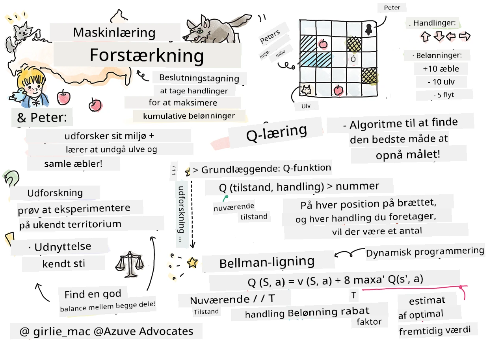
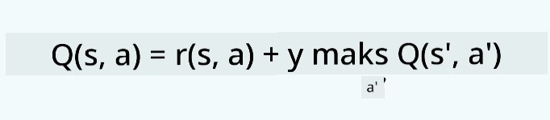

# Introduktion til Forstærkningslæring og Q-Læring


> Sketchnote af [Tomomi Imura](https://www.twitter.com/girlie_mac)

Forstærkningslæring involverer tre vigtige begreber: agenten, nogle tilstande og et sæt handlinger pr. tilstand. Ved at udføre en handling i en bestemt tilstand får agenten en belønning. Forestil dig igen computerspillet Super Mario. Du er Mario, du er i et spelniveau og står ved siden af en klippekant. Over dig er der en mønt. Du som Mario, i et spelniveau, på en bestemt position ... det er din tilstand. At tage et skridt til højre (en handling) vil få dig til at falde ud over kanten, hvilket giver dig en lav numerisk score. Men hvis du trykker på springknappen, vil du score et point og forblive i live. Det er et positivt resultat, og det burde belønnes med en positiv numerisk score.

Ved at anvende forstærkningslæring og en simulator (spillet) kan du lære at spille spillet for at maksimere belønningen, som er at forblive i live og score så mange point som muligt.

[](https://www.youtube.com/watch?v=lDq_en8RNOo)

> 🎥 Klik på billedet ovenfor for at høre Dmitry diskutere Forstærkningslæring

## [Pre-lecture quiz](https://ff-quizzes.netlify.app/en/ml/)

## Forudsætninger og opsætning

I denne lektion vil vi eksperimentere med noget kode i Python. Du bør kunne køre Jupyter Notebook-koden fra denne lektion, enten på din computer eller et sted i skyen.

Du kan åbne [lektionsnotebook'en](https://github.com/microsoft/ML-For-Beginners/blob/main/8-Reinforcement/1-QLearning/notebook.ipynb) og følge med i denne lektion for at bygge.

> **Bemærk:** Hvis du åbner denne kode fra skyen, skal du også hente filen [`rlboard.py`](https://github.com/microsoft/ML-For-Beginners/blob/main/8-Reinforcement/1-QLearning/rlboard.py), som bruges i notebook-koden. Placer den i samme mappe som notebooken.

## Introduktion

I denne lektion vil vi udforske verdenen af **[Peter og Ulven](https://da.wikipedia.org/wiki/Peter_og_Ulven)**, inspireret af et musisk eventyr af en russisk komponist, [Sergej Prokofjev](https://da.wikipedia.org/wiki/Sergej_Prokofjev). Vi vil bruge **Forstærkningslæring** til at lade Peter udforske sit miljø, samle lækre æbler og undgå at møde ulven.

**Forstærkningslæring** (RL) er en læringsteknik, der gør det muligt for os at lære en optimal adfærd for en **agent** i et givent **miljø** ved at gennemføre mange eksperimenter. En agent i dette miljø skal have et **mål** defineret af en **belønningsfunktion**.

## Miljøet

For enkelhedens skyld, lad os betragte Peters verden som et kvadratisk bræt af størrelse `width` x `height`, sådan her:


Hver celle på dette bræt kan enten være:

* **jord**, som Peter og andre væsener kan gå på.
* **vand**, som du åbenlyst ikke kan gå på.
* et **træ** eller **græs**, et sted hvor du kan hvile.
* et **æble**, som repræsenterer noget Peter vil være glad for at finde for at fodre sig selv.
* en **ulv**, som er farlig og bør undgås.

Der findes et separat Python-modul, [`rlboard.py`](https://github.com/microsoft/ML-For-Beginners/blob/main/8-Reinforcement/1-QLearning/rlboard.py), som indeholder koden til at arbejde med dette miljø. Da denne kode ikke er vigtig for forståelsen af vores koncepter, importer vi modulet og bruger det til at skabe prøvebrættet (kodeblok 1):

```python
from rlboard import *

width, height = 8,8
m = Board(width,height)
m.randomize(seed=13)
m.plot()
```

Denne kode skulle udskrive et billede af miljøet lignende det ovenfor.

## Handlinger og politik

I vores eksempel ville Peters mål være at finde et æble, mens han undgår ulven og andre forhindringer. For at gøre dette kan han grundlæggende bevæge sig rundt, indtil han finder et æble.

Derfor kan han i enhver position vælge mellem følgende handlinger: op, ned, venstre og højre.

Vi vil definere disse handlinger som en ordbog, og kortlægge dem til par af tilsvarende koordinerede ændringer. For eksempel vil bevægelse til højre (`R`) svare til et par `(1,0)`. (kodeblok 2):

```python
actions = { "U" : (0,-1), "D" : (0,1), "L" : (-1,0), "R" : (1,0) }
action_idx = { a : i for i,a in enumerate(actions.keys()) }
```

For at opsummere er strategi og mål for dette scenarie som følger:

- **Strategien**, for vores agent (Peter) defineres af en såkaldt **politik**. En politik er en funktion, der returnerer handlingen i enhver given tilstand. I vores tilfælde repræsenteres problemets tilstand af brættet, inklusive spillerens aktuelle position.

- **Målet** for forstærkningslæring er til sidst at lære en god politik, som vil tillade os at løse problemet effektivt. Men som en basislinje, lad os betragte den simpleste politik kaldet **tilfældig gang**.

## Tilfældig gang

Lad os først løse vores problem ved at implementere en tilfældig gang-strategi. Med tilfældig gang vælger vi tilfældigt den næste handling fra de tilladte handlinger, indtil vi når æblet (kodeblok 3).

1. Implementer den tilfældige gang med nedenstående kode:

    ```python
    def random_policy(m):
        return random.choice(list(actions))
    
    def walk(m,policy,start_position=None):
        n = 0 # antal skridt
        # indstil startposition
        if start_position:
            m.human = start_position 
        else:
            m.random_start()
        while True:
            if m.at() == Board.Cell.apple:
                return n # succes!
            if m.at() in [Board.Cell.wolf, Board.Cell.water]:
                return -1 # spist af ulv eller druknet
            while True:
                a = actions[policy(m)]
                new_pos = m.move_pos(m.human,a)
                if m.is_valid(new_pos) and m.at(new_pos)!=Board.Cell.water:
                    m.move(a) # udfør selve flytningen
                    break
            n+=1
    
    walk(m,random_policy)
    ```

    Kaldet til `walk` burde returnere længden af den tilsvarende sti, som kan variere fra kørsel til kørsel.

1. Kør gang-eksperimentet et antal gange (sig 100), og udskriv de resulterende statistikker (kodeblok 4):

    ```python
    def print_statistics(policy):
        s,w,n = 0,0,0
        for _ in range(100):
            z = walk(m,policy)
            if z<0:
                w+=1
            else:
                s += z
                n += 1
        print(f"Average path length = {s/n}, eaten by wolf: {w} times")
    
    print_statistics(random_policy)
    ```

    Bemærk at den gennemsnitlige længde af en sti er omkring 30-40 skridt, hvilket er temmelig meget, når man tager i betragtning, at den gennemsnitlige afstand til nærmeste æble er omkring 5-6 skridt.

    Du kan også se hvordan Peters bevægelse ser ud under den tilfældige gang:

    

## Belønningsfunktion

For at gøre vores politik mere intelligent, skal vi forstå hvilke bevægelser der er "bedre" end andre. For at gøre dette skal vi definere vores mål.

Målet kan defineres i form af en **belønningsfunktion**, som vil returnere en scoreværdi for hver tilstand. Jo højere tal, desto bedre belønningsfunktion. (kodeblok 5)

```python
move_reward = -0.1
goal_reward = 10
end_reward = -10

def reward(m,pos=None):
    pos = pos or m.human
    if not m.is_valid(pos):
        return end_reward
    x = m.at(pos)
    if x==Board.Cell.water or x == Board.Cell.wolf:
        return end_reward
    if x==Board.Cell.apple:
        return goal_reward
    return move_reward
```

En interessant ting ved belønningsfunktioner er, at i de fleste tilfælde får *vi kun en betydelig belønning til sidst i spillet*. Det betyder, at vores algoritme på en eller anden måde skal huske "gode" skridt, der fører til en positiv belønning til sidst, og øge deres betydning. Ligeledes bør alle bevægelser, der fører til dårlige resultater, frarådes.

## Q-Læring

En algoritme, som vi vil diskutere her, kaldes **Q-Læring**. I denne algoritme defineres politikken af en funktion (eller datastruktur) kaldet en **Q-Tabel**. Den registrerer "godheden" af hver af handlingerne i en given tilstand.

Den kaldes Q-Tabel, fordi det ofte er praktisk at repræsentere den som en tabel eller flerdimensionelt array. Da vores bræt har dimensionerne `width` x `height`, kan vi repræsentere Q-Tabellen med et numpy-array med formen `width` x `height` x `len(actions)`: (kodeblok 6)

```python
Q = np.ones((width,height,len(actions)),dtype=np.float)*1.0/len(actions)
```

Bemærk at vi initialiserer alle værdier i Q-Tabellen med en ens værdi, i vores tilfælde 0,25. Dette svarer til "tilfældig gang"-politikken, fordi alle bevægelser i hver tilstand er lige gode. Vi kan give Q-Tabellen videre til funktionen `plot` for at visualisere tabellen på brættet: `m.plot(Q)`.


I midten af hver celle er der en "pil", der angiver den foretrukne bevægelsesretning. Da alle retninger er lige, vises et punkt.

Nu skal vi køre simuleringen, udforske vores miljø og lære en bedre fordeling af Q-Tabelværdier, hvilket vil gøre os i stand til at finde vejen til æblet meget hurtigere.

## Essensen af Q-Læring: Bellman-ligningen

Når vi begynder at bevæge os, vil hver handling have en tilhørende belønning, dvs. vi kan teoretisk vælge næste handling baseret på højeste umiddelbare belønning. Men i de fleste tilstande vil bevægelsen ikke opnå vores mål om at nå æblet, og derfor kan vi ikke straks afgøre, hvilken retning der er bedre.

> Husk, at det ikke er det umiddelbare resultat, der betyder noget, men snarere det endelige resultat, som vi opnår ved simuleringens slutning.

For at tage højde for denne forsinkede belønning skal vi bruge principperne for **[dynamisk programmering](https://da.wikipedia.org/wiki/Dynamisk_programmering)**, som tillader os at tænke på vores problem rekursivt.

Antag, at vi nu er i tilstanden *s*, og vi ønsker at bevæge os til næste tilstand *s'*. Ved at gøre dette vil vi modtage den umiddelbare belønning *r(s,a)*, defineret af belønningsfunktionen, plus en fremtidig belønning. Hvis vi antager, at vores Q-Tabel korrekt afspejler "tiltrækningskraften" af hver handling, vil vi i tilstand *s'* vælge en handling *a*, der svarer til maksimumværdien af *Q(s',a')*. Således defineres den bedste mulige fremtidige belønning, vi kunne opnå i tilstand *s*, som `max`<sub>a'</sub>*Q(s',a')* (maksimum udregnes her over alle mulige handlinger *a'* i tilstand *s'*).

Dette giver **Bellman-formlen** til beregning af værdien af Q-Tabellen i tilstand *s* for handling *a*:



Her er γ den såkaldte **diskonteringsfaktor**, som bestemmer, i hvilken grad du bør foretrække den nuværende belønning frem for den fremtidige belønning og omvendt.

## Læringsalgoritme

Givet ovenstående ligning kan vi nu skrive pseudokode for vores læringsalgoritme:

* Initialiser Q-Tabel Q med ens værdier for alle tilstande og handlinger
* Sæt læringsrate α ← 1
* Gentag simulering mange gange
   1. Start ved en tilfældig position
   1. Gentag
        1. Vælg en handling *a* i tilstand *s*
        2. Udfør handling ved at bevæge til en ny tilstand *s'*
        3. Hvis vi støder på slut-tilstand eller samlet belønning er for lav - afslut simulering  
        4. Beregn belønning *r* i den nye tilstand
        5. Opdater Q-funktionen ifølge Bellman-ligningen: *Q(s,a)* ← *(1-α)Q(s,a)+α(r+γ max<sub>a'</sub>Q(s',a'))*
        6. *s* ← *s'*
        7. Opdater den samlede belønning og reducer α.

## Udnytte vs. udforske

I algoritmen ovenfor specificerede vi ikke præcist, hvordan vi bør vælge en handling på trin 2.1. Hvis vi vælger handlingen tilfældigt, vil vi tilfældigt **udforske** miljøet, og vi vil med stor sandsynlighed ofte dø og udforske områder, hvor vi normalt ikke ville gå. En alternativ tilgang ville være at **udnytte** de Q-Tabel-værdier, vi allerede kender, og dermed vælge den bedste handling (med højere Q-Tabel-værdi) i tilstand *s*. Dette vil dog forhindre os i at udforske andre tilstande, og det er sandsynligt, at vi ikke finder den optimale løsning.

Derfor er den bedste tilgang at finde en balance mellem udforskning og udnyttelse. Dette kan gøres ved at vælge handlingen i tilstand *s* med sandsynligheder proportionalt med værdierne i Q-Tabellen. I begyndelsen, når Q-Tabel-værdierne er ens, svarer det til et tilfældigt valg, men efterhånden som vi lærer mere om vores miljø, vil vi sandsynligvis følge den optimale rute, samtidig med at agenten får lov til at vælge den uudforskede vej en gang imellem.

## Python-implementering

Vi er nu klar til at implementere læringsalgoritmen. Før vi gør det, har vi også brug for en funktion, der kan konvertere vilkårlige tal i Q-Tabellen til en vektor af sandsynligheder for de tilsvarende handlinger.

1. Opret funktionen `probs()`:

    ```python
    def probs(v,eps=1e-4):
        v = v-v.min()+eps
        v = v/v.sum()
        return v
    ```

    Vi tilføjer lidt `eps` til den oprindelige vektor for at undgå division med 0 i det indledende tilfælde, hvor alle komponenter i vektoren er identiske.

Kør læringsalgoritmen gennem 5000 eksperimenter, også kaldet **epochs**: (kodeblok 8)
```python
    for epoch in range(5000):
    
        # Vælg startpunkt
        m.random_start()
        
        # Begynd at rejse
        n=0
        cum_reward = 0
        while True:
            x,y = m.human
            v = probs(Q[x,y])
            a = random.choices(list(actions),weights=v)[0]
            dpos = actions[a]
            m.move(dpos,check_correctness=False) # vi tillader spilleren at bevæge sig uden for brættet, hvilket afslutter episoden
            r = reward(m)
            cum_reward += r
            if r==end_reward or cum_reward < -1000:
                lpath.append(n)
                break
            alpha = np.exp(-n / 10e5)
            gamma = 0.5
            ai = action_idx[a]
            Q[x,y,ai] = (1 - alpha) * Q[x,y,ai] + alpha * (r + gamma * Q[x+dpos[0], y+dpos[1]].max())
            n+=1
```

Efter at have udført denne algoritme, bør Q-Tabellen være opdateret med værdier, der definerer attraktiviteten af forskellige handlinger på hvert trin. Vi kan forsøge at visualisere Q-Tabellen ved at plotte en vektor i hver celle, der peger i den ønskede bevægelsesretning. For enkelhedens skyld tegner vi en lille cirkel i stedet for pilspids.


## Kontrol af politikken

Da Q-Tabellen angiver "attraktiviteten" af hver handling i hver tilstand, er det ganske nemt at bruge den til at definere effektiv navigation i vores verden. I den simpleste form kan vi vælge den handling, der svarer til den højeste Q-Tabelværdi: (kodeblok 9)

```python
def qpolicy_strict(m):
        x,y = m.human
        v = probs(Q[x,y])
        a = list(actions)[np.argmax(v)]
        return a

walk(m,qpolicy_strict)
```


> Hvis du prøver koden ovenfor flere gange, vil du måske bemærke, at den nogle gange "hænger", og du bliver nødt til at trykke på STOP-knappen i notesbogen for at afbryde den. Dette sker, fordi der kan være situationer, hvor to tilstande "peger" på hinanden i forhold til optimal Q-værdi, hvorved agenten ender med at bevæge sig mellem disse tilstande på ubestemt tid.

## 🚀Udfordring

> **Opgave 1:** Tilpas `walk`-funktionen, så den begrænser den maksimale længde af stien til et bestemt antal skridt (sig 100), og se koden ovenfor returnere denne værdi fra tid til anden.

> **Opgave 2:** Tilpas `walk`-funktionen, så den ikke går tilbage til steder, hvor den tidligere har været. Dette vil forhindre `walk` i at komme i løkke, men agenten kan stadig ende med at være "fanget" et sted, hvor den ikke kan slippe ud.

## Navigation

En bedre navigationspolitik ville være den, vi brugte under træningen, som kombinerer udnyttelse og udforskning. I denne politik vælger vi hver handling med en bestemt sandsynlighed, proportional med værdierne i Q-tabellen. Denne strategi kan stadig medføre, at agenten vender tilbage til en position, den allerede har udforsket, men som du kan se fra koden nedenfor, resulterer det i en meget kort gennemsnitlig sti til det ønskede sted (husk at `print_statistics` kører simuleringen 100 gange): (kodeblok 10)

```python
def qpolicy(m):
        x,y = m.human
        v = probs(Q[x,y])
        a = random.choices(list(actions),weights=v)[0]
        return a

print_statistics(qpolicy)
```

Efter at have kørt denne kode, bør du få en meget kortere gennemsnitlig stiens længde end før, i området 3-6.

## Undersøgelse af læringsprocessen

Som vi har nævnt, er læringsprocessen en balance mellem udforskning og udnyttelse af den viden, vi har opnået om problemområdets struktur. Vi har set, at resultatet af læring (evnen til at hjælpe en agent med at finde en kort sti til målet) er forbedret, men det er også interessant at observere, hvordan den gennemsnitlige stiens længde opfører sig i løbet af læringsprocessen:


Læringen kan opsummeres som:

- **Gennemsnitlig stiens længde stiger**. Det, vi ser her, er, at stiens gennemsnitlige længde først stiger. Det skyldes sandsynligvis, at når vi intet ved om miljøet, er det sandsynligt, at vi kommer i uheldige tilstande, som vand eller ulv. Når vi lærer mere og begynder at bruge denne viden, kan vi udforske miljøet længere, men vi ved stadig ikke særlig godt, hvor æblerne er.

- **Stiens længde falder, efterhånden som vi lærer mere**. Når vi har lært nok, bliver det lettere for agenten at nå målet, og stiens længde begynder at falde. Men vi er stadig åbne for udforskning, så vi afviger ofte fra den bedste sti og prøver nye muligheder, hvilket gør stien længere end optimalt.

- **Længden stiger pludseligt**. Det, vi også observerer på denne graf, er, at længden på et tidspunkt stiger pludseligt. Det indikerer den stokastiske natur af processen, og at vi på et tidspunkt kan "forvirre" Q-tabel-koefficienterne ved at overskrive dem med nye værdier. Dette bør ideelt set minimeres ved at sænke læringsraten (for eksempel mod slutningen af træningen justerer vi kun Q-tabelværdierne med en lille værdi).

Overordnet er det vigtigt at huske, at succesen og kvaliteten af læringsprocessen i høj grad afhænger af parametre som læringsrate, decay af læringsrate og diskonteringsfaktor. Disse kaldes ofte **hyperparametre** for at skelne dem fra **parametre**, som vi optimerer under træningen (for eksempel Q-tabel-koefficienter). Processen med at finde de bedste hyperparameterværdier kaldes **hyperparameteroptimering**, og det fortjener et separat emne.

## [Quiz efter forelæsning](https://ff-quizzes.netlify.app/en/ml/)

## Opgave 
[En mere realistisk verden](assignment.md)

---

<!-- CO-OP TRANSLATOR DISCLAIMER START -->
**Ansvarsfraskrivelse**:
Dette dokument er blevet oversat ved hjælp af AI-oversættelsestjenesten [Co-op Translator](https://github.com/Azure/co-op-translator). Selvom vi bestræber os på nøjagtighed, skal du være opmærksom på, at automatiserede oversættelser kan indeholde fejl eller unøjagtigheder. Det originale dokument på dets oprindelige sprog bør betragtes som den autoritative kilde. For kritisk information anbefales professionel menneskelig oversættelse. Vi påtager os intet ansvar for misforståelser eller fejltolkninger, der opstår som følge af brugen af denne oversættelse.
<!-- CO-OP TRANSLATOR DISCLAIMER END -->