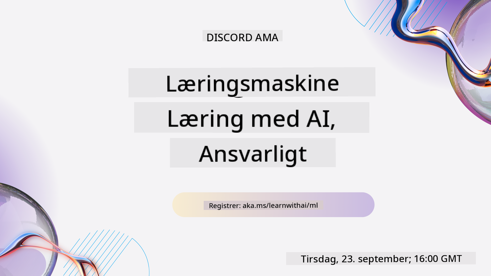
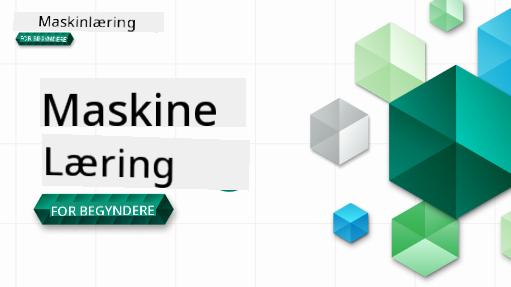

<!--
CO_OP_TRANSLATOR_METADATA:
{
  "original_hash": "7a13afb3674838f557d61f8d67e4d5f8",
  "translation_date": "2025-10-24T09:11:33+00:00",
  "source_file": "README.md",
  "language_code": "da"
}
-->

### 🌐 Understøttelse af flere sprog

#### Understøttet via GitHub Action (Automatisk & Altid Opdateret)

[Arabisk](../ar/README.md) | [Bengali](../bn/README.md) | [Bulgarsk](../bg/README.md) | [Burmesisk (Myanmar)](../my/README.md) | [Kinesisk (Forenklet)](../zh/README.md) | [Kinesisk (Traditionelt, Hong Kong)](../hk/README.md) | [Kinesisk (Traditionelt, Macau)](../mo/README.md) | [Kinesisk (Traditionelt, Taiwan)](../tw/README.md) | [Kroatisk](../hr/README.md) | [Tjekkisk](../cs/README.md) | [Dansk](./README.md) | [Hollandsk](../nl/README.md) | [Estisk](../et/README.md) | [Finsk](../fi/README.md) | [Fransk](../fr/README.md) | [Tysk](../de/README.md) | [Græsk](../el/README.md) | [Hebraisk](../he/README.md) | [Hindi](../hi/README.md) | [Ungarsk](../hu/README.md) | [Indonesisk](../id/README.md) | [Italiensk](../it/README.md) | [Japansk](../ja/README.md) | [Koreansk](../ko/README.md) | [Litauisk](../lt/README.md) | [Malaysisk](../ms/README.md) | [Marathi](../mr/README.md) | [Nepalesisk](../ne/README.md) | [Norsk](../no/README.md) | [Persisk (Farsi)](../fa/README.md) | [Polsk](../pl/README.md) | [Portugisisk (Brasilien)](../br/README.md) | [Portugisisk (Portugal)](../pt/README.md) | [Punjabi (Gurmukhi)](../pa/README.md) | [Rumænsk](../ro/README.md) | [Russisk](../ru/README.md) | [Serbisk (Kyrillisk)](../sr/README.md) | [Slovakisk](../sk/README.md) | [Slovensk](../sl/README.md) | [Spansk](../es/README.md) | [Swahili](../sw/README.md) | [Svensk](../sv/README.md) | [Tagalog (Filippinsk)](../tl/README.md) | [Tamil](../ta/README.md) | [Thai](../th/README.md) | [Tyrkisk](../tr/README.md) | [Ukrainsk](../uk/README.md) | [Urdu](../ur/README.md) | [Vietnamesisk](../vi/README.md)

#### Bliv en del af vores fællesskab

Vi har en igangværende Discord-serie om at lære med AI. Læs mere og deltag i [Learn with AI Series](https://aka.ms/learnwithai/discord) fra 18. - 30. september 2025. Du vil få tips og tricks til at bruge GitHub Copilot til Data Science.

# Maskinlæring for begyndere - Et undervisningsforløb

> 🌍 Rejs rundt i verden, mens vi udforsker maskinlæring gennem verdens kulturer 🌍

Cloud Advocates hos Microsoft er glade for at tilbyde et 12-ugers undervisningsforløb med 26 lektioner om **maskinlæring**. I dette forløb vil du lære om det, der nogle gange kaldes **klassisk maskinlæring**, primært ved brug af Scikit-learn som bibliotek og uden at gå i dybden med deep learning, som er dækket i vores [AI for Beginners' curriculum](https://aka.ms/ai4beginners). Kombinér disse lektioner med vores ['Data Science for Beginners' curriculum](https://aka.ms/ds4beginners), også!

Rejs med os rundt i verden, mens vi anvender disse klassiske teknikker på data fra mange forskellige områder. Hver lektion inkluderer quizzer før og efter lektionen, skriftlige instruktioner til at gennemføre lektionen, en løsning, en opgave og mere. Vores projektbaserede pædagogik giver dig mulighed for at lære, mens du bygger, en dokumenteret metode til at få nye færdigheder til at hænge fast.

**✍️ Stor tak til vores forfattere** Jen Looper, Stephen Howell, Francesca Lazzeri, Tomomi Imura, Cassie Breviu, Dmitry Soshnikov, Chris Noring, Anirban Mukherjee, Ornella Altunyan, Ruth Yakubu og Amy Boyd

**🎨 Tak også til vores illustratorer** Tomomi Imura, Dasani Madipalli og Jen Looper

**🙏 Særlig tak 🙏 til vores Microsoft Student Ambassador-forfattere, anmeldere og indholdsbidragydere**, især Rishit Dagli, Muhammad Sakib Khan Inan, Rohan Raj, Alexandru Petrescu, Abhishek Jaiswal, Nawrin Tabassum, Ioan Samuila og Snigdha Agarwal

**🤩 Ekstra tak til Microsoft Student Ambassadors Eric Wanjau, Jasleen Sondhi og Vidushi Gupta for vores R-lektioner!**

# Kom godt i gang

Følg disse trin:
1. **Fork repository**: Klik på "Fork"-knappen øverst til højre på denne side.
2. **Clone repository**:   `git clone https://github.com/microsoft/ML-For-Beginners.git`

> [find alle yderligere ressourcer til dette kursus i vores Microsoft Learn-samling](https://learn.microsoft.com/en-us/collections/qrqzamz1nn2wx3?WT.mc_id=academic-77952-bethanycheum)

> 🔧 **Har du brug for hjælp?** Tjek vores [Fejlfindingsguide](TROUBLESHOOTING.md) for løsninger på almindelige problemer med installation, opsætning og gennemførelse af lektioner.

**[Studerende](https://aka.ms/student-page)**, for at bruge dette undervisningsforløb, skal du fork hele repoen til din egen GitHub-konto og gennemføre øvelserne alene eller i en gruppe:

- Start med en quiz før lektionen.
- Læs lektionen og gennemfør aktiviteterne, mens du pauser og reflekterer ved hver videnskontrol.
- Prøv at skabe projekterne ved at forstå lektionerne i stedet for blot at køre løsningskoden; dog er denne kode tilgængelig i `/solution`-mapperne i hver projektorienteret lektion.
- Tag quizzen efter lektionen.
- Gennemfør udfordringen.
- Gennemfør opgaven.
- Efter at have afsluttet en gruppe lektioner, besøg [Diskussionsforum](https://github.com/microsoft/ML-For-Beginners/discussions) og "lær højt" ved at udfylde den relevante PAT-rubrik. En 'PAT' er et Progress Assessment Tool, som er en rubrik, du udfylder for at fremme din læring. Du kan også reagere på andre PATs, så vi kan lære sammen.

> For yderligere studier anbefaler vi at følge disse [Microsoft Learn](https://docs.microsoft.com/en-us/users/jenlooper-2911/collections/k7o7tg1gp306q4?WT.mc_id=academic-77952-leestott) moduler og læringsstier.

**Lærere**, vi har [inkluderet nogle forslag](for-teachers.md) til, hvordan man kan bruge dette undervisningsforløb.

---

## Video-gennemgange

Nogle af lektionerne er tilgængelige som korte videoer. Du kan finde alle disse i lektionerne eller på [ML for Beginners playlist på Microsoft Developer YouTube-kanalen](https://aka.ms/ml-beginners-videos) ved at klikke på billedet nedenfor.

---

## Mød teamet

**Gif af** [Mohit Jaisal](https://linkedin.com/in/mohitjaisal)

> 🎥 Klik på billedet ovenfor for en video om projektet og de personer, der skabte det!

---

## Pædagogik

Vi har valgt to pædagogiske principper, mens vi byggede dette undervisningsforløb: at sikre, at det er **projektbaseret** og at det inkluderer **hyppige quizzer**. Derudover har dette forløb et fælles **tema** for at give det sammenhæng.

Ved at sikre, at indholdet er knyttet til projekter, bliver processen mere engagerende for studerende, og begreberne vil blive bedre fastholdt. Derudover sætter en lav-stress quiz før en klasse intentionen hos den studerende mod at lære et emne, mens en anden quiz efter klassen sikrer yderligere fastholdelse. Dette undervisningsforløb er designet til at være fleksibelt og sjovt og kan tages i sin helhed eller delvist. Projekterne starter små og bliver gradvist mere komplekse ved slutningen af den 12-ugers cyklus. Forløbet inkluderer også et efterskrift om virkelige anvendelser af ML, som kan bruges som ekstra kredit eller som grundlag for diskussion.

> Find vores [Code of Conduct](CODE_OF_CONDUCT.md), [Contributing](CONTRIBUTING.md), [Translation](TRANSLATIONS.md), og [Troubleshooting](TROUBLESHOOTING.md) retningslinjer. Vi værdsætter din konstruktive feedback!

## Hver lektion inkluderer

- valgfri sketchnote
- valgfri supplerende video
- video-gennemgang (kun nogle lektioner)
- [quiz før lektionen](https://ff-quizzes.netlify.app/en/ml/)
- skriftlig lektion
- for projektbaserede lektioner, trin-for-trin vejledninger til, hvordan man bygger projektet
- videnskontroller
- en udfordring
- supplerende læsning
- opgave
- [quiz efter lektionen](https://ff-quizzes.netlify.app/en/ml/)

> **En note om sprog**: Disse lektioner er primært skrevet i Python, men mange er også tilgængelige i R. For at gennemføre en R-lektion, gå til `/solution`-mappen og kig efter R-lektioner. De inkluderer en .rmd-udvidelse, som repræsenterer en **R Markdown**-fil, der kan defineres som en indlejring af `kodeblokke` (af R eller andre sprog) og en `YAML-header` (der guider, hvordan output formateres, såsom PDF) i et `Markdown-dokument`. Som sådan tjener det som en eksemplarisk forfatterramme for data science, da det giver dig mulighed for at kombinere din kode, dens output og dine tanker ved at skrive dem ned i Markdown. Desuden kan R Markdown-dokumenter gengives til outputformater som PDF, HTML eller Word.

> **En note om quizzer**: Alle quizzer er indeholdt i [Quiz App folder](../../quiz-app), med i alt 52 quizzer med tre spørgsmål hver. De er linket fra lektionerne, men quiz-appen kan køres lokalt; følg instruktionen i `quiz-app`-mappen for at hoste lokalt eller udrulle til Azure.

| Lektion Nummer |                             Emne                              |                   Lektion Gruppe                   | Læringsmål                                                                                                                     |                                                              Linket Lektion                                                               |                        Forfatter                        |
| :-----------: | :------------------------------------------------------------: | :-------------------------------------------------: | ------------------------------------------------------------------------------------------------------------------------------- | :--------------------------------------------------------------------------------------------------------------------------------------: | :--------------------------------------------------: |
|      01       |                Introduktion til maskinlæring                  |      [Introduktion](1-Introduction/README.md)       | Lær de grundlæggende begreber bag maskinlæring                                                                                  |                                             [Lektion](1-Introduction/1-intro-to-ML/README.md)                                             |                       Muhammad                       |
|      02       |                Historien om maskinlæring                      |      [Introduktion](1-Introduction/README.md)       | Lær historien bag dette felt                                                                                                    |                                            [Lektion](1-Introduction/2-history-of-ML/README.md)                                            |                     Jen og Amy                      |
|      03       |                 Retfærdighed og maskinlæring                  |      [Introduktion](1-Introduction/README.md)       | Hvilke vigtige filosofiske spørgsmål omkring retfærdighed bør studerende overveje, når de bygger og anvender ML-modeller?       |                                              [Lektion](1-Introduction/3-fairness/README.md)                                               |                        Tomomi                        |
|      04       |                Teknikker til maskinlæring                     |      [Introduktion](1-Introduction/README.md)       | Hvilke teknikker bruger ML-forskere til at bygge ML-modeller?                                                                   |                                          [Lektion](1-Introduction/4-techniques-of-ML/README.md)                                           |                    Chris og Jen                     |
|      05       |                   Introduktion til regression                 |        [Regression](2-Regression/README.md)         | Kom i gang med Python og Scikit-learn til regressionsmodeller                                                                   |         [Python](2-Regression/1-Tools/README.md) • [R](../../2-Regression/1-Tools/solution/R/lesson_1.html)         |      Jen • Eric Wanjau       |
|      06       |                Nordamerikanske græskarpriser 🎃               |        [Regression](2-Regression/README.md)         | Visualiser og rens data som forberedelse til ML                                                                                 |          [Python](2-Regression/2-Data/README.md) • [R](../../2-Regression/2-Data/solution/R/lesson_2.html)          |      Jen • Eric Wanjau       |
|      07       |                Nordamerikanske græskarpriser 🎃               |        [Regression](2-Regression/README.md)         | Byg lineære og polynomiske regressionsmodeller                                                                                  |        [Python](2-Regression/3-Linear/README.md) • [R](../../2-Regression/3-Linear/solution/R/lesson_3.html)        |      Jen og Dmitry • Eric Wanjau       |
|      08       |                Nordamerikanske græskarpriser 🎃               |        [Regression](2-Regression/README.md)         | Byg en logistisk regressionsmodel                                                                                               |     [Python](2-Regression/4-Logistic/README.md) • [R](../../2-Regression/4-Logistic/solution/R/lesson_4.html)      |      Jen • Eric Wanjau       |
|      09       |                          En webapp 🔌                          |           [Webapp](3-Web-App/README.md)             | Byg en webapp til at bruge din trænet model                                                                                     |                                                 [Python](3-Web-App/1-Web-App/README.md)                                                  |                         Jen                          |
|      10       |                 Introduktion til klassifikation               |    [Klassifikation](4-Classification/README.md)     | Rens, forbered og visualiser dine data; introduktion til klassifikation                                                         | [Python](4-Classification/1-Introduction/README.md) • [R](../../4-Classification/1-Introduction/solution/R/lesson_10.html)  | Jen og Cassie • Eric Wanjau |
|      11       |             Lækre asiatiske og indiske retter 🍜              |    [Klassifikation](4-Classification/README.md)     | Introduktion til klassifikatorer                                                                                                | [Python](4-Classification/2-Classifiers-1/README.md) • [R](../../4-Classification/2-Classifiers-1/solution/R/lesson_11.html) | Jen og Cassie • Eric Wanjau |
|      12       |             Lækre asiatiske og indiske retter 🍜              |    [Klassifikation](4-Classification/README.md)     | Flere klassifikatorer                                                                                                           | [Python](4-Classification/3-Classifiers-2/README.md) • [R](../../4-Classification/3-Classifiers-2/solution/R/lesson_12.html) | Jen og Cassie • Eric Wanjau |
|      13       |             Lækre asiatiske og indiske retter 🍜              |    [Klassifikation](4-Classification/README.md)     | Byg en anbefalingswebapp ved hjælp af din model                                                                                 |                                              [Python](4-Classification/4-Applied/README.md)                                              |                         Jen                          |
|      14       |                   Introduktion til klyngedannelse             |        [Klyngedannelse](5-Clustering/README.md)     | Rens, forbered og visualiser dine data; introduktion til klyngedannelse                                                         |         [Python](5-Clustering/1-Visualize/README.md) • [R](../../5-Clustering/1-Visualize/solution/R/lesson_14.html)         |      Jen • Eric Wanjau       |
|      15       |              Udforskning af nigerianske musiksmag 🎧           |        [Klyngedannelse](5-Clustering/README.md)     | Udforsk K-Means klyngedannelsesmetoden                                                                                          |           [Python](5-Clustering/2-K-Means/README.md) • [R](../../5-Clustering/2-K-Means/solution/R/lesson_15.html)           |      Jen • Eric Wanjau       |
|      16       |        Introduktion til naturlig sprogbehandling ☕️          |   [Naturlig sprogbehandling](6-NLP/README.md)       | Lær det grundlæggende om NLP ved at bygge en simpel bot                                                                         |                                             [Python](6-NLP/1-Introduction-to-NLP/README.md)                                              |                       Stephen                        |
|      17       |                      Almindelige NLP-opgaver ☕️               |   [Naturlig sprogbehandling](6-NLP/README.md)       | Uddyb din NLP-viden ved at forstå almindelige opgaver, der kræves, når man arbejder med sproglige strukturer                    |                                                    [Python](6-NLP/2-Tasks/README.md)                                                     |                       Stephen                        |
|      18       |             Oversættelse og sentimentanalyse ♥️               |   [Naturlig sprogbehandling](6-NLP/README.md)       | Oversættelse og sentimentanalyse med Jane Austen                                                                                |                                            [Python](6-NLP/3-Translation-Sentiment/README.md)                                             |                       Stephen                        |
|      19       |                  Romantiske hoteller i Europa ♥️              |   [Naturlig sprogbehandling](6-NLP/README.md)       | Sentimentanalyse med hotelanmeldelser 1                                                                                        |                                               [Python](6-NLP/4-Hotel-Reviews-1/README.md)                                                |                       Stephen                        |
|      20       |                  Romantiske hoteller i Europa ♥️              |   [Naturlig sprogbehandling](6-NLP/README.md)       | Sentimentanalyse med hotelanmeldelser 2                                                                                        |                                               [Python](6-NLP/5-Hotel-Reviews-2/README.md)                                                |                       Stephen                        |
|      21       |            Introduktion til tidsserieprognoser                |        [Tidsserier](7-TimeSeries/README.md)         | Introduktion til tidsserieprognoser                                                                                             |                                             [Python](7-TimeSeries/1-Introduction/README.md)                                              |                      Francesca                       |
|      22       | ⚡️ Verdens energiforbrug ⚡️ - tidsserieprognoser med ARIMA   |        [Tidsserier](7-TimeSeries/README.md)         | Tidsserieprognoser med ARIMA                                                                                                    |                                                 [Python](7-TimeSeries/2-ARIMA/README.md)                                                 |                      Francesca                       |
|      23       |  ⚡️ Verdens energiforbrug ⚡️ - tidsserieprognoser med SVR    |        [Tidsserier](7-TimeSeries/README.md)         | Tidsserieprognoser med Support Vector Regressor                                                                                 |                                                  [Python](7-TimeSeries/3-SVR/README.md)                                                  |                       Anirban                        |
|      24       |             Introduktion til forstærkningslæring              | [Forstærkningslæring](8-Reinforcement/README.md)    | Introduktion til forstærkningslæring med Q-Learning                                                                             |                                             [Python](8-Reinforcement/1-QLearning/README.md)                                              |                        Dmitry                        |
|      25       |                 Hjælp Peter med at undgå ulven! 🐺            | [Forstærkningslæring](8-Reinforcement/README.md)    | Forstærkningslæring Gym                                                                                                         |                                                [Python](8-Reinforcement/2-Gym/README.md)                                                 |                        Dmitry                        |
|  Postscript   |            Virkelige ML-scenarier og applikationer            |      [ML i det virkelige liv](9-Real-World/README.md) | Interessante og afslørende virkelige applikationer af klassisk ML                                                              |                                             [Lektion](9-Real-World/1-Applications/README.md)                                              |                         Team                         |
|  Postscript   |            Modeldebugging i ML med RAI-dashboard              |      [ML i det virkelige liv](9-Real-World/README.md) | Modeldebugging i maskinlæring ved hjælp af Responsible AI-dashboardkomponenter                                                 |                                             [Lektion](9-Real-World/2-Debugging-ML-Models/README.md)                                              |                         Ruth Yakubu                       |

> [find alle yderligere ressourcer til dette kursus i vores Microsoft Learn-samling](https://learn.microsoft.com/en-us/collections/qrqzamz1nn2wx3?WT.mc_id=academic-77952-bethanycheum)

## Offline adgang

Du kan køre denne dokumentation offline ved at bruge [Docsify](https://docsify.js.org/#/). Fork denne repo, [installer Docsify](https://docsify.js.org/#/quickstart) på din lokale maskine, og skriv derefter `docsify serve` i rodmappen af denne repo. Hjemmesiden vil blive serveret på port 3000 på din localhost: `localhost:3000`.

## PDF'er

Find en pdf af pensum med links [her](https://microsoft.github.io/ML-For-Beginners/pdf/readme.pdf).

## 🎒 Andre kurser 

Vores team producerer andre kurser! Tjek dem ud:

### Azure / Edge / MCP / Agenter

---
 
### Generativ AI-serie

[-9333EA?style=for-the-badge&labelColor=E5E7EB&color=9333EA)](https://github.com/microsoft/Generative-AI-for-beginners-dotnet?WT.mc_id=academic-105485-koreyst)
[-C084FC?style=for-the-badge&labelColor=E5E7EB&color=C084FC)](https://github.com/microsoft/generative-ai-for-beginners-java?WT.mc_id=academic-105485-koreyst)
[-E879F9?style=for-the-badge&labelColor=E5E7EB&color=E879F9)](https://github.com/microsoft/generative-ai-with-javascript?WT.mc_id=academic-105485-koreyst)

---
 
### Grundlæggende læring
  
  
  
  
  
  
  

---

### Copilot-serien  
  
  
  
<!-- CO-OP TRANSLATOR OTHER COURSES END -->

## Få hjælp  

Hvis du sidder fast eller har spørgsmål om at bygge AI-apps, så deltag i:  

  

Hvis du har produktfeedback eller oplever fejl under udviklingen, besøg:  

  

---

**Ansvarsfraskrivelse**:  
Dette dokument er blevet oversat ved hjælp af AI-oversættelsestjenesten [Co-op Translator](https://github.com/Azure/co-op-translator). Selvom vi bestræber os på nøjagtighed, skal du være opmærksom på, at automatiserede oversættelser kan indeholde fejl eller unøjagtigheder. Det originale dokument på dets oprindelige sprog bør betragtes som den autoritative kilde. For kritisk information anbefales professionel menneskelig oversættelse. Vi er ikke ansvarlige for eventuelle misforståelser eller fejltolkninger, der opstår som følge af brugen af denne oversættelse.