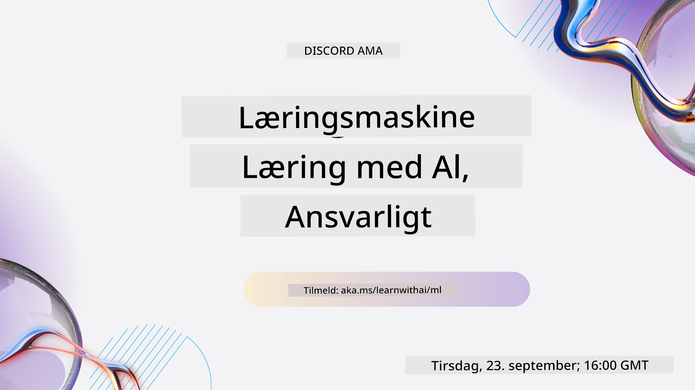
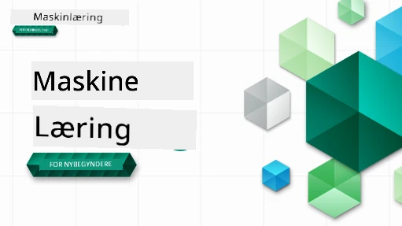

[](https://github.com/microsoft/ML-For-Beginners/blob/master/LICENSE)
[](https://GitHub.com/microsoft/ML-For-Beginners/graphs/contributors/)
[](https://GitHub.com/microsoft/ML-For-Beginners/issues/)
[](https://GitHub.com/microsoft/ML-For-Beginners/pulls/)
[](http://makeapullrequest.com)

[](https://GitHub.com/microsoft/ML-For-Beginners/watchers/)
[](https://GitHub.com/microsoft/ML-For-Beginners/network/)
[](https://GitHub.com/microsoft/ML-For-Beginners/stargazers/)

### 🌐 Support på flere sprog

#### Understøttet via GitHub Action (Automatiseret & Altid Opdateret)

<!-- CO-OP TRANSLATOR LANGUAGES TABLE START -->
[Arabisk](../ar/README.md) | [Bengali](../bn/README.md) | [Bulgarsk](../bg/README.md) | [Burmese (Myanmar)](../my/README.md) | [Kinesisk (Forenklet)](../zh-CN/README.md) | [Kinesisk (Traditionelt, Hong Kong)](../zh-HK/README.md) | [Kinesisk (Traditionelt, Macau)](../zh-MO/README.md) | [Kinesisk (Traditionelt, Taiwan)](../zh-TW/README.md) | [Kroatisk](../hr/README.md) | [Tjekkisk](../cs/README.md) | [Dansk](./README.md) | [Hollandsk](../nl/README.md) | [Estisk](../et/README.md) | [Finsk](../fi/README.md) | [Fransk](../fr/README.md) | [Tysk](../de/README.md) | [Græsk](../el/README.md) | [Hebraisk](../he/README.md) | [Hindi](../hi/README.md) | [Ungarsk](../hu/README.md) | [Indonesisk](../id/README.md) | [Italiensk](../it/README.md) | [Japansk](../ja/README.md) | [Kannada](../kn/README.md) | [Khmer](../km/README.md) | [Koreansk](../ko/README.md) | [Litauisk](../lt/README.md) | [Malayisk](../ms/README.md) | [Malayalam](../ml/README.md) | [Marathi](../mr/README.md) | [Nepalesisk](../ne/README.md) | [Nigeriansk Pidgin](../pcm/README.md) | [Norsk](../no/README.md) | [Persisk (Farsi)](../fa/README.md) | [Polsk](../pl/README.md) | [Portugisisk (Brasilien)](../pt-BR/README.md) | [Portugisisk (Portugal)](../pt-PT/README.md) | [Punjabi (Gurmukhi)](../pa/README.md) | [Rumænsk](../ro/README.md) | [Russisk](../ru/README.md) | [Serbisk (Cyrillisk)](../sr/README.md) | [Slovakisk](../sk/README.md) | [Slovensk](../sl/README.md) | [Spansk](../es/README.md) | [Swahili](../sw/README.md) | [Svensk](../sv/README.md) | [Tagalog (Filippinsk)](../tl/README.md) | [Tamil](../ta/README.md) | [Telugu](../te/README.md) | [Thai](../th/README.md) | [Tyrkisk](../tr/README.md) | [Ukrainisk](../uk/README.md) | [Urdu](../ur/README.md) | [Vietnam](../vi/README.md)

> **Foretrækker du at clone lokalt?**
>
> Dette repository inkluderer over 50 sprogoversættelser, hvilket betydeligt øger downloadstørrelsen. For at clone uden oversættelser, brug sparse checkout:
>
> **Bash / macOS / Linux:**
> ```bash
> git clone --filter=blob:none --sparse https://github.com/microsoft/ML-For-Beginners.git
> cd ML-For-Beginners
> git sparse-checkout set --no-cone '/*' '!translations' '!translated_images'
> ```
>
> **CMD (Windows):**
> ```cmd
> git clone --filter=blob:none --sparse https://github.com/microsoft/ML-For-Beginners.git
> cd ML-For-Beginners
> git sparse-checkout set --no-cone "/*" "!translations" "!translated_images"
> ```
>
> Dette giver dig alt, hvad du behøver for at gennemføre kurset med en meget hurtigere download.
<!-- CO-OP TRANSLATOR LANGUAGES TABLE END -->

#### Deltag i vores fællesskab

[](https://discord.gg/nTYy5BXMWG)

Vi har en Discord-serie "Learn with AI" i gang, lær mere og deltag hos [Learn with AI Series](https://aka.ms/learnwithai/discord) fra 18. - 30. september 2025. Du vil få tips og tricks til at bruge GitHub Copilot til Data Science.



# Maskinlæring for begyndere - En læseplan

> 🌍 Rejs verden rundt, mens vi udforsker Maskinlæring gennem verdens kulturer 🌍

Cloud Advocates hos Microsoft er glade for at tilbyde en 12-ugers, 26-lektions læseplan om **Maskinlæring**. I denne læseplan lærer du om det, der nogle gange kaldes **klassisk maskinlæring**, primært ved hjælp af Scikit-learn som bibliotek og uden deep learning, som dækkes i vores [AI for Beginners-læseplan](https://aka.ms/ai4beginners). Kombinér disse lektioner med vores ['Data Science for Beginners' læseplan](https://aka.ms/ds4beginners) også!

Rejs med os verden rundt, mens vi anvender disse klassiske teknikker på data fra mange områder af verden. Hver lektion inkluderer før- og efter-quizzer, skriftlige instruktioner til at gennemføre lektionen, en løsning, en opgave og mere. Vores projektbaserede pædagogik giver dig mulighed for at lære, mens du bygger, en bevist metode til at fastholde nye færdigheder.

**✍️ Hjertelige tak til vores forfattere** Jen Looper, Stephen Howell, Francesca Lazzeri, Tomomi Imura, Cassie Breviu, Dmitry Soshnikov, Chris Noring, Anirban Mukherjee, Ornella Altunyan, Ruth Yakubu og Amy Boyd

**🎨 Tak også til vores illustratorer** Tomomi Imura, Dasani Madipalli og Jen Looper

**🙏 Særlige tak 🙏 til vores Microsoft Student Ambassador-forfattere, -anmeldere og indholdsbidragydere**, især Rishit Dagli, Muhammad Sakib Khan Inan, Rohan Raj, Alexandru Petrescu, Abhishek Jaiswal, Nawrin Tabassum, Ioan Samuila og Snigdha Agarwal

**🤩 Ekstra tak til Microsoft Student Ambassadors Eric Wanjau, Jasleen Sondhi og Vidushi Gupta for vores R-lektioner!**

# Kom godt i gang

Følg disse trin:
1. **Fork Repositoryet**: Klik på "Fork" knappen øverst til højre på denne side.
2. **Clone repositoryet**: `git clone https://github.com/microsoft/ML-For-Beginners.git`

> 💡 **Hurtigt start-tips:** Vil du starte i en browser uden at sætte Python op lokalt? Brug [GitHub Codespaces](https://github.com/features/codespaces) til at oprette et cloud-udviklingsmiljø for din fork. Åbn den grønne **Code** menu, vælg **Codespaces**, og opret en codespace; installer de nødvendige afhængigheder for hver lektion efter behov.

> [find alle yderligere ressourcer til dette kursus i vores Microsoft Learn-samling](https://learn.microsoft.com/en-us/collections/qrqzamz1nn2wx3?WT.mc_id=academic-77952-bethanycheum)

> 🔧 **Brug for hjælp?** Tjek vores [Fejlfinding Guide](TROUBLESHOOTING.md) for løsninger på almindelige problemer med installation, opsætning og kørsel af lektioner.


**[Studerende](https://aka.ms/student-page)**, for at bruge denne læseplan skal du fork hele repo til din egen GitHub-konto og gennemføre øvelserne selv eller i gruppe:

- Start med en pre-lecture quiz.
- Læs lektionen og gennemfør aktiviteterne, stop op og reflekter ved hver videnscheck.
- Prøv at skabe projekterne ved at forstå lektionerne snarere end blot at køre løsningskoden; den kode findes dog i `/solution` mapperne i hver projektorienteret lektion.
- Tag post-lecture quizzen.
- Fuldfør udfordringen.
- Fuldfør opgaven.
- Efter at have gennemført en lektion gruppe, besøg [Diskussionsforum](https://github.com/microsoft/ML-For-Beginners/discussions) og "learn out loud" ved at udfylde den passende PAT rubric. En 'PAT' er et Progress Assessment Tool, som er en rubric, du udfylder for at fremme din læring. Du kan også reagere på andres PATs, så vi kan lære sammen.

> Til yderligere studier anbefaler vi at følge disse [Microsoft Learn](https://docs.microsoft.com/en-us/users/jenlooper-2911/collections/k7o7tg1gp306q4?WT.mc_id=academic-77952-leestott) moduler og læringsveje.

**Lærere**, vi har [inkluderet nogle forslag](for-teachers.md) til, hvordan du kan bruge denne læseplan.

---

## Video-gennemgange

Nogle af lektionerne findes som korte videoer. Du kan finde dem inline i lektionerne eller på [ML for Beginners playliste på Microsoft Developer YouTube-kanalen](https://aka.ms/ml-beginners-videos) ved at klikke på billedet nedenfor.

[](https://aka.ms/ml-beginners-videos)

---

## Mød teamet

[](https://youtu.be/Tj1XWrDSYJU)

**Gif af** [Mohit Jaisal](https://linkedin.com/in/mohitjaisal)

> 🎥 Klik på billedet ovenfor for en video om projektet og folkene, der skabte det!

---

## Pædagogik

Vi har valgt to pædagogiske principper, mens vi byggede denne læseplan: at sikre, at den er praktisk og **projektbaseret** samt at inkludere **hyppige quizzer**. Derudover har denne læseplan et fælles **tema** for at give den sammenhæng.

Ved at sikre, at indholdet er knyttet til projekter, bliver processen mere engagerende for studerende, og fastholdelse af begreber bliver styrket. En lavrisiko quiz før undervisning sætter desuden intentionen hos den studerende mod at lære et emne, mens en anden quiz efter undervisning sikrer yderligere fastholdelse. Denne læseplan er designet til at være fleksibel og sjov og kan tages helt eller delvist. Projekterne starter små og bliver stadig mere komplekse i løbet af 12-ugers cyklussen. Læseplanen inkluderer også et efterord om virkelige anvendelser af ML, som kan bruges som ekstra kredit eller som diskussionsgrundlag.

> Find vores [Adfærdskodeks](CODE_OF_CONDUCT.md), [Bidrag](CONTRIBUTING.md), [Oversættelser](..), og [Fejlfinding](TROUBLESHOOTING.md) vejledninger. Vi værdsætter din konstruktive feedback!

## Hver lektion indeholder

- valgfri skitse-note
- valgfri supplerende video
- video-gennemgang (kun nogle lektioner)
- [pre-lecture varm-quiz](https://ff-quizzes.netlify.app/en/ml/)
- skreven lektion
- for projektbaserede lektioner, trin-for-trin vejledninger til, hvordan man bygger projektet
- videnscheck
- en udfordring
- supplerende læsning
- opgave
- [post-lecture quiz](https://ff-quizzes.netlify.app/en/ml/)

> **En note om sprog**: Disse lektioner er primært skrevet i Python, men mange findes også i R. For at gennemføre en R lektion, gå til `/solution` mappen og find R lektionerne. De inkluderer en .rmd-udvidelse, som repræsenterer en **R Markdown** fil, hvilket kan defineres som en indlejring af `kodeblokke` (af R eller andre sprog) og en `YAML-header` (der styrer formatering af output som PDF) i et `Markdown dokument`. Dermed fungerer det som en fremragende forfatterramme for data science, da det tillader dig at kombinere din kode, dens output og dine tanker ved at lade dig skrive dem ned i Markdown. Desuden kan R Markdown-dokumenter gengives til outputformater som PDF, HTML eller Word.

> **En note om quizzer**: Alle quizzer findes i [Quiz App mappen](../../quiz-app), i alt 52 quizzer med tre spørgsmål hver. De er linket fra lektionerne, men quiz appen kan køres lokalt; følg instruktionerne i `quiz-app` mappen for lokal hosting eller udrulning til Azure.

| Lesson Number |                             Topic                              |                   Lesson Grouping                   | Learning Objectives                                                                                                             |                                                              Linked Lesson                                                               |                        Author                        |
| :-----------: | :------------------------------------------------------------: | :-------------------------------------------------: | ------------------------------------------------------------------------------------------------------------------------------- | :--------------------------------------------------------------------------------------------------------------------------------------: | :--------------------------------------------------: |
|      01       |                Introduktion til maskinlæring                |      [Introduction](1-Introduction/README.md)       | Lær de grundlæggende begreber bag maskinlæring                                                                                  |                                             [Lesson](1-Introduction/1-intro-to-ML/README.md)                                             |                       Muhammad                       |
|      02       |                Historien om maskinlæring                     |      [Introduction](1-Introduction/README.md)       | Lær historien bag dette felt                                                                                                    |                                            [Lesson](1-Introduction/2-history-of-ML/README.md)                                            |                     Jen and Amy                      |
|      03       |                 Retfærdighed og maskinlæring                  |      [Introduction](1-Introduction/README.md)       | Hvad er de vigtige filosofiske spørgsmål om retfærdighed, som studerende skal overveje, når de bygger og anvender ML-modeller?    |                                              [Lesson](1-Introduction/3-fairness/README.md)                                               |                        Tomomi                        |
|      04       |                Teknikker til maskinlæring                    |      [Introduction](1-Introduction/README.md)       | Hvilke teknikker bruger ML-forskere til at bygge ML-modeller?                                                                   |                                          [Lesson](1-Introduction/4-techniques-of-ML/README.md)                                           |                    Chris and Jen                     |
|      05       |                   Introduktion til regression                 |        [Regression](2-Regression/README.md)         | Kom i gang med Python og Scikit-learn til regressionsmodeller                                                                  |         [Python](2-Regression/1-Tools/README.md) • [R](../../2-Regression/1-Tools/solution/R/lesson_1.html)         |      Jen • Eric Wanjau       |
|      06       |                Nordamerikanske græskarpriser 🎃              |        [Regression](2-Regression/README.md)         | Visualiser og rens data til forberedelse for ML                                                                                |          [Python](2-Regression/2-Data/README.md) • [R](../../2-Regression/2-Data/solution/R/lesson_2.html)          |      Jen • Eric Wanjau       |
|      07       |                Nordamerikanske græskarpriser 🎃              |        [Regression](2-Regression/README.md)         | Byg lineære og polynomiale regressionsmodeller                                                                                |        [Python](2-Regression/3-Linear/README.md) • [R](../../2-Regression/3-Linear/solution/R/lesson_3.html)        |      Jen and Dmitry • Eric Wanjau       |
|      08       |                Nordamerikanske græskarpriser 🎃              |        [Regression](2-Regression/README.md)         | Byg en logistisk regressionsmodel                                                                                              |     [Python](2-Regression/4-Logistic/README.md) • [R](../../2-Regression/4-Logistic/solution/R/lesson_4.html)      |      Jen • Eric Wanjau       |
|      09       |                          En webapp 🔌                          |           [Web App](3-Web-App/README.md)            | Byg en webapp til at bruge din trænede model                                                                                   |                                                 [Python](3-Web-App/1-Web-App/README.md)                                                  |                         Jen                          |
|      10       |                 Introduktion til klassifikation               |    [Classification](4-Classification/README.md)     | Rens, forbered og visualisér dine data; introduktion til klassifikation                                                        | [Python](4-Classification/1-Introduction/README.md) • [R](../../4-Classification/1-Introduction/solution/R/lesson_10.html)  | Jen and Cassie • Eric Wanjau |
|      11       |             Lækre asiatiske og indiske køkkener 🍜            |    [Classification](4-Classification/README.md)     | Introduktion til klassifikatorer                                                                                               | [Python](4-Classification/2-Classifiers-1/README.md) • [R](../../4-Classification/2-Classifiers-1/solution/R/lesson_11.html) | Jen and Cassie • Eric Wanjau |
|      12       |             Lækre asiatiske og indiske køkkener 🍜            |    [Classification](4-Classification/README.md)     | Flere klassifikatorer                                                                                                          | [Python](4-Classification/3-Classifiers-2/README.md) • [R](../../4-Classification/3-Classifiers-2/solution/R/lesson_12.html) | Jen and Cassie • Eric Wanjau |
|      13       |             Lækre asiatiske og indiske køkkener 🍜            |    [Classification](4-Classification/README.md)     | Byg en anbefalings-webapp ved hjælp af din model                                                                               |                                              [Python](4-Classification/4-Applied/README.md)                                              |                         Jen                          |
|      14       |                   Introduktion til clustering                  |        [Clustering](5-Clustering/README.md)         | Rens, forbered og visualisér dine data; introduktion til clustering                                                            |         [Python](5-Clustering/1-Visualize/README.md) • [R](../../5-Clustering/1-Visualize/solution/R/lesson_14.html)         |      Jen • Eric Wanjau       |
|      15       |              Udforskning af nigerianske musiksmag 🎧          |        [Clustering](5-Clustering/README.md)         | Udforsk K-Means clustering-metoden                                                                                            |           [Python](5-Clustering/2-K-Means/README.md) • [R](../../5-Clustering/2-K-Means/solution/R/lesson_15.html)           |      Jen • Eric Wanjau       |
|      16       |        Introduktion til naturlig sprogbehandling ☕️           |   [Natural language processing](6-NLP/README.md)    | Lær det grundlæggende om NLP ved at bygge en simpel bot                                                                        |                                             [Python](6-NLP/1-Introduction-to-NLP/README.md)                                              |                       Stephen                        |
|      17       |                      Almindelige NLP-opgaver ☕️               |   [Natural language processing](6-NLP/README.md)    | Fordyb din NLP-viden ved at forstå almindelige opgaver, der kræves, når man arbejder med sproglige strukturer                   |                                                    [Python](6-NLP/2-Tasks/README.md)                                                     |                       Stephen                        |
|      18       |             Oversættelse og sentimentanalyse ♥️                |   [Natural language processing](6-NLP/README.md)    | Oversættelse og sentimentanalyse med Jane Austen                                                                             |                                            [Python](6-NLP/3-Translation-Sentiment/README.md)                                             |                       Stephen                        |
|      19       |                  Romantiske hoteller i Europa ♥️               |   [Natural language processing](6-NLP/README.md)    | Sentimentanalyse med hotelanmeldelser 1                                                                                        |                                               [Python](6-NLP/4-Hotel-Reviews-1/README.md)                                                |                       Stephen                        |
|      20       |                  Romantiske hoteller i Europa ♥️               |   [Natural language processing](6-NLP/README.md)    | Sentimentanalyse med hotelanmeldelser 2                                                                                        |                                               [Python](6-NLP/5-Hotel-Reviews-2/README.md)                                                |                       Stephen                        |
|      21       |            Introduktion til tidsserieprognoser                |        [Time series](7-TimeSeries/README.md)        | Introduktion til tidsserieprognoser                                                                                           |                                             [Python](7-TimeSeries/1-Introduction/README.md)                                              |                      Francesca                       |
|      22       | ⚡️ Verdens strømforbrug ⚡️ - tidsserieprognoser med ARIMA    |        [Time series](7-TimeSeries/README.md)        | Tidsserieprognoser med ARIMA                                                                                                  |                                                 [Python](7-TimeSeries/2-ARIMA/README.md)                                                 |                      Francesca                       |
|      23       |  ⚡️ Verdens strømforbrug ⚡️ - tidsserieprognoser med SVR     |        [Time series](7-TimeSeries/README.md)        | Tidsserieprognoser med Support Vector Regressor                                                                              |                                                  [Python](7-TimeSeries/3-SVR/README.md)                                                  |                       Anirban                        |
|      24       |             Introduktion til forstærkningslæring               | [Reinforcement learning](8-Reinforcement/README.md) | Introduktion til forstærkningslæring med Q-Learning                                                                          |                                             [Python](8-Reinforcement/1-QLearning/README.md)                                              |                        Dmitry                        |
|      25       |                 Hjælp Peter med at undgå ulven! 🐺            | [Reinforcement learning](8-Reinforcement/README.md) | Forstærkningslæring Gym                                                                                                       |                                                [Python](8-Reinforcement/2-Gym/README.md)                                                 |                        Dmitry                        |
|  Postscript   |            Virkelige ML-scenarier og anvendelser              |      [ML in the Wild](9-Real-World/README.md)       | Interessante og afslørende virkelige anvendelser af klassisk ML                                                                |                                             [Lesson](9-Real-World/1-Applications/README.md)                                              |                         Team                         |
|  Postscript   |            Fejlfinding af modeller i ML ved hjælp af RAI-dashboard |      [ML in the Wild](9-Real-World/README.md)       | Fejlfinding af modeller i maskinlæring ved hjælp af Responsible AI-dashboard-komponenter                                        |                                             [Lesson](9-Real-World/2-Debugging-ML-Models/README.md)                                              |                     Ruth Yakubu                      |

> [find alle ekstra ressourcer til dette kursus i vores Microsoft Learn-samling](https://learn.microsoft.com/en-us/collections/qrqzamz1nn2wx3?WT.mc_id=academic-77952-bethanycheum)

## Offline adgang

Du kan køre denne dokumentation offline ved at bruge [Docsify](https://docsify.js.org/#/). Fork dette repo, [installer Docsify](https://docsify.js.org/#/quickstart) på din lokale maskine, og skriv derefter i rodmappen af dette repo `docsify serve`. Hjemmesiden vil blive serveret på port 3000 på din localhost: `localhost:3000`.

## PDF'er

Find en pdf af pensum med links [her](https://microsoft.github.io/ML-For-Beginners/pdf/readme.pdf).


## 🎒 Andre kurser 

Vores team producerer andre kurser! Tjek dem ud:

<!-- CO-OP TRANSLATOR OTHER COURSES START -->
### LangChain
[](https://aka.ms/langchain4j-for-beginners)
[](https://aka.ms/langchainjs-for-beginners?WT.mc_id=m365-94501-dwahlin)
[](https://github.com/microsoft/langchain-for-beginners?WT.mc_id=m365-94501-dwahlin)
---

### Azure / Edge / MCP / Agenter
[](https://github.com/microsoft/AZD-for-beginners?WT.mc_id=academic-105485-koreyst)
[](https://github.com/microsoft/edgeai-for-beginners?WT.mc_id=academic-105485-koreyst)
[](https://github.com/microsoft/mcp-for-beginners?WT.mc_id=academic-105485-koreyst)
[](https://github.com/microsoft/ai-agents-for-beginners?WT.mc_id=academic-105485-koreyst)

---
 
### Generativ AI-serie
[](https://github.com/microsoft/generative-ai-for-beginners?WT.mc_id=academic-105485-koreyst)
[-9333EA?style=for-the-badge&labelColor=E5E7EB&color=9333EA)](https://github.com/microsoft/Generative-AI-for-beginners-dotnet?WT.mc_id=academic-105485-koreyst)
[-C084FC?style=for-the-badge&labelColor=E5E7EB&color=C084FC)](https://github.com/microsoft/generative-ai-for-beginners-java?WT.mc_id=academic-105485-koreyst)
[-E879F9?style=for-the-badge&labelColor=E5E7EB&color=E879F9)](https://github.com/microsoft/generative-ai-with-javascript?WT.mc_id=academic-105485-koreyst)

---
 
### Kerneundervisning
[](https://aka.ms/ml-beginners?WT.mc_id=academic-105485-koreyst)
[](https://aka.ms/datascience-beginners?WT.mc_id=academic-105485-koreyst)
[](https://aka.ms/ai-beginners?WT.mc_id=academic-105485-koreyst)
[](https://github.com/microsoft/Security-101?WT.mc_id=academic-96948-sayoung)
[](https://aka.ms/webdev-beginners?WT.mc_id=academic-105485-koreyst)
[](https://aka.ms/iot-beginners?WT.mc_id=academic-105485-koreyst)
[](https://github.com/microsoft/xr-development-for-beginners?WT.mc_id=academic-105485-koreyst)

---
 
### Copilot-serie
[](https://aka.ms/GitHubCopilotAI?WT.mc_id=academic-105485-koreyst)
[](https://github.com/microsoft/mastering-github-copilot-for-dotnet-csharp-developers?WT.mc_id=academic-105485-koreyst)
[](https://github.com/microsoft/CopilotAdventures?WT.mc_id=academic-105485-koreyst)
<!-- CO-OP TRANSLATOR OTHER COURSES END -->

## Få hjælp

Hvis du sidder fast eller har spørgsmål, mens du lærer maskinlæring eller bygger AI-applikationer, skal du ikke bekymre dig — hjælp er tilgængelig.

Du kan deltage i diskussioner med andre lærende og udviklere, stille spørgsmål og dele dine ideer med fællesskabet.

- Deltag i fællesskabet for at stille spørgsmål og lære med andre
- Diskutér maskinlæringsbegreber og projektideer
- Få vejledning fra erfarne udviklere

Et støttende fællesskab er en fremragende måde at udvikle dine færdigheder og løse problemer hurtigere på.

[Microsoft Foundry Discord Community](https://discord.gg/nTYy5BXMWG)

Hvis du støder på fejl, problemer eller har forslag til forbedringer, kan du også åbne en **Issue** i dette repository for at rapportere problemet.

For produktfeedback eller for at søge i eksisterende opslag i fællesskabet, besøg Udviklerforumet:

[](https://aka.ms/foundry/forum)

## Yderligere læringstips

- Gennemgå notesbøgerne efter hver lektion for bedre forståelse.
- Øv dig i selv at implementere algoritmer.
- Udforsk realworld datasæt ved hjælp af de lærte koncepter.

---

<!-- CO-OP TRANSLATOR DISCLAIMER START -->
**Ansvarsfraskrivelse**:
Dette dokument er blevet oversat ved hjælp af AI-oversættelsestjenesten [Co-op Translator](https://github.com/Azure/co-op-translator). Selvom vi bestræber os på nøjagtighed, skal du være opmærksom på, at automatiserede oversættelser kan indeholde fejl eller unøjagtigheder. Det originale dokument på dets oprindelige sprog bør betragtes som den autoritative kilde. For kritisk information anbefales professionel menneskelig oversættelse. Vi påtager os intet ansvar for misforståelser eller fejltolkninger, der opstår som følge af brugen af denne oversættelse.
<!-- CO-OP TRANSLATOR DISCLAIMER END -->