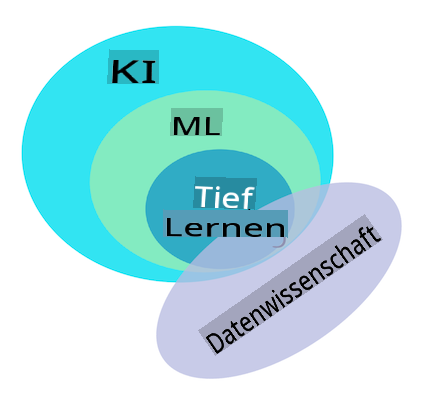

# Einführung in das maschinelle Lernen

## [Vorlesungsquiz](https://gray-sand-07a10f403.1.azurestaticapps.net/quiz/1/)

---

> 🎥 Klicken Sie auf das obige Bild für ein kurzes Video, das diese Lektion durchgeht.

Willkommen zu diesem Kurs über klassisches maschinelles Lernen für Anfänger! Egal, ob Sie völlig neu in diesem Thema sind oder ein erfahrener ML-Praktiker, der sein Wissen auffrischen möchte, wir freuen uns, dass Sie dabei sind! Wir möchten einen freundlichen Ausgangspunkt für Ihr ML-Studium schaffen und freuen uns über Ihr [Feedback](https://github.com/microsoft/ML-For-Beginners/discussions).

> 🎥 Klicken Sie auf das obige Bild für ein Video: MITs John Guttag stellt das maschinelle Lernen vor.

---
## Erste Schritte mit maschinellem Lernen

Bevor Sie mit diesem Lehrplan beginnen, müssen Sie Ihren Computer einrichten und bereit machen, Notebooks lokal auszuführen.

- **Konfigurieren Sie Ihre Maschine mit diesen Videos**. Verwenden Sie die folgenden Links, um zu lernen, [wie Sie Python](https://youtu.be/CXZYvNRIAKM) auf Ihrem System installieren und [einen Texteditor](https://youtu.be/EU8eayHWoZg) für die Entwicklung einrichten.
- **Lernen Sie Python**. Es wird auch empfohlen, ein grundlegendes Verständnis von [Python](https://docs.microsoft.com/learn/paths/python-language/?WT.mc_id=academic-77952-leestott) zu haben, einer Programmiersprache, die für Datenwissenschaftler nützlich ist und die wir in diesem Kurs verwenden.
- **Lernen Sie Node.js und JavaScript**. Wir verwenden auch JavaScript einige Male in diesem Kurs, wenn wir Webanwendungen erstellen. Daher müssen Sie [node](https://nodejs.org) und [npm](https://www.npmjs.com/) installiert haben sowie [Visual Studio Code](https://code.visualstudio.com/) für die Entwicklung in Python und JavaScript verfügbar haben.
- **Erstellen Sie ein GitHub-Konto**. Da Sie uns hier auf [GitHub](https://github.com) gefunden haben, haben Sie möglicherweise bereits ein Konto. Wenn nicht, erstellen Sie eines und forken Sie dann diesen Lehrplan, um ihn selbst zu verwenden. (Fühlen Sie sich auch frei, uns einen Stern zu geben 😊)
- **Erforschen Sie Scikit-learn**. Machen Sie sich mit [Scikit-learn](https://scikit-learn.org/stable/user_guide.html) vertraut, einer Sammlung von ML-Bibliotheken, auf die wir in diesen Lektionen verweisen.

---
## Was ist maschinelles Lernen?

Der Begriff 'maschinelles Lernen' ist einer der beliebtesten und häufig verwendeten Begriffe von heute. Es besteht eine nicht unerhebliche Wahrscheinlichkeit, dass Sie diesen Begriff zumindest einmal gehört haben, wenn Sie irgendeine Art von Vertrautheit mit Technologie haben, unabhängig davon, in welchem Bereich Sie tätig sind. Die Mechanik des maschinellen Lernens bleibt jedoch für die meisten Menschen ein Rätsel. Für einen Anfänger im maschinellen Lernen kann das Thema manchmal überwältigend erscheinen. Daher ist es wichtig zu verstehen, was maschinelles Lernen tatsächlich ist und es Schritt für Schritt durch praktische Beispiele zu lernen.

---
## Die Hype-Kurve

> Google Trends zeigt die aktuelle 'Hype-Kurve' des Begriffs 'maschinelles Lernen'

---
## Ein geheimnisvolles Universum

Wir leben in einem Universum voller faszinierender Geheimnisse. Große Wissenschaftler wie Stephen Hawking, Albert Einstein und viele andere haben ihr Leben der Suche nach bedeutungsvoller Information gewidmet, die die Geheimnisse der Welt um uns herum enthüllt. Dies ist die menschliche Bedingung des Lernens: Ein menschliches Kind lernt neue Dinge und entdeckt Jahr für Jahr die Struktur seiner Welt, während es zum Erwachsenen heranwächst.

---
## Das Gehirn des Kindes

Das Gehirn und die Sinne eines Kindes nehmen die Fakten ihrer Umgebung wahr und lernen allmählich die verborgenen Muster des Lebens, die dem Kind helfen, logische Regeln zu entwickeln, um erlernte Muster zu identifizieren. Der Lernprozess des menschlichen Gehirns macht den Menschen zu dem anspruchsvollsten Lebewesen dieser Welt. Kontinuierliches Lernen durch Entdecken verborgener Muster und anschließendes Innovieren auf diesen Mustern ermöglicht es uns, uns im Laufe unseres Lebens immer weiter zu verbessern. Diese Lernfähigkeit und die Fähigkeit zur Weiterentwicklung stehen im Zusammenhang mit einem Konzept namens [Gehirnplastizität](https://www.simplypsychology.org/brain-plasticity.html). Oberflächlich betrachtet können wir einige motivierende Ähnlichkeiten zwischen dem Lernprozess des menschlichen Gehirns und den Konzepten des maschinellen Lernens ziehen.

---
## Das menschliche Gehirn

Das [menschliche Gehirn](https://www.livescience.com/29365-human-brain.html) nimmt Dinge aus der realen Welt wahr, verarbeitet die wahrgenommenen Informationen, trifft rationale Entscheidungen und führt bestimmte Handlungen basierend auf den Umständen aus. Das ist es, was wir als intelligentes Verhalten bezeichnen. Wenn wir ein Abbild des intelligenten Verhaltensprozesses in eine Maschine programmieren, nennt man das künstliche Intelligenz (KI).

---
## Einige Begriffe

Obwohl die Begriffe verwechselt werden können, ist maschinelles Lernen (ML) ein wichtiger Teilbereich der künstlichen Intelligenz. **ML befasst sich mit der Verwendung spezialisierter Algorithmen, um bedeutungsvolle Informationen zu entdecken und verborgene Muster aus wahrgenommenen Daten zu finden, um den rationalen Entscheidungsprozess zu unterstützen**.

---
## KI, ML, Deep Learning

> Ein Diagramm, das die Beziehungen zwischen KI, ML, Deep Learning und Datenwissenschaft zeigt. Infografik von [Jen Looper](https://twitter.com/jenlooper), inspiriert von [dieser Grafik](https://softwareengineering.stackexchange.com/questions/366996/distinction-between-ai-ml-neural-networks-deep-learning-and-data-mining)

---
## Konzepte, die behandelt werden

In diesem Lehrplan werden wir nur die Kernkonzepte des maschinellen Lernens behandeln, die ein Anfänger kennen muss. Wir behandeln das, was wir als 'klassisches maschinelles Lernen' bezeichnen, hauptsächlich unter Verwendung von Scikit-learn, einer ausgezeichneten Bibliothek, die viele Studenten nutzen, um die Grundlagen zu lernen. Um breitere Konzepte der künstlichen Intelligenz oder des Deep Learning zu verstehen, ist ein starkes Fundament des maschinellen Lernens unerlässlich, und daher möchten wir es hier anbieten.

---
## In diesem Kurs lernen Sie:

- Kernkonzepte des maschinellen Lernens
- Die Geschichte des ML
- ML und Fairness
- Regressions-ML-Techniken
- Klassifikations-ML-Techniken
- Cluster-ML-Techniken
- Natürliche Sprachverarbeitung-ML-Techniken
- Zeitreihenprognose-ML-Techniken
- Verstärkendes Lernen
- Anwendungsbeispiele für ML in der realen Welt

---
## Was wir nicht behandeln werden

- Deep Learning
- Neuronale Netzwerke
- KI

Um ein besseres Lernerlebnis zu schaffen, werden wir die Komplexität von neuronalen Netzwerken, 'Deep Learning' - mehrschichtige Modellierung mit neuronalen Netzwerken - und KI vermeiden, die wir in einem anderen Lehrplan behandeln werden. Wir werden auch einen bevorstehenden Lehrplan zur Datenwissenschaft anbieten, um diesen Aspekt dieses größeren Feldes zu fokussieren.

---
## Warum maschinelles Lernen studieren?

Maschinelles Lernen wird aus einer Systemperspektive als die Schaffung automatisierter Systeme definiert, die verborgene Muster aus Daten lernen können, um intelligente Entscheidungen zu treffen.

Diese Motivation ist lose inspiriert von der Art und Weise, wie das menschliche Gehirn bestimmte Dinge basierend auf den Daten, die es aus der Außenwelt wahrnimmt, lernt.

✅ Denken Sie eine Minute darüber nach, warum ein Unternehmen versuchen würde, maschinelles Lernen zu nutzen, anstatt einen fest codierten, regelbasierten Motor zu erstellen.

---
## Anwendungen des maschinellen Lernens

Anwendungen des maschinellen Lernens sind mittlerweile fast überall und so allgegenwärtig wie die Daten, die durch unsere Gesellschaften fließen, generiert von unseren Smartphones, vernetzten Geräten und anderen Systemen. Angesichts des immensen Potenzials modernster Algorithmen des maschinellen Lernens haben Forscher deren Fähigkeit untersucht, multidimensionale und multidisziplinäre Probleme des realen Lebens mit großartigen positiven Ergebnissen zu lösen.

---
## Beispiele für angewandtes ML

**Sie können maschinelles Lernen auf viele Arten nutzen**:

- Um die Wahrscheinlichkeit einer Erkrankung aus der medizinischen Vorgeschichte oder Berichten eines Patienten vorherzusagen.
- Um Wetterdaten zu nutzen, um Wetterereignisse vorherzusagen.
- Um die Stimmung eines Textes zu verstehen.
- Um Fake News zu erkennen, um die Verbreitung von Propaganda zu stoppen.

Finanzen, Wirtschaft, Erdwissenschaften, Weltraumforschung, biomedizinische Ingenieurwissenschaften, kognitive Wissenschaften und sogar Bereiche der Geisteswissenschaften haben maschinelles Lernen angepasst, um die mühsamen, datenintensiven Probleme ihres Bereichs zu lösen.

---
## Fazit

Maschinelles Lernen automatisiert den Prozess der Musterentdeckung, indem es bedeutungsvolle Einblicke aus realen oder generierten Daten findet. Es hat sich als äußerst wertvoll in Geschäft, Gesundheit und Finanzanwendungen erwiesen, unter anderem.

In naher Zukunft wird es für Menschen aus jedem Bereich notwendig sein, die Grundlagen des maschinellen Lernens zu verstehen, aufgrund seiner weitverbreiteten Anwendung.

---
# 🚀 Herausforderung

Skizzieren Sie auf Papier oder mit einer Online-App wie [Excalidraw](https://excalidraw.com/) Ihr Verständnis der Unterschiede zwischen KI, ML, Deep Learning und Datenwissenschaft. Fügen Sie einige Ideen zu Problemen hinzu, die jede dieser Techniken gut lösen kann.

# [Nachlesequiz](https://gray-sand-07a10f403.1.azurestaticapps.net/quiz/2/)

---
# Überprüfung & Selbststudium

Um mehr darüber zu erfahren, wie Sie mit ML-Algorithmen in der Cloud arbeiten können, folgen Sie diesem [Lernpfad](https://docs.microsoft.com/learn/paths/create-no-code-predictive-models-azure-machine-learning/?WT.mc_id=academic-77952-leestott).

Nehmen Sie an einem [Lernpfad](https://docs.microsoft.com/learn/modules/introduction-to-machine-learning/?WT.mc_id=academic-77952-leestott) über die Grundlagen des ML teil.

---
# Aufgabe

[Starten Sie durch](assignment.md)

**Haftungsausschluss**:  
Dieses Dokument wurde mit maschinellen KI-Übersetzungsdiensten übersetzt. Obwohl wir uns um Genauigkeit bemühen, beachten Sie bitte, dass automatisierte Übersetzungen Fehler oder Ungenauigkeiten enthalten können. Das Originaldokument in seiner ursprünglichen Sprache sollte als die maßgebliche Quelle betrachtet werden. Für wichtige Informationen wird eine professionelle menschliche Übersetzung empfohlen. Wir übernehmen keine Haftung für Missverständnisse oder Fehlinterpretationen, die aus der Verwendung dieser Übersetzung entstehen.