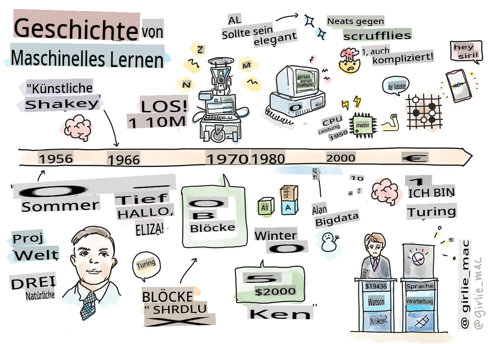
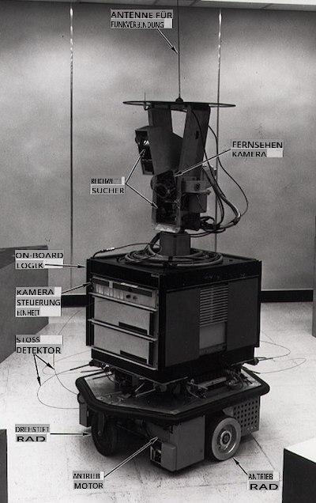
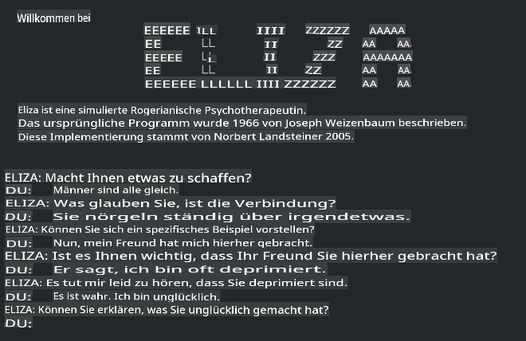

# Geschichte des maschinellen Lernens

> Sketchnote von [Tomomi Imura](https://www.twitter.com/girlie_mac)

## [Vorlesungsquiz](https://gray-sand-07a10f403.1.azurestaticapps.net/quiz/3/)

---

> 🎥 Klicken Sie auf das Bild oben für ein kurzes Video, das durch diese Lektion führt.

In dieser Lektion werden wir die wichtigsten Meilensteine in der Geschichte des maschinellen Lernens und der künstlichen Intelligenz durchgehen.

Die Geschichte der künstlichen Intelligenz (KI) als Fachgebiet ist eng mit der Geschichte des maschinellen Lernens verbunden, da die Algorithmen und rechnerischen Fortschritte, die dem ML zugrunde liegen, in die Entwicklung der KI eingeflossen sind. Es ist nützlich, sich daran zu erinnern, dass, während diese Bereiche als eigenständige Forschungsgebiete in den 1950er Jahren zu kristallisieren begannen, wichtige [algorithmische, statistische, mathematische, rechnerische und technische Entdeckungen](https://wikipedia.org/wiki/Timeline_of_machine_learning) dieser Ära vorangingen und sich überlappten. Tatsächlich haben Menschen sich seit [Hunderte von Jahren](https://wikipedia.org/wiki/History_of_artificial_intelligence) mit diesen Fragen beschäftigt: Dieser Artikel behandelt die historischen intellektuellen Grundlagen der Idee einer „denkenden Maschine“.

---
## Bemerkenswerte Entdeckungen

- 1763, 1812 [Bayessches Theorem](https://wikipedia.org/wiki/Bayes%27_theorem) und seine Vorgänger. Dieses Theorem und seine Anwendungen bilden die Grundlage für Inferenz und beschreiben die Wahrscheinlichkeit, dass ein Ereignis auf der Grundlage von Vorwissen eintritt.
- 1805 [Kleinste Quadrate Theorie](https://wikipedia.org/wiki/Least_squares) von dem französischen Mathematiker Adrien-Marie Legendre. Diese Theorie, die Sie in unserer Regressionseinheit kennenlernen werden, hilft bei der Datenanpassung.
- 1913 [Markov-Ketten](https://wikipedia.org/wiki/Markov_chain), benannt nach dem russischen Mathematiker Andrey Markov, werden verwendet, um eine Folge möglicher Ereignisse basierend auf einem vorherigen Zustand zu beschreiben.
- 1957 [Perzeptron](https://wikipedia.org/wiki/Perceptron) ist eine Art von linearem Klassifikator, der von dem amerikanischen Psychologen Frank Rosenblatt erfunden wurde und den Fortschritt im Deep Learning untermauert.

---

- 1967 [Nächster Nachbar](https://wikipedia.org/wiki/Nearest_neighbor) ist ein Algorithmus, der ursprünglich zur Routenplanung entwickelt wurde. Im Kontext des maschinellen Lernens wird er verwendet, um Muster zu erkennen.
- 1970 [Backpropagation](https://wikipedia.org/wiki/Backpropagation) wird verwendet, um [Feedforward-Neuronale Netzwerke](https://wikipedia.org/wiki/Feedforward_neural_network) zu trainieren.
- 1982 [Rekurrente Neuronale Netzwerke](https://wikipedia.org/wiki/Recurrent_neural_network) sind künstliche neuronale Netzwerke, die von Feedforward-Neuronalen Netzwerken abgeleitet sind und zeitliche Graphen erstellen.

✅ Machen Sie ein wenig Forschung. Welche anderen Daten stechen als entscheidend in der Geschichte des ML und der KI hervor?

---
## 1950: Maschinen, die denken

Alan Turing, eine wirklich bemerkenswerte Person, die 2019 [vom Publikum gewählt wurde](https://wikipedia.org/wiki/Icons:_The_Greatest_Person_of_the_20th_Century) als der größte Wissenschaftler des 20. Jahrhunderts, wird zugeschrieben, dass er dazu beigetragen hat, das Fundament für das Konzept einer „denkenden Maschine“ zu legen. Er hatte es mit Skeptikern und seinem eigenen Bedürfnis nach empirischen Beweisen für dieses Konzept zu tun, indem er teilweise den [Turing-Test](https://www.bbc.com/news/technology-18475646) entwickelte, den Sie in unseren NLP-Lektionen erkunden werden.

---
## 1956: Dartmouth-Sommerforschungsprojekt

„Das Dartmouth-Sommerforschungsprojekt zur künstlichen Intelligenz war ein wegweisendes Ereignis für die künstliche Intelligenz als Fachgebiet“, und hier wurde der Begriff „künstliche Intelligenz“ geprägt ([Quelle](https://250.dartmouth.edu/highlights/artificial-intelligence-ai-coined-dartmouth)).

> Jeder Aspekt des Lernens oder irgendein anderes Merkmal von Intelligenz kann prinzipiell so präzise beschrieben werden, dass eine Maschine geschaffen werden kann, die es simuliert.

---

Der leitende Forscher, der Mathematikprofessor John McCarthy, hoffte, „auf der Grundlage der Vermutung fortzufahren, dass jeder Aspekt des Lernens oder irgendein anderes Merkmal von Intelligenz prinzipiell so präzise beschrieben werden kann, dass eine Maschine geschaffen werden kann, die es simuliert.“ Zu den Teilnehmern gehörte ein weiterer Lichtblick auf diesem Gebiet, Marvin Minsky.

Der Workshop wird zugeschrieben, mehrere Diskussionen angestoßen und gefördert zu haben, einschließlich „des Aufstiegs symbolischer Methoden, von Systemen, die sich auf begrenzte Bereiche konzentrieren (frühe Expertensysteme) und von deduktiven Systemen im Vergleich zu induktiven Systemen.“ ([Quelle](https://wikipedia.org/wiki/Dartmouth_workshop)).

---
## 1956 - 1974: „Die goldenen Jahre“

Von den 1950er Jahren bis Mitte der 70er Jahre war die Optimismus hoch, dass KI viele Probleme lösen könnte. 1967 erklärte Marvin Minsky selbstbewusst, dass „innerhalb einer Generation ... das Problem, 'künstliche Intelligenz' zu schaffen, wesentlich gelöst sein wird.“ (Minsky, Marvin (1967), Computation: Finite and Infinite Machines, Englewood Cliffs, N.J.: Prentice-Hall)

Die Forschung zur natürlichen Sprachverarbeitung blühte auf, die Suche wurde verfeinert und leistungsfähiger gemacht, und das Konzept der „Mikrowelten“ wurde geschaffen, in denen einfache Aufgaben mit einfachen sprachlichen Anweisungen abgeschlossen wurden.

---

Die Forschung wurde gut von Regierungsbehörden finanziert, es wurden Fortschritte in der Berechnung und den Algorithmen erzielt, und Prototypen intelligenter Maschinen wurden gebaut. Einige dieser Maschinen sind:

* [Shakey der Roboter](https://wikipedia.org/wiki/Shakey_the_robot), der sich bewegen und entscheiden konnte, wie er Aufgaben „intelligent“ ausführen kann.

    
    > Shakey im Jahr 1972

---

* Eliza, ein früher „Chatterbot“, konnte mit Menschen sprechen und als primitiver „Therapeut“ fungieren. Sie werden mehr über Eliza in den NLP-Lektionen erfahren.

    
    > Eine Version von Eliza, einem Chatbot

---

* „Blocks World“ war ein Beispiel für eine Mikrowelt, in der Blöcke gestapelt und sortiert werden konnten, und Experimente im Unterrichten von Maschinen, Entscheidungen zu treffen, getestet werden konnten. Fortschritte, die mit Bibliotheken wie [SHRDLU](https://wikipedia.org/wiki/SHRDLU) erzielt wurden, trugen dazu bei, die Sprachverarbeitung voranzutreiben.

    

    > 🎥 Klicken Sie auf das Bild oben für ein Video: Blocks World mit SHRDLU

---
## 1974 - 1980: „KI-Winter“

Mitte der 1970er Jahre wurde offensichtlich, dass die Komplexität, „intelligente Maschinen“ zu schaffen, unterschätzt worden war und dass ihr Versprechen, angesichts der verfügbaren Rechenleistung, übertrieben war. Die Finanzierung trocknete aus und das Vertrauen in das Fachgebiet nahm ab. Einige Probleme, die das Vertrauen beeinträchtigten, waren:
---
- **Einschränkungen**. Die Rechenleistung war zu begrenzt.
- **Kombinatorische Explosion**. Die Anzahl der Parameter, die trainiert werden mussten, wuchs exponentiell, während immer mehr von Computern verlangt wurde, ohne dass eine parallele Entwicklung der Rechenleistung und -fähigkeit stattfand.
- **Mangel an Daten**. Es gab einen Mangel an Daten, der den Prozess des Testens, Entwickelns und Verfeinerns von Algorithmen behinderte.
- **Stellen wir die richtigen Fragen?**. Die Fragen, die gestellt wurden, begannen selbst in Frage gestellt zu werden. Forscher sahen sich Kritik an ihren Ansätzen gegenüber:
  - Turing-Tests wurden durch Ideen wie die „chinesische Zimmer Theorie“ in Frage gestellt, die postulierte, dass „die Programmierung eines digitalen Computers den Anschein erwecken kann, Sprache zu verstehen, aber kein echtes Verständnis produzieren kann.“ ([Quelle](https://plato.stanford.edu/entries/chinese-room/))
  - Die Ethik der Einführung künstlicher Intelligenzen wie dem „Therapeuten“ ELIZA in die Gesellschaft wurde in Frage gestellt.

---

Gleichzeitig begannen verschiedene Schulen des Denkens in der KI zu entstehen. Eine Dichotomie wurde zwischen ["schlampigen" vs. "ordentlichen KI"](https://wikipedia.org/wiki/Neats_and_scruffies) Praktiken etabliert. _Schlampige_ Labore passten Programme stundenlang an, bis sie die gewünschten Ergebnisse erzielten. _Ordentliche_ Labore „konzentrierten sich auf Logik und formale Problemlösung“. ELIZA und SHRDLU waren bekannte _schlampige_ Systeme. In den 1980er Jahren, als die Nachfrage entstand, ML-Systeme reproduzierbar zu machen, rückte der _ordentliche_ Ansatz allmählich in den Vordergrund, da seine Ergebnisse besser erklärbar sind.

---
## 1980er Jahre Expertensysteme

Als das Fachgebiet wuchs, wurde sein Nutzen für Unternehmen klarer, und in den 1980er Jahren nahm auch die Verbreitung von „Expertensystemen“ zu. „Expertensysteme waren unter den ersten wirklich erfolgreichen Formen von Software für künstliche Intelligenz (KI).“ ([Quelle](https://wikipedia.org/wiki/Expert_system)).

Diese Art von System ist tatsächlich _hybrid_, besteht teilweise aus einer Regel-Engine, die Geschäftsanforderungen definiert, und einer Inferenz-Engine, die das Regelwerk nutzt, um neue Fakten abzuleiten.

In dieser Ära wurde auch der neuralen Netzwerke zunehmend Aufmerksamkeit geschenkt.

---
## 1987 - 1993: KI „Abkühlung“

Die Verbreitung spezialisierter Hardware für Expertensysteme hatte den unglücklichen Effekt, dass sie zu spezialisiert wurde. Der Aufstieg der Personalcomputer konkurrierte auch mit diesen großen, spezialisierten, zentralisierten Systemen. Die Demokratisierung des Rechnens hatte begonnen und ebnete letztendlich den Weg für die moderne Explosion von Big Data.

---
## 1993 - 2011

Diese Epoche sah eine neue Ära für ML und KI, um einige der Probleme zu lösen, die früher durch den Mangel an Daten und Rechenleistung verursacht worden waren. Die Menge an Daten begann schnell zuzunehmen und wurde breiter verfügbar, zum Guten und zum Schlechten, insbesondere mit dem Aufkommen des Smartphones um 2007. Die Rechenleistung expandierte exponentiell, und die Algorithmen entwickelten sich weiter. Das Fachgebiet begann an Reife zu gewinnen, als die ungebundenen Tage der Vergangenheit in eine wahre Disziplin kristallisierten.

---
## Jetzt

Heute berührt maschinelles Lernen und KI fast jeden Teil unseres Lebens. Diese Ära erfordert ein sorgfältiges Verständnis der Risiken und potenziellen Auswirkungen dieser Algorithmen auf das menschliche Leben. Wie Microsofts Brad Smith erklärt hat: „Informationstechnologie wirft Fragen auf, die den Kern grundlegender Menschenrechtsgarantien wie Datenschutz und Meinungsfreiheit betreffen. Diese Fragen erhöhen die Verantwortung für Technologieunternehmen, die diese Produkte schaffen. Unserer Meinung nach erfordern sie auch durchdachte staatliche Regulierung und die Entwicklung von Normen für akzeptable Anwendungen“ ([Quelle](https://www.technologyreview.com/2019/12/18/102365/the-future-of-ais-impact-on-society/)).

---

Es bleibt abzuwarten, was die Zukunft bringt, aber es ist wichtig, diese Computersysteme und die Software und Algorithmen, die sie ausführen, zu verstehen. Wir hoffen, dass dieses Curriculum Ihnen helfen wird, ein besseres Verständnis zu gewinnen, damit Sie selbst entscheiden können.

> 🎥 Klicken Sie auf das Bild oben für ein Video: Yann LeCun spricht in dieser Vorlesung über die Geschichte des Deep Learning

---
## 🚀Herausforderung

Tauchen Sie in einen dieser historischen Momente ein und erfahren Sie mehr über die Menschen dahinter. Es gibt faszinierende Charaktere, und keine wissenschaftliche Entdeckung wurde jemals in einem kulturellen Vakuum geschaffen. Was entdecken Sie?

## [Nachlesungsquiz](https://gray-sand-07a10f403.1.azurestaticapps.net/quiz/4/)

---
## Überprüfung & Selbststudium

Hier sind einige Artikel, die Sie ansehen und anhören sollten:

[Dieser Podcast, in dem Amy Boyd über die Entwicklung der KI spricht](http://runasradio.com/Shows/Show/739)

---

## Aufgabe

[Erstelle eine Zeitleiste](assignment.md)

**Haftungsausschluss**:  
Dieses Dokument wurde mit maschinellen KI-Übersetzungsdiensten übersetzt. Obwohl wir uns um Genauigkeit bemühen, beachten Sie bitte, dass automatisierte Übersetzungen Fehler oder Ungenauigkeiten enthalten können. Das Originaldokument in seiner ursprünglichen Sprache sollte als autoritative Quelle betrachtet werden. Für wichtige Informationen wird eine professionelle menschliche Übersetzung empfohlen. Wir übernehmen keine Haftung für Missverständnisse oder Fehlinterpretationen, die aus der Verwendung dieser Übersetzung entstehen.