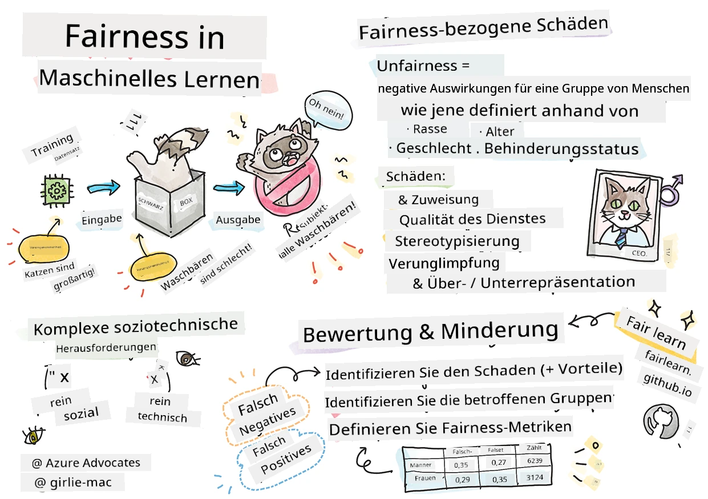

# Aufbau von Machine Learning-Lösungen mit verantwortungsvoller KI
 

> Sketchnote von [Tomomi Imura](https://www.twitter.com/girlie_mac)

## [Vortrag Quiz](https://ff-quizzes.netlify.app/en/ml/)
 
## Einführung

In diesem Lehrplan werden Sie entdecken, wie Machine Learning unser tägliches Leben beeinflussen kann und bereits beeinflusst. Schon jetzt sind Systeme und Modelle in alltäglichen Entscheidungsaufgaben involviert, wie z. B. Gesundheitsdiagnosen, Kreditgenehmigungen oder Betrugserkennung. Daher ist es wichtig, dass diese Modelle gut funktionieren, um vertrauenswürdige Ergebnisse zu liefern. Genau wie jede Softwareanwendung werden KI-Systeme Erwartungen nicht erfüllen oder unerwünschte Ergebnisse liefern. Deshalb ist es essenziell, das Verhalten eines KI-Modells verstehen und erklären zu können.

Stellen Sie sich vor, was passieren kann, wenn die Daten, die Sie zum Erstellen dieser Modelle verwenden, bestimmte demografische Merkmale wie Rasse, Geschlecht, politische Ansicht, Religion nicht enthalten oder diese demografischen Merkmale unverhältnismäßig repräsentieren. Was passiert, wenn die Ausgabe des Modells interpretiert wird, um eine demografische Gruppe zu bevorzugen? Was sind die Folgen für die Anwendung? Außerdem, was geschieht, wenn das Modell ein nachteiliges Ergebnis liefert und Menschen schadet? Wer ist verantwortlich für das Verhalten des KI-Systems? Diese und weitere Fragen werden wir in diesem Lehrplan erkunden.

In dieser Lektion werden Sie:

- Ihr Bewusstsein für die Bedeutung von Fairness im Machine Learning und mit Fairness zusammenhängende Schäden erhöhen.
- Sich mit der Praxis der Untersuchung von Ausreißern und ungewöhnlichen Szenarien zur Sicherstellung von Zuverlässigkeit und Sicherheit vertraut machen.
- Ein Verständnis dafür entwickeln, wie wichtig es ist, alle zu befähigen, indem inklusive Systeme entworfen werden.
- Erkunden, wie wichtig es ist, die Privatsphäre und Sicherheit von Daten und Personen zu schützen.
- Die Bedeutung eines transparenten Ansatzes zur Erklärung des Verhaltens von KI-Modellen erkennen.
- Sensibilisiert sein, wie wichtig Verantwortlichkeit ist, um Vertrauen in KI-Systeme aufzubauen.

## Voraussetzung

Als Voraussetzung absolvieren Sie bitte den Lernpfad "Verantwortungsvolle KI Prinzipien" und schauen sich das untenstehende Video zum Thema an:

Erfahren Sie mehr über verantwortungsvolle KI, indem Sie diesem [Lernpfad](https://docs.microsoft.com/learn/modules/responsible-ai-principles/?WT.mc_id=academic-77952-leestott) folgen.

> 🎥 Klicken Sie auf das Bild oben für ein Video: Microsofts Ansatz für verantwortungsvolle KI

## Fairness

KI-Systeme sollten alle Menschen fair behandeln und vermeiden, ähnliche Personengruppen unterschiedlich zu beeinflussen. Beispielsweise sollten KI-Systeme bei der Beratung zu medizinischer Behandlung, Kreditanträgen oder Beschäftigung dieselben Empfehlungen für alle mit ähnlichen Symptomen, finanziellen Umständen oder beruflichen Qualifikationen aussprechen. Jeder von uns trägt als Mensch ererbte Vorurteile mit sich, die unsere Entscheidungen und Handlungen beeinflussen. Diese Vorurteile können in den Daten sichtbar sein, die wir zum Trainieren von KI-Systemen verwenden. Eine solche Verzerrung kann manchmal unbeabsichtigt geschehen. Es ist oft schwierig, bewusst zu erkennen, wann man Vorurteile in Daten einführt.

**„Unfairness“** umfasst negative Auswirkungen oder „Schäden“ für eine Gruppe von Menschen, wie jene definiert durch Rasse, Geschlecht, Alter oder Behinderungsstatus. Die wichtigsten fairnessbezogenen Schäden können klassifiziert werden als:

- **Zuteilung**, wenn beispielsweise ein Geschlecht oder eine Ethnie gegenüber einer anderen bevorzugt wird.
- **Dienstleistungsqualität**. Wenn Sie die Daten für ein spezifisches Szenario trainieren, die Realität aber viel komplexer ist, führt das zu einer schlecht funktionierenden Dienstleistung. Zum Beispiel konnte ein Handseifenspender scheinbar keine Menschen mit dunkler Haut erkennen. [Referenz](https://gizmodo.com/why-cant-this-soap-dispenser-identify-dark-skin-1797931773)
- **Herabwürdigung**. Etwas oder jemanden unfair zu kritisieren und zu etikettieren. Zum Beispiel hat eine Bilderkennungstechnologie berüchtigterweise Bilder von dunkelhäutigen Menschen als Gorillas falsch etikettiert.
- **Über- oder Unterrepräsentation**. Die Vorstellung ist, dass eine bestimmte Gruppe in einem bestimmten Beruf nicht vertreten ist, und jeder Dienst oder Funktion, der dies weiterhin fördert, trägt zu Schäden bei.
- **Stereotypisierung**. Eine bestimmte Gruppe mit vorab zugewiesenen Eigenschaften verbinden. Zum Beispiel kann ein maschinelles Übersetzungssystem zwischen Englisch und Türkisch Ungenauigkeiten haben, die auf stereotype Assoziationen mit dem Geschlecht bei einzelnen Wörtern basieren.

> Übersetzung ins Türkische

> Rückübersetzung ins Englische

Beim Entwerfen und Testen von KI-Systemen müssen wir sicherstellen, dass KI fair ist und nicht so programmiert ist, voreingenommene oder diskriminierende Entscheidungen zu treffen, was Menschen auch verboten ist. Sicherstellung von Fairness in KI und Machine Learning bleibt eine komplexe soziotechnische Herausforderung.

### Zuverlässigkeit und Sicherheit

Um Vertrauen aufzubauen, müssen KI-Systeme zuverlässig, sicher und konsistent unter normalen und unerwarteten Bedingungen sein. Es ist wichtig zu wissen, wie sich KI-Systeme in verschiedenen Situationen verhalten, besonders wenn sie Ausreißer darstellen. Beim Erstellen von KI-Lösungen muss ein großer Fokus darauf liegen, wie eine breite Palette von Umständen behandelt wird, denen die KI-Lösung begegnen könnte. Zum Beispiel muss ein selbstfahrendes Auto die Sicherheit der Menschen höchste Priorität einräumen. Daher muss die KI, die das Auto antreibt, alle möglichen Szenarien berücksichtigen, wie Nacht, Gewitter oder Schneestürme, Kinder, die über die Straße rennen, Haustiere, Straßenbau usw. Wie gut ein KI-System eine breite Palette an Bedingungen zuverlässig und sicher bewältigen kann, spiegelt das Maß an Antizipation wider, das der Datenwissenschaftler oder KI-Entwickler bei Design oder Test des Systems berücksichtigt hat.

> [🎥 Klicken Sie hier für ein Video: ](https://www.microsoft.com/videoplayer/embed/RE4vvIl)

### Inklusivität

KI-Systeme sollten so gestaltet sein, dass sie alle einbeziehen und befähigen. Beim Entwerfen und Implementieren von KI-Systemen identifizieren und adressieren Datenwissenschaftler und KI-Entwickler potenzielle Barrieren im System, die unbeabsichtigt Menschen ausschließen könnten. Beispielsweise gibt es rund 1 Milliarde Menschen mit Behinderungen weltweit. Mit der Weiterentwicklung von KI können sie im Alltag leichter auf eine breite Palette von Informationen und Möglichkeiten zugreifen. Durch das Beseitigen von Barrieren entstehen Chancen zur Innovation und Entwicklung von KI-Produkten mit besseren Erfahrungen, die allen zugutekommen.

> [🎥 Klicken Sie hier für ein Video: Inklusivität in KI](https://www.microsoft.com/videoplayer/embed/RE4vl9v)

### Sicherheit und Datenschutz

KI-Systeme sollten sicher sein und die Privatsphäre der Menschen respektieren. Menschen vertrauen Systemen weniger, die ihre Privatsphäre, Informationen oder Leben gefährden. Beim Trainieren von Machine Learning-Modellen verlassen wir uns auf Daten, um die besten Ergebnisse zu erzielen. Dabei müssen Ursprung und Integrität der Daten berücksichtigt werden. Wurden die Daten beispielsweise vom Nutzer bereitgestellt oder sind öffentlich zugänglich? Weiterhin ist es entscheidend, KI-Systeme zu entwickeln, die vertrauliche Informationen schützen und Angriffen widerstehen können. Da KI immer verbreiteter wird, steigt die Bedeutung und Komplexität des Schutzes der Privatsphäre und wichtiger persönlicher sowie geschäftlicher Informationen. Datenschutz- und Datensicherheitsfragen erfordern besonders hohe Aufmerksamkeit bei KI, da der Zugriff auf Daten für KI-Systeme essentiell ist, um genaue und informierte Vorhersagen und Entscheidungen über Personen zu treffen.

> [🎥 Klicken Sie hier für ein Video: Sicherheit in KI](https://www.microsoft.com/videoplayer/embed/RE4voJF)

- Als Branche haben wir bedeutende Fortschritte im Bereich Datenschutz & Sicherheit gemacht, die maßgeblich durch Vorschriften wie die DSGVO (Datenschutz-Grundverordnung) unterstützt wurden.
- Mit KI-Systemen müssen wir dennoch die Spannung zwischen dem Bedarf an mehr persönlichen Daten zur Personalisierung und Effektivität der Systeme – und dem Datenschutz anerkennen.
- Ähnlich wie beim Aufkommen vernetzter Computer mit dem Internet erleben wir auch einen starken Anstieg der Sicherheitsprobleme im Zusammenhang mit KI.
- Gleichzeitig sehen wir, dass KI zur Verbesserung der Sicherheit eingesetzt wird. Zum Beispiel werden die meisten modernen Antiviren-Scanner heute von KI-Heuristiken angetrieben.
- Wir müssen sicherstellen, dass unsere Data Science-Prozesse harmonisch mit den neuesten Datenschutz- und Sicherheitspraktiken verschmelzen.

### Transparenz
KI-Systeme sollten verständlich sein. Ein wesentlicher Teil von Transparenz ist, das Verhalten von KI-Systemen und deren Komponenten zu erklären. Um KI-Systeme besser zu verstehen, müssen Beteiligte verstehen, wie und warum sie funktionieren, damit sie potenzielle Leistungsprobleme, Sicherheits- und Datenschutzbedenken, Vorurteile, ausschließende Praktiken oder unbeabsichtigte Ergebnisse identifizieren können. Wir sind zudem der Ansicht, dass Nutzer von KI-Systemen ehrlich und offen darüber sein sollten, wann, warum und wie sie diese einsetzen. Ebenso über die Beschränkungen der Systeme, die sie nutzen. Beispielsweise ist es wichtig, bei der Verwendung eines KI-Systems durch eine Bank zur Unterstützung von Verbraucherkreditentscheidungen die Ergebnisse zu überprüfen und zu verstehen, welche Daten die Empfehlungen des Systems beeinflussen. Regierungen beginnen, KI branchenübergreifend zu regulieren, weshalb Datenwissenschaftler und Organisationen erklären müssen, ob ein KI-System regulatorische Anforderungen erfüllt, besonders bei einem unerwünschten Ergebnis.

> [🎥 Klicken Sie hier für ein Video: Transparenz in KI](https://www.microsoft.com/videoplayer/embed/RE4voJF)

- Da KI-Systeme so komplex sind, ist es schwer zu verstehen, wie sie funktionieren und die Ergebnisse zu interpretieren.
- Dieses fehlende Verständnis beeinflusst die Art, wie diese Systeme verwaltet, eingesetzt und dokumentiert werden.
- Dieses fehlende Verständnis wirkt sich vor allem auf die Entscheidungen aus, die auf Basis der Ergebnisse dieser Systeme getroffen werden.

### Verantwortlichkeit
 
Die Personen, die KI-Systeme entwerfen und einsetzen, müssen für deren Betrieb verantwortlich sein. Die Notwendigkeit von Verantwortlichkeit ist besonders entscheidend bei sensiblen Technologien wie der Gesichtserkennung. Kürzlich ist die Nachfrage nach Gesichtserkennungstechnologie gestiegen, insbesondere seitens Strafverfolgungsbehörden, die Potential zum Beispiel bei der Suche nach vermissten Kindern sehen. Diese Technologien könnten jedoch von Regierungen genutzt werden, um die Grundfreiheiten ihrer Bürger zu gefährden, etwa durch ermöglichen einer kontinuierlichen Überwachung bestimmter Personen. Daher müssen Datenwissenschaftler und Organisationen verantwortungsbewusst sein, wie ihr KI-System Einzelpersonen oder die Gesellschaft beeinflusst.

> 🎥 Klicken Sie auf das Bild oben für ein Video: Warnungen vor Massenüberwachung durch Gesichtserkennung

Letztendlich ist eine der größten Fragen für unsere Generation, als erste Generation, die KI in die Gesellschaft bringt, wie sichergestellt wird, dass Computer gegenüber Menschen verantwortlich bleiben und wie sichergestellt wird, dass die Menschen, die Computer entwerfen, gegenüber allen anderen verantwortlich bleiben.

## Wirkungseinschätzung

Vor dem Trainieren eines Machine Learning-Modells ist es wichtig, eine Wirkungseinschätzung vorzunehmen, um den Zweck des KI-Systems zu verstehen; wie es verwendet werden soll; wo es eingesetzt wird; und wer mit dem System interagieren wird. Diese Informationen sind hilfreich für Gutachter oder Tester, die das System bewerten, um zu wissen, welche Faktoren bei der Identifikation potenzieller Risiken und erwarteter Konsequenzen beachtet werden müssen.

Die folgenden Bereiche stehen im Fokus bei der Durchführung einer Wirkungseinschätzung:

* **Negative Auswirkungen auf Individuen**. Das Bewusstsein für jegliche Einschränkungen oder Anforderungen, ununterstützte Nutzung oder bekannte Einschränkungen, die die Leistung des Systems behindern, ist entscheidend, um sicherzustellen, dass das System nicht auf eine Weise verwendet wird, die Menschen schadet.
* **Datenanforderungen**. Das Verständnis, wie und wo das System Daten verwendet, ermöglicht den Gutachtern, eventuelle Datenanforderungen wie z. B. DSGVO- oder HIPAA-Datenschutzregelungen zu prüfen. Außerdem wird bewertet, ob die Datenquelle oder -menge ausreichend zum Training ist.
* **Zusammenfassung der Auswirkungen**. Eine Liste potenzieller Schäden, die aus der Nutzung des Systems entstehen könnten, sammeln. Während des gesamten ML-Lebenszyklus überprüfen, ob die identifizierten Probleme gemindert oder adressiert werden.
* **Anwendbare Ziele** für jedes der sechs Kernprinzipien. Prüfen, ob die Ziele der Prinzipien erfüllt sind und ob Lücken bestehen.

## Debugging mit verantwortungsvoller KI

Ähnlich wie beim Debuggen einer Softwareanwendung ist das Debuggen eines KI-Systems ein notwendiger Prozess, um Probleme im System zu identifizieren und zu beheben. Es gibt viele Faktoren, die beeinflussen können, dass ein Modell nicht erwartungsgemäß oder verantwortungsvoll arbeitet. Die meisten traditionellen Leistungsmetriken eines Modells sind quantitative Aggregationen der Modellleistung, welche nicht ausreichen, um zu analysieren, wie ein Modell die Prinzipien verantwortungsvoller KI verletzt. Außerdem ist ein Machine Learning-Modell eine Blackbox, was es schwierig macht zu verstehen, was seine Ergebnisse beeinflusst oder eine Erklärung zu liefern, wenn ein Fehler auftritt. Später in diesem Kurs lernen wir, wie man das Responsible AI Dashboard verwendet, um KI-Systeme zu debuggen. Das Dashboard bietet ein ganzheitliches Werkzeug für Datenwissenschaftler und KI-Entwickler, um:

* **Fehleranalyse**. Um die Fehlerverteilung des Modells zu identifizieren, die Fairness oder Zuverlässigkeit des Systems beeinflussen kann.
* **Modellübersicht**. Um zu entdecken, wo es Leistungsunterschiede des Modells über Datenkohorten hinweg gibt.
* **Datenanalyse**. Um die Datenverteilung zu verstehen und mögliche Vorurteile in den Daten zu erkennen, die zu Problemen bei Fairness, Inklusivität und Zuverlässigkeit führen können.
* **Modellinterpretierbarkeit**. Um zu verstehen, was die Vorhersagen des Modells beeinflusst. Dies hilft, das Verhalten des Modells zu erklären, was wichtig für Transparenz und Verantwortlichkeit ist.

## 🚀 Herausforderung
 
Um zu verhindern, dass Schäden überhaupt entstehen, sollten wir:

- eine Vielfalt an Hintergründen und Perspektiven unter den Menschen, die an Systemen arbeiten, haben
- in Datensätze investieren, die die Vielfalt unserer Gesellschaft widerspiegeln
- bessere Methoden über den gesamten Machine Learning-Lebenszyklus entwickeln, um verantwortungsvolle KI-Verstöße zu erkennen und zu korrigieren, wenn sie auftreten

Denken Sie an reale Szenarien, in denen die Unzuverlässigkeit eines Modells beim Erstellen und Verwenden des Modells offensichtlich wird. Was sollten wir sonst noch in Betracht ziehen?

## [Nachvortrags-Quiz](https://ff-quizzes.netlify.app/en/ml/)

## Rückblick & Selbststudium
 

In dieser Lektion haben Sie einige Grundlagen der Konzepte von Fairness und Unfairness im maschinellen Lernen kennengelernt.  
 
Sehen Sie sich diesen Workshop an, um tiefer in die Themen einzutauchen: 

- Auf der Suche nach verantwortungsvoller KI: Prinzipien in die Praxis umsetzen von Besmira Nushi, Mehrnoosh Sameki und Amit Sharma

> 🎥 Klicken Sie auf das obige Bild für ein Video: RAI Toolbox: Ein Open-Source-Framework für den Aufbau verantwortungsvoller KI von Besmira Nushi, Mehrnoosh Sameki und Amit Sharma

Lesen Sie auch: 

- Microsofts RAI-Ressourcenzentrum: [Responsible AI Resources – Microsoft AI](https://www.microsoft.com/ai/responsible-ai-resources?activetab=pivot1%3aprimaryr4) 

- Microsofts FATE-Forschungsgruppe: [FATE: Fairness, Accountability, Transparency, and Ethics in AI - Microsoft Research](https://www.microsoft.com/research/theme/fate/) 

RAI Toolbox: 

- [Responsible AI Toolbox GitHub Repository](https://github.com/microsoft/responsible-ai-toolbox)

Lesen Sie über die Tools von Azure Machine Learning zur Gewährleistung von Fairness:

- [Azure Machine Learning](https://docs.microsoft.com/azure/machine-learning/concept-fairness-ml?WT.mc_id=academic-77952-leestott) 

## Aufgabe

[RAI Toolbox erkunden](assignment.md)

---

<!-- CO-OP TRANSLATOR DISCLAIMER START -->
**Haftungsausschluss**:
Dieses Dokument wurde mit dem KI-Übersetzungsdienst [Co-op Translator](https://github.com/Azure/co-op-translator) übersetzt. Obwohl wir uns um Genauigkeit bemühen, beachten Sie bitte, dass automatisierte Übersetzungen Fehler oder Ungenauigkeiten enthalten können. Das Originaldokument in seiner Ursprungssprache gilt als maßgebliche Quelle. Bei kritischen Informationen wird eine professionelle menschliche Übersetzung empfohlen. Wir übernehmen keine Haftung für Missverständnisse oder Fehlinterpretationen, die aus der Verwendung dieser Übersetzung entstehen.
<!-- CO-OP TRANSLATOR DISCLAIMER END -->