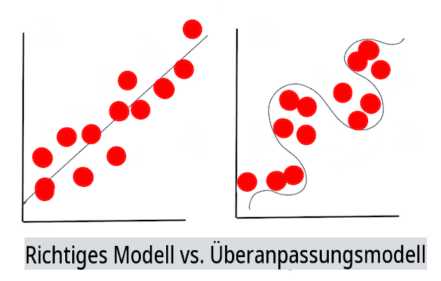

# Techniken des maschinellen Lernens

Der Prozess des Aufbaus, der Nutzung und der Wartung von Modellen des maschinellen Lernens sowie der Daten, die sie verwenden, ist ein sehr anderer Prozess als viele andere Entwicklungsabläufe. In dieser Lektion werden wir den Prozess entmystifizieren und die wichtigsten Techniken skizzieren, die Sie kennen sollten. Sie werden:

- Die zugrunde liegenden Prozesse des maschinellen Lernens auf einem hohen Niveau verstehen.
- Grundlegende Konzepte wie 'Modelle', 'Vorhersagen' und 'Trainingsdaten' erkunden.

## [Vorlesungsquiz](https://gray-sand-07a10f403.1.azurestaticapps.net/quiz/7/)

> 🎥 Klicken Sie auf das Bild oben für ein kurzes Video, das diese Lektion durchläuft.

## Einführung

Auf einem hohen Niveau besteht die Kunst der Erstellung von Prozessen des maschinellen Lernens (ML) aus mehreren Schritten:

1. **Frage entscheiden**. Die meisten ML-Prozesse beginnen mit einer Frage, die nicht durch ein einfaches bedingtes Programm oder eine regelbasierte Engine beantwortet werden kann. Diese Fragen drehen sich oft um Vorhersagen basierend auf einer Sammlung von Daten.
2. **Daten sammeln und vorbereiten**. Um Ihre Frage beantworten zu können, benötigen Sie Daten. Die Qualität und manchmal die Quantität Ihrer Daten bestimmen, wie gut Sie Ihre ursprüngliche Frage beantworten können. Die Visualisierung von Daten ist ein wichtiger Aspekt dieser Phase. Diese Phase umfasst auch das Aufteilen der Daten in eine Trainings- und Testgruppe, um ein Modell zu erstellen.
3. **Trainingsmethode wählen**. Je nach Ihrer Frage und der Art Ihrer Daten müssen Sie entscheiden, wie Sie ein Modell trainieren möchten, um Ihre Daten bestmöglich widerzuspiegeln und genaue Vorhersagen zu treffen. Dies ist der Teil Ihres ML-Prozesses, der spezifisches Fachwissen und oft eine beträchtliche Menge an Experimentieren erfordert.
4. **Modell trainieren**. Mit Ihren Trainingsdaten verwenden Sie verschiedene Algorithmen, um ein Modell zu trainieren, das Muster in den Daten erkennt. Das Modell kann interne Gewichtungen nutzen, die angepasst werden können, um bestimmten Teilen der Daten mehr Gewicht zu geben und so ein besseres Modell zu erstellen.
5. **Modell bewerten**. Sie verwenden zuvor nicht gesehene Daten (Ihre Testdaten) aus Ihrem gesammelten Set, um zu sehen, wie das Modell funktioniert.
6. **Parameteroptimierung**. Basierend auf der Leistung Ihres Modells können Sie den Prozess mit unterschiedlichen Parametern oder Variablen wiederholen, die das Verhalten der verwendeten Algorithmen steuern.
7. **Vorhersagen**. Verwenden Sie neue Eingaben, um die Genauigkeit Ihres Modells zu testen.

## Welche Frage stellen

Computer sind besonders geschickt darin, versteckte Muster in Daten zu entdecken. Diese Fähigkeit ist für Forscher, die Fragen zu einem bestimmten Bereich haben, die nicht leicht durch die Erstellung einer bedingungsbasierten Regeln-Engine beantwortet werden können, sehr hilfreich. Angenommen, bei einer versicherungsmathematischen Aufgabe könnte ein Datenwissenschaftler in der Lage sein, maßgeschneiderte Regeln zur Sterblichkeit von Rauchern im Vergleich zu Nichtrauchern zu erstellen.

Wenn jedoch viele andere Variablen in die Gleichung einfließen, könnte ein ML-Modell effizienter sein, um zukünftige Sterblichkeitsraten basierend auf früheren Gesundheitsdaten vorherzusagen. Ein fröhlicheres Beispiel könnte die Wettervorhersage für den Monat April an einem bestimmten Ort sein, basierend auf Daten, die Breite, Länge, Klimawandel, Nähe zum Ozean, Muster des Jetstreams und mehr umfassen.

✅ Dieses [Präsentationsdeck](https://www2.cisl.ucar.edu/sites/default/files/2021-10/0900%20June%2024%20Haupt_0.pdf) zu Wettermodellen bietet eine historische Perspektive zur Nutzung von ML in der Wetteranalyse.

## Vorbereitende Aufgaben

Bevor Sie mit dem Aufbau Ihres Modells beginnen, gibt es mehrere Aufgaben, die Sie abschließen müssen. Um Ihre Frage zu testen und eine Hypothese basierend auf den Vorhersagen eines Modells zu bilden, müssen Sie mehrere Elemente identifizieren und konfigurieren.

### Daten

Um Ihre Frage mit irgendeiner Art von Sicherheit beantworten zu können, benötigen Sie eine gute Menge an Daten des richtigen Typs. An diesem Punkt müssen Sie zwei Dinge tun:

- **Daten sammeln**. Behalten Sie die vorherige Lektion zur Fairness in der Datenanalyse im Hinterkopf und sammeln Sie Ihre Daten sorgfältig. Seien Sie sich der Quellen dieser Daten, möglicher inhärenter Vorurteile und der Herkunft bewusst.
- **Daten vorbereiten**. Es gibt mehrere Schritte im Prozess der Datenvorbereitung. Möglicherweise müssen Sie Daten zusammenstellen und normalisieren, wenn sie aus verschiedenen Quellen stammen. Sie können die Qualität und Quantität der Daten durch verschiedene Methoden verbessern, wie zum Beispiel das Umwandeln von Zeichenfolgen in Zahlen (wie wir es in [Clustering](../../5-Clustering/1-Visualize/README.md) tun). Sie könnten auch neue Daten basierend auf den ursprünglichen generieren (wie wir es in [Classification](../../4-Classification/1-Introduction/README.md) tun). Sie können die Daten bereinigen und bearbeiten (wie wir es vor der Lektion [Web App](../../3-Web-App/README.md) tun werden). Schließlich müssen Sie die Daten möglicherweise auch zufällig anordnen und mischen, abhängig von Ihren Trainingstechniken.

✅ Nachdem Sie Ihre Daten gesammelt und verarbeitet haben, nehmen Sie sich einen Moment Zeit, um zu prüfen, ob ihre Struktur es Ihnen ermöglicht, Ihre beabsichtigte Frage zu adressieren. Es kann sein, dass die Daten in Ihrer gegebenen Aufgabe nicht gut abschneiden, wie wir in unseren Lektionen zu [Clustering](../../5-Clustering/1-Visualize/README.md) entdecken!

### Merkmale und Ziel

Ein [Merkmal](https://www.datasciencecentral.com/profiles/blogs/an-introduction-to-variable-and-feature-selection) ist eine messbare Eigenschaft Ihrer Daten. In vielen Datensätzen wird es als Spaltenüberschrift wie 'Datum', 'Größe' oder 'Farbe' ausgedrückt. Ihre Merkmalsvariable, normalerweise als `X` im Code dargestellt, stellt die Eingangsvariable dar, die verwendet wird, um das Modell zu trainieren.

Ein Ziel ist das, was Sie vorhersagen möchten. Das Ziel wird normalerweise als `y` im Code dargestellt und stellt die Antwort auf die Frage dar, die Sie Ihren Daten stellen möchten: Im Dezember, welche **Farbe** haben die günstigsten Kürbisse? In San Francisco, welche Stadtteile haben den besten Immobilien-**preis**? Manchmal wird das Ziel auch als Label-Attribut bezeichnet.

### Auswahl Ihrer Merkmalsvariable

🎓 **Merkmalsauswahl und Merkmalsextraktion** Wie wissen Sie, welche Variable Sie wählen sollen, wenn Sie ein Modell aufbauen? Sie werden wahrscheinlich einen Prozess der Merkmalsauswahl oder Merkmalsextraktion durchlaufen, um die richtigen Variablen für das leistungsfähigste Modell auszuwählen. Es sind jedoch nicht die gleichen Dinge: "Merkmalsextraktion erstellt neue Merkmale aus Funktionen der ursprünglichen Merkmale, während die Merkmalsauswahl eine Teilmenge der Merkmale zurückgibt." ([Quelle](https://wikipedia.org/wiki/Feature_selection))

### Visualisieren Sie Ihre Daten

Ein wichtiger Aspekt des Werkzeugkastens eines Datenwissenschaftlers ist die Fähigkeit, Daten mithilfe mehrerer ausgezeichneter Bibliotheken wie Seaborn oder MatPlotLib zu visualisieren. Ihre Daten visuell darzustellen, könnte Ihnen helfen, versteckte Korrelationen zu entdecken, die Sie nutzen können. Ihre Visualisierungen könnten Ihnen auch helfen, Vorurteile oder unausgewogene Daten aufzudecken (wie wir in [Classification](../../4-Classification/2-Classifiers-1/README.md) entdecken).

### Teilen Sie Ihr Datenset auf

Vor dem Training müssen Sie Ihr Datenset in zwei oder mehr Teile unterschiedlicher Größe aufteilen, die dennoch die Daten gut repräsentieren.

- **Training**. Dieser Teil des Datensets wird verwendet, um Ihr Modell zu trainieren. Dieses Set bildet den Großteil des ursprünglichen Datensatzes.
- **Testing**. Ein Testdatensatz ist eine unabhängige Gruppe von Daten, die oft aus den ursprünglichen Daten gesammelt wird, die Sie verwenden, um die Leistung des erstellten Modells zu bestätigen.
- **Validierung**. Ein Validierungsset ist eine kleinere unabhängige Gruppe von Beispielen, die Sie verwenden, um die Hyperparameter oder die Architektur des Modells zu optimieren, um das Modell zu verbessern. Je nach Größe Ihrer Daten und der Frage, die Sie stellen, müssen Sie möglicherweise dieses dritte Set nicht erstellen (wie wir in [Time Series Forecasting](../../7-TimeSeries/1-Introduction/README.md) anmerken).

## Ein Modell aufbauen

Mit Ihren Trainingsdaten ist es Ihr Ziel, ein Modell oder eine statistische Darstellung Ihrer Daten zu erstellen, indem Sie verschiedene Algorithmen verwenden, um es zu **trainieren**. Das Training eines Modells setzt es Daten aus und ermöglicht es ihm, Annahmen über wahrgenommene Muster zu treffen, die es entdeckt, validiert und akzeptiert oder ablehnt.

### Wählen Sie eine Trainingsmethode

Je nach Ihrer Frage und der Art Ihrer Daten wählen Sie eine Methode, um es zu trainieren. Indem Sie die [Dokumentation von Scikit-learn](https://scikit-learn.org/stable/user_guide.html) durchgehen - die wir in diesem Kurs verwenden - können Sie viele Möglichkeiten erkunden, ein Modell zu trainieren. Je nach Ihrer Erfahrung müssen Sie möglicherweise mehrere verschiedene Methoden ausprobieren, um das beste Modell zu erstellen. Sie werden wahrscheinlich einen Prozess durchlaufen, bei dem Datenwissenschaftler die Leistung eines Modells bewerten, indem sie ihm unbekannte Daten zuführen, die Genauigkeit, Vorurteile und andere qualitätsmindernde Probleme überprüfen und die am besten geeignete Trainingsmethode für die jeweilige Aufgabe auswählen.

### Trainieren Sie ein Modell

Mit Ihren Trainingsdaten sind Sie bereit, es zu 'passen', um ein Modell zu erstellen. Sie werden feststellen, dass Sie in vielen ML-Bibliotheken den Code 'model.fit' finden werden - es ist an diesem Punkt, dass Sie Ihre Merkmalsvariable als Array von Werten (gewöhnlich 'X') und eine Zielvariable (gewöhnlich 'y') übergeben.

### Bewerten Sie das Modell

Sobald der Trainingsprozess abgeschlossen ist (es kann viele Iterationen oder 'Epochen' dauern, um ein großes Modell zu trainieren), können Sie die Qualität des Modells bewerten, indem Sie Testdaten verwenden, um seine Leistung zu messen. Diese Daten sind eine Teilmenge der ursprünglichen Daten, die das Modell zuvor nicht analysiert hat. Sie können eine Tabelle mit Metriken über die Qualität Ihres Modells ausdrucken.

🎓 **Modellanpassung**

Im Kontext des maschinellen Lernens bezieht sich die Modellanpassung auf die Genauigkeit der zugrunde liegenden Funktion des Modells, während es versucht, Daten zu analysieren, mit denen es nicht vertraut ist.

🎓 **Unteranpassung** und **Überanpassung** sind häufige Probleme, die die Qualität des Modells beeinträchtigen, da das Modell entweder nicht gut genug oder zu gut angepasst ist. Dies führt dazu, dass das Modell Vorhersagen entweder zu eng oder zu locker an den Trainingsdaten ausrichtet. Ein überangepasstes Modell sagt die Trainingsdaten zu gut voraus, weil es die Details und das Rauschen der Daten zu gut gelernt hat. Ein unterangepasstes Modell ist nicht genau, da es weder seine Trainingsdaten noch die Daten, die es noch nicht 'gesehen' hat, genau analysieren kann.

> Infografik von [Jen Looper](https://twitter.com/jenlooper)

## Parameteroptimierung

Sobald Ihr erstes Training abgeschlossen ist, beobachten Sie die Qualität des Modells und überlegen Sie, wie Sie es durch Anpassung seiner 'Hyperparameter' verbessern können. Lesen Sie mehr über den Prozess [in der Dokumentation](https://docs.microsoft.com/en-us/azure/machine-learning/how-to-tune-hyperparameters?WT.mc_id=academic-77952-leestott).

## Vorhersage

Dies ist der Moment, in dem Sie völlig neue Daten verwenden können, um die Genauigkeit Ihres Modells zu testen. In einem 'angewandten' ML-Umfeld, in dem Sie Web-Assets erstellen, um das Modell in der Produktion zu verwenden, könnte dieser Prozess das Sammeln von Benutzereingaben (zum Beispiel durch Drücken eines Knopfes) umfassen, um eine Variable festzulegen und sie an das Modell zur Inferenz oder Bewertung zu senden.

In diesen Lektionen werden Sie entdecken, wie Sie diese Schritte verwenden, um zu vorbereiten, zu bauen, zu testen, zu bewerten und Vorhersagen zu treffen - all die Gesten eines Datenwissenschaftlers und mehr, während Sie in Ihrer Reise voranschreiten, um ein 'Full-Stack'-ML-Ingenieur zu werden.

---

## 🚀Herausforderung

Ziehen Sie ein Flussdiagramm, das die Schritte eines ML-Praktikers widerspiegelt. Wo sehen Sie sich derzeit im Prozess? Wo glauben Sie, werden Sie Schwierigkeiten haben? Was erscheint Ihnen einfach?

## [Nachvorlesungsquiz](https://gray-sand-07a10f403.1.azurestaticapps.net/quiz/8/)

## Überprüfung & Selbststudium

Suchen Sie online nach Interviews mit Datenwissenschaftlern, die über ihre tägliche Arbeit sprechen. Hier ist [eines](https://www.youtube.com/watch?v=Z3IjgbbCEfs).

## Aufgabe

[Interviewen Sie einen Datenwissenschaftler](assignment.md)

**Haftungsausschluss**:  
Dieses Dokument wurde mithilfe von maschinellen KI-Übersetzungsdiensten übersetzt. Obwohl wir uns um Genauigkeit bemühen, bitten wir Sie zu beachten, dass automatisierte Übersetzungen Fehler oder Ungenauigkeiten enthalten können. Das Originaldokument in seiner ursprünglichen Sprache sollte als die maßgebliche Quelle betrachtet werden. Für kritische Informationen wird eine professionelle menschliche Übersetzung empfohlen. Wir übernehmen keine Verantwortung für Missverständnisse oder Fehlinterpretationen, die aus der Nutzung dieser Übersetzung entstehen.