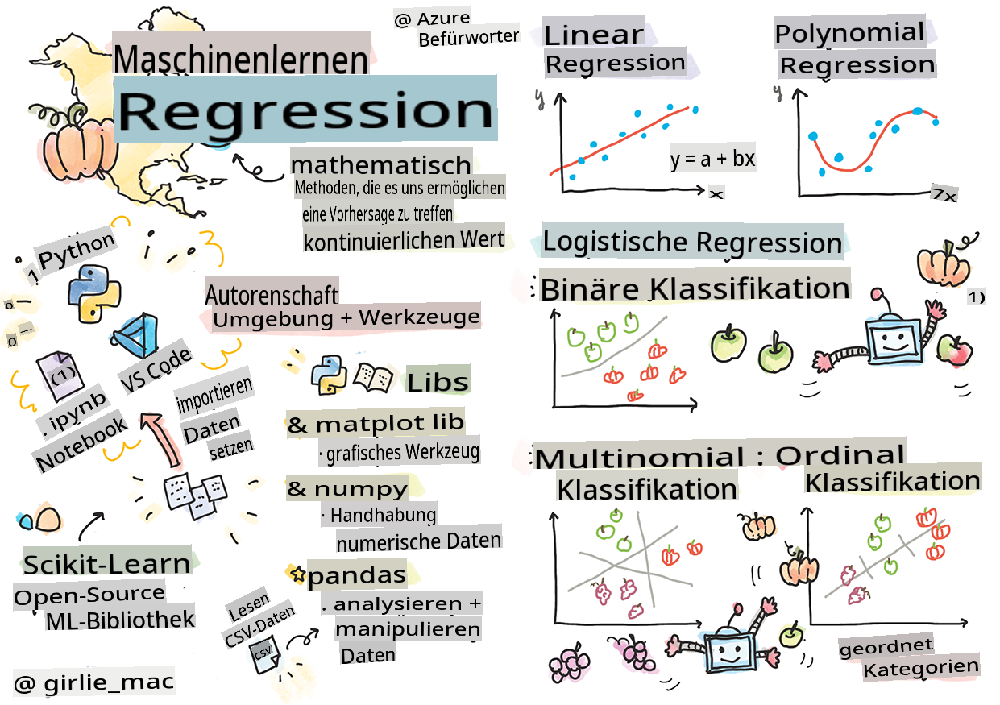
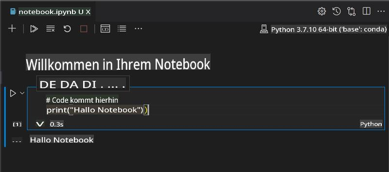
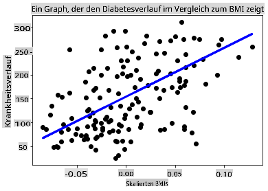

# Einstieg in Python und Scikit-learn für Regressionsmodelle



> Sketchnote von [Tomomi Imura](https://www.twitter.com/girlie_mac)

## [Vorlesungsquiz](https://gray-sand-07a10f403.1.azurestaticapps.net/quiz/9/)

> ### [Diese Lektion ist auch in R verfügbar!](../../../../2-Regression/1-Tools/solution/R/lesson_1.html)

## Einführung

In diesen vier Lektionen werden Sie entdecken, wie man Regressionsmodelle erstellt. Wir werden kurz besprechen, wofür diese verwendet werden. Aber bevor Sie etwas tun, stellen Sie sicher, dass Sie die richtigen Werkzeuge haben, um den Prozess zu starten!

In dieser Lektion lernen Sie, wie Sie:

- Ihren Computer für lokale Machine-Learning-Aufgaben konfigurieren.
- Mit Jupyter-Notebooks arbeiten.
- Scikit-learn verwenden, einschließlich der Installation.
- Lineare Regression mit einer praktischen Übung erkunden.

## Installationen und Konfigurationen

[](https://youtu.be/-DfeD2k2Kj0 "ML für Anfänger - Richten Sie Ihre Werkzeuge ein, um Machine Learning-Modelle zu erstellen")

> 🎥 Klicken Sie auf das Bild oben für ein kurzes Video, das die Konfiguration Ihres Computers für ML behandelt.

1. **Installieren Sie Python**. Stellen Sie sicher, dass [Python](https://www.python.org/downloads/) auf Ihrem Computer installiert ist. Sie werden Python für viele Aufgaben in der Datenwissenschaft und im Machine Learning verwenden. Die meisten Computersysteme haben bereits eine Python-Installation. Es gibt auch nützliche [Python Coding Packs](https://code.visualstudio.com/learn/educators/installers?WT.mc_id=academic-77952-leestott), um die Einrichtung für einige Benutzer zu erleichtern.

   Einige Anwendungen von Python erfordern jedoch eine bestimmte Version der Software, während andere eine andere Version benötigen. Aus diesem Grund ist es nützlich, in einer [virtuellen Umgebung](https://docs.python.org/3/library/venv.html) zu arbeiten.

2. **Installieren Sie Visual Studio Code**. Stellen Sie sicher, dass Visual Studio Code auf Ihrem Computer installiert ist. Befolgen Sie diese Anweisungen, um [Visual Studio Code zu installieren](https://code.visualstudio.com/) für die grundlegende Installation. Sie werden Python in Visual Studio Code in diesem Kurs verwenden, daher möchten Sie möglicherweise Ihr Wissen über die [Konfiguration von Visual Studio Code](https://docs.microsoft.com/learn/modules/python-install-vscode?WT.mc_id=academic-77952-leestott) für die Python-Entwicklung auffrischen.

   > Machen Sie sich mit Python vertraut, indem Sie diese Sammlung von [Lernmodulen](https://docs.microsoft.com/users/jenlooper-2911/collections/mp1pagggd5qrq7?WT.mc_id=academic-77952-leestott) durcharbeiten.
   >
   > [](https://youtu.be/yyQM70vi7V8 "Python mit Visual Studio Code einrichten")
   >
   > 🎥 Klicken Sie auf das Bild oben für ein Video: Verwendung von Python innerhalb von VS Code.

3. **Installieren Sie Scikit-learn**, indem Sie [diese Anweisungen](https://scikit-learn.org/stable/install.html) befolgen. Da Sie sicherstellen müssen, dass Sie Python 3 verwenden, wird empfohlen, eine virtuelle Umgebung zu verwenden. Beachten Sie, dass es spezielle Anweisungen auf der oben verlinkten Seite gibt, wenn Sie diese Bibliothek auf einem M1 Mac installieren.

4. **Installieren Sie Jupyter Notebook**. Sie müssen das [Jupyter-Paket installieren](https://pypi.org/project/jupyter/).

## Ihre ML-Autorenumgebung

Sie werden **Notebooks** verwenden, um Ihren Python-Code zu entwickeln und Machine-Learning-Modelle zu erstellen. Diese Art von Datei ist ein gängiges Werkzeug für Datenwissenschaftler und kann an ihrer Endung oder Erweiterung `.ipynb` erkannt werden.

Notebooks sind eine interaktive Umgebung, die es dem Entwickler ermöglicht, sowohl Code zu schreiben als auch Notizen hinzuzufügen und Dokumentation rund um den Code zu verfassen, was für experimentelle oder forschungsorientierte Projekte sehr hilfreich ist.

[](https://youtu.be/7E-jC8FLA2E "ML für Anfänger - Richten Sie Jupyter Notebooks ein, um Regressionsmodelle zu erstellen")

> 🎥 Klicken Sie auf das Bild oben für ein kurzes Video, das diese Übung behandelt.

### Übung - Arbeiten mit einem Notebook

In diesem Ordner finden Sie die Datei _notebook.ipynb_.

1. Öffnen Sie _notebook.ipynb_ in Visual Studio Code.

   Ein Jupyter-Server wird mit Python 3+ gestartet. Sie finden Bereiche des Notebooks, die `run`, Code-Schnipsel, enthalten. Sie können einen Codeblock ausführen, indem Sie das Symbol auswählen, das wie eine Wiedergabetaste aussieht.

2. Wählen Sie das `md`-Symbol aus und fügen Sie etwas Markdown hinzu sowie den folgenden Text **# Willkommen in Ihrem Notebook**.

   Fügen Sie als Nächstes etwas Python-Code hinzu.

3. Geben Sie **print('hello notebook')** im Codeblock ein.
4. Wählen Sie den Pfeil aus, um den Code auszuführen.

   Sie sollten die ausgegebene Anweisung sehen:

    ```output
    hello notebook
    ```



Sie können Ihren Code mit Kommentaren versehen, um das Notebook selbst zu dokumentieren.

✅ Denken Sie einen Moment darüber nach, wie unterschiedlich die Arbeitsumgebung eines Webentwicklers im Vergleich zu der eines Datenwissenschaftlers ist.

## Bereit mit Scikit-learn

Jetzt, wo Python in Ihrer lokalen Umgebung eingerichtet ist und Sie sich mit Jupyter-Notebooks wohlfühlen, lassen Sie uns auch mit Scikit-learn vertraut machen (ausgesprochen `sci` as in `science`). Scikit-learn bietet eine [umfangreiche API](https://scikit-learn.org/stable/modules/classes.html#api-ref), um Ihnen bei der Durchführung von ML-Aufgaben zu helfen.

Laut ihrer [Website](https://scikit-learn.org/stable/getting_started.html) ist "Scikit-learn eine Open-Source-Machine-Learning-Bibliothek, die überwachtes und unüberwachtes Lernen unterstützt. Sie bietet auch verschiedene Werkzeuge für das Anpassen von Modellen, die Datenvorverarbeitung, die Modellauswahl und -bewertung sowie viele andere Hilfsprogramme."

In diesem Kurs werden Sie Scikit-learn und andere Werkzeuge verwenden, um Machine-Learning-Modelle zu erstellen, um das zu tun, was wir 'traditionelle Machine-Learning'-Aufgaben nennen. Wir haben absichtlich neuronale Netzwerke und Deep Learning vermieden, da diese in unserem kommenden Lehrplan 'KI für Anfänger' besser behandelt werden.

Scikit-learn macht es einfach, Modelle zu erstellen und sie für die Verwendung zu bewerten. Es konzentriert sich hauptsächlich auf die Verwendung numerischer Daten und enthält mehrere vorgefertigte Datensätze, die als Lernwerkzeuge verwendet werden können. Es umfasst auch vorgefertigte Modelle, die die Schüler ausprobieren können. Lassen Sie uns den Prozess des Ladens von vorverpackten Daten und die Verwendung eines integrierten Schätzers für das erste ML-Modell mit Scikit-learn mit einigen grundlegenden Daten erkunden.

## Übung - Ihr erstes Scikit-learn-Notebook

> Dieses Tutorial wurde von dem [Beispiel zur linearen Regression](https://scikit-learn.org/stable/auto_examples/linear_model/plot_ols.html#sphx-glr-auto-examples-linear-model-plot-ols-py) auf der Website von Scikit-learn inspiriert.

[](https://youtu.be/2xkXL5EUpS0 "ML für Anfänger - Ihr erstes lineares Regressionsprojekt in Python")

> 🎥 Klicken Sie auf das Bild oben für ein kurzes Video, das diese Übung behandelt.

Im _notebook.ipynb_-Datei, die mit dieser Lektion verbunden ist, löschen Sie alle Zellen, indem Sie auf das Symbol 'Mülleimer' klicken.

In diesem Abschnitt arbeiten Sie mit einem kleinen Datensatz über Diabetes, der in Scikit-learn für Lernzwecke integriert ist. Stellen Sie sich vor, Sie möchten eine Behandlung für Diabetiker testen. Machine-Learning-Modelle könnten Ihnen helfen zu bestimmen, welche Patienten besser auf die Behandlung ansprechen würden, basierend auf Kombinationen von Variablen. Selbst ein sehr einfaches Regressionsmodell könnte, wenn es visualisiert wird, Informationen über Variablen zeigen, die Ihnen helfen würden, Ihre theoretischen klinischen Studien zu organisieren.

✅ Es gibt viele Arten von Regressionsmethoden, und welche Sie wählen, hängt von der Antwort ab, die Sie suchen. Wenn Sie die wahrscheinliche Größe einer Person in einem bestimmten Alter vorhersagen möchten, würden Sie eine lineare Regression verwenden, da Sie einen **numerischen Wert** suchen. Wenn Sie herausfinden möchten, ob eine Art von Küche als vegan betrachtet werden sollte oder nicht, suchen Sie nach einer **Kategorisierung**, sodass Sie eine logistische Regression verwenden würden. Sie werden später mehr über logistische Regression erfahren. Denken Sie ein wenig über einige Fragen nach, die Sie an Daten stellen können, und welche dieser Methoden angemessener wäre.

Lassen Sie uns mit dieser Aufgabe beginnen.

### Bibliotheken importieren

Für diese Aufgabe werden wir einige Bibliotheken importieren:

- **matplotlib**. Es ist ein nützliches [Grafiktool](https://matplotlib.org/) und wir werden es verwenden, um ein Liniendiagramm zu erstellen.
- **numpy**. [numpy](https://numpy.org/doc/stable/user/whatisnumpy.html) ist eine nützliche Bibliothek zum Umgang mit numerischen Daten in Python.
- **sklearn**. Dies ist die [Scikit-learn](https://scikit-learn.org/stable/user_guide.html)-Bibliothek.

Importieren Sie einige Bibliotheken, um Ihnen bei Ihren Aufgaben zu helfen.

1. Fügen Sie die Importe hinzu, indem Sie den folgenden Code eingeben:

   ```python
   import matplotlib.pyplot as plt
   import numpy as np
   from sklearn import datasets, linear_model, model_selection
   ```

   Oben importieren Sie `matplotlib`, `numpy` and you are importing `datasets`, `linear_model` and `model_selection` from `sklearn`. `model_selection` is used for splitting data into training and test sets.

### The diabetes dataset

The built-in [diabetes dataset](https://scikit-learn.org/stable/datasets/toy_dataset.html#diabetes-dataset) includes 442 samples of data around diabetes, with 10 feature variables, some of which include:

- age: age in years
- bmi: body mass index
- bp: average blood pressure
- s1 tc: T-Cells (a type of white blood cells)

✅ This dataset includes the concept of 'sex' as a feature variable important to research around diabetes. Many medical datasets include this type of binary classification. Think a bit about how categorizations such as this might exclude certain parts of a population from treatments.

Now, load up the X and y data.

> 🎓 Remember, this is supervised learning, and we need a named 'y' target.

In a new code cell, load the diabetes dataset by calling `load_diabetes()`. The input `return_X_y=True` signals that `X` will be a data matrix, and `y`, die das Regressionsziel sein werden.

2. Fügen Sie einige Druckbefehle hinzu, um die Form der Datenmatrix und ihr erstes Element anzuzeigen:

    ```python
    X, y = datasets.load_diabetes(return_X_y=True)
    print(X.shape)
    print(X[0])
    ```

    Was Sie als Antwort zurückbekommen, ist ein Tupel. Was Sie tun, ist, die beiden ersten Werte des Tupels den Variablen `X` and `y` zuzuweisen. Erfahren Sie mehr [über Tupel](https://wikipedia.org/wiki/Tuple).

    Sie können sehen, dass diese Daten 442 Elemente in Arrays von 10 Elementen haben:

    ```text
    (442, 10)
    [ 0.03807591  0.05068012  0.06169621  0.02187235 -0.0442235  -0.03482076
    -0.04340085 -0.00259226  0.01990842 -0.01764613]
    ```

    ✅ Denken Sie ein wenig über die Beziehung zwischen den Daten und dem Regressionsziel nach. Die lineare Regression sagt Beziehungen zwischen dem Merkmal X und der Zielvariable y voraus. Können Sie das [Ziel](https://scikit-learn.org/stable/datasets/toy_dataset.html#diabetes-dataset) für den Diabetes-Datensatz in der Dokumentation finden? Was zeigt dieser Datensatz, gegeben dieses Ziel?

3. Wählen Sie als Nächstes einen Teil dieses Datensatzes aus, um ihn zu plotten, indem Sie die 3. Spalte des Datensatzes auswählen. Sie können dies tun, indem Sie `:` operator to select all rows, and then selecting the 3rd column using the index (2). You can also reshape the data to be a 2D array - as required for plotting - by using `reshape(n_rows, n_columns)` verwenden. Wenn einer der Parameter -1 ist, wird die entsprechende Dimension automatisch berechnet.

   ```python
   X = X[:, 2]
   X = X.reshape((-1,1))
   ```

   ✅ Drucken Sie jederzeit die Daten aus, um ihre Form zu überprüfen.

4. Jetzt, wo Sie die Daten bereit haben, um geplottet zu werden, können Sie sehen, ob eine Maschine helfen kann, eine logische Trennung zwischen den Zahlen in diesem Datensatz zu bestimmen. Dazu müssen Sie sowohl die Daten (X) als auch das Ziel (y) in Test- und Trainingssätze aufteilen. Scikit-learn hat eine unkomplizierte Möglichkeit, dies zu tun; Sie können Ihre Testdaten an einem bestimmten Punkt aufteilen.

   ```python
   X_train, X_test, y_train, y_test = model_selection.train_test_split(X, y, test_size=0.33)
   ```

5. Jetzt sind Sie bereit, Ihr Modell zu trainieren! Laden Sie das lineare Regressionsmodell und trainieren Sie es mit Ihren X- und y-Trainingssätzen unter Verwendung von `model.fit()`:

    ```python
    model = linear_model.LinearRegression()
    model.fit(X_train, y_train)
    ```

    ✅ `model.fit()` is a function you'll see in many ML libraries such as TensorFlow

5. Then, create a prediction using test data, using the function `predict()`. Dies wird verwendet, um die Linie zwischen den Daten gruppen zu zeichnen.

    ```python
    y_pred = model.predict(X_test)
    ```

6. Jetzt ist es Zeit, die Daten in einem Diagramm anzuzeigen. Matplotlib ist ein sehr nützliches Werkzeug für diese Aufgabe. Erstellen Sie ein Streudiagramm aller X- und y-Testdaten und verwenden Sie die Vorhersage, um eine Linie an der passendsten Stelle zwischen den Daten gruppen des Modells zu zeichnen.

    ```python
    plt.scatter(X_test, y_test,  color='black')
    plt.plot(X_test, y_pred, color='blue', linewidth=3)
    plt.xlabel('Scaled BMIs')
    plt.ylabel('Disease Progression')
    plt.title('A Graph Plot Showing Diabetes Progression Against BMI')
    plt.show()
    ```

   

   ✅ Denken Sie ein wenig darüber nach, was hier passiert. Eine gerade Linie verläuft durch viele kleine Datenpunkte, aber was tut sie genau? Können Sie sehen, wie Sie diese Linie verwenden sollten, um vorherzusagen, wo ein neuer, ungesehener Datenpunkt in Bezug auf die y-Achse des Plots passen sollte? Versuchen Sie, den praktischen Nutzen dieses Modells in Worte zu fassen.

Herzlichen Glückwunsch, Sie haben Ihr erstes lineares Regressionsmodell erstellt, eine Vorhersage damit gemacht und es in einem Diagramm dargestellt!

---
## 🚀Herausforderung

Ploten Sie eine andere Variable aus diesem Datensatz. Hinweis: Bearbeiten Sie diese Zeile: `X = X[:,2]`. Was können Sie aus dem Ziel dieses Datensatzes über den Verlauf von Diabetes als Krankheit herausfinden?
## [Nachlesequiz](https://gray-sand-07a10f403.1.azurestaticapps.net/quiz/10/)

## Überprüfung & Selbststudium

In diesem Tutorial haben Sie mit einfacher linearer Regression gearbeitet, anstatt mit univariater oder multipler linearer Regression. Lesen Sie ein wenig über die Unterschiede zwischen diesen Methoden oder sehen Sie sich [dieses Video](https://www.coursera.org/lecture/quantifying-relationships-regression-models/linear-vs-nonlinear-categorical-variables-ai2Ef) an.

Lesen Sie mehr über das Konzept der Regression und denken Sie darüber nach, welche Arten von Fragen mit dieser Technik beantwortet werden können. Nehmen Sie dieses [Tutorial](https://docs.microsoft.com/learn/modules/train-evaluate-regression-models?WT.mc_id=academic-77952-leestott), um Ihr Verständnis zu vertiefen.

## Aufgabe

[Einen anderen Datensatz](assignment.md)

**Haftungsausschluss**:  
Dieses Dokument wurde mit maschinellen KI-Übersetzungsdiensten übersetzt. Obwohl wir uns um Genauigkeit bemühen, bitten wir zu beachten, dass automatisierte Übersetzungen Fehler oder Ungenauigkeiten enthalten können. Das Originaldokument in seiner ursprünglichen Sprache sollte als die maßgebliche Quelle betrachtet werden. Für wichtige Informationen wird eine professionelle menschliche Übersetzung empfohlen. Wir übernehmen keine Haftung für Missverständnisse oder Fehlinterpretationen, die aus der Verwendung dieser Übersetzung entstehen.