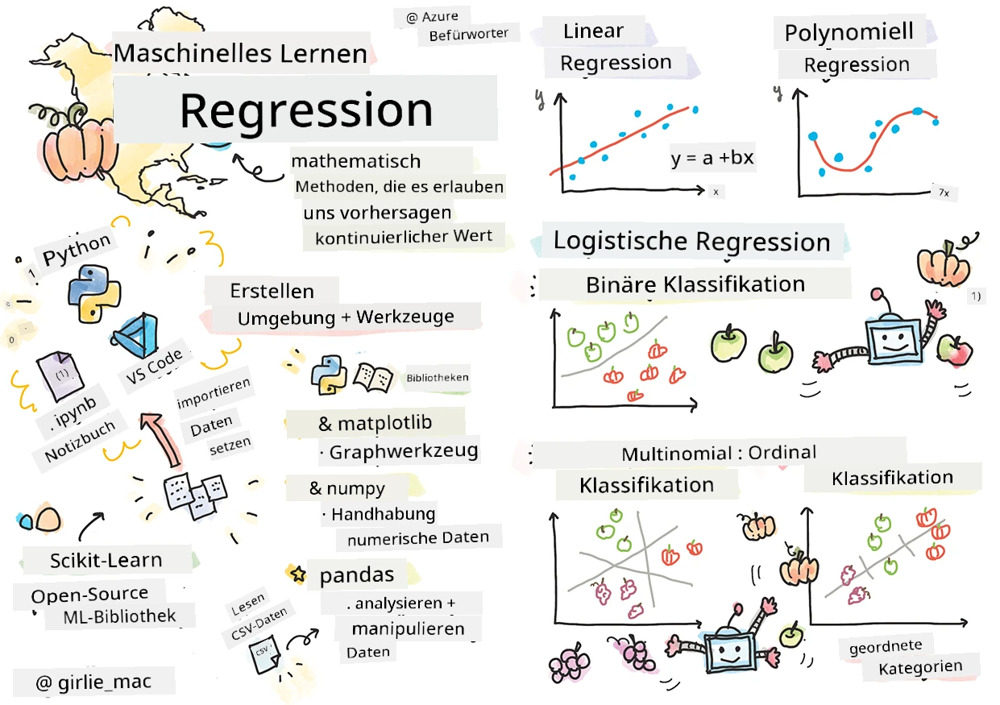
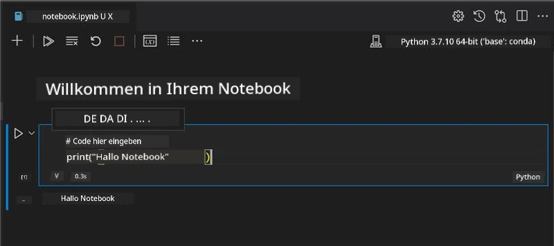
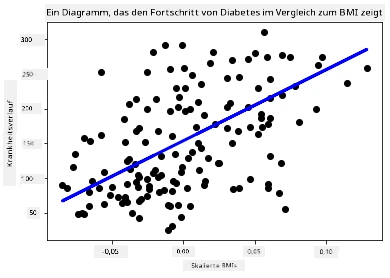

# Einstieg in Python und Scikit-learn für Regressionsmodelle



> Sketchnote von [Tomomi Imura](https://www.twitter.com/girlie_mac)

## [Quiz vor der Vorlesung](https://ff-quizzes.netlify.app/en/ml/)

> ### [Diese Lektion ist auch in R verfügbar!](../../../../2-Regression/1-Tools/solution/R/lesson_1.html)

## Einführung

In diesen vier Lektionen wirst du erfahren, wie man Regressionsmodelle erstellt. Wir werden gleich besprechen, wofür sie dienen. Aber bevor du irgendetwas machst, stelle sicher, dass du die richtigen Werkzeuge bereit hast, um den Prozess zu starten!

In dieser Lektion lernst du,

- Deinen Computer für lokale Machine-Learning-Aufgaben zu konfigurieren.
- Mit Jupyter Notebooks zu arbeiten.
- Scikit-learn zu verwenden, einschließlich Installation.
- Lineare Regression anhand einer praktischen Übung zu erkunden.

## Installationen und Konfigurationen

[](https://youtu.be/-DfeD2k2Kj0 "ML für Anfänger - Richte deine Werkzeuge ein, um Machine-Learning-Modelle zu erstellen")

> 🎥 Klicke auf das Bild oben für ein kurzes Video zur Konfiguration deines Computers für ML.

1. **Installiere Python**. Sorge dafür, dass [Python](https://www.python.org/downloads/) auf deinem Computer installiert ist. Du wirst Python für viele Data-Science- und Machine-Learning-Aufgaben verwenden. Auf den meisten Computersystemen ist Python bereits installiert. Es gibt auch nützliche [Python Coding Packs](https://code.visualstudio.com/learn/educators/installers?WT.mc_id=academic-77952-leestott), die einigen Anwendern die Einrichtung erleichtern.

Einige Anwendungsbereiche von Python erfordern jedoch eine Version der Software, während andere eine andere Version benötigen. Deshalb ist es sinnvoll, innerhalb einer [virtuellen Umgebung](https://docs.python.org/3/library/venv.html) zu arbeiten.

2. **Installiere Visual Studio Code**. Stelle sicher, dass Visual Studio Code auf deinem Computer installiert ist. Folge diesen Anweisungen, um [Visual Studio Code zu installieren](https://code.visualstudio.com/) für die Basiseinrichtung. Du wirst Python in Visual Studio Code in diesem Kurs verwenden, daher solltest du dich damit vertraut machen, wie man [Visual Studio Code für die Python-Entwicklung konfiguriert](https://docs.microsoft.com/learn/modules/python-install-vscode?WT.mc_id=academic-77952-leestott).

> Mach dich mit Python vertraut, indem du diese Sammlung von [Lernmodulen](https://docs.microsoft.com/users/jenlooper-2911/collections/mp1pagggd5qrq7?WT.mc_id=academic-77952-leestott) durchgehst.
>
> [](https://youtu.be/yyQM70vi7V8 "Setup Python mit Visual Studio Code")
>
> 🎥 Klicke auf das Bild oben für ein Video: Python innerhalb von VS Code verwenden.

3. **Installiere Scikit-learn**, indem du [diesen Anleitungen](https://scikit-learn.org/stable/install.html) folgst. Da du sicherstellen musst, dass Python 3 verwendet wird, wird empfohlen, eine virtuelle Umgebung zu nutzen. Beachte, dass es für die Installation auf einem M1 Mac auf der verlinkten Seite spezielle Hinweise gibt.

1. **Installiere Jupyter Notebook**. Du musst das [Jupyter-Paket installieren](https://pypi.org/project/jupyter/).

## Deine ML-Entwicklungsumgebung

Du wirst **Notebooks** verwenden, um deinen Python-Code zu entwickeln und Machine-Learning-Modelle zu erstellen. Diese Dateitypen sind ein gängiges Werkzeug für Data Scientists und sind an der Dateiendung `.ipynb` zu erkennen.

Notebooks bieten eine interaktive Umgebung, die es ermöglicht, sowohl Code zu schreiben als auch Notizen und Dokumentationen um den Code herum hinzuzufügen, was für experimentelle oder forschungsorientierte Projekte sehr hilfreich ist.

[](https://youtu.be/7E-jC8FLA2E "ML für Anfänger - Richte Jupyter Notebooks ein, um Regressionsmodelle zu erstellen")

> 🎥 Klicke auf das Bild oben für ein kurzes Video zu dieser Übung.

### Übung - Arbeite mit einem Notebook

In diesem Ordner findest du die Datei _notebook.ipynb_.

1. Öffne _notebook.ipynb_ in Visual Studio Code.

Ein Jupyter-Server mit Python 3+ wird gestartet. Du findest Abschnitte im Notebook, die `run`bar sind, also Codeblöcke. Du kannst einen Codeblock ausführen, indem du das Symbol auswählst, das wie ein Abspielknopf aussieht.

1. Wähle das `md`-Symbol und füge etwas Markdown ein, mit folgendem Text **# Willkommen in deinem Notebook**.

Füge danach etwas Python-Code hinzu.

1. Tippe **print('hello notebook')** in den Codeblock.
1. Wähle den Pfeil aus, um den Code auszuführen.

Du solltest die folgende Ausgabe sehen:

    ```output
    hello notebook
    ```



Du kannst deinen Code mit Kommentaren durchmischen, um das Notebook selbst zu dokumentieren.

✅ Denke einen Moment darüber nach, wie unterschiedlich die Arbeitsumgebung eines Webentwicklers im Vergleich zu der eines Data Scientists ist.

## Aufsetzen von Scikit-learn

Nun, da Python in deiner lokalen Umgebung eingerichtet ist und du dich mit Jupyter Notebooks wohl fühlst, lass uns jetzt auch Scikit-learn gut kennenlernen (ausgesprochen `sci` wie in `science`). Scikit-learn bietet eine [umfangreiche API](https://scikit-learn.org/stable/modules/classes.html#api-ref), die dir bei ML-Aufgaben hilft.

Laut ihrer [Webseite](https://scikit-learn.org/stable/getting_started.html) ist „Scikit-learn eine Open-Source-Machine-Learning-Bibliothek, die überwachtes und unüberwachtes Lernen unterstützt. Außerdem bietet sie verschiedene Werkzeuge für Modellanpassung, Datenvorverarbeitung, Modellauswahl und -bewertung sowie viele andere Hilfsmittel.“

In diesem Kurs wirst du Scikit-learn und andere Werkzeuge verwenden, um Machine-Learning-Modelle für das zu bauen, was wir „traditionelles Machine Learning“ nennen. Wir haben bewusst neuronale Netze und Deep Learning ausgelassen, da diese besser in unserem kommenden Curriculum „KI für Anfänger“ abgedeckt werden.

Scikit-learn macht es einfach, Modelle zu erstellen und für die Nutzung zu bewerten. Es konzentriert sich primär auf numerische Daten und enthält mehrere vorgefertigte Datensätze, die als Lernwerkzeuge genutzt werden können. Außerdem sind vorgefertigte Modelle enthalten, die Studenten ausprobieren können. Lass uns zuerst den Prozess erkunden, vorgefertigte Daten zu laden und mit einem integrierten Schätzer das erste ML-Modell mit Scikit-learn anhand einiger einfacher Daten aufzubauen.

## Übung - dein erstes Scikit-learn-Notebook

> Dieses Tutorial wurde vom [Beispiel für lineare Regression](https://scikit-learn.org/stable/auto_examples/linear_model/plot_ols.html#sphx-glr-auto-examples-linear-model-plot-ols-py) auf der Webseite von Scikit-learn inspiriert.


[](https://youtu.be/2xkXL5EUpS0 "ML für Anfänger - Dein erstes lineares Regressionsprojekt in Python")

> 🎥 Klicke auf das Bild oben für ein kurzes Video zu dieser Übung.

Im zu dieser Lektion gehörenden _notebook.ipynb_-Datei lösche alle Zellen, indem du auf das „Mülleimer“-Symbol klickst.

In diesem Abschnitt wirst du mit einem kleinen Datensatz über Diabetes arbeiten, der zu Lernzwecken in Scikit-learn eingebaut ist. Stell dir vor, du möchtest eine Behandlung für Diabetiker testen. Machine-Learning-Modelle könnten dir helfen zu bestimmen, welche Patienten besser auf die Behandlung reagieren würden, basierend auf Kombinationen von Variablen. Schon ein sehr einfaches Regressionsmodell kann, wenn es visualisiert wird, Informationen über Variablen zeigen, die bei der Organisation potenzieller klinischer Studien helfen.

✅ Es gibt viele Arten von Regressionsmethoden, und welche du auswählst, hängt von der Frage ab, die du beantworten möchtest. Möchtest du die wahrscheinliche Körpergröße einer Person eines bestimmten Alters vorhersagen, würdest du lineare Regression verwenden, da du einen **numerischen Wert** suchst. Wenn du herausfinden möchtest, ob eine Art von Küche als vegan eingestuft werden sollte oder nicht, suchst du eine **Kategorie-Zuordnung** und würdest logistische Regression verwenden. Logistische Regression lernst du später kennen. Überlege dir ein paar Fragen, die du an Daten stellen kannst, und welche dieser Methoden dafür passender wäre.

Lass uns mit dieser Aufgabe beginnen.

### Bibliotheken importieren

Für diese Aufgabe importieren wir einige Bibliotheken:

- **matplotlib**. Es ist ein nützliches [Graphing-Tool](https://matplotlib.org/) und wird verwendet, um ein Liniendiagramm zu erstellen.
- **numpy**. [numpy](https://numpy.org/doc/stable/user/whatisnumpy.html) ist eine nützliche Bibliothek zur Verarbeitung numerischer Daten in Python.
- **sklearn**. Das ist die [Scikit-learn](https://scikit-learn.org/stable/user_guide.html)-Bibliothek.

Importiere einige Bibliotheken, die dir bei deinen Aufgaben helfen.

1. Füge die Importe ein, indem du den folgenden Code eingibst:

   ```python
   import matplotlib.pyplot as plt
   import numpy as np
   from sklearn import datasets, linear_model, model_selection
   ```

Oben importierst du `matplotlib`, `numpy` und du importierst `datasets`, `linear_model` und `model_selection` von `sklearn`. `model_selection` wird zum Aufteilen der Daten in Trainings- und Testsets verwendet.

### Der Diabetes-Datensatz

Der eingebaute [Diabetes-Datensatz](https://scikit-learn.org/stable/datasets/toy_dataset.html#diabetes-dataset) enthält 442 Datensätze rund um Diabetes mit 10 Merkmalvariablen, von denen einige sind:

- age: Alter in Jahren
- bmi: Body-Mass-Index
- bp: durchschnittlicher Blutdruck
- s1 tc: T-Zellen (eine Art weiße Blutzellen)

✅ Dieser Datensatz enthält das Merkmal „sex“ (Geschlecht), das in der Diabetesforschung eine wichtige Rolle spielt. Viele medizinische Datensätze enthalten diese Art der binären Klassifikation. Überlege kurz, wie solche Kategorisierungen bestimmte Bevölkerungsgruppen von Behandlungen ausschließen könnten.

Lade jetzt die X- und y-Daten.

> 🎓 Denke daran, dass dies überwachtes Lernen ist und wir ein benanntes Ziel „y“ brauchen.

Lade den Diabetes-Datensatz in eine neue Codezelle, indem du `load_diabetes()` aufrufst. Der Parameter `return_X_y=True` gibt an, dass `X` eine Datenmatrix und `y` das Regressionsziel ist.

1. Füge ein paar print-Befehle ein, um die Form der Datenmatrix und ihr erstes Element anzuzeigen:

    ```python
    X, y = datasets.load_diabetes(return_X_y=True)
    print(X.shape)
    print(X[0])
    ```

Was du zurückbekommst, ist ein Tupel. Du weist die beiden ersten Werte des Tupels `X` und `y` zu. Erfahre mehr über [Tupel](https://wikipedia.org/wiki/Tuple).

Du kannst sehen, dass die Daten 442 Einträge enthalten, die in Arrays mit jeweils 10 Elementen geformt sind:

    ```text
    (442, 10)
    [ 0.03807591  0.05068012  0.06169621  0.02187235 -0.0442235  -0.03482076
    -0.04340085 -0.00259226  0.01990842 -0.01764613]
    ```

✅ Überlege dir, welche Beziehung zwischen den Daten und dem Regressionsziel besteht. Lineare Regression sagt Beziehungen zwischen Merkmalsvariablen X und Zielvariablen y voraus. Kannst du das [Ziel](https://scikit-learn.org/stable/datasets/toy_dataset.html#diabetes-dataset) für den Diabetes-Datensatz in der Dokumentation finden? Was zeigt dieser Datensatz mit dem Ziel?

2. Wähle als nächstes einen Teil dieses Datensatzes aus, indem du die 3. Spalte auswählst. Du kannst dies mit dem Operator `:` machen, um alle Zeilen zu nehmen und dann mit dem Index (2) die 3. Spalte auszuwählen. Du kannst die Daten auch in ein 2D-Array umformen – wie es für eine Darstellung erforderlich ist – mit `reshape(n_rows, n_columns)`. Ist einer der Parameter -1, wird die entsprechende Dimension automatisch berechnet.

   ```python
   X = X[:, 2]
   X = X.reshape((-1,1))
   ```

✅ Drucke jederzeit die Daten aus, um ihre Form zu überprüfen.

3. Nun, da du Daten zum Plotten hast, kannst du prüfen, ob eine Maschine helfen kann, eine sinnvolle Trennung zwischen den Werten in diesem Datensatz zu finden. Dazu musst du sowohl die Daten (X) als auch das Ziel (y) in Test- und Trainingssets aufteilen. Scikit-learn hat dafür eine einfache Methode; du kannst deine Testdaten an einem bestimmten Punkt aufteilen.

   ```python
   X_train, X_test, y_train, y_test = model_selection.train_test_split(X, y, test_size=0.33)
   ```

4. Jetzt bist du bereit, dein Modell zu trainieren! Lade das lineare Regressionsmodell und trainiere es mit deinen X- und y-Trainingsdaten mit `model.fit()`:

    ```python
    model = linear_model.LinearRegression()
    model.fit(X_train, y_train)
    ```

✅ `model.fit()` ist eine Funktion, die du in vielen ML-Bibliotheken wie TensorFlow sehen wirst.

5. Erstelle als nächstes eine Vorhersage mit den Testdaten, indem du die Funktion `predict()` verwendest. Diese wird genutzt, um die Linie zwischen den Datengruppen zu zeichnen.

    ```python
    y_pred = model.predict(X_test)
    ```

6. Jetzt ist es Zeit, die Daten in einem Plot zu zeigen. Matplotlib ist dafür ein sehr nützliches Werkzeug. Erstelle ein Streudiagramm aller X- und y-Testdaten und verwende die Vorhersage, um eine Linie an der passendsten Stelle zwischen den Datenclustern des Modells zu zeichnen.

    ```python
    plt.scatter(X_test, y_test,  color='black')
    plt.plot(X_test, y_pred, color='blue', linewidth=3)
    plt.xlabel('Scaled BMIs')
    plt.ylabel('Disease Progression')
    plt.title('A Graph Plot Showing Diabetes Progression Against BMI')
    plt.show()
    ```




   ✅ Denken Sie ein wenig darüber nach, was hier vor sich geht. Eine gerade Linie verläuft durch viele kleine Datenpunkte, aber was macht sie genau? Können Sie sehen, wie Sie diese Linie verwenden sollten, um zu prognostizieren, wo ein neuer, unbekannter Datenpunkt in Bezug auf die y-Achse des Diagramms passen sollte? Versuchen Sie, den praktischen Nutzen dieses Modells in Worte zu fassen.

Herzlichen Glückwunsch, Sie haben Ihr erstes lineares Regressionsmodell erstellt, eine Vorhersage damit gemacht und diese in einem Diagramm dargestellt!

---
## 🚀 Herausforderung

Stellen Sie eine andere Variable aus diesem Datensatz dar. Hinweis: Bearbeiten Sie diese Zeile: `X = X[:,2]`. Angesichts des Ziels dieses Datensatzes, was können Sie über den Verlauf von Diabetes als Krankheit herausfinden?
## [Quiz nach der Vorlesung](https://ff-quizzes.netlify.app/en/ml/)

## Wiederholung & Selbststudium

In diesem Tutorial haben Sie mit einfacher linearer Regression gearbeitet, statt mit univariater oder multipler linearer Regression. Lesen Sie etwas über die Unterschiede zwischen diesen Methoden oder schauen Sie sich [dieses Video](https://www.coursera.org/lecture/quantifying-relationships-regression-models/linear-vs-nonlinear-categorical-variables-ai2Ef) an.

Lesen Sie mehr über das Konzept der Regression und denken Sie darüber nach, welche Arten von Fragen mit dieser Technik beantwortet werden können. Machen Sie dieses [Tutorial](https://docs.microsoft.com/learn/modules/train-evaluate-regression-models?WT.mc_id=academic-77952-leestott), um Ihr Verständnis zu vertiefen.

## Aufgabe

[Ein anderer Datensatz](assignment.md)

---

<!-- CO-OP TRANSLATOR DISCLAIMER START -->
**Haftungsausschluss**:
Dieses Dokument wurde mit dem KI-Übersetzungsdienst [Co-op Translator](https://github.com/Azure/co-op-translator) übersetzt. Obwohl wir uns um Genauigkeit bemühen, beachten Sie bitte, dass automatisierte Übersetzungen Fehler oder Ungenauigkeiten enthalten können. Das Originaldokument in seiner Ursprungssprache gilt als maßgebliche Quelle. Bei kritischen Informationen wird eine professionelle menschliche Übersetzung empfohlen. Wir übernehmen keine Haftung für Missverständnisse oder Fehlinterpretationen, die aus der Verwendung dieser Übersetzung entstehen.
<!-- CO-OP TRANSLATOR DISCLAIMER END -->