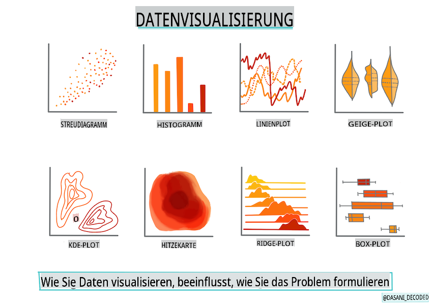
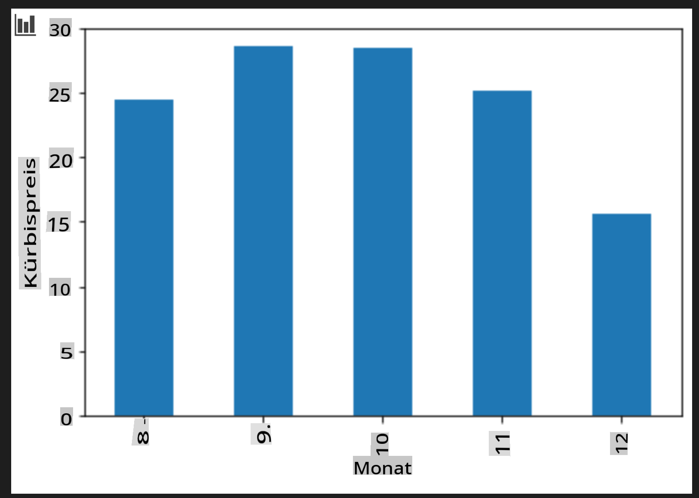

# Erstellen eines Regressionsmodells mit Scikit-learn: Daten vorbereiten und visualisieren



Infografik von [Dasani Madipalli](https://twitter.com/dasani_decoded)

## [Vorlesungsquiz](https://gray-sand-07a10f403.1.azurestaticapps.net/quiz/11/)

> ### [Diese Lektion ist auch in R verfügbar!](../../../../2-Regression/2-Data/solution/R/lesson_2.html)

## Einführung

Jetzt, wo Sie mit den notwendigen Werkzeugen ausgestattet sind, um mit dem Aufbau von Machine Learning-Modellen mit Scikit-learn zu beginnen, sind Sie bereit, Fragen zu Ihren Daten zu stellen. Es ist sehr wichtig, zu verstehen, wie man die richtigen Fragen stellt, um das Potenzial Ihres Datensatzes richtig zu erschließen.

In dieser Lektion werden Sie lernen:

- Wie Sie Ihre Daten für den Modellaufbau vorbereiten.
- Wie Sie Matplotlib für die Datenvisualisierung verwenden.

## Die richtige Frage zu Ihren Daten stellen

Die Frage, die Sie beantwortet haben möchten, bestimmt, welche Art von ML-Algorithmen Sie nutzen werden. Und die Qualität der Antwort, die Sie erhalten, hängt stark von der Beschaffenheit Ihrer Daten ab.

Schauen Sie sich die [Daten](https://github.com/microsoft/ML-For-Beginners/blob/main/2-Regression/data/US-pumpkins.csv) an, die für diese Lektion bereitgestellt werden. Sie können diese .csv-Datei in VS Code öffnen. Ein schneller Blick zeigt sofort, dass es leere Felder und eine Mischung aus Zeichenfolgen und numerischen Daten gibt. Außerdem gibt es eine merkwürdige Spalte namens 'Package', in der die Daten eine Mischung aus 'sacks', 'bins' und anderen Werten sind. Die Daten sind in der Tat etwas chaotisch.

[](https://youtu.be/5qGjczWTrDQ "ML für Anfänger - Wie man einen Datensatz analysiert und bereinigt")

> 🎥 Klicken Sie auf das Bild oben für ein kurzes Video zur Vorbereitung der Daten für diese Lektion.

Es ist tatsächlich nicht sehr häufig, dass Ihnen ein Datensatz übergeben wird, der sofort einsatzbereit ist, um ein ML-Modell zu erstellen. In dieser Lektion lernen Sie, wie Sie einen Rohdatensatz mit gängigen Python-Bibliotheken vorbereiten. Sie werden auch verschiedene Techniken zur Visualisierung der Daten kennenlernen.

## Fallstudie: 'der Kürbismarkt'

In diesem Ordner finden Sie eine .csv-Datei im Wurzelverzeichnis `data` mit dem Namen [US-pumpkins.csv](https://github.com/microsoft/ML-For-Beginners/blob/main/2-Regression/data/US-pumpkins.csv), die 1757 Zeilen von Daten über den Markt für Kürbisse enthält, sortiert nach Städten. Dies sind Rohdaten, die aus den [Standardberichten der Spezialkulturen-Terminalmärkte](https://www.marketnews.usda.gov/mnp/fv-report-config-step1?type=termPrice) des United States Department of Agriculture extrahiert wurden.

### Daten vorbereiten

Diese Daten sind gemeinfrei. Sie können in vielen separaten Dateien pro Stadt von der USDA-Website heruntergeladen werden. Um zu viele separate Dateien zu vermeiden, haben wir alle Stadtdaten in einer einzigen Tabelle zusammengeführt, sodass wir die Daten bereits ein wenig _vorbereitet_ haben. Lassen Sie uns nun einen genaueren Blick auf die Daten werfen.

### Die Kürbisdaten - erste Schlussfolgerungen

Was fällt Ihnen an diesen Daten auf? Sie haben bereits gesehen, dass es eine Mischung aus Zeichenfolgen, Zahlen, leeren Feldern und seltsamen Werten gibt, die Sie verstehen müssen.

Welche Frage können Sie zu diesen Daten mit einer Regressionstechnik stellen? Wie wäre es mit "Vorhersage des Preises eines Kürbisses, der in einem bestimmten Monat verkauft wird"? Wenn Sie sich die Daten erneut ansehen, gibt es einige Änderungen, die Sie vornehmen müssen, um die erforderliche Datenstruktur für die Aufgabe zu erstellen.

## Übung - Analysieren der Kürbisdaten

Lassen Sie uns [Pandas](https://pandas.pydata.org/) verwenden, (der Name steht für `Python Data Analysis`), ein sehr nützliches Tool zum Strukturieren von Daten, um diese Kürbisdaten zu analysieren und vorzubereiten.

### Zuerst nach fehlenden Daten suchen

Sie müssen zunächst Schritte unternehmen, um nach fehlenden Daten zu suchen:

1. Konvertieren Sie die Daten in ein Monatsformat (das sind US-Daten, daher ist das Format `MM/DD/YYYY`).
2. Extrahieren Sie den Monat in eine neue Spalte.

Öffnen Sie die _notebook.ipynb_-Datei in Visual Studio Code und importieren Sie die Tabelle in einen neuen Pandas-Datenrahmen.

1. Verwenden Sie die `head()`-Funktion, um die ersten fünf Zeilen anzuzeigen.

    ```python
    import pandas as pd
    pumpkins = pd.read_csv('../data/US-pumpkins.csv')
    pumpkins.head()
    ```

    ✅ Welche Funktion würden Sie verwenden, um die letzten fünf Zeilen anzuzeigen?

1. Überprüfen Sie, ob im aktuellen Datenrahmen fehlende Daten vorhanden sind:

    ```python
    pumpkins.isnull().sum()
    ```

    Es gibt fehlende Daten, aber vielleicht spielt das für die aktuelle Aufgabe keine Rolle.

1. Um Ihren Datenrahmen leichter handhabbar zu machen, wählen Sie nur die Spalten aus, die Sie benötigen, wobei `loc` function which extracts from the original dataframe a group of rows (passed as first parameter) and columns (passed as second parameter). The expression `:` im folgenden Fall "alle Zeilen" bedeutet.

    ```python
    columns_to_select = ['Package', 'Low Price', 'High Price', 'Date']
    pumpkins = pumpkins.loc[:, columns_to_select]
    ```

### Zweitens, den Durchschnittspreis eines Kürbisses bestimmen

Denken Sie darüber nach, wie Sie den Durchschnittspreis eines Kürbisses in einem bestimmten Monat bestimmen können. Welche Spalten würden Sie für diese Aufgabe auswählen? Hinweis: Sie benötigen 3 Spalten.

Lösung: Berechnen Sie den Durchschnitt der `Low Price` and `High Price`-Spalten, um die neue Preis-Spalte zu füllen, und konvertieren Sie die Datums-Spalte, sodass nur der Monat angezeigt wird. Glücklicherweise gibt es laut der vorherigen Überprüfung keine fehlenden Daten für Daten oder Preise.

1. Um den Durchschnitt zu berechnen, fügen Sie den folgenden Code hinzu:

    ```python
    price = (pumpkins['Low Price'] + pumpkins['High Price']) / 2

    month = pd.DatetimeIndex(pumpkins['Date']).month

    ```

   ✅ Fühlen Sie sich frei, Daten auszudrucken, die Sie zur Überprüfung verwenden möchten, indem Sie `print(month)` verwenden.

2. Kopieren Sie nun Ihre konvertierten Daten in einen neuen Pandas-Datenrahmen:

    ```python
    new_pumpkins = pd.DataFrame({'Month': month, 'Package': pumpkins['Package'], 'Low Price': pumpkins['Low Price'],'High Price': pumpkins['High Price'], 'Price': price})
    ```

    Wenn Sie Ihren Datenrahmen ausdrucken, sehen Sie einen sauberen, aufgeräumten Datensatz, auf dem Sie Ihr neues Regressionsmodell aufbauen können.

### Aber warten Sie! Hier ist etwas Seltsames

Wenn Sie sich die Spalte `Package` column, pumpkins are sold in many different configurations. Some are sold in '1 1/9 bushel' measures, and some in '1/2 bushel' measures, some per pumpkin, some per pound, and some in big boxes with varying widths.

> Pumpkins seem very hard to weigh consistently

Digging into the original data, it's interesting that anything with `Unit of Sale` equalling 'EACH' or 'PER BIN' also have the `Package` type per inch, per bin, or 'each'. Pumpkins seem to be very hard to weigh consistently, so let's filter them by selecting only pumpkins with the string 'bushel' in their `Package` ansehen.

1. Fügen Sie am Anfang der Datei, unter dem ursprünglichen .csv-Import, einen Filter hinzu:

    ```python
    pumpkins = pumpkins[pumpkins['Package'].str.contains('bushel', case=True, regex=True)]
    ```

    Wenn Sie die Daten jetzt drucken, sehen Sie, dass Sie nur etwa 415 Zeilen von Daten erhalten, die Kürbisse nach Scheffel enthalten.

### Aber warten Sie! Es gibt noch eine Sache zu tun

Haben Sie bemerkt, dass die Menge pro Scheffel von Zeile zu Zeile variiert? Sie müssen die Preise normalisieren, sodass Sie die Preise pro Scheffel anzeigen, also machen Sie etwas Mathematik, um es zu standardisieren.

1. Fügen Sie diese Zeilen nach dem Block hinzu, der den new_pumpkins-Datenrahmen erstellt:

    ```python
    new_pumpkins.loc[new_pumpkins['Package'].str.contains('1 1/9'), 'Price'] = price/(1 + 1/9)

    new_pumpkins.loc[new_pumpkins['Package'].str.contains('1/2'), 'Price'] = price/(1/2)
    ```

✅ Laut [The Spruce Eats](https://www.thespruceeats.com/how-much-is-a-bushel-1389308) hängt das Gewicht eines Scheffels von der Art des Produkts ab, da es sich um eine Volumeneinheit handelt. "Ein Scheffel Tomaten sollte zum Beispiel 56 Pfund wiegen... Blätter und Gemüse nehmen mehr Platz mit weniger Gewicht ein, sodass ein Scheffel Spinat nur 20 Pfund wiegt." Es ist alles ziemlich kompliziert! Lassen Sie uns nicht mit einer Umrechnung von Scheffel in Pfund beschäftigen und stattdessen nach Scheffeln bepreisen. All dieses Studium von Scheffeln Kürbisse zeigt jedoch, wie wichtig es ist, die Natur Ihrer Daten zu verstehen!

Jetzt können Sie die Preisgestaltung pro Einheit basierend auf ihrer Scheffelmessung analysieren. Wenn Sie die Daten ein weiteres Mal ausdrucken, können Sie sehen, wie sie standardisiert sind.

✅ Haben Sie bemerkt, dass Kürbisse, die nach halben Scheffeln verkauft werden, sehr teuer sind? Können Sie herausfinden, warum? Hinweis: Kleine Kürbisse sind viel teurer als große, wahrscheinlich weil es pro Scheffel so viel mehr von ihnen gibt, angesichts des ungenutzten Raums, der von einem großen hohlen Kürbis eingenommen wird.

## Visualisierungsstrategien

Ein Teil der Rolle eines Data Scientists besteht darin, die Qualität und Natur der Daten, mit denen sie arbeiten, zu demonstrieren. Dazu erstellen sie oft interessante Visualisierungen oder Diagramme, Grafiken und Charts, die verschiedene Aspekte der Daten zeigen. Auf diese Weise können sie visuell Beziehungen und Lücken aufzeigen, die sonst schwer zu erkennen wären.

[](https://youtu.be/SbUkxH6IJo0 "ML für Anfänger - Wie man Daten mit Matplotlib visualisiert")

> 🎥 Klicken Sie auf das Bild oben für ein kurzes Video zur Visualisierung der Daten für diese Lektion.

Visualisierungen können auch helfen, die am besten geeignete Machine Learning-Technik für die Daten zu bestimmen. Ein Streudiagramm, das anscheinend einer Linie folgt, deutet beispielsweise darauf hin, dass die Daten ein guter Kandidat für eine lineare Regression sind.

Eine Datenvisualisierungsbibliothek, die gut in Jupyter-Notebooks funktioniert, ist [Matplotlib](https://matplotlib.org/) (die Sie auch in der vorherigen Lektion gesehen haben).

> Erwerben Sie mehr Erfahrung mit Datenvisualisierung in [diesen Tutorials](https://docs.microsoft.com/learn/modules/explore-analyze-data-with-python?WT.mc_id=academic-77952-leestott).

## Übung - Experimentieren mit Matplotlib

Versuchen Sie, einige grundlegende Diagramme zu erstellen, um den neuen Datenrahmen, den Sie gerade erstellt haben, anzuzeigen. Was würde ein einfaches Liniendiagramm zeigen?

1. Importieren Sie Matplotlib am Anfang der Datei, unter dem Pandas-Import:

    ```python
    import matplotlib.pyplot as plt
    ```

1. Führen Sie das gesamte Notebook erneut aus, um es zu aktualisieren.
1. Fügen Sie am Ende des Notebooks eine Zelle hinzu, um die Daten als Box zu plotten:

    ```python
    price = new_pumpkins.Price
    month = new_pumpkins.Month
    plt.scatter(price, month)
    plt.show()
    ```

    

    Ist dies ein nützliches Diagramm? Gibt es etwas, das Sie überrascht?

    Es ist nicht besonders nützlich, da es lediglich Ihre Daten als eine Streuung von Punkten in einem bestimmten Monat darstellt.

### Machen Sie es nützlich

Um Diagramme nützliche Daten anzuzeigen, müssen Sie die Daten normalerweise irgendwie gruppieren. Lassen Sie uns versuchen, ein Diagramm zu erstellen, bei dem die y-Achse die Monate zeigt und die Daten die Verteilung der Daten demonstrieren.

1. Fügen Sie eine Zelle hinzu, um ein gruppiertes Balkendiagramm zu erstellen:

    ```python
    new_pumpkins.groupby(['Month'])['Price'].mean().plot(kind='bar')
    plt.ylabel("Pumpkin Price")
    ```

    

    Dies ist eine nützlichere Datenvisualisierung! Es scheint darauf hinzuweisen, dass der höchste Preis für Kürbisse im September und Oktober auftritt. Entspricht das Ihren Erwartungen? Warum oder warum nicht?

---

## 🚀Herausforderung

Erforschen Sie die verschiedenen Arten von Visualisierungen, die Matplotlib bietet. Welche Typen sind am besten für Regressionsprobleme geeignet?

## [Nachlesungsquiz](https://gray-sand-07a10f403.1.azurestaticapps.net/quiz/12/)

## Überprüfung & Selbststudium

Werfen Sie einen Blick auf die vielen Möglichkeiten, Daten zu visualisieren. Erstellen Sie eine Liste der verschiedenen verfügbaren Bibliotheken und notieren Sie, welche für bestimmte Aufgaben am besten geeignet sind, zum Beispiel 2D-Visualisierungen vs. 3D-Visualisierungen. Was entdecken Sie?

## Aufgabe

[Erforschen der Visualisierung](assignment.md)

**Haftungsausschluss**:  
Dieses Dokument wurde mit maschinellen KI-Übersetzungsdiensten übersetzt. Obwohl wir uns um Genauigkeit bemühen, beachten Sie bitte, dass automatisierte Übersetzungen Fehler oder Ungenauigkeiten enthalten können. Das Originaldokument in seiner ursprünglichen Sprache sollte als die maßgebliche Quelle betrachtet werden. Für wichtige Informationen wird eine professionelle menschliche Übersetzung empfohlen. Wir übernehmen keine Haftung für Missverständnisse oder Fehlinterpretationen, die aus der Verwendung dieser Übersetzung entstehen.