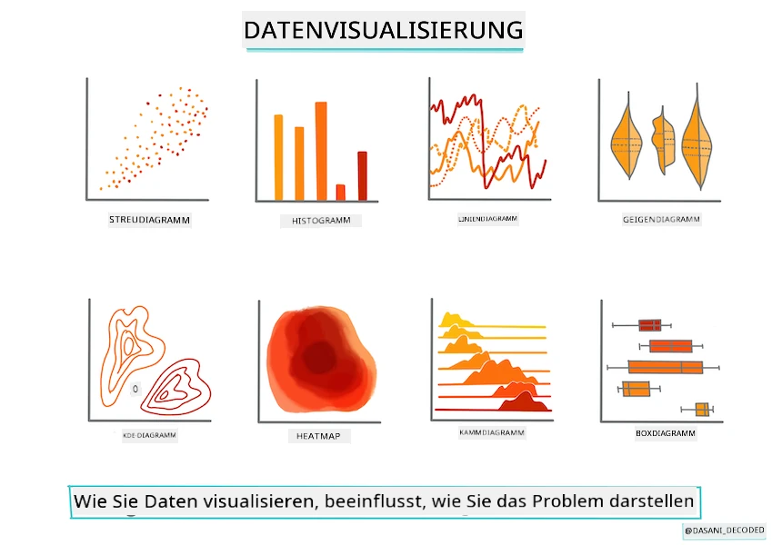
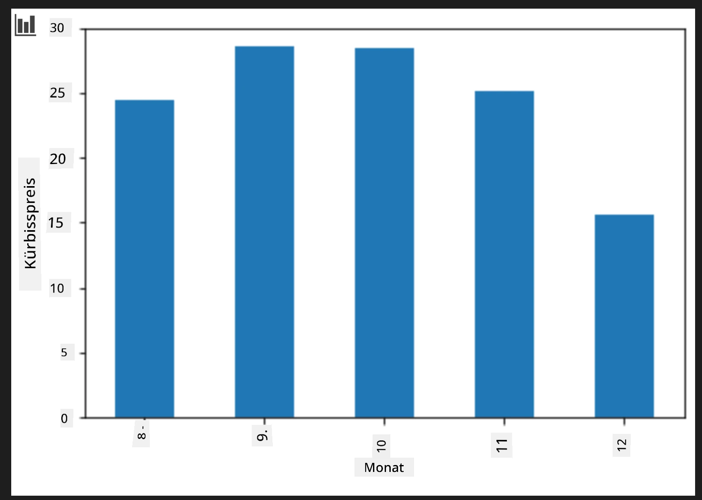
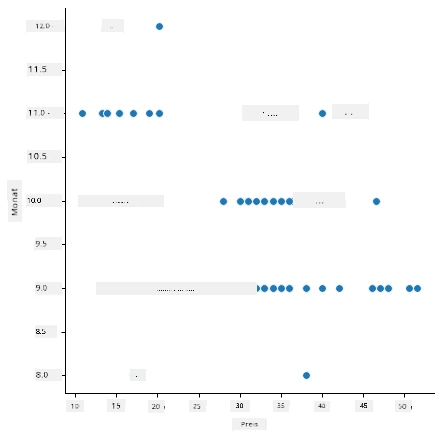
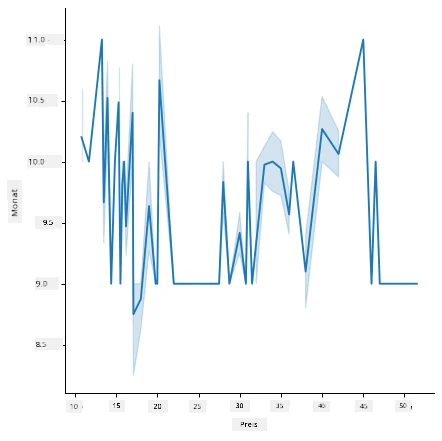
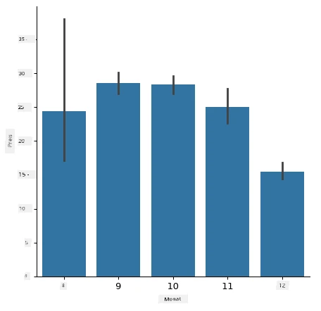
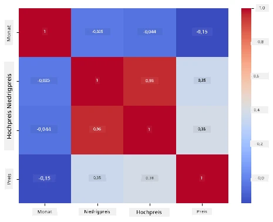

# Erstellen eines Regressionsmodells mit Scikit-learn: Daten vorbereiten und visualisieren



Infografik von [Dasani Madipalli](https://twitter.com/dasani_decoded)

## [Vortragsquiz](https://ff-quizzes.netlify.app/en/ml/)

> ### [Diese Lektion ist auch in R verfügbar!](../../../../2-Regression/2-Data/solution/R/lesson_2.html)

## Einführung

Jetzt, wo du mit den Werkzeugen eingerichtet bist, die du brauchst, um mit dem Aufbau von Machine-Learning-Modellen mit Scikit-learn zu beginnen, bist du bereit, Fragen an deine Daten zu stellen. Wenn du mit Daten arbeitest und ML-Lösungen anwendest, ist es sehr wichtig, zu verstehen, wie man die richtige Frage stellt, um das Potenzial deines Datensatzes richtig zu erschließen.

In dieser Lektion wirst du lernen:

- Wie du deine Daten für den Modellbau vorbereitest.
- Wie du Matplotlib für die Datenvisualisierung verwendest.
- Wie du Seaborn für ausdrucksvollere Datenvisualisierungen einsetzt.

## Die richtige Frage an deine Daten stellen

Die Frage, die du beantwortet haben möchtest, bestimmt, welche Art von ML-Algorithmen du einsetzen wirst. Und die Qualität der Antwort hängt stark von der Beschaffenheit deiner Daten ab.

Schau dir die für diese Lektion bereitgestellten [Daten](https://github.com/microsoft/ML-For-Beginners/blob/main/2-Regression/data/US-pumpkins.csv) an. Du kannst diese .csv-Datei in VS Code öffnen. Ein kurzer Blick zeigt sofort, dass es Lücken und eine Mischung aus Text- und numerischen Daten gibt. Es gibt auch eine merkwürdige Spalte namens „Package“, in der die Daten eine Mischung aus „sacks“, „bins“ und anderen Werten sind. Die Daten sind tatsächlich etwas chaotisch.

[](https://youtu.be/5qGjczWTrDQ "ML für Anfänger - Wie man einen Datensatz analysiert und bereinigt")

> 🎥 Klicke auf das obige Bild für ein kurzes Video, das die Vorbereitung der Daten für diese Lektion durchgeht.

Tatsächlich ist es nicht sehr üblich, einen Datensatz zu erhalten, der vollständig bereit ist, um sofort ein ML-Modell zu erstellen. In dieser Lektion lernst du, wie du einen Rohdatensatz mit Standard-Python-Bibliotheken vorbereitest. Du lernst auch verschiedene Techniken zur Visualisierung der Daten.

## Fallstudie: „Der Kürbismarkt“

In diesem Ordner findest du eine .csv-Datei im Hauptordner `data` namens [US-pumpkins.csv](https://github.com/microsoft/ML-For-Beginners/blob/main/2-Regression/data/US-pumpkins.csv), die 1757 Zeilen Daten über den Kürbismarkt enthält, sortiert nach Städten. Dies sind Rohdaten, die aus den [Specialty Crops Terminal Markets Standard Reports](https://www.marketnews.usda.gov/mnp/fv-report-config-step1?type=termPrice) entnommen wurden, die vom United States Department of Agriculture herausgegeben werden.

### Daten vorbereiten

Diese Daten sind Gemeingut. Sie können in vielen einzelnen Dateien, jeweils pro Stadt, von der USDA-Website heruntergeladen werden. Um zu viele separate Dateien zu vermeiden, haben wir alle Stadtdaten in einem Tabellenblatt zusammengefasst, daher haben wir die Daten bereits etwas _vorbereitet_. Schauen wir uns nun die Daten genauer an.

### Die Kürbisdaten – erste Schlüsse

Was fällt dir an diesen Daten auf? Du hast bereits gesehen, dass eine Mischung aus Texten, Zahlen, Leerstellen und merkwürdigen Werten besteht, die du verstehen musst.

Welche Frage kannst du mit einer Regressionsmethode an diese Daten stellen? Wie wäre es mit „Prognose des Preises eines Kürbisses zum Verkauf in einem bestimmten Monat“? Wenn man die Daten nochmal betrachtet, gibt es einige Änderungen, die du vornehmen musst, um die Datenstruktur für die Aufgabe zu erstellen.
## Übung – Kürbisdaten analysieren

Lass uns [Pandas](https://pandas.pydata.org/) verwenden (der Name steht für `Python Data Analysis`), ein sehr nützliches Werkzeug für die Datenaufbereitung, um diese Kürbisdaten zu analysieren und vorzubereiten.

### Zuerst: Fehlende Daten prüfen

Du musst zuerst Schritte unternehmen, um nach fehlenden Daten zu suchen:

1. Wandle die Daten in ein Monatsformat um (das sind US-Daten, deshalb ist das Format `MM/DD/YYYY`).
2. Extrahiere den Monat in eine neue Spalte.

Öffne die Datei _notebook.ipynb_ in Visual Studio Code und importiere die Tabelle in einen neuen Pandas DataFrame.

1. Verwende die Funktion `head()`, um die ersten fünf Zeilen anzuzeigen.

    ```python
    import pandas as pd
    pumpkins = pd.read_csv('../data/US-pumpkins.csv')
    pumpkins.head()
    ```

    ✅ Welche Funktion würdest du verwenden, um die letzten fünf Zeilen zu sehen?

1. Prüfe, ob es fehlende Daten im aktuellen DataFrame gibt:

    ```python
    pumpkins.isnull().sum()
    ```

    Es gibt fehlende Daten, aber vielleicht spielen sie für die aktuelle Aufgabe keine Rolle.

1. Um den DataFrame einfacher handhabbar zu machen, wähle nur die benötigten Spalten mit der `loc`-Funktion aus, die aus dem originalen DataFrame eine Gruppe von Zeilen (als erster Parameter) und Spalten (als zweiter Parameter) extrahiert. Der Ausdruck `:` bedeutet hier "alle Zeilen".

    ```python
    columns_to_select = ['Package', 'Low Price', 'High Price', 'Date']
    pumpkins = pumpkins.loc[:, columns_to_select]
    ```

### Zweitens: Durchschnittspreis des Kürbisses bestimmen

Überlege, wie du den Durchschnittspreis eines Kürbisses in einem bestimmten Monat bestimmen kannst. Welche Spalten würdest du hierfür auswählen? Tipp: Du brauchst 3 Spalten.

Lösung: Nimm den Durchschnitt der Spalten `Low Price` und `High Price`, um die neue Preis-Spalte zu füllen, und konvertiere die Datumsspalte so, dass nur der Monat angezeigt wird. Glücklicherweise gibt es laut der oben durchgeführten Prüfung keine fehlenden Daten bei Datum oder Preisen.

1. Um den Durchschnitt zu berechnen, füge folgenden Code hinzu:

    ```python
    price = (pumpkins['Low Price'] + pumpkins['High Price']) / 2

    month = pd.DatetimeIndex(pumpkins['Date']).month

    ```

   ✅ Du kannst jederzeit Daten zum Überprüfen mit `print(month)` ausgeben.

2. Kopiere nun deine umgewandelten Daten in einen neuen Pandas DataFrame:

    ```python
    new_pumpkins = pd.DataFrame({'Month': month, 'Package': pumpkins['Package'], 'Low Price': pumpkins['Low Price'],'High Price': pumpkins['High Price'], 'Price': price})
    ```

    Wenn du deinen DataFrame ausgibst, erhältst du einen sauberen, aufgeräumten Datensatz, auf dem du dein neues Regressionsmodell aufbauen kannst.

### Aber Moment! Hier ist etwas Merkwürdiges

Wenn du dir die Spalte `Package` ansiehst, werden Kürbisse in verschiedenen Einheiten verkauft. Einige werden in „1 1/9 bushel“ Messungen verkauft, andere in „1/2 bushel“, einige pro Kürbis, einige pro Pfund, und einige in großen Kisten mit variierenden Breiten.

> Kürbisse scheinen sehr schwer einheitlich zu wiegen zu sein

Wenn man die Originaldaten betrachtet, haben alle Zeilen mit `Unit of Sale` gleich 'EACH' oder 'PER BIN' auch bei der Spalte `Package` Werte wie per Inch, per Bin oder 'each'. Kürbisse sind sehr schwer einheitlich zu wiegen, daher filtern wir sie, indem wir nur Kürbisse auswählen, die den String „bushel“ in ihrer `Package`-Spalte enthalten.

1. Füge einen Filter oben in der Datei unter dem initialen .csv-Import hinzu:

    ```python
    pumpkins = pumpkins[pumpkins['Package'].str.contains('bushel', case=True, regex=True)]
    ```

    Wenn du die Daten jetzt ausgibst, siehst du, dass du nur die etwa 415 Zeilen mit Kürbissen pro Bushel erhältst.

### Aber Moment! Es gibt noch eine Sache zu tun

Hast du bemerkt, dass die Bushel-Menge pro Zeile variiert? Du musst die Preise normalisieren, sodass die Preise pro Bushel angezeigt werden, also mache eine Berechnung zur Standardisierung.

1. Füge diese Zeilen nach dem Block hinzu, der den neuen DataFrame new_pumpkins erstellt:

    ```python
    new_pumpkins.loc[new_pumpkins['Package'].str.contains('1 1/9'), 'Price'] = price/(1 + 1/9)

    new_pumpkins.loc[new_pumpkins['Package'].str.contains('1/2'), 'Price'] = price/(1/2)
    ```

✅ Laut [The Spruce Eats](https://www.thespruceeats.com/how-much-is-a-bushel-1389308) hängt das Gewicht eines Bushels von der Art des Erzeugnisses ab, da es sich um ein Volumenmaß handelt. „Ein Bushel Tomaten soll zum Beispiel 56 Pfund wiegen... Blätter und Grünes nehmen mehr Platz bei geringerer Masse ein, ein Bushel Spinat wiegt so nur 20 Pfund.“ Alles ziemlich kompliziert! Lass uns also auf eine Umrechnung von Bushel zu Pfund verzichten und stattdessen die Preise pro Bushel angeben. Diese Untersuchung der Bushel-Kürbisse zeigt jedoch, wie wichtig es ist, die Beschaffenheit der Daten zu verstehen!

Jetzt kannst du die Preise pro Einheit basierend auf ihrer Bushel-Messung analysieren. Wenn du die Daten noch einmal ausgibst, siehst du, wie sie standardisiert sind.

✅ Hast du bemerkt, dass Kürbisse, die im halben Bushel verkauft werden, sehr teuer sind? Kannst du herausfinden warum? Tipp: Kleine Kürbisse sind viel teurer als große, wahrscheinlich weil viel mehr davon in einen Bushel passen, im Gegensatz zu einem großen hohlen Pie-Kürbis, der ungenutzten Platz einnimmt.

## Visualisierungsstrategien

Ein Teil der Rolle des Datenwissenschaftlers ist es, die Qualität und Beschaffenheit der Daten, mit denen er arbeitet, zu demonstrieren. Dazu erstellen sie oft interessante Visualisierungen oder Plots, Graphen und Diagramme, die verschiedene Aspekte der Daten zeigen. So können sie Beziehungen und Lücken visuell darstellen, die sonst schwer zu entdecken sind.

[](https://youtu.be/SbUkxH6IJo0 "ML für Anfänger - Wie man Daten mit Matplotlib visualisiert")

> 🎥 Klicke auf das obige Bild für ein kurzes Video, das die Visualisierung der Daten für diese Lektion zeigt.

Visualisierungen können auch helfen, die am besten geeignete Machine-Learning-Technik für die Daten zu bestimmen. Ein Streudiagramm, das einer Linie zu folgen scheint, zeigt zum Beispiel, dass die Daten gut für eine lineare Regression geeignet sein könnten.

Eine Datenvisualisierungsbibliothek, die gut in Jupyter-Notebooks funktioniert, ist [Matplotlib](https://matplotlib.org/) (die du auch in der vorherigen Lektion gesehen hast).

> Sammle mehr Erfahrung mit Datenvisualisierung in [diesen Tutorials](https://docs.microsoft.com/learn/modules/explore-analyze-data-with-python?WT.mc_id=academic-77952-leestott).

## Übung – Experimentiere mit Matplotlib

Versuche, einige grundlegende Diagramme zu erstellen, um den neuen DataFrame, den du gerade erstellt hast, darzustellen. Was würde ein einfaches Liniendiagramm zeigen?

1. Importiere Matplotlib oben in der Datei, unter dem Pandas-Import:

    ```python
    import matplotlib.pyplot as plt
    ```

1. Führe das gesamte Notebook erneut aus, um es zu aktualisieren.
1. Füge am Ende des Notebooks eine Zelle hinzu, um die Daten als Box-Plot darzustellen:

    ```python
    price = new_pumpkins.Price
    month = new_pumpkins.Month
    plt.scatter(price, month)
    plt.show()
    ```

    

    Ist das ein nützliches Diagramm? Überrasch dich etwas daran?

    Es ist nicht besonders nützlich, da es nur deine Daten als Verteilung von Punkten in einem bestimmten Monat anzeigt.

### Mach es nützlich

Um Diagramme nützlich zu machen, muss man die Daten normalerweise irgendwie gruppieren. Lass uns versuchen, ein Diagramm zu erstellen, bei dem die y-Achse die Monate zeigt und die Daten die Verteilung demonstrieren.

1. Füge eine Zelle hinzu, um ein gruppiertes Balkendiagramm zu erstellen:

    ```python
    new_pumpkins.groupby(['Month'])['Price'].mean().plot(kind='bar')
    plt.ylabel("Pumpkin Price")
    ```

    

    Das ist eine nützlichere Datenvisualisierung! Sie zeigt, dass die höchsten Preise für Kürbisse im September und Oktober auftreten. Entspricht das deinen Erwartungen? Warum oder warum nicht?

## Übung – Experimentiere mit Seaborn

Matplotlib ist mächtig, aber es braucht oft viel Code, um ein ausgefeiltes Diagramm zu erzeugen. [Seaborn](https://seaborn.pydata.org/) ist eine Bibliothek, die _auf_ Matplotlib aufbaut und für statistische Datenvisualisierung entwickelt wurde. Sie arbeitet direkt mit Pandas DataFrames, verwendet attraktive Standardstile und ermöglicht es, mit viel weniger Code informative Diagramme zu erstellen. Da Seaborn Matplotlib-Objekte zurückgibt, kannst du alles, was du über Matplotlib weißt, nutzen, um das Ergebnis weiter anzupassen.

> Wenn du Seaborn noch nicht installiert hast, installiere es mit `pip install seaborn`.

1. Importiere Seaborn oben im Notebook unter den anderen Imports. Es wird konventionell als `sns` importiert:

    ```python
    import seaborn as sns
    ```

### Streudiagramme zur Darstellung von Zusammenhängen

Ein großer Teil der Datenexploration vor dem Modellaufbau ist die Suche nach _Zusammenhängen_ zwischen Variablen. Ein [Streudiagramm](https://en.wikipedia.org/wiki/Scatter_plot) ist dafür eines der besten Werkzeuge: Wenn die Punkte einer Linie folgen, können die beiden Variablen korreliert sein – das ist ein gutes Zeichen, dass ein lineares Regressionsmodell funktionieren könnte.

1. Erstelle das Streudiagramm von Preis zu Monat wie zuvor, diesmal mit Seaborns [`relplot()`](https://seaborn.pydata.org/generated/seaborn.relplot.html) (Relationsdiagramm), das direkt mit den DataFrame-Spalten arbeitet:

    ```python
    sns.relplot(x="Price", y="Month", data=new_pumpkins)
    ```

    

    Beachte, wie du die _Spaltennamen_ und den DataFrame übergibst, und Seaborn kümmert sich um die Achsenbeschriftungen.

2. Du kannst zu einem Liniendiagramm wechseln, indem du `kind="line"` übergibst. Seaborn zeichnet sogar ein schattiertes Band, das das Konfidenzintervall um die Linie zeigt:

    ```python
    sns.relplot(x="Price", y="Month", kind="line", data=new_pumpkins)
    ```

    

    Diese Daten sind recht stark verrauscht, daher ist ein Liniendiagramm hier nicht die klarste Wahl – aber es zeigt, wie leicht du Diagrammtypen in Seaborn ändern kannst.

### Balkendiagramme zur Darstellung von Verteilungen


Früher hast du die Daten manuell gruppiert, um mit Matplotlib ein Balkendiagramm zu erstellen. Seaborns [`catplot()`](https://seaborn.pydata.org/generated/seaborn.catplot.html) (kategorische Darstellung) kann die Gruppierung und Aggregation für dich übernehmen. Standardmäßig zeigt `kind="bar"` den Mittelwert jeder Kategorie zusammen mit einer schwarzen Linie, die das Konfidenzintervall anzeigt.

1. Erstelle ein Balkendiagramm des durchschnittlichen Preises pro Monat:

    ```python
    sns.catplot(x="Month", y="Price", data=new_pumpkins, kind="bar")
    ```

    

    Dies bestätigt, was du mit Matplotlib gesehen hast — die Preise erreichen ihren Höhepunkt um September und Oktober — aber Seaborn visualisiert auch, wie stark der Preis innerhalb jedes Monats _variiert_.

### Heatmaps zur Darstellung von Korrelationen

Scatterplots vergleichen jeweils zwei Variablen. Wenn du mehrere numerische Spalten hast, ermöglicht dir eine [Heatmap](https://de.wikipedia.org/wiki/Heatmap) die Stärke der Beziehung zwischen _jedem_ Paar von Spalten auf einmal zu sehen. Dies ist eine gängige Methode, um zu erkennen, welche Merkmale am meisten korreliert sind, bevor du entscheidest, was du in ein Modell einspeist (und dieselbe Art von Diagramm wird später verwendet, um Verwechslungsmatrizen bei Klassifikationen darzustellen).

1. Erstelle mit Pandas eine Korrelationsmatrix, und zeichne sie dann mit Seaborns [`heatmap()`](https://seaborn.pydata.org/generated/seaborn.heatmap.html). Die Option `annot=True` druckt die Korrelationswerte in jede Zelle:

    ```python
    correlations = new_pumpkins[['Month', 'Low Price', 'High Price', 'Price']].corr()
    sns.heatmap(correlations, annot=True, cmap="coolwarm")
    ```

    

    Werte nahe bei `1` (oder `-1`) bedeuten, dass die Spalten stark _linear_ korreliert sind. Beachte, wie `Low Price` und `High Price` fast perfekt korreliert sind. `Month` hingegen zeigt nur eine schwache lineare Korrelation mit dem Preis — obwohl das Balkendiagramm oben einen klaren saisonalen Höhepunkt im September und Oktober aufzeigte. Das ist eine wichtige Erkenntnis: der Korrelationskoeffizient misst nur _geradlinige_ Zusammenhänge, daher können saisonale oder anderweitig nicht-lineare Muster übersehen werden. ✅ Warum ist es nützlich, sowohl eine Heatmap als auch Diagramme wie das Balkendiagramm anzuschauen, bevor man entscheidet, welche Spalten man verwendet?

### Matplotlib oder Seaborn?

Beide Bibliotheken sind es wert, sie zu kennen:

- **Matplotlib** bietet dir eine feinkörnige Kontrolle über jedes Element eines Diagramms und ist die Grundlage, auf der fast jede andere Python-Plotting-Bibliothek aufbaut.
- **Seaborn** stellt höherstufige Funktionen und attraktive Standardwerte für statistische Diagramme bereit, arbeitet direkt mit DataFrames und ist oft schneller für explorative Datenanalysen.

Ein üblicher Arbeitsablauf besteht darin, zunächst Seaborn zu verwenden, um deine Daten schnell zu erkunden, und dann zu Matplotlib zu wechseln, wenn du die Details anpassen musst.

---

## 🚀Herausforderung

Erkunde die verschiedenen Visualisierungstypen, die Matplotlib und Seaborn anbieten. Welche Typen eignen sich am besten für Regressionsprobleme?

## [Nachvorlesungs-Quiz](https://ff-quizzes.netlify.app/en/ml/)

## Rückblick & Selbststudium

Schau dir die vielen Möglichkeiten an, Daten zu visualisieren. Erstelle eine Liste der verfügbaren Bibliotheken und notiere, welche am besten für bestimmte Aufgaben geeignet sind, zum Beispiel 2D-Visualisierungen vs. 3D-Visualisierungen. Was entdeckst du?

## Aufgabe

[Visualisierung erkunden](assignment.md)

---

<!-- CO-OP TRANSLATOR DISCLAIMER START -->
**Haftungsausschluss**:
Dieses Dokument wurde mit dem KI-Übersetzungsdienst [Co-op Translator](https://github.com/Azure/co-op-translator) übersetzt. Obwohl wir uns um Genauigkeit bemühen, beachten Sie bitte, dass automatisierte Übersetzungen Fehler oder Ungenauigkeiten enthalten können. Das Originaldokument in seiner Ursprungssprache gilt als maßgebliche Quelle. Bei kritischen Informationen wird eine professionelle menschliche Übersetzung empfohlen. Wir übernehmen keine Haftung für Missverständnisse oder Fehlinterpretationen, die aus der Verwendung dieser Übersetzung entstehen.
<!-- CO-OP TRANSLATOR DISCLAIMER END -->