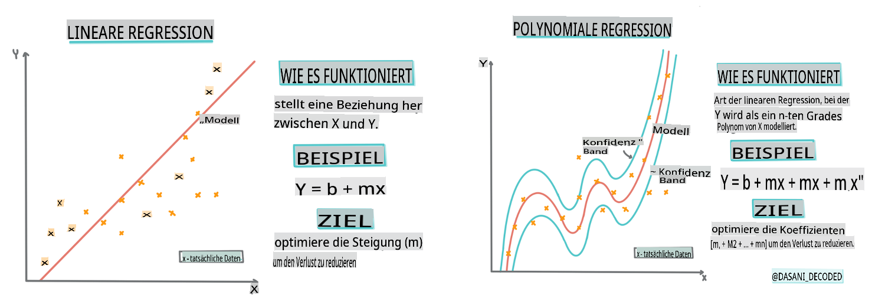
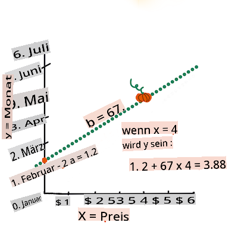

# Erstellen Sie ein Regressionsmodell mit Scikit-learn: Regression auf vier Arten


> Infografik von [Dasani Madipalli](https://twitter.com/dasani_decoded)
## [Vorlesungsquiz](https://gray-sand-07a10f403.1.azurestaticapps.net/quiz/13/)

> ### [Diese Lektion ist auch in R verfügbar!](../../../../2-Regression/3-Linear/solution/R/lesson_3.html)
### Einführung 

Bisher haben Sie erkundet, was Regression ist, mit Beispieldaten aus dem Preisdaten-Set für Kürbisse, das wir in dieser Lektion verwenden werden. Sie haben auch eine Visualisierung mit Matplotlib erstellt.

Jetzt sind Sie bereit, tiefer in die Regression für ML einzutauchen. Während die Visualisierung Ihnen hilft, Daten zu verstehen, kommt die wahre Kraft des maschinellen Lernens vom _Training von Modellen_. Modelle werden mit historischen Daten trainiert, um automatisch Datenabhängigkeiten zu erfassen, und sie ermöglichen es Ihnen, Ergebnisse für neue Daten vorherzusagen, die das Modell zuvor nicht gesehen hat.

In dieser Lektion werden Sie mehr über zwei Arten von Regression lernen: _einfache lineare Regression_ und _polynomiale Regression_, sowie einige der mathematischen Grundlagen dieser Techniken. Diese Modelle ermöglichen es uns, die Preise von Kürbissen basierend auf unterschiedlichen Eingabedaten vorherzusagen. 

[](https://youtu.be/CRxFT8oTDMg "ML für Anfänger - Verständnis der linearen Regression")

> 🎥 Klicken Sie auf das Bild oben für eine kurze Videoübersicht zur linearen Regression.

> In diesem Lehrplan gehen wir von minimalen mathematischen Kenntnissen aus und versuchen, ihn für Studenten aus anderen Bereichen zugänglich zu machen. Achten Sie auf Hinweise, 🧮 Markierungen, Diagramme und andere Lernwerkzeuge zur Unterstützung des Verständnisses.

### Voraussetzungen

Sie sollten jetzt mit der Struktur der Kürbisdaten, die wir untersuchen, vertraut sein. Sie finden diese vorab geladen und vorgefiltert in der _notebook.ipynb_-Datei dieser Lektion. In der Datei wird der Kürbispreis pro Scheffel in einem neuen Datenrahmen angezeigt. Stellen Sie sicher, dass Sie diese Notebooks in Kernen in Visual Studio Code ausführen können.

### Vorbereitung

Zur Erinnerung: Sie laden diese Daten, um Fragen dazu zu stellen.

- Wann ist die beste Zeit, um Kürbisse zu kaufen? 
- Welchen Preis kann ich für eine Kiste Miniaturkürbisse erwarten?
- Sollte ich sie in halben Scheffeln oder in der 1 1/9 Scheffel-Box kaufen?
Lassen Sie uns weiter in diese Daten eintauchen.

In der vorherigen Lektion haben Sie einen Pandas-Datenrahmen erstellt und ihn mit einem Teil des ursprünglichen Datensatzes gefüllt, wobei die Preise nach Scheffel standardisiert wurden. Dadurch konnten Sie jedoch nur etwa 400 Datenpunkte sammeln und nur für die Herbstmonate.

Werfen Sie einen Blick auf die Daten, die wir in dem begleitenden Notebook dieser Lektion vorab geladen haben. Die Daten sind vorab geladen und ein erster Streudiagramm ist erstellt, um die Monatsdaten zu zeigen. Vielleicht können wir etwas mehr über die Natur der Daten erfahren, indem wir sie weiter bereinigen.

## Eine lineare Regressionslinie

Wie Sie in Lektion 1 gelernt haben, ist das Ziel einer linearen Regressionsübung, eine Linie zu zeichnen, um:

- **Variablenbeziehungen zu zeigen**. Die Beziehung zwischen Variablen darzustellen.
- **Vorhersagen zu treffen**. Genaue Vorhersagen darüber zu treffen, wo ein neuer Datenpunkt in Bezug auf diese Linie fallen würde. 
 
Es ist typisch für die **Kleinste-Quadrate-Regressionsmethode**, diese Art von Linie zu zeichnen. Der Begriff 'kleinste Quadrate' bedeutet, dass alle Datenpunkte rund um die Regressionslinie quadriert und dann addiert werden. Idealerweise ist diese Endsumme so klein wie möglich, da wir eine niedrige Fehlerzahl oder `least-squares` wünschen.

Wir tun dies, da wir eine Linie modellieren möchten, die die geringste kumulierte Distanz zu allen unseren Datenpunkten hat. Wir quadrieren auch die Terme, bevor wir sie addieren, da wir uns um ihre Größe und nicht um ihre Richtung kümmern.

> **🧮 Zeigen Sie mir die Mathematik** 
> 
> Diese Linie, die als _beste Anpassungslinie_ bezeichnet wird, kann durch [eine Gleichung](https://en.wikipedia.org/wiki/Simple_linear_regression) ausgedrückt werden: 
> 
> ```
> Y = a + bX
> ```
>
> `X` is the 'explanatory variable'. `Y` is the 'dependent variable'. The slope of the line is `b` and `a` is the y-intercept, which refers to the value of `Y` when `X = 0`. 
>
>
>
> First, calculate the slope `b`. Infographic by [Jen Looper](https://twitter.com/jenlooper)
>
> In other words, and referring to our pumpkin data's original question: "predict the price of a pumpkin per bushel by month", `X` would refer to the price and `Y` would refer to the month of sale. 
>
>
>
> Calculate the value of Y. If you're paying around $4, it must be April! Infographic by [Jen Looper](https://twitter.com/jenlooper)
>
> The math that calculates the line must demonstrate the slope of the line, which is also dependent on the intercept, or where `Y` is situated when `X = 0`.
>
> You can observe the method of calculation for these values on the [Math is Fun](https://www.mathsisfun.com/data/least-squares-regression.html) web site. Also visit [this Least-squares calculator](https://www.mathsisfun.com/data/least-squares-calculator.html) to watch how the numbers' values impact the line.

## Correlation

One more term to understand is the **Correlation Coefficient** between given X and Y variables. Using a scatterplot, you can quickly visualize this coefficient. A plot with datapoints scattered in a neat line have high correlation, but a plot with datapoints scattered everywhere between X and Y have a low correlation.

A good linear regression model will be one that has a high (nearer to 1 than 0) Correlation Coefficient using the Least-Squares Regression method with a line of regression.

✅ Run the notebook accompanying this lesson and look at the Month to Price scatterplot. Does the data associating Month to Price for pumpkin sales seem to have high or low correlation, according to your visual interpretation of the scatterplot? Does that change if you use more fine-grained measure instead of `Month`, eg. *day of the year* (i.e. number of days since the beginning of the year)?

In the code below, we will assume that we have cleaned up the data, and obtained a data frame called `new_pumpkins`, similar to the following:

ID | Month | DayOfYear | Variety | City | Package | Low Price | High Price | Price
---|-------|-----------|---------|------|---------|-----------|------------|-------
70 | 9 | 267 | PIE TYPE | BALTIMORE | 1 1/9 bushel cartons | 15.0 | 15.0 | 13.636364
71 | 9 | 267 | PIE TYPE | BALTIMORE | 1 1/9 bushel cartons | 18.0 | 18.0 | 16.363636
72 | 10 | 274 | PIE TYPE | BALTIMORE | 1 1/9 bushel cartons | 18.0 | 18.0 | 16.363636
73 | 10 | 274 | PIE TYPE | BALTIMORE | 1 1/9 bushel cartons | 17.0 | 17.0 | 15.454545
74 | 10 | 281 | PIE TYPE | BALTIMORE | 1 1/9 bushel cartons | 15.0 | 15.0 | 13.636364

> The code to clean the data is available in [`notebook.ipynb`](../../../../2-Regression/3-Linear/notebook.ipynb). We have performed the same cleaning steps as in the previous lesson, and have calculated `DayOfYear`-Spalte mit folgendem Ausdruck:

```python
day_of_year = pd.to_datetime(pumpkins['Date']).apply(lambda dt: (dt-datetime(dt.year,1,1)).days)
```

Jetzt, da Sie ein Verständnis für die Mathematik hinter der linearen Regression haben, lassen Sie uns ein Regressionsmodell erstellen, um zu sehen, ob wir vorhersagen können, welches Paket von Kürbissen die besten Kürbispreise haben wird. Jemand, der Kürbisse für ein Feiertagskürbisfeld kauft, möchte diese Informationen, um seine Käufe von Kürbispaketen für das Feld zu optimieren.

## Auf der Suche nach Korrelation

[](https://youtu.be/uoRq-lW2eQo "ML für Anfänger - Auf der Suche nach Korrelation: Der Schlüssel zur linearen Regression")

> 🎥 Klicken Sie auf das Bild oben für eine kurze Videoübersicht zur Korrelation.

In der vorherigen Lektion haben Sie wahrscheinlich gesehen, dass der durchschnittliche Preis für verschiedene Monate so aussieht:


Dies deutet darauf hin, dass es eine gewisse Korrelation geben sollte, und wir können versuchen, ein lineares Regressionsmodell zu trainieren, um die Beziehung zwischen der `Month` and `Price`, or between `DayOfYear` and `Price`. Here is the scatter plot that shows the latter relationship:

 

Let's see if there is a correlation using the `corr`-Funktion vorherzusagen:

```python
print(new_pumpkins['Month'].corr(new_pumpkins['Price']))
print(new_pumpkins['DayOfYear'].corr(new_pumpkins['Price']))
```

Es scheint, dass die Korrelation ziemlich klein ist, -0.15, durch die `Month` and -0.17 by the `DayOfMonth`, but there could be another important relationship. It looks like there are different clusters of prices corresponding to different pumpkin varieties. To confirm this hypothesis, let's plot each pumpkin category using a different color. By passing an `ax` parameter to the `scatter`-Plot-Funktion können wir alle Punkte im selben Diagramm darstellen:

```python
ax=None
colors = ['red','blue','green','yellow']
for i,var in enumerate(new_pumpkins['Variety'].unique()):
    df = new_pumpkins[new_pumpkins['Variety']==var]
    ax = df.plot.scatter('DayOfYear','Price',ax=ax,c=colors[i],label=var)
```

 

Unsere Untersuchung legt nahe, dass die Sorte einen größeren Einfluss auf den Gesamtpreis hat als das tatsächliche Verkaufsdatum. Wir können dies mit einem Balkendiagramm sehen:

```python
new_pumpkins.groupby('Variety')['Price'].mean().plot(kind='bar')
```

 

Lassen Sie uns im Moment nur auf eine Kürbissorte, den 'Pie-Typ', konzentrieren und sehen, welchen Einfluss das Datum auf den Preis hat:

```python
pie_pumpkins = new_pumpkins[new_pumpkins['Variety']=='PIE TYPE']
pie_pumpkins.plot.scatter('DayOfYear','Price') 
```
 

Wenn wir jetzt die Korrelation zwischen `Price` and `DayOfYear` using `corr` function, we will get something like `-0.27` berechnen, bedeutet dies, dass es sinnvoll ist, ein prädiktives Modell zu trainieren.

> Bevor wir ein lineares Regressionsmodell trainieren, ist es wichtig sicherzustellen, dass unsere Daten sauber sind. Lineare Regression funktioniert nicht gut mit fehlenden Werten, daher ist es sinnvoll, alle leeren Zellen zu entfernen:

```python
pie_pumpkins.dropna(inplace=True)
pie_pumpkins.info()
```

Ein weiterer Ansatz wäre, diese leeren Werte mit Mittelwerten aus der entsprechenden Spalte zu füllen.

## Einfache lineare Regression

[](https://youtu.be/e4c_UP2fSjg "ML für Anfänger - Lineare und polynomiale Regression mit Scikit-learn")

> 🎥 Klicken Sie auf das Bild oben für eine kurze Videoübersicht zur linearen und polynomialen Regression.

Um unser lineares Regressionsmodell zu trainieren, verwenden wir die **Scikit-learn**-Bibliothek.

```python
from sklearn.linear_model import LinearRegression
from sklearn.metrics import mean_squared_error
from sklearn.model_selection import train_test_split
```

Wir beginnen damit, Eingabewerte (Merkmale) und die erwartete Ausgabe (Label) in separate numpy-Arrays zu trennen:

```python
X = pie_pumpkins['DayOfYear'].to_numpy().reshape(-1,1)
y = pie_pumpkins['Price']
```

> Beachten Sie, dass wir `reshape` auf den Eingabedaten durchführen mussten, damit das Paket für die lineare Regression es korrekt versteht. Die lineare Regression erwartet ein 2D-Array als Eingabe, bei dem jede Zeile des Arrays einem Vektor von Eingabemerkmalen entspricht. In unserem Fall, da wir nur eine Eingabe haben, benötigen wir ein Array mit der Form N×1, wobei N die Größe des Datensatzes ist.

Dann müssen wir die Daten in Trainings- und Testdatensätze aufteilen, damit wir unser Modell nach dem Training validieren können:

```python
X_train, X_test, y_train, y_test = train_test_split(X, y, test_size=0.2, random_state=0)
```

Schließlich benötigt das Training des tatsächlichen linearen Regressionsmodells nur zwei Codezeilen. Wir definieren die Methode `LinearRegression` object, and fit it to our data using the `fit`:

```python
lin_reg = LinearRegression()
lin_reg.fit(X_train,y_train)
```

Der `LinearRegression` object after `fit`-ting contains all the coefficients of the regression, which can be accessed using `.coef_` property. In our case, there is just one coefficient, which should be around `-0.017`. It means that prices seem to drop a bit with time, but not too much, around 2 cents per day. We can also access the intersection point of the regression with Y-axis using `lin_reg.intercept_` - it will be around `21` in unserem Fall, was den Preis zu Beginn des Jahres angibt.

Um zu sehen, wie genau unser Modell ist, können wir die Preise in einem Testdatensatz vorhersagen und dann messen, wie nah unsere Vorhersagen an den erwarteten Werten sind. Dies kann mit der mittleren quadratischen Fehler (MSE)-Metrik erfolgen, die der Durchschnitt aller quadrierten Unterschiede zwischen dem erwarteten und dem vorhergesagten Wert ist.

```python
pred = lin_reg.predict(X_test)

mse = np.sqrt(mean_squared_error(y_test,pred))
print(f'Mean error: {mse:3.3} ({mse/np.mean(pred)*100:3.3}%)')
```

Unser Fehler scheint bei etwa 2 Punkten zu liegen, was ~17% entspricht. Nicht besonders gut. Ein weiterer Indikator für die Modellqualität ist der **Bestimmtheitskoeffizient**, der wie folgt ermittelt werden kann:

```python
score = lin_reg.score(X_train,y_train)
print('Model determination: ', score)
```
Wenn der Wert 0 ist, bedeutet das, dass das Modell die Eingabedaten nicht berücksichtigt und als *schlechtester linearer Prädiktor* fungiert, was einfach einem Mittelwert des Ergebnisses entspricht. Ein Wert von 1 bedeutet, dass wir alle erwarteten Ausgaben perfekt vorhersagen können. In unserem Fall liegt der Koeffizient bei etwa 0.06, was ziemlich niedrig ist.

Wir können auch die Testdaten zusammen mit der Regressionslinie darstellen, um besser zu sehen, wie die Regression in unserem Fall funktioniert:

```python
plt.scatter(X_test,y_test)
plt.plot(X_test,pred)
```


## Polynomiale Regression

Eine andere Art der linearen Regression ist die polynomiale Regression. Während es manchmal eine lineare Beziehung zwischen Variablen gibt – je größer der Kürbis im Volumen, desto höher der Preis – können solche Beziehungen manchmal nicht als Fläche oder gerade Linie dargestellt werden. 

✅ Hier sind [einige weitere Beispiele](https://online.stat.psu.edu/stat501/lesson/9/9.8) von Daten, die eine polynomiale Regression verwenden könnten.

Werfen Sie einen weiteren Blick auf die Beziehung zwischen Datum und Preis. Sieht dieses Streudiagramm so aus, als sollte es unbedingt durch eine gerade Linie analysiert werden? Können die Preise nicht schwanken? In diesem Fall können Sie eine polynomiale Regression versuchen.

✅ Polynome sind mathematische Ausdrücke, die aus einer oder mehreren Variablen und Koeffizienten bestehen können.

Die polynomiale Regression erstellt eine gekrümmte Linie, um nichtlineare Daten besser anzupassen. In unserem Fall sollten wir in der Lage sein, unsere Daten mit einer parabolischen Kurve anzupassen, wenn wir eine quadrierte `DayOfYear`-Variable in die Eingabedaten aufnehmen, die an einem bestimmten Punkt im Jahr ein Minimum hat.

Scikit-learn enthält eine hilfreiche [Pipeline-API](https://scikit-learn.org/stable/modules/generated/sklearn.pipeline.make_pipeline.html?highlight=pipeline#sklearn.pipeline.make_pipeline), um verschiedene Schritte der Datenverarbeitung zu kombinieren. Eine **Pipeline** ist eine Kette von **Schätzern**. In unserem Fall werden wir eine Pipeline erstellen, die zuerst polynomiale Merkmale zu unserem Modell hinzufügt und dann die Regression trainiert:

```python
from sklearn.preprocessing import PolynomialFeatures
from sklearn.pipeline import make_pipeline

pipeline = make_pipeline(PolynomialFeatures(2), LinearRegression())

pipeline.fit(X_train,y_train)
```

Durch die Verwendung von `PolynomialFeatures(2)` means that we will include all second-degree polynomials from the input data. In our case it will just mean `DayOfYear`<sup>2</sup>, but given two input variables X and Y, this will add X<sup>2</sup>, XY and Y<sup>2</sup>. We may also use higher degree polynomials if we want.

Pipelines can be used in the same manner as the original `LinearRegression` object, i.e. we can `fit` the pipeline, and then use `predict` to get the prediction results. Here is the graph showing test data, and the approximation curve:


Using Polynomial Regression, we can get slightly lower MSE and higher determination, but not significantly. We need to take into account other features!

> You can see that the minimal pumpkin prices are observed somewhere around Halloween. How can you explain this? 

🎃 Congratulations, you just created a model that can help predict the price of pie pumpkins. You can probably repeat the same procedure for all pumpkin types, but that would be tedious. Let's learn now how to take pumpkin variety into account in our model!

## Categorical Features

In the ideal world, we want to be able to predict prices for different pumpkin varieties using the same model. However, the `Variety` column is somewhat different from columns like `Month`, because it contains non-numeric values. Such columns are called **categorical**.

[](https://youtu.be/DYGliioIAE0 "ML for beginners - Categorical Feature Predictions with Linear Regression")

> 🎥 Click the image above for a short video overview of using categorical features.

Here you can see how average price depends on variety:


To take variety into account, we first need to convert it to numeric form, or **encode** it. There are several way we can do it:

* Simple **numeric encoding** will build a table of different varieties, and then replace the variety name by an index in that table. This is not the best idea for linear regression, because linear regression takes the actual numeric value of the index, and adds it to the result, multiplying by some coefficient. In our case, the relationship between the index number and the price is clearly non-linear, even if we make sure that indices are ordered in some specific way.
* **One-hot encoding** will replace the `Variety` column by 4 different columns, one for each variety. Each column will contain `1` if the corresponding row is of a given variety, and `0` anders. Das bedeutet, dass es vier Koeffizienten in der linearen Regression geben wird, einen für jede Kürbissorte, die für den "Startpreis" (oder eher "zusätzlichen Preis") für diese spezielle Sorte verantwortlich ist.

Der folgende Code zeigt, wie wir eine Sorten-Einmalcodierung durchführen können:

```python
pd.get_dummies(new_pumpkins['Variety'])
```

 ID | FAIRYTALE | MINIATURE | MIXED HEIRLOOM VARIETIES | PIE TYPE
----|-----------|-----------|--------------------------|----------
70 | 0 | 0 | 0 | 1
71 | 0 | 0 | 0 | 1
... | ... | ... | ... | ...
1738 | 0 | 1 | 0 | 0
1739 | 0 | 1 | 0 | 0
1740 | 0 | 1 | 0 | 0
1741 | 0 | 1 | 0 | 0
1742 | 0 | 1 | 0 | 0

Um die lineare Regression mit der einmal codierten Sorte als Eingabe zu trainieren, müssen wir nur die `X` and `y`-Daten korrekt initialisieren:

```python
X = pd.get_dummies(new_pumpkins['Variety'])
y = new_pumpkins['Price']
```

Der Rest des Codes ist derselbe wie der, den wir oben verwendet haben, um die lineare Regression zu trainieren. Wenn Sie es versuchen, werden Sie sehen, dass der mittlere quadratische Fehler ungefähr gleich ist, aber wir erhalten einen viel höheren Bestimmtheitskoeffizienten (~77%). Um noch genauere Vorhersagen zu erhalten, können wir mehr kategoriale Merkmale sowie numerische Merkmale wie `Month` or `DayOfYear`. To get one large array of features, we can use `join` berücksichtigen:

```python
X = pd.get_dummies(new_pumpkins['Variety']) \
        .join(new_pumpkins['Month']) \
        .join(pd.get_dummies(new_pumpkins['City'])) \
        .join(pd.get_dummies(new_pumpkins['Package']))
y = new_pumpkins['Price']
```

Hier berücksichtigen wir auch den `City` and `Package`-Typ, was uns MSE 2.84 (10%) und eine Bestimmung von 0.94 gibt!

## Alles zusammenbringen

Um das beste Modell zu erstellen, können wir kombinierte (einmal codierte kategoriale + numerische) Daten aus dem obigen Beispiel zusammen mit der polynomialen Regression verwenden. Hier ist der vollständige Code zu Ihrer Bequemlichkeit:

```python
# set up training data
X = pd.get_dummies(new_pumpkins['Variety']) \
        .join(new_pumpkins['Month']) \
        .join(pd.get_dummies(new_pumpkins['City'])) \
        .join(pd.get_dummies(new_pumpkins['Package']))
y = new_pumpkins['Price']

# make train-test split
X_train, X_test, y_train, y_test = train_test_split(X, y, test_size=0.2, random_state=0)

# setup and train the pipeline
pipeline = make_pipeline(PolynomialFeatures(2), LinearRegression())
pipeline.fit(X_train,y_train)

# predict results for test data
pred = pipeline.predict(X_test)

# calculate MSE and determination
mse = np.sqrt(mean_squared_error(y_test,pred))
print(f'Mean error: {mse:3.3} ({mse/np.mean(pred)*100:3.3}%)')

score = pipeline.score(X_train,y_train)
print('Model determination: ', score)
```

Das sollte uns den besten Bestimmtheitskoeffizienten von fast 97% und MSE=2.23 (~8% Vorhersagefehler) geben.

| Modell | MSE | Bestimmung |
|-------|-----|---------------|
| `DayOfYear` Linear | 2.77 (17.2%) | 0.07 |
| `DayOfYear` Polynomial | 2.73 (17.0%) | 0.08 |
| `Variety` Linear | 5.24 (19.7%) | 0.77 |
| Alle Merkmale Linear | 2.84 (10.5%) | 0.94 |
| Alle Merkmale Polynomial | 2.23 (8.25%) | 0.97 |

🏆 Gut gemacht! Sie haben vier Regressionsmodelle in einer Lektion erstellt und die Modellqualität auf 97% verbessert. Im letzten Abschnitt zur Regression werden Sie über logistische Regression lernen, um Kategorien zu bestimmen.

---
## 🚀Herausforderung

Testen Sie mehrere verschiedene Variablen in diesem Notebook, um zu sehen, wie die Korrelation mit der Modellgenauigkeit übereinstimmt.

## [Nachlesungsquiz](https://gray-sand-07a10f403.1.azurestaticapps.net/quiz/14/)

## Überprüfung & Selbststudium

In dieser Lektion haben wir über lineare Regression gelernt. Es gibt andere wichtige Arten von Regression. Lesen Sie über Schrittweise, Ridge, Lasso und Elasticnet-Techniken. Ein guter Kurs, um mehr zu lernen, ist der [Stanford Statistical Learning-Kurs](https://online.stanford.edu/courses/sohs-ystatslearning-statistical-learning)

## Aufgabe 

[Ein Modell erstellen](assignment.md)

**Haftungsausschluss**:  
Dieses Dokument wurde mithilfe von KI-gestützten Übersetzungsdiensten maschinell übersetzt. Obwohl wir uns um Genauigkeit bemühen, beachten Sie bitte, dass automatisierte Übersetzungen Fehler oder Ungenauigkeiten enthalten können. Das Originaldokument in seiner ursprünglichen Sprache sollte als die maßgebliche Quelle betrachtet werden. Für kritische Informationen wird eine professionelle menschliche Übersetzung empfohlen. Wir übernehmen keine Haftung für Missverständnisse oder Fehlinterpretationen, die aus der Verwendung dieser Übersetzung resultieren.