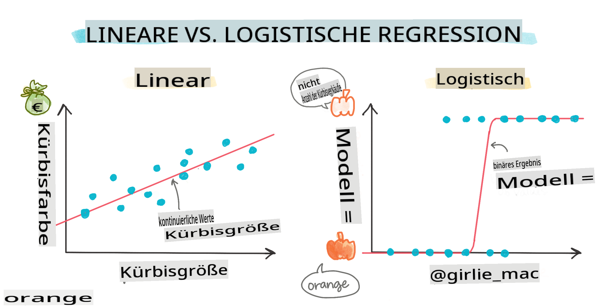
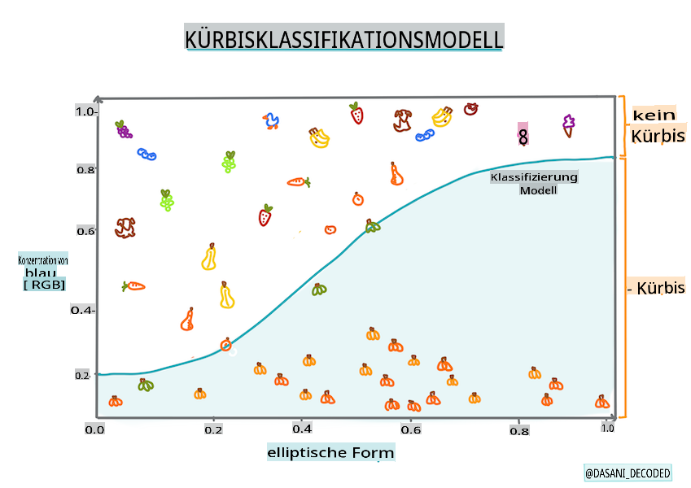
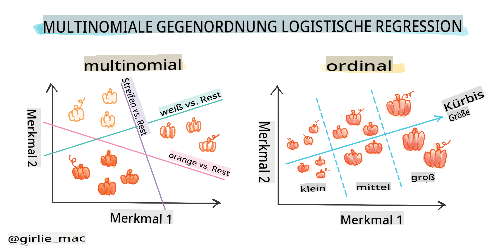
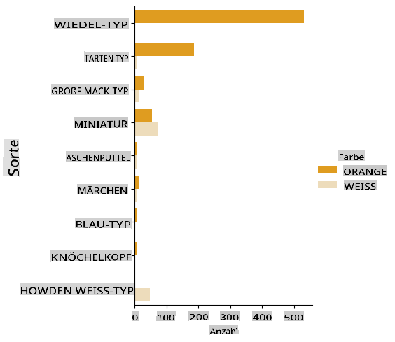
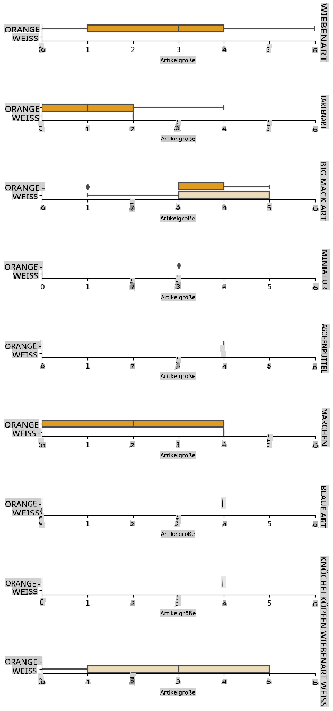
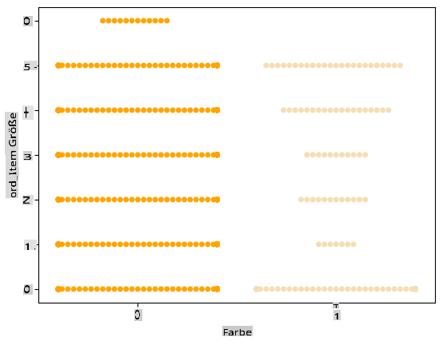
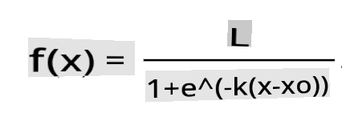

# Logistische Regression zur Vorhersage von Kategorien



## [Vorlesungsquiz](https://gray-sand-07a10f403.1.azurestaticapps.net/quiz/15/)

> ### [Diese Lektion ist auch in R verfügbar!](../../../../2-Regression/4-Logistic/solution/R/lesson_4.html)

## Einführung

In dieser letzten Lektion über Regression, eine der grundlegenden _klassischen_ ML-Techniken, werfen wir einen Blick auf die logistische Regression. Diese Technik verwenden Sie, um Muster zur Vorhersage binärer Kategorien zu entdecken. Ist diese Süßigkeit Schokolade oder nicht? Ist diese Krankheit ansteckend oder nicht? Wird dieser Kunde dieses Produkt wählen oder nicht? 

In dieser Lektion lernen Sie:

- Eine neue Bibliothek zur Datenvisualisierung
- Techniken für die logistische Regression

✅ Vertiefen Sie Ihr Verständnis für die Arbeit mit dieser Art von Regression in diesem [Lernmodul](https://docs.microsoft.com/learn/modules/train-evaluate-classification-models?WT.mc_id=academic-77952-leestott)

## Voraussetzungen

Nachdem wir mit den Kürbis-Daten gearbeitet haben, sind wir nun genug damit vertraut, um zu erkennen, dass es eine binäre Kategorie gibt, mit der wir arbeiten können: `Color`.

Lassen Sie uns ein Modell für die logistische Regression erstellen, um vorherzusagen, _welche Farbe ein gegebener Kürbis wahrscheinlich hat_ (orange 🎃 oder weiß 👻).

> Warum sprechen wir in einer Lektion über binäre Klassifizierung im Kontext von Regression? Nur aus sprachlichen Gründen, da die logistische Regression [tatsächlich eine Klassifizierungsmethode](https://scikit-learn.org/stable/modules/linear_model.html#logistic-regression) ist, wenn auch eine auf linearer Basis. Lernen Sie in der nächsten Lektion über andere Möglichkeiten, Daten zu klassifizieren.

## Definieren Sie die Frage

Für unsere Zwecke werden wir dies als binär ausdrücken: 'Weiß' oder 'Nicht Weiß'. In unserem Datensatz gibt es auch eine Kategorie 'gestreift', aber es gibt nur wenige Instanzen davon, daher werden wir sie nicht verwenden. Sie verschwindet, sobald wir null-Werte aus dem Datensatz entfernen.

> 🎃 Interessante Tatsache: Manchmal nennen wir weiße Kürbisse 'Gespenst'-Kürbisse. Sie sind nicht sehr leicht zu schnitzen, daher sind sie nicht so beliebt wie die orangen, aber sie sehen cool aus! Wir könnten unsere Frage also auch umformulieren: 'Gespenst' oder 'Nicht Gespenst'. 👻

## Über logistische Regression

Die logistische Regression unterscheidet sich in einigen wichtigen Punkten von der linearen Regression, die Sie zuvor gelernt haben.

[](https://youtu.be/KpeCT6nEpBY "ML für Anfänger - Verständnis der logistischen Regression für maschinelles Lernen")

> 🎥 Klicken Sie auf das Bild oben für eine kurze Videoübersicht über die logistische Regression.

### Binäre Klassifizierung

Die logistische Regression bietet nicht die gleichen Funktionen wie die lineare Regression. Erstere bietet eine Vorhersage über eine binäre Kategorie ("weiß oder nicht weiß"), während letztere in der Lage ist, kontinuierliche Werte vorherzusagen, zum Beispiel, gegeben den Ursprung eines Kürbisses und die Erntezeit, _wie viel sein Preis steigen wird_.


> Infografik von [Dasani Madipalli](https://twitter.com/dasani_decoded)

### Weitere Klassifikationen

Es gibt andere Arten von logistischen Regressionen, einschließlich multinomialer und ordinaler:

- **Multinomial**, die mehr als eine Kategorie umfasst - "Orange, Weiß und Gestreift".
- **Ordinal**, die geordnete Kategorien umfasst, nützlich, wenn wir unsere Ergebnisse logisch ordnen wollen, wie unsere Kürbisse, die nach einer endlichen Anzahl von Größen (mini, sm, med, lg, xl, xxl) geordnet sind.



### Variablen MÜSSEN nicht korrelieren

Erinnern Sie sich, wie die lineare Regression besser mit korrelierten Variablen funktionierte? Die logistische Regression ist das Gegenteil - die Variablen müssen sich nicht anpassen. Das funktioniert für diese Daten, die einigermaßen schwache Korrelationen aufweisen.

### Sie benötigen viele saubere Daten

Die logistische Regression liefert genauere Ergebnisse, wenn Sie mehr Daten verwenden; unser kleiner Datensatz ist für diese Aufgabe nicht optimal, also denken Sie daran.

[](https://youtu.be/B2X4H9vcXTs "ML für Anfänger - Datenanalyse und -vorbereitung für logistische Regression")

> 🎥 Klicken Sie auf das Bild oben für eine kurze Videoübersicht über die Vorbereitung von Daten für die lineare Regression

✅ Denken Sie über die Arten von Daten nach, die sich gut für die logistische Regression eignen würden.

## Übung - Daten bereinigen

Zuerst reinigen Sie die Daten ein wenig, indem Sie null-Werte entfernen und nur einige der Spalten auswählen:

1. Fügen Sie den folgenden Code hinzu:

    ```python
  
    columns_to_select = ['City Name','Package','Variety', 'Origin','Item Size', 'Color']
    pumpkins = full_pumpkins.loc[:, columns_to_select]

    pumpkins.dropna(inplace=True)
    ```

    Sie können jederzeit einen Blick auf Ihr neues DataFrame werfen:

    ```python
    pumpkins.info
    ```

### Visualisierung - kategoriales Diagramm

Bis jetzt haben Sie das [Starter-Notebook](../../../../2-Regression/4-Logistic/notebook.ipynb) mit Kürbisdaten erneut geladen und es so bereinigt, dass ein Datensatz mit einigen Variablen, einschließlich `Color`, erhalten bleibt. Lassen Sie uns das DataFrame im Notebook mit einer anderen Bibliothek visualisieren: [Seaborn](https://seaborn.pydata.org/index.html), die auf Matplotlib basiert, das wir zuvor verwendet haben. 

Seaborn bietet einige tolle Möglichkeiten, Ihre Daten zu visualisieren. Zum Beispiel können Sie die Verteilungen der Daten für jede `Variety` und `Color` in einem kategorialen Diagramm vergleichen.

1. Erstellen Sie ein solches Diagramm, indem Sie `catplot` function, using our pumpkin data `pumpkins` verwenden und eine Farbzuordnung für jede Kürbiskategorie (orange oder weiß) angeben:

    ```python
    import seaborn as sns
    
    palette = {
    'ORANGE': 'orange',
    'WHITE': 'wheat',
    }

    sns.catplot(
    data=pumpkins, y="Variety", hue="Color", kind="count",
    palette=palette, 
    )
    ```

    

    Durch die Beobachtung der Daten können Sie sehen, wie die Farb-Daten mit der Sorte zusammenhängt.

    ✅ Angesichts dieses kategorialen Diagramms, welche interessanten Erkundungen können Sie sich vorstellen?

### Datenvorverarbeitung: Merkmals- und Label-Codierung
Unser Kürbis-Datensatz enthält Zeichenfolgenwerte für alle seine Spalten. Mit kategorialen Daten zu arbeiten, ist für Menschen intuitiv, aber nicht für Maschinen. Maschinenlernalgorithmen funktionieren gut mit Zahlen. Daher ist die Codierung ein sehr wichtiger Schritt in der Datenvorverarbeitungsphase, da sie es uns ermöglicht, kategoriale Daten in numerische Daten umzuwandeln, ohne Informationen zu verlieren. Eine gute Codierung führt zum Aufbau eines guten Modells.

Für die Merkmalscodierung gibt es zwei Haupttypen von Codierern:

1. Ordinaler Codierer: Er eignet sich gut für ordinale Variablen, bei denen die Daten einer logischen Reihenfolge folgen, wie die Spalte `Item Size` in unserem Datensatz. Er erstellt eine Zuordnung, sodass jede Kategorie durch eine Zahl repräsentiert wird, die der Reihenfolge der Kategorie in der Spalte entspricht.

    ```python
    from sklearn.preprocessing import OrdinalEncoder

    item_size_categories = [['sml', 'med', 'med-lge', 'lge', 'xlge', 'jbo', 'exjbo']]
    ordinal_features = ['Item Size']
    ordinal_encoder = OrdinalEncoder(categories=item_size_categories)
    ```

2. Kategorialer Codierer: Er eignet sich gut für nominale Variablen, bei denen die Daten keiner logischen Reihenfolge folgen, wie alle Merkmale, die nicht `Item Size` in unserem Datensatz sind. Es handelt sich um eine One-Hot-Codierung, was bedeutet, dass jede Kategorie durch eine binäre Spalte repräsentiert wird: Die codierte Variable ist gleich 1, wenn der Kürbis zu dieser Sorte gehört, und 0, andernfalls.

    ```python
    from sklearn.preprocessing import OneHotEncoder

    categorical_features = ['City Name', 'Package', 'Variety', 'Origin']
    categorical_encoder = OneHotEncoder(sparse_output=False)
    ```
Dann wird `ColumnTransformer` verwendet, um mehrere Codierer in einem einzigen Schritt zu kombinieren und sie auf die entsprechenden Spalten anzuwenden.

```python
    from sklearn.compose import ColumnTransformer
    
    ct = ColumnTransformer(transformers=[
        ('ord', ordinal_encoder, ordinal_features),
        ('cat', categorical_encoder, categorical_features)
        ])
    
    ct.set_output(transform='pandas')
    encoded_features = ct.fit_transform(pumpkins)
```
Andererseits verwenden wir zur Codierung des Labels die `LabelEncoder`-Klasse von Scikit-learn, die eine Hilfsklasse ist, um Labels zu normalisieren, sodass sie nur Werte zwischen 0 und n_classes-1 (hier 0 und 1) enthalten.

```python
    from sklearn.preprocessing import LabelEncoder

    label_encoder = LabelEncoder()
    encoded_label = label_encoder.fit_transform(pumpkins['Color'])
```
Sobald wir die Merkmale und das Label codiert haben, können wir sie in ein neues DataFrame `encoded_pumpkins` zusammenführen.

```python
    encoded_pumpkins = encoded_features.assign(Color=encoded_label)
```
✅ Was sind die Vorteile der Verwendung eines ordinalen Codierers für die `Item Size` column?

### Analyse relationships between variables

Now that we have pre-processed our data, we can analyse the relationships between the features and the label to grasp an idea of how well the model will be able to predict the label given the features.
The best way to perform this kind of analysis is plotting the data. We'll be using again the Seaborn `catplot` function, to visualize the relationships between `Item Size`,  `Variety` und `Color` in einem kategorialen Diagramm. Um die Daten besser darzustellen, verwenden wir die codierte `Item Size` column and the unencoded `Variety`-Spalte.

```python
    palette = {
    'ORANGE': 'orange',
    'WHITE': 'wheat',
    }
    pumpkins['Item Size'] = encoded_pumpkins['ord__Item Size']

    g = sns.catplot(
        data=pumpkins,
        x="Item Size", y="Color", row='Variety',
        kind="box", orient="h",
        sharex=False, margin_titles=True,
        height=1.8, aspect=4, palette=palette,
    )
    g.set(xlabel="Item Size", ylabel="").set(xlim=(0,6))
    g.set_titles(row_template="{row_name}")
```


### Verwenden Sie ein Schwarmdiagramm

Da die Farbe eine binäre Kategorie ist (Weiß oder Nicht), benötigt sie 'einen [spezialisierten Ansatz](https://seaborn.pydata.org/tutorial/categorical.html?highlight=bar) zur Visualisierung'. Es gibt andere Möglichkeiten, die Beziehung dieser Kategorie zu anderen Variablen zu visualisieren. 

Sie können Variablen nebeneinander mit Seaborn-Diagrammen visualisieren.

1. Versuchen Sie ein 'Schwarm'-Diagramm, um die Verteilung der Werte anzuzeigen:

    ```python
    palette = {
    0: 'orange',
    1: 'wheat'
    }
    sns.swarmplot(x="Color", y="ord__Item Size", data=encoded_pumpkins, palette=palette)
    ```

    

**Achtung**: Der obige Code könnte eine Warnung erzeugen, da Seaborn nicht in der Lage ist, eine so große Anzahl von Datenpunkten in einem Schwarmdiagramm darzustellen. Eine mögliche Lösung besteht darin, die Größe des Markers zu verringern, indem Sie den Parameter 'size' verwenden. Seien Sie sich jedoch bewusst, dass dies die Lesbarkeit des Diagramms beeinträchtigt.

> **🧮 Zeigen Sie mir die Mathematik**
>
> Die logistische Regression basiert auf dem Konzept der 'maximalen Wahrscheinlichkeit' unter Verwendung von [Sigmoid-Funktionen](https://wikipedia.org/wiki/Sigmoid_function). Eine 'Sigmoid-Funktion' sieht in einem Diagramm wie eine 'S'-Form aus. Sie nimmt einen Wert und ordnet ihn irgendwo zwischen 0 und 1 zu. Ihre Kurve wird auch als 'logistische Kurve' bezeichnet. Ihre Formel sieht so aus:
>
> 
>
> wobei der Mittelpunkt der Sigmoidfunktion am Punkt 0 von x liegt, L der maximale Wert der Kurve ist und k die Steilheit der Kurve darstellt. Wenn das Ergebnis der Funktion mehr als 0,5 beträgt, erhält das betreffende Label die Klasse '1' der binären Wahl. Andernfalls wird es als '0' klassifiziert.

## Erstellen Sie Ihr Modell

Ein Modell zu erstellen, um diese binäre Klassifizierung zu finden, ist in Scikit-learn überraschend unkompliziert.

[](https://youtu.be/MmZS2otPrQ8 "ML für Anfänger - Logistische Regression zur Klassifizierung von Daten")

> 🎥 Klicken Sie auf das Bild oben für eine kurze Videoübersicht über den Aufbau eines Modells für die lineare Regression

1. Wählen Sie die Variablen aus, die Sie in Ihrem Klassifikationsmodell verwenden möchten, und teilen Sie die Trainings- und Testdaten auf, indem Sie `train_test_split()` aufrufen:

    ```python
    from sklearn.model_selection import train_test_split
    
    X = encoded_pumpkins[encoded_pumpkins.columns.difference(['Color'])]
    y = encoded_pumpkins['Color']

    X_train, X_test, y_train, y_test = train_test_split(X, y, test_size=0.2, random_state=0)
    
    ```

2. Jetzt können Sie Ihr Modell trainieren, indem Sie `fit()` mit Ihren Trainingsdaten aufrufen und das Ergebnis ausgeben:

    ```python
    from sklearn.metrics import f1_score, classification_report 
    from sklearn.linear_model import LogisticRegression

    model = LogisticRegression()
    model.fit(X_train, y_train)
    predictions = model.predict(X_test)

    print(classification_report(y_test, predictions))
    print('Predicted labels: ', predictions)
    print('F1-score: ', f1_score(y_test, predictions))
    ```

    Werfen Sie einen Blick auf die Punktzahl Ihres Modells. Es ist nicht schlecht, wenn man bedenkt, dass Sie nur etwa 1000 Datenzeilen haben:

    ```output
                       precision    recall  f1-score   support
    
                    0       0.94      0.98      0.96       166
                    1       0.85      0.67      0.75        33
    
        accuracy                                0.92       199
        macro avg           0.89      0.82      0.85       199
        weighted avg        0.92      0.92      0.92       199
    
        Predicted labels:  [0 0 0 0 0 0 0 0 0 0 0 0 0 0 0 0 0 0 0 0 1 0 0 1 0 0 0 0 0 0 0 0 1 0 0 0 0
        0 0 0 0 0 1 0 1 0 0 1 0 0 0 0 0 1 0 1 0 1 0 1 0 0 0 0 0 0 0 0 0 0 0 0 0 0
        1 0 0 0 0 0 0 0 1 0 0 0 0 0 0 0 1 0 0 0 0 0 0 0 0 1 0 1 0 0 0 0 0 0 0 1 0
        0 0 0 0 0 0 0 0 0 0 0 0 0 0 0 0 0 0 0 0 0 1 0 0 0 0 0 0 0 0 1 0 0 0 1 1 0
        0 0 0 0 1 0 0 0 0 0 1 0 0 0 0 0 0 0 0 0 0 0 0 0 0 0 0 0 0 0 0 0 0 0 0 0 1
        0 0 0 1 0 0 0 0 0 0 0 0 1 1]
        F1-score:  0.7457627118644068
    ```

## Bessere Verständlichkeit durch eine Verwirrungsmatrix

Während Sie einen Punktbericht über [Begriffe](https://scikit-learn.org/stable/modules/generated/sklearn.metrics.classification_report.html?highlight=classification_report#sklearn.metrics.classification_report) erhalten können, indem Sie die oben genannten Elemente ausdrucken, können Sie Ihr Modell möglicherweise leichter verstehen, indem Sie eine [Verwirrungsmatrix](https://scikit-learn.org/stable/modules/model_evaluation.html#confusion-matrix) verwenden, um zu verstehen, wie das Modell funktioniert.

> 🎓 Eine '[Verwirrungsmatrix](https://wikipedia.org/wiki/Confusion_matrix)' (oder 'Fehlermatrix') ist eine Tabelle, die die wahren und falschen Positiven und Negativen Ihres Modells ausdrückt und somit die Genauigkeit der Vorhersagen misst.

1. Um eine Verwirrungsmatrix zu verwenden, rufen Sie `confusion_matrix()` auf:

    ```python
    from sklearn.metrics import confusion_matrix
    confusion_matrix(y_test, predictions)
    ```

    Werfen Sie einen Blick auf die Verwirrungsmatrix Ihres Modells:

    ```output
    array([[162,   4],
           [ 11,  22]])
    ```

In Scikit-learn sind die Zeilen der Verwirrungsmatrix (Achse 0) die tatsächlichen Labels und die Spalten (Achse 1) die vorhergesagten Labels.

|       |   0   |   1   |
| :---: | :---: | :---: |
|   0   |  TN   |  FP   |
|   1   |  FN   |  TP   |

Was passiert hier? Angenommen, unser Modell wird gebeten, Kürbisse zwischen zwei binären Kategorien zu klassifizieren, Kategorie 'weiß' und Kategorie 'nicht-weiß'.

- Wenn Ihr Modell einen Kürbis als nicht weiß vorhersagt und er tatsächlich zur Kategorie 'nicht-weiß' gehört, nennen wir das ein echtes negatives Ergebnis, dargestellt durch die obere linke Zahl.
- Wenn Ihr Modell einen Kürbis als weiß vorhersagt und er tatsächlich zur Kategorie 'nicht-weiß' gehört, nennen wir das ein falsches negatives Ergebnis, dargestellt durch die untere linke Zahl. 
- Wenn Ihr Modell einen Kürbis als nicht weiß vorhersagt und er tatsächlich zur Kategorie 'weiß' gehört, nennen wir das ein falsches positives Ergebnis, dargestellt durch die obere rechte Zahl. 
- Wenn Ihr Modell einen Kürbis als weiß vorhersagt und er tatsächlich zur Kategorie 'weiß' gehört, nennen wir das ein echtes positives Ergebnis, dargestellt durch die untere rechte Zahl.

Wie Sie sich vielleicht denken können, ist es besser, eine größere Anzahl echter positiver und negativer Ergebnisse und eine niedrigere Anzahl falscher positiver und negativer Ergebnisse zu haben, was darauf hindeutet, dass das Modell besser abschneidet.

Wie steht die Verwirrungsmatrix im Zusammenhang mit Präzision und Rückruf? Denken Sie daran, der oben ausgegebene Klassifikationsbericht zeigte eine Präzision (0.85) und einen Rückruf (0.67).

Präzision = tp / (tp + fp) = 22 / (22 + 4) = 0.8461538461538461

Rückruf = tp / (tp + fn) = 22 / (22 + 11) = 0.6666666666666666

✅ Q: Wie hat das Modell laut der Verwirrungsmatrix abgeschnitten? A: Nicht schlecht; es gibt eine gute Anzahl echter negativer Ergebnisse, aber auch einige falsche negative Ergebnisse. 

Lassen Sie uns die Begriffe, die wir zuvor gesehen haben, mithilfe der Zuordnung der Verwirrungsmatrix von TP/TN und FP/FN erneut betrachten:

🎓 Präzision: TP/(TP + FP) Der Anteil relevanter Instanzen unter den abgerufenen Instanzen (z. B. welche Labels gut gekennzeichnet waren)

🎓 Rückruf: TP/(TP + FN) Der Anteil relevanter Instanzen, die abgerufen wurden, unabhängig davon, ob sie gut gekennzeichnet waren oder nicht

🎓 f1-Score: (2 * Präzision * Rückruf)/(Präzision + Rückruf) Ein gewichteter Durchschnitt von Präzision und Rückruf, wobei 1 das Beste und 0 das Schlechteste ist

🎓 Unterstützung: Die Anzahl der Vorkommen jedes abgerufenen Labels

🎓 Genauigkeit: (TP + TN)/(TP + TN + FP + FN) Der Prozentsatz der Labels, die genau für eine Stichprobe vorhergesagt wurden.

🎓 Makro-Durchschnitt: Die Berechnung des ungewichteten Mittelwerts der Metriken für jedes Label, wobei das Ungleichgewicht der Labels nicht berücksichtigt wird.

🎓 Gewichteter Durchschnitt: Die Berechnung des Mittelwerts der Metriken für jedes Label unter Berücksichtigung des Ungleichgewichts der Labels, indem sie nach ihrer Unterstützung (der Anzahl der echten Instanzen für jedes Label) gewichtet werden.

✅ Können Sie sich vorstellen, welche Metrik Sie beobachten sollten, wenn Sie möchten, dass Ihr Modell die Anzahl der falschen negativen Ergebnisse reduziert?

## Visualisieren Sie die ROC-Kurve dieses Modells

[](https://youtu.be/GApO575jTA0 "ML für Anfänger - Analyse der Leistung der logistischen Regression mit ROC-Kurven")

> 🎥 Klicken Sie auf das Bild oben für eine kurze Videoübersicht über ROC-Kurven

Lassen Sie uns eine weitere Visualisierung durchführen, um die sogenannte 'ROC'-Kurve zu sehen:

```python
from sklearn.metrics import roc_curve, roc_auc_score
import matplotlib
import matplotlib.pyplot as plt
%matplotlib inline

y_scores = model.predict_proba(X_test)
fpr, tpr, thresholds = roc_curve(y_test, y_scores[:,1])

fig = plt.figure(figsize=(6, 6))
plt.plot([0, 1], [0, 1], 'k--')
plt.plot(fpr, tpr)
plt.xlabel('False Positive Rate')
plt.ylabel('True Positive Rate')
plt.title('ROC Curve')
plt.show()
```

Verwenden Sie Matplotlib, um die [Receiver Operating Characteristic](https://scikit-learn.org/stable/auto_examples/model_selection/plot_roc.html?highlight=roc) oder ROC des Modells zu zeichnen. ROC-Kurven werden häufig verwendet, um einen Überblick über die Ausgabe eines Klassifizierers in Bezug auf echte vs. falsche positive Ergebnisse zu erhalten. "ROC-Kurven zeigen typischerweise die wahre positive Rate auf der Y-Achse und die falsche positive Rate auf der X-Achse." Daher ist die Steilheit der Kurve und der Abstand zwischen der Mittellinie und der Kurve von Bedeutung: Sie möchten eine Kur

**Haftungsausschluss**:  
Dieses Dokument wurde mit maschinellen KI-Übersetzungsdiensten übersetzt. Obwohl wir uns um Genauigkeit bemühen, beachten Sie bitte, dass automatisierte Übersetzungen Fehler oder Ungenauigkeiten enthalten können. Das Originaldokument in seiner ursprünglichen Sprache sollte als die maßgebliche Quelle betrachtet werden. Für wichtige Informationen wird eine professionelle menschliche Übersetzung empfohlen. Wir übernehmen keine Haftung für Missverständnisse oder Fehlinterpretationen, die aus der Verwendung dieser Übersetzung entstehen.