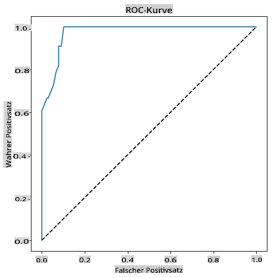

<!--
CO_OP_TRANSLATOR_METADATA:
{
  "original_hash": "72b5bae0879baddf6aafc82bb07b8776",
  "translation_date": "2025-09-03T21:40:20+00:00",
  "source_file": "2-Regression/4-Logistic/README.md",
  "language_code": "de"
}
-->
# Logistische Regression zur Vorhersage von Kategorien


## [Quiz vor der Vorlesung](https://gray-sand-07a10f403.1.azurestaticapps.net/quiz/15/)

> ### [Diese Lektion ist auch in R verfügbar!](../../../../2-Regression/4-Logistic/solution/R/lesson_4.html)

## Einführung

In dieser letzten Lektion über Regression, eine der grundlegenden _klassischen_ ML-Techniken, werfen wir einen Blick auf die logistische Regression. Diese Technik wird verwendet, um Muster zu erkennen und binäre Kategorien vorherzusagen. Ist diese Süßigkeit Schokolade oder nicht? Ist diese Krankheit ansteckend oder nicht? Wird dieser Kunde dieses Produkt wählen oder nicht?

In dieser Lektion lernen Sie:

- Eine neue Bibliothek für Datenvisualisierung
- Techniken für die logistische Regression

✅ Vertiefen Sie Ihr Verständnis für diese Art der Regression in diesem [Learn-Modul](https://docs.microsoft.com/learn/modules/train-evaluate-classification-models?WT.mc_id=academic-77952-leestott)

## Voraussetzung

Nachdem wir mit den Kürbisdaten gearbeitet haben, sind wir nun vertraut genug, um zu erkennen, dass es eine binäre Kategorie gibt, mit der wir arbeiten können: `Color`.

Lassen Sie uns ein Modell der logistischen Regression erstellen, um vorherzusagen, _welche Farbe ein bestimmter Kürbis wahrscheinlich hat_ (orange 🎃 oder weiß 👻), basierend auf einigen Variablen.

> Warum sprechen wir über binäre Klassifikation in einer Lektion über Regression? Nur aus sprachlicher Bequemlichkeit, da die logistische Regression [eigentlich eine Klassifikationsmethode](https://scikit-learn.org/stable/modules/linear_model.html#logistic-regression) ist, wenn auch eine lineare. Lernen Sie in der nächsten Lektion weitere Methoden zur Klassifikation von Daten kennen.

## Die Frage definieren

Für unsere Zwecke drücken wir dies als Binärwert aus: 'Weiß' oder 'Nicht Weiß'. Es gibt auch eine 'gestreifte' Kategorie in unserem Datensatz, aber es gibt nur wenige Instanzen davon, daher werden wir sie nicht verwenden. Sie verschwindet ohnehin, sobald wir Nullwerte aus dem Datensatz entfernen.

> 🎃 Fun Fact: Wir nennen weiße Kürbisse manchmal 'Geister'-Kürbisse. Sie sind nicht sehr leicht zu schnitzen, daher sind sie nicht so beliebt wie die orangefarbenen, aber sie sehen cool aus! Wir könnten unsere Frage also auch so formulieren: 'Geist' oder 'Nicht Geist'. 👻

## Über logistische Regression

Die logistische Regression unterscheidet sich in einigen wichtigen Punkten von der linearen Regression, die Sie zuvor gelernt haben.

[](https://youtu.be/KpeCT6nEpBY "ML für Anfänger - Verständnis der logistischen Regression für maschinelles Lernen")

> 🎥 Klicken Sie auf das Bild oben für eine kurze Videoübersicht über die logistische Regression.

### Binäre Klassifikation

Die logistische Regression bietet nicht die gleichen Funktionen wie die lineare Regression. Erstere bietet eine Vorhersage über eine binäre Kategorie ("weiß oder nicht weiß"), während letztere kontinuierliche Werte vorhersagen kann, z. B. basierend auf der Herkunft eines Kürbisses und der Erntezeit, _wie stark sein Preis steigen wird_.


> Infografik von [Dasani Madipalli](https://twitter.com/dasani_decoded)

### Andere Klassifikationen

Es gibt andere Arten der logistischen Regression, einschließlich multinomialer und ordinaler:

- **Multinomial**, bei der es mehr als eine Kategorie gibt - "Orange, Weiß und Gestreift".
- **Ordinal**, bei der geordnete Kategorien verwendet werden, nützlich, wenn wir unsere Ergebnisse logisch ordnen möchten, wie unsere Kürbisse, die nach einer begrenzten Anzahl von Größen geordnet sind (mini, sm, med, lg, xl, xxl).


### Variablen müssen NICHT korrelieren

Erinnern Sie sich daran, wie die lineare Regression mit stärker korrelierten Variablen besser funktionierte? Die logistische Regression ist das Gegenteil – die Variablen müssen nicht übereinstimmen. Das funktioniert für diese Daten, die nur schwache Korrelationen aufweisen.

### Sie benötigen viele saubere Daten

Die logistische Regression liefert genauere Ergebnisse, wenn Sie mehr Daten verwenden; unser kleiner Datensatz ist für diese Aufgabe nicht optimal, also behalten Sie das im Hinterkopf.

[](https://youtu.be/B2X4H9vcXTs "ML für Anfänger - Datenanalyse und -vorbereitung für logistische Regression")

> 🎥 Klicken Sie auf das Bild oben für eine kurze Videoübersicht über die Datenvorbereitung für die lineare Regression.

✅ Denken Sie über die Arten von Daten nach, die sich gut für die logistische Regression eignen würden.

## Übung - Daten bereinigen

Bereinigen Sie zunächst die Daten ein wenig, indem Sie Nullwerte entfernen und nur einige der Spalten auswählen:

1. Fügen Sie den folgenden Code hinzu:

    ```python
  
    columns_to_select = ['City Name','Package','Variety', 'Origin','Item Size', 'Color']
    pumpkins = full_pumpkins.loc[:, columns_to_select]

    pumpkins.dropna(inplace=True)
    ```

    Sie können jederzeit einen Blick auf Ihren neuen Dataframe werfen:

    ```python
    pumpkins.info
    ```

### Visualisierung - kategorisches Diagramm

Bis jetzt haben Sie das [Starter-Notebook](./notebook.ipynb) mit Kürbisdaten erneut geladen und bereinigt, sodass ein Datensatz mit einigen Variablen, einschließlich `Color`, erhalten bleibt. Lassen Sie uns den Dataframe im Notebook mit einer anderen Bibliothek visualisieren: [Seaborn](https://seaborn.pydata.org/index.html), das auf Matplotlib basiert, das wir zuvor verwendet haben.

Seaborn bietet einige interessante Möglichkeiten, Ihre Daten zu visualisieren. Beispielsweise können Sie die Verteilungen der Daten für jede `Variety` und `Color` in einem kategorischen Diagramm vergleichen.

1. Erstellen Sie ein solches Diagramm mit der Funktion `catplot`, indem Sie unsere Kürbisdaten `pumpkins` verwenden und eine Farbzuordnung für jede Kürbiskategorie (orange oder weiß) angeben:

    ```python
    import seaborn as sns
    
    palette = {
    'ORANGE': 'orange',
    'WHITE': 'wheat',
    }

    sns.catplot(
    data=pumpkins, y="Variety", hue="Color", kind="count",
    palette=palette, 
    )
    ```

    

    Durch die Beobachtung der Daten können Sie sehen, wie die Farbdaten mit der Sorte zusammenhängen.

    ✅ Angesichts dieses kategorischen Diagramms, welche interessanten Untersuchungen können Sie sich vorstellen?

### Datenvorverarbeitung: Feature- und Label-Encoding

Unser Kürbis-Datensatz enthält Zeichenkettenwerte für alle seine Spalten. Mit kategorischen Daten zu arbeiten, ist für Menschen intuitiv, aber nicht für Maschinen. Maschinelle Lernalgorithmen funktionieren gut mit Zahlen. Deshalb ist Encoding ein sehr wichtiger Schritt in der Datenvorverarbeitungsphase, da es uns ermöglicht, kategorische Daten in numerische Daten umzuwandeln, ohne Informationen zu verlieren. Gutes Encoding führt zu einem guten Modell.

Für das Feature-Encoding gibt es zwei Haupttypen von Encodern:

1. Ordinaler Encoder: Er eignet sich gut für ordinale Variablen, also kategorische Variablen, bei denen die Daten einer logischen Reihenfolge folgen, wie die Spalte `Item Size` in unserem Datensatz. Er erstellt eine Zuordnung, sodass jede Kategorie durch eine Zahl dargestellt wird, die die Reihenfolge der Kategorie in der Spalte ist.

    ```python
    from sklearn.preprocessing import OrdinalEncoder

    item_size_categories = [['sml', 'med', 'med-lge', 'lge', 'xlge', 'jbo', 'exjbo']]
    ordinal_features = ['Item Size']
    ordinal_encoder = OrdinalEncoder(categories=item_size_categories)
    ```

2. Kategorischer Encoder: Er eignet sich gut für nominale Variablen, also kategorische Variablen, bei denen die Daten keiner logischen Reihenfolge folgen, wie alle Features außer `Item Size` in unserem Datensatz. Es handelt sich um ein One-Hot-Encoding, was bedeutet, dass jede Kategorie durch eine binäre Spalte dargestellt wird: Die codierte Variable ist gleich 1, wenn der Kürbis zu dieser Sorte gehört, und 0, wenn nicht.

    ```python
    from sklearn.preprocessing import OneHotEncoder

    categorical_features = ['City Name', 'Package', 'Variety', 'Origin']
    categorical_encoder = OneHotEncoder(sparse_output=False)
    ```

Dann wird `ColumnTransformer` verwendet, um mehrere Encoder in einem einzigen Schritt zu kombinieren und auf die entsprechenden Spalten anzuwenden.

```python
    from sklearn.compose import ColumnTransformer
    
    ct = ColumnTransformer(transformers=[
        ('ord', ordinal_encoder, ordinal_features),
        ('cat', categorical_encoder, categorical_features)
        ])
    
    ct.set_output(transform='pandas')
    encoded_features = ct.fit_transform(pumpkins)
```

Für das Label-Encoding verwenden wir die `LabelEncoder`-Klasse von scikit-learn, eine Utility-Klasse, die Labels normalisiert, sodass sie nur Werte zwischen 0 und n_classes-1 enthalten (hier 0 und 1).

```python
    from sklearn.preprocessing import LabelEncoder

    label_encoder = LabelEncoder()
    encoded_label = label_encoder.fit_transform(pumpkins['Color'])
```

Sobald wir die Features und das Label codiert haben, können wir sie zu einem neuen Dataframe `encoded_pumpkins` zusammenführen.

```python
    encoded_pumpkins = encoded_features.assign(Color=encoded_label)
```

✅ Was sind die Vorteile der Verwendung eines ordinalen Encoders für die Spalte `Item Size`?

### Beziehungen zwischen Variablen analysieren

Nachdem wir unsere Daten vorverarbeitet haben, können wir die Beziehungen zwischen den Features und dem Label analysieren, um eine Vorstellung davon zu bekommen, wie gut das Modell das Label anhand der Features vorhersagen kann. Die beste Möglichkeit, diese Art der Analyse durchzuführen, ist das Plotten der Daten. Wir verwenden erneut die Funktion `catplot` von Seaborn, um die Beziehungen zwischen `Item Size`, `Variety` und `Color` in einem kategorischen Diagramm zu visualisieren. Um die Daten besser darzustellen, verwenden wir die codierte Spalte `Item Size` und die nicht codierte Spalte `Variety`.

```python
    palette = {
    'ORANGE': 'orange',
    'WHITE': 'wheat',
    }
    pumpkins['Item Size'] = encoded_pumpkins['ord__Item Size']

    g = sns.catplot(
        data=pumpkins,
        x="Item Size", y="Color", row='Variety',
        kind="box", orient="h",
        sharex=False, margin_titles=True,
        height=1.8, aspect=4, palette=palette,
    )
    g.set(xlabel="Item Size", ylabel="").set(xlim=(0,6))
    g.set_titles(row_template="{row_name}")
```


### Verwendung eines Swarm-Plots

Da `Color` eine binäre Kategorie ist (Weiß oder Nicht Weiß), benötigt sie 'einen [spezialisierten Ansatz](https://seaborn.pydata.org/tutorial/categorical.html?highlight=bar) zur Visualisierung'. Es gibt andere Möglichkeiten, die Beziehung dieser Kategorie zu anderen Variablen zu visualisieren.

Sie können Variablen nebeneinander mit Seaborn-Diagrammen visualisieren.

1. Probieren Sie einen 'Swarm'-Plot aus, um die Verteilung der Werte darzustellen:

    ```python
    palette = {
    0: 'orange',
    1: 'wheat'
    }
    sns.swarmplot(x="Color", y="ord__Item Size", data=encoded_pumpkins, palette=palette)
    ```

    

**Achtung**: Der obige Code könnte eine Warnung generieren, da Seaborn Schwierigkeiten hat, eine solche Menge an Datenpunkten in einem Swarm-Plot darzustellen. Eine mögliche Lösung besteht darin, die Größe des Markers mit dem Parameter 'size' zu verringern. Beachten Sie jedoch, dass dies die Lesbarkeit des Diagramms beeinträchtigt.

> **🧮 Zeigen Sie mir die Mathematik**
>
> Die logistische Regression basiert auf dem Konzept der 'Maximum-Likelihood' unter Verwendung von [Sigmoid-Funktionen](https://wikipedia.org/wiki/Sigmoid_function). Eine 'Sigmoid-Funktion' auf einem Diagramm sieht aus wie eine 'S'-Form. Sie nimmt einen Wert und ordnet ihn irgendwo zwischen 0 und 1 zu. Ihre Kurve wird auch als 'logistische Kurve' bezeichnet. Ihre Formel sieht wie folgt aus:
>
> 
>
> Dabei liegt der Mittelpunkt der Sigmoid-Funktion bei x = 0, L ist der maximale Wert der Kurve und k ist die Steilheit der Kurve. Wenn das Ergebnis der Funktion größer als 0,5 ist, wird das betreffende Label der Klasse '1' der binären Wahl zugeordnet. Andernfalls wird es als '0' klassifiziert.

## Modell erstellen

Ein Modell zu erstellen, um diese binäre Klassifikation zu finden, ist überraschend einfach in Scikit-learn.

[](https://youtu.be/MmZS2otPrQ8 "ML für Anfänger - Logistische Regression zur Klassifikation von Daten")

> 🎥 Klicken Sie auf das Bild oben für eine kurze Videoübersicht über den Aufbau eines linearen Regressionsmodells.

1. Wählen Sie die Variablen aus, die Sie in Ihrem Klassifikationsmodell verwenden möchten, und teilen Sie die Trainings- und Testsets mit `train_test_split()`:

    ```python
    from sklearn.model_selection import train_test_split
    
    X = encoded_pumpkins[encoded_pumpkins.columns.difference(['Color'])]
    y = encoded_pumpkins['Color']

    X_train, X_test, y_train, y_test = train_test_split(X, y, test_size=0.2, random_state=0)
    
    ```

2. Jetzt können Sie Ihr Modell trainieren, indem Sie `fit()` mit Ihren Trainingsdaten aufrufen und das Ergebnis ausgeben:

    ```python
    from sklearn.metrics import f1_score, classification_report 
    from sklearn.linear_model import LogisticRegression

    model = LogisticRegression()
    model.fit(X_train, y_train)
    predictions = model.predict(X_test)

    print(classification_report(y_test, predictions))
    print('Predicted labels: ', predictions)
    print('F1-score: ', f1_score(y_test, predictions))
    ```

    Werfen Sie einen Blick auf die Bewertung Ihres Modells. Es ist nicht schlecht, wenn man bedenkt, dass Sie nur etwa 1000 Zeilen Daten haben:

    ```output
                       precision    recall  f1-score   support
    
                    0       0.94      0.98      0.96       166
                    1       0.85      0.67      0.75        33
    
        accuracy                                0.92       199
        macro avg           0.89      0.82      0.85       199
        weighted avg        0.92      0.92      0.92       199
    
        Predicted labels:  [0 0 0 0 0 0 0 0 0 0 0 0 0 0 0 0 0 0 0 0 1 0 0 1 0 0 0 0 0 0 0 0 1 0 0 0 0
        0 0 0 0 0 1 0 1 0 0 1 0 0 0 0 0 1 0 1 0 1 0 1 0 0 0 0 0 0 0 0 0 0 0 0 0 0
        1 0 0 0 0 0 0 0 1 0 0 0 0 0 0 0 1 0 0 0 0 0 0 0 0 1 0 1 0 0 0 0 0 0 0 1 0
        0 0 0 0 0 0 0 0 0 0 0 0 0 0 0 0 0 0 0 0 0 1 0 0 0 0 0 0 0 0 1 0 0 0 1 1 0
        0 0 0 0 1 0 0 0 0 0 1 0 0 0 0 0 0 0 0 0 0 0 0 0 0 0 0 0 0 0 0 0 0 0 0 0 1
        0 0 0 1 0 0 0 0 0 0 0 0 1 1]
        F1-score:  0.7457627118644068
    ```

## Bessere Verständlichkeit durch eine Konfusionsmatrix

Während Sie einen Bewertungsbericht [Begriffe](https://scikit-learn.org/stable/modules/generated/sklearn.metrics.classification_report.html?highlight=classification_report#sklearn.metrics.classification_report) ausgeben können, indem Sie die oben genannten Elemente drucken, können Sie Ihr Modell möglicherweise besser verstehen, indem Sie eine [Konfusionsmatrix](https://scikit-learn.org/stable/modules/model_evaluation.html#confusion-matrix) verwenden, um zu verstehen, wie das Modell funktioniert.

> 🎓 Eine '[Konfusionsmatrix](https://wikipedia.org/wiki/Confusion_matrix)' (oder 'Fehlermatrix') ist eine Tabelle, die die tatsächlichen vs. falschen Positiven und Negativen Ihres Modells ausdrückt und somit die Genauigkeit der Vorhersagen misst.

1. Um eine Konfusionsmatrix zu verwenden, rufen Sie `confusion_matrix()` auf:

    ```python
    from sklearn.metrics import confusion_matrix
    confusion_matrix(y_test, predictions)
    ```

    Werfen Sie einen Blick auf die Konfusionsmatrix Ihres Modells:

    ```output
    array([[162,   4],
           [ 11,  22]])
    ```

In Scikit-learn sind die Zeilen (Achse 0) die tatsächlichen Labels und die Spalten (Achse 1) die vorhergesagten Labels.

|       |   0   |   1   |
| :---: | :---: | :---: |
|   0   |  TN   |  FP   |
|   1   |  FN   |  TP   |

Was passiert hier? Angenommen, unser Modell wird gebeten, Kürbisse zwischen zwei binären Kategorien zu klassifizieren, Kategorie 'weiß' und Kategorie 'nicht-weiß'.

- Wenn Ihr Modell einen Kürbis als nicht weiß vorhersagt und er tatsächlich zur Kategorie 'nicht-weiß' gehört, nennen wir dies ein True Negative, dargestellt durch die Zahl oben links.
- Wenn Ihr Modell einen Kürbis als weiß vorhersagt und er tatsächlich zur Kategorie 'nicht-weiß' gehört, nennen wir dies ein False Negative, dargestellt durch die Zahl unten links.
- Wenn Ihr Modell einen Kürbis als nicht weiß vorhersagt und er tatsächlich zur Kategorie 'weiß' gehört, nennen wir dies ein False Positive, dargestellt durch die Zahl oben rechts.
- Wenn Ihr Modell einen Kürbis als weiß vorhersagt und er tatsächlich zur Kategorie 'weiß' gehört, nennen wir dies ein True Positive, dargestellt durch die Zahl unten rechts.

Wie Sie sich denken können, ist es vorzuziehen, eine größere Anzahl von True Positives und True Negatives und eine geringere Anzahl von False Positives und False Negatives zu haben, was darauf hinweist, dass das Modell besser funktioniert.
Wie hängt die Konfusionsmatrix mit Präzision und Recall zusammen? Erinnern Sie sich, dass der oben gedruckte Klassifikationsbericht eine Präzision von 0,85 und einen Recall von 0,67 zeigte.

Präzision = tp / (tp + fp) = 22 / (22 + 4) = 0,8461538461538461

Recall = tp / (tp + fn) = 22 / (22 + 11) = 0,6666666666666666

✅ F: Wie hat das Modell laut der Konfusionsmatrix abgeschnitten? A: Gar nicht schlecht; es gibt eine gute Anzahl von True Negatives, aber auch einige False Negatives.

Lassen Sie uns die Begriffe, die wir zuvor gesehen haben, mit Hilfe der Zuordnung von TP/TN und FP/FN in der Konfusionsmatrix erneut betrachten:

🎓 Präzision: TP/(TP + FP) Der Anteil relevanter Instanzen unter den abgerufenen Instanzen (z. B. welche Labels gut zugeordnet wurden)

🎓 Recall: TP/(TP + FN) Der Anteil relevanter Instanzen, die abgerufen wurden, unabhängig davon, ob sie gut zugeordnet wurden oder nicht

🎓 F1-Score: (2 * Präzision * Recall)/(Präzision + Recall) Ein gewichteter Durchschnitt von Präzision und Recall, wobei 1 das Beste und 0 das Schlechteste ist

🎓 Support: Die Anzahl der Vorkommen jedes abgerufenen Labels

🎓 Genauigkeit: (TP + TN)/(TP + TN + FP + FN) Der Prozentsatz der Labels, die für eine Stichprobe korrekt vorhergesagt wurden.

🎓 Makro-Durchschnitt: Die Berechnung der ungewichteten Durchschnittswerte für jedes Label, ohne die Ungleichheit der Labels zu berücksichtigen.

🎓 Gewichteter Durchschnitt: Die Berechnung der Durchschnittswerte für jedes Label, wobei die Ungleichheit der Labels durch Gewichtung nach ihrer Unterstützung (der Anzahl der tatsächlichen Instanzen für jedes Label) berücksichtigt wird.

✅ Können Sie sich vorstellen, welchen Metrikwert Sie beobachten sollten, wenn Sie die Anzahl der False Negatives reduzieren möchten?

## Visualisieren Sie die ROC-Kurve dieses Modells

[](https://youtu.be/GApO575jTA0 "ML für Anfänger - Analyse der Leistung von logistischer Regression mit ROC-Kurven")

> 🎥 Klicken Sie auf das Bild oben für eine kurze Videoübersicht über ROC-Kurven

Lassen Sie uns eine weitere Visualisierung durchführen, um die sogenannte 'ROC'-Kurve zu sehen:

```python
from sklearn.metrics import roc_curve, roc_auc_score
import matplotlib
import matplotlib.pyplot as plt
%matplotlib inline

y_scores = model.predict_proba(X_test)
fpr, tpr, thresholds = roc_curve(y_test, y_scores[:,1])

fig = plt.figure(figsize=(6, 6))
plt.plot([0, 1], [0, 1], 'k--')
plt.plot(fpr, tpr)
plt.xlabel('False Positive Rate')
plt.ylabel('True Positive Rate')
plt.title('ROC Curve')
plt.show()
```

Verwenden Sie Matplotlib, um die [Receiver Operating Characteristic](https://scikit-learn.org/stable/auto_examples/model_selection/plot_roc.html?highlight=roc) oder ROC des Modells zu zeichnen. ROC-Kurven werden häufig verwendet, um die Ausgabe eines Klassifikators in Bezug auf seine True Positives und False Positives zu betrachten. "ROC-Kurven zeigen typischerweise die True Positive Rate auf der Y-Achse und die False Positive Rate auf der X-Achse." Daher sind die Steilheit der Kurve und der Abstand zwischen der Mittellinie und der Kurve wichtig: Sie möchten eine Kurve, die schnell nach oben und über die Linie geht. In unserem Fall gibt es zunächst False Positives, und dann geht die Linie richtig nach oben und darüber:



Verwenden Sie abschließend die [`roc_auc_score` API](https://scikit-learn.org/stable/modules/generated/sklearn.metrics.roc_auc_score.html?highlight=roc_auc#sklearn.metrics.roc_auc_score) von Scikit-learn, um die tatsächliche 'Fläche unter der Kurve' (AUC) zu berechnen:

```python
auc = roc_auc_score(y_test,y_scores[:,1])
print(auc)
```
Das Ergebnis ist `0.9749908725812341`. Da die AUC von 0 bis 1 reicht, möchten Sie einen hohen Wert erzielen, da ein Modell, das 100 % korrekte Vorhersagen trifft, eine AUC von 1 hat; in diesem Fall ist das Modell _ziemlich gut_.

In zukünftigen Lektionen zu Klassifikationen werden Sie lernen, wie Sie iterativ die Werte Ihres Modells verbessern können. Aber für den Moment: Herzlichen Glückwunsch! Sie haben diese Lektionen zur Regression abgeschlossen!

---
## 🚀 Herausforderung

Es gibt noch viel mehr über logistische Regression zu entdecken! Aber der beste Weg zu lernen ist zu experimentieren. Finden Sie einen Datensatz, der sich für diese Art der Analyse eignet, und erstellen Sie ein Modell damit. Was lernen Sie dabei? Tipp: Probieren Sie [Kaggle](https://www.kaggle.com/search?q=logistic+regression+datasets) für interessante Datensätze aus.

## [Quiz nach der Vorlesung](https://gray-sand-07a10f403.1.azurestaticapps.net/quiz/16/)

## Überprüfung & Selbststudium

Lesen Sie die ersten Seiten [dieses Papiers von Stanford](https://web.stanford.edu/~jurafsky/slp3/5.pdf) über einige praktische Anwendungen der logistischen Regression. Denken Sie über Aufgaben nach, die besser für die eine oder andere Art von Regression geeignet sind, die wir bis jetzt studiert haben. Was würde am besten funktionieren?

## Aufgabe

[Wiederholen Sie diese Regression](assignment.md)

---

**Haftungsausschluss**:  
Dieses Dokument wurde mit dem KI-Übersetzungsdienst [Co-op Translator](https://github.com/Azure/co-op-translator) übersetzt. Obwohl wir uns um Genauigkeit bemühen, beachten Sie bitte, dass automatisierte Übersetzungen Fehler oder Ungenauigkeiten enthalten können. Das Originaldokument in seiner ursprünglichen Sprache sollte als maßgebliche Quelle betrachtet werden. Für kritische Informationen wird eine professionelle menschliche Übersetzung empfohlen. Wir übernehmen keine Haftung für Missverständnisse oder Fehlinterpretationen, die sich aus der Nutzung dieser Übersetzung ergeben.