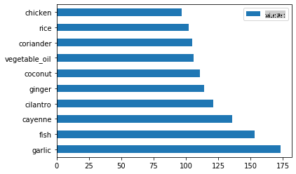
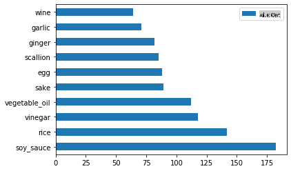
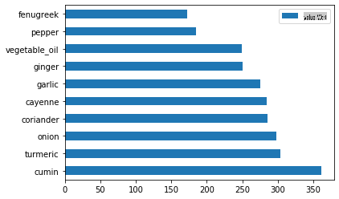
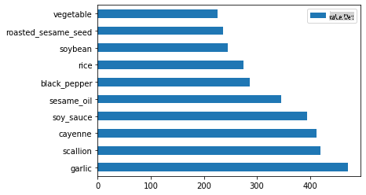

# Einführung in die Klassifikation

In diesen vier Lektionen werden Sie einen grundlegenden Aspekt des klassischen maschinellen Lernens erkunden - _Klassifikation_. Wir werden verschiedene Klassifikationsalgorithmen mit einem Datensatz über die wunderbaren Küchen Asiens und Indiens durchgehen. Hoffentlich haben Sie Hunger!


> Feiern Sie die pan-asiatischen Küchen in diesen Lektionen! Bild von [Jen Looper](https://twitter.com/jenlooper)

Klassifikation ist eine Form des [überwachten Lernens](https://wikipedia.org/wiki/Supervised_learning), die viele Gemeinsamkeiten mit Regressionstechniken hat. Wenn maschinelles Lernen darin besteht, Werte oder Namen für Dinge mithilfe von Datensätzen vorherzusagen, fällt die Klassifikation im Allgemeinen in zwei Gruppen: _binäre Klassifikation_ und _multiklassen Klassifikation_.

[](https://youtu.be/eg8DJYwdMyg "Einführung in die Klassifikation")

> 🎥 Klicken Sie auf das Bild oben für ein Video: MITs John Guttag stellt die Klassifikation vor.

Denken Sie daran:

- **Lineare Regression** hat Ihnen geholfen, Beziehungen zwischen Variablen vorherzusagen und genaue Vorhersagen darüber zu treffen, wo ein neuer Datenpunkt in Bezug auf diese Linie liegen würde. So könnten Sie beispielsweise vorhersagen, _welchen Preis ein Kürbis im September im Vergleich zu Dezember haben würde_.
- **Logistische Regression** hat Ihnen geholfen, "binäre Kategorien" zu entdecken: An diesem Preis, _ist dieser Kürbis orange oder nicht-orange_?

Klassifikation verwendet verschiedene Algorithmen, um andere Möglichkeiten zur Bestimmung des Labels oder der Klasse eines Datenpunkts zu ermitteln. Lassen Sie uns mit diesen Küchen-Daten arbeiten, um zu sehen, ob wir durch die Beobachtung einer Gruppe von Zutaten die Herkunftsküche bestimmen können.

## [Vorlesungsquiz](https://gray-sand-07a10f403.1.azurestaticapps.net/quiz/19/)

> ### [Diese Lektion ist in R verfügbar!](../../../../4-Classification/1-Introduction/solution/R/lesson_10.html)

### Einführung

Klassifikation ist eine der grundlegenden Aktivitäten für Forscher im Bereich maschinelles Lernen und Datenwissenschaftler. Vom grundlegenden Klassifizieren eines binären Wertes ("ist diese E-Mail Spam oder nicht?") bis hin zur komplexen Bildklassifikation und -segmentierung mithilfe von Computer Vision ist es immer nützlich, Daten in Klassen zu sortieren und Fragen dazu zu stellen.

Um den Prozess wissenschaftlicher zu formulieren, erstellt Ihre Klassifikationsmethode ein prädiktives Modell, das es Ihnen ermöglicht, die Beziehung zwischen Eingangsvariablen und Ausgangsvariablen abzubilden.


> Binäre vs. multiklassen Probleme für Klassifikationsalgorithmen. Infografik von [Jen Looper](https://twitter.com/jenlooper)

Bevor wir mit dem Prozess beginnen, unsere Daten zu bereinigen, sie zu visualisieren und sie für unsere ML-Aufgaben vorzubereiten, lassen Sie uns ein wenig darüber lernen, wie maschinelles Lernen genutzt werden kann, um Daten zu klassifizieren.

Abgeleitet von [Statistik](https://wikipedia.org/wiki/Statistical_classification) verwendet die Klassifikation im klassischen maschinellen Lernen Merkmale wie `smoker`, `weight` und `age`, um _die Wahrscheinlichkeit der Entwicklung von X Krankheit_ zu bestimmen. Als eine überwachte Lerntechnik, die den Regressionsübungen ähnelt, die Sie zuvor durchgeführt haben, sind Ihre Daten beschriftet und die ML-Algorithmen verwenden diese Labels, um Klassen (oder 'Merkmale') eines Datensatzes zu klassifizieren und sie einer Gruppe oder einem Ergebnis zuzuordnen.

✅ Nehmen Sie sich einen Moment Zeit, um sich einen Datensatz über Küchen vorzustellen. Was könnte ein Multiklassenmodell beantworten? Was könnte ein binäres Modell beantworten? Was wäre, wenn Sie bestimmen wollten, ob eine bestimmte Küche wahrscheinlich Bockshornkleesamen verwendet? Was wäre, wenn Sie sehen wollten, ob Sie aus einem Geschenk einer Einkaufstasche voller Sternanis, Artischocken, Blumenkohl und Meerrettich ein typisches indisches Gericht kreieren könnten?

[](https://youtu.be/GuTeDbaNoEU "Verrückte Mystery-Körbe")

> 🎥 Klicken Sie auf das Bild oben für ein Video. Das gesamte Konzept der Show 'Chopped' ist der 'Mystery Basket', bei dem Köche aus einer zufälligen Auswahl von Zutaten ein Gericht zubereiten müssen. Sicherlich hätte ein ML-Modell geholfen!

## Hallo 'Klassifizierer'

Die Frage, die wir zu diesem Küchen-Datensatz stellen möchten, ist tatsächlich eine **Multiklassenfrage**, da wir mehrere potenzielle nationale Küchen zur Verfügung haben. Angesichts einer Reihe von Zutaten, zu welcher dieser vielen Klassen passt die Daten?

Scikit-learn bietet verschiedene Algorithmen zur Klassifizierung von Daten an, abhängig von der Art des Problems, das Sie lösen möchten. In den nächsten beiden Lektionen lernen Sie mehrere dieser Algorithmen kennen.

## Übung - Bereinigen und Ausbalancieren Ihrer Daten

Die erste Aufgabe, bevor Sie mit diesem Projekt beginnen, besteht darin, Ihre Daten zu bereinigen und **auszubalancieren**, um bessere Ergebnisse zu erzielen. Beginnen Sie mit der leeren Datei _notebook.ipynb_ im Stammverzeichnis dieses Ordners.

Das erste, was Sie installieren müssen, ist [imblearn](https://imbalanced-learn.org/stable/). Dies ist ein Scikit-learn-Paket, das es Ihnen ermöglicht, die Daten besser auszubalancieren (Sie werden in einer Minute mehr über diese Aufgabe erfahren).

1. Um `imblearn` zu installieren, führen Sie `pip install` aus, so:

    ```python
    pip install imblearn
    ```

1. Importieren Sie die Pakete, die Sie benötigen, um Ihre Daten zu importieren und zu visualisieren, und importieren Sie auch `SMOTE` von `imblearn`.

    ```python
    import pandas as pd
    import matplotlib.pyplot as plt
    import matplotlib as mpl
    import numpy as np
    from imblearn.over_sampling import SMOTE
    ```

    Jetzt sind Sie bereit, die Daten als Nächstes zu importieren.

1. Die nächste Aufgabe wird sein, die Daten zu importieren:

    ```python
    df  = pd.read_csv('../data/cuisines.csv')
    ```

   Verwenden Sie `read_csv()` will read the content of the csv file _cusines.csv_ and place it in the variable `df`.

1. Überprüfen Sie die Form der Daten:

    ```python
    df.head()
    ```

   Die ersten fünf Zeilen sehen so aus:

    ```output
    |     | Unnamed: 0 | cuisine | almond | angelica | anise | anise_seed | apple | apple_brandy | apricot | armagnac | ... | whiskey | white_bread | white_wine | whole_grain_wheat_flour | wine | wood | yam | yeast | yogurt | zucchini |
    | --- | ---------- | ------- | ------ | -------- | ----- | ---------- | ----- | ------------ | ------- | -------- | --- | ------- | ----------- | ---------- | ----------------------- | ---- | ---- | --- | ----- | ------ | -------- |
    | 0   | 65         | indian  | 0      | 0        | 0     | 0          | 0     | 0            | 0       | 0        | ... | 0       | 0           | 0          | 0                       | 0    | 0    | 0   | 0     | 0      | 0        |
    | 1   | 66         | indian  | 1      | 0        | 0     | 0          | 0     | 0            | 0       | 0        | ... | 0       | 0           | 0          | 0                       | 0    | 0    | 0   | 0     | 0      | 0        |
    | 2   | 67         | indian  | 0      | 0        | 0     | 0          | 0     | 0            | 0       | 0        | ... | 0       | 0           | 0          | 0                       | 0    | 0    | 0   | 0     | 0      | 0        |
    | 3   | 68         | indian  | 0      | 0        | 0     | 0          | 0     | 0            | 0       | 0        | ... | 0       | 0           | 0          | 0                       | 0    | 0    | 0   | 0     | 0      | 0        |
    | 4   | 69         | indian  | 0      | 0        | 0     | 0          | 0     | 0            | 0       | 0        | ... | 0       | 0           | 0          | 0                       | 0    | 0    | 0   | 0     | 1      | 0        |
    ```

1. Holen Sie sich Informationen über diese Daten, indem Sie `info()` aufrufen:

    ```python
    df.info()
    ```

    Ihre Ausgabe sieht so aus:

    ```output
    <class 'pandas.core.frame.DataFrame'>
    RangeIndex: 2448 entries, 0 to 2447
    Columns: 385 entries, Unnamed: 0 to zucchini
    dtypes: int64(384), object(1)
    memory usage: 7.2+ MB
    ```

## Übung - Lernen über Küchen

Jetzt wird die Arbeit interessanter. Lassen Sie uns die Verteilung der Daten nach Küche entdecken.

1. Zeichnen Sie die Daten als Balken, indem Sie `barh()` aufrufen:

    ```python
    df.cuisine.value_counts().plot.barh()
    ```

    

    Es gibt eine endliche Anzahl von Küchen, aber die Verteilung der Daten ist ungleichmäßig. Das können Sie beheben! Bevor Sie das tun, erkunden Sie noch ein wenig mehr.

1. Finden Sie heraus, wie viele Daten pro Küche verfügbar sind, und geben Sie sie aus:

    ```python
    thai_df = df[(df.cuisine == "thai")]
    japanese_df = df[(df.cuisine == "japanese")]
    chinese_df = df[(df.cuisine == "chinese")]
    indian_df = df[(df.cuisine == "indian")]
    korean_df = df[(df.cuisine == "korean")]
    
    print(f'thai df: {thai_df.shape}')
    print(f'japanese df: {japanese_df.shape}')
    print(f'chinese df: {chinese_df.shape}')
    print(f'indian df: {indian_df.shape}')
    print(f'korean df: {korean_df.shape}')
    ```

    Die Ausgabe sieht so aus:

    ```output
    thai df: (289, 385)
    japanese df: (320, 385)
    chinese df: (442, 385)
    indian df: (598, 385)
    korean df: (799, 385)
    ```

## Entdecken von Zutaten

Jetzt können Sie tiefer in die Daten eintauchen und lernen, welche typischen Zutaten pro Küche verwendet werden. Sie sollten wiederkehrende Daten bereinigen, die Verwirrung zwischen den Küchen stiften, also lassen Sie uns mehr über dieses Problem lernen.

1. Erstellen Sie eine Funktion `create_ingredient()` in Python, um einen Zutaten-Datenrahmen zu erstellen. Diese Funktion beginnt damit, eine nicht hilfreiche Spalte zu entfernen und die Zutaten nach ihrer Häufigkeit zu sortieren:

    ```python
    def create_ingredient_df(df):
        ingredient_df = df.T.drop(['cuisine','Unnamed: 0']).sum(axis=1).to_frame('value')
        ingredient_df = ingredient_df[(ingredient_df.T != 0).any()]
        ingredient_df = ingredient_df.sort_values(by='value', ascending=False,
        inplace=False)
        return ingredient_df
    ```

   Jetzt können Sie diese Funktion verwenden, um eine Vorstellung von den zehn beliebtesten Zutaten pro Küche zu bekommen.

1. Rufen Sie `create_ingredient()` and plot it calling `barh()` auf:

    ```python
    thai_ingredient_df = create_ingredient_df(thai_df)
    thai_ingredient_df.head(10).plot.barh()
    ```

    

1. Machen Sie dasselbe für die japanischen Daten:

    ```python
    japanese_ingredient_df = create_ingredient_df(japanese_df)
    japanese_ingredient_df.head(10).plot.barh()
    ```

    

1. Jetzt für die chinesischen Zutaten:

    ```python
    chinese_ingredient_df = create_ingredient_df(chinese_df)
    chinese_ingredient_df.head(10).plot.barh()
    ```

    

1. Zeichnen Sie die indischen Zutaten:

    ```python
    indian_ingredient_df = create_ingredient_df(indian_df)
    indian_ingredient_df.head(10).plot.barh()
    ```

    

1. Schließlich zeichnen Sie die koreanischen Zutaten:

    ```python
    korean_ingredient_df = create_ingredient_df(korean_df)
    korean_ingredient_df.head(10).plot.barh()
    ```

    

1. Jetzt entfernen Sie die häufigsten Zutaten, die Verwirrung zwischen verschiedenen Küchen stiften, indem Sie `drop()` aufrufen: 

   Jeder liebt Reis, Knoblauch und Ingwer!

    ```python
    feature_df= df.drop(['cuisine','Unnamed: 0','rice','garlic','ginger'], axis=1)
    labels_df = df.cuisine #.unique()
    feature_df.head()
    ```

## Balancieren des Datensatzes

Jetzt, wo Sie die Daten bereinigt haben, verwenden Sie [SMOTE](https://imbalanced-learn.org/dev/references/generated/imblearn.over_sampling.SMOTE.html) - "Synthetic Minority Over-sampling Technique" - um ihn auszugleichen.

1. Rufen Sie `fit_resample()` auf, diese Strategie generiert neue Proben durch Interpolation.

    ```python
    oversample = SMOTE()
    transformed_feature_df, transformed_label_df = oversample.fit_resample(feature_df, labels_df)
    ```

    Durch das Ausbalancieren Ihrer Daten erzielen Sie bessere Ergebnisse bei der Klassifikation. Denken Sie an eine binäre Klassifikation. Wenn die meisten Ihrer Daten einer Klasse angehören, wird ein ML-Modell diese Klasse häufiger vorhersagen, nur weil es mehr Daten dafür gibt. Das Ausbalancieren der Daten hilft, unausgewogene Daten zu beseitigen.

1. Jetzt können Sie die Anzahl der Labels pro Zutat überprüfen:

    ```python
    print(f'new label count: {transformed_label_df.value_counts()}')
    print(f'old label count: {df.cuisine.value_counts()}')
    ```

    Ihre Ausgabe sieht so aus:

    ```output
    new label count: korean      799
    chinese     799
    indian      799
    japanese    799
    thai        799
    Name: cuisine, dtype: int64
    old label count: korean      799
    indian      598
    chinese     442
    japanese    320
    thai        289
    Name: cuisine, dtype: int64
    ```

    Die Daten sind schön und sauber, ausgewogen und sehr lecker! 

1. Der letzte Schritt besteht darin, Ihre ausgewogenen Daten, einschließlich Labels und Merkmale, in einen neuen Datenrahmen zu speichern, der in eine Datei exportiert werden kann:

    ```python
    transformed_df = pd.concat([transformed_label_df,transformed_feature_df],axis=1, join='outer')
    ```

1. Sie können einen weiteren Blick auf die Daten werfen, indem Sie `transformed_df.head()` and `transformed_df.info()` aufrufen. Speichern Sie eine Kopie dieser Daten für zukünftige Lektionen:

    ```python
    transformed_df.head()
    transformed_df.info()
    transformed_df.to_csv("../data/cleaned_cuisines.csv")
    ```

    Diese frische CSV ist jetzt im Stammordner der Daten zu finden.

---

## 🚀Herausforderung

Dieser Lehrplan enthält mehrere interessante Datensätze. Durchsuchen Sie die `data`-Ordner und sehen Sie, ob einige Datensätze enthalten, die für binäre oder Multiklassenklassifikation geeignet wären? Welche Fragen würden Sie zu diesem Datensatz stellen?

## [Nachlesungsquiz](https://gray-sand-07a10f403.1.azurestaticapps.net/quiz/20/)

## Überprüfung & Selbststudium

Erforschen Sie die API von SMOTE. Für welche Anwendungsfälle wird es am besten verwendet? Welche Probleme löst es?

## Aufgabe 

[Erforschen Sie Klassifikationsmethoden](assignment.md)

**Haftungsausschluss**:  
Dieses Dokument wurde mithilfe von KI-gestützten Übersetzungsdiensten übersetzt. Obwohl wir uns um Genauigkeit bemühen, sollten Sie beachten, dass automatisierte Übersetzungen Fehler oder Ungenauigkeiten enthalten können. Das Originaldokument in seiner ursprünglichen Sprache sollte als die maßgebliche Quelle angesehen werden. Für kritische Informationen wird eine professionelle menschliche Übersetzung empfohlen. Wir übernehmen keine Haftung für Missverständnisse oder Fehlinterpretationen, die aus der Verwendung dieser Übersetzung entstehen.