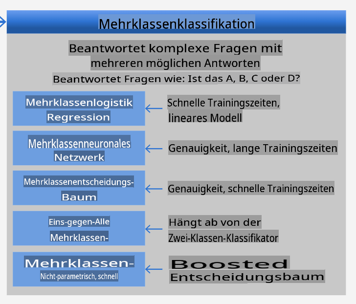
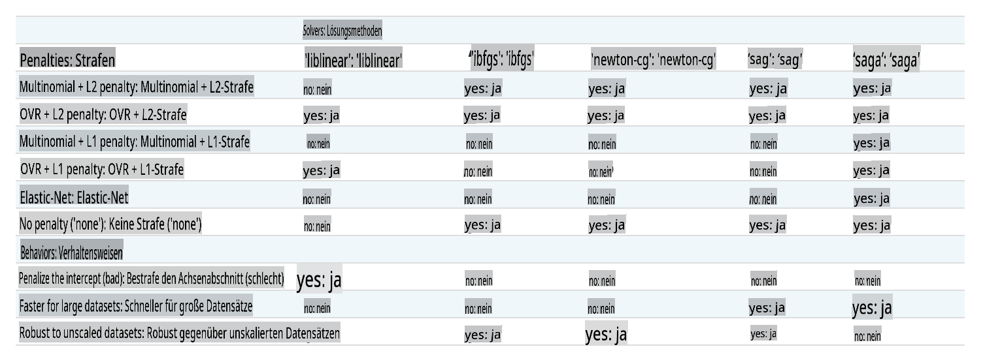

<!--
CO_OP_TRANSLATOR_METADATA:
{
  "original_hash": "9579f42e3ff5114c58379cc9e186a828",
  "translation_date": "2025-09-03T21:53:47+00:00",
  "source_file": "4-Classification/2-Classifiers-1/README.md",
  "language_code": "de"
}
-->
# Klassifikatoren für Küchen 1

In dieser Lektion wirst du den Datensatz verwenden, den du in der letzten Lektion gespeichert hast. Er enthält ausgewogene, bereinigte Daten über verschiedene Küchen.

Du wirst diesen Datensatz mit einer Vielzahl von Klassifikatoren nutzen, um _eine nationale Küche basierend auf einer Gruppe von Zutaten vorherzusagen_. Dabei lernst du mehr über die verschiedenen Möglichkeiten, wie Algorithmen für Klassifikationsaufgaben eingesetzt werden können.

## [Quiz vor der Lektion](https://gray-sand-07a10f403.1.azurestaticapps.net/quiz/21/)
# Vorbereitung

Vorausgesetzt, du hast [Lektion 1](../1-Introduction/README.md) abgeschlossen, stelle sicher, dass eine Datei namens _cleaned_cuisines.csv_ im Stammverzeichnis des Ordners `/data` für diese vier Lektionen vorhanden ist.

## Übung – Eine nationale Küche vorhersagen

1. Arbeite im Ordner _notebook.ipynb_ dieser Lektion und importiere die Datei zusammen mit der Pandas-Bibliothek:

    ```python
    import pandas as pd
    cuisines_df = pd.read_csv("../data/cleaned_cuisines.csv")
    cuisines_df.head()
    ```

    Die Daten sehen wie folgt aus:

|     | Unnamed: 0 | cuisine | almond | angelica | anise | anise_seed | apple | apple_brandy | apricot | armagnac | ... | whiskey | white_bread | white_wine | whole_grain_wheat_flour | wine | wood | yam | yeast | yogurt | zucchini |
| --- | ---------- | ------- | ------ | -------- | ----- | ---------- | ----- | ------------ | ------- | -------- | --- | ------- | ----------- | ---------- | ----------------------- | ---- | ---- | --- | ----- | ------ | -------- |
| 0   | 0          | indian  | 0      | 0        | 0     | 0          | 0     | 0            | 0       | 0        | ... | 0       | 0           | 0          | 0                       | 0    | 0    | 0   | 0     | 0      | 0        |
| 1   | 1          | indian  | 1      | 0        | 0     | 0          | 0     | 0            | 0       | 0        | ... | 0       | 0           | 0          | 0                       | 0    | 0    | 0   | 0     | 0      | 0        |
| 2   | 2          | indian  | 0      | 0        | 0     | 0          | 0     | 0            | 0       | 0        | ... | 0       | 0           | 0          | 0                       | 0    | 0    | 0   | 0     | 0      | 0        |
| 3   | 3          | indian  | 0      | 0        | 0     | 0          | 0     | 0            | 0       | 0        | ... | 0       | 0           | 0          | 0                       | 0    | 0    | 0   | 0     | 0      | 0        |
| 4   | 4          | indian  | 0      | 0        | 0     | 0          | 0     | 0            | 0       | 0        | ... | 0       | 0           | 0          | 0                       | 0    | 0    | 0   | 0     | 1      | 0        |
  

1. Importiere nun einige weitere Bibliotheken:

    ```python
    from sklearn.linear_model import LogisticRegression
    from sklearn.model_selection import train_test_split, cross_val_score
    from sklearn.metrics import accuracy_score,precision_score,confusion_matrix,classification_report, precision_recall_curve
    from sklearn.svm import SVC
    import numpy as np
    ```

1. Teile die X- und y-Koordinaten in zwei DataFrames für das Training auf. `cuisine` kann das Label-DataFrame sein:

    ```python
    cuisines_label_df = cuisines_df['cuisine']
    cuisines_label_df.head()
    ```

    Es wird so aussehen:

    ```output
    0    indian
    1    indian
    2    indian
    3    indian
    4    indian
    Name: cuisine, dtype: object
    ```

1. Entferne die Spalte `Unnamed: 0` und die Spalte `cuisine`, indem du `drop()` aufrufst. Speichere den Rest der Daten als trainierbare Features:

    ```python
    cuisines_feature_df = cuisines_df.drop(['Unnamed: 0', 'cuisine'], axis=1)
    cuisines_feature_df.head()
    ```

    Deine Features sehen so aus:

|      | almond | angelica | anise | anise_seed | apple | apple_brandy | apricot | armagnac | artemisia | artichoke |  ... | whiskey | white_bread | white_wine | whole_grain_wheat_flour | wine | wood |  yam | yeast | yogurt | zucchini |
| ---: | -----: | -------: | ----: | ---------: | ----: | -----------: | ------: | -------: | --------: | --------: | ---: | ------: | ----------: | ---------: | ----------------------: | ---: | ---: | ---: | ----: | -----: | -------: |
|    0 |      0 |        0 |     0 |          0 |     0 |            0 |       0 |        0 |         0 |         0 |  ... |       0 |           0 |          0 |                       0 |    0 |    0 |    0 |     0 |      0 |        0 | 0 |
|    1 |      1 |        0 |     0 |          0 |     0 |            0 |       0 |        0 |         0 |         0 |  ... |       0 |           0 |          0 |                       0 |    0 |    0 |    0 |     0 |      0 |        0 | 0 |
|    2 |      0 |        0 |     0 |          0 |     0 |            0 |       0 |        0 |         0 |         0 |  ... |       0 |           0 |          0 |                       0 |    0 |    0 |    0 |     0 |      0 |        0 | 0 |
|    3 |      0 |        0 |     0 |          0 |     0 |            0 |       0 |        0 |         0 |         0 |  ... |       0 |           0 |          0 |                       0 |    0 |    0 |    0 |     0 |      0 |        0 | 0 |
|    4 |      0 |        0 |     0 |          0 |     0 |            0 |       0 |        0 |         0 |         0 |  ... |       0 |           0 |          0 |                       0 |    0 |    0 |    0 |     0 |      1 |        0 | 0 |

Jetzt bist du bereit, dein Modell zu trainieren!

## Den richtigen Klassifikator auswählen

Da deine Daten nun bereinigt und bereit für das Training sind, musst du entscheiden, welchen Algorithmus du für die Aufgabe verwenden möchtest.

Scikit-learn ordnet Klassifikation unter Überwachtes Lernen ein, und in dieser Kategorie findest du viele Möglichkeiten zur Klassifikation. [Die Vielfalt](https://scikit-learn.org/stable/supervised_learning.html) kann auf den ersten Blick überwältigend sein. Die folgenden Methoden umfassen Klassifikationstechniken:

- Lineare Modelle
- Support Vector Machines
- Stochastischer Gradientenabstieg
- Nächste Nachbarn
- Gaußsche Prozesse
- Entscheidungsbäume
- Ensemble-Methoden (Voting Classifier)
- Multiklassen- und Multioutput-Algorithmen (Multiklassen- und Multilabel-Klassifikation, Multiklassen-Multioutput-Klassifikation)

> Du kannst auch [neuronale Netze zur Klassifikation von Daten](https://scikit-learn.org/stable/modules/neural_networks_supervised.html#classification) verwenden, aber das liegt außerhalb des Umfangs dieser Lektion.

### Welchen Klassifikator wählen?

Welchen Klassifikator solltest du also wählen? Oft ist es sinnvoll, mehrere auszuprobieren und nach einem guten Ergebnis zu suchen. Scikit-learn bietet einen [Vergleich nebeneinander](https://scikit-learn.org/stable/auto_examples/classification/plot_classifier_comparison.html) auf einem erstellten Datensatz, bei dem KNeighbors, SVC auf zwei Arten, GaussianProcessClassifier, DecisionTreeClassifier, RandomForestClassifier, MLPClassifier, AdaBoostClassifier, GaussianNB und QuadraticDiscriminationAnalysis verglichen werden. Die Ergebnisse werden visualisiert:


> Diagramme aus der Scikit-learn-Dokumentation

> AutoML löst dieses Problem elegant, indem es diese Vergleiche in der Cloud durchführt und dir ermöglicht, den besten Algorithmus für deine Daten auszuwählen. Probiere es [hier](https://docs.microsoft.com/learn/modules/automate-model-selection-with-azure-automl/?WT.mc_id=academic-77952-leestott) aus.

### Ein besserer Ansatz

Ein besserer Ansatz als wildes Raten ist es, die Ideen auf diesem herunterladbaren [ML-Cheat-Sheet](https://docs.microsoft.com/azure/machine-learning/algorithm-cheat-sheet?WT.mc_id=academic-77952-leestott) zu befolgen. Hier erfahren wir, dass wir für unser Multiklassenproblem einige Optionen haben:


> Ein Abschnitt des Algorithmus-Cheat-Sheets von Microsoft, der Optionen für Multiklassenklassifikation beschreibt

✅ Lade dieses Cheat-Sheet herunter, drucke es aus und hänge es an deine Wand!

### Überlegungen

Lass uns überlegen, welche Ansätze angesichts unserer Einschränkungen sinnvoll sind:

- **Neuronale Netze sind zu aufwendig**. Angesichts unseres bereinigten, aber minimalen Datensatzes und der Tatsache, dass wir das Training lokal über Notebooks durchführen, sind neuronale Netze für diese Aufgabe zu schwergewichtig.
- **Kein Zwei-Klassen-Klassifikator**. Wir verwenden keinen Zwei-Klassen-Klassifikator, daher scheidet One-vs-All aus.
- **Entscheidungsbaum oder logistische Regression könnten funktionieren**. Ein Entscheidungsbaum könnte funktionieren oder eine logistische Regression für Multiklassendaten.
- **Multiklassen-Boosted-Entscheidungsbäume lösen ein anderes Problem**. Der Multiklassen-Boosted-Entscheidungsbaum eignet sich am besten für nichtparametrische Aufgaben, z. B. Aufgaben zur Erstellung von Rankings, und ist daher für uns nicht nützlich.

### Verwendung von Scikit-learn 

Wir werden Scikit-learn verwenden, um unsere Daten zu analysieren. Es gibt jedoch viele Möglichkeiten, logistische Regression in Scikit-learn zu verwenden. Sieh dir die [Parameter an, die übergeben werden können](https://scikit-learn.org/stable/modules/generated/sklearn.linear_model.LogisticRegression.html?highlight=logistic%20regressio#sklearn.linear_model.LogisticRegression).  

Im Wesentlichen gibt es zwei wichtige Parameter – `multi_class` und `solver` –, die wir angeben müssen, wenn wir Scikit-learn bitten, eine logistische Regression durchzuführen. Der Wert von `multi_class` legt ein bestimmtes Verhalten fest. Der Wert des Solvers gibt an, welcher Algorithmus verwendet werden soll. Nicht alle Solver können mit allen `multi_class`-Werten kombiniert werden.

Laut der Dokumentation verwendet der Trainingsalgorithmus im Multiklassenfall:

- **Das One-vs-Rest (OvR)-Schema**, wenn die Option `multi_class` auf `ovr` gesetzt ist
- **Den Kreuzentropieverlust**, wenn die Option `multi_class` auf `multinomial` gesetzt ist. (Derzeit wird die Option `multinomial` nur von den Solvern ‘lbfgs’, ‘sag’, ‘saga’ und ‘newton-cg’ unterstützt.)

> 🎓 Das 'Schema' kann entweder 'ovr' (One-vs-Rest) oder 'multinomial' sein. Da die logistische Regression eigentlich für die binäre Klassifikation entwickelt wurde, ermöglichen diese Schemata, sie besser für Multiklassenklassifikationsaufgaben zu nutzen. [Quelle](https://machinelearningmastery.com/one-vs-rest-and-one-vs-one-for-multi-class-classification/)

> 🎓 Der 'Solver' wird definiert als "der Algorithmus, der im Optimierungsproblem verwendet wird". [Quelle](https://scikit-learn.org/stable/modules/generated/sklearn.linear_model.LogisticRegression.html?highlight=logistic%20regressio#sklearn.linear_model.LogisticRegression).

Scikit-learn bietet diese Tabelle, um zu erklären, wie Solver mit verschiedenen Herausforderungen umgehen, die durch unterschiedliche Datenstrukturen entstehen:



## Übung – Daten aufteilen

Wir können uns für unseren ersten Trainingsversuch auf die logistische Regression konzentrieren, da du diese kürzlich in einer vorherigen Lektion gelernt hast.
Teile deine Daten in Trainings- und Testgruppen auf, indem du `train_test_split()` aufrufst:

```python
X_train, X_test, y_train, y_test = train_test_split(cuisines_feature_df, cuisines_label_df, test_size=0.3)
```

## Übung – Logistische Regression anwenden

Da du den Multiklassenfall verwendest, musst du ein _Schema_ und einen _Solver_ auswählen. Verwende LogisticRegression mit einer Multiklassen-Einstellung und dem **liblinear**-Solver für das Training.

1. Erstelle eine logistische Regression mit `multi_class` auf `ovr` und dem Solver auf `liblinear` gesetzt:

    ```python
    lr = LogisticRegression(multi_class='ovr',solver='liblinear')
    model = lr.fit(X_train, np.ravel(y_train))
    
    accuracy = model.score(X_test, y_test)
    print ("Accuracy is {}".format(accuracy))
    ```

    ✅ Probiere einen anderen Solver wie `lbfgs` aus, der oft als Standard gesetzt ist.
> Hinweis: Verwenden Sie die Pandas-Funktion [`ravel`](https://pandas.pydata.org/pandas-docs/stable/reference/api/pandas.Series.ravel.html), um Ihre Daten bei Bedarf zu glätten.
Die Genauigkeit liegt bei über **80%**!

1. Sie können dieses Modell testen, indem Sie eine Datenzeile (#50) ausprobieren:

    ```python
    print(f'ingredients: {X_test.iloc[50][X_test.iloc[50]!=0].keys()}')
    print(f'cuisine: {y_test.iloc[50]}')
    ```

    Das Ergebnis wird ausgegeben:

   ```output
   ingredients: Index(['cilantro', 'onion', 'pea', 'potato', 'tomato', 'vegetable_oil'], dtype='object')
   cuisine: indian
   ```

   ✅ Probieren Sie eine andere Zeilennummer aus und überprüfen Sie die Ergebnisse.

1. Um tiefer einzutauchen, können Sie die Genauigkeit dieser Vorhersage überprüfen:

    ```python
    test= X_test.iloc[50].values.reshape(-1, 1).T
    proba = model.predict_proba(test)
    classes = model.classes_
    resultdf = pd.DataFrame(data=proba, columns=classes)
    
    topPrediction = resultdf.T.sort_values(by=[0], ascending = [False])
    topPrediction.head()
    ```

    Das Ergebnis wird ausgegeben - Indische Küche ist die beste Vermutung mit hoher Wahrscheinlichkeit:

    |          |        0 |
    | -------: | -------: |
    |   indian | 0.715851 |
    |  chinese | 0.229475 |
    | japanese | 0.029763 |
    |   korean | 0.017277 |
    |     thai | 0.007634 |

    ✅ Können Sie erklären, warum das Modell ziemlich sicher ist, dass es sich um indische Küche handelt?

1. Holen Sie sich mehr Details, indem Sie einen Klassifikationsbericht ausgeben, wie Sie es in den Regression-Lektionen getan haben:

    ```python
    y_pred = model.predict(X_test)
    print(classification_report(y_test,y_pred))
    ```

    |              | Präzision | Recall | F1-Score | Support |
    | ------------ | --------- | ------ | -------- | ------- |
    | chinese      | 0.73      | 0.71   | 0.72     | 229     |
    | indian       | 0.91      | 0.93   | 0.92     | 254     |
    | japanese     | 0.70      | 0.75   | 0.72     | 220     |
    | korean       | 0.86      | 0.76   | 0.81     | 242     |
    | thai         | 0.79      | 0.85   | 0.82     | 254     |
    | Genauigkeit  | 0.80      | 1199   |          |         |
    | Makro-Durchschn. | 0.80  | 0.80   | 0.80     | 1199    |
    | Gewichteter Durchschn. | 0.80 | 0.80 | 0.80 | 1199    |

## 🚀 Herausforderung

In dieser Lektion haben Sie Ihre bereinigten Daten verwendet, um ein Machine-Learning-Modell zu erstellen, das eine nationale Küche basierend auf einer Reihe von Zutaten vorhersagen kann. Nehmen Sie sich Zeit, um die vielen Optionen zu lesen, die Scikit-learn zur Klassifizierung von Daten bietet. Tauchen Sie tiefer in das Konzept des 'Solvers' ein, um zu verstehen, was hinter den Kulissen passiert.

## [Quiz nach der Vorlesung](https://gray-sand-07a10f403.1.azurestaticapps.net/quiz/22/)

## Rückblick & Selbststudium

Tauchen Sie etwas tiefer in die Mathematik hinter der logistischen Regression ein in [dieser Lektion](https://people.eecs.berkeley.edu/~russell/classes/cs194/f11/lectures/CS194%20Fall%202011%20Lecture%2006.pdf).
## Aufgabe 

[Studieren Sie die Solver](assignment.md)

---

**Haftungsausschluss**:  
Dieses Dokument wurde mit dem KI-Übersetzungsdienst [Co-op Translator](https://github.com/Azure/co-op-translator) übersetzt. Obwohl wir uns um Genauigkeit bemühen, beachten Sie bitte, dass automatisierte Übersetzungen Fehler oder Ungenauigkeiten enthalten können. Das Originaldokument in seiner ursprünglichen Sprache sollte als maßgebliche Quelle betrachtet werden. Für kritische Informationen wird eine professionelle menschliche Übersetzung empfohlen. Wir übernehmen keine Haftung für Missverständnisse oder Fehlinterpretationen, die sich aus der Nutzung dieser Übersetzung ergeben.