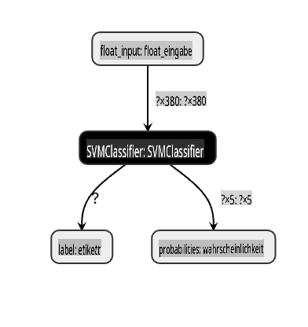
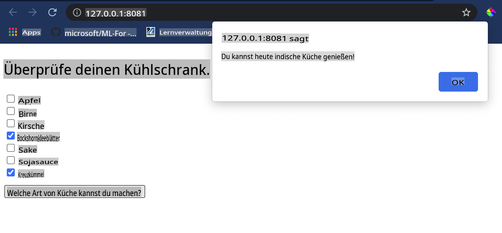

# Erstellen Sie eine Web-App zur Empfehlungen von Küchen

In dieser Lektion werden Sie ein Klassifikationsmodell erstellen, indem Sie einige der Techniken verwenden, die Sie in früheren Lektionen gelernt haben, und mit dem köstlichen Küchendatensatz, der in dieser Reihe verwendet wird. Darüber hinaus werden Sie eine kleine Web-App erstellen, um ein gespeichertes Modell zu verwenden, und dabei die Web-Laufzeit von Onnx nutzen.

Eine der nützlichsten praktischen Anwendungen des maschinellen Lernens ist der Aufbau von Empfehlungssystemen, und Sie können heute den ersten Schritt in diese Richtung machen!

[](https://youtu.be/17wdM9AHMfg "Angewandtes ML")

> 🎥 Klicken Sie auf das Bild oben für ein Video: Jen Looper erstellt eine Web-App mit klassifizierten Küchendaten

## [Vorlesungsquiz](https://gray-sand-07a10f403.1.azurestaticapps.net/quiz/25/)

In dieser Lektion werden Sie lernen:

- Wie man ein Modell erstellt und es als Onnx-Modell speichert
- Wie man Netron verwendet, um das Modell zu inspizieren
- Wie man Ihr Modell in einer Web-App für Inferenz verwendet

## Erstellen Sie Ihr Modell

Der Aufbau angewandter ML-Systeme ist ein wichtiger Teil der Nutzung dieser Technologien für Ihre Geschäftssysteme. Sie können Modelle in Ihren Webanwendungen verwenden (und somit bei Bedarf auch in einem Offline-Kontext) durch die Nutzung von Onnx.

In einer [früheren Lektion](../../3-Web-App/1-Web-App/README.md) haben Sie ein Regressionsmodell über UFO-Sichtungen erstellt, es "eingelegt" und in einer Flask-App verwendet. Während diese Architektur sehr nützlich zu wissen ist, handelt es sich um eine Full-Stack-Python-App, und Ihre Anforderungen können die Verwendung einer JavaScript-Anwendung umfassen.

In dieser Lektion können Sie ein einfaches JavaScript-basiertes System für Inferenz erstellen. Zuerst müssen Sie jedoch ein Modell trainieren und es für die Verwendung mit Onnx konvertieren.

## Übung - Klassifikationsmodell trainieren

Zuerst trainieren Sie ein Klassifikationsmodell mit dem bereinigten Küchendatensatz, den wir verwendet haben.

1. Beginnen Sie mit dem Importieren nützlicher Bibliotheken:

    ```python
    !pip install skl2onnx
    import pandas as pd 
    ```

    Sie benötigen '[skl2onnx](https://onnx.ai/sklearn-onnx/)', um Ihr Scikit-learn-Modell in das Onnx-Format zu konvertieren.

1. Arbeiten Sie dann mit Ihren Daten auf die gleiche Weise, wie Sie es in früheren Lektionen getan haben, indem Sie eine CSV-Datei mit `read_csv()` lesen:

    ```python
    data = pd.read_csv('../data/cleaned_cuisines.csv')
    data.head()
    ```

1. Entfernen Sie die ersten beiden unnötigen Spalten und speichern Sie die verbleibenden Daten als 'X':

    ```python
    X = data.iloc[:,2:]
    X.head()
    ```

1. Speichern Sie die Labels als 'y':

    ```python
    y = data[['cuisine']]
    y.head()
    
    ```

### Beginnen Sie die Trainingsroutine

Wir werden die 'SVC'-Bibliothek verwenden, die eine gute Genauigkeit aufweist.

1. Importieren Sie die entsprechenden Bibliotheken von Scikit-learn:

    ```python
    from sklearn.model_selection import train_test_split
    from sklearn.svm import SVC
    from sklearn.model_selection import cross_val_score
    from sklearn.metrics import accuracy_score,precision_score,confusion_matrix,classification_report
    ```

1. Trennen Sie die Trainings- und Testdatensätze:

    ```python
    X_train, X_test, y_train, y_test = train_test_split(X,y,test_size=0.3)
    ```

1. Erstellen Sie ein SVC-Klassifikationsmodell, wie Sie es in der vorherigen Lektion getan haben:

    ```python
    model = SVC(kernel='linear', C=10, probability=True,random_state=0)
    model.fit(X_train,y_train.values.ravel())
    ```

1. Testen Sie jetzt Ihr Modell, indem Sie `predict()` aufrufen:

    ```python
    y_pred = model.predict(X_test)
    ```

1. Drucken Sie einen Klassifikationsbericht aus, um die Qualität des Modells zu überprüfen:

    ```python
    print(classification_report(y_test,y_pred))
    ```

    Wie wir zuvor gesehen haben, ist die Genauigkeit gut:

    ```output
                    precision    recall  f1-score   support
    
         chinese       0.72      0.69      0.70       257
          indian       0.91      0.87      0.89       243
        japanese       0.79      0.77      0.78       239
          korean       0.83      0.79      0.81       236
            thai       0.72      0.84      0.78       224
    
        accuracy                           0.79      1199
       macro avg       0.79      0.79      0.79      1199
    weighted avg       0.79      0.79      0.79      1199
    ```

### Konvertieren Sie Ihr Modell in Onnx

Stellen Sie sicher, dass Sie die Konvertierung mit der richtigen Tensoranzahl durchführen. Dieser Datensatz hat 380 aufgeführte Zutaten, daher müssen Sie diese Zahl in `FloatTensorType` vermerken:

1. Konvertieren Sie mit einer Tensoranzahl von 380.

    ```python
    from skl2onnx import convert_sklearn
    from skl2onnx.common.data_types import FloatTensorType
    
    initial_type = [('float_input', FloatTensorType([None, 380]))]
    options = {id(model): {'nocl': True, 'zipmap': False}}
    ```

1. Erstellen Sie die onx und speichern Sie sie als Datei **model.onnx**:

    ```python
    onx = convert_sklearn(model, initial_types=initial_type, options=options)
    with open("./model.onnx", "wb") as f:
        f.write(onx.SerializeToString())
    ```

    > Hinweis: Sie können in Ihrem Konvertierungsskript [Optionen](https://onnx.ai/sklearn-onnx/parameterized.html) übergeben. In diesem Fall haben wir 'nocl' auf True und 'zipmap' auf False gesetzt. Da dies ein Klassifikationsmodell ist, haben Sie die Möglichkeit, ZipMap zu entfernen, das eine Liste von Dictionaries produziert (nicht notwendig). `nocl` refers to class information being included in the model. Reduce your model's size by setting `nocl` to 'True'. 

Running the entire notebook will now build an Onnx model and save it to this folder.

## View your model

Onnx models are not very visible in Visual Studio code, but there's a very good free software that many researchers use to visualize the model to ensure that it is properly built. Download [Netron](https://github.com/lutzroeder/Netron) and  open your model.onnx file. You can see your simple model visualized, with its 380 inputs and classifier listed:



Netron is a helpful tool to view your models.

Now you are ready to use this neat model in a web app. Let's build an app that will come in handy when you look in your refrigerator and try to figure out which combination of your leftover ingredients you can use to cook a given cuisine, as determined by your model.

## Build a recommender web application

You can use your model directly in a web app. This architecture also allows you to run it locally and even offline if needed. Start by creating an `index.html` file in the same folder where you stored your `model.onnx`-Datei.

1. In dieser Datei _index.html_ fügen Sie das folgende Markup hinzu:

    ```html
    <!DOCTYPE html>
    <html>
        <header>
            <title>Cuisine Matcher</title>
        </header>
        <body>
            ...
        </body>
    </html>
    ```

1. Arbeiten Sie nun innerhalb der `body`-Tags und fügen Sie ein wenig Markup hinzu, um eine Liste von Kontrollkästchen anzuzeigen, die einige Zutaten widerspiegeln:

    ```html
    <h1>Check your refrigerator. What can you create?</h1>
            <div id="wrapper">
                <div class="boxCont">
                    <input type="checkbox" value="4" class="checkbox">
                    <label>apple</label>
                </div>
            
                <div class="boxCont">
                    <input type="checkbox" value="247" class="checkbox">
                    <label>pear</label>
                </div>
            
                <div class="boxCont">
                    <input type="checkbox" value="77" class="checkbox">
                    <label>cherry</label>
                </div>
    
                <div class="boxCont">
                    <input type="checkbox" value="126" class="checkbox">
                    <label>fenugreek</label>
                </div>
    
                <div class="boxCont">
                    <input type="checkbox" value="302" class="checkbox">
                    <label>sake</label>
                </div>
    
                <div class="boxCont">
                    <input type="checkbox" value="327" class="checkbox">
                    <label>soy sauce</label>
                </div>
    
                <div class="boxCont">
                    <input type="checkbox" value="112" class="checkbox">
                    <label>cumin</label>
                </div>
            </div>
            <div style="padding-top:10px">
                <button onClick="startInference()">What kind of cuisine can you make?</button>
            </div> 
    ```

    Beachten Sie, dass jedem Kontrollkästchen ein Wert zugewiesen wird. Dies spiegelt den Index wider, an dem die Zutat laut dem Datensatz gefunden wird. Apfel zum Beispiel nimmt in dieser alphabetischen Liste die fünfte Spalte ein, daher ist ihr Wert '4', da wir bei 0 zu zählen beginnen. Sie können die [Zutaten-Tabelle](../../../../4-Classification/data/ingredient_indexes.csv) konsultieren, um den Index einer bestimmten Zutat zu entdecken.

    Fahren Sie mit Ihrer Arbeit in der index.html-Datei fort und fügen Sie einen Skriptblock hinzu, in dem das Modell nach dem letzten schließenden `</div>` aufgerufen wird.

1. Zuerst importieren Sie die [Onnx-Laufzeit](https://www.onnxruntime.ai/):

    ```html
    <script src="https://cdn.jsdelivr.net/npm/onnxruntime-web@1.9.0/dist/ort.min.js"></script> 
    ```

    > Die Onnx-Laufzeit wird verwendet, um das Ausführen Ihrer Onnx-Modelle auf einer Vielzahl von Hardwareplattformen zu ermöglichen, einschließlich Optimierungen und einer API zur Nutzung.

1. Sobald die Laufzeit eingerichtet ist, können Sie sie aufrufen:

    ```html
    <script>
        const ingredients = Array(380).fill(0);
        
        const checks = [...document.querySelectorAll('.checkbox')];
        
        checks.forEach(check => {
            check.addEventListener('change', function() {
                // toggle the state of the ingredient
                // based on the checkbox's value (1 or 0)
                ingredients[check.value] = check.checked ? 1 : 0;
            });
        });

        function testCheckboxes() {
            // validate if at least one checkbox is checked
            return checks.some(check => check.checked);
        }

        async function startInference() {

            let atLeastOneChecked = testCheckboxes()

            if (!atLeastOneChecked) {
                alert('Please select at least one ingredient.');
                return;
            }
            try {
                // create a new session and load the model.
                
                const session = await ort.InferenceSession.create('./model.onnx');

                const input = new ort.Tensor(new Float32Array(ingredients), [1, 380]);
                const feeds = { float_input: input };

                // feed inputs and run
                const results = await session.run(feeds);

                // read from results
                alert('You can enjoy ' + results.label.data[0] + ' cuisine today!')

            } catch (e) {
                console.log(`failed to inference ONNX model`);
                console.error(e);
            }
        }
               
    </script>
    ```

In diesem Code passieren mehrere Dinge:

1. Sie haben ein Array von 380 möglichen Werten (1 oder 0) erstellt, die gesetzt und an das Modell zur Inferenz gesendet werden, je nachdem, ob ein Zutaten-Kontrollkästchen aktiviert ist.
2. Sie haben ein Array von Kontrollkästchen erstellt und eine Möglichkeit, zu bestimmen, ob sie aktiviert sind in einem `init` function that is called when the application starts. When a checkbox is checked, the `ingredients` array is altered to reflect the chosen ingredient.
3. You created a `testCheckboxes` function that checks whether any checkbox was checked.
4. You use `startInference` function when the button is pressed and, if any checkbox is checked, you start inference.
5. The inference routine includes:
   1. Setting up an asynchronous load of the model
   2. Creating a Tensor structure to send to the model
   3. Creating 'feeds' that reflects the `float_input` input that you created when training your model (you can use Netron to verify that name)
   4. Sending these 'feeds' to the model and waiting for a response

## Test your application

Open a terminal session in Visual Studio Code in the folder where your index.html file resides. Ensure that you have [http-server](https://www.npmjs.com/package/http-server) installed globally, and type `http-server` an der Eingabeaufforderung. Ein localhost sollte sich öffnen und Sie können Ihre Web-App anzeigen. Überprüfen Sie, welche Küche basierend auf verschiedenen Zutaten empfohlen wird:



Herzlichen Glückwunsch, Sie haben eine 'Empfehlungs'-Web-App mit einigen Feldern erstellt. Nehmen Sie sich Zeit, um dieses System weiter auszubauen!
## 🚀Herausforderung

Ihre Web-App ist sehr minimal, also fahren Sie fort, sie mit Zutaten und deren Indizes aus den [ingredient_indexes](../../../../4-Classification/data/ingredient_indexes.csv) Daten auszubauen. Welche Geschmacksrichtungenkombinationen funktionieren, um ein bestimmtes Nationalgericht zu kreieren?

## [Nachlesungsquiz](https://gray-sand-07a10f403.1.azurestaticapps.net/quiz/26/)

## Überprüfung & Selbststudium

Während diese Lektion nur die Nützlichkeit der Erstellung eines Empfehlungssystems für Lebensmittelzutaten angesprochen hat, ist dieser Bereich der ML-Anwendungen sehr reich an Beispielen. Lesen Sie mehr darüber, wie diese Systeme aufgebaut sind:

- https://www.sciencedirect.com/topics/computer-science/recommendation-engine
- https://www.technologyreview.com/2014/08/25/171547/the-ultimate-challenge-for-recommendation-engines/
- https://www.technologyreview.com/2015/03/23/168831/everything-is-a-recommendation/

## Aufgabe 

[Erstellen Sie einen neuen Empfehlungsalgorithmus](assignment.md)

**Haftungsausschluss**:  
Dieses Dokument wurde mit maschinellen KI-Übersetzungsdiensten übersetzt. Obwohl wir uns um Genauigkeit bemühen, sollten Sie sich bewusst sein, dass automatisierte Übersetzungen Fehler oder Ungenauigkeiten enthalten können. Das Originaldokument in seiner ursprünglichen Sprache sollte als maßgebliche Quelle betrachtet werden. Für wichtige Informationen wird eine professionelle menschliche Übersetzung empfohlen. Wir übernehmen keine Haftung für Missverständnisse oder Fehlinterpretationen, die aus der Verwendung dieser Übersetzung resultieren.