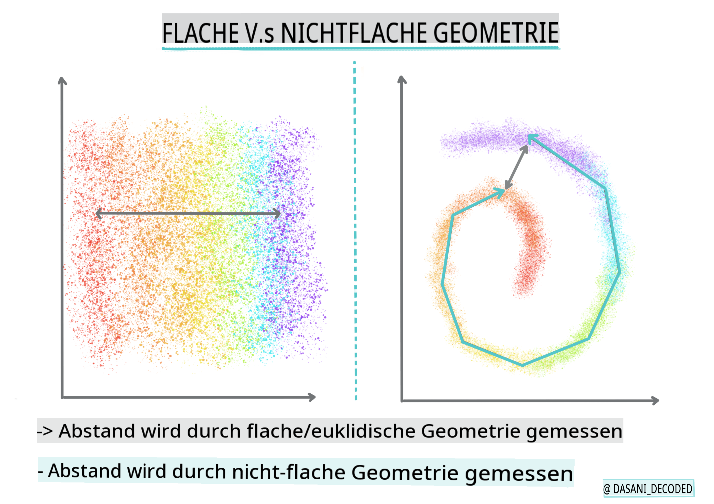
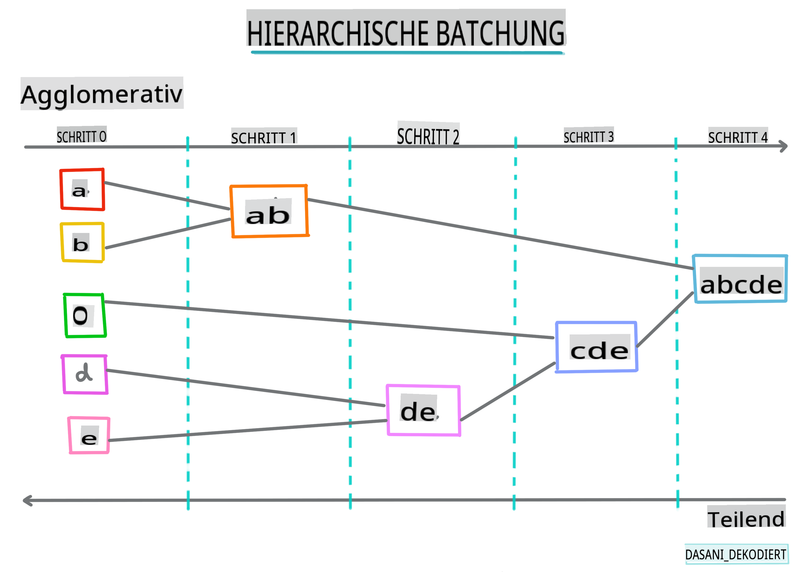
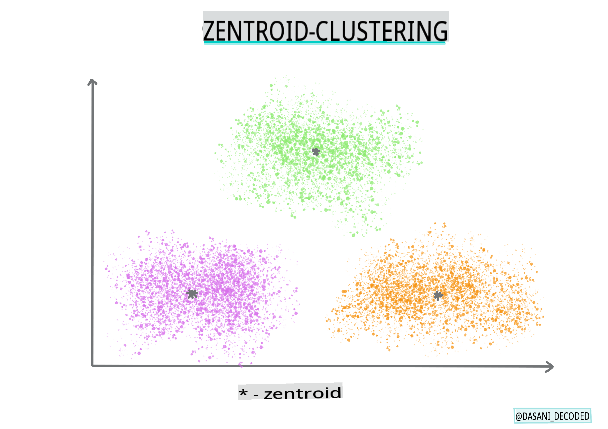

# Einführung in das Clustering

Clustering ist eine Art von [Unsupervised Learning](https://wikipedia.org/wiki/Unsupervised_learning), die davon ausgeht, dass ein Datensatz unbeschriftet ist oder dass seine Eingaben nicht mit vordefinierten Ausgaben übereinstimmen. Es verwendet verschiedene Algorithmen, um unbeschriftete Daten zu durchsuchen und Gruppierungen gemäß den Mustern, die es in den Daten erkennt, bereitzustellen.

[](https://youtu.be/ty2advRiWJM "No One Like You von PSquare")

> 🎥 Klicken Sie auf das obige Bild für ein Video. Während Sie das maschinelle Lernen mit Clustering studieren, genießen Sie einige Nigerian Dance Hall-Tracks – dies ist ein hochbewertetes Lied aus dem Jahr 2014 von PSquare.

## [Vorlesungsquiz](https://gray-sand-07a10f403.1.azurestaticapps.net/quiz/27/)

### Einführung

[Clustering](https://link.springer.com/referenceworkentry/10.1007%2F978-0-387-30164-8_124) ist sehr nützlich für die Datenexploration. Lassen Sie uns sehen, ob es helfen kann, Trends und Muster in der Art und Weise zu entdecken, wie nigerianische Zuschauer Musik konsumieren.

✅ Nehmen Sie sich einen Moment Zeit, um über die Anwendungen des Clustering nachzudenken. Im wirklichen Leben passiert Clustering immer dann, wenn Sie einen Wäscheberg haben und die Kleidung Ihrer Familienmitglieder sortieren müssen 🧦👕👖🩲. In der Datenwissenschaft tritt Clustering auf, wenn versucht wird, die Vorlieben eines Benutzers zu analysieren oder die Merkmale eines unbeschrifteten Datensatzes zu bestimmen. Clustering hilft auf eine Weise, Chaos zu ordnen, wie eine Sockenschublade.

[](https://youtu.be/esmzYhuFnds "Einführung in das Clustering")

> 🎥 Klicken Sie auf das obige Bild für ein Video: MITs John Guttag führt in das Clustering ein.

In einem professionellen Umfeld kann Clustering verwendet werden, um Dinge wie Marktsegmentierung zu bestimmen, um herauszufinden, welche Altersgruppen welche Artikel kaufen. Eine andere Anwendung könnte die Anomalieerkennung sein, um möglicherweise Betrug aus einem Datensatz von Kreditkartentransaktionen zu erkennen. Oder Sie könnten Clustering verwenden, um Tumore in einer Reihe medizinischer Scans zu identifizieren.

✅ Denken Sie einen Moment darüber nach, wie Sie Clustering „in der Wildnis“ begegnet sind, sei es im Bankwesen, im E-Commerce oder in einem Geschäftsumfeld.

> 🎓 Interessanterweise stammt die Clusteranalyse aus den Bereichen Anthropologie und Psychologie in den 1930er Jahren. Können Sie sich vorstellen, wie sie verwendet worden sein könnte?

Alternativ könnten Sie es verwenden, um Suchergebnisse zu gruppieren – nach Einkaufslinks, Bildern oder Bewertungen zum Beispiel. Clustering ist nützlich, wenn Sie einen großen Datensatz haben, den Sie reduzieren möchten und auf dem Sie eine detailliertere Analyse durchführen möchten, sodass die Technik verwendet werden kann, um mehr über Daten zu lernen, bevor andere Modelle erstellt werden.

✅ Sobald Ihre Daten in Clustern organisiert sind, weisen Sie ihnen eine Cluster-ID zu, und diese Technik kann nützlich sein, um die Privatsphäre eines Datensatzes zu wahren; Sie können stattdessen auf einen Datenpunkt über seine Cluster-ID verweisen, anstatt auf aufschlussreichere identifizierbare Daten. Können Sie an andere Gründe denken, warum Sie auf eine Cluster-ID anstelle anderer Elemente des Clusters verweisen würden, um ihn zu identifizieren?

Vertiefen Sie Ihr Verständnis der Clustering-Techniken in diesem [Lernmodul](https://docs.microsoft.com/learn/modules/train-evaluate-cluster-models?WT.mc_id=academic-77952-leestott).

## Erste Schritte mit Clustering

[Scikit-learn bietet eine große Auswahl](https://scikit-learn.org/stable/modules/clustering.html) an Methoden zur Durchführung von Clustering. Die Wahl, die Sie treffen, hängt von Ihrem Anwendungsfall ab. Laut der Dokumentation hat jede Methode verschiedene Vorteile. Hier ist eine vereinfachte Tabelle der von Scikit-learn unterstützten Methoden und ihrer geeigneten Anwendungsfälle:

| Methodenname                  | Anwendungsfall                                                       |
| :---------------------------- | :------------------------------------------------------------------- |
| K-Means                       | allgemeiner Zweck, induktiv                                         |
| Affinitätsausbreitung         | viele, ungleiche Cluster, induktiv                                  |
| Mean-Shift                    | viele, ungleiche Cluster, induktiv                                  |
| Spektrales Clustering         | wenige, gleichmäßige Cluster, transduktiv                           |
| Ward-hierarchisches Clustering | viele, eingeschränkte Cluster, transduktiv                          |
| Agglomeratives Clustering     | viele, eingeschränkte, nicht-euklidische Abstände, transduktiv     |
| DBSCAN                        | nicht-flache Geometrie, ungleiche Cluster, transduktiv             |
| OPTICS                        | nicht-flache Geometrie, ungleiche Cluster mit variabler Dichte, transduktiv |
| Gaußsche Mischungen           | flache Geometrie, induktiv                                          |
| BIRCH                         | großer Datensatz mit Ausreißern, induktiv                          |

> 🎓 Wie wir Cluster erstellen, hängt stark davon ab, wie wir die Datenpunkte in Gruppen zusammenfassen. Lassen Sie uns einige Begriffe aufschlüsseln:
>
> 🎓 ['Transduktiv' vs. 'induktiv'](https://wikipedia.org/wiki/Transduction_(machine_learning))
> 
> Transduktive Inferenz wird aus beobachteten Trainingsfällen abgeleitet, die bestimmten Testfällen zugeordnet sind. Induktive Inferenz wird aus Trainingsfällen abgeleitet, die auf allgemeine Regeln abzielen, die dann auf Testfälle angewendet werden.
> 
> Ein Beispiel: Stellen Sie sich vor, Sie haben einen Datensatz, der nur teilweise beschriftet ist. Einige Dinge sind „Platten“, einige „CDs“ und einige sind leer. Ihre Aufgabe ist es, die leeren Felder zu beschriften. Wenn Sie sich für einen induktiven Ansatz entscheiden, würden Sie ein Modell trainieren, das nach „Platten“ und „CDs“ sucht, und diese Beschriftungen auf Ihre unbeschrifteten Daten anwenden. Dieser Ansatz hat Schwierigkeiten, Dinge zu klassifizieren, die tatsächlich „Kassetten“ sind. Ein transduktiver Ansatz hingegen behandelt diese unbekannten Daten effektiver, da er versucht, ähnliche Elemente zusammenzufassen und dann eine Beschriftung für eine Gruppe anzuwenden. In diesem Fall könnten Cluster „runde musikalische Dinge“ und „quadratische musikalische Dinge“ widerspiegeln.
> 
> 🎓 ['Nicht-flache' vs. 'flache' Geometrie](https://datascience.stackexchange.com/questions/52260/terminology-flat-geometry-in-the-context-of-clustering)
> 
> Abgeleitet aus der mathematischen Terminologie bezieht sich nicht-flache vs. flache Geometrie auf die Messung der Abstände zwischen Punkten entweder durch „flache“ ([Euklidische](https://wikipedia.org/wiki/Euclidean_geometry)) oder „nicht-flache“ (nicht-euklidische) geometrische Methoden.
>
> „Flach“ in diesem Kontext bezieht sich auf die euklidische Geometrie (Teile davon werden als „Ebene“ Geometrie gelehrt), und nicht-flach bezieht sich auf nicht-euklidische Geometrie. Was hat Geometrie mit maschinellem Lernen zu tun? Nun, da beide Bereiche auf Mathematik basieren, muss es eine gemeinsame Möglichkeit geben, Abstände zwischen Punkten in Clustern zu messen, und das kann auf eine „flache“ oder „nicht-flache“ Weise geschehen, je nach Art der Daten. [Euklidische Abstände](https://wikipedia.org/wiki/Euclidean_distance) werden als die Länge eines Liniensegments zwischen zwei Punkten gemessen. [Nicht-euklidische Abstände](https://wikipedia.org/wiki/Non-Euclidean_geometry) werden entlang einer Kurve gemessen. Wenn Ihre Daten, visualisiert, nicht auf einer Ebene zu existieren scheinen, müssen Sie möglicherweise einen spezialisierten Algorithmus verwenden, um damit umzugehen.
>

> Infografik von [Dasani Madipalli](https://twitter.com/dasani_decoded)
> 
> 🎓 ['Abstände'](https://web.stanford.edu/class/cs345a/slides/12-clustering.pdf)
> 
> Cluster werden durch ihre Distanzmatrix definiert, z. B. die Abstände zwischen Punkten. Diese Distanz kann auf verschiedene Weise gemessen werden. Euklidische Cluster werden durch den Durchschnitt der Punktwerte definiert und enthalten einen „Zentroid“ oder Mittelpunkt. Abstände werden somit durch die Distanz zu diesem Zentroid gemessen. Nicht-euklidische Abstände beziehen sich auf „Clustroids“, den Punkt, der anderen Punkten am nächsten ist. Clustroids können wiederum auf verschiedene Weise definiert werden.
> 
> 🎓 ['Eingeschränkt'](https://wikipedia.org/wiki/Constrained_clustering)
> 
> [Eingeschränktes Clustering](https://web.cs.ucdavis.edu/~davidson/Publications/ICDMTutorial.pdf) führt „semi-supervised“ Lernen in diese unüberwachte Methode ein. Die Beziehungen zwischen Punkten werden als „können nicht verlinken“ oder „müssen verlinken“ gekennzeichnet, sodass einige Regeln auf den Datensatz angewendet werden.
>
> Ein Beispiel: Wenn ein Algorithmus auf einen Batch von unbeschrifteten oder halb-beschrifteten Daten losgelassen wird, können die erzeugten Cluster von schlechter Qualität sein. Im obigen Beispiel könnten die Cluster „runde Musikdinge“, „quadratische Musikdinge“ und „dreieckige Dinge“ sowie „Kekse“ gruppieren. Wenn einige Einschränkungen oder Regeln vorgegeben werden („der Artikel muss aus Kunststoff bestehen“, „der Artikel muss in der Lage sein, Musik zu erzeugen“), kann dies helfen, den Algorithmus zu „beschränken“, um bessere Entscheidungen zu treffen.
> 
> 🎓 'Dichte'
> 
> Daten, die „rauschend“ sind, gelten als „dicht“. Die Abstände zwischen Punkten in jedem ihrer Cluster können bei näherer Betrachtung mehr oder weniger dicht oder „überfüllt“ sein, und diese Daten müssen mit der geeigneten Clustering-Methode analysiert werden. [Dieser Artikel](https://www.kdnuggets.com/2020/02/understanding-density-based-clustering.html) zeigt den Unterschied zwischen der Verwendung von K-Means-Clustering und HDBSCAN-Algorithmen zur Untersuchung eines rauschenden Datensatzes mit ungleicher Clusterdichte.

## Clustering-Algorithmen

Es gibt über 100 Clustering-Algorithmen, und ihre Verwendung hängt von der Art der vorliegenden Daten ab. Lassen Sie uns einige der wichtigsten besprechen:

- **Hierarchisches Clustering**. Wenn ein Objekt anhand seiner Nähe zu einem nahegelegenen Objekt klassifiziert wird, anstatt zu einem weiter entfernten, werden Cluster basierend auf der Distanz ihrer Mitglieder zu und von anderen Objekten gebildet. Das agglomerative Clustering von Scikit-learn ist hierarchisch.

   
   > Infografik von [Dasani Madipalli](https://twitter.com/dasani_decoded)

- **Zentroid-Clustering**. Dieser beliebte Algorithmus erfordert die Wahl von „k“ oder der Anzahl der zu bildenden Cluster, nach der der Algorithmus den Mittelpunkt eines Clusters bestimmt und Daten um diesen Punkt herum sammelt. [K-Means-Clustering](https://wikipedia.org/wiki/K-means_clustering) ist eine beliebte Version des Zentroid-Clustering. Der Mittelpunkt wird durch den nächstgelegenen Mittelwert bestimmt, daher der Name. Die quadratische Distanz vom Cluster wird minimiert.

   
   > Infografik von [Dasani Madipalli](https://twitter.com/dasani_decoded)

- **Verteilungsbasiertes Clustering**. Basierend auf statistischer Modellierung konzentriert sich das verteilungsbasierte Clustering darauf, die Wahrscheinlichkeit zu bestimmen, dass ein Datenpunkt zu einem Cluster gehört, und ihn entsprechend zuzuordnen. Gaußsche Mischmethoden gehören zu diesem Typ.

- **Dichtebasiertes Clustering**. Datenpunkte werden basierend auf ihrer Dichte oder ihrer Gruppierung um einander in Cluster eingeteilt. Datenpunkte, die weit von der Gruppe entfernt sind, gelten als Ausreißer oder Rauschen. DBSCAN, Mean-Shift und OPTICS gehören zu diesem Typ des Clustering.

- **Gitterbasiertes Clustering**. Für mehrdimensionale Datensätze wird ein Gitter erstellt und die Daten werden auf die Zellen des Gitters verteilt, wodurch Cluster entstehen.

## Übung - Clustern Sie Ihre Daten

Clustering als Technik wird stark durch die richtige Visualisierung unterstützt, also lassen Sie uns damit beginnen, unsere Musikdaten zu visualisieren. Diese Übung wird uns helfen zu entscheiden, welche der Methoden des Clustering wir am effektivsten für die Natur dieser Daten verwenden sollten.

1. Öffnen Sie die [_notebook.ipynb_](https://github.com/microsoft/ML-For-Beginners/blob/main/5-Clustering/1-Visualize/notebook.ipynb) Datei in diesem Ordner.

1. Importieren Sie das `Seaborn` Paket für eine gute Datenvisualisierung.

    ```python
    !pip install seaborn
    ```

1. Fügen Sie die Songdaten aus [_nigerian-songs.csv_](https://github.com/microsoft/ML-For-Beginners/blob/main/5-Clustering/data/nigerian-songs.csv) hinzu. Laden Sie einen DataFrame mit einigen Daten über die Songs. Machen Sie sich bereit, diese Daten zu erkunden, indem Sie die Bibliotheken importieren und die Daten ausgeben:

    ```python
    import matplotlib.pyplot as plt
    import pandas as pd
    
    df = pd.read_csv("../data/nigerian-songs.csv")
    df.head()
    ```

    Überprüfen Sie die ersten paar Zeilen der Daten:

    |     | name                     | album                        | artist              | artist_top_genre | release_date | length | popularity | danceability | acousticness | energy | instrumentalness | liveness | loudness | speechiness | tempo   | time_signature |
    | --- | ------------------------ | ---------------------------- | ------------------- | ---------------- | ------------ | ------ | ---------- | ------------ | ------------ | ------ | ---------------- | -------- | -------- | ----------- | ------- | -------------- |
    | 0   | Sparky                   | Mandy & The Jungle           | Cruel Santino       | alternative r&b  | 2019         | 144000 | 48         | 0.666        | 0.851        | 0.42   | 0.534            | 0.11     | -6.699   | 0.0829      | 133.015 | 5              |
    | 1   | shuga rush               | EVERYTHING YOU HEARD IS TRUE | Odunsi (The Engine) | afropop          | 2020         | 89488  | 30         | 0.71         | 0.0822       | 0.683  | 0.000169         | 0.101    | -5.64    | 0.36        | 129.993 | 3              |
    | 2   | LITT!                    | LITT!                        | AYLØ                | indie r&b        | 2018         | 207758 | 40         | 0.836        | 0.272        | 0.564  | 0.000537         | 0.11     | -7.127   | 0.0424      | 130.005 | 4              |
    | 3   | Confident / Feeling Cool | Enjoy Your Life              | Lady Donli          | nigerian pop     | 2019         | 175135 | 14         | 0.894        | 0.798        | 0.611  | 0.000187         | 0.0964   | -4.961   | 0.113       | 111.087 | 4              |
    | 4   | wanted you               | rare.                        | Odunsi (The Engine) | afropop          | 2018         | 152049 | 25         | 0.702        | 0.116        | 0.833  | 0.91             | 0.348    | -6.044   | 0.0447      | 105.115 | 4              |

1. Holen Sie sich einige Informationen über den DataFrame, indem Sie `info()` aufrufen:

    ```python
    df.info()
    ```

   Die Ausgabe sieht so aus:

    ```output
    <class 'pandas.core.frame.DataFrame'>
    RangeIndex: 530 entries, 0 to 529
    Data columns (total 16 columns):
     #   Column            Non-Null Count  Dtype  
    ---  ------            --------------  -----  
     0   name              530 non-null    object 
     1   album             530 non-null    object 
     2   artist            530 non-null    object 
     3   artist_top_genre  530 non-null    object 
     4   release_date      530 non-null    int64  
     5   length            530 non-null    int64  
     6   popularity        530 non-null    int64  
     7   danceability      530 non-null    float64
     8   acousticness      530 non-null    float64
     9   energy            530 non-null    float64
     10  instrumentalness  530 non-null    float64
     11  liveness          530 non-null    float64
     12  loudness          530 non-null    float64
     13  speechiness       530 non-null    float64
     14  tempo             530 non-null    float64
     15  time_signature    530 non-null    int64  
    dtypes: float64(8), int64(4), object(4)
    memory usage: 66.4+ KB
    ```

1. Überprüfen Sie auf Nullwerte, indem Sie `isnull()` aufrufen und überprüfen, ob die Summe 0 ist:

    ```python
    df.isnull().sum()
    ```

    Sieht gut aus:

    ```output
    name                0
    album               0
    artist              0
    artist_top_genre    0
    release_date        0
    length              0
    popularity          0
    danceability        0
    acousticness        0
    energy              0
    instrumentalness    0
    liveness            0
    loudness            0
    speechiness         0
    tempo               0
    time_signature      0
    dtype: int64
    ```

1. Beschreiben Sie die Daten:

    ```python
    df.describe()
    ```

    |       | release_date | length      | popularity | danceability | acousticness | energy   | instrumentalness | liveness | loudness  | speechiness | tempo      | time_signature |
    | ----- | ------------ | ----------- | ---------- | ------------ | ------------ | -------- | ---------------- | -------- | --------- | ----------- | ---------- | -------------- |
    | count | 530          | 530         | 530        | 530          | 530          | 530      | 530              | 530      | 530       | 530         | 530        | 530            |
    | mean  | 2015.390566  | 222298.1698 | 17.507547  | 0.741619     | 0.265412     | 0.760623 | 0.016305         | 0.147308 | -4.953011 | 0.130748    | 116.487864 | 3.986792       |
    | std   | 3.131688     | 39696.82226 | 18.992212  | 0.117522     | 0.208342     | 0.148533 | 0.090321         | 0.123588 | 2.464186  | 0.092939    | 23.518601  | 0.333701       |
    | min   | 199
## [Quiz nach der Vorlesung](https://gray-sand-07a10f403.1.azurestaticapps.net/quiz/28/)

## Überprüfung & Selbststudium

Bevor Sie Clustering-Algorithmen anwenden, wie wir gelernt haben, ist es eine gute Idee, die Natur Ihres Datensatzes zu verstehen. Lesen Sie mehr zu diesem Thema [hier](https://www.kdnuggets.com/2019/10/right-clustering-algorithm.html).

[Dieser hilfreiche Artikel](https://www.freecodecamp.org/news/8-clustering-algorithms-in-machine-learning-that-all-data-scientists-should-know/) erklärt Ihnen die verschiedenen Verhaltensweisen der verschiedenen Clustering-Algorithmen, abhängig von den unterschiedlichen Datenformen.

## Aufgabe

[Recherchieren Sie andere Visualisierungen für Clustering](assignment.md)

**Haftungsausschluss**:  
Dieses Dokument wurde mithilfe von maschinellen KI-Übersetzungsdiensten übersetzt. Obwohl wir uns um Genauigkeit bemühen, beachten Sie bitte, dass automatisierte Übersetzungen Fehler oder Ungenauigkeiten enthalten können. Das Originaldokument in seiner ursprünglichen Sprache sollte als die maßgebliche Quelle betrachtet werden. Für kritische Informationen wird eine professionelle menschliche Übersetzung empfohlen. Wir übernehmen keine Haftung für Missverständnisse oder Fehlinterpretationen, die aus der Verwendung dieser Übersetzung entstehen.