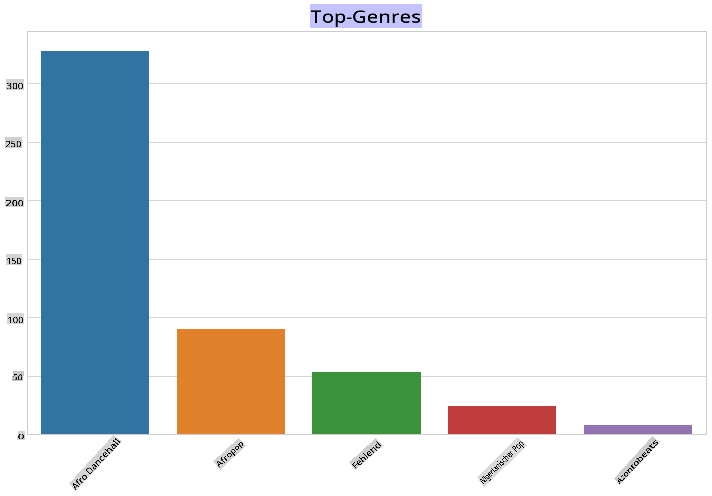
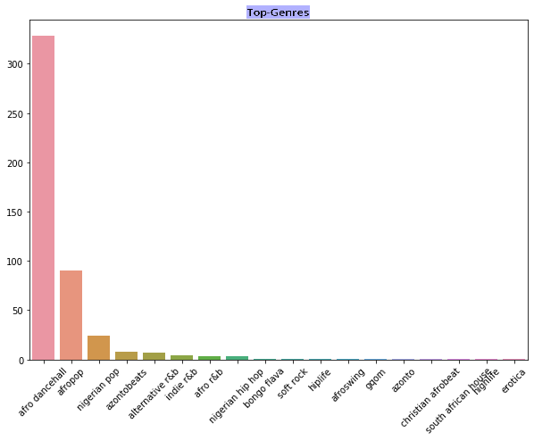
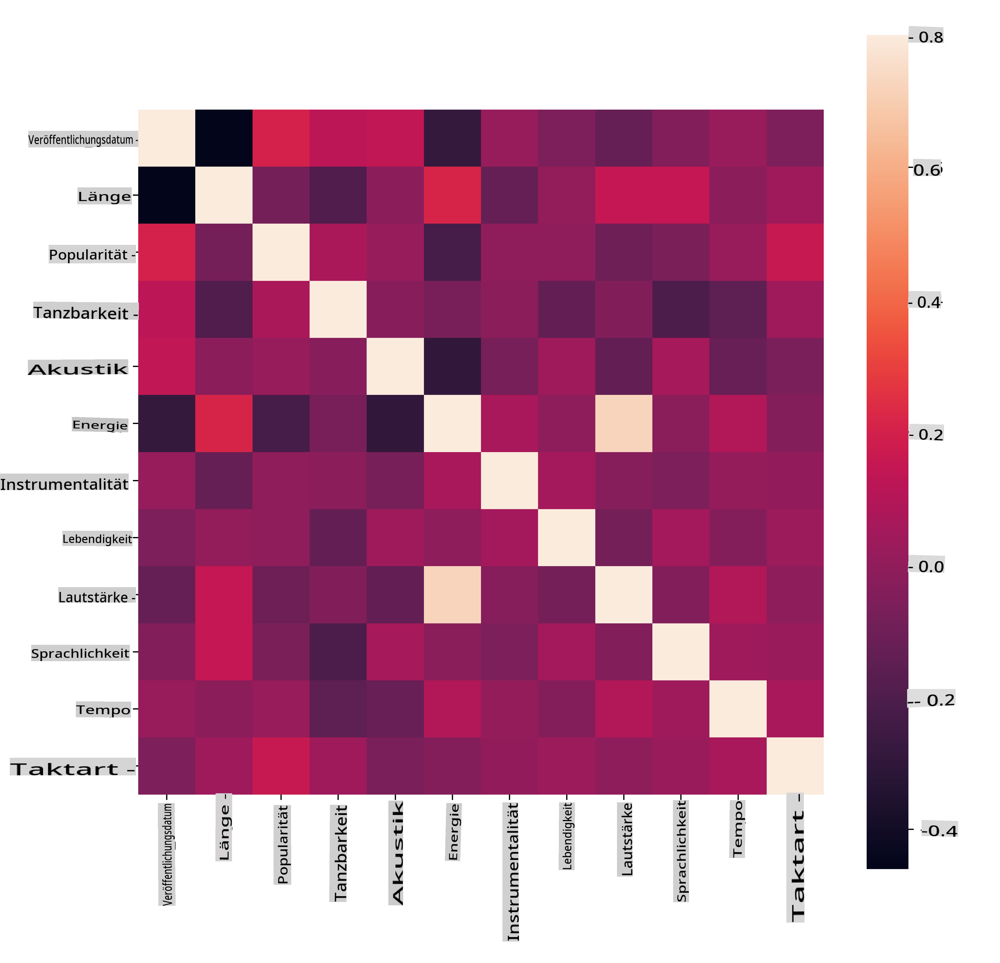
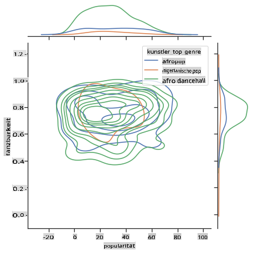
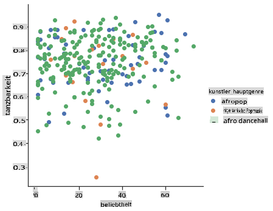

<!--
CO_OP_TRANSLATOR_METADATA:
{
  "original_hash": "0ab69b161efd7a41d325ee28b29415d7",
  "translation_date": "2025-09-03T21:46:15+00:00",
  "source_file": "5-Clustering/1-Visualize/README.md",
  "language_code": "de"
}
-->
# Einführung in Clustering

Clustering ist eine Art des [Unüberwachten Lernens](https://wikipedia.org/wiki/Unsupervised_learning), das davon ausgeht, dass ein Datensatz nicht beschriftet ist oder dass seine Eingaben nicht mit vordefinierten Ausgaben verknüpft sind. Es verwendet verschiedene Algorithmen, um unbeschriftete Daten zu sortieren und Gruppierungen basierend auf Mustern zu erstellen, die es in den Daten erkennt.

[](https://youtu.be/ty2advRiWJM "No One Like You von PSquare")

> 🎥 Klicken Sie auf das Bild oben für ein Video. Während Sie maschinelles Lernen mit Clustering studieren, genießen Sie einige nigerianische Dancehall-Tracks – dies ist ein hoch bewertetes Lied aus dem Jahr 2014 von PSquare.

## [Quiz vor der Vorlesung](https://gray-sand-07a10f403.1.azurestaticapps.net/quiz/27/)

### Einführung

[Clustering](https://link.springer.com/referenceworkentry/10.1007%2F978-0-387-30164-8_124) ist sehr nützlich für die Datenexploration. Schauen wir mal, ob es helfen kann, Trends und Muster in der Art und Weise zu entdecken, wie nigerianische Zuhörer Musik konsumieren.

✅ Nehmen Sie sich eine Minute Zeit, um über die Einsatzmöglichkeiten von Clustering nachzudenken. Im Alltag passiert Clustering immer dann, wenn Sie einen Wäschehaufen haben und die Kleidung Ihrer Familienmitglieder sortieren müssen 🧦👕👖🩲. In der Datenwissenschaft passiert Clustering, wenn versucht wird, die Vorlieben eines Nutzers zu analysieren oder die Eigenschaften eines unbeschrifteten Datensatzes zu bestimmen. Clustering hilft gewissermaßen, Chaos zu ordnen, wie eine Sockenschublade.

[](https://youtu.be/esmzYhuFnds "Einführung in Clustering")

> 🎥 Klicken Sie auf das Bild oben für ein Video: John Guttag von MIT führt in Clustering ein.

In einem professionellen Umfeld kann Clustering verwendet werden, um Dinge wie Marktsegmentierung zu bestimmen, beispielsweise welche Altersgruppen welche Artikel kaufen. Eine weitere Anwendung wäre die Anomalieerkennung, möglicherweise zur Betrugserkennung in einem Datensatz von Kreditkartentransaktionen. Oder Sie könnten Clustering verwenden, um Tumore in einer Reihe von medizinischen Scans zu identifizieren.

✅ Denken Sie einen Moment darüber nach, wie Sie Clustering „in freier Wildbahn“ erlebt haben, sei es im Bankwesen, E-Commerce oder Geschäftsumfeld.

> 🎓 Interessanterweise stammt die Clusteranalyse aus den Bereichen Anthropologie und Psychologie der 1930er Jahre. Können Sie sich vorstellen, wie sie damals verwendet wurde?

Alternativ könnten Sie es für die Gruppierung von Suchergebnissen verwenden – beispielsweise nach Einkaufslinks, Bildern oder Bewertungen. Clustering ist nützlich, wenn Sie einen großen Datensatz haben, den Sie reduzieren und auf dem Sie eine detailliertere Analyse durchführen möchten. Die Technik kann verwendet werden, um Daten zu verstehen, bevor andere Modelle erstellt werden.

✅ Sobald Ihre Daten in Clustern organisiert sind, weisen Sie ihnen eine Cluster-ID zu. Diese Technik kann nützlich sein, um die Privatsphäre eines Datensatzes zu wahren; Sie können stattdessen auf einen Datenpunkt anhand seiner Cluster-ID verweisen, anstatt auf offenere identifizierbare Daten. Können Sie sich andere Gründe vorstellen, warum Sie eine Cluster-ID anstelle anderer Elemente des Clusters verwenden würden, um sie zu identifizieren?

Vertiefen Sie Ihr Verständnis von Clustering-Techniken in diesem [Learn-Modul](https://docs.microsoft.com/learn/modules/train-evaluate-cluster-models?WT.mc_id=academic-77952-leestott).

## Einstieg in Clustering

[Scikit-learn bietet eine große Auswahl](https://scikit-learn.org/stable/modules/clustering.html) an Methoden zur Durchführung von Clustering. Die Wahl der Methode hängt von Ihrem Anwendungsfall ab. Laut Dokumentation hat jede Methode verschiedene Vorteile. Hier ist eine vereinfachte Tabelle der von Scikit-learn unterstützten Methoden und ihrer geeigneten Anwendungsfälle:

| Methodenname                 | Anwendungsfall                                                        |
| :--------------------------- | :-------------------------------------------------------------------- |
| K-Means                      | allgemeiner Zweck, induktiv                                           |
| Affinity Propagation         | viele, ungleichmäßige Cluster, induktiv                              |
| Mean-Shift                   | viele, ungleichmäßige Cluster, induktiv                              |
| Spectral Clustering          | wenige, gleichmäßige Cluster, transduktiv                            |
| Ward Hierarchical Clustering | viele, eingeschränkte Cluster, transduktiv                           |
| Agglomerative Clustering     | viele, eingeschränkte, nicht-euklidische Distanzen, transduktiv      |
| DBSCAN                       | nicht-flache Geometrie, ungleichmäßige Cluster, transduktiv          |
| OPTICS                       | nicht-flache Geometrie, ungleichmäßige Cluster mit variabler Dichte, transduktiv |
| Gaussian Mixtures            | flache Geometrie, induktiv                                           |
| BIRCH                        | großer Datensatz mit Ausreißern, induktiv                            |

> 🎓 Wie wir Cluster erstellen, hängt stark davon ab, wie wir die Datenpunkte zu Gruppen zusammenfassen. Lassen Sie uns einige Begriffe klären:
>
> 🎓 ['Transduktiv' vs. 'induktiv'](https://wikipedia.org/wiki/Transduction_(machine_learning))
> 
> Transduktive Inferenz wird aus beobachteten Trainingsfällen abgeleitet, die auf spezifische Testfälle abgebildet werden. Induktive Inferenz wird aus Trainingsfällen abgeleitet, die allgemeine Regeln ableiten, die dann auf Testfälle angewendet werden.
> 
> Ein Beispiel: Stellen Sie sich vor, Sie haben einen Datensatz, der nur teilweise beschriftet ist. Einige Dinge sind „Schallplatten“, einige „CDs“ und einige sind leer. Ihre Aufgabe ist es, die leeren Felder zu beschriften. Wenn Sie einen induktiven Ansatz wählen, würden Sie ein Modell trainieren, das nach „Schallplatten“ und „CDs“ sucht, und diese Labels auf Ihre unbeschrifteten Daten anwenden. Dieser Ansatz wird Schwierigkeiten haben, Dinge zu klassifizieren, die tatsächlich „Kassetten“ sind. Ein transduktiver Ansatz hingegen geht mit diesen unbekannten Daten effektiver um, da er ähnliche Elemente gruppiert und dann einer Gruppe ein Label zuweist. In diesem Fall könnten Cluster „runde Musiksachen“ und „quadratische Musiksachen“ widerspiegeln.
> 
> 🎓 ['Nicht-flache' vs. 'flache' Geometrie](https://datascience.stackexchange.com/questions/52260/terminology-flat-geometry-in-the-context-of-clustering)
> 
> Abgeleitet aus mathematischer Terminologie bezieht sich nicht-flache vs. flache Geometrie auf die Messung von Distanzen zwischen Punkten entweder durch „flache“ ([euklidische](https://wikipedia.org/wiki/Euclidean_geometry)) oder „nicht-flache“ (nicht-euklidische) geometrische Methoden.
>
>'Flach' in diesem Kontext bezieht sich auf euklidische Geometrie (Teile davon werden als 'Ebene' Geometrie gelehrt), und nicht-flach bezieht sich auf nicht-euklidische Geometrie. Was hat Geometrie mit maschinellem Lernen zu tun? Nun, als zwei Felder, die in der Mathematik verwurzelt sind, muss es eine gemeinsame Methode geben, um Distanzen zwischen Punkten in Clustern zu messen, und das kann auf eine 'flache' oder 'nicht-flache' Weise erfolgen, abhängig von der Natur der Daten. [Euklidische Distanzen](https://wikipedia.org/wiki/Euclidean_distance) werden als die Länge eines Liniensegments zwischen zwei Punkten gemessen. [Nicht-euklidische Distanzen](https://wikipedia.org/wiki/Non-Euclidean_geometry) werden entlang einer Kurve gemessen. Wenn Ihre Daten, visualisiert, nicht auf einer Ebene zu existieren scheinen, müssen Sie möglicherweise einen spezialisierten Algorithmus verwenden, um sie zu verarbeiten.
>

> Infografik von [Dasani Madipalli](https://twitter.com/dasani_decoded)
> 
> 🎓 ['Distanzen'](https://web.stanford.edu/class/cs345a/slides/12-clustering.pdf)
> 
> Cluster werden durch ihre Distanzmatrix definiert, z. B. die Distanzen zwischen Punkten. Diese Distanz kann auf verschiedene Weise gemessen werden. Euklidische Cluster werden durch den Durchschnitt der Punktwerte definiert und enthalten einen 'Zentroid' oder Mittelpunkt. Distanzen werden somit durch die Entfernung zu diesem Zentroid gemessen. Nicht-euklidische Distanzen beziehen sich auf 'Clustroids', den Punkt, der anderen Punkten am nächsten ist. Clustroids können wiederum auf verschiedene Weise definiert werden.
> 
> 🎓 ['Eingeschränkt'](https://wikipedia.org/wiki/Constrained_clustering)
> 
> [Eingeschränktes Clustering](https://web.cs.ucdavis.edu/~davidson/Publications/ICDMTutorial.pdf) führt 'semi-überwachtes' Lernen in diese unüberwachte Methode ein. Die Beziehungen zwischen Punkten werden als 'kann nicht verknüpfen' oder 'muss verknüpfen' markiert, sodass einige Regeln auf den Datensatz angewendet werden.
>
>Ein Beispiel: Wenn ein Algorithmus auf einen Stapel unbeschrifteter oder halb-beschrifteter Daten losgelassen wird, können die von ihm erzeugten Cluster von schlechter Qualität sein. Im obigen Beispiel könnten die Cluster „runde Musiksachen“, „quadratische Musiksachen“, „dreieckige Sachen“ und „Kekse“ gruppieren. Wenn einige Einschränkungen oder Regeln hinzugefügt werden ("das Objekt muss aus Plastik bestehen", "das Objekt muss Musik produzieren können"), kann dies helfen, den Algorithmus zu besseren Entscheidungen zu führen.
> 
> 🎓 'Dichte'
> 
> Daten, die „rauschend“ sind, gelten als „dicht“. Die Distanzen zwischen Punkten in jedem seiner Cluster können sich bei der Untersuchung als mehr oder weniger dicht oder „gedrängt“ erweisen, und daher müssen diese Daten mit der geeigneten Clustering-Methode analysiert werden. [Dieser Artikel](https://www.kdnuggets.com/2020/02/understanding-density-based-clustering.html) zeigt den Unterschied zwischen der Verwendung von K-Means-Clustering und HDBSCAN-Algorithmen zur Untersuchung eines rauschenden Datensatzes mit ungleichmäßiger Clusterdichte.

## Clustering-Algorithmen

Es gibt über 100 Clustering-Algorithmen, und ihre Verwendung hängt von der Natur der vorliegenden Daten ab. Lassen Sie uns einige der wichtigsten besprechen:

- **Hierarchisches Clustering**. Wenn ein Objekt basierend auf seiner Nähe zu einem nahegelegenen Objekt klassifiziert wird, anstatt zu einem weiter entfernten, werden Cluster basierend auf den Distanzen ihrer Mitglieder zu und von anderen Objekten gebildet. Scikit-learns agglomeratives Clustering ist hierarchisch.

   
   > Infografik von [Dasani Madipalli](https://twitter.com/dasani_decoded)

- **Zentroid-Clustering**. Dieser beliebte Algorithmus erfordert die Wahl von 'k', oder der Anzahl der zu bildenden Cluster, wonach der Algorithmus den Mittelpunkt eines Clusters bestimmt und Daten um diesen Punkt sammelt. [K-Means-Clustering](https://wikipedia.org/wiki/K-means_clustering) ist eine beliebte Version des Zentroid-Clustering. Der Mittelpunkt wird durch den nächstgelegenen Mittelwert bestimmt, daher der Name. Die quadratische Entfernung vom Cluster wird minimiert.

   
   > Infografik von [Dasani Madipalli](https://twitter.com/dasani_decoded)

- **Verteilungsbasiertes Clustering**. Basierend auf statistischer Modellierung konzentriert sich das verteilungsbasierte Clustering darauf, die Wahrscheinlichkeit zu bestimmen, dass ein Datenpunkt zu einem Cluster gehört, und ihn entsprechend zuzuweisen. Gaussian-Mischmethoden gehören zu diesem Typ.

- **Dichtebasiertes Clustering**. Datenpunkte werden basierend auf ihrer Dichte oder ihrer Gruppierung umeinander herum Clustern zugewiesen. Datenpunkte, die weit von der Gruppe entfernt sind, werden als Ausreißer oder Rauschen betrachtet. DBSCAN, Mean-Shift und OPTICS gehören zu diesem Typ des Clustering.

- **Rasterbasiertes Clustering**. Für mehrdimensionale Datensätze wird ein Raster erstellt und die Daten werden auf die Zellen des Rasters verteilt, wodurch Cluster entstehen.

## Übung – Ihre Daten clustern

Clustering als Technik wird durch eine ordentliche Visualisierung erheblich erleichtert. Lassen Sie uns daher beginnen, unsere Musikdaten zu visualisieren. Diese Übung wird uns helfen zu entscheiden, welche der Clustering-Methoden wir am effektivsten für die Natur dieser Daten verwenden sollten.

1. Öffnen Sie die Datei [_notebook.ipynb_](https://github.com/microsoft/ML-For-Beginners/blob/main/5-Clustering/1-Visualize/notebook.ipynb) in diesem Ordner.

1. Importieren Sie das `Seaborn`-Paket für eine gute Datenvisualisierung.

    ```python
    !pip install seaborn
    ```

1. Fügen Sie die Songdaten aus [_nigerian-songs.csv_](https://github.com/microsoft/ML-For-Beginners/blob/main/5-Clustering/data/nigerian-songs.csv) hinzu. Laden Sie ein DataFrame mit einigen Daten über die Songs. Bereiten Sie sich darauf vor, diese Daten zu erkunden, indem Sie die Bibliotheken importieren und die Daten ausgeben:

    ```python
    import matplotlib.pyplot as plt
    import pandas as pd
    
    df = pd.read_csv("../data/nigerian-songs.csv")
    df.head()
    ```

    Überprüfen Sie die ersten Zeilen der Daten:

    |     | name                     | album                        | artist              | artist_top_genre | release_date | length | popularity | danceability | acousticness | energy | instrumentalness | liveness | loudness | speechiness | tempo   | time_signature |
    | --- | ------------------------ | ---------------------------- | ------------------- | ---------------- | ------------ | ------ | ---------- | ------------ | ------------ | ------ | ---------------- | -------- | -------- | ----------- | ------- | -------------- |
    | 0   | Sparky                   | Mandy & The Jungle           | Cruel Santino       | alternative r&b  | 2019         | 144000 | 48         | 0.666        | 0.851        | 0.42   | 0.534            | 0.11     | -6.699   | 0.0829      | 133.015 | 5              |
    | 1   | shuga rush               | EVERYTHING YOU HEARD IS TRUE | Odunsi (The Engine) | afropop          | 2020         | 89488  | 30         | 0.71         | 0.0822       | 0.683  | 0.000169         | 0.101    | -5.64    | 0.36        | 129.993 | 3              |
| 2   | LITT!                    | LITT!                        | AYLØ                | indie r&b        | 2018         | 207758 | 40         | 0.836        | 0.272        | 0.564  | 0.000537         | 0.11     | -7.127   | 0.0424      | 130.005 | 4              |
| 3   | Confident / Feeling Cool | Enjoy Your Life              | Lady Donli          | nigerian pop     | 2019         | 175135 | 14         | 0.894        | 0.798        | 0.611  | 0.000187         | 0.0964   | -4.961   | 0.113       | 111.087 | 4              |
| 4   | wanted you               | rare.                        | Odunsi (The Engine) | afropop          | 2018         | 152049 | 25         | 0.702        | 0.116        | 0.833  | 0.91             | 0.348    | -6.044   | 0.0447      | 105.115 | 4              |

1. Holen Sie sich einige Informationen über den DataFrame, indem Sie `info()` aufrufen:

    ```python
    df.info()
    ```

   Die Ausgabe sieht folgendermaßen aus:

    ```output
    <class 'pandas.core.frame.DataFrame'>
    RangeIndex: 530 entries, 0 to 529
    Data columns (total 16 columns):
     #   Column            Non-Null Count  Dtype  
    ---  ------            --------------  -----  
     0   name              530 non-null    object 
     1   album             530 non-null    object 
     2   artist            530 non-null    object 
     3   artist_top_genre  530 non-null    object 
     4   release_date      530 non-null    int64  
     5   length            530 non-null    int64  
     6   popularity        530 non-null    int64  
     7   danceability      530 non-null    float64
     8   acousticness      530 non-null    float64
     9   energy            530 non-null    float64
     10  instrumentalness  530 non-null    float64
     11  liveness          530 non-null    float64
     12  loudness          530 non-null    float64
     13  speechiness       530 non-null    float64
     14  tempo             530 non-null    float64
     15  time_signature    530 non-null    int64  
    dtypes: float64(8), int64(4), object(4)
    memory usage: 66.4+ KB
    ```

1. Überprüfen Sie auf fehlende Werte, indem Sie `isnull()` aufrufen und sicherstellen, dass die Summe 0 ist:

    ```python
    df.isnull().sum()
    ```

    Sieht gut aus:

    ```output
    name                0
    album               0
    artist              0
    artist_top_genre    0
    release_date        0
    length              0
    popularity          0
    danceability        0
    acousticness        0
    energy              0
    instrumentalness    0
    liveness            0
    loudness            0
    speechiness         0
    tempo               0
    time_signature      0
    dtype: int64
    ```

1. Beschreiben Sie die Daten:

    ```python
    df.describe()
    ```

    |       | release_date | length      | popularity | danceability | acousticness | energy   | instrumentalness | liveness | loudness  | speechiness | tempo      | time_signature |
    | ----- | ------------ | ----------- | ---------- | ------------ | ------------ | -------- | ---------------- | -------- | --------- | ----------- | ---------- | -------------- |
    | count | 530          | 530         | 530        | 530          | 530          | 530      | 530              | 530      | 530       | 530         | 530        | 530            |
    | mean  | 2015.390566  | 222298.1698 | 17.507547  | 0.741619     | 0.265412     | 0.760623 | 0.016305         | 0.147308 | -4.953011 | 0.130748    | 116.487864 | 3.986792       |
    | std   | 3.131688     | 39696.82226 | 18.992212  | 0.117522     | 0.208342     | 0.148533 | 0.090321         | 0.123588 | 2.464186  | 0.092939    | 23.518601  | 0.333701       |
    | min   | 1998         | 89488       | 0          | 0.255        | 0.000665     | 0.111    | 0                | 0.0283   | -19.362   | 0.0278      | 61.695     | 3              |
    | 25%   | 2014         | 199305      | 0          | 0.681        | 0.089525     | 0.669    | 0                | 0.07565  | -6.29875  | 0.0591      | 102.96125  | 4              |
    | 50%   | 2016         | 218509      | 13         | 0.761        | 0.2205       | 0.7845   | 0.000004         | 0.1035   | -4.5585   | 0.09795     | 112.7145   | 4              |
    | 75%   | 2017         | 242098.5    | 31         | 0.8295       | 0.403        | 0.87575  | 0.000234         | 0.164    | -3.331    | 0.177       | 125.03925  | 4              |
    | max   | 2020         | 511738      | 73         | 0.966        | 0.954        | 0.995    | 0.91             | 0.811    | 0.582     | 0.514       | 206.007    | 5              |

> 🤔 Wenn wir mit Clustering arbeiten, einer unüberwachten Methode, die keine gelabelten Daten benötigt, warum zeigen wir dann diese Daten mit Labels? In der Phase der Datenerkundung sind sie nützlich, aber für die Clustering-Algorithmen sind sie nicht notwendig. Sie könnten genauso gut die Spaltenüberschriften entfernen und sich auf die Daten anhand der Spaltennummern beziehen.

Schauen Sie sich die allgemeinen Werte der Daten an. Beachten Sie, dass Popularität '0' sein kann, was Songs zeigt, die kein Ranking haben. Lassen Sie uns diese gleich entfernen.

1. Verwenden Sie ein Balkendiagramm, um die beliebtesten Genres herauszufinden:

    ```python
    import seaborn as sns
    
    top = df['artist_top_genre'].value_counts()
    plt.figure(figsize=(10,7))
    sns.barplot(x=top[:5].index,y=top[:5].values)
    plt.xticks(rotation=45)
    plt.title('Top genres',color = 'blue')
    ```

    

✅ Wenn Sie mehr Top-Werte sehen möchten, ändern Sie das Top `[:5]` in einen größeren Wert oder entfernen Sie es, um alle anzuzeigen.

Beachten Sie, wenn das Top-Genre als 'Missing' beschrieben wird, bedeutet das, dass Spotify es nicht klassifiziert hat. Lassen Sie uns diese entfernen.

1. Entfernen Sie fehlende Daten, indem Sie sie herausfiltern:

    ```python
    df = df[df['artist_top_genre'] != 'Missing']
    top = df['artist_top_genre'].value_counts()
    plt.figure(figsize=(10,7))
    sns.barplot(x=top.index,y=top.values)
    plt.xticks(rotation=45)
    plt.title('Top genres',color = 'blue')
    ```

    Überprüfen Sie nun die Genres erneut:

    

1. Die drei Top-Genres dominieren bei weitem diesen Datensatz. Konzentrieren wir uns auf `afro dancehall`, `afropop` und `nigerian pop` und filtern den Datensatz zusätzlich, um alles mit einem Popularitätswert von 0 zu entfernen (was bedeutet, dass es im Datensatz nicht klassifiziert wurde und für unsere Zwecke als Rauschen betrachtet werden kann):

    ```python
    df = df[(df['artist_top_genre'] == 'afro dancehall') | (df['artist_top_genre'] == 'afropop') | (df['artist_top_genre'] == 'nigerian pop')]
    df = df[(df['popularity'] > 0)]
    top = df['artist_top_genre'].value_counts()
    plt.figure(figsize=(10,7))
    sns.barplot(x=top.index,y=top.values)
    plt.xticks(rotation=45)
    plt.title('Top genres',color = 'blue')
    ```

1. Machen Sie einen kurzen Test, um zu sehen, ob die Daten in irgendeiner Weise stark korrelieren:

    ```python
    corrmat = df.corr(numeric_only=True)
    f, ax = plt.subplots(figsize=(12, 9))
    sns.heatmap(corrmat, vmax=.8, square=True)
    ```

    

    Die einzige starke Korrelation besteht zwischen `energy` und `loudness`, was nicht allzu überraschend ist, da laute Musik normalerweise ziemlich energiegeladen ist. Ansonsten sind die Korrelationen relativ schwach. Es wird interessant sein zu sehen, was ein Clustering-Algorithmus aus diesen Daten machen kann.

    > 🎓 Beachten Sie, dass Korrelation keine Kausalität impliziert! Wir haben einen Beweis für Korrelation, aber keinen Beweis für Kausalität. Eine [amüsante Website](https://tylervigen.com/spurious-correlations) bietet einige Visualisierungen, die diesen Punkt betonen.

Gibt es in diesem Datensatz eine Konvergenz in Bezug auf die wahrgenommene Popularität und Tanzbarkeit eines Songs? Ein FacetGrid zeigt, dass es konzentrische Kreise gibt, die sich unabhängig vom Genre ausrichten. Könnte es sein, dass nigerianische Geschmäcker bei einem bestimmten Tanzbarkeitsniveau für dieses Genre konvergieren?

✅ Probieren Sie verschiedene Datenpunkte (Energie, Lautstärke, Sprachanteil) und mehr oder andere Musikgenres aus. Was können Sie entdecken? Werfen Sie einen Blick auf die `df.describe()`-Tabelle, um die allgemeine Verteilung der Datenpunkte zu sehen.

### Übung - Datenverteilung

Unterscheiden sich diese drei Genres signifikant in der Wahrnehmung ihrer Tanzbarkeit, basierend auf ihrer Popularität?

1. Untersuchen Sie die Datenverteilung unserer drei Top-Genres in Bezug auf Popularität und Tanzbarkeit entlang einer gegebenen x- und y-Achse.

    ```python
    sns.set_theme(style="ticks")
    
    g = sns.jointplot(
        data=df,
        x="popularity", y="danceability", hue="artist_top_genre",
        kind="kde",
    )
    ```

    Sie können konzentrische Kreise um einen allgemeinen Konvergenzpunkt entdecken, die die Verteilung der Punkte zeigen.

    > 🎓 Beachten Sie, dass dieses Beispiel ein KDE-Diagramm (Kernel Density Estimate) verwendet, das die Daten mit einer kontinuierlichen Wahrscheinlichkeitsdichtekurve darstellt. Dies ermöglicht es uns, Daten bei der Arbeit mit mehreren Verteilungen zu interpretieren.

    Im Allgemeinen stimmen die drei Genres lose in Bezug auf ihre Popularität und Tanzbarkeit überein. Cluster in diesen lose ausgerichteten Daten zu bestimmen, wird eine Herausforderung:

    

1. Erstellen Sie ein Streudiagramm:

    ```python
    sns.FacetGrid(df, hue="artist_top_genre", height=5) \
       .map(plt.scatter, "popularity", "danceability") \
       .add_legend()
    ```

    Ein Streudiagramm derselben Achsen zeigt ein ähnliches Muster der Konvergenz:

    

Im Allgemeinen können Sie für das Clustering Streudiagramme verwenden, um Datencluster darzustellen. Daher ist es sehr nützlich, diese Art der Visualisierung zu beherrschen. In der nächsten Lektion werden wir diese gefilterten Daten verwenden und mit k-means Clustering Gruppen in diesen Daten entdecken, die sich auf interessante Weise überlappen.

---

## 🚀 Herausforderung

Bereiten Sie sich auf die nächste Lektion vor, indem Sie ein Diagramm über die verschiedenen Clustering-Algorithmen erstellen, die Sie möglicherweise in einer Produktionsumgebung entdecken und verwenden könnten. Welche Arten von Problemen versucht das Clustering zu lösen?

## [Quiz nach der Vorlesung](https://gray-sand-07a10f403.1.azurestaticapps.net/quiz/28/)

## Rückblick & Selbststudium

Bevor Sie Clustering-Algorithmen anwenden, ist es, wie wir gelernt haben, eine gute Idee, die Natur Ihres Datensatzes zu verstehen. Lesen Sie mehr zu diesem Thema [hier](https://www.kdnuggets.com/2019/10/right-clustering-algorithm.html).

[Dieser hilfreiche Artikel](https://www.freecodecamp.org/news/8-clustering-algorithms-in-machine-learning-that-all-data-scientists-should-know/) führt Sie durch die verschiedenen Verhaltensweisen von Clustering-Algorithmen bei unterschiedlichen Datenformen.

## Aufgabe

[Erforschen Sie andere Visualisierungen für Clustering](assignment.md)

---

**Haftungsausschluss**:  
Dieses Dokument wurde mit dem KI-Übersetzungsdienst [Co-op Translator](https://github.com/Azure/co-op-translator) übersetzt. Obwohl wir uns um Genauigkeit bemühen, beachten Sie bitte, dass automatisierte Übersetzungen Fehler oder Ungenauigkeiten enthalten können. Das Originaldokument in seiner ursprünglichen Sprache sollte als maßgebliche Quelle betrachtet werden. Für kritische Informationen wird eine professionelle menschliche Übersetzung empfohlen. Wir übernehmen keine Haftung für Missverständnisse oder Fehlinterpretationen, die sich aus der Nutzung dieser Übersetzung ergeben.