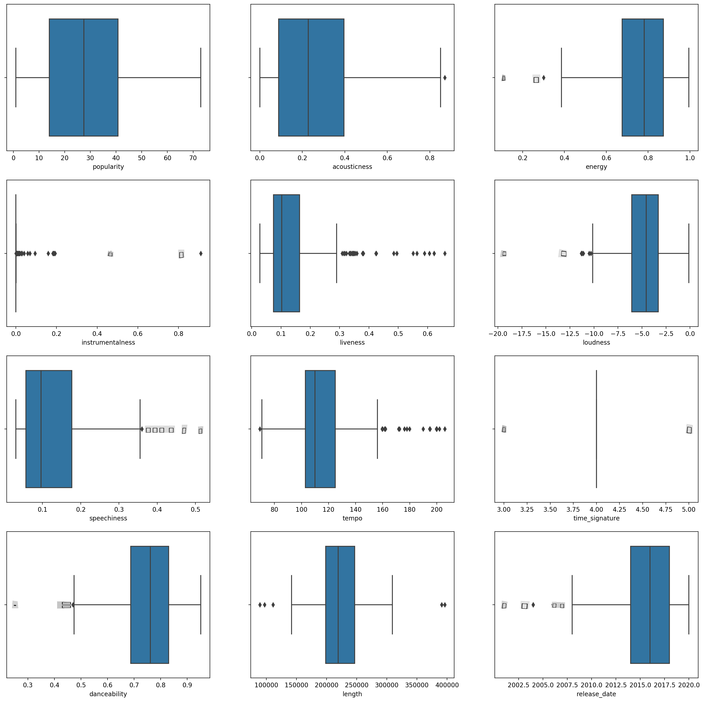

# K-Means-Clustering

## [Vorlesungsquiz](https://gray-sand-07a10f403.1.azurestaticapps.net/quiz/29/)

In dieser Lektion lernen Sie, wie Sie Cluster mit Scikit-learn und dem zuvor importierten nigerianischen Musikdatensatz erstellen. Wir werden die Grundlagen von K-Means für das Clustering behandeln. Denken Sie daran, dass es viele Möglichkeiten gibt, mit Clustern zu arbeiten, und die Methode, die Sie verwenden, von Ihren Daten abhängt. Wir werden K-Means ausprobieren, da es die gängigste Clustering-Technik ist. Lassen Sie uns beginnen!

Begriffe, die Sie lernen werden:

- Silhouettenbewertung
- Ellbogenmethode
- Trägheit
- Varianz

## Einführung

[K-Means-Clustering](https://wikipedia.org/wiki/K-means_clustering) ist eine Methode, die aus dem Bereich der Signalverarbeitung abgeleitet ist. Sie wird verwendet, um Gruppen von Daten in 'k' Cluster zu unterteilen und zu partitionieren, indem eine Reihe von Beobachtungen verwendet wird. Jede Beobachtung arbeitet daran, einen gegebenen Datenpunkt dem nächstgelegenen 'Mittelwert' oder dem Mittelpunkt eines Clusters zuzuordnen.

Die Cluster können als [Voronoi-Diagramme](https://wikipedia.org/wiki/Voronoi_diagram) visualisiert werden, die einen Punkt (oder 'Samen') und dessen entsprechende Region umfassen.


> Infografik von [Jen Looper](https://twitter.com/jenlooper)

Der K-Means-Clustering-Prozess [führt einen dreistufigen Prozess aus](https://scikit-learn.org/stable/modules/clustering.html#k-means):

1. Der Algorithmus wählt k-Mittelwerte durch Sampling aus dem Datensatz aus. Danach wiederholt er:
    1. Er weist jede Probe dem nächstgelegenen Schwerpunkt zu.
    2. Er erstellt neue Schwerpunkte, indem er den Mittelwert aller Proben berechnet, die den vorherigen Schwerpunkten zugewiesen wurden.
    3. Dann berechnet er die Differenz zwischen den neuen und alten Schwerpunkten und wiederholt den Vorgang, bis die Schwerpunkte stabilisiert sind.

Ein Nachteil der Verwendung von K-Means besteht darin, dass Sie 'k' festlegen müssen, also die Anzahl der Schwerpunkte. Glücklicherweise hilft die 'Ellbogenmethode', einen guten Startwert für 'k' zu schätzen. Das werden Sie gleich ausprobieren.

## Voraussetzungen

Sie werden in dieser Lektion mit der Datei [_notebook.ipynb_](https://github.com/microsoft/ML-For-Beginners/blob/main/5-Clustering/2-K-Means/notebook.ipynb) arbeiten, die den Datenimport und die vorläufige Bereinigung enthält, die Sie in der letzten Lektion durchgeführt haben.

## Übung - Vorbereitung

Beginnen Sie damit, sich die Songdaten noch einmal anzusehen.

1. Erstellen Sie ein Boxplot, indem Sie `boxplot()` für jede Spalte aufrufen:

    ```python
    plt.figure(figsize=(20,20), dpi=200)
    
    plt.subplot(4,3,1)
    sns.boxplot(x = 'popularity', data = df)
    
    plt.subplot(4,3,2)
    sns.boxplot(x = 'acousticness', data = df)
    
    plt.subplot(4,3,3)
    sns.boxplot(x = 'energy', data = df)
    
    plt.subplot(4,3,4)
    sns.boxplot(x = 'instrumentalness', data = df)
    
    plt.subplot(4,3,5)
    sns.boxplot(x = 'liveness', data = df)
    
    plt.subplot(4,3,6)
    sns.boxplot(x = 'loudness', data = df)
    
    plt.subplot(4,3,7)
    sns.boxplot(x = 'speechiness', data = df)
    
    plt.subplot(4,3,8)
    sns.boxplot(x = 'tempo', data = df)
    
    plt.subplot(4,3,9)
    sns.boxplot(x = 'time_signature', data = df)
    
    plt.subplot(4,3,10)
    sns.boxplot(x = 'danceability', data = df)
    
    plt.subplot(4,3,11)
    sns.boxplot(x = 'length', data = df)
    
    plt.subplot(4,3,12)
    sns.boxplot(x = 'release_date', data = df)
    ```

    Diese Daten sind etwas verrauscht: Durch die Beobachtung jeder Spalte als Boxplot können Sie Ausreißer erkennen.

    

Sie könnten den Datensatz durchgehen und diese Ausreißer entfernen, aber das würde die Daten ziemlich minimal machen.

1. Wählen Sie vorerst aus, welche Spalten Sie für Ihre Clustering-Übung verwenden möchten. Wählen Sie solche mit ähnlichen Bereichen und kodieren Sie die Spalte `artist_top_genre` als numerische Daten:

    ```python
    from sklearn.preprocessing import LabelEncoder
    le = LabelEncoder()
    
    X = df.loc[:, ('artist_top_genre','popularity','danceability','acousticness','loudness','energy')]
    
    y = df['artist_top_genre']
    
    X['artist_top_genre'] = le.fit_transform(X['artist_top_genre'])
    
    y = le.transform(y)
    ```

1. Jetzt müssen Sie entscheiden, wie viele Cluster Sie anvisieren möchten. Sie wissen, dass es 3 Musikgenres gibt, die wir aus dem Datensatz herausgearbeitet haben, also versuchen wir es mit 3:

    ```python
    from sklearn.cluster import KMeans
    
    nclusters = 3 
    seed = 0
    
    km = KMeans(n_clusters=nclusters, random_state=seed)
    km.fit(X)
    
    # Predict the cluster for each data point
    
    y_cluster_kmeans = km.predict(X)
    y_cluster_kmeans
    ```

Sie sehen ein Array, das die vorhergesagten Cluster (0, 1 oder 2) für jede Zeile des DataFrames ausgibt.

1. Verwenden Sie dieses Array, um eine 'Silhouettenbewertung' zu berechnen:

    ```python
    from sklearn import metrics
    score = metrics.silhouette_score(X, y_cluster_kmeans)
    score
    ```

## Silhouettenbewertung

Suchen Sie nach einer Silhouettenbewertung, die näher an 1 liegt. Diese Bewertung variiert von -1 bis 1, und wenn der Wert 1 beträgt, ist das Cluster dicht und gut von anderen Clustern getrennt. Ein Wert nahe 0 repräsentiert überlappende Cluster mit Proben, die sehr nah an der Entscheidungsgrenze der benachbarten Cluster liegen. [(Quelle)](https://dzone.com/articles/kmeans-silhouette-score-explained-with-python-exam)

Unsere Bewertung beträgt **.53**, also genau in der Mitte. Das deutet darauf hin, dass unsere Daten nicht besonders gut für diese Art von Clustering geeignet sind, aber lassen Sie uns weitermachen.

### Übung - Modell erstellen

1. Importieren Sie `KMeans` und starten Sie den Clustering-Prozess.

    ```python
    from sklearn.cluster import KMeans
    wcss = []
    
    for i in range(1, 11):
        kmeans = KMeans(n_clusters = i, init = 'k-means++', random_state = 42)
        kmeans.fit(X)
        wcss.append(kmeans.inertia_)
    
    ```

    Es gibt hier einige Teile, die einer Erklärung bedürfen.

    > 🎓 range: Dies sind die Iterationen des Clustering-Prozesses

    > 🎓 random_state: "Bestimmt die Zufallszahlengenerierung für die Initialisierung des Schwerpunkts." [Quelle](https://scikit-learn.org/stable/modules/generated/sklearn.cluster.KMeans.html#sklearn.cluster.KMeans)

    > 🎓 WCSS: "Innerhalb der Cluster summierte Quadrate" messen den quadratischen Durchschnittsabstand aller Punkte innerhalb eines Clusters zum Cluster-Schwerpunkt. [Quelle](https://medium.com/@ODSC/unsupervised-learning-evaluating-clusters-bd47eed175ce).

    > 🎓 Trägheit: K-Means-Algorithmen versuchen, Schwerpunkte auszuwählen, um die 'Trägheit' zu minimieren, "ein Maß dafür, wie intern kohärent Cluster sind." [Quelle](https://scikit-learn.org/stable/modules/clustering.html). Der Wert wird bei jeder Iteration der wcss-Variablen hinzugefügt.

    > 🎓 k-means++: In [Scikit-learn](https://scikit-learn.org/stable/modules/clustering.html#k-means) können Sie die 'k-means++'-Optimierung verwenden, die "die Schwerpunkte in der Regel weit voneinander entfernt initialisiert, was wahrscheinlich bessere Ergebnisse als die zufällige Initialisierung liefert."

### Ellbogenmethode

Früher haben Sie vermutet, dass Sie, da Sie 3 Musikgenres anvisiert haben, 3 Cluster wählen sollten. Ist das wirklich der Fall?

1. Verwenden Sie die 'Ellbogenmethode', um sicherzustellen.

    ```python
    plt.figure(figsize=(10,5))
    sns.lineplot(x=range(1, 11), y=wcss, marker='o', color='red')
    plt.title('Elbow')
    plt.xlabel('Number of clusters')
    plt.ylabel('WCSS')
    plt.show()
    ```

    Verwenden Sie die `wcss`-Variable, die Sie im vorherigen Schritt erstellt haben, um ein Diagramm zu erstellen, das zeigt, wo der 'Knick' im Ellbogen ist, was die optimale Anzahl von Clustern anzeigt. Vielleicht sind es **3**!

    

## Übung - Cluster anzeigen

1. Versuchen Sie den Prozess erneut, diesmal mit drei Clustern, und zeigen Sie die Cluster als Streudiagramm an:

    ```python
    from sklearn.cluster import KMeans
    kmeans = KMeans(n_clusters = 3)
    kmeans.fit(X)
    labels = kmeans.predict(X)
    plt.scatter(df['popularity'],df['danceability'],c = labels)
    plt.xlabel('popularity')
    plt.ylabel('danceability')
    plt.show()
    ```

1. Überprüfen Sie die Genauigkeit des Modells:

    ```python
    labels = kmeans.labels_
    
    correct_labels = sum(y == labels)
    
    print("Result: %d out of %d samples were correctly labeled." % (correct_labels, y.size))
    
    print('Accuracy score: {0:0.2f}'. format(correct_labels/float(y.size)))
    ```

    Die Genauigkeit dieses Modells ist nicht sehr gut, und die Form der Cluster gibt Ihnen einen Hinweis darauf, warum.

    

    Diese Daten sind zu unausgewogen, zu wenig korreliert und es gibt zu viel Varianz zwischen den Spaltenwerten, um gut zu clustern. Tatsächlich werden die Cluster, die sich bilden, wahrscheinlich stark von den drei Genre-Kategorien beeinflusst oder verzerrt, die wir oben definiert haben. Das war ein Lernprozess!

    In der Dokumentation von Scikit-learn können Sie sehen, dass ein Modell wie dieses, mit nicht gut abgegrenzten Clustern, ein 'Varianzproblem' hat:

    
    > Infografik von Scikit-learn

## Varianz

Varianz wird definiert als "der Durchschnitt der quadrierten Abweichungen vom Mittelwert" [(Quelle)](https://www.mathsisfun.com/data/standard-deviation.html). Im Kontext dieses Clustering-Problems bezieht es sich auf Daten, bei denen die Zahlen unseres Datensatzes dazu neigen, sich zu stark vom Mittelwert zu entfernen.

✅ Dies ist ein großartiger Moment, um über all die Möglichkeiten nachzudenken, wie Sie dieses Problem beheben könnten. Daten ein wenig mehr anpassen? Andere Spalten verwenden? Einen anderen Algorithmus verwenden? Hinweis: Versuchen Sie, [Ihre Daten zu skalieren](https://www.mygreatlearning.com/blog/learning-data-science-with-k-means-clustering/), um sie zu normalisieren und andere Spalten zu testen.

> Versuchen Sie diesen '[Varianzrechner](https://www.calculatorsoup.com/calculators/statistics/variance-calculator.php)', um das Konzept etwas besser zu verstehen.

---

## 🚀Herausforderung

Verbringen Sie etwas Zeit mit diesem Notizbuch und passen Sie die Parameter an. Können Sie die Genauigkeit des Modells verbessern, indem Sie die Daten weiter bereinigen (zum Beispiel Ausreißer entfernen)? Sie können Gewichte verwenden, um bestimmten Datenproben mehr Gewicht zu geben. Was können Sie sonst noch tun, um bessere Cluster zu erstellen?

Hinweis: Versuchen Sie, Ihre Daten zu skalieren. Es gibt kommentierten Code im Notizbuch, der eine Standard-Skalierung hinzufügt, um die Daten-Spalten einander ähnlicher in Bezug auf den Bereich zu machen. Sie werden feststellen, dass, während die Silhouettenbewertung sinkt, der 'Knick' im Ellbogendiagramm sich glättet. Das liegt daran, dass das Belassen der Daten im unskalierten Zustand Daten mit weniger Varianz mehr Gewicht verleiht. Lesen Sie ein wenig mehr über dieses Problem [hier](https://stats.stackexchange.com/questions/21222/are-mean-normalization-and-feature-scaling-needed-for-k-means-clustering/21226#21226).

## [Nachlesungsquiz](https://gray-sand-07a10f403.1.azurestaticapps.net/quiz/30/)

## Überprüfung & Selbststudium

Werfen Sie einen Blick auf einen K-Means-Simulator [wie diesen hier](https://user.ceng.metu.edu.tr/~akifakkus/courses/ceng574/k-means/). Sie können dieses Tool verwenden, um Beispieldatenpunkte zu visualisieren und deren Schwerpunkte zu bestimmen. Sie können die Zufälligkeit der Daten, die Anzahl der Cluster und die Anzahl der Schwerpunkte bearbeiten. Hilft Ihnen das, eine Vorstellung davon zu bekommen, wie die Daten gruppiert werden können?

Sehen Sie sich auch [dieses Handout zu K-Means](https://stanford.edu/~cpiech/cs221/handouts/kmeans.html) von Stanford an.

## Aufgabe

[Versuchen Sie verschiedene Clustering-Methoden](assignment.md)

**Haftungsausschluss**:  
Dieses Dokument wurde mit maschinellen KI-Übersetzungsdiensten übersetzt. Obwohl wir uns um Genauigkeit bemühen, beachten Sie bitte, dass automatisierte Übersetzungen Fehler oder Ungenauigkeiten enthalten können. Das Originaldokument in seiner ursprünglichen Sprache sollte als die maßgebliche Quelle betrachtet werden. Für wichtige Informationen wird eine professionelle menschliche Übersetzung empfohlen. Wir übernehmen keine Verantwortung für Missverständnisse oder Fehlinterpretationen, die aus der Verwendung dieser Übersetzung resultieren.