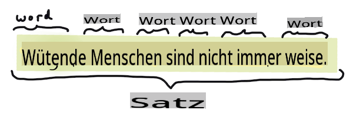
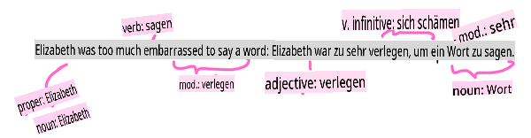

# Häufige Aufgaben und Techniken der Verarbeitung natürlicher Sprache

Für die meisten Aufgaben der *Verarbeitung natürlicher Sprache* muss der zu verarbeitende Text in kleinere Einheiten zerlegt, analysiert und die Ergebnisse gespeichert oder mit Regeln und Datensätzen abgeglichen werden. Diese Aufgaben ermöglichen es dem Programmierer, die _Bedeutung_ oder _Absicht_ oder nur die _Häufigkeit_ von Begriffen und Wörtern in einem Text abzuleiten.

## [Vorlesungsquiz](https://gray-sand-07a10f403.1.azurestaticapps.net/quiz/33/)

Lass uns gängige Techniken zur Textverarbeitung entdecken. In Kombination mit maschinellem Lernen helfen diese Techniken dabei, große Textmengen effizient zu analysieren. Bevor wir ML auf diese Aufgaben anwenden, lass uns jedoch die Probleme verstehen, mit denen ein NLP-Spezialist konfrontiert ist.

## Aufgaben, die in der NLP häufig vorkommen

Es gibt verschiedene Möglichkeiten, einen Text zu analysieren, an dem du arbeitest. Es gibt Aufgaben, die du durchführen kannst, und durch diese Aufgaben kannst du ein Verständnis des Textes gewinnen und Schlussfolgerungen ziehen. Du führst diese Aufgaben normalerweise in einer bestimmten Reihenfolge durch.

### Tokenisierung

Wahrscheinlich ist das Erste, was die meisten NLP-Algorithmen tun müssen, den Text in Token oder Wörter zu zerlegen. Obwohl das einfach klingt, kann es schwierig werden, wenn man Satzzeichen und die Wort- und Satztrennzeichen verschiedener Sprachen berücksichtigen muss. Möglicherweise musst du verschiedene Methoden verwenden, um die Abgrenzungen zu bestimmen.


> Tokenisierung eines Satzes aus **Stolz und Vorurteil**. Infografik von [Jen Looper](https://twitter.com/jenlooper)

### Einbettungen

[Worteinbettungen](https://wikipedia.org/wiki/Word_embedding) sind eine Möglichkeit, deine Textdaten numerisch zu konvertieren. Einbettungen werden so durchgeführt, dass Wörter mit ähnlicher Bedeutung oder Wörter, die zusammen verwendet werden, zusammengefasst werden.


> "Ich habe den höchsten Respekt vor deinen Nerven, sie sind meine alten Freunde." - Worteinbettungen für einen Satz in **Stolz und Vorurteil**. Infografik von [Jen Looper](https://twitter.com/jenlooper)

✅ Probiere [dieses interessante Tool](https://projector.tensorflow.org/) aus, um mit Worteinbettungen zu experimentieren. Wenn du auf ein Wort klickst, siehst du Cluster ähnlicher Wörter: 'Spielzeug' gruppiert sich mit 'Disney', 'Lego', 'Playstation' und 'Konsole'.

### Parsing & Part-of-Speech-Tagging

Jedes Wort, das tokenisiert wurde, kann als Teil der Sprache markiert werden - als Substantiv, Verb oder Adjektiv. Der Satz `the quick red fox jumped over the lazy brown dog` könnte als POS getaggt werden: fox = Substantiv, jumped = Verb.



> Parsing eines Satzes aus **Stolz und Vorurteil**. Infografik von [Jen Looper](https://twitter.com/jenlooper)

Parsing bedeutet, zu erkennen, welche Wörter in einem Satz miteinander verbunden sind - zum Beispiel ist `the quick red fox jumped` eine Adjektiv-Substantiv-Verb-Sequenz, die von der `lazy brown dog`-Sequenz getrennt ist.

### Wort- und Phrasenhäufigkeiten

Ein nützlicher Vorgang bei der Analyse eines großen Textkorpus besteht darin, ein Wörterbuch aller interessierenden Wörter oder Phrasen und deren Häufigkeit zu erstellen. Die Phrase `the quick red fox jumped over the lazy brown dog` hat eine Wortfrequenz von 2 für das.

Schauen wir uns ein Beispiel an, in dem wir die Häufigkeit von Wörtern zählen. Rudyard Kiplings Gedicht The Winners enthält die folgende Strophe:

```output
What the moral? Who rides may read.
When the night is thick and the tracks are blind
A friend at a pinch is a friend, indeed,
But a fool to wait for the laggard behind.
Down to Gehenna or up to the Throne,
He travels the fastest who travels alone.
```

Da Phrasenhäufigkeiten je nach Bedarf groß- oder kleinschreibungsempfindlich sein können, hat die Phrase `a friend` has a frequency of 2 and `the` has a frequency of 6, and `travels` eine Häufigkeit von 2.

### N-Gramme

Ein Text kann in Wortfolgen einer festgelegten Länge zerlegt werden, ein einzelnes Wort (Unigramm), zwei Wörter (Bigramm), drei Wörter (Trigramm) oder eine beliebige Anzahl von Wörtern (N-Gramme).

Zum Beispiel `the quick red fox jumped over the lazy brown dog` mit einem N-Gramm-Wert von 2 produziert die folgenden N-Gramme:

1. der schnelle 
2. schnelle rote 
3. rote Füchse
4. Fuchs sprang 
5. sprang über 
6. über die 
7. die faulen 
8. faulen braunen 
9. braunen Hund

Es könnte einfacher sein, es als ein gleitendes Fenster über den Satz zu visualisieren. Hier ist es für N-Gramme von 3 Wörtern, das N-Gramm ist in jedem Satz fett hervorgehoben:

1.   <u>**der schnelle rote**</u> Fuchs sprang über den faulen braunen Hund
2.   der **<u>schnelle rote Fuchs</u>** sprang über den faulen braunen Hund
3.   der schnelle **<u>rote Fuchs sprang</u>** über den faulen braunen Hund
4.   der schnelle rote **<u>Fuchs sprang über</u>** den faulen braunen Hund
5.   der schnelle rote Fuchs **<u>sprang über den</u>** faulen braunen Hund
6.   der schnelle rote Fuchs sprang **<u>über den faulen</u>** braunen Hund
7.   der schnelle rote Fuchs sprang über <u>**den faulen braunen**</u> Hund
8.   der schnelle rote Fuchs sprang über den **<u>faulen braunen Hund</u>**


> N-Gramm-Wert von 3: Infografik von [Jen Looper](https://twitter.com/jenlooper)

### Nomenphrase-Extraktion

In den meisten Sätzen gibt es ein Substantiv, das das Subjekt oder Objekt des Satzes ist. Im Englischen ist es oft erkennbar, da es von 'a', 'an' oder 'the' gefolgt wird. Das Subjekt oder Objekt eines Satzes durch 'Extrahieren der Nomenphrase' zu identifizieren, ist eine gängige Aufgabe in der NLP, wenn versucht wird, die Bedeutung eines Satzes zu verstehen.

✅ Im Satz "Ich kann mich nicht auf die Stunde, den Ort, den Blick oder die Worte festlegen, die das Fundament gelegt haben. Es ist zu lange her. Ich war in der Mitte, bevor ich wusste, dass ich begonnen hatte.", kannst du die Nomenphrasen identifizieren?

Im Satz `the quick red fox jumped over the lazy brown dog` gibt es 2 Nomenphrasen: **schneller roter Fuchs** und **fauler brauner Hund**.

### Sentiment-Analyse

Ein Satz oder Text kann hinsichtlich seines Sentiments analysiert werden, also wie *positiv* oder *negativ* er ist. Das Sentiment wird in *Polarität* und *Objektivität/Subjektivität* gemessen. Die Polarität wird von -1,0 bis 1,0 (negativ bis positiv) und von 0,0 bis 1,0 (am objektivsten bis am subjektivsten) gemessen.

✅ Später wirst du lernen, dass es verschiedene Möglichkeiten gibt, das Sentiment mithilfe von maschinellem Lernen zu bestimmen. Eine Möglichkeit besteht darin, eine Liste von Wörtern und Phrasen zu haben, die von einem menschlichen Experten als positiv oder negativ kategorisiert werden, und dieses Modell auf Texte anzuwenden, um einen Polaritätswert zu berechnen. Kannst du sehen, wie das in einigen Fällen funktioniert und in anderen weniger gut?

### Flexion

Flexion ermöglicht es dir, ein Wort in die Einzahl oder Mehrzahl zu bringen.

### Lemmatisierung

Ein *Lemma* ist das Grund- oder Stammwort für eine Gruppe von Wörtern. Zum Beispiel haben *flog*, *fliegen*, *fliegende* ein Lemma des Verbs *fliegen*.

Es gibt auch nützliche Datenbanken für den NLP-Forscher, insbesondere:

### WordNet

[WordNet](https://wordnet.princeton.edu/) ist eine Datenbank von Wörtern, Synonymen, Antonymen und vielen anderen Details für jedes Wort in vielen verschiedenen Sprachen. Es ist unglaublich nützlich, wenn man versucht, Übersetzungen, Rechtschreibprüfungen oder Sprachtools jeglicher Art zu erstellen.

## NLP-Bibliotheken

Glücklicherweise musst du nicht alle diese Techniken selbst entwickeln, da es hervorragende Python-Bibliotheken gibt, die es Entwicklern, die nicht auf die Verarbeitung natürlicher Sprache oder maschinelles Lernen spezialisiert sind, viel zugänglicher machen. Die nächsten Lektionen enthalten weitere Beispiele dafür, aber hier wirst du einige nützliche Beispiele lernen, die dir bei der nächsten Aufgabe helfen.

### Übung - Verwendung von `TextBlob` library

Let's use a library called TextBlob as it contains helpful APIs for tackling these types of tasks. TextBlob "stands on the giant shoulders of [NLTK](https://nltk.org) and [pattern](https://github.com/clips/pattern), and plays nicely with both." It has a considerable amount of ML embedded in its API.

> Note: A useful [Quick Start](https://textblob.readthedocs.io/en/dev/quickstart.html#quickstart) guide is available for TextBlob that is recommended for experienced Python developers 

When attempting to identify *noun phrases*, TextBlob offers several options of extractors to find noun phrases. 

1. Take a look at `ConllExtractor`.

    ```python
    from textblob import TextBlob
    from textblob.np_extractors import ConllExtractor
    # import and create a Conll extractor to use later 
    extractor = ConllExtractor()
    
    # later when you need a noun phrase extractor:
    user_input = input("> ")
    user_input_blob = TextBlob(user_input, np_extractor=extractor)  # note non-default extractor specified
    np = user_input_blob.noun_phrases                                    
    ```

    > Was passiert hier? [ConllExtractor](https://textblob.readthedocs.io/en/dev/api_reference.html?highlight=Conll#textblob.en.np_extractors.ConllExtractor) ist "Ein Nomenphrase-Extraktor, der Chunk-Parsing verwendet, das mit dem ConLL-2000-Trainingskorpus trainiert wurde." ConLL-2000 bezieht sich auf die Konferenz 2000 über Computerlinguistik und maschinelles Lernen. Jedes Jahr veranstaltete die Konferenz einen Workshop, um ein schwieriges NLP-Problem anzugehen, und im Jahr 2000 ging es um Nomenchunking. Ein Modell wurde mit dem Wall Street Journal trainiert, wobei "Abschnitte 15-18 als Trainingsdaten (211727 Token) und Abschnitt 20 als Testdaten (47377 Token)" verwendet wurden. Du kannst die verwendeten Verfahren [hier](https://www.clips.uantwerpen.be/conll2000/chunking/) und die [Ergebnisse](https://ifarm.nl/erikt/research/np-chunking.html) einsehen.

### Herausforderung - Verbesserung deines Bots mit NLP

In der vorherigen Lektion hast du einen sehr einfachen Q&A-Bot erstellt. Jetzt wirst du Marvin etwas sympathischer machen, indem du deine Eingaben auf Sentiment analysierst und eine Antwort druckst, die dem Sentiment entspricht. Du musst auch eine `noun_phrase` identifizieren und danach fragen.

Deine Schritte beim Erstellen eines besseren Konversationsbots:

1. Drucke Anweisungen aus, die den Benutzer beraten, wie er mit dem Bot interagieren kann
2. Starte die Schleife 
   1. Nimm die Benutzereingabe entgegen
   2. Wenn der Benutzer gefragt hat, zu beenden, beende dann
   3. Verarbeite die Benutzereingabe und bestimme die geeignete Sentiment-Antwort
   4. Wenn in der Sentimentanalyse eine Nomenphrase erkannt wird, mache sie plural und frage nach mehr Informationen zu diesem Thema
   5. Drucke die Antwort
3. Kehre zu Schritt 2 zurück

Hier ist der Code-Schnipsel zur Bestimmung des Sentiments mit TextBlob. Beachte, dass es nur vier *Gradationen* der Sentimentantwort gibt (du könntest mehr haben, wenn du möchtest):

```python
if user_input_blob.polarity <= -0.5:
  response = "Oh dear, that sounds bad. "
elif user_input_blob.polarity <= 0:
  response = "Hmm, that's not great. "
elif user_input_blob.polarity <= 0.5:
  response = "Well, that sounds positive. "
elif user_input_blob.polarity <= 1:
  response = "Wow, that sounds great. "
```

Hier ist eine Beispielausgabe zur Orientierung (Benutzereingaben stehen in den Zeilen, die mit > beginnen):

```output
Hello, I am Marvin, the friendly robot.
You can end this conversation at any time by typing 'bye'
After typing each answer, press 'enter'
How are you today?
> I am ok
Well, that sounds positive. Can you tell me more?
> I went for a walk and saw a lovely cat
Well, that sounds positive. Can you tell me more about lovely cats?
> cats are the best. But I also have a cool dog
Wow, that sounds great. Can you tell me more about cool dogs?
> I have an old hounddog but he is sick
Hmm, that's not great. Can you tell me more about old hounddogs?
> bye
It was nice talking to you, goodbye!
```

Eine mögliche Lösung für die Aufgabe ist [hier](https://github.com/microsoft/ML-For-Beginners/blob/main/6-NLP/2-Tasks/solution/bot.py)

✅ Wissensüberprüfung

1. Glaubst du, dass die sympathischen Antworten jemanden 'täuschen' würden, dass der Bot sie tatsächlich verstanden hat?
2. Macht die Identifizierung der Nomenphrase den Bot 'glaubwürdiger'?
3. Warum wäre es nützlich, eine 'Nomenphrase' aus einem Satz zu extrahieren?

---

Implementiere den Bot in der vorherigen Wissensüberprüfung und teste ihn an einem Freund. Kann er ihn täuschen? Kannst du deinen Bot glaubwürdiger machen?

## 🚀Herausforderung

Nimm eine Aufgabe aus der vorherigen Wissensüberprüfung und versuche, sie umzusetzen. Teste den Bot an einem Freund. Kann er ihn täuschen? Kannst du deinen Bot glaubwürdiger machen?

## [Nachlesequiz](https://gray-sand-07a10f403.1.azurestaticapps.net/quiz/34/)

## Überprüfung & Selbststudium

In den nächsten Lektionen wirst du mehr über Sentiment-Analyse lernen. Recherchiere diese interessante Technik in Artikeln wie diesen auf [KDNuggets](https://www.kdnuggets.com/tag/nlp)

## Aufgabe 

[Mach einen Bot, der zurückredet](assignment.md)

**Haftungsausschluss**:  
Dieses Dokument wurde mithilfe von KI-Übersetzungsdiensten übersetzt. Obwohl wir uns um Genauigkeit bemühen, beachten Sie bitte, dass automatisierte Übersetzungen Fehler oder Ungenauigkeiten enthalten können. Das Originaldokument in seiner ursprünglichen Sprache sollte als die maßgebliche Quelle betrachtet werden. Für kritische Informationen wird eine professionelle menschliche Übersetzung empfohlen. Wir übernehmen keine Haftung für Missverständnisse oder Fehlinterpretationen, die aus der Verwendung dieser Übersetzung entstehen.