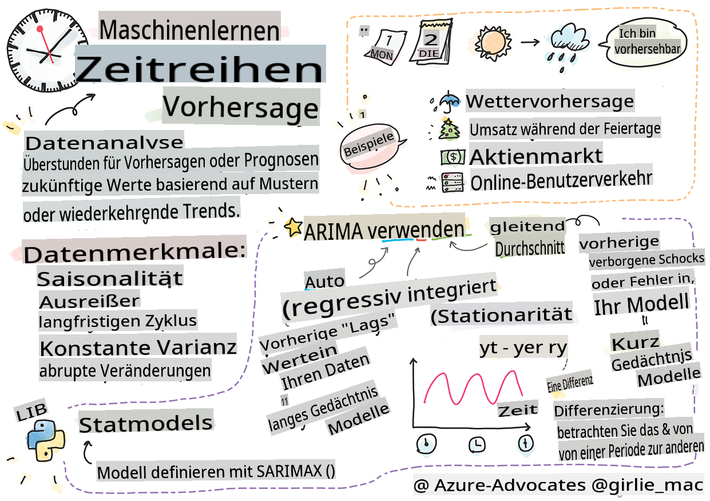
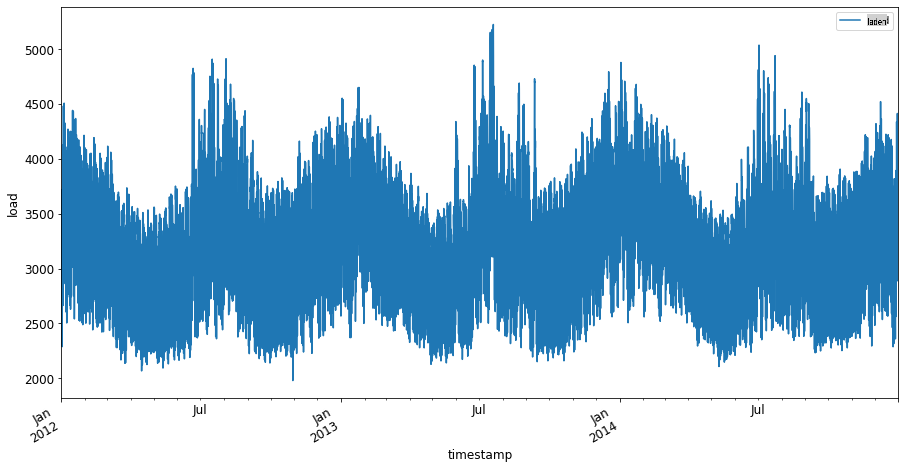
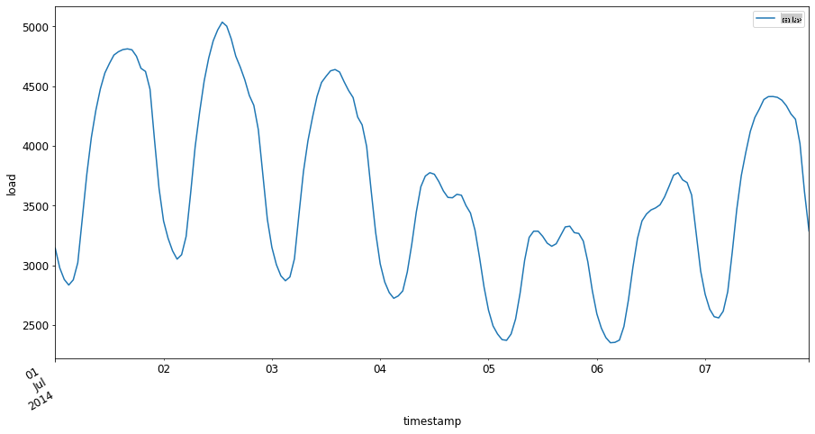

# Einführung in die Zeitreihenprognose



> Sketchnote von [Tomomi Imura](https://www.twitter.com/girlie_mac)

In dieser Lektion und der folgenden werden Sie ein wenig über Zeitreihenprognosen lernen, einen interessanten und wertvollen Teil des Repertoires eines ML-Wissenschaftlers, der etwas weniger bekannt ist als andere Themen. Zeitreihenprognosen sind eine Art "Kristallkugel": Basierend auf der vergangenen Leistung einer Variablen wie dem Preis können Sie ihren zukünftigen potenziellen Wert vorhersagen.

[](https://youtu.be/cBojo1hsHiI "Einführung in die Zeitreihenprognose")

> 🎥 Klicken Sie auf das Bild oben für ein Video über Zeitreihenprognosen

## [Vorlesungsquiz](https://gray-sand-07a10f403.1.azurestaticapps.net/quiz/41/)

Es ist ein nützliches und interessantes Feld mit echtem Wert für Unternehmen, da es direkte Anwendungen für Probleme wie Preisgestaltung, Bestandsverwaltung und Lieferkettenfragen hat. Während Techniken des Deep Learning begonnen haben, eingesetzt zu werden, um tiefere Einblicke zu gewinnen und zukünftige Leistungen besser vorherzusagen, bleibt die Zeitreihenprognose ein Bereich, der stark von klassischen ML-Techniken beeinflusst wird.

> Das nützliche Zeitreihen-Curriculum der Penn State finden Sie [hier](https://online.stat.psu.edu/stat510/lesson/1)

## Einführung

Angenommen, Sie betreiben eine Reihe von intelligenten Parkuhren, die Daten darüber bereitstellen, wie oft sie genutzt werden und wie lange im Laufe der Zeit.

> Was wäre, wenn Sie basierend auf der bisherigen Leistung der Uhr ihren zukünftigen Wert gemäß den Gesetzen von Angebot und Nachfrage vorhersagen könnten?

Die genaue Vorhersage, wann man handeln sollte, um sein Ziel zu erreichen, ist eine Herausforderung, die durch Zeitreihenprognosen angegangen werden könnte. Es würde die Leute nicht glücklich machen, in geschäftigen Zeiten mehr für einen Parkplatz berechnet zu bekommen, aber es wäre ein sicherer Weg, um Einnahmen zu generieren, um die Straßen zu reinigen!

Lassen Sie uns einige der Arten von Zeitreihenalgorithmen erkunden und ein Notizbuch starten, um einige Daten zu bereinigen und vorzubereiten. Die Daten, die Sie analysieren werden, stammen aus dem GEFCom2014-Prognosewettbewerb. Sie bestehen aus 3 Jahren stündlicher Stromlast- und Temperaturwerte zwischen 2012 und 2014. Basierend auf den historischen Mustern von Stromlast und Temperatur können Sie zukünftige Werte der Stromlast vorhersagen.

In diesem Beispiel lernen Sie, wie man einen Zeitschritt voraus prognostiziert, indem Sie nur historische Lastdaten verwenden. Bevor Sie jedoch beginnen, ist es nützlich zu verstehen, was hinter den Kulissen vor sich geht.

## Einige Definitionen

Wenn Sie auf den Begriff "Zeitreihe" stoßen, müssen Sie dessen Verwendung in verschiedenen Kontexten verstehen.

🎓 **Zeitreihe**

In der Mathematik ist "eine Zeitreihe eine Reihe von Datenpunkten, die in zeitlicher Reihenfolge indiziert (oder aufgelistet oder grafisch dargestellt) sind. Am häufigsten ist eine Zeitreihe eine Sequenz, die zu aufeinander folgenden, gleichmäßig verteilten Zeitpunkten genommen wird." Ein Beispiel für eine Zeitreihe ist der tägliche Schlusswert des [Dow Jones Industrial Average](https://wikipedia.org/wiki/Time_series). Die Verwendung von Zeitreihendiagrammen und statistischen Modellen wird häufig in der Signalverarbeitung, Wetterprognose, Erdbebenvorhersage und anderen Bereichen angetroffen, in denen Ereignisse auftreten und Datenpunkte im Laufe der Zeit dargestellt werden können.

🎓 **Zeitreihenanalyse**

Die Zeitreihenanalyse ist die Analyse der oben genannten Zeitreihendaten. Zeitreihendaten können verschiedene Formen annehmen, einschließlich "unterbrochener Zeitreihen", die Muster in der Entwicklung einer Zeitreihe vor und nach einem unterbrechenden Ereignis erkennen. Die Art der Analyse, die für die Zeitreihe erforderlich ist, hängt von der Natur der Daten ab. Zeitreihendaten selbst können in Form von Zahlen- oder Zeichenfolgenserien vorliegen.

Die durchzuführende Analyse verwendet eine Vielzahl von Methoden, einschließlich Frequenz- und Zeitbereich, linear und nichtlinear und mehr. [Erfahren Sie mehr](https://www.itl.nist.gov/div898/handbook/pmc/section4/pmc4.htm) über die vielen Möglichkeiten, diese Art von Daten zu analysieren.

🎓 **Zeitreihenprognose**

Die Zeitreihenprognose ist die Verwendung eines Modells zur Vorhersage zukünftiger Werte basierend auf Mustern, die von zuvor gesammelten Daten angezeigt werden, wie sie in der Vergangenheit aufgetreten sind. Während es möglich ist, Regressionsmodelle zu verwenden, um Zeitreihendaten zu untersuchen, wobei Zeitindizes als x-Variablen in einem Diagramm verwendet werden, ist es am besten, solche Daten mit speziellen Modelltypen zu analysieren.

Zeitreihendaten sind eine Liste geordneter Beobachtungen, im Gegensatz zu Daten, die durch lineare Regression analysiert werden können. Das häufigste Modell ist ARIMA, ein Akronym für "Autoregressive Integrated Moving Average".

[ARIMA-Modelle](https://online.stat.psu.edu/stat510/lesson/1/1.1) "stellen den gegenwärtigen Wert einer Reihe in Beziehung zu vergangenen Werten und vergangenen Vorhersagefehlern." Sie sind am besten geeignet zur Analyse von Zeitbereichsdaten, bei denen Daten über die Zeit geordnet sind.

> Es gibt mehrere Arten von ARIMA-Modellen, über die Sie [hier](https://people.duke.edu/~rnau/411arim.htm) mehr erfahren können und die Sie in der nächsten Lektion ansprechen werden.

In der nächsten Lektion werden Sie ein ARIMA-Modell erstellen, um [univariate Zeitreihen](https://itl.nist.gov/div898/handbook/pmc/section4/pmc44.htm) zu erstellen, das sich auf eine Variable konzentriert, die ihren Wert im Laufe der Zeit ändert. Ein Beispiel für diese Art von Daten ist [dieser Datensatz](https://itl.nist.gov/div898/handbook/pmc/section4/pmc4411.htm), der die monatliche CO2-Konzentration am Mauna Loa Observatory aufzeichnet:

|  CO2   | JahrMonat | Jahr  | Monat |
| :----: | :-------: | :---: | :---: |
| 330.62 |  1975.04  | 1975  |   1   |
| 331.40 |  1975.13  | 1975  |   2   |
| 331.87 |  1975.21  | 1975  |   3   |
| 333.18 |  1975.29  | 1975  |   4   |
| 333.92 |  1975.38  | 1975  |   5   |
| 333.43 |  1975.46  | 1975  |   6   |
| 331.85 |  1975.54  | 1975  |   7   |
| 330.01 |  1975.63  | 1975  |   8   |
| 328.51 |  1975.71  | 1975  |   9   |
| 328.41 |  1975.79  | 1975  |  10   |
| 329.25 |  1975.88  | 1975  |  11   |
| 330.97 |  1975.96  | 1975  |  12   |

✅ Identifizieren Sie die Variable, die sich in diesem Datensatz im Laufe der Zeit ändert.

## Merkmale von Zeitreihendaten, die zu berücksichtigen sind

Wenn Sie sich Zeitreihendaten ansehen, werden Sie möglicherweise feststellen, dass sie [bestimmte Merkmale](https://online.stat.psu.edu/stat510/lesson/1/1.1) aufweisen, die Sie berücksichtigen und mindern müssen, um ihre Muster besser zu verstehen. Wenn Sie Zeitreihendaten als potenziell "Signal" betrachten, das Sie analysieren möchten, können diese Merkmale als "Rauschen" betrachtet werden. Oft müssen Sie dieses "Rauschen" reduzieren, indem Sie einige dieser Merkmale mit statistischen Techniken ausgleichen.

Hier sind einige Konzepte, die Sie kennen sollten, um mit Zeitreihen arbeiten zu können:

🎓 **Trends**

Trends werden definiert als messbare Zunahmen und Abnahmen über die Zeit. [Lesen Sie mehr](https://machinelearningmastery.com/time-series-trends-in-python). Im Kontext von Zeitreihen geht es darum, wie man Trends in seiner Zeitreihe verwendet und, falls notwendig, entfernt.

🎓 **[Saisonalität](https://machinelearningmastery.com/time-series-seasonality-with-python/)**

Saisonalität wird definiert als periodische Schwankungen, wie zum Beispiel Feiertagsanstiege, die den Umsatz beeinflussen könnten. [Schauen Sie sich an](https://itl.nist.gov/div898/handbook/pmc/section4/pmc443.htm), wie verschiedene Arten von Diagrammen die Saisonalität in Daten anzeigen.

🎓 **Ausreißer**

Ausreißer liegen weit vom Standardabweichungsbereich der Daten entfernt.

🎓 **Langfristiger Zyklus**

Unabhängig von der Saisonalität können Daten einen langfristigen Zyklus aufweisen, wie zum Beispiel einen wirtschaftlichen Rückgang, der länger als ein Jahr dauert.

🎓 **Konstante Varianz**

Im Laufe der Zeit zeigen einige Daten konstante Schwankungen, wie zum Beispiel den Energieverbrauch pro Tag und Nacht.

🎓 **Plötzliche Veränderungen**

Die Daten können eine plötzliche Veränderung aufweisen, die einer weiteren Analyse bedarf. Die plötzliche Schließung von Unternehmen aufgrund von COVID hat beispielsweise zu Veränderungen in den Daten geführt.

✅ Hier ist ein [Beispiel für ein Zeitreihendiagramm](https://www.kaggle.com/kashnitsky/topic-9-part-1-time-series-analysis-in-python), das die täglich ausgegebene In-Game-Währung über einige Jahre zeigt. Können Sie eines der oben genannten Merkmale in diesen Daten identifizieren?


## Übung - Einstieg in die Daten zum Energieverbrauch

Lassen Sie uns damit beginnen, ein Zeitreihenmodell zu erstellen, um den zukünftigen Energieverbrauch basierend auf dem bisherigen Verbrauch vorherzusagen.

> Die Daten in diesem Beispiel stammen aus dem GEFCom2014-Prognosewettbewerb. Sie bestehen aus 3 Jahren stündlicher Stromlast- und Temperaturwerte zwischen 2012 und 2014.
>
> Tao Hong, Pierre Pinson, Shu Fan, Hamidreza Zareipour, Alberto Troccoli und Rob J. Hyndman, "Probabilistic energy forecasting: Global Energy Forecasting Competition 2014 and beyond", International Journal of Forecasting, vol.32, no.3, pp 896-913, Juli-September 2016.

1. Öffnen Sie im `working`-Ordner dieser Lektion die Datei _notebook.ipynb_. Beginnen Sie damit, Bibliotheken hinzuzufügen, die Ihnen helfen, Daten zu laden und zu visualisieren.

    ```python
    import os
    import matplotlib.pyplot as plt
    from common.utils import load_data
    %matplotlib inline
    ```

    Hinweis: Sie verwenden die Dateien aus der enthaltenen `common` folder which set up your environment and handle downloading the data.

2. Next, examine the data as a dataframe calling `load_data()` and `head()`:

    ```python
    data_dir = './data'
    energy = load_data(data_dir)[['load']]
    energy.head()
    ```

    Sie können sehen, dass es zwei Spalten gibt, die Datum und Last darstellen:

    |                     |  Last  |
    | :-----------------: | :----: |
    | 2012-01-01 00:00:00 | 2698.0 |
    | 2012-01-01 01:00:00 | 2558.0 |
    | 2012-01-01 02:00:00 | 2444.0 |
    | 2012-01-01 03:00:00 | 2402.0 |
    | 2012-01-01 04:00:00 | 2403.0 |

3. Jetzt plotten Sie die Daten, indem Sie `plot()` aufrufen:

    ```python
    energy.plot(y='load', subplots=True, figsize=(15, 8), fontsize=12)
    plt.xlabel('timestamp', fontsize=12)
    plt.ylabel('load', fontsize=12)
    plt.show()
    ```

    

4. Jetzt plotten Sie die erste Woche im Juli 2014, indem Sie sie als Eingabe für das Muster `energy` in `[von Datum]: [bis Datum]` bereitstellen:

    ```python
    energy['2014-07-01':'2014-07-07'].plot(y='load', subplots=True, figsize=(15, 8), fontsize=12)
    plt.xlabel('timestamp', fontsize=12)
    plt.ylabel('load', fontsize=12)
    plt.show()
    ```

    

    Ein schönes Diagramm! Schauen Sie sich diese Diagramme an und sehen Sie, ob Sie eines der oben genannten Merkmale bestimmen können. Was können wir durch die Visualisierung der Daten schließen?

In der nächsten Lektion werden Sie ein ARIMA-Modell erstellen, um einige Prognosen zu erstellen.

---

## 🚀Herausforderung

Erstellen Sie eine Liste aller Branchen und Forschungsbereiche, die von Zeitreihenprognosen profitieren könnten. Können Sie sich eine Anwendung dieser Techniken in den Künsten vorstellen? In der Ökonometrie? Ökologie? Einzelhandel? Industrie? Finanzen? Wo sonst?

## [Nachlese-Quiz](https://gray-sand-07a10f403.1.azurestaticapps.net/quiz/42/)

## Überprüfung & Selbststudium

Obwohl wir sie hier nicht behandeln werden, werden neuronale Netzwerke manchmal verwendet, um klassische Methoden der Zeitreihenprognose zu verbessern. Lesen Sie mehr darüber [in diesem Artikel](https://medium.com/microsoftazure/neural-networks-for-forecasting-financial-and-economic-time-series-6aca370ff412)

## Aufgabe

[Visualisieren Sie einige weitere Zeitreihen](assignment.md)

**Haftungsausschluss**:  
Dieses Dokument wurde mithilfe von maschinellen KI-Übersetzungsdiensten übersetzt. Obwohl wir uns um Genauigkeit bemühen, beachten Sie bitte, dass automatisierte Übersetzungen Fehler oder Ungenauigkeiten enthalten können. Das Originaldokument in seiner ursprünglichen Sprache sollte als maßgebliche Quelle betrachtet werden. Für wichtige Informationen wird eine professionelle menschliche Übersetzung empfohlen. Wir übernehmen keine Verantwortung für Missverständnisse oder Fehlinterpretationen, die aus der Verwendung dieser Übersetzung entstehen.