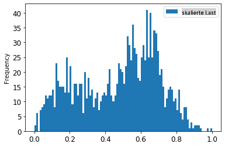
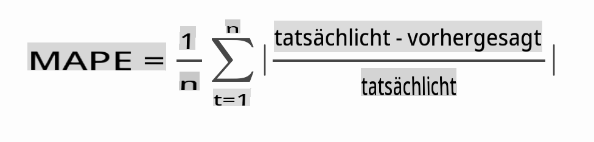

# Zeitreihenprognose mit ARIMA

In der vorherigen Lektion hast du ein wenig über Zeitreihenprognosen gelernt und einen Datensatz geladen, der die Schwankungen der elektrischen Last über einen bestimmten Zeitraum zeigt.

[](https://youtu.be/IUSk-YDau10 "Einführung in ARIMA")

> 🎥 Klicke auf das obige Bild für ein Video: Eine kurze Einführung in ARIMA-Modelle. Das Beispiel wird in R durchgeführt, aber die Konzepte sind universell.

## [Vorlesungsquiz](https://gray-sand-07a10f403.1.azurestaticapps.net/quiz/43/)

## Einführung

In dieser Lektion wirst du eine spezifische Methode entdecken, um Modelle mit [ARIMA: *A*uto*R*egressive *I*ntegrated *M*oving *A*verage](https://wikipedia.org/wiki/Autoregressive_integrated_moving_average) zu erstellen. ARIMA-Modelle eignen sich besonders gut für Daten, die [Nicht-Stationarität](https://wikipedia.org/wiki/Stationary_process) zeigen.

## Allgemeine Konzepte

Um mit ARIMA arbeiten zu können, gibt es einige Konzepte, die du kennen musst:

- 🎓 **Stationarität**. Aus statistischer Sicht bezieht sich Stationarität auf Daten, deren Verteilung sich nicht ändert, wenn sie zeitlich verschoben werden. Nicht-stationäre Daten zeigen Schwankungen aufgrund von Trends, die transformiert werden müssen, um analysiert zu werden. Saisonalität kann beispielsweise Schwankungen in den Daten einführen und kann durch einen Prozess des 'saisonalen Differenzierens' beseitigt werden.

- 🎓 **[Differenzierung](https://wikipedia.org/wiki/Autoregressive_integrated_moving_average#Differencing)**. Die Differenzierung von Daten, wieder aus statistischer Sicht, bezieht sich auf den Prozess, nicht-stationäre Daten so zu transformieren, dass sie stationär werden, indem ihr nicht-konstanter Trend entfernt wird. "Differenzierung entfernt die Änderungen im Niveau einer Zeitreihe, beseitigt Trend und Saisonalität und stabilisiert somit den Mittelwert der Zeitreihe." [Paper von Shixiong et al](https://arxiv.org/abs/1904.07632)

## ARIMA im Kontext von Zeitreihen

Lass uns die Teile von ARIMA aufschlüsseln, um besser zu verstehen, wie es uns hilft, Zeitreihen zu modellieren und Vorhersagen zu treffen.

- **AR - für AutoRegressive**. Autoregressive Modelle, wie der Name schon sagt, schauen 'zurück' in der Zeit, um frühere Werte in deinen Daten zu analysieren und Annahmen über sie zu treffen. Diese früheren Werte werden als 'Lags' bezeichnet. Ein Beispiel wären Daten, die monatliche Verkäufe von Bleistiften zeigen. Der Verkaufsbetrag jedes Monats würde als 'entwickelnde Variable' im Datensatz betrachtet werden. Dieses Modell wird erstellt, da die "entwickelnde Variable von Interesse auf ihren eigenen verzögerten (d.h. vorherigen) Werten regressiert wird." [wikipedia](https://wikipedia.org/wiki/Autoregressive_integrated_moving_average)

- **I - für Integriert**. Im Gegensatz zu den ähnlichen 'ARMA'-Modellen bezieht sich das 'I' in ARIMA auf seinen *[integrierten](https://wikipedia.org/wiki/Order_of_integration)* Aspekt. Die Daten sind 'integriert', wenn Differenzierungsschritte angewendet werden, um die Nicht-Stationarität zu beseitigen.

- **MA - für Moving Average**. Der [gleitende Durchschnitt](https://wikipedia.org/wiki/Moving-average_model) dieses Modells bezieht sich auf die Ausgabevariable, die durch die Beobachtung der aktuellen und vergangenen Werte der Lags bestimmt wird.

Zusammenfassend: ARIMA wird verwendet, um ein Modell so gut wie möglich an die spezielle Form von Zeitreihendaten anzupassen.

## Übung - ein ARIMA-Modell erstellen

Öffne den [_/working_](https://github.com/microsoft/ML-For-Beginners/tree/main/7-TimeSeries/2-ARIMA/working) Ordner in dieser Lektion und finde die [_notebook.ipynb_](https://github.com/microsoft/ML-For-Beginners/blob/main/7-TimeSeries/2-ARIMA/working/notebook.ipynb) Datei.

1. Führe das Notebook aus, um die `statsmodels` Python-Bibliothek zu laden; du benötigst dies für ARIMA-Modelle.

1. Lade die notwendigen Bibliotheken.

1. Lade nun mehrere weitere nützliche Bibliotheken zum Plotten von Daten:

    ```python
    import os
    import warnings
    import matplotlib.pyplot as plt
    import numpy as np
    import pandas as pd
    import datetime as dt
    import math

    from pandas.plotting import autocorrelation_plot
    from statsmodels.tsa.statespace.sarimax import SARIMAX
    from sklearn.preprocessing import MinMaxScaler
    from common.utils import load_data, mape
    from IPython.display import Image

    %matplotlib inline
    pd.options.display.float_format = '{:,.2f}'.format
    np.set_printoptions(precision=2)
    warnings.filterwarnings("ignore") # specify to ignore warning messages
    ```

1. Lade die Daten aus der Datei `/data/energy.csv` in ein Pandas-Dataframe und schau dir die Daten an:

    ```python
    energy = load_data('./data')[['load']]
    energy.head(10)
    ```

1. Plotte alle verfügbaren Energiedaten von Januar 2012 bis Dezember 2014. Es sollte keine Überraschungen geben, da wir diese Daten in der letzten Lektion gesehen haben:

    ```python
    energy.plot(y='load', subplots=True, figsize=(15, 8), fontsize=12)
    plt.xlabel('timestamp', fontsize=12)
    plt.ylabel('load', fontsize=12)
    plt.show()
    ```

    Jetzt lass uns ein Modell erstellen!

### Trainings- und Testdatensätze erstellen

Jetzt sind deine Daten geladen, sodass du sie in Trainings- und Testsets aufteilen kannst. Du wirst dein Modell mit dem Trainingsset trainieren. Wie gewohnt wirst du die Genauigkeit des Modells nach dem Training mit dem Testset bewerten. Du musst sicherstellen, dass das Testset einen späteren Zeitraum als das Trainingsset abdeckt, um sicherzustellen, dass das Modell keine Informationen aus zukünftigen Zeiträumen erhält.

1. Weisen Sie einen Zeitraum von zwei Monaten vom 1. September bis 31. Oktober 2014 dem Trainingsset zu. Das Testset wird den Zeitraum von 1. November bis 31. Dezember 2014 umfassen:

    ```python
    train_start_dt = '2014-11-01 00:00:00'
    test_start_dt = '2014-12-30 00:00:00'
    ```

    Da diese Daten den täglichen Energieverbrauch widerspiegeln, gibt es ein starkes saisonales Muster, aber der Verbrauch ist den Verbrauch in den jüngeren Tagen am ähnlichsten.

1. Visualisiere die Unterschiede:

    ```python
    energy[(energy.index < test_start_dt) & (energy.index >= train_start_dt)][['load']].rename(columns={'load':'train'}) \
        .join(energy[test_start_dt:][['load']].rename(columns={'load':'test'}), how='outer') \
        .plot(y=['train', 'test'], figsize=(15, 8), fontsize=12)
    plt.xlabel('timestamp', fontsize=12)
    plt.ylabel('load', fontsize=12)
    plt.show()
    ```

    

    Daher sollte es ausreichend sein, ein relativ kleines Zeitfenster für das Training der Daten zu verwenden.

    > Hinweis: Da die Funktion, die wir zur Anpassung des ARIMA-Modells verwenden, während des Anpassens eine In-Sample-Validierung verwendet, werden wir die Validierungsdaten weglassen.

### Bereite die Daten für das Training vor

Jetzt musst du die Daten für das Training vorbereiten, indem du die Daten filterst und skalierst. Filtere deinen Datensatz, um nur die benötigten Zeiträume und Spalten einzuschließen, und skaliere die Daten, um sicherzustellen, dass sie im Intervall 0,1 projiziert werden.

1. Filtere den ursprünglichen Datensatz, um nur die oben genannten Zeiträume pro Set und nur die benötigte Spalte 'load' sowie das Datum einzuschließen:

    ```python
    train = energy.copy()[(energy.index >= train_start_dt) & (energy.index < test_start_dt)][['load']]
    test = energy.copy()[energy.index >= test_start_dt][['load']]

    print('Training data shape: ', train.shape)
    print('Test data shape: ', test.shape)
    ```

    Du kannst die Form der Daten sehen:

    ```output
    Training data shape:  (1416, 1)
    Test data shape:  (48, 1)
    ```

1. Skaliere die Daten, damit sie im Bereich (0, 1) liegen.

    ```python
    scaler = MinMaxScaler()
    train['load'] = scaler.fit_transform(train)
    train.head(10)
    ```

1. Visualisiere die Original- vs. skalierten Daten:

    ```python
    energy[(energy.index >= train_start_dt) & (energy.index < test_start_dt)][['load']].rename(columns={'load':'original load'}).plot.hist(bins=100, fontsize=12)
    train.rename(columns={'load':'scaled load'}).plot.hist(bins=100, fontsize=12)
    plt.show()
    ```

    

    > Die Originaldaten

    

    > Die skalierten Daten

1. Jetzt, da du die skalierten Daten kalibriert hast, kannst du die Testdaten skalieren:

    ```python
    test['load'] = scaler.transform(test)
    test.head()
    ```

### Implementiere ARIMA

Es ist Zeit, ARIMA zu implementieren! Du wirst jetzt die `statsmodels` Bibliothek verwenden, die du zuvor installiert hast.

Jetzt musst du mehrere Schritte befolgen.

1. Definiere das Modell, indem du `SARIMAX()` and passing in the model parameters: p, d, and q parameters, and P, D, and Q parameters.
   2. Prepare the model for the training data by calling the fit() function.
   3. Make predictions calling the `forecast()` function and specifying the number of steps (the `horizon`) to forecast.

> 🎓 What are all these parameters for? In an ARIMA model there are 3 parameters that are used to help model the major aspects of a time series: seasonality, trend, and noise. These parameters are:

`p`: the parameter associated with the auto-regressive aspect of the model, which incorporates *past* values.
`d`: the parameter associated with the integrated part of the model, which affects the amount of *differencing* (🎓 remember differencing 👆?) to apply to a time series.
`q`: the parameter associated with the moving-average part of the model.

> Note: If your data has a seasonal aspect - which this one does - , we use a seasonal ARIMA model (SARIMA). In that case you need to use another set of parameters: `P`, `D`, and `Q` which describe the same associations as `p`, `d`, and `q` aufrufst, wobei die saisonalen Komponenten des Modells berücksichtigt werden.

1. Beginne damit, deinen bevorzugten Horizontwert festzulegen. Lass es uns mit 3 Stunden versuchen:

    ```python
    # Specify the number of steps to forecast ahead
    HORIZON = 3
    print('Forecasting horizon:', HORIZON, 'hours')
    ```

    Die besten Werte für die Parameter eines ARIMA-Modells auszuwählen, kann herausfordernd sein, da es subjektiv und zeitintensiv ist. Du könntest in Erwägung ziehen, eine `auto_arima()` function from the [`pyramid` Bibliothek](https://alkaline-ml.com/pmdarima/0.9.0/modules/generated/pyramid.arima.auto_arima.html) zu verwenden.

1. Versuche vorerst einige manuelle Auswahlen, um ein gutes Modell zu finden.

    ```python
    order = (4, 1, 0)
    seasonal_order = (1, 1, 0, 24)

    model = SARIMAX(endog=train, order=order, seasonal_order=seasonal_order)
    results = model.fit()

    print(results.summary())
    ```

    Eine Ergebnistabelle wird gedruckt.

Du hast dein erstes Modell erstellt! Jetzt müssen wir einen Weg finden, es zu bewerten.

### Bewerte dein Modell

Um dein Modell zu bewerten, kannst du die sogenannte `Walk Forward`-Validierung durchführen. In der Praxis werden Zeitreihenmodelle jedes Mal neu trainiert, wenn neue Daten verfügbar werden. Dies ermöglicht es dem Modell, die beste Vorhersage zu jedem Zeitpunkt zu treffen.

Beginne am Anfang der Zeitreihe, indem du diese Technik verwendest, trainiere das Modell auf dem Trainingsdatensatz. Dann mache eine Vorhersage für den nächsten Zeitpunkt. Die Vorhersage wird gegen den bekannten Wert bewertet. Das Trainingsset wird dann erweitert, um den bekannten Wert einzuschließen, und der Prozess wird wiederholt.

> Hinweis: Du solltest das Fenster des Trainingssets fixieren, um ein effizienteres Training zu gewährleisten, sodass jedes Mal, wenn du eine neue Beobachtung zum Trainingsset hinzufügst, du die Beobachtung vom Anfang des Sets entfernst.

Dieser Prozess bietet eine robustere Schätzung, wie das Modell in der Praxis abschneiden wird. Es hat jedoch die Rechenkosten, so viele Modelle zu erstellen. Dies ist akzeptabel, wenn die Daten klein sind oder wenn das Modell einfach ist, könnte aber in größerem Maßstab ein Problem darstellen.

Die Walk-Forward-Validierung ist der Goldstandard der Bewertung von Zeitreihenmodellen und wird für deine eigenen Projekte empfohlen.

1. Erstelle zunächst einen Testdatenpunkt für jeden HORIZON-Schritt.

    ```python
    test_shifted = test.copy()

    for t in range(1, HORIZON+1):
        test_shifted['load+'+str(t)] = test_shifted['load'].shift(-t, freq='H')

    test_shifted = test_shifted.dropna(how='any')
    test_shifted.head(5)
    ```

    |            |          | load | load+1 | load+2 |
    | ---------- | -------- | ---- | ------ | ------ |
    | 2014-12-30 | 00:00:00 | 0.33 | 0.29   | 0.27   |
    | 2014-12-30 | 01:00:00 | 0.29 | 0.27   | 0.27   |
    | 2014-12-30 | 02:00:00 | 0.27 | 0.27   | 0.30   |
    | 2014-12-30 | 03:00:00 | 0.27 | 0.30   | 0.41   |
    | 2014-12-30 | 04:00:00 | 0.30 | 0.41   | 0.57   |

    Die Daten werden horizontal entsprechend ihrem Horizontpunkt verschoben.

1. Mache Vorhersagen für deine Testdaten, indem du diesen Sliding-Window-Ansatz in einer Schleife der Größe der Testdatenlänge verwendest:

    ```python
    %%time
    training_window = 720 # dedicate 30 days (720 hours) for training

    train_ts = train['load']
    test_ts = test_shifted

    history = [x for x in train_ts]
    history = history[(-training_window):]

    predictions = list()

    order = (2, 1, 0)
    seasonal_order = (1, 1, 0, 24)

    for t in range(test_ts.shape[0]):
        model = SARIMAX(endog=history, order=order, seasonal_order=seasonal_order)
        model_fit = model.fit()
        yhat = model_fit.forecast(steps = HORIZON)
        predictions.append(yhat)
        obs = list(test_ts.iloc[t])
        # move the training window
        history.append(obs[0])
        history.pop(0)
        print(test_ts.index[t])
        print(t+1, ': predicted =', yhat, 'expected =', obs)
    ```

    Du kannst beobachten, wie das Training stattfindet:

    ```output
    2014-12-30 00:00:00
    1 : predicted = [0.32 0.29 0.28] expected = [0.32945389435989236, 0.2900626678603402, 0.2739480752014323]

    2014-12-30 01:00:00
    2 : predicted = [0.3  0.29 0.3 ] expected = [0.2900626678603402, 0.2739480752014323, 0.26812891674127126]

    2014-12-30 02:00:00
    3 : predicted = [0.27 0.28 0.32] expected = [0.2739480752014323, 0.26812891674127126, 0.3025962399283795]
    ```

1. Vergleiche die Vorhersagen mit der tatsächlichen Last:

    ```python
    eval_df = pd.DataFrame(predictions, columns=['t+'+str(t) for t in range(1, HORIZON+1)])
    eval_df['timestamp'] = test.index[0:len(test.index)-HORIZON+1]
    eval_df = pd.melt(eval_df, id_vars='timestamp', value_name='prediction', var_name='h')
    eval_df['actual'] = np.array(np.transpose(test_ts)).ravel()
    eval_df[['prediction', 'actual']] = scaler.inverse_transform(eval_df[['prediction', 'actual']])
    eval_df.head()
    ```

    Ausgabe
    |     |            | timestamp | h   | prediction | actual   |
    | --- | ---------- | --------- | --- | ---------- | -------- |
    | 0   | 2014-12-30 | 00:00:00  | t+1 | 3.008,74   | 3.023,00 |
    | 1   | 2014-12-30 | 01:00:00  | t+1 | 2.955,53   | 2.935,00 |
    | 2   | 2014-12-30 | 02:00:00  | t+1 | 2.900,17   | 2.899,00 |
    | 3   | 2014-12-30 | 03:00:00  | t+1 | 2.917,69   | 2.886,00 |
    | 4   | 2014-12-30 | 04:00:00  | t+1 | 2.946,99   | 2.963,00 |


    Beobachte die Vorhersage der stündlichen Daten im Vergleich zur tatsächlichen Last. Wie genau ist das?

### Überprüfe die Modellgenauigkeit

Überprüfe die Genauigkeit deines Modells, indem du den mittleren absoluten prozentualen Fehler (MAPE) über alle Vorhersagen testest.

> **🧮 Zeig mir die Mathematik**
>
> 
>
>  [MAPE](https://www.linkedin.com/pulse/what-mape-mad-msd-time-series-allameh-statistics/) wird verwendet, um die Vorhersagegenauigkeit als Verhältnis zu zeigen, das durch die obige Formel definiert ist. Der Unterschied zwischen actual<sub>t</sub> und predicted<sub>t</sub> wird durch actual<sub>t</sub> geteilt. "Der absolute Wert in dieser Berechnung wird für jeden prognostizierten Zeitpunkt summiert und durch die Anzahl der angepassten Punkte n geteilt." [wikipedia](https://wikipedia.org/wiki/Mean_absolute_percentage_error)

1. Drücke die Gleichung in Code aus:

    ```python
    if(HORIZON > 1):
        eval_df['APE'] = (eval_df['prediction'] - eval_df['actual']).abs() / eval_df['actual']
        print(eval_df.groupby('h')['APE'].mean())
    ```

1. Berechne den MAPE für einen Schritt:

    ```python
    print('One step forecast MAPE: ', (mape(eval_df[eval_df['h'] == 't+1']['prediction'], eval_df[eval_df['h'] == 't+1']['actual']))*100, '%')
    ```

    MAPE für die Ein-Schritt-Vorhersage:  0,5570581332313952 %

1. Drucke den MAPE für die Mehrschrittvorhersage:

    ```python
    print('Multi-step forecast MAPE: ', mape(eval_df['prediction'], eval_df['actual'])*100, '%')
    ```

    ```output
    Multi-step forecast MAPE:  1.1460048657704118 %
    ```

    Eine niedrige Zahl ist am besten: bedenke, dass eine Vorhersage mit einem MAPE von 10 um 10 % danebenliegt.

1. Aber wie immer ist es einfacher, diese Art von Genauigkeitsmessung visuell zu sehen, also lass es uns plotten:

    ```python
     if(HORIZON == 1):
        ## Plotting single step forecast
        eval_df.plot(x='timestamp', y=['actual', 'prediction'], style=['r', 'b'], figsize=(15, 8))

    else:
        ## Plotting multi step forecast
        plot_df = eval_df[(eval_df.h=='t+1')][['timestamp', 'actual']]
        for t in range(1, HORIZON+1):
            plot_df['t+'+str(t)] = eval_df[(eval_df.h=='t+'+str(t))]['prediction'].values

        fig = plt.figure(figsize=(15, 8))
        ax = plt.plot(plot_df['timestamp'], plot_df['actual'], color='red', linewidth=4.0)
        ax = fig.add_subplot(111)
        for t in range(1, HORIZON+1):
            x = plot_df['timestamp'][(t-1):]
            y = plot_df['t+'+str(t)][0:len(x)]
            ax.plot(x, y, color='blue', linewidth=4*math.pow(.9,t), alpha=math.pow(0.8,t))

        ax.legend(loc='best')

    plt.xlabel('timestamp', fontsize=12)
    plt.ylabel('load', fontsize=12)
    plt.show()
    ```

    

🏆 Ein sehr schöner Plot, der ein Modell mit guter Genauigkeit zeigt. Gut gemacht!

---

## 🚀Herausforderung

Untersuche die Möglichkeiten, die Genauigkeit eines Zeitreihenmodells zu testen. In dieser Lektion sprechen wir über MAPE, aber gibt es andere Methoden, die du verwenden könntest? Recherchiere sie und annotiere sie. Ein hilfreiches Dokument findest du [hier](https://otexts.com/fpp2/accuracy.html).

## [Nachlesungsquiz](https://gray-sand-07a10f403.1.azurestaticapps.net/quiz/44/)

## Überprüfung & Selbststudium

Diese Lektion behandelt nur die Grundlagen der Zeitreihenprognose mit ARIMA. Nimm dir etwas Zeit, um dein Wissen zu vertiefen, indem du in [diesem Repository](https://microsoft.github.io/forecasting/) und seinen verschiedenen Modelltypen nach anderen Möglichkeiten suchst, Zeitreihenmodelle zu erstellen.

## Aufgabe

[Ein neues ARIMA-Modell](assignment.md)

**Haftungsausschluss**:  
Dieses Dokument wurde mithilfe von maschinellen KI-Übersetzungsdiensten übersetzt. Obwohl wir uns um Genauigkeit bemühen, bitten wir zu beachten, dass automatisierte Übersetzungen Fehler oder Ungenauigkeiten enthalten können. Das Originaldokument in seiner ursprünglichen Sprache sollte als autoritative Quelle betrachtet werden. Für wichtige Informationen wird eine professionelle menschliche Übersetzung empfohlen. Wir übernehmen keine Haftung für Missverständnisse oder Fehlinterpretationen, die aus der Verwendung dieser Übersetzung resultieren.