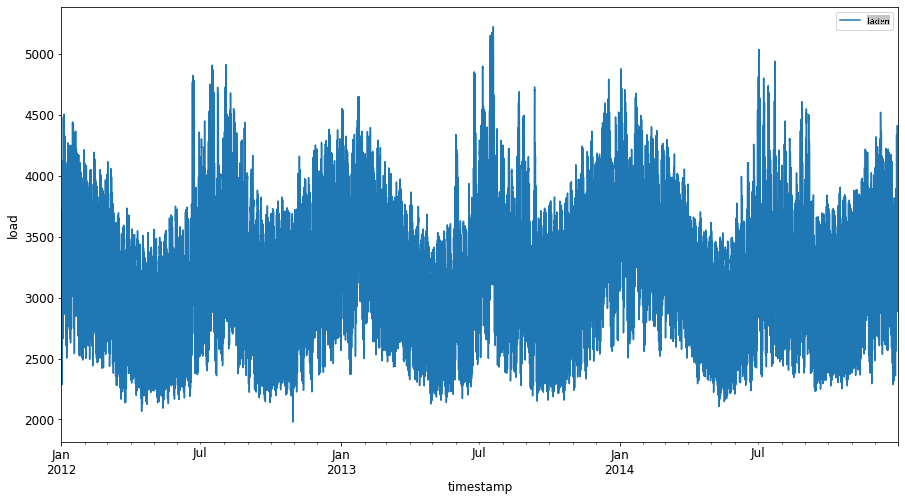
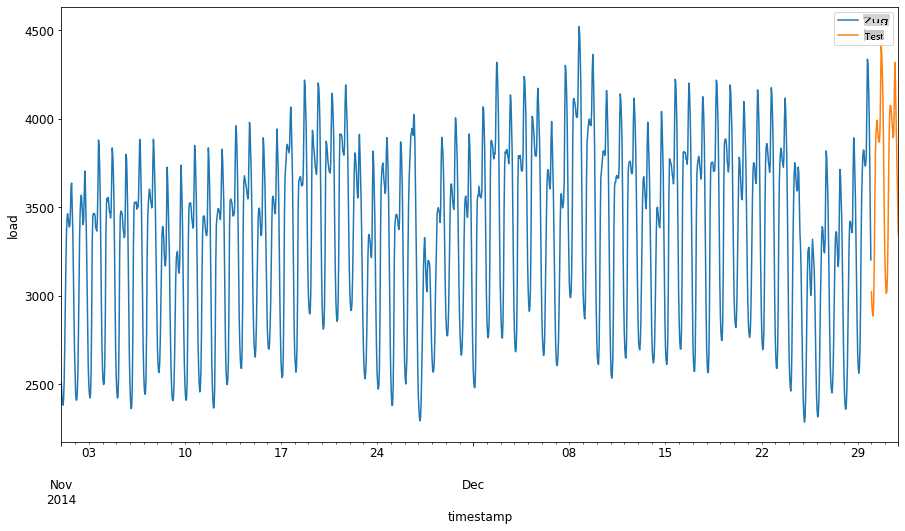
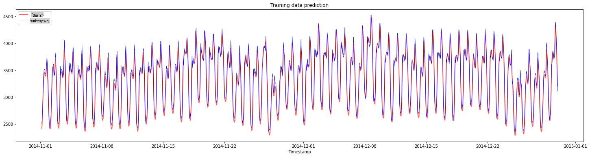
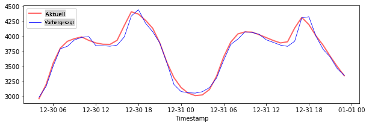

# Zeitreihenprognose mit Support Vector Regressor

Im vorherigen Kapitel haben Sie gelernt, wie man das ARIMA-Modell zur Vorhersage von Zeitreihen verwendet. Jetzt werden wir das Modell des Support Vector Regressors betrachten, das ein Regressionsmodell ist, das verwendet wird, um kontinuierliche Daten vorherzusagen.

## [Vorlesungsquiz](https://gray-sand-07a10f403.1.azurestaticapps.net/quiz/51/) 

## Einführung

In dieser Lektion werden Sie eine spezifische Methode entdecken, um Modelle mit [**SVM**: **S**upport **V**ector **M**achine](https://en.wikipedia.org/wiki/Support-vector_machine) für Regression oder **SVR: Support Vector Regressor** zu erstellen.

### SVR im Kontext von Zeitreihen [^1]

Bevor wir die Bedeutung von SVR in der Zeitreihenvorhersage verstehen, sind hier einige wichtige Konzepte, die Sie kennen sollten:

- **Regression:** Überwachtes Lernverfahren zur Vorhersage kontinuierlicher Werte aus einer gegebenen Eingabemenge. Die Idee ist, eine Kurve (oder Linie) im Merkmalsraum anzupassen, die die maximale Anzahl von Datenpunkten hat. [Klicken Sie hier](https://en.wikipedia.org/wiki/Regression_analysis) für weitere Informationen.
- **Support Vector Machine (SVM):** Eine Art von überwachten maschinellen Lernmodell, das für Klassifikation, Regression und Ausreißererkennung verwendet wird. Das Modell ist ein Hyperplane im Merkmalsraum, der im Fall der Klassifikation als Grenze fungiert und im Fall der Regression als beste Anpassungslinie. Bei SVM wird in der Regel eine Kernel-Funktion verwendet, um den Datensatz in einen Raum mit höherer Dimension zu transformieren, sodass sie leichter trennbar sind. [Klicken Sie hier](https://en.wikipedia.org/wiki/Support-vector_machine) für weitere Informationen zu SVMs.
- **Support Vector Regressor (SVR):** Eine Art von SVM, die die beste Anpassungslinie (die im Fall von SVM ein Hyperplane ist) findet, die die maximale Anzahl von Datenpunkten hat.

### Warum SVR? [^1]

In der letzten Lektion haben Sie über ARIMA gelernt, das eine sehr erfolgreiche statistische lineare Methode zur Vorhersage von Zeitreihendaten ist. In vielen Fällen weisen Zeitreihendaten jedoch *Nichtlinearität* auf, die von linearen Modellen nicht abgebildet werden kann. In solchen Fällen macht die Fähigkeit von SVM, Nichtlinearität in den Daten für Regressionsaufgaben zu berücksichtigen, SVR erfolgreich in der Zeitreihenvorhersage.

## Übung - Erstellen Sie ein SVR-Modell

Die ersten Schritte zur Datenvorbereitung sind die gleichen wie in der vorherigen Lektion über [ARIMA](https://github.com/microsoft/ML-For-Beginners/tree/main/7-TimeSeries/2-ARIMA).

Öffnen Sie den [_/working_](https://github.com/microsoft/ML-For-Beginners/tree/main/7-TimeSeries/3-SVR/working) Ordner in dieser Lektion und finden Sie die [_notebook.ipynb_](https://github.com/microsoft/ML-For-Beginners/blob/main/7-TimeSeries/3-SVR/working/notebook.ipynb) Datei.[^2]

1. Führen Sie das Notebook aus und importieren Sie die erforderlichen Bibliotheken: [^2]

   ```python
   import sys
   sys.path.append('../../')
   ```

   ```python
   import os
   import warnings
   import matplotlib.pyplot as plt
   import numpy as np
   import pandas as pd
   import datetime as dt
   import math
   
   from sklearn.svm import SVR
   from sklearn.preprocessing import MinMaxScaler
   from common.utils import load_data, mape
   ```

2. Laden Sie die Daten aus der Datei `/data/energy.csv` in ein Pandas-DataFrame und werfen Sie einen Blick darauf: [^2]

   ```python
   energy = load_data('../../data')[['load']]
   ```

3. Zeichnen Sie alle verfügbaren Energiedaten von Januar 2012 bis Dezember 2014: [^2]

   ```python
   energy.plot(y='load', subplots=True, figsize=(15, 8), fontsize=12)
   plt.xlabel('timestamp', fontsize=12)
   plt.ylabel('load', fontsize=12)
   plt.show()
   ```

   

   Jetzt lassen Sie uns unser SVR-Modell erstellen.

### Erstellen Sie Trainings- und Testdatensätze

Jetzt sind Ihre Daten geladen, sodass Sie sie in Trainings- und Testdatensätze aufteilen können. Dann werden Sie die Daten umformen, um einen zeitbasierten Datensatz zu erstellen, der für das SVR benötigt wird. Sie werden Ihr Modell im Trainingssatz trainieren. Nachdem das Modell mit dem Training abgeschlossen ist, werden Sie die Genauigkeit im Trainingssatz, Testsatz und dann im vollständigen Datensatz bewerten, um die Gesamtleistung zu sehen. Sie müssen sicherstellen, dass der Testsatz einen späteren Zeitraum als der Trainingssatz abdeckt, um zu gewährleisten, dass das Modell keine Informationen aus zukünftigen Zeiträumen gewinnt [^2] (eine Situation, die als *Überanpassung* bekannt ist).

1. Weisen Sie einen Zeitraum von zwei Monaten vom 1. September bis 31. Oktober 2014 dem Trainingssatz zu. Der Testsatz umfasst den Zeitraum von zwei Monaten vom 1. November bis 31. Dezember 2014: [^2]

   ```python
   train_start_dt = '2014-11-01 00:00:00'
   test_start_dt = '2014-12-30 00:00:00'
   ```

2. Visualisieren Sie die Unterschiede: [^2]

   ```python
   energy[(energy.index < test_start_dt) & (energy.index >= train_start_dt)][['load']].rename(columns={'load':'train'}) \
       .join(energy[test_start_dt:][['load']].rename(columns={'load':'test'}), how='outer') \
       .plot(y=['train', 'test'], figsize=(15, 8), fontsize=12)
   plt.xlabel('timestamp', fontsize=12)
   plt.ylabel('load', fontsize=12)
   plt.show()
   ```

   

### Bereiten Sie die Daten für das Training vor

Jetzt müssen Sie die Daten für das Training vorbereiten, indem Sie eine Filterung und Skalierung Ihrer Daten durchführen. Filtern Sie Ihren Datensatz, um nur die benötigten Zeiträume und Spalten einzuschließen, und skalieren Sie, um sicherzustellen, dass die Daten im Intervall 0,1 projiziert werden.

1. Filtern Sie den ursprünglichen Datensatz, um nur die oben genannten Zeiträume pro Satz und nur die benötigte Spalte 'load' sowie das Datum einzuschließen: [^2]

   ```python
   train = energy.copy()[(energy.index >= train_start_dt) & (energy.index < test_start_dt)][['load']]
   test = energy.copy()[energy.index >= test_start_dt][['load']]
   
   print('Training data shape: ', train.shape)
   print('Test data shape: ', test.shape)
   ```

   ```output
   Training data shape:  (1416, 1)
   Test data shape:  (48, 1)
   ```
   
2. Skalieren Sie die Trainingsdaten auf den Bereich (0, 1): [^2]

   ```python
   scaler = MinMaxScaler()
   train['load'] = scaler.fit_transform(train)
   ```
   
4. Jetzt skalieren Sie die Testdaten: [^2]

   ```python
   test['load'] = scaler.transform(test)
   ```

### Erstellen Sie Daten mit Zeitstempeln [^1]

Für das SVR transformieren Sie die Eingabedaten in die Form `[batch, timesteps]`. So, you reshape the existing `train_data` and `test_data`, sodass eine neue Dimension entsteht, die sich auf die Zeitstempel bezieht.

```python
# Converting to numpy arrays
train_data = train.values
test_data = test.values
```

Für dieses Beispiel nehmen wir `timesteps = 5`. Die Eingaben für das Modell sind die Daten für die ersten 4 Zeitstempel, und die Ausgabe wird die Daten für den 5. Zeitstempel sein.

```python
timesteps=5
```

Konvertieren der Trainingsdaten in einen 2D-Tensor mit geschachtelter Listenverständnis:

```python
train_data_timesteps=np.array([[j for j in train_data[i:i+timesteps]] for i in range(0,len(train_data)-timesteps+1)])[:,:,0]
train_data_timesteps.shape
```

```output
(1412, 5)
```

Konvertieren der Testdaten in einen 2D-Tensor:

```python
test_data_timesteps=np.array([[j for j in test_data[i:i+timesteps]] for i in range(0,len(test_data)-timesteps+1)])[:,:,0]
test_data_timesteps.shape
```

```output
(44, 5)
```

Auswahl von Eingaben und Ausgaben aus den Trainings- und Testdaten:

```python
x_train, y_train = train_data_timesteps[:,:timesteps-1],train_data_timesteps[:,[timesteps-1]]
x_test, y_test = test_data_timesteps[:,:timesteps-1],test_data_timesteps[:,[timesteps-1]]

print(x_train.shape, y_train.shape)
print(x_test.shape, y_test.shape)
```

```output
(1412, 4) (1412, 1)
(44, 4) (44, 1)
```

### Implementieren Sie SVR [^1]

Jetzt ist es Zeit, SVR zu implementieren. Um mehr über diese Implementierung zu erfahren, können Sie auf [diese Dokumentation](https://scikit-learn.org/stable/modules/generated/sklearn.svm.SVR.html) verweisen. Für unsere Implementierung folgen wir diesen Schritten:

  1. Definieren Sie das Modell, indem Sie die Funktion `SVR()` and passing in the model hyperparameters: kernel, gamma, c and epsilon
  2. Prepare the model for the training data by calling the `fit()` function
  3. Make predictions calling the `predict()` aufrufen.

Jetzt erstellen wir ein SVR-Modell. Hier verwenden wir den [RBF-Kernel](https://scikit-learn.org/stable/modules/svm.html#parameters-of-the-rbf-kernel) und setzen die Hyperparameter gamma, C und epsilon auf 0.5, 10 und 0.05.

```python
model = SVR(kernel='rbf',gamma=0.5, C=10, epsilon = 0.05)
```

#### Modell an den Trainingsdaten anpassen [^1]

```python
model.fit(x_train, y_train[:,0])
```

```output
SVR(C=10, cache_size=200, coef0=0.0, degree=3, epsilon=0.05, gamma=0.5,
    kernel='rbf', max_iter=-1, shrinking=True, tol=0.001, verbose=False)
```

#### Vorhersagen des Modells machen [^1]

```python
y_train_pred = model.predict(x_train).reshape(-1,1)
y_test_pred = model.predict(x_test).reshape(-1,1)

print(y_train_pred.shape, y_test_pred.shape)
```

```output
(1412, 1) (44, 1)
```

Sie haben Ihr SVR erstellt! Jetzt müssen wir es bewerten.

### Bewerten Sie Ihr Modell [^1]

Zur Bewertung werden wir zunächst die Daten auf unsere ursprüngliche Skala zurückskalieren. Dann, um die Leistung zu überprüfen, werden wir das ursprüngliche und das vorhergesagte Zeitreihendiagramm zeichnen und auch das MAPE-Ergebnis ausgeben.

Skalieren Sie die vorhergesagte und die ursprüngliche Ausgabe:

```python
# Scaling the predictions
y_train_pred = scaler.inverse_transform(y_train_pred)
y_test_pred = scaler.inverse_transform(y_test_pred)

print(len(y_train_pred), len(y_test_pred))
```

```python
# Scaling the original values
y_train = scaler.inverse_transform(y_train)
y_test = scaler.inverse_transform(y_test)

print(len(y_train), len(y_test))
```

#### Überprüfen Sie die Modellleistung auf Trainings- und Testdaten [^1]

Wir extrahieren die Zeitstempel aus dem Datensatz, um sie auf der x-Achse unseres Diagramms anzuzeigen. Beachten Sie, dass wir die ersten ```timesteps-1``` Werte als Eingabe für die erste Ausgabe verwenden, sodass die Zeitstempel für die Ausgabe danach beginnen.

```python
train_timestamps = energy[(energy.index < test_start_dt) & (energy.index >= train_start_dt)].index[timesteps-1:]
test_timestamps = energy[test_start_dt:].index[timesteps-1:]

print(len(train_timestamps), len(test_timestamps))
```

```output
1412 44
```

Zeichnen Sie die Vorhersagen für die Trainingsdaten:

```python
plt.figure(figsize=(25,6))
plt.plot(train_timestamps, y_train, color = 'red', linewidth=2.0, alpha = 0.6)
plt.plot(train_timestamps, y_train_pred, color = 'blue', linewidth=0.8)
plt.legend(['Actual','Predicted'])
plt.xlabel('Timestamp')
plt.title("Training data prediction")
plt.show()
```



Geben Sie MAPE für die Trainingsdaten aus

```python
print('MAPE for training data: ', mape(y_train_pred, y_train)*100, '%')
```

```output
MAPE for training data: 1.7195710200875551 %
```

Zeichnen Sie die Vorhersagen für die Testdaten

```python
plt.figure(figsize=(10,3))
plt.plot(test_timestamps, y_test, color = 'red', linewidth=2.0, alpha = 0.6)
plt.plot(test_timestamps, y_test_pred, color = 'blue', linewidth=0.8)
plt.legend(['Actual','Predicted'])
plt.xlabel('Timestamp')
plt.show()
```



Geben Sie MAPE für die Testdaten aus

```python
print('MAPE for testing data: ', mape(y_test_pred, y_test)*100, '%')
```

```output
MAPE for testing data:  1.2623790187854018 %
```

🏆 Sie haben ein sehr gutes Ergebnis im Testsatz erzielt!

### Überprüfen Sie die Modellleistung auf dem vollständigen Datensatz [^1]

```python
# Extracting load values as numpy array
data = energy.copy().values

# Scaling
data = scaler.transform(data)

# Transforming to 2D tensor as per model input requirement
data_timesteps=np.array([[j for j in data[i:i+timesteps]] for i in range(0,len(data)-timesteps+1)])[:,:,0]
print("Tensor shape: ", data_timesteps.shape)

# Selecting inputs and outputs from data
X, Y = data_timesteps[:,:timesteps-1],data_timesteps[:,[timesteps-1]]
print("X shape: ", X.shape,"\nY shape: ", Y.shape)
```

```output
Tensor shape:  (26300, 5)
X shape:  (26300, 4) 
Y shape:  (26300, 1)
```

```python
# Make model predictions
Y_pred = model.predict(X).reshape(-1,1)

# Inverse scale and reshape
Y_pred = scaler.inverse_transform(Y_pred)
Y = scaler.inverse_transform(Y)
```

```python
plt.figure(figsize=(30,8))
plt.plot(Y, color = 'red', linewidth=2.0, alpha = 0.6)
plt.plot(Y_pred, color = 'blue', linewidth=0.8)
plt.legend(['Actual','Predicted'])
plt.xlabel('Timestamp')
plt.show()
```


```python
print('MAPE: ', mape(Y_pred, Y)*100, '%')
```

```output
MAPE:  2.0572089029888656 %
```

🏆 Sehr schöne Plots, die ein Modell mit guter Genauigkeit zeigen. Gut gemacht!

---

## 🚀Herausforderung

- Versuchen Sie, die Hyperparameter (gamma, C, epsilon) beim Erstellen des Modells anzupassen und bewerten Sie die Daten, um zu sehen, welche Kombination von Hyperparametern die besten Ergebnisse im Testsatz liefert. Um mehr über diese Hyperparameter zu erfahren, können Sie auf das Dokument [hier](https://scikit-learn.org/stable/modules/svm.html#parameters-of-the-rbf-kernel) verweisen. 
- Versuchen Sie, verschiedene Kernel-Funktionen für das Modell zu verwenden und analysieren Sie deren Leistung im Datensatz. Ein hilfreiches Dokument finden Sie [hier](https://scikit-learn.org/stable/modules/svm.html#kernel-functions).
- Versuchen Sie, verschiedene Werte für `timesteps` für das Modell zu verwenden, um eine Rückschau zu machen und Vorhersagen zu treffen.

## [Nachlesungsquiz](https://gray-sand-07a10f403.1.azurestaticapps.net/quiz/52/)

## Überprüfung & Selbststudium

Diese Lektion sollte die Anwendung von SVR für Zeitreihenprognosen einführen. Um mehr über SVR zu erfahren, können Sie auf [diesen Blog](https://www.analyticsvidhya.com/blog/2020/03/support-vector-regression-tutorial-for-machine-learning/) verweisen. Diese [Dokumentation zu scikit-learn](https://scikit-learn.org/stable/modules/svm.html) bietet eine umfassendere Erklärung zu SVMs im Allgemeinen, [SVRs](https://scikit-learn.org/stable/modules/svm.html#regression) und auch andere Implementierungsdetails wie die verschiedenen [Kernel-Funktionen](https://scikit-learn.org/stable/modules/svm.html#kernel-functions), die verwendet werden können, sowie deren Parameter.

## Aufgabe

[Ein neues SVR-Modell](assignment.md)

## Credits

[^1]: Der Text, der Code und die Ausgabe in diesem Abschnitt wurden von [@AnirbanMukherjeeXD](https://github.com/AnirbanMukherjeeXD) beigesteuert.
[^2]: Der Text, der Code und die Ausgabe in diesem Abschnitt stammen von [ARIMA](https://github.com/microsoft/ML-For-Beginners/tree/main/7-TimeSeries/2-ARIMA)

**Haftungsausschluss**:  
Dieses Dokument wurde mit maschinellen KI-Übersetzungsdiensten übersetzt. Obwohl wir uns um Genauigkeit bemühen, bitten wir zu beachten, dass automatisierte Übersetzungen Fehler oder Ungenauigkeiten enthalten können. Das Originaldokument in seiner ursprünglichen Sprache sollte als die maßgebliche Quelle betrachtet werden. Für kritische Informationen wird eine professionelle menschliche Übersetzung empfohlen. Wir übernehmen keine Haftung für Missverständnisse oder Fehlinterpretationen, die aus der Verwendung dieser Übersetzung entstehen.