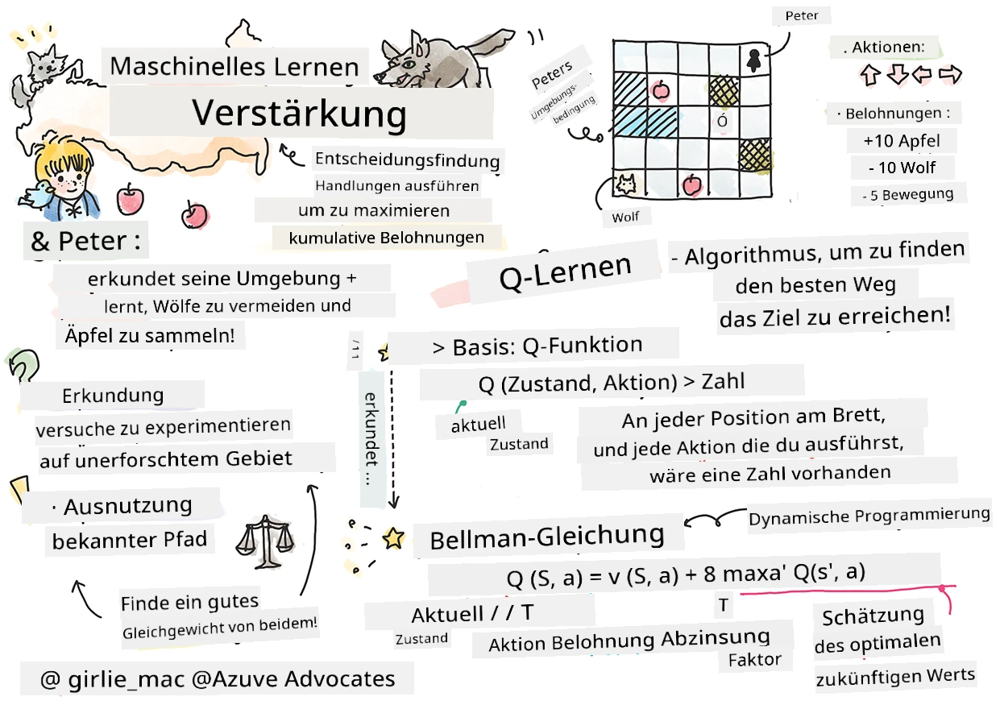
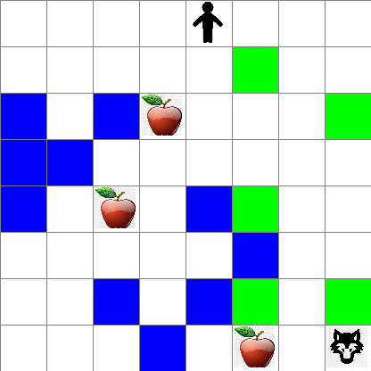

# Einführung in Reinforcement Learning und Q-Learning


> Sketchnote von [Tomomi Imura](https://www.twitter.com/girlie_mac)

Reinforcement Learning umfasst drei wichtige Konzepte: den Agenten, einige Zustände und eine Menge von Aktionen pro Zustand. Durch das Ausführen einer Aktion in einem bestimmten Zustand erhält der Agent eine Belohnung. Stellen Sie sich wieder das Computerspiel Super Mario vor. Sie sind Mario, Sie befinden sich in einem Spiellevel, stehen neben einer Klippe. Über Ihnen ist eine Münze. Sie als Mario, in einem Spiellevel, an einer bestimmten Position ... das ist Ihr Zustand. Einen Schritt nach rechts zu gehen (eine Aktion) würde Sie über die Kante führen und das würde Ihnen eine niedrige Punktzahl geben. Der Sprung-Button zu drücken würde Ihnen jedoch einen Punkt bringen und Sie würden am Leben bleiben. Das ist ein positives Ergebnis, das Ihnen eine positive Punktzahl geben sollte.

Mit Hilfe von Reinforcement Learning und einem Simulator (dem Spiel) können Sie lernen, wie man das Spiel spielt, um die Belohnung zu maximieren, nämlich am Leben zu bleiben und so viele Punkte wie möglich zu erzielen.

[](https://www.youtube.com/watch?v=lDq_en8RNOo)

> 🎥 Klicken Sie auf das obige Bild, um Dmitry über Reinforcement Learning sprechen zu hören

## [Vorlesungsquiz](https://ff-quizzes.netlify.app/en/ml/)

## Voraussetzungen und Einrichtung

In dieser Lektion werden wir mit etwas Code in Python experimentieren. Sie sollten in der Lage sein, den Jupyter Notebook-Code aus dieser Lektion entweder auf Ihrem Computer oder irgendwo in der Cloud auszuführen.

Sie können [das Lektion-Notebook](https://github.com/microsoft/ML-For-Beginners/blob/main/8-Reinforcement/1-QLearning/notebook.ipynb) öffnen und diese Lektion durchgehen, um zu bauen.

> **Hinweis:** Wenn Sie diesen Code aus der Cloud öffnen, müssen Sie auch die Datei [`rlboard.py`](https://github.com/microsoft/ML-For-Beginners/blob/main/8-Reinforcement/1-QLearning/rlboard.py) herunterladen, die im Notebook-Code verwendet wird. Fügen Sie sie in dasselbe Verzeichnis wie das Notebook ein.

## Einführung

In dieser Lektion werden wir die Welt von **[Peter und der Wolf](https://de.wikipedia.org/wiki/Peter_und_der_Wolf)** erforschen, inspiriert von einem musikalischen Märchen des russischen Komponisten [Sergej Prokofjew](https://de.wikipedia.org/wiki/Sergej_Prokofjew). Wir werden **Reinforcement Learning** verwenden, um Peter seine Umgebung erkunden zu lassen, leckere Äpfel zu sammeln und die Begegnung mit dem Wolf zu vermeiden.

**Reinforcement Learning** (RL) ist eine Lerntechnik, mit der wir ein optimales Verhalten eines **Agenten** in einer bestimmten **Umgebung** durch viele Experimente erlernen können. Ein Agent in dieser Umgebung sollte ein **Ziel** haben, das durch eine **Belohnungsfunktion** definiert ist.

## Die Umgebung

Zur Vereinfachung betrachten wir Peters Welt als quadratisches Spielfeld der Größe `width` x `height`, so wie hier:


Jede Zelle auf diesem Spielfeld kann entweder sein:

* **Boden**, auf dem Peter und andere Kreaturen gehen können.
* **Wasser**, auf dem man offensichtlich nicht gehen kann.
* ein **Baum** oder **Gras**, ein Ort, an dem man sich ausruhen kann.
* ein **Apfel**, der etwas darstellt, das Peter gerne finden würde, um sich zu ernähren.
* ein **Wolf**, der gefährlich ist und gemieden werden sollte.

Es gibt ein separates Python-Modul, [`rlboard.py`](https://github.com/microsoft/ML-For-Beginners/blob/main/8-Reinforcement/1-QLearning/rlboard.py), das den Code für die Arbeit mit dieser Umgebung enthält. Da dieser Code für das Verständnis unserer Konzepte nicht wichtig ist, werden wir das Modul importieren und verwenden, um das Beispielbrett zu erstellen (Codeblock 1):

```python
from rlboard import *

width, height = 8,8
m = Board(width,height)
m.randomize(seed=13)
m.plot()
```

Dieser Code sollte ein Bild der Umgebung ähnlich dem oben genannten ausgeben.

## Aktionen und Strategie

In unserem Beispiel wäre Peters Ziel, einen Apfel zu finden, während er den Wolf und andere Hindernisse vermeidet. Dazu kann er im Wesentlichen herumlaufen, bis er einen Apfel findet.

Deshalb kann er an jeder Position zwischen den folgenden Aktionen wählen: oben, unten, links und rechts.

Wir definieren diese Aktionen als ein Wörterbuch und ordnen sie Paaren entsprechender Koordinatenänderungen zu. Zum Beispiel würde das Bewegen nach rechts (`R`) einem Paar `(1,0)` entsprechen. (Codeblock 2):

```python
actions = { "U" : (0,-1), "D" : (0,1), "L" : (-1,0), "R" : (1,0) }
action_idx = { a : i for i,a in enumerate(actions.keys()) }
```

Zusammengefasst sind die Strategie und das Ziel dieses Szenarios wie folgt:

- **Die Strategie**, unseres Agenten (Peter) wird durch eine sogenannte **Policy** definiert. Eine Policy ist eine Funktion, die in jedem Zustand die Aktion zurückgibt. In unserem Fall wird der Zustand des Problems durch das Spielfeld repräsentiert, einschließlich der aktuellen Position des Spielers.

- **Das Ziel** des Reinforcement Learning ist es schließlich, eine gute Policy zu lernen, die es uns ermöglicht, das Problem effizient zu lösen. Als Basis betrachten wir die einfachste Strategie, die **random walk** (zufälliger Spaziergang) genannt wird.

## Zufälliger Spaziergang

Lassen Sie uns zuerst unser Problem lösen, indem wir eine Zufallsspagat-Strategie implementieren. Mit random walk wählen wir zufällig die nächste Aktion aus den erlaubten Aktionen, bis wir den Apfel erreichen (Codeblock 3).

1. Implementieren Sie den Zufallsspagat mit dem folgenden Code:

    ```python
    def random_policy(m):
        return random.choice(list(actions))
    
    def walk(m,policy,start_position=None):
        n = 0 # Anzahl der Schritte
        # Anfangsposition setzen
        if start_position:
            m.human = start_position 
        else:
            m.random_start()
        while True:
            if m.at() == Board.Cell.apple:
                return n # Erfolg!
            if m.at() in [Board.Cell.wolf, Board.Cell.water]:
                return -1 # vom Wolf gefressen oder ertrunken
            while True:
                a = actions[policy(m)]
                new_pos = m.move_pos(m.human,a)
                if m.is_valid(new_pos) and m.at(new_pos)!=Board.Cell.water:
                    m.move(a) # mache den eigentlichen Zug
                    break
            n+=1
    
    walk(m,random_policy)
    ```

    Der Aufruf von `walk` sollte die Länge des entsprechenden Pfades zurückgeben, die von Lauf zu Lauf variieren kann.

1. Führen Sie das Spaziergang-Experiment mehrmals (z.B. 100) durch und geben Sie die Statistik aus (Codeblock 4):

    ```python
    def print_statistics(policy):
        s,w,n = 0,0,0
        for _ in range(100):
            z = walk(m,policy)
            if z<0:
                w+=1
            else:
                s += z
                n += 1
        print(f"Average path length = {s/n}, eaten by wolf: {w} times")
    
    print_statistics(random_policy)
    ```

    Beachten Sie, dass die durchschnittliche Pfadlänge bei etwa 30-40 Schritten liegt, was relativ viel ist, wenn man bedenkt, dass die durchschnittliche Entfernung zum nächsten Apfel etwa 5-6 Schritte beträgt.

    Sie können auch sehen, wie Peters Bewegung während des Zufallsspaziergangs aussieht:

    

## Belohnungsfunktion

Um unsere Policy intelligenter zu machen, müssen wir verstehen, welche Bewegungen "besser" als andere sind. Dazu müssen wir unser Ziel definieren.

Das Ziel kann durch eine **Belohnungsfunktion** definiert werden, die für jeden Zustand einen Bewertungswert zurückgibt. Je höher die Zahl, desto besser die Belohnungsfunktion. (Codeblock 5)

```python
move_reward = -0.1
goal_reward = 10
end_reward = -10

def reward(m,pos=None):
    pos = pos or m.human
    if not m.is_valid(pos):
        return end_reward
    x = m.at(pos)
    if x==Board.Cell.water or x == Board.Cell.wolf:
        return end_reward
    if x==Board.Cell.apple:
        return goal_reward
    return move_reward
```

Eine interessante Sache an Belohnungsfunktionen ist, dass uns in den meisten Fällen *nur am Ende des Spiels eine bedeutende Belohnung gegeben wird*. Das bedeutet, dass unser Algorithmus irgendwie „gute“ Schritte, die zu einer positiven Belohnung am Ende führen, merken und deren Bedeutung erhöhen sollte. Ebenso sollten alle Züge, die zu schlechten Ergebnissen führen, entmutigt werden.

## Q-Learning

Ein Algorithmus, den wir hier besprechen werden, heißt **Q-Learning**. In diesem Algorithmus wird die Policy durch eine Funktion (oder Datenstruktur) namens **Q-Tabelle** definiert. Sie zeichnet die „Güte“ jeder Aktion in einem bestimmten Zustand auf.

Sie heißt Q-Tabelle, weil es oft praktisch ist, sie als Tabelle oder mehrdimensionales Array darzustellen. Da unser Spielfeld die Dimensionen `width` x `height` hat, können wir die Q-Tabelle mit einem numpy-Array der Form `width` x `height` x `len(actions)` darstellen: (Codeblock 6)

```python
Q = np.ones((width,height,len(actions)),dtype=np.float)*1.0/len(actions)
```

Beachten Sie, dass wir alle Werte der Q-Tabelle mit dem gleichen Wert initialisieren, in unserem Fall - 0,25. Dies entspricht der „random walk“ Policy, da alle Züge in jedem Zustand gleich gut sind. Wir können die Q-Tabelle an die `plot` Funktion übergeben, um die Tabelle auf dem Spielfeld zu visualisieren: `m.plot(Q)`.


In der Mitte jeder Zelle befindet sich ein „Pfeil“, der die bevorzugte Bewegungsrichtung anzeigt. Da alle Richtungen gleich sind, wird ein Punkt angezeigt.

Jetzt müssen wir die Simulation ausführen, unsere Umgebung erkunden und eine bessere Verteilung der Q-Tabellenwerte erlernen, die es uns ermöglichen wird, den Weg zum Apfel viel schneller zu finden.

## Kern von Q-Learning: Bellman-Gleichung

Sobald wir anfangen zu bewegen, hat jede Aktion eine entsprechende Belohnung, d.h. theoretisch könnten wir die nächste Aktion basierend auf der höchsten unmittelbaren Belohnung auswählen. Allerdings wird der Zug in den meisten Zuständen nicht unser Ziel erreichen, den Apfel zu finden, und deshalb können wir nicht sofort entscheiden, welche Richtung besser ist.

> Denken Sie daran, dass nicht das unmittelbare Ergebnis zählt, sondern das endgültige Ergebnis, das wir am Ende der Simulation erhalten.

Um diese verzögerte Belohnung zu berücksichtigen, müssen wir die Prinzipien der **[dynamischen Programmierung](https://de.wikipedia.org/wiki/Dynamische_Programmierung)** verwenden, die es uns ermöglichen, unser Problem rekursiv zu betrachten.

Angenommen, wir befinden uns jetzt im Zustand *s* und wollen in den nächsten Zustand *s'* übergehen. Dabei erhalten wir die unmittelbare Belohnung *r(s,a)*, definiert durch die Belohnungsfunktion, plus eine zukünftige Belohnung. Wenn wir annehmen, dass unsere Q-Tabelle korrekt die „Attraktivität“ jeder Aktion widerspiegelt, wählen wir im Zustand *s'* eine Aktion *a* aus, die dem maximalen Wert von *Q(s',a')* entspricht. Somit ist die bestmögliche zukünftige Belohnung, die wir im Zustand *s* erhalten könnten, definiert als `max`<sub>a'</sub>*Q(s',a')* (das Maximum hier wird über alle möglichen Aktionen *a'* im Zustand *s'* berechnet).

Dies ergibt die **Bellman-Gleichung** zur Berechnung des Wertes der Q-Tabelle im Zustand *s* bei Aktion *a*:


Hier ist γ der sogenannte **Discount-Faktor**, der bestimmt, in welchem Maße Sie die aktuelle Belohnung der zukünftigen vorziehen oder umgekehrt bewerten sollten.

## Lernalgorithmus

Angesichts der obigen Gleichung können wir nun Pseudocode für unseren Lernalgorithmus schreiben:

* Initialisiere Q-Tabelle Q mit gleichen Werten für alle Zustände und Aktionen
* Setze Lernrate α ← 1
* Wiederhole die Simulation viele Male
   1. Starte an einer zufälligen Position
   1. Wiederhole
        1. Wähle eine Aktion *a* im Zustand *s*
        2. Führe die Aktion aus, indem du in einen neuen Zustand *s'* wechselst
        3. Wenn Endbedingung des Spiels erreicht wird oder die Gesamtbelohnung zu niedrig ist - beende die Simulation
        4. Berechne die Belohnung *r* im neuen Zustand
        5. Aktualisiere die Q-Funktion gemäß Bellman-Gleichung: *Q(s,a)* ← *(1-α)Q(s,a)+α(r+γ max<sub>a'</sub>Q(s',a'))*
        6. *s* ← *s'*
        7. Aktualisiere die Gesamtbelohnung und verringere α.

## Ausnutzen vs. erkunden

Im obigen Algorithmus haben wir nicht genau angegeben, wie wir bei Schritt 2.1 die Aktion auswählen sollen. Wenn wir die Aktion zufällig wählen, werden wir die Umgebung zufällig **erkunden** und es ist ziemlich wahrscheinlich, dass wir oft sterben und Bereiche erkunden, in die wir normalerweise nicht gehen würden. Eine alternative Herangehensweise wäre, die Q-Tabellenwerte, die wir bereits kennen, **auszunutzen** und somit die beste Aktion (mit höherem Q-Tabellenwert) im Zustand *s* zu wählen. Dies würde uns jedoch daran hindern, andere Zustände zu erkunden, und es ist wahrscheinlich, dass wir nicht die optimale Lösung finden.

Deshalb ist der beste Ansatz, ein Gleichgewicht zwischen Erkundung und Ausnutzung zu finden. Dies kann erreicht werden, indem man die Aktion im Zustand *s* mit Wahrscheinlichkeiten proportional zu den Werten in der Q-Tabelle auswählt. Anfangs, wenn alle Q-Tabelle Werte gleich sind, entspricht dies einer zufälligen Auswahl, aber je mehr wir über unsere Umgebung lernen, desto wahrscheinlicher ist es, dass wir der optimalen Route folgen und gleichzeitig dem Agenten erlauben, ab und zu einen unerforschten Weg zu wählen.

## Python-Implementierung

Wir sind nun bereit, den Lernalgorithmus zu implementieren. Bevor wir das tun, benötigen wir auch eine Funktion, die beliebige Zahlen in der Q-Tabelle in einen Wahrscheinlichkeitsvektor für die entsprechenden Aktionen umwandelt.

1. Erstellen Sie eine Funktion `probs()`:

    ```python
    def probs(v,eps=1e-4):
        v = v-v.min()+eps
        v = v/v.sum()
        return v
    ```

    Wir fügen dem ursprünglichen Vektor einige `eps` hinzu, um eine Division durch 0 im Anfangsfall zu vermeiden, wenn alle Komponenten des Vektors identisch sind.

Führen Sie den Lernalgorithmus für 5000 Experimente, auch **Epochen** genannt, aus: (Codeblock 8)
```python
    for epoch in range(5000):
    
        # Startpunkt wählen
        m.random_start()
        
        # Beginnen Sie die Reise
        n=0
        cum_reward = 0
        while True:
            x,y = m.human
            v = probs(Q[x,y])
            a = random.choices(list(actions),weights=v)[0]
            dpos = actions[a]
            m.move(dpos,check_correctness=False) # Wir erlauben dem Spieler, sich außerhalb des Spielfelds zu bewegen, was die Folge beendet
            r = reward(m)
            cum_reward += r
            if r==end_reward or cum_reward < -1000:
                lpath.append(n)
                break
            alpha = np.exp(-n / 10e5)
            gamma = 0.5
            ai = action_idx[a]
            Q[x,y,ai] = (1 - alpha) * Q[x,y,ai] + alpha * (r + gamma * Q[x+dpos[0], y+dpos[1]].max())
            n+=1
```

Nach Ausführung dieses Algorithmus sollte die Q-Tabelle mit Werten aktualisiert sein, die die Attraktivität verschiedener Aktionen in jedem Schritt definieren. Wir können versuchen, die Q-Tabelle zu visualisieren, indem wir in jeder Zelle einen Vektor zeichnen, der in die gewünschte Bewegungsrichtung zeigt. Zur Vereinfachung zeichnen wir anstelle eines Pfeilkopfes einen kleinen Kreis.


## Überprüfung der Policy

Da die Q-Tabelle die „Attraktivität“ jeder Aktion in jedem Zustand auflistet, ist es recht einfach, sie zur Definition der effizienten Navigation in unserer Welt zu verwenden. Im einfachsten Fall können wir die Aktion auswählen, die dem höchsten Q-Tabellenwert entspricht: (Codeblock 9)

```python
def qpolicy_strict(m):
        x,y = m.human
        v = probs(Q[x,y])
        a = list(actions)[np.argmax(v)]
        return a

walk(m,qpolicy_strict)
```


> Wenn du den oben stehenden Code mehrere Male ausprobierst, kann es vorkommen, dass er manchmal „hängen bleibt“ und du den STOP-Knopf im Notebook drücken musst, um ihn zu unterbrechen. Das passiert, weil es Situationen geben kann, in denen zwei Zustände sich in Bezug auf den optimalen Q-Wert „gegenseitig ansprechen“, sodass der Agent zwischen diesen Zuständen unendlich hin- und her wandert.

## 🚀Herausforderung

> **Aufgabe 1:** Ändere die Funktion `walk` so ab, dass die maximale Pfadlänge auf eine bestimmte Anzahl von Schritten (zum Beispiel 100) begrenzt wird, und beobachte, dass der oben stehende Code von Zeit zu Zeit diesen Wert zurückgibt.

> **Aufgabe 2:** Ändere die Funktion `walk` so, dass sie nicht an Orte zurückkehrt, an denen sie bereits zuvor war. Das verhindert, dass `walk` in einer Schleife läuft, jedoch kann der Agent trotzdem an einem Ort „gefangen“ sein, aus dem er nicht entkommen kann.

## Navigation

Eine bessere Navigationsstrategie wäre die, die wir während des Trainings verwendet haben, und die Ausnutzung und Erkundung kombiniert. Bei dieser Strategie wählen wir jede Aktion mit einer gewissen Wahrscheinlichkeit, die proportional zu den Werten in der Q-Tabelle ist. Diese Strategie kann dazu führen, dass der Agent zu einer bereits erkundeten Position zurückkehrt, aber wie du im folgenden Code sehen kannst, führt sie zu einem sehr kurzen durchschnittlichen Pfad zur gewünschten Position (denk daran, dass `print_statistics` die Simulation 100 mal ausführt): (Codeblock 10)

```python
def qpolicy(m):
        x,y = m.human
        v = probs(Q[x,y])
        a = random.choices(list(actions),weights=v)[0]
        return a

print_statistics(qpolicy)
```

Nachdem du diesen Code ausgeführt hast, solltest du eine viel kleinere durchschnittliche Pfadlänge als zuvor erhalten, etwa im Bereich von 3-6.

## Untersuchung des Lernprozesses

Wie wir bereits erwähnt haben, ist der Lernprozess ein Gleichgewicht zwischen Erkundung und Ausnutzung des gewonnenen Wissens über die Struktur des Problemraums. Wir haben gesehen, dass sich die Lernergebnisse (die Fähigkeit, einem Agenten zu helfen, einen kurzen Weg zum Ziel zu finden) verbessert haben, aber es ist auch interessant zu beobachten, wie sich die durchschnittliche Pfadlänge während des Lernprozesses verhält:


Die Erkenntnisse lassen sich zusammenfassen als:

- **Die durchschnittliche Pfadlänge nimmt zu.** Was wir hier sehen, ist, dass zuerst die durchschnittliche Pfadlänge zunimmt. Wahrscheinlich liegt das daran, dass wir am Anfang nichts über die Umgebung wissen und daher wahrscheinlich in schlechten Zuständen stecken bleiben, etwa Wasser oder Wolf. Wenn wir mehr lernen und dieses Wissen anwenden, können wir die Umgebung länger erkunden, aber wir wissen noch nicht genau, wo die Äpfel sind.

- **Die Pfadlänge nimmt ab, wenn wir mehr lernen.** Sobald wir genug gelernt haben, wird es für den Agenten einfacher, das Ziel zu erreichen, und die Pfadlänge beginnt zu sinken. Wir bleiben jedoch offen für Erkundungen, weshalb wir oft vom besten Weg abweichen und neue Optionen prüfen, was den Weg länger als optimal macht.

- **Die Länge nimmt plötzlich zu.** Was wir ebenfalls auf dem Diagramm beobachten, ist, dass die Länge an einem Punkt plötzlich stark angestiegen ist. Das zeigt die stochastische Natur des Prozesses und dass wir die Q-Tabellen-Koeffizienten gelegentlich „versauen“ können, indem wir sie mit neuen Werten überschreiben. Das sollte idealerweise durch Verringerung der Lernrate minimiert werden (beispielsweise passen wir gegen Ende des Trainings die Q-Tabellen-Werte nur noch mit kleinen Schritten an).

Insgesamt ist es wichtig zu bedenken, dass Erfolg und Qualität des Lernprozesses maßgeblich von Parametern abhängen, etwa Lernrate, Lernratenabnahme und Diskontfaktor. Diese werden oft als **Hyperparameter** bezeichnet, um sie von **Parametern** zu unterscheiden, die während des Trainings optimiert werden (zum Beispiel Q-Tabellen-Koeffizienten). Der Prozess, die besten Werte für Hyperparameter zu finden, heißt **Hyperparameter-Optimierung** und verdient ein eigenes Thema.

## [Quiz nach der Vorlesung](https://ff-quizzes.netlify.app/en/ml/)

## Aufgabe
[Eine realistischere Welt](assignment.md)

---

<!-- CO-OP TRANSLATOR DISCLAIMER START -->
**Haftungsausschluss**:
Dieses Dokument wurde mit dem KI-Übersetzungsdienst [Co-op Translator](https://github.com/Azure/co-op-translator) übersetzt. Obwohl wir uns um Genauigkeit bemühen, beachten Sie bitte, dass automatisierte Übersetzungen Fehler oder Ungenauigkeiten enthalten können. Das Originaldokument in seiner Ursprungssprache gilt als maßgebliche Quelle. Bei kritischen Informationen wird eine professionelle menschliche Übersetzung empfohlen. Wir übernehmen keine Haftung für Missverständnisse oder Fehlinterpretationen, die aus der Verwendung dieser Übersetzung entstehen.
<!-- CO-OP TRANSLATOR DISCLAIMER END -->