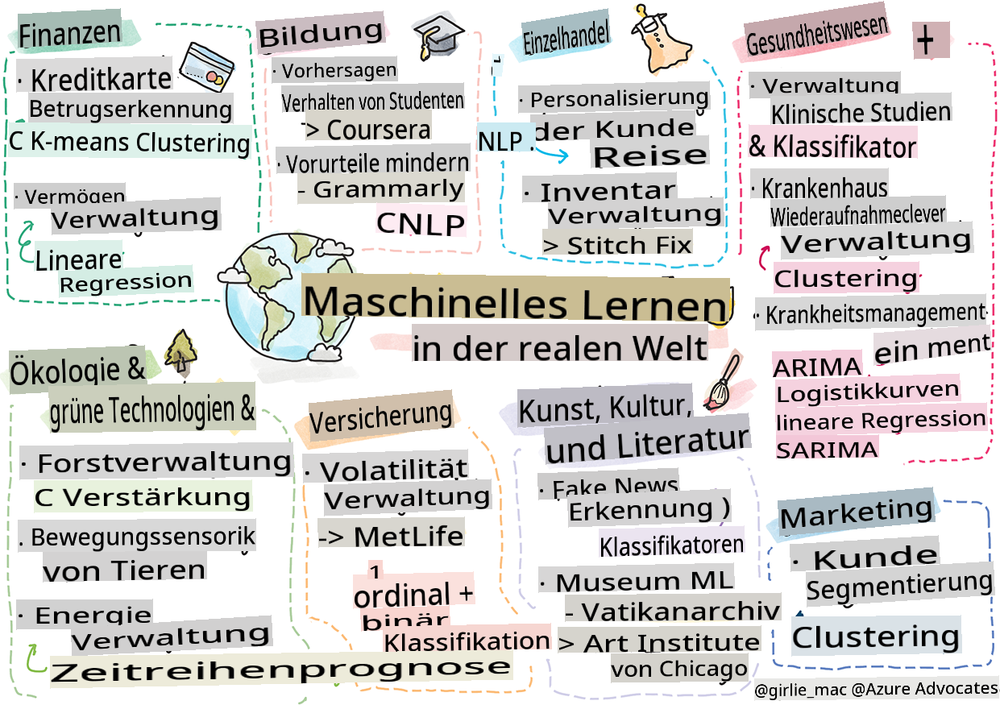

# Nachwort: Maschinelles Lernen in der realen Welt

> Sketchnote von [Tomomi Imura](https://www.twitter.com/girlie_mac)

In diesem Lehrplan haben Sie viele Möglichkeiten kennengelernt, Daten für das Training vorzubereiten und Modelle für maschinelles Lernen zu erstellen. Sie haben eine Reihe klassischer Modelle für Regression, Clusterbildung, Klassifikation, Verarbeitung natürlicher Sprache und Zeitreihen entwickelt. Herzlichen Glückwunsch! Jetzt fragen Sie sich vielleicht, wozu das Ganze dient... Was sind die Anwendungen dieser Modelle in der realen Welt?

Während in der Industrie viel Interesse an KI geweckt wurde, die normalerweise auf Deep Learning setzt, gibt es immer noch wertvolle Anwendungen für klassische Modelle des maschinellen Lernens. Möglicherweise nutzen Sie einige dieser Anwendungen sogar heute! In dieser Lektion werden Sie erkunden, wie acht verschiedene Branchen und Fachgebiete diese Arten von Modellen einsetzen, um ihre Anwendungen leistungsfähiger, zuverlässiger, intelligenter und wertvoller für die Nutzer zu machen.

## [Vorlesungsquiz](https://gray-sand-07a10f403.1.azurestaticapps.net/quiz/49/)

## 💰 Finanzen

Der Finanzsektor bietet viele Möglichkeiten für maschinelles Lernen. Viele Probleme in diesem Bereich eignen sich zur Modellierung und Lösung mit ML.

### Betrugserkennung bei Kreditkarten

Wir haben im Laufe des Kurses bereits über [k-means Clustering](../../5-Clustering/2-K-Means/README.md) gelernt, aber wie kann es zur Lösung von Problemen im Zusammenhang mit Kreditkartenbetrug eingesetzt werden?

K-means Clustering kommt bei einer Betrugserkennungstechnik namens **Ausreißererkennung** zum Einsatz. Ausreißer oder Abweichungen in Beobachtungen eines Datensatzes können uns sagen, ob eine Kreditkarte normal verwendet wird oder ob etwas Ungewöhnliches vor sich geht. Wie im unten verlinkten Papier gezeigt, können Sie Kreditkartendaten mit einem k-means Clustering-Algorithmus sortieren und jede Transaktion einem Cluster zuweisen, basierend darauf, wie stark sie als Ausreißer erscheint. Dann können Sie die riskantesten Cluster hinsichtlich betrügerischer versus legitimer Transaktionen bewerten.
[Referenz](https://citeseerx.ist.psu.edu/viewdoc/download?doi=10.1.1.680.1195&rep=rep1&type=pdf)

### Vermögensverwaltung

In der Vermögensverwaltung kümmert sich eine Person oder ein Unternehmen im Auftrag ihrer Kunden um Investitionen. Ihre Aufgabe ist es, Vermögen langfristig zu erhalten und zu vermehren, daher ist es entscheidend, Investitionen auszuwählen, die gut abschneiden.

Eine Möglichkeit, wie eine bestimmte Investition abschneidet, ist die statistische Regression. [Lineare Regression](../../2-Regression/1-Tools/README.md) ist ein wertvolles Werkzeug, um zu verstehen, wie ein Fonds im Vergleich zu einem Benchmark abschneidet. Wir können auch ableiten, ob die Ergebnisse der Regression statistisch signifikant sind oder wie stark sie die Investitionen eines Kunden beeinflussen würden. Sie könnten Ihre Analyse sogar mit multipler Regression erweitern, bei der zusätzliche Risikofaktoren berücksichtigt werden können. Für ein Beispiel, wie dies für einen bestimmten Fonds funktionieren würde, werfen Sie einen Blick auf das untenstehende Papier zur Bewertung der Fondsperformance mit Regression.
[Referenz](http://www.brightwoodventures.com/evaluating-fund-performance-using-regression/)

## 🎓 Bildung

Der Bildungssektor ist ebenfalls ein sehr interessantes Gebiet, in dem ML angewendet werden kann. Es gibt interessante Probleme, die angegangen werden müssen, wie z.B. das Erkennen von Betrug bei Tests oder Essays oder das Management von Vorurteilen, absichtlich oder nicht, im Korrekturprozess.

### Vorhersage des Verhaltens von Studenten

[Coursera](https://coursera.com), ein Anbieter von Online-Kursen, hat einen großartigen Technik-Blog, in dem sie viele ingenieurtechnische Entscheidungen diskutieren. In dieser Fallstudie haben sie eine Regressionslinie geplottet, um eine mögliche Korrelation zwischen einer niedrigen NPS (Net Promoter Score)-Bewertung und der Kursbindung oder dem Abbruch zu untersuchen.
[Referenz](https://medium.com/coursera-engineering/controlled-regression-quantifying-the-impact-of-course-quality-on-learner-retention-31f956bd592a)

### Minderung von Vorurteilen

[Grammarly](https://grammarly.com), ein Schreibassistent, der auf Rechtschreib- und Grammatikfehler prüft, verwendet in seinen Produkten ausgeklügelte [Systeme zur Verarbeitung natürlicher Sprache](../../6-NLP/README.md). Sie haben in ihrem Technik-Blog eine interessante Fallstudie veröffentlicht, in der sie beschreiben, wie sie mit Geschlechtervorurteilen im maschinellen Lernen umgegangen sind, von denen Sie in unserer [Einführung in Fairness](../../1-Introduction/3-fairness/README.md) erfahren haben.
[Referenz](https://www.grammarly.com/blog/engineering/mitigating-gender-bias-in-autocorrect/)

## 👜 Einzelhandel

Der Einzelhandelssektor kann definitiv von der Nutzung von ML profitieren, von der Schaffung einer besseren Customer Journey bis hin zur optimalen Lagerverwaltung.

### Personalisierung der Customer Journey

Bei Wayfair, einem Unternehmen, das Haushaltswaren wie Möbel verkauft, ist es von größter Bedeutung, den Kunden zu helfen, die richtigen Produkte für ihren Geschmack und ihre Bedürfnisse zu finden. In diesem Artikel beschreiben Ingenieure des Unternehmens, wie sie ML und NLP nutzen, um "die richtigen Ergebnisse für die Kunden zu liefern". Besonders erwähnenswert ist, dass ihre Query Intent Engine entwickelt wurde, um Entitätsextraktion, Klassifizierungs-Training, Asset- und Meinungs-Extraktion sowie Sentiment-Tagging bei Kundenbewertungen zu verwenden. Dies ist ein klassisches Anwendungsbeispiel dafür, wie NLP im Online-Einzelhandel funktioniert.
[Referenz](https://www.aboutwayfair.com/tech-innovation/how-we-use-machine-learning-and-natural-language-processing-to-empower-search)

### Bestandsmanagement

Innovative, agile Unternehmen wie [StitchFix](https://stitchfix.com), ein Box-Service, der Kleidung an Verbraucher versendet, verlassen sich stark auf ML für Empfehlungen und Bestandsmanagement. Ihre Styling-Teams arbeiten tatsächlich eng mit ihren Merchandising-Teams zusammen: "Einer unserer Datenwissenschaftler hat mit einem genetischen Algorithmus experimentiert und ihn auf Bekleidung angewendet, um vorherzusagen, welches Kleidungsstück erfolgreich sein würde, das es heute nicht gibt. Wir haben das dem Merchandising-Team vorgestellt und jetzt können sie es als Werkzeug nutzen."
[Referenz](https://www.zdnet.com/article/how-stitch-fix-uses-machine-learning-to-master-the-science-of-styling/)

## 🏥 Gesundheitswesen

Der Gesundheitssektor kann ML nutzen, um Forschungsaufgaben zu optimieren und auch logistische Probleme wie die Wiederaufnahme von Patienten oder die Eindämmung der Ausbreitung von Krankheiten zu lösen.

### Verwaltung klinischer Studien

Toxizität in klinischen Studien ist ein großes Anliegen für Arzneimittelhersteller. Wie viel Toxizität ist tolerierbar? In dieser Studie führte die Analyse verschiedener Methoden klinischer Studien zur Entwicklung eines neuen Ansatzes zur Vorhersage der Wahrscheinlichkeiten klinischer Studienergebnisse. Konkret konnten sie Random Forest nutzen, um einen [Klassifikator](../../4-Classification/README.md) zu erstellen, der in der Lage ist, zwischen Gruppen von Medikamenten zu unterscheiden.
[Referenz](https://www.sciencedirect.com/science/article/pii/S2451945616302914)

### Management von Krankenhauswiederaufnahmen

Krankenhauspflege ist kostspielig, insbesondere wenn Patienten wieder aufgenommen werden müssen. In diesem Papier wird ein Unternehmen diskutiert, das ML einsetzt, um das Potenzial von Wiederaufnahmen mithilfe von [Clustering](../../5-Clustering/README.md)-Algorithmen vorherzusagen. Diese Cluster helfen Analysten dabei, "Gruppen von Wiederaufnahmen zu entdecken, die möglicherweise eine gemeinsame Ursache teilen".
[Referenz](https://healthmanagement.org/c/healthmanagement/issuearticle/hospital-readmissions-and-machine-learning)

### Krankheitsmanagement

Die jüngste Pandemie hat die Möglichkeiten, wie maschinelles Lernen zur Eindämmung der Ausbreitung von Krankheiten beitragen kann, ins Rampenlicht gerückt. In diesem Artikel erkennen Sie die Verwendung von ARIMA, logistischen Kurven, linearer Regression und SARIMA. "Diese Arbeit ist ein Versuch, die Ausbreitungsrate dieses Virus zu berechnen und somit die Todesfälle, Genesungen und bestätigten Fälle vorherzusagen, damit wir uns besser vorbereiten und überleben können."
[Referenz](https://www.ncbi.nlm.nih.gov/pmc/articles/PMC7979218/)

## 🌲 Ökologie und grüne Technologie

Natur und Ökologie bestehen aus vielen empfindlichen Systemen, in denen das Zusammenspiel zwischen Tieren und Natur in den Fokus rückt. Es ist wichtig, diese Systeme genau zu messen und angemessen zu handeln, wenn etwas passiert, wie z.B. ein Waldbrand oder ein Rückgang der Tierpopulation.

### Waldmanagement

Sie haben in früheren Lektionen über [Verstärkendes Lernen](../../8-Reinforcement/README.md) gelernt. Es kann sehr nützlich sein, um Muster in der Natur vorherzusagen. Insbesondere kann es verwendet werden, um ökologische Probleme wie Waldbrände und die Ausbreitung invasiver Arten zu verfolgen. In Kanada verwendete eine Gruppe von Forschern Verstärkendes Lernen, um Modelle für die Dynamik von Waldbränden aus Satellitenbildern zu erstellen. Mit einem innovativen "räumlich sich ausbreitenden Prozess (SSP)" stellten sie sich ein Waldfeuer als "den Agenten in einer Zelle der Landschaft" vor. "Die Menge an Aktionen, die das Feuer zu einem bestimmten Zeitpunkt von einem Standort aus ergreifen kann, umfasst das Ausbreiten nach Norden, Süden, Osten oder Westen oder das Nicht-Ausbreiten.

Dieser Ansatz kehrt das übliche RL-Setup um, da die Dynamik des entsprechenden Markov-Entscheidungsprozesses (MDP) eine bekannte Funktion für die sofortige Ausbreitung von Waldbränden ist." Lesen Sie mehr über die klassischen Algorithmen, die von dieser Gruppe unter dem folgenden Link verwendet werden.
[Referenz](https://www.frontiersin.org/articles/10.3389/fict.2018.00006/full)

### Bewegungserkennung von Tieren

Während Deep Learning eine Revolution in der visuellen Verfolgung von Tierbewegungen ausgelöst hat (hier können Sie Ihren eigenen [Eisbär-Tracker](https://docs.microsoft.com/learn/modules/build-ml-model-with-azure-stream-analytics/?WT.mc_id=academic-77952-leestott) erstellen), hat klassisches ML immer noch einen Platz in dieser Aufgabe.

Sensoren zur Verfolgung der Bewegungen von Nutztieren und IoT nutzen diese Art der visuellen Verarbeitung, aber einfachere ML-Techniken sind nützlich, um Daten vorzubereiten. Zum Beispiel wurden in diesem Papier die Körperhaltungen von Schafen mithilfe verschiedener Klassifikator-Algorithmen überwacht und analysiert. Sie könnten die ROC-Kurve auf Seite 335 erkennen.
[Referenz](https://druckhaus-hofmann.de/gallery/31-wj-feb-2020.pdf)

### ⚡️ Energiemanagement

In unseren Lektionen über [Zeitreihenprognosen](../../7-TimeSeries/README.md) haben wir das Konzept von intelligenten Parkuhren erwähnt, um Einnahmen für eine Stadt auf der Grundlage des Verständnisses von Angebot und Nachfrage zu generieren. Dieser Artikel behandelt im Detail, wie Clusterbildung, Regression und Zeitreihenprognosen kombiniert wurden, um den zukünftigen Energieverbrauch in Irland auf der Grundlage von Smart Metering vorherzusagen.
[Referenz](https://www-cdn.knime.com/sites/default/files/inline-images/knime_bigdata_energy_timeseries_whitepaper.pdf)

## 💼 Versicherungen

Der Versicherungssektor ist ein weiterer Bereich, der ML nutzt, um tragfähige finanzielle und versicherungsmathematische Modelle zu konstruieren und zu optimieren.

### Volatilitätsmanagement

MetLife, ein Lebensversicherungsanbieter, ist offen darin, wie sie Volatilität in ihren Finanzmodellen analysieren und mindern. In diesem Artikel werden Sie binäre und ordinale Klassifizierungsvisualisierungen bemerken. Sie werden auch Vorhersagevisualisierungen entdecken.
[Referenz](https://investments.metlife.com/content/dam/metlifecom/us/investments/insights/research-topics/macro-strategy/pdf/MetLifeInvestmentManagement_MachineLearnedRanking_070920.pdf)

## 🎨 Kunst, Kultur und Literatur

In den Künsten, zum Beispiel im Journalismus, gibt es viele interessante Probleme. Die Erkennung von Fake News ist ein großes Problem, da nachgewiesen wurde, dass sie die Meinungen der Menschen beeinflussen und sogar Demokratien gefährden können. Museen können ebenfalls von der Nutzung von ML profitieren, von der Auffindung von Verbindungen zwischen Artefakten bis hin zur Ressourcenplanung.

### Erkennung von Fake News

Die Erkennung von Fake News ist heute ein Katz-und-Maus-Spiel in den Medien. In diesem Artikel schlagen Forscher vor, dass ein System, das mehrere der ML-Techniken kombiniert, die wir studiert haben, getestet werden kann und das beste Modell eingesetzt wird: "Dieses System basiert auf der Verarbeitung natürlicher Sprache, um Merkmale aus den Daten zu extrahieren, und diese Merkmale werden dann für das Training von Klassifikatoren für maschinelles Lernen wie Naive Bayes, Support Vector Machine (SVM), Random Forest (RF), Stochastic Gradient Descent (SGD) und Logistische Regression (LR) verwendet."
[Referenz](https://www.irjet.net/archives/V7/i6/IRJET-V7I6688.pdf)

Dieser Artikel zeigt, wie die Kombination verschiedener ML-Domänen interessante Ergebnisse liefern kann, die helfen können, die Verbreitung von Fake News zu stoppen und echten Schaden zu verhindern; in diesem Fall war der Anstoß die Verbreitung von Gerüchten über COVID-Behandlungen, die zu mobiler Gewalt führten.

### Museum ML

Museen stehen am Vorabend einer KI-Revolution, in der die Katalogisierung und Digitalisierung von Sammlungen sowie das Finden von Verbindungen zwischen Artefakten durch den technologischen Fortschritt einfacher wird. Projekte wie [In Codice Ratio](https://www.sciencedirect.com/science/article/abs/pii/S0306457321001035#:~:text=1.,studies%20over%20large%20historical%20sources.) helfen, die Geheimnisse unzugänglicher Sammlungen wie der Vatikanarchive zu entschlüsseln. Aber auch der geschäftliche Aspekt von Museen profitiert von ML-Modellen.

Zum Beispiel hat das Art Institute of Chicago Modelle entwickelt, um vorherzusagen, an welchen Ausstellungen das Publikum interessiert ist und wann es diese besuchen wird. Das Ziel ist es, bei jedem Besuch des Nutzers im Museum individualisierte und optimierte Besuchererlebnisse zu schaffen. "Im Haushaltsjahr 2017 sagte das Modell die Besucherzahlen und -eintritte mit einer Genauigkeit von 1 Prozent voraus, sagt Andrew Simnick, Senior Vice President des Art Institute."
[Reference](https://www.chicagobusiness.com/article/20180518/ISSUE01/180519840/art-institute-of-chicago-uses-data-to-make-exhibit-choices)

## 🏷 Marketing

### Kundensegmentierung

Die effektivsten Marketingstrategien richten sich auf unterschiedliche Weise an Kunden, basierend auf verschiedenen Gruppierungen. In diesem Artikel werden die Anwendungen von Clustering-Algorithmen diskutiert, um differenziertes Marketing zu unterstützen. Differenziertes Marketing hilft Unternehmen, die Markenbekanntheit zu verbessern, mehr Kunden zu erreichen und mehr Geld zu verdienen.  
[Reference](https://ai.inqline.com/machine-learning-for-marketing-customer-segmentation/)

## 🚀 Herausforderung

Identifizieren Sie einen anderen Sektor, der von einigen der Techniken profitiert, die Sie in diesem Lehrplan gelernt haben, und entdecken Sie, wie er ML nutzt.

## [Nach der Vorlesung Quiz](https://gray-sand-07a10f403.1.azurestaticapps.net/quiz/50/)

## Überprüfung & Selbststudium

Das Data-Science-Team von Wayfair hat mehrere interessante Videos darüber, wie sie ML in ihrem Unternehmen einsetzen. Es lohnt sich, [einen Blick darauf zu werfen](https://www.youtube.com/channel/UCe2PjkQXqOuwkW1gw6Ameuw/videos)!

## Aufgabe

[Eine ML-Schnitzeljagd](assignment.md)

**Haftungsausschluss**:  
Dieses Dokument wurde mit maschinellen KI-Übersetzungsdiensten übersetzt. Obwohl wir uns um Genauigkeit bemühen, beachten Sie bitte, dass automatisierte Übersetzungen Fehler oder Ungenauigkeiten enthalten können. Das Originaldokument in seiner ursprünglichen Sprache sollte als die maßgebliche Quelle betrachtet werden. Für wichtige Informationen wird eine professionelle menschliche Übersetzung empfohlen. Wir übernehmen keine Verantwortung für Missverständnisse oder Fehlinterpretationen, die aus der Verwendung dieser Übersetzung resultieren.