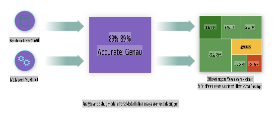
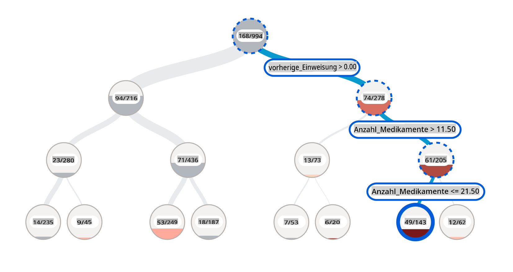
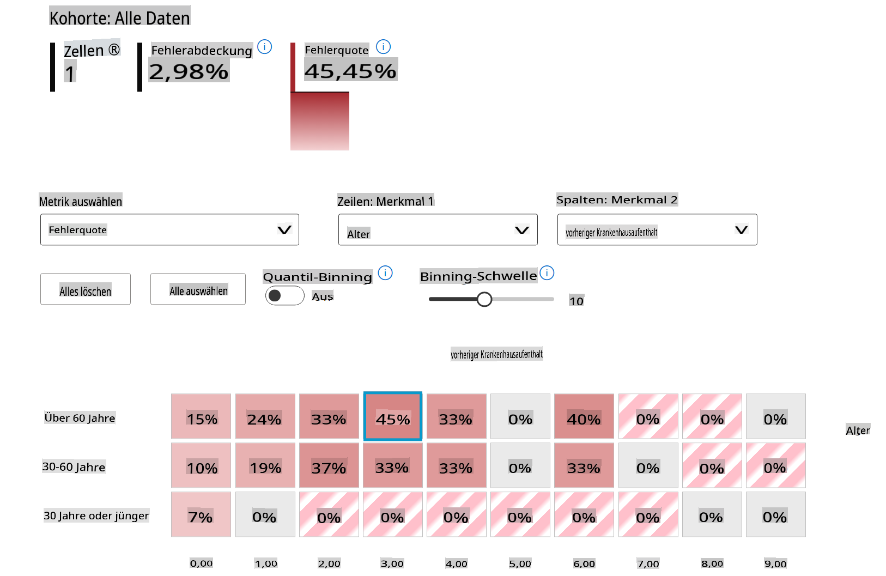
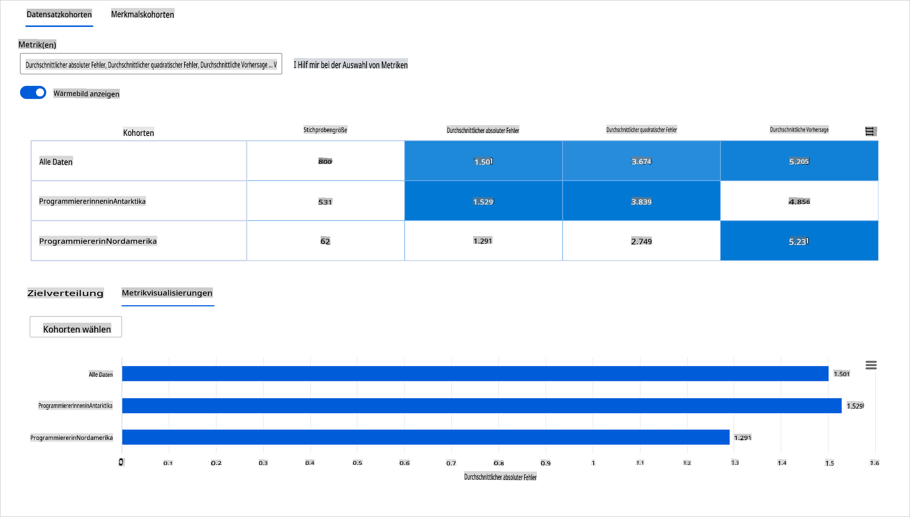
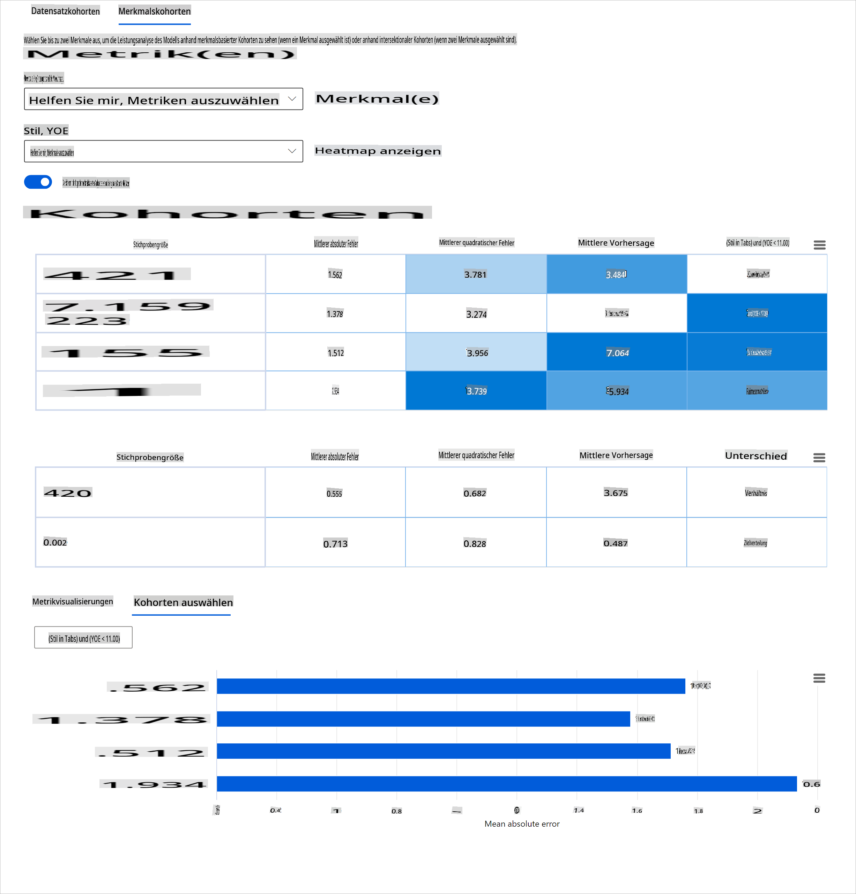
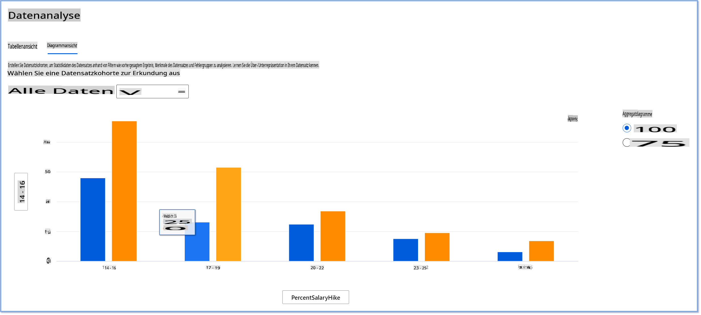
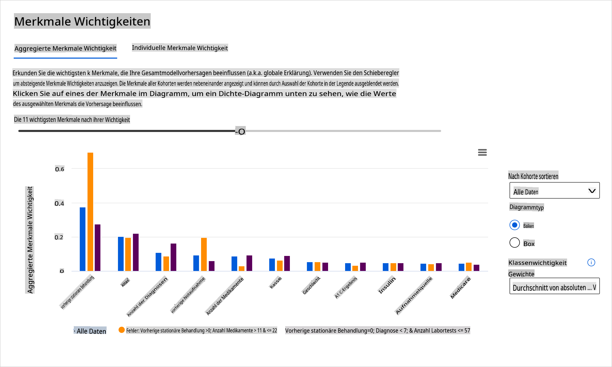

# Nachschrift: Modell-Debugging im maschinellen Lernen mit Komponenten des Responsible AI Dashboards

## [Vorlesungsquiz](https://gray-sand-07a10f403.1.azurestaticapps.net/quiz/5/)

## Einführung

Maschinelles Lernen beeinflusst unser tägliches Leben. KI findet ihren Weg in einige der wichtigsten Systeme, die uns als Individuen sowie unsere Gesellschaft betreffen, von Gesundheitswesen, Finanzen, Bildung bis hin zu Beschäftigung. Systeme und Modelle sind beispielsweise an täglichen Entscheidungsprozessen beteiligt, wie bei Gesundheitsdiagnosen oder der Betrugserkennung. Folglich werden die Fortschritte in der KI und die beschleunigte Akzeptanz mit sich wandelnden gesellschaftlichen Erwartungen und wachsender Regulierung konfrontiert. Wir sehen ständig Bereiche, in denen KI-Systeme die Erwartungen nicht erfüllen; sie bringen neue Herausforderungen mit sich; und Regierungen beginnen, KI-Lösungen zu regulieren. Daher ist es wichtig, dass diese Modelle analysiert werden, um faire, zuverlässige, inklusive, transparente und verantwortungsvolle Ergebnisse für alle zu liefern.

In diesem Lehrplan werden wir praktische Werkzeuge betrachten, die verwendet werden können, um zu bewerten, ob ein Modell Probleme mit verantwortungsvoller KI aufweist. Traditionelle Debugging-Techniken im maschinellen Lernen basieren oft auf quantitativen Berechnungen wie aggregierter Genauigkeit oder durchschnittlichem Fehlerverlust. Stellen Sie sich vor, was passieren kann, wenn die Daten, die Sie verwenden, um diese Modelle zu erstellen, bestimmte demografische Merkmale wie Rasse, Geschlecht, politische Ansichten, Religion nicht enthalten oder diese demografischen Merkmale unverhältnismäßig repräsentieren. Was ist, wenn die Ausgabe des Modells so interpretiert wird, dass sie eine bestimmte demografische Gruppe begünstigt? Dies kann zu einer Über- oder Unterrepräsentation dieser sensiblen Merkmalsgruppen führen, was Fairness-, Inklusions- oder Zuverlässigkeitsprobleme des Modells zur Folge hat. Ein weiterer Faktor ist, dass maschinelles Lernen oft als Black Box betrachtet wird, was es schwierig macht zu verstehen und zu erklären, was die Vorhersage eines Modells antreibt. All dies sind Herausforderungen, denen Datenwissenschaftler und KI-Entwickler gegenüberstehen, wenn sie nicht über angemessene Werkzeuge verfügen, um die Fairness oder Vertrauenswürdigkeit eines Modells zu debuggen und zu bewerten.

In dieser Lektion lernen Sie, wie Sie Ihre Modelle debuggen mit:

- **Fehleranalyse**: Identifizieren Sie, wo in Ihrer Datenverteilung das Modell hohe Fehlerquoten aufweist.
- **Modellübersicht**: Führen Sie eine vergleichende Analyse über verschiedene Datenkohorten durch, um Unterschiede in den Leistungskennzahlen Ihres Modells zu entdecken.
- **Datenanalyse**: Untersuchen Sie, wo es eine Über- oder Unterrepräsentation Ihrer Daten geben könnte, die Ihr Modell dazu bringt, eine demografische Gruppe gegenüber einer anderen zu begünstigen.
- **Merkmalsbedeutung**: Verstehen Sie, welche Merkmale die Vorhersagen Ihres Modells auf globaler oder lokaler Ebene antreiben.

## Voraussetzungen

Als Voraussetzung nehmen Sie bitte die Überprüfung [Responsible AI-Tools für Entwickler](https://www.microsoft.com/ai/ai-lab-responsible-ai-dashboard)

> 

## Fehleranalyse

Traditionelle Leistungskennzahlen für Modelle, die zur Messung der Genauigkeit verwendet werden, basieren meist auf Berechnungen von korrekten versus inkorrekten Vorhersagen. Zum Beispiel kann es als gute Leistung angesehen werden, wenn ein Modell 89 % genau ist mit einem Fehlerverlust von 0,001. Fehler sind oft nicht gleichmäßig in Ihrem zugrunde liegenden Datensatz verteilt. Sie können einen Genauigkeitswert von 89 % für das Modell erhalten, aber feststellen, dass es in bestimmten Bereichen Ihrer Daten 42 % der Zeit versagt. Die Konsequenzen dieser Fehlermuster bei bestimmten Datengruppen können zu Fairness- oder Zuverlässigkeitsproblemen führen. Es ist entscheidend, Bereiche zu verstehen, in denen das Modell gut oder schlecht abschneidet. Die Datenregionen, in denen es viele Ungenauigkeiten in Ihrem Modell gibt, könnten sich als wichtiges demografisches Merkmal herausstellen.

Die Fehleranalyse-Komponente im RAI-Dashboard veranschaulicht, wie die Modellfehler über verschiedene Kohorten verteilt sind, mit einer Baumvisualisierung. Dies ist nützlich, um Merkmale oder Bereiche zu identifizieren, in denen Ihre Daten hohe Fehlerquoten aufweisen. Indem Sie sehen, wo die meisten Ungenauigkeiten des Modells herkommen, können Sie mit der Untersuchung der Ursachen beginnen. Sie können auch Datenkohorten erstellen, um Analysen durchzuführen. Diese Datenkohorten helfen im Debugging-Prozess zu bestimmen, warum die Modellleistung in einer Kohorte gut, in einer anderen jedoch fehlerhaft ist.

Die visuellen Indikatoren auf der Baumkarte helfen dabei, Problemzonen schneller zu lokalisieren. Zum Beispiel, je dunkler der Farbton eines Baumknotens ist, desto höher ist die Fehlerquote.

Die Heatmap ist eine weitere Visualisierungsfunktion, die Benutzer verwenden können, um die Fehlerquote mithilfe von ein oder zwei Merkmalen zu untersuchen, um einen Beitrag zu den Modellfehlern über einen gesamten Datensatz oder Kohorten zu finden.

Verwenden Sie die Fehleranalyse, wenn Sie:

* Ein tiefes Verständnis dafür gewinnen möchten, wie Modellfehler über einen Datensatz und über mehrere Eingabe- und Merkmalsdimensionen verteilt sind.
* Die aggregierten Leistungskennzahlen aufschlüsseln möchten, um automatisch fehlerhafte Kohorten zu entdecken, um Ihre gezielten Minderungsschritte zu informieren.

## Modellübersicht

Die Bewertung der Leistung eines maschinellen Lernmodells erfordert ein ganzheitliches Verständnis seines Verhaltens. Dies kann erreicht werden, indem mehr als eine Kennzahl wie Fehlerquote, Genauigkeit, Rückruf, Präzision oder MAE (Mean Absolute Error) überprüft wird, um Unterschiede zwischen den Leistungskennzahlen zu finden. Eine Leistungskennzahl kann gut aussehen, aber Ungenauigkeiten können in einer anderen Kennzahl sichtbar werden. Darüber hinaus hilft der Vergleich der Kennzahlen auf Unterschiede über den gesamten Datensatz oder Kohorten hinweg, zu erkennen, wo das Modell gut oder schlecht abschneidet. Dies ist besonders wichtig, um die Leistung des Modells zwischen sensiblen und nicht sensiblen Merkmalen (z. B. Rasse, Geschlecht oder Alter von Patienten) zu sehen, um potenzielle Ungerechtigkeiten des Modells aufzudecken. Zum Beispiel kann die Entdeckung, dass das Modell in einer Kohorte mit sensiblen Merkmalen fehlerhafter ist, potenzielle Ungerechtigkeiten des Modells aufzeigen.

Die Modellübersicht-Komponente des RAI-Dashboards hilft nicht nur bei der Analyse der Leistungskennzahlen der Datenrepräsentation in einer Kohorte, sondern ermöglicht es den Benutzern auch, das Verhalten des Modells über verschiedene Kohorten hinweg zu vergleichen.

Die funktionale Analyse basierend auf Merkmalen ermöglicht es Benutzern, Datenuntergruppen innerhalb eines bestimmten Merkmals einzugrenzen, um Anomalien auf granularer Ebene zu identifizieren. Zum Beispiel hat das Dashboard eine integrierte Intelligenz, um automatisch Kohorten für ein vom Benutzer ausgewähltes Merkmal zu generieren (z. B. *"time_in_hospital < 3"* oder *"time_in_hospital >= 7"*). Dies ermöglicht es einem Benutzer, ein bestimmtes Merkmal aus einer größeren Datenmenge zu isolieren, um zu sehen, ob es ein entscheidender Einflussfaktor für die fehlerhaften Ergebnisse des Modells ist.

Die Modellübersicht-Komponente unterstützt zwei Klassen von Ungleichheitskennzahlen:

**Ungleichheit in der Modellleistung**: Diese Kennzahlen berechnen die Ungleichheit (Differenz) in den Werten der ausgewählten Leistungskennzahl über Untergruppen von Daten. Hier sind einige Beispiele:

* Ungleichheit in der Genauigkeitsrate
* Ungleichheit in der Fehlerquote
* Ungleichheit in der Präzision
* Ungleichheit im Rückruf
* Ungleichheit im mittleren absoluten Fehler (MAE)

**Ungleichheit in der Auswahlquote**: Diese Kennzahl enthält die Differenz in der Auswahlquote (begünstigende Vorhersage) zwischen Untergruppen. Ein Beispiel dafür ist die Ungleichheit in den Genehmigungsraten für Kredite. Die Auswahlquote bedeutet den Anteil der Datenpunkte in jeder Klasse, die als 1 klassifiziert sind (bei binärer Klassifikation) oder die Verteilung der Vorhersagewerte (bei Regression).

## Datenanalyse

> "Wenn Sie die Daten lange genug foltern, werden sie alles gestehen." - Ronald Coase

Diese Aussage klingt extrem, aber es ist wahr, dass Daten manipuliert werden können, um jede Schlussfolgerung zu unterstützen. Eine solche Manipulation kann manchmal unbeabsichtigt geschehen. Als Menschen haben wir alle Vorurteile, und es ist oft schwierig, sich bewusst zu sein, wann man Vorurteile in Daten einführt. Die Gewährleistung von Fairness in KI und maschinellem Lernen bleibt eine komplexe Herausforderung.

Daten sind ein großes blinder Fleck für traditionelle Leistungskennzahlen von Modellen. Sie können hohe Genauigkeitswerte haben, aber das spiegelt nicht immer die zugrunde liegende Datenverzerrung wider, die in Ihrem Datensatz vorhanden sein könnte. Zum Beispiel, wenn ein Datensatz von Mitarbeitern 27 % Frauen in Führungspositionen in einem Unternehmen und 73 % Männer auf derselben Ebene hat, könnte ein KI-Modell für Stellenanzeigen, das auf diesen Daten trainiert wurde, hauptsächlich ein männliches Publikum für Stellenangebote auf höherer Ebene ansprechen. Diese Ungleichheit in den Daten hat die Vorhersage des Modells zugunsten eines Geschlechts verzerrt. Dies zeigt ein Fairnessproblem auf, bei dem eine Geschlechterverzerrung im KI-Modell vorliegt.

Die Datenanalyse-Komponente im RAI-Dashboard hilft, Bereiche zu identifizieren, in denen es eine Über- und Unterrepräsentation im Datensatz gibt. Sie hilft Benutzern, die Ursache von Fehlern und Fairnessproblemen zu diagnostizieren, die durch Datenungleichgewichte oder das Fehlen einer bestimmten Datengruppe verursacht werden. Dies ermöglicht es den Benutzern, Datensätze basierend auf vorhergesagten und tatsächlichen Ergebnissen, Fehlergruppen und spezifischen Merkmalen zu visualisieren. Manchmal kann die Entdeckung einer unterrepräsentierten Datengruppe auch aufdecken, dass das Modell nicht gut lernt, was die hohen Ungenauigkeiten erklärt. Ein Modell, das Datenverzerrungen aufweist, ist nicht nur ein Fairnessproblem, sondern zeigt auch, dass das Modell nicht inklusiv oder zuverlässig ist.

Verwenden Sie die Datenanalyse, wenn Sie:

* Die Statistiken Ihres Datensatzes erkunden möchten, indem Sie verschiedene Filter auswählen, um Ihre Daten in verschiedene Dimensionen (auch bekannt als Kohorten) zu unterteilen.
* Die Verteilung Ihres Datensatzes über verschiedene Kohorten und Merkmalsgruppen hinweg verstehen möchten.
* Bestimmen möchten, ob Ihre Erkenntnisse in Bezug auf Fairness, Fehleranalyse und Kausalität (abgeleitet aus anderen Dashboard-Komponenten) das Ergebnis der Verteilung Ihres Datensatzes sind.
* Entscheiden möchten, in welchen Bereichen Sie mehr Daten sammeln sollten, um Fehler zu mindern, die aus Repräsentationsproblemen, Labelrauschen, Merkmalsrauschen, Labelverzerrungen und ähnlichen Faktoren resultieren.

## Modellinterpretierbarkeit

Maschinelle Lernmodelle neigen dazu, Black Boxes zu sein. Zu verstehen, welche Schlüsselmerkmale die Vorhersage eines Modells antreiben, kann herausfordernd sein. Es ist wichtig, Transparenz darüber zu bieten, warum ein Modell eine bestimmte Vorhersage trifft. Wenn ein KI-System beispielsweise vorhersagt, dass ein Diabetiker in weniger als 30 Tagen wieder ins Krankenhaus eingewiesen wird, sollte es in der Lage sein, die unterstützenden Daten bereitzustellen, die zu seiner Vorhersage führten. Unterstützende Datenindikatoren bringen Transparenz, um Kliniker oder Krankenhäuser in die Lage zu versetzen, fundierte Entscheidungen zu treffen. Darüber hinaus ermöglicht die Erklärung, warum ein Modell eine Vorhersage für einen einzelnen Patienten getroffen hat, Verantwortlichkeit in Bezug auf Gesundheitsvorschriften. Wenn Sie maschinelle Lernmodelle in einer Weise verwenden, die das Leben von Menschen beeinflusst, ist es entscheidend zu verstehen und zu erklären, was das Verhalten eines Modells beeinflusst. Die Erklärbarkeit und Interpretierbarkeit von Modellen hilft, Fragen in Szenarien wie diesen zu beantworten:

* Modell-Debugging: Warum hat mein Modell diesen Fehler gemacht? Wie kann ich mein Modell verbessern?
* Mensch-KI-Zusammenarbeit: Wie kann ich die Entscheidungen des Modells verstehen und ihm vertrauen?
* Einhaltung von Vorschriften: Erfüllt mein Modell die gesetzlichen Anforderungen?

Die Komponente zur Merkmalsbedeutung im RAI-Dashboard hilft Ihnen, zu debuggen und ein umfassendes Verständnis dafür zu erhalten, wie ein Modell Vorhersagen trifft. Es ist auch ein nützliches Werkzeug für Fachleute im maschinellen Lernen und Entscheidungsträger, um zu erklären und Beweise für Merkmale zu zeigen, die das Verhalten eines Modells für die Einhaltung von Vorschriften beeinflussen. Anschließend können die Benutzer sowohl globale als auch lokale Erklärungen erkunden, um zu validieren, welche Merkmale die Vorhersage eines Modells antreiben. Globale Erklärungen listen die wichtigsten Merkmale auf, die die Gesamtvorhersage eines Modells beeinflusst haben. Lokale Erklärungen zeigen, welche Merkmale zu einer Vorhersage eines Modells für einen einzelnen Fall geführt haben. Die Möglichkeit, lokale Erklärungen zu bewerten, ist auch hilfreich beim Debuggen oder Überprüfen eines bestimmten Falls, um besser zu verstehen und zu interpretieren, warum ein Modell eine genaue oder ungenaue Vorhersage getroffen hat.

* Globale Erklärungen: Zum Beispiel, welche Merkmale beeinflussen das Gesamtverhalten eines Modells zur Wiederaufnahme von Diabetespatienten im Krankenhaus?
* Lokale Erklärungen: Zum Beispiel, warum wurde ein über 60-jähriger Diabetiker mit vorherigen Krankenhausaufenthalten vorhergesagt, dass er innerhalb von 30 Tagen wieder ins Krankenhaus eingewiesen wird oder nicht?

Im Debugging-Prozess, bei dem die Leistung eines Modells über verschiedene Kohorten hinweg untersucht wird, zeigt die Merkmalsbedeutung, welchen Einfluss ein Merkmal auf die Kohorten hat. Es hilft, Anomalien aufzudecken, wenn man den Einfluss vergleicht, den das Merkmal auf die fehlerhaften Vorhersagen eines Modells hat. Die Merkmalsbedeutungskomponente kann zeigen, welche Werte in einem Merkmal das Ergebnis des Modells positiv oder negativ beeinflusst haben. Wenn ein Modell eine ungenaue Vorhersage getroffen hat, ermöglicht die Komponente, tiefer zu gehen und herauszufinden, welche Merkmale oder Merkmalswerte die Vorhersage beeinflusst haben. Dieses Detailniveau hilft nicht nur beim Debugging, sondern bietet auch Transparenz und Verantwortlichkeit in Auditsituationen. Schließlich kann die Komponente Ihnen helfen, Fairnessprobleme zu identifizieren. Um zu veranschaulichen, wenn ein sensibles Merkmal wie Ethnie oder Geschlecht einen hohen Einfluss auf die Vorhersage eines Modells hat, könnte dies ein Zeichen für eine Rassen- oder Geschlechterverzerrung im Modell sein.

Verwenden Sie die Interpretierbarkeit, wenn Sie:

* Bestimmen möchten, wie vertrauenswürdig die Vorhersagen Ihres KI-Systems sind, indem Sie verstehen, welche Merkmale für die Vorhersagen am wichtigsten sind.
* Das Debugging Ihres Modells angehen möchten, indem Sie es zunächst verstehen und feststellen, ob das Modell gesunde Merkmale verwendet oder lediglich falsche Korrelationen.
* Potenzielle Quellen von Ungerechtigkeit aufdecken möchten, indem Sie verstehen, ob das Modell Vorhersagen auf der Grundlage sensibler Merkmale oder auf Merkmalen trifft, die stark mit ihnen korreliert sind.
* Das Vertrauen der Benutzer in die Entscheidungen Ihres Modells stärken möchten, indem Sie lokale Erklärungen generieren, um deren Ergebnisse zu veranschaulichen.
* Ein regulatorisches Audit eines KI-Systems abschließen möchten, um Modelle zu validieren und die Auswirkungen von Modellentscheidungen auf Menschen zu überwachen.

## Fazit

Alle Komponenten des RAI-Dashboards sind praktische Werkzeuge, die Ihnen helfen, maschinelle Lernmodelle zu erstellen, die weniger schädlich und vertrauenswürdiger für die Gesellschaft sind. Sie verbessern die Verhinderung von Bedrohungen für Menschenrechte; diskriminieren oder schließen bestimmte Gruppen von Lebensmöglichkeiten aus; und das Risiko von körperlichen oder psychologischen Verletzungen. Sie helfen auch, Vertrauen in die Entscheidungen Ihres Modells aufzubauen, indem sie lokale Erklärungen generieren, um deren Ergebnisse zu veranschaulichen. Einige der potenziellen Schäden können klassifiziert werden als:

- **Zuteilung**, wenn ein Geschlecht oder eine Ethnie beispielsweise über ein anderes begünstigt wird.
- **Qualität des Dienstes**. Wenn Sie die Daten für ein spezifisches Szenario trainieren, das in der Realität jedoch viel komplexer ist, führt das zu einem schlecht funktionierenden Service.
- **Stereotypisierung**. Eine bestimmte Gruppe mit vorgegebenen Attributen zu assoziieren.
- **Herabsetzung**. Etwas oder jemanden unfair zu kritisieren und zu kennzeichnen.
- **Über- oder Unterrepräsentation**. Die Idee ist, dass eine bestimmte Gruppe in einem bestimmten Beruf nicht gesehen wird, und jeder Dienst oder jede Funktion, die dies weiterhin fördert, trägt zu Schaden bei.

### Azure RAI-Dashboard

[Azure RAI-Dashboard](https://learn.microsoft.com/en-us/azure/machine-learning/concept-responsible-ai-dashboard?WT.mc_id=aiml-90525-ruyakubu) basiert auf Open-Source-Tools, die von führenden akademischen Institutionen und Organisationen entwickelt wurden, darunter Microsoft, die für Datenwissenschaftler und KI-Entwickler von entscheidender Bedeutung sind, um das Verhalten von Modellen besser zu verstehen und unerwünschte Probleme von KI-Modellen zu entdecken und zu mindern.

- Erfahren Sie, wie Sie die verschiedenen Komponenten nutzen können, indem Sie die RAI-Dashboard-[Dokumentation](https://learn.microsoft.com/en-us/azure/machine

**Haftungsausschluss**:  
Dieses Dokument wurde mithilfe von KI-gestützten maschinellen Übersetzungsdiensten übersetzt. Obwohl wir uns um Genauigkeit bemühen, beachten Sie bitte, dass automatisierte Übersetzungen Fehler oder Ungenauigkeiten enthalten können. Das Originaldokument in seiner ursprünglichen Sprache sollte als maßgebliche Quelle betrachtet werden. Für wichtige Informationen wird eine professionelle menschliche Übersetzung empfohlen. Wir übernehmen keine Haftung für Missverständnisse oder Fehlinterpretationen, die aus der Verwendung dieser Übersetzung entstehen.