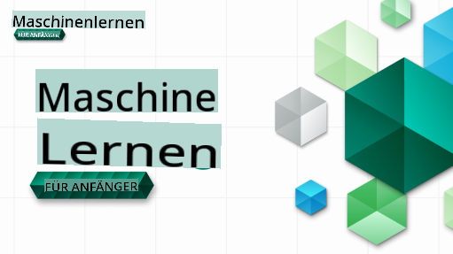

# Maschinelles Lernen für Anfänger - Ein Lehrplan

> 🌍 Reisen Sie um die Welt, während wir das maschinelle Lernen durch die Kulturen der Welt erkunden 🌍

Die Cloud-Advocates von Microsoft freuen sich, einen 12-wöchigen Lehrplan mit 26 Lektionen rund um **maschinelles Lernen** anzubieten. In diesem Lehrplan lernen Sie, was manchmal als **klassisches maschinelles Lernen** bezeichnet wird, wobei hauptsächlich Scikit-learn als Bibliothek verwendet wird und tiefes Lernen vermieden wird, das in unserem [AI for Beginners-Lehrplan](https://aka.ms/ai4beginners) behandelt wird. Kombinieren Sie diese Lektionen auch mit unserem ['Data Science for Beginners'-Lehrplan](https://aka.ms/ds4beginners)!

Reisen Sie mit uns um die Welt, während wir diese klassischen Techniken auf Daten aus vielen Bereichen der Welt anwenden. Jede Lektion umfasst Vor- und Nachtests, schriftliche Anweisungen zur Durchführung der Lektion, eine Lösung, eine Aufgabe und mehr. Unser projektbasierter Lehransatz ermöglicht es Ihnen, beim Bauen zu lernen, was eine bewährte Methode ist, damit neue Fähigkeiten 'haften bleiben'.

**✍️ Herzlichen Dank an unsere Autoren** Jen Looper, Stephen Howell, Francesca Lazzeri, Tomomi Imura, Cassie Breviu, Dmitry Soshnikov, Chris Noring, Anirban Mukherjee, Ornella Altunyan, Ruth Yakubu und Amy Boyd

**🎨 Auch ein Dankeschön an unsere Illustratoren** Tomomi Imura, Dasani Madipalli und Jen Looper

**🙏 Ein besonderer Dank 🙏 an unsere Microsoft Student Ambassador-Autoren, Prüfer und Inhaltsbeiträger**, insbesondere Rishit Dagli, Muhammad Sakib Khan Inan, Rohan Raj, Alexandru Petrescu, Abhishek Jaiswal, Nawrin Tabassum, Ioan Samuila und Snigdha Agarwal

**🤩 Zusätzlicher Dank an die Microsoft Student Ambassadors Eric Wanjau, Jasleen Sondhi und Vidushi Gupta für unsere R-Lektionen!**

# Erste Schritte

Befolgen Sie diese Schritte:
1. **Forken Sie das Repository**: Klicken Sie auf die Schaltfläche "Fork" in der oberen rechten Ecke dieser Seite.
2. **Klonen Sie das Repository**: `git clone https://github.com/microsoft/ML-For-Beginners.git`

> [finden Sie alle zusätzlichen Ressourcen für diesen Kurs in unserer Microsoft Learn-Sammlung](https://learn.microsoft.com/en-us/collections/qrqzamz1nn2wx3?WT.mc_id=academic-77952-bethanycheum)

**[Studierende](https://aka.ms/student-page)**, um diesen Lehrplan zu nutzen, forken Sie das gesamte Repository in Ihr eigenes GitHub-Konto und bearbeiten Sie die Übungen selbst oder in einer Gruppe:

- Beginnen Sie mit einem Quiz vor der Vorlesung.
- Lesen Sie die Vorlesung und führen Sie die Aktivitäten durch, indem Sie an jedem Wissenscheck pausieren und reflektieren.
- Versuchen Sie, die Projekte zu erstellen, indem Sie die Lektionen verstehen, anstatt den Lösungscode auszuführen; dieser Code ist jedoch in den `/solution`-Ordnern in jeder projektorientierten Lektion verfügbar.
- Machen Sie das Quiz nach der Vorlesung.
- Schließen Sie die Herausforderung ab.
- Machen Sie die Aufgabe.
- Nach Abschluss einer Lektion besuchen Sie das [Diskussionsforum](https://github.com/microsoft/ML-For-Beginners/discussions) und "lernen laut", indem Sie die entsprechende PAT-Rubrik ausfüllen. Ein 'PAT' ist ein Progress Assessment Tool, das eine Rubrik ist, die Sie ausfüllen, um Ihr Lernen voranzutreiben. Sie können auch auf andere PATs reagieren, damit wir gemeinsam lernen können.

> Für weiterführende Studien empfehlen wir, diese [Microsoft Learn](https://docs.microsoft.com/en-us/users/jenlooper-2911/collections/k7o7tg1gp306q4?WT.mc_id=academic-77952-leestott) Module und Lernpfade zu verfolgen.

**Lehrkräfte**, wir haben [einige Vorschläge](for-teachers.md) beigefügt, wie Sie diesen Lehrplan nutzen können.

---

## Videoanleitungen

Einige der Lektionen sind als Kurzvideos verfügbar. Sie finden all diese inline in den Lektionen oder auf der [ML for Beginners-Playlist auf dem Microsoft Developer YouTube-Kanal](https://aka.ms/ml-beginners-videos), indem Sie auf das Bild unten klicken.

---

## Lernen Sie das Team kennen

**Gif von** [Mohit Jaisal](https://linkedin.com/in/mohitjaisal)

> 🎥 Klicken Sie auf das Bild oben für ein Video über das Projekt und die Leute, die es erstellt haben!

---

## Lehransatz

Wir haben zwei pädagogische Grundsätze gewählt, während wir diesen Lehrplan erstellt haben: sicherzustellen, dass er praktisch **projektbasiert** ist und dass er **häufige Quizze** enthält. Darüber hinaus hat dieser Lehrplan ein gemeinsames **Thema**, um ihm Kohärenz zu verleihen.

Indem wir sicherstellen, dass der Inhalt mit Projekten übereinstimmt, wird der Prozess für die Studierenden ansprechender und das Behalten der Konzepte wird verbessert. Darüber hinaus setzt ein Quiz mit niedrigem Einsatz vor einer Klasse die Absicht des Schülers, ein Thema zu lernen, während ein zweites Quiz nach der Klasse weiteres Behalten sichert. Dieser Lehrplan wurde so gestaltet, dass er flexibel und unterhaltsam ist und ganz oder teilweise durchgeführt werden kann. Die Projekte beginnen klein und werden bis zum Ende des 12-wöchigen Zyklus zunehmend komplexer. Dieser Lehrplan enthält auch einen Nachsatz zu realen Anwendungen von ML, der als Zusatzpunkt oder als Grundlage für Diskussionen verwendet werden kann.

> Finden Sie unsere [Verhaltensrichtlinien](CODE_OF_CONDUCT.md), [Beitragsrichtlinien](CONTRIBUTING.md) und [Übersetzungsrichtlinien](TRANSLATIONS.md). Wir freuen uns über Ihr konstruktives Feedback!

## Jede Lektion umfasst

- optionale Sketchnote
- optionale ergänzende Videos
- Videoanleitung (nur einige Lektionen)
- Quiz zur Aufwärmung vor der Vorlesung
- schriftliche Lektion
- für projektbasierte Lektionen Schritt-für-Schritt-Anleitungen zum Erstellen des Projekts
- Wissensüberprüfungen
- eine Herausforderung
- ergänzende Lektüre
- Aufgabe
- Quiz nach der Vorlesung

> **Eine Anmerkung zu den Sprachen**: Diese Lektionen sind hauptsächlich in Python geschrieben, viele sind jedoch auch in R verfügbar. Um eine R-Lektion abzuschließen, gehen Sie in den `/solution`-Ordner und suchen Sie nach R-Lektionen. Diese enthalten eine .rmd-Erweiterung, die eine **R Markdown**-Datei darstellt, die einfach als Einbettung von `code chunks` (von R oder anderen Sprachen) und einem `YAML header` (der beschreibt, wie Ausgaben wie PDF formatiert werden) in einem `Markdown document` definiert werden kann. So dient es als beispielhaftes Autorengerüst für Data Science, da es Ihnen ermöglicht, Ihren Code, dessen Ausgabe und Ihre Gedanken zu kombinieren, indem Sie sie in Markdown aufschreiben. Darüber hinaus können R Markdown-Dokumente in Ausgabeformate wie PDF, HTML oder Word gerendert werden.

> **Eine Anmerkung zu den Quizzen**: Alle Quizze befinden sich im [Quiz-App-Ordner](../../quiz-app), insgesamt 52 Quizze mit jeweils drei Fragen. Sie sind innerhalb der Lektionen verlinkt, aber die Quiz-App kann lokal ausgeführt werden; folgen Sie den Anweisungen im `quiz-app`-Ordner, um lokal zu hosten oder in Azure bereitzustellen.

| Lektion Nummer |                             Thema                              |                   Lektion Gruppierung                   | Lernziele                                                                                                             |                                                              Verknüpfte Lektion                                                               |                        Autor                        |
| :-----------: | :------------------------------------------------------------: | :-------------------------------------------------: | ------------------------------------------------------------------------------------------------------------------------------- | :--------------------------------------------------------------------------------------------------------------------------------------: | :--------------------------------------------------: |
|      01       |                Einführung in das maschinelle Lernen                |      [Einführung](1-Introduction/README.md)       | Lernen Sie die grundlegenden Konzepte des maschinellen Lernens                                                                                |                                             [Lektion](1-Introduction/1-intro-to-ML/README.md)                                             |                       Muhammad                       |
|      02       |                Die Geschichte des maschinellen Lernens                 |      [Einführung](1-Introduction/README.md)       | Lernen Sie die Geschichte, die diesem Bereich zugrunde liegt                                                                                         |                                            [Lektion](1-Introduction/2-history-of-ML/README.md)                                            |                     Jen und Amy                      |
|      03       |                 Fairness und maschinelles Lernen                  |      [Einführung](1-Introduction/README.md)       | Welche wichtigen philosophischen Fragen zur Fairness sollten die Studierenden berücksichtigen, wenn sie ML-Modelle erstellen und anwenden? |                                              [Lektion](1-Introduction/3-fairness/README.md)                                               |                        Tomomi                        |
|      04       |                Techniken des maschinellen Lernens                 |      [Einführung](1-Introduction/README.md)       | Welche Techniken nutzen ML-Forscher, um ML-Modelle zu erstellen?                                                                       |                                          [Lektion](1-Introduction/4-techniques-of-ML/README.md)                                           |                    Chris und Jen                     |
|      05       |                   Einführung in die Regression                   |        [Regression](2-Regression/README.md)         | Einstieg in Python und Scikit-learn für Regressionsmodelle                                                                  |         <ul><li>[Python](2-Regression/1-Tools/README.md)</li><li>[R](../../2-Regression/1-Tools/solution/R/lesson_1.html)</li></ul>         |      <ul><li>Jen</li><li>Eric Wanjau</li></ul>       |
|      06       |                Nordamerikanische Kürbispreise 🎃                |        [Regression](2-Regression/README.md)         | Daten visualisieren und bereinigen zur Vorbereitung auf ML                                                                                  |          <ul><li>[Python](2-Regression/2-Data/README.md)</li><li>[R](../../2-Regression/2-Data/solution/R/lesson_2.html)</li></ul>          |      <ul><li>Jen</li><li>Eric Wanjau</li></ul>       |
|      07       |                Nordamerikanische Kürbispreise 🎃                |        [Regression](2-Regression/README.md)         | Lineare und polynomiale Regressionsmodelle erstellen                                                                                   |        <ul><li>[Python](2-Regression/3-Linear/README.md)</li><li>[R](../../2-Regression/3-Linear/solution/R/lesson_3.html)</li></ul>        |      <ul><li>Jen und Dmitry</li><li>Eric Wanjau</li></ul>       |
|      08       |                Nordamerikanische Kürbispreise 🎃                |        [Regression](2-Regression/README.md)         | Ein logistisches Regressionsmodell erstellen                                                                                               |     <ul><li>[Python](2-Regression/4-Logistic/README.md) </li><li>[R](../../2-Regression/4-Logistic/solution/R/lesson_4.html)</li></ul>      |      <ul><li>Jen</li><li>Eric Wanjau</li></ul>       |
|      09       |                          Eine Webanwendung 🔌                          |           [Webanwendung](3-Web-App/README.md)            | Erstellen Sie eine Webanwendung, um Ihr trainiertes Modell zu verwenden                                                                                       |                                                 [Python](3-Web-App/1-Web-App/README.md)                                                  |                         Jen                          |
|      10       |                 Einführung in die Klassifikation                 |    [Klassifikation](4-Classification/README.md)     | Bereinigen, vorbereiten und visualisieren Sie Ihre Daten; Einführung in die Klassifikation                                                            | <ul><li> [Python](4-Classification/1-Introduction/README.md) </li><li>[R](../../4-Classification/1-Introduction/solution/R/lesson_10.html)  | <ul><li>Jen und Cassie</li><li>Eric Wanjau</li></ul> |
|      11       |             Köstliche asiatische und indische Küchen 🍜             |    [Klassifikation](4-Classification/README.md)     | Einführung in Klassifizierer                                                                                                     | <ul><li> [Python](4-Classification/2-Classifiers-1/README.md)</li><li>[R](../../4-Classification/2-Classifiers-1/solution/R/lesson_11.html) | <ul><li>Jen und Cassie</li><li>Eric Wanjau</li></ul> |
|      12       |             Köstliche asiatische und indische Küchen 🍜             |    [Klassifikation](4-Classification/README.md)     | Weitere Klassifizierer                                                                                                                | <ul><li> [Python](4-Classification/3-Classifiers-2/README.md)</li><li>[R](../../4-Classification/3-Classifiers-2/solution/R/lesson_12.html) | <ul><li>Jen und Cassie</li><li>Eric Wanjau</li></ul> |
|      13       |             Köstliche asiatische und indische Küchen 🍜             |    [Klassifikation](4-Classification/README.md)     | Erstellen Sie eine Empfehlungs-Webanwendung mit Ihrem Modell                                                                                    |                                              [Python](4-Classification/4-Applied/README.md)                                              |                         Jen                          |
|      14       |                   Einführung in das Clustering                   |        [Clustering](5-Clustering/README.md)         | Bereinigen, vorbereiten und visualisieren Sie Ihre Daten; Einführung in das Clustering                                                                |         <ul><li> [Python](5-Clustering/1-Visualize/README.md)</li><li>[R](../../5-Clustering/1-Visualize/solution/R/lesson_14.html)         |      <ul><li>Jen</li><li>Eric Wanjau</li></ul>       |
|      15       |              Erkundung der nigerianischen Musikkultur 🎧              |        [Clustering](5-Clustering/README.md)         | Entdecken Sie die K-Means-Clustering-Methode                                                                                           |           <ul><li> [Python](5-Clustering/2-K-Means/README.md)</li><li>[R](../../5-Clustering/2-K-Means/solution/R/lesson_15.html)           |      <ul><li>Jen</li><li>Eric Wanjau</li></ul>       |
|      16       |        Einführung in die Verarbeitung natürlicher Sprache ☕️         |   [Verarbeitung natürlicher Sprache](6-NLP/README.md)    | Lernen Sie die Grundlagen der NLP, indem Sie einen einfachen Bot erstellen                                                                             |                                             [Python](6-NLP/1-Introduction-to-NLP/README.md)                                              |                       Stephen                        |
|      17       |                      Häufige NLP-Aufgaben ☕️                      |   [Verarbeitung natürlicher Sprache](6-NLP/README.md)    | Vertiefen Sie Ihr Wissen über NLP, indem Sie häufige Aufgaben verstehen, die beim Umgang mit Sprachstrukturen erforderlich sind                          |                                                    [Python](6-NLP/2-Tasks/README.md)                                                     |                       Stephen                        |
|      18       |             Übersetzung und Sentimentanalyse ♥️              |   [Verarbeitung natürlicher Sprache](6-NLP/README.md)    | Übersetzung und Sentimentanalyse mit Jane Austen                                                                             |                                            [Python](6-NLP/3-Translation-Sentiment/README.md)                                             |                       Stephen                        |
|      19       |                  Romantische Hotels in Europa ♥️                  |   [Verarbeitung natürlicher Sprache](6-NLP/README.md)    | Sentimentanalyse mit Hotelbewertungen 1                                                                                         |                                               [Python](6-NLP/4-Hotel-Reviews-1/README.md)                                                |                       Stephen                        |
|      20       |                  Romantische Hotels in Europa ♥️                  |   [Verarbeitung natürlicher Sprache](6-NLP/README.md)    | Sentimentanalyse mit Hotelbewertungen 2                                                                                         |                                               [Python](6-NLP/5-Hotel-Reviews-2/README.md)                                                |                       Stephen                        |
|      21       |            Einführung in die Zeitreihenprognose             |        [Zeitreihe](7-TimeSeries/README.md)        | Einführung in die Zeitreihenprognose                                                                                         |                                             [Python](7-TimeSeries/1-Introduction/README.md)                                              |                      Francesca                       |
|      22       | ⚡️ Weltstromverbrauch ⚡️ - Zeitreihenprognose mit ARIMA |        [Zeitreihe](7-TimeSeries/README.md)        | Zeitreihenprognose mit ARIMA                                                                                              |                                                 [Python](7-TimeSeries/2-ARIMA/README.md)                                                 |                      Francesca                       |
|      23       |  ⚡️ Weltstromverbrauch ⚡️ - Zeitreihenprognose mit SVR  |        [Zeitreihe](7-TimeSeries/README.md)        | Zeitreihenprognose mit Support Vector Regressor                                                                           |                                                  [Python](7-TimeSeries/3-SVR/README.md)                                                  |                       Anirban                        |
|      24       |             Einführung in das Verstärkendes Lernen             | [Verstärkendes Lernen](8-Reinforcement/README.md) | Einführung in das Verstärkende Lernen mit Q-Learning                                                                          |                                             [Python](8-Reinforcement/1-QLearning/README.md)                                              |                        Dmitry                        |
|      25       |                 Helfen Sie Peter, den Wolf zu vermeiden! 🐺                  | [Verstärkendes Lernen](8-Reinforcement/README.md) | Verstärkendes Lernen im Gym                                                                                                      |                                                [Python](8-Reinforcement/2-Gym/README.md)                                                 |                        Dmitry                        |
|  Nachsatz   |            Anwendungsfälle und Szenarien für ML in der realen Welt            |      [ML in der Wildnis](9-Real-World/README.md)       | Interessante und aufschlussreiche Anwendungen klassischer ML                                                               |                                             [Lektionen](9-Real-World/1-Applications/README.md)                                              |                         Team                         |
|  Nachsatz   |            Modell-Debugging in ML mit dem RAI-Dashboard          |      [ML in der Wildnis](9-Real-World/README.md)       | Modell-Debugging im maschinellen Lernen unter Verwendung von Komponenten des Responsible AI Dashboards                                                              |                                             [Lektionen](9-Real-World/2-Debugging-ML-Models/README.md)                                              |                         Ruth Yakubu                       |

> [finden Sie alle zusätzlichen Ressourcen für diesen Kurs in unserer Microsoft Learn Sammlung](https://learn.microsoft.com/en-us/collections/qrqzamz1nn2wx3?WT.mc_id=academic-77952-bethanycheum)

## Offline-Zugriff

Sie können diese Dokumentation offline ausführen, indem Sie [Docsify](https://docsify.js.org/#/) verwenden. Forken Sie dieses Repository, [installieren Sie Docsify](https://docsify.js.org/#/quickstart) auf Ihrem lokalen Rechner und geben Sie dann im Stammverzeichnis dieses Repositories `docsify serve` ein. Die Website wird auf Port 3000 auf Ihrem localhost bereitgestellt: `localhost:3000`.

## PDFs
Finden Sie ein PDF des Lehrplans mit Links [hier](https://microsoft.github.io/ML-For-Beginners/pdf/readme.pdf).

## Hilfe Gewünscht

Möchten Sie eine Übersetzung beitragen? Bitte lesen Sie unsere [Übersicht der Übersetzungsrichtlinien](TRANSLATIONS.md) und fügen Sie ein standardisiertes Problem hinzu, um die Arbeitslast zu verwalten [hier](https://github.com/microsoft/ML-For-Beginners/issues).

## Weitere Lehrpläne

Unser Team erstellt weitere Lehrpläne! Schauen Sie sich an:

- [AI für Anfänger](https://aka.ms/ai4beginners)
- [Datenwissenschaft für Anfänger](https://aka.ms/datascience-beginners)
- [**Neue Version 2.0** - Generative KI für Anfänger](https://aka.ms/genai-beginners)
- [**NEU** Cybersicherheit für Anfänger](https://github.com/microsoft/Security-101??WT.mc_id=academic-96948-sayoung)
- [Webentwicklung für Anfänger](https://aka.ms/webdev-beginners)
- [IoT für Anfänger](https://aka.ms/iot-beginners)
- [Maschinelles Lernen für Anfänger](https://aka.ms/ml4beginners)
- [XR-Entwicklung für Anfänger](https://aka.ms/xr-dev-for-beginners)
- [GitHub Copilot für KI-Paarprogrammierung meistern](https://aka.ms/GitHubCopilotAI)

**Haftungsausschluss**:  
Dieses Dokument wurde mit maschinellen KI-Übersetzungsdiensten übersetzt. Obwohl wir uns um Genauigkeit bemühen, beachten Sie bitte, dass automatisierte Übersetzungen Fehler oder Ungenauigkeiten enthalten können. Das Originaldokument in seiner ursprünglichen Sprache sollte als autoritative Quelle betrachtet werden. Für kritische Informationen wird eine professionelle menschliche Übersetzung empfohlen. Wir übernehmen keine Haftung für Missverständnisse oder Fehlinterpretationen, die aus der Verwendung dieser Übersetzung resultieren.