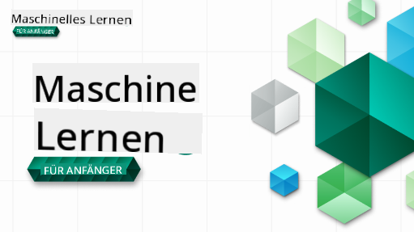

<!--
CO_OP_TRANSLATOR_METADATA:
{
  "original_hash": "4f0e1f1641aa1659ed5c8debc6f2e0b2",
  "translation_date": "2025-09-23T08:51:47+00:00",
  "source_file": "README.md",
  "language_code": "de"
}
-->

### 🌐 Mehrsprachige Unterstützung

#### Unterstützt durch GitHub Action (Automatisiert & Immer aktuell)

[Französisch](../fr/README.md) | [Spanisch](../es/README.md) | [Deutsch](./README.md) | [Russisch](../ru/README.md) | [Arabisch](../ar/README.md) | [Persisch (Farsi)](../fa/README.md) | [Urdu](../ur/README.md) | [Chinesisch (Vereinfacht)](../zh/README.md) | [Chinesisch (Traditionell, Macau)](../mo/README.md) | [Chinesisch (Traditionell, Hongkong)](../hk/README.md) | [Chinesisch (Traditionell, Taiwan)](../tw/README.md) | [Japanisch](../ja/README.md) | [Koreanisch](../ko/README.md) | [Hindi](../hi/README.md) | [Bengalisch](../bn/README.md) | [Marathi](../mr/README.md) | [Nepalesisch](../ne/README.md) | [Punjabi (Gurmukhi)](../pa/README.md) | [Portugiesisch (Portugal)](../pt/README.md) | [Portugiesisch (Brasilien)](../br/README.md) | [Italienisch](../it/README.md) | [Polnisch](../pl/README.md) | [Türkisch](../tr/README.md) | [Griechisch](../el/README.md) | [Thailändisch](../th/README.md) | [Schwedisch](../sv/README.md) | [Dänisch](../da/README.md) | [Norwegisch](../no/README.md) | [Finnisch](../fi/README.md) | [Niederländisch](../nl/README.md) | [Hebräisch](../he/README.md) | [Vietnamesisch](../vi/README.md) | [Indonesisch](../id/README.md) | [Malaiisch](../ms/README.md) | [Tagalog (Filipino)](../tl/README.md) | [Swahili](../sw/README.md) | [Ungarisch](../hu/README.md) | [Tschechisch](../cs/README.md) | [Slowakisch](../sk/README.md) | [Rumänisch](../ro/README.md) | [Bulgarisch](../bg/README.md) | [Serbisch (Kyrillisch)](../sr/README.md) | [Kroatisch](../hr/README.md) | [Slowenisch](../sl/README.md) | [Ukrainisch](../uk/README.md) | [Birmanisch (Myanmar)](../my/README.md)

 #### Trete unserer Community bei

Wir haben eine laufende Discord-Serie "Lernen mit KI". Erfahre mehr und schließe dich uns an bei der [Learn with AI Series](https://aka.ms/learnwithai/discord) vom 18. bis 30. September 2025. Du erhältst Tipps und Tricks zur Nutzung von GitHub Copilot für Data Science.

# Maschinelles Lernen für Anfänger – Ein Lehrplan

> 🌍 Reise um die Welt, während wir maschinelles Lernen durch die Kulturen der Welt erkunden 🌍

Die Cloud Advocates bei Microsoft freuen sich, einen 12-wöchigen, 26-teiligen Lehrplan rund um **Maschinelles Lernen** anzubieten. In diesem Lehrplan lernst du, was manchmal als **klassisches maschinelles Lernen** bezeichnet wird, wobei hauptsächlich Scikit-learn als Bibliothek verwendet wird und Deep Learning vermieden wird, das in unserem [AI for Beginners-Lehrplan](https://aka.ms/ai4beginners) behandelt wird. Kombiniere diese Lektionen auch mit unserem ['Data Science for Beginners'-Lehrplan](https://aka.ms/ds4beginners)!

Reise mit uns um die Welt, während wir diese klassischen Techniken auf Daten aus verschiedenen Regionen der Welt anwenden. Jede Lektion enthält Quizfragen vor und nach der Lektion, schriftliche Anleitungen zur Durchführung der Lektion, eine Lösung, eine Aufgabe und mehr. Unsere projektbasierte Pädagogik ermöglicht es dir, durch das Bauen zu lernen – eine bewährte Methode, um neue Fähigkeiten zu festigen.

**✍️ Herzlichen Dank an unsere Autoren** Jen Looper, Stephen Howell, Francesca Lazzeri, Tomomi Imura, Cassie Breviu, Dmitry Soshnikov, Chris Noring, Anirban Mukherjee, Ornella Altunyan, Ruth Yakubu und Amy Boyd

**🎨 Vielen Dank auch an unsere Illustratoren** Tomomi Imura, Dasani Madipalli und Jen Looper

**🙏 Besonderer Dank 🙏 an unsere Microsoft Student Ambassador Autoren, Reviewer und Inhaltsbeitragenden**, insbesondere Rishit Dagli, Muhammad Sakib Khan Inan, Rohan Raj, Alexandru Petrescu, Abhishek Jaiswal, Nawrin Tabassum, Ioan Samuila und Snigdha Agarwal

**🤩 Extra Dank an die Microsoft Student Ambassadors Eric Wanjau, Jasleen Sondhi und Vidushi Gupta für unsere R-Lektionen!**

# Erste Schritte

Folge diesen Schritten:
1. **Forke das Repository**: Klicke auf die Schaltfläche "Fork" oben rechts auf dieser Seite.
2. **Klonen des Repositorys**:   `git clone https://github.com/microsoft/ML-For-Beginners.git`

> [Finde alle zusätzlichen Ressourcen für diesen Kurs in unserer Microsoft Learn-Sammlung](https://learn.microsoft.com/en-us/collections/qrqzamz1nn2wx3?WT.mc_id=academic-77952-bethanycheum)

**[Studierende](https://aka.ms/student-page)**, um diesen Lehrplan zu nutzen, forke das gesamte Repository in dein eigenes GitHub-Konto und bearbeite die Übungen alleine oder in einer Gruppe:

- Beginne mit einem Quiz vor der Vorlesung.
- Lies die Vorlesung und bearbeite die Aktivitäten, halte an und reflektiere bei jedem Wissenscheck.
- Versuche, die Projekte zu erstellen, indem du die Lektionen verstehst, anstatt den Lösungscode auszuführen; dieser Code ist jedoch in den `/solution`-Ordnern jeder projektorientierten Lektion verfügbar.
- Mache das Quiz nach der Vorlesung.
- Bearbeite die Herausforderung.
- Bearbeite die Aufgabe.
- Nach Abschluss einer Lektionengruppe besuche das [Diskussionsforum](https://github.com/microsoft/ML-For-Beginners/discussions) und "lerne laut", indem du das entsprechende PAT-Raster ausfüllst. Ein 'PAT' ist ein Fortschrittsbewertungstool, das du ausfüllst, um dein Lernen zu vertiefen. Du kannst auch auf andere PATs reagieren, damit wir gemeinsam lernen können.

> Für weiterführendes Lernen empfehlen wir, diesen [Microsoft Learn](https://docs.microsoft.com/en-us/users/jenlooper-2911/collections/k7o7tg1gp306q4?WT.mc_id=academic-77952-leestott)-Modulen und Lernpfaden zu folgen.

**Lehrkräfte**, wir haben [einige Vorschläge](for-teachers.md) beigefügt, wie dieser Lehrplan genutzt werden kann.

---

## Videoanleitungen

Einige der Lektionen sind als kurze Videos verfügbar. Du findest alle diese Videos in den Lektionen oder in der [ML for Beginners-Playlist auf dem Microsoft Developer YouTube-Kanal](https://aka.ms/ml-beginners-videos), indem du auf das Bild unten klickst.

---

## Lerne das Team kennen

**Gif von** [Mohit Jaisal](https://linkedin.com/in/mohitjaisal)

> 🎥 Klicke auf das Bild oben, um ein Video über das Projekt und die Personen dahinter zu sehen!

---

## Pädagogik

Wir haben zwei pädagogische Prinzipien gewählt, während wir diesen Lehrplan erstellt haben: sicherzustellen, dass er praxisorientiert **projektbasiert** ist und dass er **häufige Quizfragen** enthält. Darüber hinaus hat dieser Lehrplan ein gemeinsames **Thema**, um ihm Kohärenz zu verleihen.

Indem wir sicherstellen, dass die Inhalte mit Projekten übereinstimmen, wird der Prozess für die Studierenden ansprechender und das Behalten der Konzepte wird verbessert. Ein Quiz mit geringem Druck vor einer Klasse setzt die Absicht der Studierenden, ein Thema zu lernen, während ein zweites Quiz nach der Klasse das Behalten weiter fördert. Dieser Lehrplan wurde so gestaltet, dass er flexibel und unterhaltsam ist und ganz oder teilweise genutzt werden kann. Die Projekte beginnen klein und werden im Laufe des 12-wöchigen Zyklus zunehmend komplexer. Dieser Lehrplan enthält auch einen Nachtrag zu realen Anwendungen des maschinellen Lernens, der als Zusatzaufgabe oder als Grundlage für Diskussionen genutzt werden kann.

> Finde unseren [Verhaltenskodex](CODE_OF_CONDUCT.md), [Beitragsrichtlinien](CONTRIBUTING.md) und [Übersetzungsrichtlinien](TRANSLATIONS.md). Wir freuen uns über dein konstruktives Feedback!

## Jede Lektion enthält

- optionales Sketchnote
- optionales ergänzendes Video
- Videoanleitung (nur einige Lektionen)
- [Quiz zur Aufwärmung vor der Vorlesung](https://ff-quizzes.netlify.app/en/ml/)
- schriftliche Lektion
- für projektbasierte Lektionen, Schritt-für-Schritt-Anleitungen zum Erstellen des Projekts
- Wissensüberprüfungen
- eine Herausforderung
- ergänzende Lektüre
- Aufgabe
- [Quiz nach der Vorlesung](https://ff-quizzes.netlify.app/en/ml/)

> **Hinweis zu den Sprachen**: Diese Lektionen sind hauptsächlich in Python geschrieben, viele sind jedoch auch in R verfügbar. Um eine R-Lektion abzuschließen, gehe in den `/solution`-Ordner und suche nach R-Lektionen. Sie enthalten eine .rmd-Erweiterung, die eine **R Markdown**-Datei darstellt, die einfach als Einbettung von `Codeblöcken` (in R oder anderen Sprachen) und einem `YAML-Header` (der angibt, wie Ausgaben wie PDF formatiert werden sollen) in einem `Markdown-Dokument` definiert werden kann. Als solches dient es als beispielhaftes Autorierungsframework für Data Science, da es dir ermöglicht, deinen Code, dessen Ausgabe und deine Gedanken zu kombinieren, indem du sie in Markdown aufschreibst. Darüber hinaus können R Markdown-Dokumente in Ausgabeformate wie PDF, HTML oder Word gerendert werden.

> **Hinweis zu den Quizfragen**: Alle Quizfragen befinden sich im [Quiz App-Ordner](../../quiz-app), insgesamt 52 Quizfragen mit jeweils drei Fragen. Sie sind in den Lektionen verlinkt, aber die Quiz-App kann lokal ausgeführt werden; folge den Anweisungen im `quiz-app`-Ordner, um sie lokal zu hosten oder in Azure bereitzustellen.

| Lektion Nummer |                             Thema                              |                   Lektionengruppe                   | Lernziele                                                                                                                       |                                                              Verlinkte Lektion                                                               |                        Autor                        |
| :-----------: | :------------------------------------------------------------: | :-------------------------------------------------: | ------------------------------------------------------------------------------------------------------------------------------- | :------------------------------------------------------------------------------------------------------------------------------------------: | :--------------------------------------------------: |
|      01       |                Einführung in maschinelles Lernen                |      [Einführung](1-Introduction/README.md)         | Lerne die grundlegenden Konzepte hinter maschinellem Lernen                                                                     |                                             [Lektion](1-Introduction/1-intro-to-ML/README.md)                                               |                       Muhammad                       |
|      02       |                Die Geschichte des maschinellen Lernens          |      [Einführung](1-Introduction/README.md)         | Lerne die Geschichte hinter diesem Bereich                                                                                      |                                            [Lektion](1-Introduction/2-history-of-ML/README.md)                                              |                     Jen und Amy                      |
|      03       |                 Fairness und maschinelles Lernen               |      [Einführung](1-Introduction/README.md)         | Welche wichtigen philosophischen Fragen zur Fairness sollten Studierende berücksichtigen, wenn sie ML-Modelle entwickeln und anwenden? |                                              [Lektion](1-Introduction/3-fairness/README.md)                                               |                        Tomomi                        |
|      04       |                Techniken für maschinelles Lernen               |      [Einführung](1-Introduction/README.md)         | Welche Techniken verwenden ML-Forscher, um ML-Modelle zu erstellen?                                                             |                                          [Lektion](1-Introduction/4-techniques-of-ML/README.md)                                           |                    Chris und Jen                     |
|      05       |                   Einführung in Regression                     |        [Regression](2-Regression/README.md)         | Einstieg in Python und Scikit-learn für Regressionsmodelle                                                                      |         [Python](2-Regression/1-Tools/README.md) • [R](../../2-Regression/1-Tools/solution/R/lesson_1.html)         |      Jen • Eric Wanjau       |
|      06       |                Nordamerikanische Kürbispreise 🎃               |        [Regression](2-Regression/README.md)         | Daten visualisieren und bereinigen zur Vorbereitung auf ML                                                                      |          [Python](2-Regression/2-Data/README.md) • [R](../../2-Regression/2-Data/solution/R/lesson_2.html)          |      Jen • Eric Wanjau       |
|      07       |                Nordamerikanische Kürbispreise 🎃               |        [Regression](2-Regression/README.md)         | Lineare und polynomiale Regressionsmodelle erstellen                                                                            |        [Python](2-Regression/3-Linear/README.md) • [R](../../2-Regression/3-Linear/solution/R/lesson_3.html)        |      Jen und Dmitry • Eric Wanjau       |
|      08       |                Nordamerikanische Kürbispreise 🎃               |        [Regression](2-Regression/README.md)         | Ein logistisches Regressionsmodell erstellen                                                                                    |     [Python](2-Regression/4-Logistic/README.md) • [R](../../2-Regression/4-Logistic/solution/R/lesson_4.html)      |      Jen • Eric Wanjau       |
|      09       |                          Eine Web-App 🔌                       |           [Web-App](3-Web-App/README.md)            | Eine Web-App erstellen, um das trainierte Modell zu nutzen                                                                      |                                                 [Python](3-Web-App/1-Web-App/README.md)                                                  |                         Jen                          |
|      10       |                 Einführung in Klassifikation                   |    [Klassifikation](4-Classification/README.md)     | Daten bereinigen, vorbereiten und visualisieren; Einführung in Klassifikation                                                  | [Python](4-Classification/1-Introduction/README.md) • [R](../../4-Classification/1-Introduction/solution/R/lesson_10.html)  | Jen und Cassie • Eric Wanjau |
|      11       |             Köstliche asiatische und indische Küche 🍜         |    [Klassifikation](4-Classification/README.md)     | Einführung in Klassifikatoren                                                                                                   | [Python](4-Classification/2-Classifiers-1/README.md) • [R](../../4-Classification/2-Classifiers-1/solution/R/lesson_11.html) | Jen und Cassie • Eric Wanjau |
|      12       |             Köstliche asiatische und indische Küche 🍜         |    [Klassifikation](4-Classification/README.md)     | Weitere Klassifikatoren                                                                                                         | [Python](4-Classification/3-Classifiers-2/README.md) • [R](../../4-Classification/3-Classifiers-2/solution/R/lesson_12.html) | Jen und Cassie • Eric Wanjau |
|      13       |             Köstliche asiatische und indische Küche 🍜         |    [Klassifikation](4-Classification/README.md)     | Eine Empfehlungs-Web-App mit deinem Modell erstellen                                                                           |                                              [Python](4-Classification/4-Applied/README.md)                                              |                         Jen                          |
|      14       |                   Einführung in Clustering                     |        [Clustering](5-Clustering/README.md)         | Daten bereinigen, vorbereiten und visualisieren; Einführung in Clustering                                                      |         [Python](5-Clustering/1-Visualize/README.md) • [R](../../5-Clustering/1-Visualize/solution/R/lesson_14.html)         |      Jen • Eric Wanjau       |
|      15       |              Erforschung nigerianischer Musikgeschmäcker 🎧    |        [Clustering](5-Clustering/README.md)         | Die K-Means-Clustering-Methode erkunden                                                                                        |           [Python](5-Clustering/2-K-Means/README.md) • [R](../../5-Clustering/2-K-Means/solution/R/lesson_15.html)           |      Jen • Eric Wanjau       |
|      16       |        Einführung in die Verarbeitung natürlicher Sprache ☕️  |   [Verarbeitung natürlicher Sprache](6-NLP/README.md) | Die Grundlagen der NLP lernen, indem ein einfacher Bot erstellt wird                                                           |                                             [Python](6-NLP/1-Introduction-to-NLP/README.md)                                              |                       Stephen                        |
|      17       |                      Häufige NLP-Aufgaben ☕️                  |   [Verarbeitung natürlicher Sprache](6-NLP/README.md) | Vertiefe dein Wissen über NLP, indem du häufige Aufgaben im Umgang mit Sprachstrukturen verstehst                              |                                                    [Python](6-NLP/2-Tasks/README.md)                                                     |                       Stephen                        |
|      18       |             Übersetzung und Sentiment-Analyse ♥️              |   [Verarbeitung natürlicher Sprache](6-NLP/README.md) | Übersetzung und Sentiment-Analyse mit Jane Austen                                                                              |                                            [Python](6-NLP/3-Translation-Sentiment/README.md)                                             |                       Stephen                        |
|      19       |                  Romantische Hotels in Europa ♥️              |   [Verarbeitung natürlicher Sprache](6-NLP/README.md) | Sentiment-Analyse mit Hotelbewertungen 1                                                                                       |                                               [Python](6-NLP/4-Hotel-Reviews-1/README.md)                                                |                       Stephen                        |
|      20       |                  Romantische Hotels in Europa ♥️              |   [Verarbeitung natürlicher Sprache](6-NLP/README.md) | Sentiment-Analyse mit Hotelbewertungen 2                                                                                       |                                               [Python](6-NLP/5-Hotel-Reviews-2/README.md)                                                |                       Stephen                        |
|      21       |            Einführung in Zeitreihenprognosen                  |        [Zeitreihen](7-TimeSeries/README.md)         | Einführung in Zeitreihenprognosen                                                                                              |                                             [Python](7-TimeSeries/1-Introduction/README.md)                                              |                      Francesca                       |
|      22       | ⚡️ Weltweiter Stromverbrauch ⚡️ - Zeitreihenprognosen mit ARIMA |        [Zeitreihen](7-TimeSeries/README.md)         | Zeitreihenprognosen mit ARIMA                                                                                                  |                                                 [Python](7-TimeSeries/2-ARIMA/README.md)                                                 |                      Francesca                       |
|      23       |  ⚡️ Weltweiter Stromverbrauch ⚡️ - Zeitreihenprognosen mit SVR  |        [Zeitreihen](7-TimeSeries/README.md)         | Zeitreihenprognosen mit Support Vector Regressor                                                                               |                                                  [Python](7-TimeSeries/3-SVR/README.md)                                                  |                       Anirban                        |
|      24       |             Einführung in Reinforcement Learning              | [Reinforcement Learning](8-Reinforcement/README.md) | Einführung in Reinforcement Learning mit Q-Learning                                                                           |                                             [Python](8-Reinforcement/1-QLearning/README.md)                                              |                        Dmitry                        |
|      25       |                 Hilf Peter, dem Wolf zu entkommen! 🐺          | [Reinforcement Learning](8-Reinforcement/README.md) | Reinforcement Learning Gym                                                                                                     |                                                [Python](8-Reinforcement/2-Gym/README.md)                                                 |                        Dmitry                        |
|  Postscript   |            ML-Szenarien und Anwendungen aus der Praxis         |      [ML in der Praxis](9-Real-World/README.md)     | Interessante und aufschlussreiche reale Anwendungen von klassischem ML                                                         |                                             [Lektion](9-Real-World/1-Applications/README.md)                                              |                         Team                         |
|  Postscript   |            Modell-Debugging in ML mit RAI-Dashboard           |      [ML in der Praxis](9-Real-World/README.md)     | Modell-Debugging in maschinellem Lernen mit Komponenten des Responsible AI Dashboards                                          |                                             [Lektion](9-Real-World/2-Debugging-ML-Models/README.md)                                              |                         Ruth Yakubu                       |

> [Finde alle zusätzlichen Ressourcen für diesen Kurs in unserer Microsoft Learn Sammlung](https://learn.microsoft.com/en-us/collections/qrqzamz1nn2wx3?WT.mc_id=academic-77952-bethanycheum)

## Offline-Zugriff

Du kannst diese Dokumentation offline nutzen, indem du [Docsify](https://docsify.js.org/#/) verwendest. Forke dieses Repository, [installiere Docsify](https://docsify.js.org/#/quickstart) auf deinem lokalen Rechner und gib dann im Root-Ordner dieses Repos `docsify serve` ein. Die Website wird auf Port 3000 auf deinem localhost bereitgestellt: `localhost:3000`.

## PDFs

Finde ein PDF des Curriculums mit Links [hier](https://microsoft.github.io/ML-For-Beginners/pdf/readme.pdf).

## 🎒 Weitere Kurse 

Unser Team erstellt weitere Kurse! Schau dir an:

- [Generative AI für Anfänger](https://aka.ms/genai-beginners)
- [Generative AI für Anfänger .NET](https://github.com/microsoft/Generative-AI-for-beginners-dotnet)
- [Generative AI mit JavaScript](https://github.com/microsoft/generative-ai-with-javascript)
- [Generative AI mit Java](https://github.com/microsoft/Generative-AI-for-beginners-java)
- [AI für Anfänger](https://aka.ms/ai-beginners)
- [Data Science für Anfänger](https://aka.ms/datascience-beginners)
- [ML für Anfänger](https://aka.ms/ml-beginners)
- [Cybersecurity für Anfänger](https://github.com/microsoft/Security-101) 
- [Webentwicklung für Anfänger](https://aka.ms/webdev-beginners)
- [IoT für Anfänger](https://aka.ms/iot-beginners)
- [XR-Entwicklung für Anfänger](https://github.com/microsoft/xr-development-for-beginners)
- [GitHub Copilot meistern für Pair-Programming](https://github.com/microsoft/Mastering-GitHub-Copilot-for-Paired-Programming)
- [GitHub Copilot meistern für C#/.NET-Entwickler](https://github.com/microsoft/mastering-github-copilot-for-dotnet-csharp-developers)
- [Wähle dein eigenes Copilot-Abenteuer](https://github.com/microsoft/CopilotAdventures)

---

