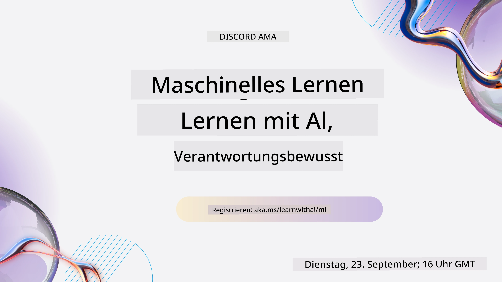
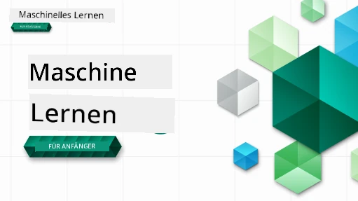

[](https://github.com/microsoft/ML-For-Beginners/blob/master/LICENSE)
[](https://GitHub.com/microsoft/ML-For-Beginners/graphs/contributors/)
[](https://GitHub.com/microsoft/ML-For-Beginners/issues/)
[](https://GitHub.com/microsoft/ML-For-Beginners/pulls/)
[](http://makeapullrequest.com)

[](https://GitHub.com/microsoft/ML-For-Beginners/watchers/)
[](https://GitHub.com/microsoft/ML-For-Beginners/network/)
[](https://GitHub.com/microsoft/ML-For-Beginners/stargazers/)

### 🌐 Mehrsprachige Unterstützung

#### Unterstützt über GitHub Action (Automatisiert & Immer Aktuell)

<!-- CO-OP TRANSLATOR LANGUAGES TABLE START -->
[Arabisch](../ar/README.md) | [Bengalisch](../bn/README.md) | [Bulgarisch](../bg/README.md) | [Birmanisch (Myanmar)](../my/README.md) | [Chinesisch (Vereinfacht)](../zh-CN/README.md) | [Chinesisch (Traditionell, Hongkong)](../zh-HK/README.md) | [Chinesisch (Traditionell, Macau)](../zh-MO/README.md) | [Chinesisch (Traditionell, Taiwan)](../zh-TW/README.md) | [Kroatisch](../hr/README.md) | [Tschechisch](../cs/README.md) | [Dänisch](../da/README.md) | [Niederländisch](../nl/README.md) | [Estnisch](../et/README.md) | [Finnisch](../fi/README.md) | [Französisch](../fr/README.md) | [Deutsch](./README.md) | [Griechisch](../el/README.md) | [Hebräisch](../he/README.md) | [Hindi](../hi/README.md) | [Ungarisch](../hu/README.md) | [Indonesisch](../id/README.md) | [Italienisch](../it/README.md) | [Japanisch](../ja/README.md) | [Kannada](../kn/README.md) | [Khmer](../km/README.md) | [Koreanisch](../ko/README.md) | [Litauisch](../lt/README.md) | [Malaiisch](../ms/README.md) | [Malayalam](../ml/README.md) | [Marathi](../mr/README.md) | [Nepalesisch](../ne/README.md) | [Nigerianisches Pidgin](../pcm/README.md) | [Norwegisch](../no/README.md) | [Persisch (Farsi)](../fa/README.md) | [Polnisch](../pl/README.md) | [Portugiesisch (Brasilien)](../pt-BR/README.md) | [Portugiesisch (Portugal)](../pt-PT/README.md) | [Punjabi (Gurmukhi)](../pa/README.md) | [Rumänisch](../ro/README.md) | [Russisch](../ru/README.md) | [Serbisch (Kyrillisch)](../sr/README.md) | [Slowakisch](../sk/README.md) | [Slowenisch](../sl/README.md) | [Spanisch](../es/README.md) | [Swahili](../sw/README.md) | [Schwedisch](../sv/README.md) | [Tagalog (Filipino)](../tl/README.md) | [Tamilisch](../ta/README.md) | [Telugu](../te/README.md) | [Thailändisch](../th/README.md) | [Türkisch](../tr/README.md) | [Ukrainisch](../uk/README.md) | [Urdu](../ur/README.md) | [Vietnamesisch](../vi/README.md)

> **Lieber lokal klonen?**
>
> Dieses Repository enthält über 50 Sprachübersetzungen, was die Downloadgröße erheblich erhöht. Um ohne Übersetzungen zu klonen, verwenden Sie Sparse Checkout:
>
> **Bash / macOS / Linux:**
> ```bash
> git clone --filter=blob:none --sparse https://github.com/microsoft/ML-For-Beginners.git
> cd ML-For-Beginners
> git sparse-checkout set --no-cone '/*' '!translations' '!translated_images'
> ```
>
> **CMD (Windows):**
> ```cmd
> git clone --filter=blob:none --sparse https://github.com/microsoft/ML-For-Beginners.git
> cd ML-For-Beginners
> git sparse-checkout set --no-cone "/*" "!translations" "!translated_images"
> ```
>
> Damit erhalten Sie alles, was Sie benötigen, um den Kurs abzuschließen, mit einem viel schnelleren Download.
<!-- CO-OP TRANSLATOR LANGUAGES TABLE END -->

#### Trete unserer Community bei

[](https://discord.gg/nTYy5BXMWG)

Wir haben eine Discord-Lernserie mit KI, erfahren Sie mehr und machen Sie mit bei der [Learn with AI Series](https://aka.ms/learnwithai/discord) vom 18. bis 30. September 2025. Sie erhalten Tipps und Tricks zur Nutzung von GitHub Copilot für Data Science.



# Maschinelles Lernen für Anfänger – Ein Lehrplan

> 🌍 Reisen Sie um die Welt, während wir maschinelles Lernen anhand von Weltkulturen erforschen 🌍

Die Cloud Advocates bei Microsoft freuen sich, einen 12-wöchigen Lehrplan mit 26 Lektionen rund um **Maschinelles Lernen** anzubieten. In diesem Lehrplan lernen Sie das, was manchmal als **klassisches maschinelles Lernen** bezeichnet wird, wobei hauptsächlich Scikit-learn als Bibliothek verwendet wird, während Deep Learning in unserem [AI for Beginners'-Lehrplan](https://aka.ms/ai4beginners) behandelt wird. Kombinieren Sie diese Lektionen auch mit unserem ['Data Science for Beginners'-Lehrplan](https://aka.ms/ds4beginners)!

Reisen Sie mit uns um die Welt, während wir diese klassischen Techniken auf Daten aus vielen Regionen anwenden. Jede Lektion enthält Vor- und Nachtests, schriftliche Anweisungen zur Durchführung, eine Lösung, eine Aufgabe und mehr. Unsere projektbasierte Pädagogik ermöglicht es Ihnen, beim Bauen zu lernen, eine bewährte Methode, um neue Fähigkeiten nachhaltig zu erwerben.

**✍️ Herzlichen Dank an unsere Autoren** Jen Looper, Stephen Howell, Francesca Lazzeri, Tomomi Imura, Cassie Breviu, Dmitry Soshnikov, Chris Noring, Anirban Mukherjee, Ornella Altunyan, Ruth Yakubu und Amy Boyd

**🎨 Ebenfalls Dank an unsere Illustratoren** Tomomi Imura, Dasani Madipalli und Jen Looper

**🙏 Besonderer Dank 🙏 an unsere Microsoft Student Ambassador Autoren, Reviewer und Inhaltsbeiträger**, insbesondere Rishit Dagli, Muhammad Sakib Khan Inan, Rohan Raj, Alexandru Petrescu, Abhishek Jaiswal, Nawrin Tabassum, Ioan Samuila und Snigdha Agarwal

**🤩 Extra Dank an Microsoft Student Ambassadors Eric Wanjau, Jasleen Sondhi und Vidushi Gupta für unsere R-Lektionen!**

# Erste Schritte

Folgen Sie diesen Schritten:
1. **Forken Sie das Repository**: Klicken Sie auf den "Fork"-Button oben rechts auf dieser Seite.
2. **Klonen Sie das Repository**:   `git clone https://github.com/microsoft/ML-For-Beginners.git`

> 💡 **Schnellstart-Tipp:** Möchten Sie direkt im Browser starten, ohne Python lokal einzurichten? Nutzen Sie [GitHub Codespaces](https://github.com/features/codespaces), um eine Cloud-Entwicklungsumgebung für Ihren Fork zu erstellen. Öffnen Sie das grüne **Code**-Menü, wählen Sie **Codespaces** und erstellen Sie einen Codespace; installieren Sie bei Bedarf die erforderlichen Abhängigkeiten jeder Lektion darin.

> [Alle zusätzlichen Ressourcen für diesen Kurs finden Sie in unserer Microsoft Learn-Sammlung](https://learn.microsoft.com/en-us/collections/qrqzamz1nn2wx3?WT.mc_id=academic-77952-bethanycheum)

> 🔧 **Brauchen Sie Hilfe?** Schauen Sie in unserem [Fehlerbehebungsleitfaden](TROUBLESHOOTING.md) nach Lösungen für häufige Probleme bei Installation, Einrichtung und Durchführung der Lektionen.


**[Schüler](https://aka.ms/student-page)**, um diesen Lehrplan zu nutzen, forken Sie das gesamte Repo in Ihr eigenes GitHub-Konto und bearbeiten Sie die Übungen alleine oder in der Gruppe:

- Beginnen Sie mit einem Vorlesungstest.
- Lesen Sie die Vorlesung und erledigen Sie die Aktivitäten, pausieren und reflektieren Sie bei jeder Wissensüberprüfung.
- Versuchen Sie, die Projekte durch Verständnis der Lektionen zu erstellen, anstatt den Lösungscode nur auszuführen; der Code ist jedoch in den `/solution`-Ordnern jeder projektorientierten Lektion verfügbar.
- Machen Sie den Nachvorlesungstest.
- Schließen Sie die Herausforderung ab.
- Erledigen Sie die Aufgabe.
- Nach Abschluss einer Lektionengruppe besuchen Sie das [Diskussionsforum](https://github.com/microsoft/ML-For-Beginners/discussions) und "lernen laut", indem Sie die entsprechende PAT-Rubrik ausfüllen. Ein 'PAT' ist ein Fortschrittsbewertungswerkzeug, eine Rubrik, die Sie ausfüllen, um Ihr Lernen zu vertiefen. Sie können auch auf andere PATs reagieren, damit wir gemeinsam lernen.

> Für weiterführendes Studium empfehlen wir diese [Microsoft Learn](https://docs.microsoft.com/en-us/users/jenlooper-2911/collections/k7o7tg1gp306q4?WT.mc_id=academic-77952-leestott) Module und Lernpfade.

**Lehrkräfte**, wir haben [einige Vorschläge](for-teachers.md) zur Nutzung dieses Lehrplans mit aufgenommen.

---

## Videoanleitungen

Einige der Lektionen sind als Kurzvideos verfügbar. Sie finden diese direkt in den Lektionen oder in der [ML for Beginners-Playlist auf dem Microsoft Developer YouTube-Kanal](https://aka.ms/ml-beginners-videos), indem Sie auf das Bild unten klicken.

[](https://aka.ms/ml-beginners-videos)

---

## Lernen Sie das Team kennen

[](https://youtu.be/Tj1XWrDSYJU)

**Gif von** [Mohit Jaisal](https://linkedin.com/in/mohitjaisal)

> 🎥 Klicken Sie auf das Bild oben für ein Video über das Projekt und die Menschen, die es geschaffen haben!

---

## Pädagogik

Wir haben zwei pädagogische Grundsätze bei der Erstellung dieses Lehrplans gewählt: sicherzustellen, dass er hands-on **projektbasiert** ist und **häufige Quiz** beinhaltet. Zudem hat dieser Lehrplan ein gemeinsames **Thema**, um ihn kohärent zu gestalten.

Indem der Inhalt auf Projekte abgestimmt ist, wird der Prozess für Schüler ansprechender und das Behalten von Konzepten wird verbessert. Ein niedrig-stufiges Quiz vor einer Stunde setzt die Absicht des Lernenden, ein Thema zu lernen, während ein zweites Quiz nach der Stunde eine weitere Festigung sicherstellt. Dieser Lehrplan wurde flexibel und unterhaltsam gestaltet und kann ganz oder teilweise absolviert werden. Die Projekte beginnen klein und werden bis zum Ende des 12-wöchigen Zyklus zunehmend komplexer. Der Lehrplan enthält zudem ein Nachwort zu realen Anwendungen von ML, das als Bonus oder Diskussionsgrundlage genutzt werden kann.

> Finden Sie unsere [Verhaltensregeln](CODE_OF_CONDUCT.md), [Beitragsrichtlinien](CONTRIBUTING.md), [Übersetzungen](..) und [Fehlerbehebung](TROUBLESHOOTING.md). Wir freuen uns über Ihr konstruktives Feedback!

## Jede Lektion umfasst

- optional eine Sketchnote
- optional ein ergänzendes Video
- Videoanleitung (nur bei einigen Lektionen)
- [Quiz vor der Vorlesung](https://ff-quizzes.netlify.app/en/ml/)
- schriftliche Lektion
- für projektbasierte Lektionen Schritt-für-Schritt-Anleitungen zum Bau des Projekts
- Wissensüberprüfungen
- eine Herausforderung
- ergänzende Lektüre
- Aufgabe
- [Quiz nach der Vorlesung](https://ff-quizzes.netlify.app/en/ml/)

> **Ein Hinweis zu den Sprachen**: Diese Lektionen sind hauptsächlich in Python verfasst, aber viele sind auch in R verfügbar. Um eine R-Lektion abzuschließen, gehen Sie in den `/solution`-Ordner und suchen Sie nach R-Lektionen. Diese haben die Endung .rmd, was eine **R Markdown**-Datei darstellt, die einfach definiert eine Einbettung von `Code-Chunks` (von R oder anderen Sprachen) und einen `YAML-Header` (der Anweisungen zur Formatierung von Ausgaben wie PDF gibt) in einem `Markdown-Dokument` ist. Somit dient es als vorbildliches Authoring-Framework für Data Science, da es Ihnen erlaubt, Ihren Code, dessen Ausgabe und Ihre Gedanken zu kombinieren, indem Sie sie in Markdown niederschreiben. Darüber hinaus können R Markdown-Dokumente in Ausgabeformate wie PDF, HTML oder Word gerendert werden.

> **Ein Hinweis zu den Quizzen**: Alle Quizze sind im [Quiz App Ordner](../../quiz-app) enthalten, insgesamt 52 Quizze mit je drei Fragen. Sie sind aus den Lektionen verlinkt, aber die Quiz-App kann auch lokal ausgeführt werden; folgen Sie den Anweisungen im `quiz-app`-Ordner, um lokal zu hosten oder auf Azure bereitzustellen.

| Lektion Nummer |                             Thema                              |                   Lektion Gruppierung                   | Lernziele                                                                                                                    |                                                              Verlinkte Lektion                                                              |                        Autor                        |
| :-----------: | :------------------------------------------------------------: | :-------------------------------------------------: | ------------------------------------------------------------------------------------------------------------------------------- | :--------------------------------------------------------------------------------------------------------------------------------------: | :--------------------------------------------------: |
|      01       |                Einführung in das maschinelle Lernen                |      [Introduction](1-Introduction/README.md)       | Erlernen Sie die grundlegenden Konzepte des maschinellen Lernens                                                                                |                                             [Lesson](1-Introduction/1-intro-to-ML/README.md)                                             |                       Muhammad                       |
|      02       |                Die Geschichte des maschinellen Lernens                 |      [Introduction](1-Introduction/README.md)       | Lernen Sie die Geschichte hinter diesem Gebiet                                                                                         |                                            [Lesson](1-Introduction/2-history-of-ML/README.md)                                            |                     Jen und Amy                      |
|      03       |                 Fairness und maschinelles Lernen                  |      [Introduction](1-Introduction/README.md)       | Was sind die wichtigen philosophischen Fragen zur Fairness, die Lernende beim Erstellen und Anwenden von ML-Modellen berücksichtigen sollten? |                                              [Lesson](1-Introduction/3-fairness/README.md)                                               |                        Tomomi                        |
|      04       |                Techniken für das maschinelle Lernen                 |      [Introduction](1-Introduction/README.md)       | Welche Techniken verwenden ML-Forscher, um ML-Modelle zu erstellen?                                                                       |                                          [Lesson](1-Introduction/4-techniques-of-ML/README.md)                                           |                    Chris und Jen                     |
|      05       |                   Einführung in die Regression                   |        [Regression](2-Regression/README.md)         | Einstieg in Python und Scikit-learn für Regressionsmodelle                                                                  |         [Python](2-Regression/1-Tools/README.md) • [R](../../2-Regression/1-Tools/solution/R/lesson_1.html)         |      Jen • Eric Wanjau       |
|      06       |                Nordamerikanische Kürbisspreise 🎃                |        [Regression](2-Regression/README.md)         | Visualisieren und bereinigen Sie Daten zur Vorbereitung auf ML                                                                                  |          [Python](2-Regression/2-Data/README.md) • [R](../../2-Regression/2-Data/solution/R/lesson_2.html)          |      Jen • Eric Wanjau       |
|      07       |                Nordamerikanische Kürbisspreise 🎃                |        [Regression](2-Regression/README.md)         | Erstellen Sie lineare und polynomiale Regressionsmodelle                                                                                   |        [Python](2-Regression/3-Linear/README.md) • [R](../../2-Regression/3-Linear/solution/R/lesson_3.html)        |      Jen und Dmitry • Eric Wanjau       |
|      08       |                Nordamerikanische Kürbisspreise 🎃                |        [Regression](2-Regression/README.md)         | Erstellen Sie ein logistisches Regressionsmodell                                                                                               |     [Python](2-Regression/4-Logistic/README.md) • [R](../../2-Regression/4-Logistic/solution/R/lesson_4.html)      |      Jen • Eric Wanjau       |
|      09       |                          Eine Web-App 🔌                          |           [Web App](3-Web-App/README.md)            | Erstellen Sie eine Web-App, um Ihr trainiertes Modell zu verwenden                                                                                       |                                                 [Python](3-Web-App/1-Web-App/README.md)                                                  |                         Jen                          |
|      10       |                 Einführung in die Klassifikation                 |    [Classification](4-Classification/README.md)     | Bereinigen, bereiten vor und visualisieren Sie Ihre Daten; Einführung in die Klassifikation                                                            | [Python](4-Classification/1-Introduction/README.md) • [R](../../4-Classification/1-Introduction/solution/R/lesson_10.html)  | Jen und Cassie • Eric Wanjau |
|      11       |             Köstliche asiatische und indische Küchen 🍜             |    [Classification](4-Classification/README.md)     | Einführung in Klassifikatoren                                                                                                     | [Python](4-Classification/2-Classifiers-1/README.md) • [R](../../4-Classification/2-Classifiers-1/solution/R/lesson_11.html) | Jen und Cassie • Eric Wanjau |
|      12       |             Köstliche asiatische und indische Küchen 🍜             |    [Classification](4-Classification/README.md)     | Weitere Klassifikatoren                                                                                                                | [Python](4-Classification/3-Classifiers-2/README.md) • [R](../../4-Classification/3-Classifiers-2/solution/R/lesson_12.html) | Jen und Cassie • Eric Wanjau |
|      13       |             Köstliche asiatische und indische Küchen 🍜             |    [Classification](4-Classification/README.md)     | Erstellen Sie eine Empfehlungs-Web-App mit Ihrem Modell                                                                                    |                                              [Python](4-Classification/4-Applied/README.md)                                              |                         Jen                          |
|      14       |                   Einführung in das Clustering                   |        [Clustering](5-Clustering/README.md)         | Bereinigen, bereiten vor und visualisieren Sie Ihre Daten; Einführung in das Clustering                                                                |         [Python](5-Clustering/1-Visualize/README.md) • [R](../../5-Clustering/1-Visualize/solution/R/lesson_14.html)         |      Jen • Eric Wanjau       |
|      15       |              Erkundung der nigerianischen Musikgeschmäcker 🎧              |        [Clustering](5-Clustering/README.md)         | Erkunden Sie die K-Means Clustering-Methode                                                                                           |           [Python](5-Clustering/2-K-Means/README.md) • [R](../../5-Clustering/2-K-Means/solution/R/lesson_15.html)           |      Jen • Eric Wanjau       |
|      16       |        Einführung in die Verarbeitung natürlicher Sprache ☕️         |   [Natural language processing](6-NLP/README.md)    | Lernen Sie die Grundlagen der NLP, indem Sie einen einfachen Bot erstellen                                                                             |                                             [Python](6-NLP/1-Introduction-to-NLP/README.md)                                              |                       Stephen                        |
|      17       |                      Häufige NLP-Aufgaben ☕️                      |   [Natural language processing](6-NLP/README.md)    | Vertiefen Sie Ihr NLP-Wissen, indem Sie gängige Aufgaben verstehen, die beim Umgang mit Sprachstrukturen erforderlich sind                          |                                                    [Python](6-NLP/2-Tasks/README.md)                                                     |                       Stephen                        |
|      18       |             Übersetzung und Stimmungsanalyse ♥️              |   [Natural language processing](6-NLP/README.md)    | Übersetzung und Stimmungsanalyse mit Jane Austen                                                                             |                                            [Python](6-NLP/3-Translation-Sentiment/README.md)                                             |                       Stephen                        |
|      19       |                  Romantische Hotels in Europa ♥️                  |   [Natural language processing](6-NLP/README.md)    | Stimmungsanalyse mit Hotelbewertungen 1                                                                                         |                                               [Python](6-NLP/4-Hotel-Reviews-1/README.md)                                                |                       Stephen                        |
|      20       |                  Romantische Hotels in Europa ♥️                  |   [Natural language processing](6-NLP/README.md)    | Stimmungsanalyse mit Hotelbewertungen 2                                                                                         |                                               [Python](6-NLP/5-Hotel-Reviews-2/README.md)                                                |                       Stephen                        |
|      21       |            Einführung in die Zeitreihenprognose             |        [Time series](7-TimeSeries/README.md)        | Einführung in die Zeitreihenprognose                                                                                         |                                             [Python](7-TimeSeries/1-Introduction/README.md)                                              |                      Francesca                       |
|      22       | ⚡️ Weltstromverbrauch ⚡️ - Zeitreihen-Prognose mit ARIMA |        [Time series](7-TimeSeries/README.md)        | Zeitreihen-Prognose mit ARIMA                                                                                              |                                                 [Python](7-TimeSeries/2-ARIMA/README.md)                                                 |                      Francesca                       |
|      23       |  ⚡️ Weltstromverbrauch ⚡️ - Zeitreihen-Prognose mit SVR  |        [Time series](7-TimeSeries/README.md)        | Zeitreihen-Prognose mit Support Vector Regressor                                                                           |                                                  [Python](7-TimeSeries/3-SVR/README.md)                                                  |                       Anirban                        |
|      24       |             Einführung in das Reinforcement Learning             | [Reinforcement learning](8-Reinforcement/README.md) | Einführung in das Reinforcement Learning mit Q-Learning                                                                          |                                             [Python](8-Reinforcement/1-QLearning/README.md)                                              |                        Dmitry                        |
|      25       |                 Hilf Peter, dem Wolf zu entkommen! 🐺                  | [Reinforcement learning](8-Reinforcement/README.md) | Reinforcement Learning Gym                                                                                                      |                                                [Python](8-Reinforcement/2-Gym/README.md)                                                 |                        Dmitry                        |
|  Nachwort   |            Reale ML-Szenarien und Anwendungen            |      [ML in the Wild](9-Real-World/README.md)       | Interessante und aufschlussreiche reale Anwendungen klassischer ML                                                               |                                             [Lesson](9-Real-World/1-Applications/README.md)                                              |                         Team                         |
|  Nachwort   |            Modell-Debugging im ML mit dem RAI-Dashboard            |      [ML in the Wild](9-Real-World/README.md)       | Modell-Debugging im maschinellen Lernen mit Komponenten des Responsible AI Dashboards                                                              |                                             [Lesson](9-Real-World/2-Debugging-ML-Models/README.md)                                              |                     Ruth Yakubu                      |

> [finden Sie alle zusätzlichen Ressourcen für diesen Kurs in unserer Microsoft Learn Sammlung](https://learn.microsoft.com/en-us/collections/qrqzamz1nn2wx3?WT.mc_id=academic-77952-bethanycheum)

## Offline-Zugriff

Sie können diese Dokumentation offline mit [Docsify](https://docsify.js.org/#/) ausführen. Forken Sie dieses Repository, [installieren Sie Docsify](https://docsify.js.org/#/quickstart) auf Ihrem lokalen Rechner und geben Sie dann im Hauptordner dieses Repos `docsify serve` ein. Die Website wird auf Port 3000 auf Ihrem lokalen Host ausgespielt: `localhost:3000`.

## PDFs

Finden Sie hier ein PDF des Lehrplans mit Links [hier](https://microsoft.github.io/ML-For-Beginners/pdf/readme.pdf).


## 🎒 Andere Kurse 

Unser Team produziert weitere Kurse! Schauen Sie rein:

<!-- CO-OP TRANSLATOR OTHER COURSES START -->
### LangChain
[](https://aka.ms/langchain4j-for-beginners)
[](https://aka.ms/langchainjs-for-beginners?WT.mc_id=m365-94501-dwahlin)
[](https://github.com/microsoft/langchain-for-beginners?WT.mc_id=m365-94501-dwahlin)
---

### Azure / Edge / MCP / Agenten
[](https://github.com/microsoft/AZD-for-beginners?WT.mc_id=academic-105485-koreyst)
[](https://github.com/microsoft/edgeai-for-beginners?WT.mc_id=academic-105485-koreyst)
[](https://github.com/microsoft/mcp-for-beginners?WT.mc_id=academic-105485-koreyst)
[](https://github.com/microsoft/ai-agents-for-beginners?WT.mc_id=academic-105485-koreyst)

---
 
### Generative KI-Reihe
[](https://github.com/microsoft/generative-ai-for-beginners?WT.mc_id=academic-105485-koreyst)
[-9333EA?style=for-the-badge&labelColor=E5E7EB&color=9333EA)](https://github.com/microsoft/Generative-AI-for-beginners-dotnet?WT.mc_id=academic-105485-koreyst)
[-C084FC?style=for-the-badge&labelColor=E5E7EB&color=C084FC)](https://github.com/microsoft/generative-ai-for-beginners-java?WT.mc_id=academic-105485-koreyst)
[-E879F9?style=for-the-badge&labelColor=E5E7EB&color=E879F9)](https://github.com/microsoft/generative-ai-with-javascript?WT.mc_id=academic-105485-koreyst)

---
 
### Kernlernen
[](https://aka.ms/ml-beginners?WT.mc_id=academic-105485-koreyst)
[](https://aka.ms/datascience-beginners?WT.mc_id=academic-105485-koreyst)
[](https://aka.ms/ai-beginners?WT.mc_id=academic-105485-koreyst)
[](https://github.com/microsoft/Security-101?WT.mc_id=academic-96948-sayoung)
[](https://aka.ms/webdev-beginners?WT.mc_id=academic-105485-koreyst)
[](https://aka.ms/iot-beginners?WT.mc_id=academic-105485-koreyst)
[](https://github.com/microsoft/xr-development-for-beginners?WT.mc_id=academic-105485-koreyst)

---
 
### Copilot-Reihe
[](https://aka.ms/GitHubCopilotAI?WT.mc_id=academic-105485-koreyst)
[](https://github.com/microsoft/mastering-github-copilot-for-dotnet-csharp-developers?WT.mc_id=academic-105485-koreyst)
[](https://github.com/microsoft/CopilotAdventures?WT.mc_id=academic-105485-koreyst)
<!-- CO-OP TRANSLATOR OTHER COURSES END -->

## Hilfe erhalten

Wenn Sie beim Lernen von maschinellem Lernen oder beim Erstellen von KI-Anwendungen stecken bleiben oder Fragen haben, keine Sorge — Hilfe ist verfügbar.

Sie können an Diskussionen mit anderen Lernenden und Entwicklern teilnehmen, Fragen stellen und Ihre Ideen mit der Community teilen.

- Treten Sie der Community bei, um Fragen zu stellen und mit anderen zu lernen
- Diskutieren Sie Konzepte und Projektideen des maschinellen Lernens
- Erhalten Sie Rat von erfahrenen Entwicklern

Eine unterstützende Community ist ein großartiger Weg, Ihre Fähigkeiten zu verbessern und Probleme schneller zu lösen.

[Microsoft Foundry Discord Community](https://discord.gg/nTYy5BXMWG)

Wenn Sie Bugs, Fehler oder Verbesserungsvorschläge haben, können Sie auch ein **Issue** in diesem Repository eröffnen, um das Problem zu melden.

Für Produkt-Feedback oder um vorhandene Community-Beiträge zu durchsuchen, besuchen Sie das Entwicklerforum:

[](https://aka.ms/foundry/forum)

## Weitere Lerntipps

- Überprüfen Sie die Notizbücher nach jeder Lektion für ein besseres Verständnis.
- Üben Sie, Algorithmen eigenständig zu implementieren.
- Erkunden Sie reale Datensätze mithilfe der erlernten Konzepte.

---

<!-- CO-OP TRANSLATOR DISCLAIMER START -->
**Haftungsausschluss**:
Dieses Dokument wurde mit dem KI-Übersetzungsdienst [Co-op Translator](https://github.com/Azure/co-op-translator) übersetzt. Obwohl wir uns um Genauigkeit bemühen, beachten Sie bitte, dass automatisierte Übersetzungen Fehler oder Ungenauigkeiten enthalten können. Das Originaldokument in seiner Ursprungssprache gilt als maßgebliche Quelle. Bei kritischen Informationen wird eine professionelle menschliche Übersetzung empfohlen. Wir übernehmen keine Haftung für Missverständnisse oder Fehlinterpretationen, die aus der Verwendung dieser Übersetzung entstehen.
<!-- CO-OP TRANSLATOR DISCLAIMER END -->