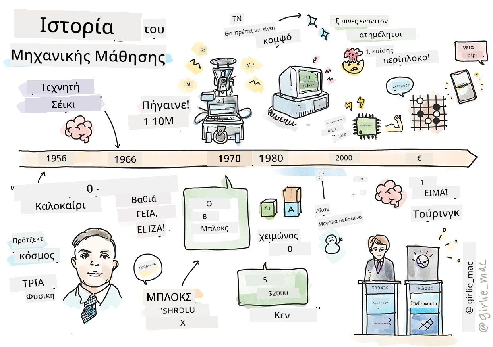
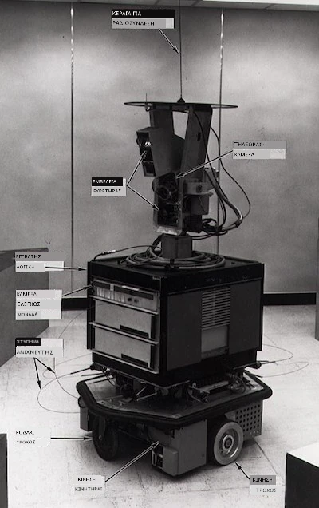
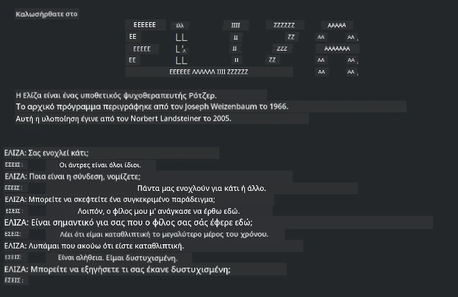

# Ιστορία της μηχανικής μάθησης

> Σκίτσο από τη [Tomomi Imura](https://www.twitter.com/girlie_mac)

## [Προ-μάθημα κουίζ](https://ff-quizzes.netlify.app/en/ml/)

---

> 🎥 Κάντε κλικ στην εικόνα παραπάνω για ένα σύντομο βίντεο που καλύπτει αυτό το μάθημα.

Σε αυτό το μάθημα, θα περιηγηθούμε στα βασικά ορόσημα στην ιστορία της μηχανικής μάθησης και της τεχνητής νοημοσύνης.

Η ιστορία της τεχνητής νοημοσύνης (ΤΝ) ως πεδίο έχει συνυφανθεί με την ιστορία της μηχανικής μάθησης, καθώς οι αλγόριθμοι και οι υπολογιστικές εξελίξεις που στηρίζουν την μηχανική μάθηση συνέβαλαν στην ανάπτυξη της ΤΝ. Είναι χρήσιμο να θυμόμαστε ότι, ενώ αυτοί οι τομείς ως ξεχωριστές περιοχές έρευνας άρχισαν να διαμορφώνονται τη δεκαετία του 1950, σημαντικές [αλγοριθμικές, στατιστικές, μαθηματικές, υπολογιστικές και τεχνικές ανακαλύψεις](https://wikipedia.org/wiki/Timeline_of_machine_learning) προηγήθηκαν και επικαλύφθηκαν με αυτήν την εποχή. Στην πραγματικότητα, οι άνθρωποι έχουν σκεφτεί αυτά τα ερωτήματα για [εκατοντάδες χρόνια](https://wikipedia.org/wiki/History_of_artificial_intelligence): το άρθρο αυτό συζητά τα ιστορικά νοητικά θεμέλια της ιδέας μιας 'σκεπτόμενης μηχανής.'

---
## Σημαντικές ανακαλύψεις

- 1763, 1812 [Θεώρημα Bayes](https://wikipedia.org/wiki/Bayes%27_theorem) και οι πρόγονοί του. Αυτό το θεώρημα και οι εφαρμογές του βασίζουν την επαγωγή, περιγράφοντας την πιθανότητα εμφάνισης ενός γεγονότος με βάση προηγούμενη γνώση.
- 1805 [Θεωρία Ελαχίστων Τετραγώνων](https://wikipedia.org/wiki/Least_squares) από τον Γάλλο μαθηματικό Adrien-Marie Legendre. Αυτή η θεωρία, την οποία θα μάθετε στην ενότητα μας για την Παλινδρόμηση, βοηθά στη προσαρμογή δεδομένων.
- 1913 [Αλυσίδες Markov](https://wikipedia.org/wiki/Markov_chain), ονομασμένες από τον Ρώσο μαθηματικό Andrey Markov, χρησιμοποιούνται για να περιγράψουν μια ακολουθία πιθανών γεγονότων βασισμένη σε προηγούμενη κατάσταση.
- 1957 [Περσέπτρον](https://wikipedia.org/wiki/Perceptron) είναι ένα είδος γραμμικού ταξινομητή που εφευρέθηκε από τον Αμερικανό ψυχολόγο Frank Rosenblatt και στηρίζει τις εξελίξεις στο βαθύ μάθημα.

---

- 1967 [Πλησιέστερος Γείτονας](https://wikipedia.org/wiki/Nearest_neighbor) είναι ένας αλγόριθμος που αρχικά σχεδιάστηκε για χαρτογράφηση διαδρομών. Σε πλαίσιο μηχανικής μάθησης χρησιμοποιείται για ανίχνευση προτύπων.
- 1970 [Οπισθοδιάδοση](https://wikipedia.org/wiki/Backpropagation) χρησιμοποιείται για εκπαίδευση [προωθητών νευρωνικών δικτύων](https://wikipedia.org/wiki/Feedforward_neural_network).
- 1982 [Επαναφορικά Νευρωνικά Δίκτυα](https://wikipedia.org/wiki/Recurrent_neural_network) είναι τεχνητά νευρωνικά δίκτυα που προέρχονται από προωθητικά νευρωνικά δίκτυα και δημιουργούν χρονικά γραφήματα.

✅ Κάντε μια μικρή έρευνα. Ποιες άλλες ημερομηνίες ξεχωρίζουν ως καθοριστικές στην ιστορία της ΜΜ και της ΤΝ;

---
## 1950: Μηχανές που σκέφτονται

Ο Alan Turing, ένα πραγματικά αξιοσημείωτο άτομο που ψηφίστηκε [από το κοινό το 2019](https://wikipedia.org/wiki/Icons:_The_Greatest_Person_of_the_20th_Century) ως ο μεγαλύτερος επιστήμονας του 20ού αιώνα, αποδίδεται η συμβολή του στη θεμελίωση της έννοιας «μηχανή που μπορεί να σκέφτεται.» Αντιμετώπισε επικριτές και το δικό του αίτημα για εμπειρικά αποδεικτικά στοιχεία αυτής της ιδέας δημιουργώντας εν μέρει το [Τεστ Turing](https://www.bbc.com/news/technology-18475646), το οποίο θα εξερευνήσετε στα μαθήματα NLP.

---
## 1956: Θερινό Ερευνητικό Πρόγραμμα Dartmouth

"Το Θερινό Ερευνητικό Πρόγραμμα Dartmouth για την τεχνητή νοημοσύνη ήταν ένα θεμελιώδες γεγονός για την τεχνητή νοημοσύνη ως πεδίο," και σε αυτό το συνέδριο επινοήθηκε ο όρος 'τεχνητή νοημοσύνη' ([πηγή](https://250.dartmouth.edu/highlights/artificial-intelligence-ai-coined-dartmouth)).

> Κάθε πτυχή της μάθησης ή οποιοδήποτε άλλο χαρακτηριστικό της νοημοσύνης μπορεί κατά βάση να περιγραφεί τόσο ακριβώς ώστε να μπορεί να κατασκευαστεί μια μηχανή που να το προσομοιώνει.

---

Ο επικεφαλής ερευνητής, καθηγητής μαθηματικών John McCarthy, ελπίζε ότι "θα προχωρήσουμε με βάση την εικασία ότι κάθε πτυχή της μάθησης ή οποιοδήποτε άλλο χαρακτηριστικό της νοημοσύνης μπορεί κατά βάση να περιγραφεί τόσο ακριβώς ώστε να μπορεί να κατασκευαστεί μια μηχανή που να το προσομοιώνει." Οι συμμετέχοντες συμπεριλάμβαναν έναν ακόμη διακεκριμένο στον τομέα, τον Marvin Minsky.

Το σεμινάριο πιστώνεται ότι ξεκίνησε και ενθάρρυνε πολλές συζητήσεις, όπως "την άνοδο των συμβολικών μεθόδων, συστήματα εστιασμένα σε περιορισμένους τομείς (πρώιμα συστήματα ειδικών γνώσεων) και το σύστημα επαγωγής έναντι του συστήματος παραγωγής." ([πηγή](https://wikipedia.org/wiki/Dartmouth_workshop)).

---
## 1956 - 1974: "Η χρυσή εποχή"

Από τη δεκαετία του 1950 έως τα μέσα της δεκαετίας του '70, επικρατούσε έντονος αισιοδοξισμός με την ελπίδα ότι η ΤΝ θα μπορούσε να λύσει πολλά προβλήματα. Το 1967, ο Marvin Minsky δήλωσε με αυτοπεποίθηση ότι "Μέσα σε μια γενιά ... το πρόβλημα της δημιουργίας 'τεχνητής νοημοσύνης' θα έχει ουσιαστικά λυθεί." (Minsky, Marvin (1967), Computation: Finite and Infinite Machines, Englewood Cliffs, N.J.: Prentice-Hall)

Η έρευνα στην επεξεργασία φυσικής γλώσσας άνθισε, η αναζήτηση βελτιώθηκε και έγινε πιο ισχυρή, και η έννοια των 'μικρο-κόσμων' δημιουργήθηκε, όπου απλές εργασίες ολοκληρώνονταν με απλές γλωσσικές οδηγίες.

---

Η έρευνα χρηματοδοτήθηκε επαρκώς από κυβερνητικές υπηρεσίες, επιτεύχθηκαν πρόοδοι στην υπολογιστική και στους αλγόριθμους, και κατασκευάστηκαν πρωτότυπα έξυπνων μηχανών. Μερικές από αυτές τις μηχανές περιλαμβάνουν:

* [Shakey το ρομπότ](https://wikipedia.org/wiki/Shakey_the_robot), που μπορούσε να κινείται και να αποφασίζει πώς να εκτελεί εργασίες «έξυπνα».

    
    > Shakey το 1972

---

* Η Eliza, ένας πρώιμος 'chatbot', μπορούσε να συνομιλήσει με ανθρώπους και να λειτουργεί ως πρωτόγονος 'θεραπευτής'. Θα μάθετε περισσότερα για την Eliza στα μαθήματα NLP.

    
    > Μια έκδοση της Eliza, ενός chatbot

---

* Το "Blocks world" ήταν ένα παράδειγμα μικρο-κόσμου όπου τα μπλοκ μπορούσαν να στοιβάζονται και να ταξινομούνται, και γίνονταν πειράματα στη διδασκαλία μηχανών να παίρνουν αποφάσεις. Οι εξελίξεις κατασκευασμένες με βιβλιοθήκες όπως η [SHRDLU](https://wikipedia.org/wiki/SHRDLU) βοήθησαν να προωθηθεί η επεξεργασία γλώσσας.

    

    > 🎥 Κάντε κλικ στην εικόνα παραπάνω για βίντεο: Blocks world με SHRDLU

---
## 1974 - 1980: "Χειμώνας της ΤΝ"

Μέχρι τα μέσα της δεκαετίας του 1970, είχε γίνει σαφές ότι η πολυπλοκότητα της κατασκευής 'έξυπνων μηχανών' είχε υποτιμηθεί και ότι οι υποσχέσεις της, δεδομένης της διαθέσιμης υπολογιστικής ισχύος, είχαν υπερεκτιμηθεί. Οι οικονομικοί πόροι μειώθηκαν και η εμπιστοσύνη στο πεδίο επιβραδύνθηκε. Μερικά ζητήματα που επηρέασαν την εμπιστοσύνη περιλαμβάνουν:
---
- **Περιορισμοί**. Η υπολογιστική ισχύς ήταν πολύ περιορισμένη.
- **Συνδυαστική έκρηξη**. Ο αριθμός των παραμέτρων που έπρεπε να εκπαιδευτούν αυξανόταν εκθετικά καθώς του ζητούνταν περισσότερα από τους υπολογιστές, χωρίς παράλληλη εξέλιξη της υπολογιστικής ισχύος και των δυνατοτήτων.
- **Έλλειψη δεδομένων**. Υπήρχε έλλειψη δεδομένων που εμπόδιζε τη διαδικασία δοκιμής, ανάπτυξης και βελτίωσης των αλγορίθμων.
- **Ζητάμε τα σωστά ερωτήματα;**. Τα ίδια τα ερωτήματα που τίθενται άρχισαν να αμφισβητούνται. Οι ερευνητές άρχισαν να δέχονται κριτική για τις προσεγγίσεις τους:
  - Τα τεστ Turing αμφισβητήθηκαν μέσω, μεταξύ άλλων, της «θεωρίας του κινεζικού δωματίου» που ανέφερε ότι, «ο προγραμματισμός ενός ψηφιακού υπολογιστή μπορεί να φαίνεται ότι κατανοεί τη γλώσσα αλλά δεν μπορεί να παράγει πραγματική κατανόηση.» ([πηγή](https://plato.stanford.edu/entries/chinese-room/))
  - Η ηθική του να εισαχθούν τεχνητές νοημοσύνες όπως ο "θεραπευτής" ELIZA στην κοινωνία αμφισβητήθηκε.

---

Την ίδια στιγμή, διάφορες σχολές σκέψης στην ΤΝ άρχισαν να διαμορφώνονται. Δημιουργήθηκε μια διχοτομία μεταξύ των πρακτικών ["βρώμικης" έναντι "τακτικής ΤΝ"](https://wikipedia.org/wiki/Neats_and_scruffies). Τα _βρώμικα_ εργαστήρια διόρθωναν προγράμματα για ώρες μέχρι να επιτύχουν τα επιθυμητά αποτελέσματα. Τα _τακτικά_ εργαστήρια «επικεντρώνονταν στη λογική και στην επίλυση προβλημάτων με τυπικούς κανόνες». Η ELIZA και η SHRDLU ήταν γνωστά _βρώμικα_ συστήματα. Τη δεκαετία του 1980, καθώς δημιουργήθηκε η ανάγκη να γίνουν τα συστήματα μηχανικής μάθησης αναπαραγώγιμα, η _τακτική_ προσέγγιση προώθησε σταδιακά ως τα αποτελέσματά της είναι πιο ερμηνεύσιμα.

---
## Δεκαετία του 1980: Συστήματα ειδικών γνώσεων

Καθώς το πεδίο μεγάλωνε, η ωφέλεια προς τις επιχειρήσεις έγινε πιο ξεκάθαρη, και τη δεκαετία του 1980 αυξήθηκε η διάδοση των 'συστημάτων ειδικών γνώσεων'. "Τα συστήματα ειδικών γνώσεων ήταν από τις πρώτες πραγματικά επιτυχημένες μορφές λογισμικού τεχνητής νοημοσύνης (ΤΝ)." ([πηγή](https://wikipedia.org/wiki/Expert_system)).

Αυτό το είδος συστήματος είναι στην πραγματικότητα _υβριδικό_, αποτελούμενο εν μέρει από μια μηχανή κανόνων που ορίζει επιχειρηματικές απαιτήσεις, και μια μηχανή συμπερασμών που χρησιμοποιεί το σύστημα κανόνων για την εξαγωγή νέων συμπερασμάτων.

Αυτός ο χρόνος είδε επίσης αυξανόμενο ενδιαφέρον για τα νευρωνικά δίκτυα.

---
## 1987 - 1993: Ψύχρα της ΤΝ

Η διάδοση εξειδικευμένου υλικού για τα συστήματα ειδικών γνώσεων είχε το δυσμενές αποτέλεσμα να γίνει πολύ εξειδικευμένη. Η άνοδος των προσωπικών υπολογιστών ανταγωνίστηκε επίσης αυτά τα μεγάλα, εξειδικευμένα, κεντρικά συστήματα. Η δημοκρατικοποίηση της πληροφορικής είχε ξεκινήσει και τελικά άνοιξε το δρόμο για την σύγχρονη έκρηξη των μεγάλων δεδομένων.

---
## 1993 - 2011

Αυτή η εποχή είδε μια νέα εποχή για τη ΜΜ και την ΤΝ να μπορούν να λύσουν κάποια από τα προβλήματα που είχαν προκύψει προηγουμένως από την έλλειψη δεδομένων και υπολογιστικής ισχύος. Η ποσότητα των δεδομένων άρχισε να αυξάνεται ραγδαία και να γίνεται πιο ευρέως διαθέσιμη, για καλό και για κακό, ειδικά με την εισαγωγή του smartphone γύρω στο 2007. Η υπολογιστική ισχύς αυξήθηκε εκθετικά, και οι αλγόριθμοι εξελίχθηκαν παράλληλα. Το πεδίο άρχισε να ωριμάζει καθώς οι ελεύθερες μέρες του παρελθόντος άρχισαν να κρυσταλλώνονται σε μια αληθινή πειθαρχία.

---
## Τώρα

Σήμερα η μηχανική μάθηση και η τεχνητή νοημοσύνη αγγίζουν σχεδόν κάθε μέρος της ζωής μας. Αυτή η εποχή απαιτεί προσεκτική κατανόηση των κινδύνων και των πιθανών επιπτώσεων αυτών των αλγορίθμων στις ζωές των ανθρώπων. Όπως έχει δηλώσει ο Brad Smith της Microsoft, "Η τεχνολογία της πληροφορίας εγείρει ζητήματα που αγγίζουν τον πυρήνα θεμελιωδών προστασιών ανθρωπίνων δικαιωμάτων όπως η ιδιωτικότητα και η ελευθερία της έκφρασης. Αυτά τα ζητήματα αυξάνουν την ευθύνη των εταιρειών τεχνολογίας που δημιουργούν αυτά τα προϊόντα. Κατά την άποψή μας, καλούν επίσης σε στοχαστικό κρατικό κανονισμό και στην ανάπτυξη κανόνων σχετικά με αποδεκτές χρήσεις." ([πηγή](https://www.technologyreview.com/2019/12/18/102365/the-future-of-ais-impact-on-society/)).

---

Παραμένει να δούμε τι επιφυλάσσει το μέλλον, αλλά είναι σημαντικό να κατανοούμε αυτά τα συστήματα υπολογιστών και το λογισμικό και τους αλγορίθμους που εκτελούν. Ελπίζουμε αυτό το εκπαιδευτικό πρόγραμμα να σας βοηθήσει να αποκτήσετε καλύτερη κατανόηση ώστε να μπορείτε να αποφασίσετε μόνοι σας.

> 🎥 Κάντε κλικ στην εικόνα παραπάνω για βίντεο: Ο Yann LeCun συζητά την ιστορία του βαθιού μάθησης σε αυτό το μάθημα

---
## 🚀Πρόκληση

Ερευνήστε μία από αυτές τις ιστορικές στιγμές και μάθετε περισσότερα για τους ανθρώπους που βρίσκονταν πίσω τους. Υπάρχουν συναρπαστικοί χαρακτήρες, και καμία επιστημονική ανακάλυψη δεν δημιουργήθηκε ποτέ σε πολιτιστικό κενό. Τι ανακαλύπτετε;

## [Μετα-μάθημα κουίζ](https://ff-quizzes.netlify.app/en/ml/)

---
## Επανεξέταση & Αυτομελέτη

Εδώ είναι μερικά αντικείμενα για να δείτε και να ακούσετε:

[Αυτό το podcast όπου η Amy Boyd συζητά την εξέλιξη της ΤΝ](http://runasradio.com/Shows/Show/739)

---

## Αποστολή

[Δημιουργήστε ένα χρονικό διάγραμμα](assignment.md)

---

<!-- CO-OP TRANSLATOR DISCLAIMER START -->
**Αποποίηση ευθυνών**:
Αυτό το έγγραφο έχει μεταφραστεί χρησιμοποιώντας την υπηρεσία μετάφρασης με τεχνητή νοημοσύνη [Co-op Translator](https://github.com/Azure/co-op-translator). Ενώ επιδιώκουμε την ακρίβεια, παρακαλούμε να έχετε υπόψη ότι οι αυτοματοποιημένες μεταφράσεις ενδέχεται να περιέχουν λάθη ή ανακρίβειες. Το πρωτότυπο έγγραφο στη μητρική του γλώσσα πρέπει να θεωρείται η αυθεντική πηγή. Για κρίσιμες πληροφορίες, συνιστάται επαγγελματική ανθρώπινη μετάφραση. Δεν φέρουμε ευθύνη για τυχόν παρεξηγήσεις ή λανθασμένες ερμηνείες που προκύπτουν από τη χρήση αυτής της μετάφρασης.
<!-- CO-OP TRANSLATOR DISCLAIMER END -->