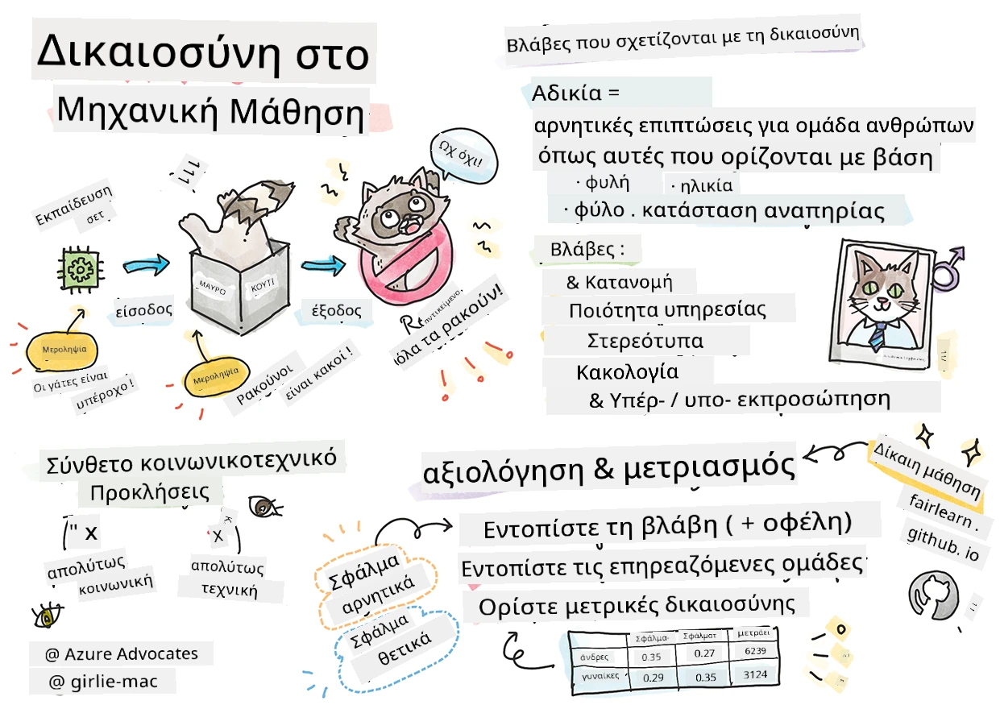

# Κατασκευή λύσεων Μηχανικής Μάθησης με υπεύθυνη AI
 

> Σκέτχνόουτ από την [Tomomi Imura](https://www.twitter.com/girlie_mac)

## [Προ-διάλεξη κουίζ](https://ff-quizzes.netlify.app/en/ml/)
 
## Εισαγωγή

Σε αυτό το πρόγραμμα σπουδών, θα αρχίσετε να ανακαλύπτετε πώς η μηχανική μάθηση μπορεί και επηρεάζει την καθημερινή μας ζωή. Ακόμα και τώρα, συστήματα και μοντέλα συμμετέχουν σε καθημερινές εργασίες λήψης αποφάσεων, όπως διαγνώσεις υγείας, εγκρίσεις δανείων ή ανίχνευση απάτης. Επομένως, είναι σημαντικό αυτά τα μοντέλα να λειτουργούν καλά για να παρέχουν αξιόπιστα αποτελέσματα. Όπως κάθε εφαρμογή λογισμικού, τα συστήματα AI θα αποτύχουν να ανταποκριθούν σε προσδοκίες ή θα έχουν ανεπιθύμητα αποτελέσματα. Για αυτό είναι ουσιώδες να μπορούμε να κατανοήσουμε και να εξηγήσουμε τη συμπεριφορά ενός μοντέλου AI.

Φανταστείτε τι μπορεί να συμβεί όταν τα δεδομένα που χρησιμοποιείτε για να χτίσετε αυτά τα μοντέλα λείπουν ορισμένα δημογραφικά χαρακτηριστικά, όπως φυλή, φύλο, πολιτική άποψη, θρησκεία, ή αναπαριστούν δυσανάλογα τέτοια δημογραφικά στοιχεία. Τι γίνεται όταν η έξοδος του μοντέλου ερμηνεύεται για να ευνοεί κάποιο δημογραφικό; Ποιο είναι το αποτέλεσμα αυτό για την εφαρμογή; Επιπλέον, τι συμβαίνει όταν το μοντέλο έχει αρνητικό αποτέλεσμα και βλάπτει ανθρώπους; Ποιος ευθύνεται για τη συμπεριφορά των συστημάτων AI; Αυτά είναι μερικά από τα ερωτήματα που θα εξερευνήσουμε σε αυτό το πρόγραμμα σπουδών.

Σε αυτό το μάθημα, θα:

- Αυξήσετε την ευαισθητοποίησή σας για τη σημασία της δικαιοσύνης στη μηχανική μάθηση και τις βλάβες που σχετίζονται με αυτήν.
- Γνωρίσετε την πρακτική της διερεύνησης εξαιρέσεων και ασυνήθιστων σεναρίων για να εξασφαλίσετε αξιοπιστία και ασφάλεια.
- Κατανοήσετε την ανάγκη ενδυνάμωσης όλων μέσω του σχεδιασμού περιεκτικών συστημάτων.
- Εξερευνήσετε πόσο ζωτικής σημασίας είναι η προστασία της ιδιωτικότητας και της ασφάλειας των δεδομένων και των ανθρώπων.
- Δείτε τη σημασία της προσέγγισης με "γυάλινο κουτί" στην εξήγηση της συμπεριφοράς των μοντέλων AI.
- Να έχετε υπόψη σας πόσο είναι απαραίτητη η λογοδοσία για την οικοδόμηση εμπιστοσύνης στα συστήματα AI.

## Προαπαιτούμενα

Ως προαπαιτούμενο, παρακαλούμε να ακολουθήσετε το Μάθημα "Αρχές Υπεύθυνης AI" και να παρακολουθήσετε το παρακάτω βίντεο για το θέμα:

Μάθετε περισσότερα για την Υπεύθυνη AI ακολουθώντας αυτήν την [Διαδρομή Μάθησης](https://docs.microsoft.com/learn/modules/responsible-ai-principles/?WT.mc_id=academic-77952-leestott)

> 🎥 Κάντε κλικ στην εικόνα παραπάνω για ένα βίντεο: Η προσέγγιση της Microsoft για την Υπεύθυνη AI

## Δικαιοσύνη

Τα συστήματα AI πρέπει να αντιμετωπίζουν όλους δίκαια και να αποφεύγουν να επηρεάζουν παρόμοιες ομάδες ανθρώπων με διαφορετικούς τρόπους. Για παράδειγμα, όταν τα συστήματα AI παρέχουν καθοδήγηση για ιατρική θεραπεία, αιτήσεις δανείων ή απασχόληση, θα πρέπει να κάνουν τις ίδιες συστάσεις σε όλους με παρόμοια συμπτώματα, οικονομικές συνθήκες ή επαγγελματικά προσόντα. Κάθε ένας από εμάς ως άνθρωποι κουβαλά έμφυτες προκαταλήψεις που επηρεάζουν τις αποφάσεις και τις πράξεις μας. Αυτές οι προκαταλήψεις μπορεί να είναι εμφανείς στα δεδομένα που χρησιμοποιούμε για την εκπαίδευση των συστημάτων AI. Τέτοιος χειρισμός μπορεί μερικές φορές να συμβαίνει ακούσια. Συχνά είναι δύσκολο να γνωρίζετε συνειδητά πότε εισάγετε προκατάληψη στα δεδομένα.

**«Αδικία»** περιλαμβάνει αρνητικές επιπτώσεις, ή «βλάβες», για μια ομάδα ανθρώπων, όπως αυτές που ορίζονται με βάση φυλή, φύλο, ηλικία ή κατάσταση αναπηρίας. Οι κύριες βλάβες σχετιζόμενες με δικαιοσύνη μπορούν να ταξινομηθούν ως:

- **Κατανομή**, εάν π.χ. προτιμάται κάποιο φύλο ή εθνότητα έναντι άλλου.
- **Ποιότητα υπηρεσίας**. Αν εκπαιδεύσετε τα δεδομένα για ένα συγκεκριμένο σενάριο αλλά η πραγματικότητα είναι πιο σύνθετη, οδηγεί σε κακή απόδοση της υπηρεσίας. Για παράδειγμα, ένας διανομέας σαπουνιού χεριών που δεν μπορούσε να ανιχνεύσει ανθρώπους με σκοτεινό δέρμα. [Αναφορά](https://gizmodo.com/why-cant-this-soap-dispenser-identify-dark-skin-1797931773)
- **Κακολογίας**. Να επικρίνετε άδικα και να χαρακτηρίζετε κάτι ή κάποιον. Για παράδειγμα, μια τεχνολογία σήμανσης εικόνων εσφαλμένα χαρακτήρισε εικόνες σκοτεινόχρωμων ανθρώπων ως γορίλλες.
- **Υπερεκπροσώπηση ή υποεκπροσώπηση**. Η ιδέα είναι ότι μια συγκεκριμένη ομάδα δεν εμφανίζεται σε ένα συγκεκριμένο επάγγελμα, και οποιαδήποτε υπηρεσία ή λειτουργία που το προωθεί συνεχώς συμβάλλει σε βλάβη.
- **Στερεοτυπία**. Συσχέτιση μιας δεδομένης ομάδας με προ-ανατεθειμένα χαρακτηριστικά. Για παράδειγμα, ένα σύστημα μετάφρασης γλώσσας μεταξύ Αγγλικών και Τουρκικών μπορεί να έχει ανακρίβειες λόγω λέξεων με στερεοτυπικές συσχετίσεις με το φύλο.

> μετάφραση στα Τουρκικά

> μετάφραση πίσω στα Αγγλικά

Κατά το σχεδιασμό και τη δοκιμή συστημάτων AI, πρέπει να διασφαλίσουμε ότι η AI είναι δίκαιη και δεν έχει προγραμματιστεί να λαμβάνει προκατειλημμένες ή διακριτικές αποφάσεις, που επίσης απαγορεύεται να λαμβάνουν άνθρωποι. Η διασφάλιση δικαιοσύνης στην AI και τη μηχανική μάθηση παραμένει μια πολύπλοκη κοινωνικοτεχνική πρόκληση.

### Αξιοπιστία και ασφάλεια

Για να χτίσουμε εμπιστοσύνη, τα συστήματα AI πρέπει να είναι αξιόπιστα, ασφαλή και συνεπή σε κανονικές και απρόβλεπτες συνθήκες. Είναι σημαντικό να γνωρίζουμε πώς θα συμπεριφέρονται τα συστήματα AI σε μια ποικιλία καταστάσεων, ειδικά όταν είναι εξαιρέσεις. Κατά την κατασκευή λύσεων AI, πρέπει να δοθεί μεγάλη προσοχή στο πώς να αντιμετωπίζονται διάφορες περιστάσεις που θα συναντήσει η AI. Για παράδειγμα, ένα αυτοκίνητο αυτόνομης οδήγησης πρέπει να βάζει την ασφάλεια των ανθρώπων ως κορυφαία προτεραιότητα. Ως εκ τούτου, η AI που τροφοδοτεί το αυτοκίνητο πρέπει να εξετάζει όλα τα πιθανά σενάρια που μπορεί να συναντήσει, όπως νύχτα, καταιγίδες ή χιονοθύελλες, παιδιά που τρέχουν στο δρόμο, κατοικίδια, κατασκευές δρόμων κλπ. Το πόσο καλά ένα σύστημα AI μπορεί να χειριστεί ένα ευρύ φάσμα συνθηκών με αξιοπιστία και ασφάλεια αντανακλά το επίπεδο πρόβλεψης που ανέλυσε ο επιστήμονας δεδομένων ή ο προγραμματιστής AI κατά το σχεδιασμό ή τη δοκιμή του συστήματος.

> [🎥 Κάντε κλικ εδώ για βίντεο: ](https://www.microsoft.com/videoplayer/embed/RE4vvIl)

### Ενσωμάτωση

Τα συστήματα AI πρέπει να σχεδιάζονται για να εμπλέκουν και να ενδυναμώνουν όλους. Κατά το σχεδιασμό και την υλοποίηση συστημάτων AI, οι επιστήμονες δεδομένων και οι προγραμματιστές AI εντοπίζουν και αντιμετωπίζουν πιθανά εμπόδια στο σύστημα που μπορεί να αποκλείσουν ακούσια ανθρώπους. Για παράδειγμα, υπάρχουν 1 δισεκατομμύριο άνθρωποι με αναπηρίες σε όλο τον κόσμο. Με την πρόοδο της AI, μπορούν να έχουν ευκολότερη πρόσβαση σε ένα ευρύ φάσμα πληροφοριών και ευκαιριών στην καθημερινή τους ζωή. Με την αντιμετώπιση των εμποδίων δημιουργούνται ευκαιρίες καινοτομίας και ανάπτυξης προϊόντων AI με καλύτερες εμπειρίες που ωφελούν όλους.

> [🎥 Κάντε κλικ εδώ για βίντεο: ενσωμάτωση στην AI](https://www.microsoft.com/videoplayer/embed/RE4vl9v)

### Ασφάλεια και ιδιωτικότητα

Τα συστήματα AI πρέπει να είναι ασφαλή και να σέβονται την ιδιωτικότητα των ανθρώπων. Οι άνθρωποι έχουν λιγότερη εμπιστοσύνη σε συστήματα που θέτουν σε κίνδυνο την ιδιωτικότητά τους, τις πληροφορίες ή τη ζωή τους. Κατά την εκπαίδευση μοντέλων μηχανικής μάθησης βασιζόμαστε σε δεδομένα για να παράγουμε τα καλύτερα αποτελέσματα. Κατά τη διαδικασία αυτή, πρέπει να λαμβάνονται υπόψη η προέλευση των δεδομένων και η ακεραιότητά τους. Για παράδειγμα, τα δεδομένα προέρχονταν από τον χρήστη ή ήταν δημόσια διαθέσιμα; Στη συνέχεια, κατά την εργασία με τα δεδομένα, είναι κρίσιμη η ανάπτυξη συστημάτων AI που μπορούν να προστατεύουν εμπιστευτικές πληροφορίες και να αντιστέκονται σε επιθέσεις. Καθώς η AI καθίσταται πιο διαδεδομένη, η προστασία της ιδιωτικότητας και η ασφάλεια σημαντικών προσωπικών και επιχειρησιακών πληροφοριών γίνεται όλο και πιο κρίσιμη και πολύπλοκη. Τα ζητήματα ιδιωτικότητας και ασφάλειας δεδομένων απαιτούν ιδιαίτερη προσοχή για την AI επειδή η πρόσβαση στα δεδομένα είναι ουσιαστική για να κάνει ακριβείς και ενημερωμένες προβλέψεις και αποφάσεις για ανθρώπους.

> [🎥 Κάντε κλικ εδώ για βίντεο: ασφάλεια στην AI](https://www.microsoft.com/videoplayer/embed/RE4voJF)

- Ως κλάδος έχουμε κάνει σημαντικές προόδους στην Ιδιωτικότητα & ασφάλεια, τροφοδοτούμενες σημαντικά από κανονισμούς όπως ο GDPR (Γενικός Κανονισμός Προστασίας Δεδομένων).
- Ωστόσο, με τα συστήματα AI πρέπει να αναγνωρίσουμε την ένταση μεταξύ της ανάγκης για περισσότερα προσωπικά δεδομένα για να γίνουν τα συστήματα πιο προσωπικά και αποτελεσματικά – και της ιδιωτικότητας.
- Όπως με τη γέννηση των συνδεδεμένων υπολογιστών με το διαδίκτυο, βλέπουμε επίσης μεγάλη αύξηση σε ζητήματα ασφάλειας που σχετίζονται με την AI.
- Ταυτόχρονα, έχουμε δει την AI να χρησιμοποιείται για τη βελτίωση της ασφάλειας. Για παράδειγμα, οι περισσότερες σύγχρονες σαρώτριες αντι-ιού σήμερα τροφοδοτούνται από ευρετικές μεθόδους AI.
- Πρέπει να διασφαλίσουμε ότι οι διαδικασίες Επιστήμης Δεδομένων μας εναρμονίζονται αρμονικά με τις πιο σύγχρονες πρακτικές ιδιωτικότητας και ασφάλειας.

### Διαφάνεια
Τα συστήματα AI πρέπει να είναι κατανοητά. Ένα κρίσιμο μέρος της διαφάνειας είναι η εξήγηση της συμπεριφοράς των συστημάτων AI και των συστατικών τους. Η βελτίωση της κατανόησης των συστημάτων AI απαιτεί από τους εμπλεκόμενους να κατανοούν πώς και γιατί λειτουργούν ώστε να μπορούν να εντοπίζουν πιθανά προβλήματα απόδοσης, ζητήματα ασφάλειας και ιδιωτικότητας, προκαταλήψεις, αποκλειστικές πρακτικές ή ανεπιθύμητα αποτελέσματα. Πιστεύουμε επίσης ότι όσοι χρησιμοποιούν συστήματα AI πρέπει να είναι ειλικρινείς και διαφανείς σχετικά με το πότε, γιατί και πώς επιλέγουν να τα αναπτύξουν. Καθώς και για τους περιορισμούς των συστημάτων που χρησιμοποιούν. Για παράδειγμα, αν μια τράπεζα χρησιμοποιεί σύστημα AI για να υποστηρίξει τις αποφάσεις χορήγησης δανείων, είναι σημαντικό να εξεταστούν τα αποτελέσματα και να κατανοήσουν ποια δεδομένα επηρεάζουν τις συστάσεις του συστήματος. Οι κυβερνήσεις αρχίζουν να ρυθμίζουν την AI σε διάφορους κλάδους, οπότε οι επιστήμονες δεδομένων και οι οργανισμοί πρέπει να εξηγούν εάν ένα σύστημα AI πληροί τους κανονισμούς, ειδικά όταν υπάρχει ανεπιθύμητο αποτέλεσμα.

> [🎥 Κάντε κλικ εδώ για βίντεο: διαφάνεια στην AI](https://www.microsoft.com/videoplayer/embed/RE4voJF)

- Επειδή τα συστήματα AI είναι τόσο πολύπλοκα, είναι δύσκολο να κατανοήσουμε πώς λειτουργούν και να ερμηνεύσουμε τα αποτελέσματα.
- Αυτή η έλλειψη κατανόησης επηρεάζει τον τρόπο διαχείρισης, λειτουργίας και τεκμηρίωσης αυτών των συστημάτων.
- Αυτή η έλλειψη κατανόησης επηρεάζει πιο σημαντικά τις αποφάσεις που λαμβάνονται με βάση τα αποτελέσματα αυτών των συστημάτων.

### Λογοδοσία
 
Οι άνθρωποι που σχεδιάζουν και αναπτύσσουν συστήματα AI πρέπει να είναι υπεύθυνοι για το πώς λειτουργούν τα συστήματά τους. Η ανάγκη για λογοδοσία είναι ιδιαίτερα κρίσιμη με ευαίσθητες τεχνολογίες όπως η αναγνώριση προσώπου. Πρόσφατα, έχει αυξηθεί η ζήτηση για τεχνολογία αναγνώρισης προσώπου, ειδικά από οργανώσεις επιβολής του νόμου που βλέπουν τη δυνατότητα χρήσης της τεχνολογίας για την εύρεση αγνοουμένων παιδιών. Ωστόσο, αυτές οι τεχνολογίες θα μπορούσαν ενδεχομένως να χρησιμοποιηθούν από μια κυβέρνηση για να θέσουν σε κίνδυνο τα θεμελιώδη δικαιώματα των πολιτών, π.χ. επιτρέποντας συνεχή επιτήρηση συγκεκριμένων ατόμων. Επομένως, οι επιστήμονες δεδομένων και οι οργανισμοί πρέπει να είναι υπεύθυνοι για το πώς το σύστημα AI επηρεάζει τα άτομα ή την κοινωνία.

> 🎥 Κάντε κλικ στην εικόνα παραπάνω για ένα βίντεο: Προειδοποιήσεις για Μαζική Παρακολούθηση μέσω Αναγνώρισης Προσώπου

Τελικά, ένα από τα μεγαλύτερα ερωτήματα για τη γενιά μας, καθώς είναι η πρώτη γενιά που φέρνει την AI στην κοινωνία, είναι πώς να διασφαλίσουμε ότι οι υπολογιστές θα παραμένουν λογοδοτικοί προς τους ανθρώπους και πώς να διασφαλίσουμε ότι αυτοί που σχεδιάζουν τους υπολογιστές παραμένουν υπεύθυνοι προς όλους τους υπόλοιπους.

## Αξιολόγηση επιπτώσεων

Πριν την εκπαίδευση ενός μοντέλου μηχανικής μάθησης, είναι σημαντικό να διενεργείται αξιολόγηση επιπτώσεων για να κατανοήσουμε τον σκοπό του συστήματος AI, ποια είναι η προβλεπόμενη χρήση, πού θα αναπτυχθεί και ποιος θα αλληλεπιδρά με το σύστημα. Αυτά είναι χρήσιμα για τους αξιολογητές ή ελεγκτές του συστήματος ώστε να γνωρίζουν ποιους παράγοντες πρέπει να λάβουν υπόψη κατά την αναγνώριση πιθανών κινδύνων και αναμενόμενων συνεπειών.

Τα παρακάτω είναι τομείς εστίασης κατά τη διεξαγωγή μιας αξιολόγησης επιπτώσεων:

* **Αρνητική επίπτωση σε άτομα**. Η επίγνωση οποιουδήποτε περιορισμού ή απαιτήσεων, μη υποστηριζόμενης χρήσης ή γνωστών περιορισμών που εμποδίζουν την απόδοση του συστήματος είναι ζωτικής σημασίας για να διασφαλιστεί ότι το σύστημα δεν χρησιμοποιείται με τρόπο που θα μπορούσε να βλάψει τα άτομα.
* **Απαιτήσεις δεδομένων**. Η κατανόηση του πώς και πού το σύστημα θα χρησιμοποιήσει δεδομένα επιτρέπει στους αξιολογητές να διερευνήσουν τυχόν απαιτήσεις δεδομένων που πρέπει να ληφθούν υπόψη (π.χ. GDPR ή κανονισμοί HIPAA). Επιπλέον, να εξεταστεί αν η πηγή ή η ποσότητα των δεδομένων είναι επαρκής για την εκπαίδευση.
* **Περίληψη επιπτώσεων**. Συγκεντρώστε έναν κατάλογο πιθανών βλαβών που θα μπορούσαν να προκύψουν από τη χρήση του συστήματος. Κατά τη διάρκεια του κύκλου ζωής της ΜΜ, εξετάστε αν τα προβλήματα που εντοπίστηκαν έχουν μετριαστεί ή αντιμετωπιστεί.
* **Εφαρμόσιμα στόχοι** για κάθε μία από τις έξι βασικές αρχές. Αξιολογήστε αν οι στόχοι κάθε αρχής επιτυγχάνονται και αν υπάρχουν κενά.

## Αποσφαλμάτωση με υπεύθυνη AI

Παρόμοια με την αποσφαλμάτωση μιας εφαρμογής λογισμικού, η αποσφαλμάτωση ενός συστήματος AI είναι μια αναγκαία διαδικασία εντοπισμού και επίλυσης ζητημάτων στο σύστημα. Υπάρχουν πολλοί παράγοντες που μπορεί να επηρεάσουν την απόδοση ενός μοντέλου ώστε να μην λειτουργεί όπως αναμένεται ή υπεύθυνα. Οι περισσότερες παραδοσιακές μετρικές απόδοσης μοντέλου είναι ποσοτικές συγκεντρωτικές τιμές της απόδοσης ενός μοντέλου, οι οποίες δεν αρκούν για να αναλύσουν πώς ένα μοντέλο παραβιάζει τις αρχές υπεύθυνης AI. Επιπλέον, ένα μοντέλο μηχανικής μάθησης είναι ένα μαύρο κουτί που δυσκολεύει να κατανοηθεί τι οδηγεί στο αποτέλεσμα ή να δοθεί εξήγηση όταν κάνει λάθος. Αργότερα σε αυτό το μάθημα, θα μάθουμε πώς να χρησιμοποιούμε τον πίνακα ελέγχου Responsible AI για να βοηθά στην αποσφαλμάτωση συστημάτων AI. Ο πίνακας ελέγχου παρέχει ολιστικό εργαλείο για επιστήμονες δεδομένων και προγραμματιστές AI για να εκτελούν:

* **Ανάλυση σφαλμάτων**. Για τον εντοπισμό της κατανομής σφαλμάτων του μοντέλου που μπορεί να επηρεάσουν τη δικαιοσύνη ή την αξιοπιστία του συστήματος.
* **Επισκόπηση μοντέλου**. Για να ανακαλύψετε πού υπάρχουν διαφορές στην απόδοση του μοντέλου ανάμεσα σε ομάδες δεδομένων.
* **Ανάλυση δεδομένων**. Για να κατανοήσετε την κατανομή δεδομένων και να εντοπίσετε οποιαδήποτε πιθανή προκατάληψη στα δεδομένα που θα μπορούσε να οδηγήσει σε ζητήματα δικαιοσύνης, ενσωμάτωσης και αξιοπιστίας.
* **Ερμηνευσιμότητα μοντέλου**. Για να κατανοήσετε τι επηρεάζει ή καθοδηγεί τις προβλέψεις του μοντέλου. Αυτό βοηθά στην εξήγηση της συμπεριφοράς του μοντέλου, κάτι σημαντικό για τη διαφάνεια και τη λογοδοσία.

## 🚀 Πρόκληση 
 
Για να αποτρέψουμε να εισαχθούν βλάβες εξαρχής, πρέπει:

- να υπάρχει ποικιλία υποβάθρων και προοπτικών μεταξύ των ανθρώπων που εργάζονται στα συστήματα
- να επενδύσουμε σε σύνολα δεδομένων που αντικατοπτρίζουν τη διαφορετικότητα της κοινωνίας μας
- να αναπτύξουμε καλύτερες μεθόδους σε όλο τον κύκλο ζωής της μηχανικής μάθησης για την ανίχνευση και διόρθωση της υπεύθυνης AI όταν αυτή εμφανίζεται

Σκεφτείτε σενάρια πραγματικής ζωής όπου η αναξιοπιστία ενός μοντέλου γίνεται προφανής στην κατασκευή και χρήση του μοντέλου. Τι άλλο θα πρέπει να λάβουμε υπόψη μας;

## [Μετά-διάλεξη κουίζ](https://ff-quizzes.netlify.app/en/ml/)

## Ανασκόπηση & Αυτοδιδασκαλία
 

Σε αυτό το μάθημα, έχετε μάθει μερικά βασικά στοιχεία των εννοιών της δικαιοσύνης και αδικίας στη μηχανική μάθηση.  
 
Παρακολουθήστε αυτό το εργαστήριο για να εμβαθύνετε στα θέματα: 

- Στην επιδίωξη της υπεύθυνης ΤΝ: Φέρνοντας τις αρχές στην πράξη από τις Besmira Nushi, Mehrnoosh Sameki και Amit Sharma

> 🎥 Κάντε κλικ στην εικόνα παραπάνω για ένα βίντεο: RAI Toolbox: Ένα πλαίσιο ανοιχτού κώδικα για την κατασκευή υπεύθυνης ΤΝ από τις Besmira Nushi, Mehrnoosh Sameki και Amit Sharma

Επίσης, διαβάστε: 

- κέντρο πόρων RAI της Microsoft: [Responsible AI Resources – Microsoft AI](https://www.microsoft.com/ai/responsible-ai-resources?activetab=pivot1%3aprimaryr4) 

- η ερευνητική ομάδα FATE της Microsoft: [FATE: Fairness, Accountability, Transparency, and Ethics in AI - Microsoft Research](https://www.microsoft.com/research/theme/fate/) 

RAI Toolbox: 

- [Αποθετήριο GitHub του Responsible AI Toolbox](https://github.com/microsoft/responsible-ai-toolbox)

Διαβάστε για τα εργαλεία του Azure Machine Learning που εξασφαλίζουν τη δικαιοσύνη:

- [Azure Machine Learning](https://docs.microsoft.com/azure/machine-learning/concept-fairness-ml?WT.mc_id=academic-77952-leestott) 

## Ανάθεση

[Εξερευνήστε το RAI Toolbox](assignment.md)

---

<!-- CO-OP TRANSLATOR DISCLAIMER START -->
**Αποποίηση ευθυνών**:
Αυτό το έγγραφο έχει μεταφραστεί χρησιμοποιώντας την υπηρεσία μετάφρασης με τεχνητή νοημοσύνη [Co-op Translator](https://github.com/Azure/co-op-translator). Ενώ επιδιώκουμε την ακρίβεια, παρακαλούμε να έχετε υπόψη ότι οι αυτοματοποιημένες μεταφράσεις ενδέχεται να περιέχουν λάθη ή ανακρίβειες. Το πρωτότυπο έγγραφο στη μητρική του γλώσσα πρέπει να θεωρείται η αυθεντική πηγή. Για κρίσιμες πληροφορίες, συνιστάται επαγγελματική ανθρώπινη μετάφραση. Δεν φέρουμε ευθύνη για τυχόν παρεξηγήσεις ή λανθασμένες ερμηνείες που προκύπτουν από τη χρήση αυτής της μετάφρασης.
<!-- CO-OP TRANSLATOR DISCLAIMER END -->