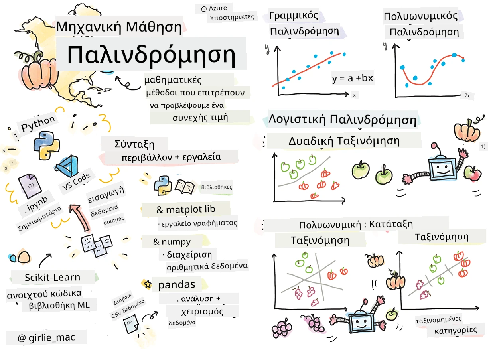
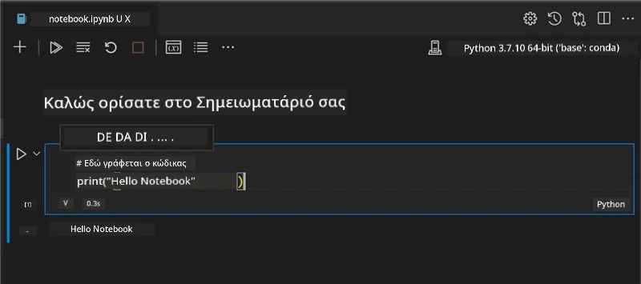
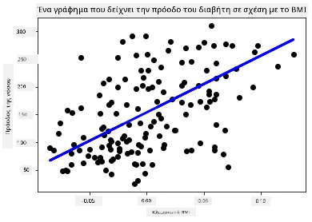

# Ξεκινώντας με Python και Scikit-learn για μοντέλα παλινδρόμησης



> Sketchnote από τον/την [Tomomi Imura](https://www.twitter.com/girlie_mac)

## [Προτελευταίο κουίζ](https://ff-quizzes.netlify.app/en/ml/)

> ### [Αυτό το μάθημα είναι διαθέσιμο και σε R!](../../../../2-Regression/1-Tools/solution/R/lesson_1.html)

## Εισαγωγή

Σε αυτά τα τέσσερα μαθήματα, θα ανακαλύψετε πώς να δημιουργείτε μοντέλα παλινδρόμησης. Θα συζητήσουμε σε λίγο γι' αυτό το σκοπό. Αλλά πριν κάνετε οτιδήποτε, βεβαιωθείτε ότι έχετε τα σωστά εργαλεία στη θέση τους για να ξεκινήσετε τη διαδικασία!

Σε αυτό το μάθημα, θα μάθετε πώς να:

- Ρυθμίζετε τον υπολογιστή σας για τοπικές εργασίες μηχανικής μάθησης.
- Δουλεύετε με Jupyter Notebooks.
- Χρησιμοποιείτε το Scikit-learn, συμπεριλαμβανομένης της εγκατάστασης.
- Εξερευνάτε τη γραμμική παλινδρόμηση με μια πρακτική άσκηση.

## Εγκαταστάσεις και ρυθμίσεις

[](https://youtu.be/-DfeD2k2Kj0 "ML για αρχάριους - Ρύθμισε τα εργαλεία σου για την κατασκευή μοντέλων Μηχανικής Μάθησης")

> 🎥 Κάντε κλικ στην εικόνα παραπάνω για ένα σύντομο βίντεο που δείχνει τη διαδικασία ρύθμισης του υπολογιστή σας για ΜΜ.

1. **Εγκαταστήστε Python**. Βεβαιωθείτε ότι η [Python](https://www.python.org/downloads/) είναι εγκατεστημένη στον υπολογιστή σας. Θα χρησιμοποιήσετε την Python για πολλές εργασίες επιστήμης δεδομένων και μηχανικής μάθησης. Τα περισσότερα συστήματα υπολογιστών έχουν ήδη εγκατεστημένη μια έκδοση Python. Υπάρχουν επίσης χρήσιμα [Πακέτα Κωδικοποίησης Python](https://code.visualstudio.com/learn/educators/installers?WT.mc_id=academic-77952-leestott) διαθέσιμα για να απλοποιήσουν την εγκατάσταση για ορισμένους χρήστες.

   Ωστόσο, κάποιες χρήσεις της Python απαιτούν μια έκδοση του λογισμικού, ενώ άλλες άλλη έκδοση. Γι' αυτό είναι χρήσιμο να δουλεύετε μέσα σε ένα [εικονικό περιβάλλον](https://docs.python.org/3/library/venv.html).

2. **Εγκαταστήστε το Visual Studio Code**. Βεβαιωθείτε ότι έχετε εγκαταστήσει το Visual Studio Code στον υπολογιστή σας. Ακολουθήστε αυτές τις οδηγίες για να [εγκαταστήσετε το Visual Studio Code](https://code.visualstudio.com/) για την βασική εγκατάσταση. Θα χρησιμοποιήσετε Python στο Visual Studio Code σε αυτό το μάθημα, οπότε ίσως θέλετε να εξοικειωθείτε με το πώς να [ρυθμίσετε το Visual Studio Code](https://docs.microsoft.com/learn/modules/python-install-vscode?WT.mc_id=academic-77952-leestott) για ανάπτυξη Python.

   > Εξοικειωθείτε με την Python δουλεύοντας μέσα από αυτή τη συλλογή από [Μαθήματα](https://docs.microsoft.com/users/jenlooper-2911/collections/mp1pagggd5qrq7?WT.mc_id=academic-77952-leestott)
   >
   > [](https://youtu.be/yyQM70vi7V8 "Ρύθμιση Python με Visual Studio Code")
   >
   > 🎥 Κάντε κλικ στην εικόνα παραπάνω για ένα βίντεο: χρήση Python μέσα στο VS Code.

3. **Εγκαταστήστε το Scikit-learn**, ακολουθώντας [αυτές τις οδηγίες](https://scikit-learn.org/stable/install.html). Επειδή πρέπει να βεβαιωθείτε ότι χρησιμοποιείτε Python 3, συνιστάται η χρήση ενός εικονικού περιβάλλοντος. Σημειώστε, αν εγκαθιστάτε αυτή τη βιβλιοθήκη σε Mac M1, υπάρχουν ειδικές οδηγίες στη σελίδα που συνδέεται παραπάνω.

1. **Εγκαταστήστε το Jupyter Notebook**. Θα χρειαστεί να [εγκαταστήσετε το πακέτο Jupyter](https://pypi.org/project/jupyter/).

## Το περιβάλλον συγγραφής ΜΜ σας

Θα χρησιμοποιήσετε **notebooks** για την ανάπτυξη του κώδικα Python και τη δημιουργία μοντέλων μηχανικής μάθησης. Αυτός ο τύπος αρχείου είναι ένα κοινό εργαλείο για επιστήμονες δεδομένων και μπορούν να αναγνωριστούν από το επίθημα ή την επέκταση `.ipynb`.

Τα notebooks είναι ένα διαδραστικό περιβάλλον που επιτρέπει στον προγραμματιστή να γράφει κώδικα και να προσθέτει σημειώσεις και τεκμηρίωση γύρω από τον κώδικα, κάτι που είναι πολύ χρήσιμο για πειραματικά ή ερευνητικά έργα.

[](https://youtu.be/7E-jC8FLA2E "ML για αρχάριους - Ρύθμισε τα Jupyter Notebooks για να ξεκινήσεις την κατασκευή μοντέλων παλινδρόμησης")

> 🎥 Κάντε κλικ στην εικόνα παραπάνω για ένα σύντομο βίντεο που δείχνει τη διαδικασία αυτής της άσκησης.

### Άσκηση - δουλέψτε με ένα notebook

Σε αυτό το φάκελο, θα βρείτε το αρχείο _notebook.ipynb_.

1. Ανοίξτε το _notebook.ipynb_ στο Visual Studio Code.

   Ένας Jupyter server θα ξεκινήσει με Python 3+ ενεργοποιημένη. Θα βρείτε περιοχές του notebook που μπορούν να `τρέξουν`, κομμάτια κώδικα. Μπορείτε να τρέξετε ένα μπλοκ κώδικα επιλέγοντας το εικονίδιο που μοιάζει με κουμπί play.

1. Επιλέξτε το εικονίδιο `md` και προσθέστε λίγο markdown, και το παρακάτω κείμενο **# Καλώς ήρθατε στο notebook σας**.

   Στη συνέχεια, προσθέστε λίγο κώδικα Python.

1. Πληκτρολογήστε **print('hello notebook')** στο μπλοκ κώδικα.
1. Επιλέξτε το βελάκι για να τρέξετε τον κώδικα.

   Πρέπει να δείτε την εκτυπωμένη δήλωση:

    ```output
    hello notebook
    ```



Μπορείτε να εναλλάσσετε τον κώδικά σας με σχόλια για να αυτο-τεκμηριώσετε το notebook.

✅ Σκεφτείτε για ένα λεπτό πόσο διαφορετικό είναι το εργασιακό περιβάλλον ενός web developer σε σύγκριση με ενός επιστήμονα δεδομένων.

## Έναρξη με το Scikit-learn

Τώρα που η Python είναι ρυθμισμένη στο τοπικό σας περιβάλλον, και είστε άνετοι με τα Jupyter Notebooks, ας εξοικειωθούμε και με το Scikit-learn (προφέρεται `sci` όπως το `επιστήμη`). Το Scikit-learn παρέχει ένα [εκτεταμένο API](https://scikit-learn.org/stable/modules/classes.html#api-ref) για να σας βοηθήσει να εκτελέσετε εργασίες ΜΜ.

Σύμφωνα με την [ιστοσελίδα](https://scikit-learn.org/stable/getting_started.html), "Το Scikit-learn είναι μια ανοιχτού κώδικα βιβλιοθήκη μηχανικής μάθησης που υποστηρίζει επιβλεπόμενη και μη επιβλεπόμενη μάθηση. Παρέχει επίσης διάφορα εργαλεία για την προσαρμογή μοντέλων, προεπεξεργασία δεδομένων, επιλογή και αξιολόγηση μοντέλων, και πολλά άλλα βοηθητικά."

Σε αυτό το μάθημα, θα χρησιμοποιήσετε το Scikit-learn και άλλα εργαλεία για να κατασκευάσετε μοντέλα μηχανικής μάθησης για να πραγματοποιήσετε αυτά που ονομάζουμε 'παραδοσιακές εργασίες μηχανικής μάθησης'. Αποφύγαμε σκόπιμα τα νευρωνικά δίκτυα και τη βαθιά μάθηση, καθώς καλύπτονται καλύτερα στο αναμενόμενο πρόγραμμα σπουδών μας 'AI για Αρχάριους'.

Το Scikit-learn καθιστά εύκολη τη δημιουργία μοντέλων και την αξιολόγησή τους για χρήση. Επικεντρώνεται κυρίως στη χρήση αριθμητικών δεδομένων και περιέχει αρκετά έτοιμα σύνολα δεδομένων για χρήση ως εργαλεία μάθησης. Επίσης περιλαμβάνει προεγκατεστημένα μοντέλα για να δοκιμάσουν οι μαθητές. Ας εξερευνήσουμε πρώτα τη διαδικασία φόρτωσης προ-πακεταρισμένων δεδομένων και τη χρήση ενός ενσωματωμένου εκτιμητή για το πρώτο μοντέλο ΜΜ με το Scikit-learn με μερικά βασικά δεδομένα.

## Άσκηση - το πρώτο σας notebook Scikit-learn

> Αυτό το σεμινάριο εμπνεύστηκε από το [παράδειγμα γραμμικής παλινδρόμησης](https://scikit-learn.org/stable/auto_examples/linear_model/plot_ols.html#sphx-glr-auto-examples-linear-model-plot-ols-py) στον ιστότοπο του Scikit-learn.


[](https://youtu.be/2xkXL5EUpS0 "ML για αρχάριους - Το πρώτο σου έργο γραμμικής παλινδρόμησης σε Python")

> 🎥 Κάντε κλικ στην εικόνα παραπάνω για ένα σύντομο βίντεο που δείχνει τη διαδικασία αυτής της άσκησης.

Στο αρχείο _notebook.ipynb_ που σχετίζεται με αυτό το μάθημα, καθαρίστε όλα τα κελιά πατώντας το εικονίδιο 'καλάθι απορριμμάτων'.

Σε αυτή την ενότητα, θα δουλέψετε με ένα μικρό σύνολο δεδομένων σχετικά με τον διαβήτη που είναι ενσωματωμένο στο Scikit-learn για σκοπούς μάθησης. Φανταστείτε ότι θέλετε να δοκιμάσετε μια θεραπεία για ασθενείς με διαβήτη. Τα μοντέλα μηχανικής μάθησης μπορεί να σας βοηθήσουν να καθορίσετε ποιοι ασθενείς θα ανταποκριθούν καλύτερα στη θεραπεία, βάσει συνδυασμών μεταβλητών. Ακόμα και ένα πολύ βασικό μοντέλο παλινδρόμησης, όταν οπτικοποιείται, μπορεί να δείξει πληροφορίες για μεταβλητές που θα σας βοηθήσουν να οργανώσετε τις θεωρητικές σας κλινικές δοκιμές.

✅ Υπάρχουν πολλοί τύποι μεθόδων παλινδρόμησης, και ποια θα επιλέξετε εξαρτάται από την απάντηση που ψάχνετε. Αν θέλετε να προβλέψετε το πιθανό ύψος για ένα άτομο σε μια δεδομένη ηλικία, θα χρησιμοποιήσετε τη γραμμική παλινδρόμηση, αφού ψάχνετε για μια **αριθμητική τιμή**. Αν ενδιαφέρεστε να ανακαλύψετε αν ένας τύπος κουζίνας πρέπει να θεωρείται vegan ή όχι, ψάχνετε για **κατηγορική ανάθεση**, οπότε θα χρησιμοποιήσετε τη λογιστική παλινδρόμηση. Θα μάθετε περισσότερα για τη λογιστική παλινδρόμηση αργότερα. Σκεφτείτε λίγο μερικές ερωτήσεις που μπορείτε να κάνετε στα δεδομένα, και ποια από αυτές τις μεθόδους θα ήταν πιο κατάλληλη.

Ας ξεκινήσουμε αυτή την εργασία.

### Εισαγωγή βιβλιοθηκών

Για αυτή την εργασία, θα εισάγουμε μερικές βιβλιοθήκες:

- **matplotlib**. Είναι ένα χρήσιμο [εργαλείο γραφικών](https://matplotlib.org/) και θα το χρησιμοποιήσουμε για να δημιουργήσουμε ένα διάγραμμα γραμμής.
- **numpy**. [numpy](https://numpy.org/doc/stable/user/whatisnumpy.html) είναι μια χρήσιμη βιβλιοθήκη για χειρισμό αριθμητικών δεδομένων σε Python.
- **sklearn**. Αυτή είναι η βιβλιοθήκη [Scikit-learn](https://scikit-learn.org/stable/user_guide.html).

Εισάγετε μερικές βιβλιοθήκες για να βοηθήσετε με τις εργασίες σας.

1. Προσθέστε τις εισαγωγές πληκτρολογώντας τον ακόλουθο κώδικα:

   ```python
   import matplotlib.pyplot as plt
   import numpy as np
   from sklearn import datasets, linear_model, model_selection
   ```

   Πάνω εισάγετε το `matplotlib`, το `numpy` και εισάγετε το `datasets`, `linear_model` και `model_selection` από το `sklearn`. Το `model_selection` χρησιμοποιείται για τη διαίρεση δεδομένων σε σύνολα εκπαίδευσης και δοκιμής.

### Το σύνολο δεδομένων διαβήτη

Το ενσωματωμένο [σύνολο δεδομένων διαβήτη](https://scikit-learn.org/stable/datasets/toy_dataset.html#diabetes-dataset) περιλαμβάνει 442 δείγματα δεδομένων σχετικά με τον διαβήτη, με 10 χαρακτηριστικές μεταβλητές, μερικές από τις οποίες είναι:

- ηλικία: ηλικία σε χρόνια
- bmi: δείκτης μάζας σώματος
- bp: μέση αρτηριακή πίεση
- s1 tc: T-κύτταρα (είδος λευκών αιμοσφαιρίων)

✅ Αυτό το σύνολο δεδομένων περιλαμβάνει την έννοια του 'φύλου' ως χαρακτηριστική μεταβλητή σημαντική για τις έρευνες γύρω από τον διαβήτη. Πολλά ιατρικά σύνολα δεδομένων περιλαμβάνουν τέτοιου τύπου δυαδική ταξινόμηση. Σκεφτείτε λίγο πώς τέτοιες κατηγοριοποιήσεις μπορεί να αποκλείουν ορισμένα μέρη του πληθυσμού από θεραπείες.

Τώρα, φορτώστε τα δεδομένα X και y.

> 🎓 Θυμηθείτε, αυτή είναι επιβλεπόμενη μάθηση, και χρειαζόμαστε έναν με το όνομα 'y' στόχο.

Σε ένα νέο κελί κώδικα, φορτώστε το σύνολο δεδομένων διαβήτη καλώντας `load_diabetes()`. Η είσοδος `return_X_y=True` σηματοδοτεί ότι το `X` θα είναι ένας πίνακας δεδομένων, και το `y` θα είναι ο στόχος παλινδρόμησης.

1. Προσθέστε κάποιες εντολές εκτύπωσης για να δείξετε το σχήμα του πίνακα δεδομένων και το πρώτο του στοιχείο:

    ```python
    X, y = datasets.load_diabetes(return_X_y=True)
    print(X.shape)
    print(X[0])
    ```

    Αυτό που παίρνετε ως απόκριση, είναι μια πλειάδα (tuple). Αυτό που κάνετε είναι να αναθέσετε τις δύο πρώτες τιμές της πλειάδας σε `X` και `y` αντίστοιχα. Μάθετε περισσότερα [για τις πλειάδες (tuples)](https://wikipedia.org/wiki/Tuple).

    Μπορείτε να δείτε ότι αυτά τα δεδομένα έχουν 442 αντικείμενα διαμορφωμένα σε πίνακες με 10 στοιχεία:

    ```text
    (442, 10)
    [ 0.03807591  0.05068012  0.06169621  0.02187235 -0.0442235  -0.03482076
    -0.04340085 -0.00259226  0.01990842 -0.01764613]
    ```

    ✅ Σκεφτείτε λίγο τη σχέση μεταξύ των δεδομένων και του στόχου παλινδρόμησης. Η γραμμική παλινδρόμηση προβλέπει σχέσεις μεταξύ χαρακτηριστικού X και μεταβλητής στόχου y. Μπορείτε να βρείτε τον [στόχο](https://scikit-learn.org/stable/datasets/toy_dataset.html#diabetes-dataset) για το σύνολο δεδομένων διαβήτη στην τεκμηρίωση; Τι δείχνει αυτό το σύνολο δεδομένων, δεδομένου του στόχου;

2. Στη συνέχεια, επιλέξτε ένα τμήμα αυτού του συνόλου δεδομένων για την απεικόνιση διαλέγοντας την 3η στήλη του συνόλου. Μπορείτε να το κάνετε αυτό χρησιμοποιώντας τον τελεστή `:` για να επιλέξετε όλες τις γραμμές, και μετά επιλέγοντας την 3η στήλη με το δείκτη (2). Μπορείτε επίσης να μετασχηματίσετε τα δεδομένα σε έναν 2D πίνακα - όπως απαιτείται για την απεικόνιση - χρησιμοποιώντας το `reshape(n_rows, n_columns)`. Αν μια από τις παραμέτρους είναι -1, η αντίστοιχη διάσταση υπολογίζεται αυτόματα.

   ```python
   X = X[:, 2]
   X = X.reshape((-1,1))
   ```

   ✅ Οποιαδήποτε στιγμή εκτυπώστε τα δεδομένα για να ελέγξετε το σχήμα τους.

3. Τώρα που έχετε τα δεδομένα έτοιμα για απεικόνιση, μπορείτε να δείτε αν μια μηχανή μπορεί να βοηθήσει να καθοριστεί μια λογική διαχωριστική γραμμή μεταξύ των αριθμών σε αυτό το σύνολο. Για να το κάνετε αυτό, χρειάζεται να χωρίσετε τόσο τα δεδομένα (X) όσο και τον στόχο (y) σε σύνολα δοκιμής και εκπαίδευσης. Το Scikit-learn έχει έναν απλό τρόπο να το κάνει αυτό· μπορείτε να χωρίσετε τα δεδομένα δοκιμής σε ένα συγκεκριμένο σημείο.

   ```python
   X_train, X_test, y_train, y_test = model_selection.train_test_split(X, y, test_size=0.33)
   ```

4. Τώρα είστε έτοιμοι να εκπαιδεύσετε το μοντέλο σας! Φορτώστε το μοντέλο γραμμικής παλινδρόμησης και εκπαιδεύστε το με τα σύνολα εκπαίδευσής σας X και y χρησιμοποιώντας `model.fit()`:

    ```python
    model = linear_model.LinearRegression()
    model.fit(X_train, y_train)
    ```

    ✅ Το `model.fit()` είναι μια συνάρτηση που θα δείτε σε πολλές βιβλιοθήκες ΜΜ όπως το TensorFlow

5. Στη συνέχεια, δημιουργήστε μια πρόβλεψη χρησιμοποιώντας δεδομένα δοκιμής, χρησιμοποιώντας τη συνάρτηση `predict()`. Αυτό θα χρησιμοποιηθεί για να σχεδιάσει τη γραμμή μεταξύ των ομάδων δεδομένων

    ```python
    y_pred = model.predict(X_test)
    ```

6. Τώρα ήρθε η ώρα να εμφανίσουμε τα δεδομένα σε ένα διάγραμμα. Το Matplotlib είναι ένα πολύ χρήσιμο εργαλείο για αυτή την εργασία. Δημιουργήστε ένα διάγραμμα διασποράς όλων των δεδομένων X και y δοκιμής, και χρησιμοποιήστε την πρόβλεψη για να σχεδιάσετε μια γραμμή στο πιο κατάλληλο σημείο, ανάμεσα στις ομάδες δεδομένων του μοντέλου.

    ```python
    plt.scatter(X_test, y_test,  color='black')
    plt.plot(X_test, y_pred, color='blue', linewidth=3)
    plt.xlabel('Scaled BMIs')
    plt.ylabel('Disease Progression')
    plt.title('A Graph Plot Showing Diabetes Progression Against BMI')
    plt.show()
    ```

   


   ✅ Σκέψου λίγο τι συμβαίνει εδώ. Μια ευθεία γραμμή διασχίζει πολλά μικρά σημεία δεδομένων, αλλά τι κάνει ακριβώς; Μπορείς να δεις πώς θα πρέπει να μπορείς να χρησιμοποιήσεις αυτή τη γραμμή για να προβλέψεις πού θα έπρεπε να ταιριάζει ένα νέο, αθέατο σημείο δεδομένων σε σχέση με τον άξονα y του διαγράμματος; Προσπάθησε να εκφράσεις με λέξεις τη πρακτική χρήση αυτού του μοντέλου.

Συγχαρητήρια, κατασκεύασες το πρώτο σου μοντέλο γραμμικής παλινδρόμησης, δημιούργησες μια πρόβλεψη με αυτό και την εμφάνισες σε διάγραμμα!

---
## 🚀Πρόκληση

Σχεδίασε μια διαφορετική μεταβλητή από αυτό το σύνολο δεδομένων. Υπόδειξη: επεξεργάσου αυτή τη γραμμή: `X = X[:,2]`. Δεδομένου του στόχου αυτού του συνόλου δεδομένων, τι μπορείς να ανακαλύψεις για την εξέλιξη του διαβήτη ως ασθένεια;
## [Κουίζ μετά τη διάλεξη](https://ff-quizzes.netlify.app/en/ml/)

## Ανασκόπηση & Αυτομελέτη

Σε αυτό το σεμινάριο, εργάστηκες με απλή γραμμική παλινδρόμηση, αντί για μονομεταβλητή ή πολλαπλή γραμμική παλινδρόμηση. Διάβασε λίγο για τις διαφορές μεταξύ αυτών των μεθόδων ή ρίξε μια ματιά σε [αυτό το βίντεο](https://www.coursera.org/lecture/quantifying-relationships-regression-models/linear-vs-nonlinear-categorical-variables-ai2Ef)

Διάβασε περισσότερα για την έννοια της παλινδρόμησης και σκέψου τι είδους ερωτήσεις μπορούν να απαντηθούν με αυτή την τεχνική. Πάρε αυτό το [σεμινάριο](https://docs.microsoft.com/learn/modules/train-evaluate-regression-models?WT.mc_id=academic-77952-leestott) για να εμβαθύνεις την κατανόησή σου.

## Ανάθεση

[Ένα διαφορετικό σύνολο δεδομένων](assignment.md)

---

<!-- CO-OP TRANSLATOR DISCLAIMER START -->
**Αποποίηση ευθυνών**:
Αυτό το έγγραφο έχει μεταφραστεί χρησιμοποιώντας την υπηρεσία μετάφρασης με τεχνητή νοημοσύνη [Co-op Translator](https://github.com/Azure/co-op-translator). Ενώ επιδιώκουμε την ακρίβεια, παρακαλούμε να έχετε υπόψη ότι οι αυτοματοποιημένες μεταφράσεις ενδέχεται να περιέχουν λάθη ή ανακρίβειες. Το πρωτότυπο έγγραφο στη μητρική του γλώσσα πρέπει να θεωρείται η αυθεντική πηγή. Για κρίσιμες πληροφορίες, συνιστάται επαγγελματική ανθρώπινη μετάφραση. Δεν φέρουμε ευθύνη για τυχόν παρεξηγήσεις ή λανθασμένες ερμηνείες που προκύπτουν από τη χρήση αυτής της μετάφρασης.
<!-- CO-OP TRANSLATOR DISCLAIMER END -->