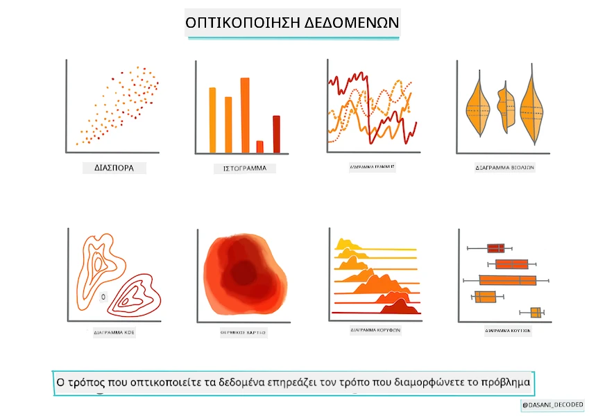
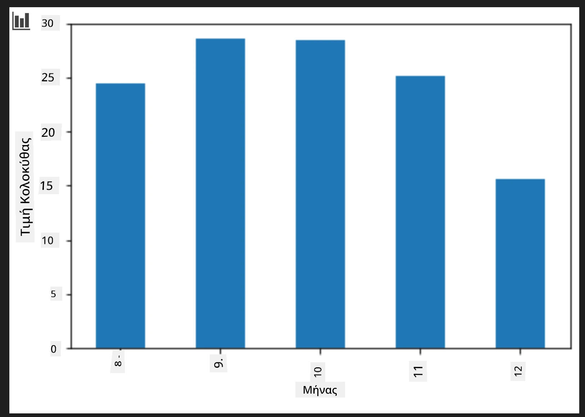
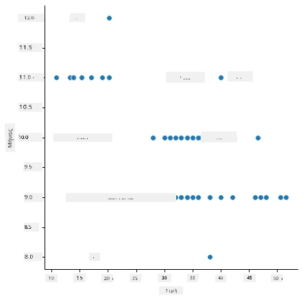
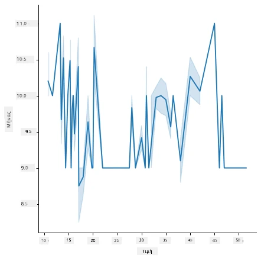
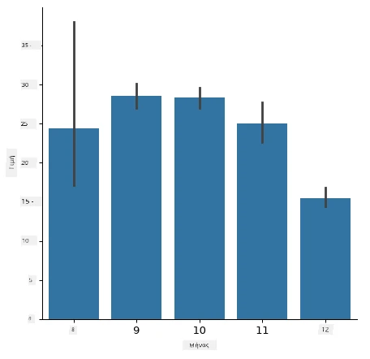
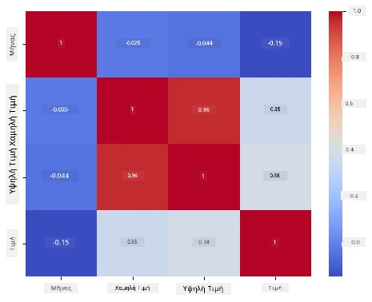

# Δημιουργήστε ένα μοντέλο παλινδρόμησης χρησιμοποιώντας το Scikit-learn: προετοιμάστε και οπτικοποιήστε δεδομένα



Ενημερωτική εικόνα από τον/την [Dasani Madipalli](https://twitter.com/dasani_decoded)

## [Προ της διάλεξης κουίζ](https://ff-quizzes.netlify.app/en/ml/)

> ### [Αυτό το μάθημα είναι διαθέσιμο και σε R!](../../../../2-Regression/2-Data/solution/R/lesson_2.html)

## Εισαγωγή

Τώρα που έχετε εξοπλιστεί με τα εργαλεία που χρειάζεστε για να ξεκινήσετε την κατασκευή μοντέλων μηχανικής μάθησης με το Scikit-learn, είστε έτοιμοι να αρχίσετε να κάνετε ερωτήσεις στα δεδομένα σας. Καθώς εργάζεστε με δεδομένα και εφαρμόζετε λύσεις ML, είναι πολύ σημαντικό να κατανοήσετε πώς να κάνετε τη σωστή ερώτηση για να ξεκλειδώσετε σωστά τις δυνατότητες του συνόλου δεδομένων σας.

Σε αυτό το μάθημα, θα μάθετε:

- Πώς να προετοιμάσετε τα δεδομένα σας για την κατασκευή μοντέλου.
- Πώς να χρησιμοποιήσετε το Matplotlib για οπτικοποίηση δεδομένων.
- Πώς να χρησιμοποιήσετε το Seaborn για πιο εκφραστική οπτικοποίηση δεδομένων.

## Να κάνετε τη σωστή ερώτηση για τα δεδομένα σας

Η ερώτηση που χρειάζεστε να απαντηθεί θα καθορίσει τον τύπο των αλγορίθμων ML που θα χρησιμοποιήσετε. Και η ποιότητα της απάντησης που θα λάβετε θα εξαρτηθεί σε μεγάλο βαθμό από τη φύση των δεδομένων σας.

Ρίξτε μια ματιά στα [δεδομένα](https://github.com/microsoft/ML-For-Beginners/blob/main/2-Regression/data/US-pumpkins.csv) που παρέχονται για αυτό το μάθημα. Μπορείτε να ανοίξετε αυτό το αρχείο .csv στο VS Code. Μια γρήγορη ματιά δείχνει αμέσως ότι υπάρχουν κενά και ένας συνδυασμός χαρακτήρων και αριθμητικών δεδομένων. Υπάρχει επίσης μια παράξενη στήλη που ονομάζεται 'Package', όπου τα δεδομένα είναι ένας συνδυασμός μεταξύ 'sacks', 'bins' και άλλων τιμών. Τα δεδομένα, στην πραγματικότητα, είναι λίγο μπερδεμένα.

[](https://youtu.be/5qGjczWTrDQ "ML για αρχάριους - Πώς να Αναλύσετε και να Καθαρίσετε ένα Σύνολο Δεδομένων")

> 🎥 Κάντε κλικ στην παραπάνω εικόνα για ένα σύντομο βίντεο που δείχνει την προετοιμασία των δεδομένων για αυτό το μάθημα.

Στην πραγματικότητα, δεν είναι πολύ συνηθισμένο να σας δίνονται δεδομένα που είναι έτοιμα να χρησιμοποιηθούν κατευθείαν για τη δημιουργία ενός μοντέλου ML. Σε αυτό το μάθημα, θα μάθετε πώς να προετοιμάζετε ένα ακατέργαστο σύνολο δεδομένων χρησιμοποιώντας τυπικές βιβλιοθήκες Python. Θα μάθετε επίσης διάφορες τεχνικές για να οπτικοποιήσετε τα δεδομένα.

## Μελέτη περίπτωσης: 'η αγορά κολοκύθας'

Σε αυτόν τον φάκελο θα βρείτε ένα αρχείο .csv στο βασικό φάκελο `data` με το όνομα [US-pumpkins.csv](https://github.com/microsoft/ML-For-Beginners/blob/main/2-Regression/data/US-pumpkins.csv) που περιλαμβάνει 1757 γραμμές δεδομένων για την αγορά κολοκύθας, ταξινομημένα ανά πόλη. Αυτά είναι ακατέργαστα δεδομένα που εξήχθησαν από τις [Ειδικές Αναφορές των Χονδρεμπόρων Αγροτικών Προϊόντων](https://www.marketnews.usda.gov/mnp/fv-report-config-step1?type=termPrice) που διανέμονται από το Υπουργείο Γεωργίας των Ηνωμένων Πολιτειών.

### Προετοιμασία δεδομένων

Αυτά τα δεδομένα βρίσκονται στο δημόσιο τομέα. Μπορούν να ληφθούν σε πολλά ξεχωριστά αρχεία, ανά πόλη, από τον ιστότοπο του USDA. Για να αποφύγουμε πολλά ξεχωριστά αρχεία, έχουμε συγχωνεύσει όλα τα δεδομένα των πόλεων σε ένα υπολογιστικό φύλλο, έτσι έχουμε ήδη _προετοιμάσει_ λίγο τα δεδομένα. Στη συνέχεια, ας ρίξουμε μια πιο προσεκτική ματιά στα δεδομένα.

### Τα δεδομένα της κολοκύθας - πρώτα συμπεράσματα

Τι παρατηρείτε σχετικά με αυτά τα δεδομένα; Έχετε ήδη δει ότι υπάρχει ένας συνδυασμός χαρακτήρων, αριθμών, κενών και περίεργων τιμών που πρέπει να ερμηνεύσετε.

Τι ερώτηση μπορείτε να κάνετε για αυτά τα δεδομένα, χρησιμοποιώντας τεχνική Παλινδρόμησης; Τι θα λέγατε για "Πρόβλεψη της τιμής μιας κολοκύθας προς πώληση κατά τη διάρκεια ενός συγκεκριμένου μήνα"; Κοιτώντας ξανά τα δεδομένα, υπάρχουν κάποιες αλλαγές που πρέπει να κάνετε ώστε να δημιουργήσετε τη δομή δεδομένων που απαιτείται για αυτήν την εργασία.
## Άσκηση - αναλύστε τα δεδομένα της κολοκύθας

Ας χρησιμοποιήσουμε το [Pandas](https://pandas.pydata.org/) (το όνομα σημαίνει `Python Data Analysis`), ένα πολύ χρήσιμο εργαλείο για τη μορφοποίηση δεδομένων, για να αναλύσουμε και να προετοιμάσουμε αυτά τα δεδομένα κολοκύθας.

### Πρώτα, ελέγξτε για λείπουνες ημερομηνίες

Πρώτα πρέπει να πάρετε μέτρα για να ελέγξετε αν λείπουν ημερομηνίες:

1. Μετατρέψτε τις ημερομηνίες σε μορφή μήνα (οι ημερομηνίες είναι αμερικανικές, οπότε η μορφή είναι `MM/DD/YYYY`).
2. Εξαγάγετε τον μήνα σε μια νέα στήλη.

Ανοίξτε το αρχείο _notebook.ipynb_ στο Visual Studio Code και εισάγετε το υπολογιστικό φύλλο σε ένα νέο dataframe του Pandas.

1. Χρησιμοποιήστε τη συνάρτηση `head()` για να δείτε τις πρώτες πέντε γραμμές.

    ```python
    import pandas as pd
    pumpkins = pd.read_csv('../data/US-pumpkins.csv')
    pumpkins.head()
    ```

    ✅ Ποια συνάρτηση θα χρησιμοποιούσατε για να δείτε τις τελευταίες πέντε γραμμές;

1. Ελέγξτε αν υπάρχουν κενά δεδομένα στο τρέχον dataframe:

    ```python
    pumpkins.isnull().sum()
    ```

    Υπάρχουν κενά δεδομένα, αλλά ίσως να μην έχουν σημασία για την εργασία αυτή.

1. Για να κάνετε το dataframe πιο εύκολο στη χρήση, επιλέξτε μόνο τις στήλες που χρειάζεστε, χρησιμοποιώντας τη συνάρτηση `loc` η οποία εξάγει από το αρχικό dataframe μια ομάδα γραμμών (περασμένη ως πρώτη παράμετρος) και στηλών (περασμένη ως δεύτερη παράμετρος). Η έκφραση `:` στην παρακάτω περίπτωση σημαίνει "όλες οι γραμμές".

    ```python
    columns_to_select = ['Package', 'Low Price', 'High Price', 'Date']
    pumpkins = pumpkins.loc[:, columns_to_select]
    ```

### Δεύτερον, προσδιορίστε τη μέση τιμή της κολοκύθας

Σκεφτείτε πώς να προσδιορίσετε τη μέση τιμή μιας κολοκύθας σε έναν συγκεκριμένο μήνα. Ποιες στήλες θα επιλέγατε για αυτήν την εργασία; Υπόδειξη: θα χρειαστείτε 3 στήλες.

Λύση: πάρτε το μέσο όρο των στηλών `Low Price` και `High Price` για να γεμίσετε τη νέα στήλη Τιμή, και μετατρέψτε τη στήλη Ημερομηνία έτσι ώστε να δείχνει μόνο τον μήνα. Ευτυχώς, σύμφωνα με τον παραπάνω έλεγχο, δεν υπάρχουν κενά δεδομένα για τις ημερομηνίες ή τις τιμές.

1. Για να υπολογίσετε το μέσο όρο, προσθέστε τον ακόλουθο κώδικα:

    ```python
    price = (pumpkins['Low Price'] + pumpkins['High Price']) / 2

    month = pd.DatetimeIndex(pumpkins['Date']).month

    ```

   ✅ Μπορείτε να εκτυπώσετε οποιαδήποτε δεδομένα θέλετε να ελέγξετε χρησιμοποιώντας `print(month)`.

2. Τώρα, αντιγράψτε τα μετατρεπόμενα δεδομένα σας σε ένα νέο dataframe του Pandas:

    ```python
    new_pumpkins = pd.DataFrame({'Month': month, 'Package': pumpkins['Package'], 'Low Price': pumpkins['Low Price'],'High Price': pumpkins['High Price'], 'Price': price})
    ```

    Η εκτύπωση του dataframe σας θα δείξει ένα καθαρό, τακτοποιημένο σύνολο δεδομένων πάνω στο οποίο μπορείτε να χτίσετε το νέο σας μοντέλο παλινδρόμησης.

### Αλλά περιμένετε! Υπάρχει κάτι παράξενο εδώ

Αν κοιτάξετε τη στήλη `Package`, οι κολοκύθες πωλούνται σε πολλές διαφορετικές διαμορφώσεις. Κάποιες πωλούνται σε μετρήσεις '1 1/9 bushel' και κάποιες σε '1/2 bushel', κάποιες ανά κολοκύθα, κάποιες ανά λίβρα και κάποιες σε μεγάλες κούτες με διαφορετικά πλάτη.

> Φαίνεται πολύ δύσκολο να ζυγίσεις τις κολοκύθες με συνέπεια

Βαθύτερη ανάλυση των αρχικών δεδομένων δείχνει ότι οτιδήποτε με `Unit of Sale` ίσο με 'EACH' ή 'PER BIN' έχει επίσης τον τύπο `Package` ανά ίντσα, ανά κουτί ή 'καθένα'. Φαίνεται ότι οι κολοκύθες είναι πολύ δύσκολο να ζυγιστούν ομοιόμορφα, οπότε φιλτράρουμε επιλέγοντας μόνο τις κολοκύθες με τη λέξη 'bushel' στη στήλη `Package`.

1. Προσθέστε ένα φίλτρο στην κορυφή του αρχείου, κάτω από την αρχική εισαγωγή .csv:

    ```python
    pumpkins = pumpkins[pumpkins['Package'].str.contains('bushel', case=True, regex=True)]
    ```

    Αν εκτυπώσετε τα δεδομένα τώρα, μπορείτε να δείτε ότι λαμβάνετε μόνο τις περίπου 415 γραμμές δεδομένων που περιέχουν κολοκύθες ανά bushel.

### Αλλά περιμένετε! Υπάρχει ακόμα ένα πράγμα να κάνετε

Παρατηρήσατε ότι η ποσότητα του bushel διαφέρει ανά γραμμή; Πρέπει να ομαλοποιήσετε τις τιμές, ώστε να δείχνετε την τιμή ανά bushel, οπότε κάντε κάποιους υπολογισμούς για να το τυποποιήσετε.

1. Προσθέστε αυτές τις γραμμές μετά το μπλοκ που δημιουργεί το νέο dataframe new_pumpkins:

    ```python
    new_pumpkins.loc[new_pumpkins['Package'].str.contains('1 1/9'), 'Price'] = price/(1 + 1/9)

    new_pumpkins.loc[new_pumpkins['Package'].str.contains('1/2'), 'Price'] = price/(1/2)
    ```

✅ Σύμφωνα με το [The Spruce Eats](https://www.thespruceeats.com/how-much-is-a-bushel-1389308), το βάρος ενός bushel εξαρτάται από τον τύπο του προϊόντος, καθώς είναι μέτρηση όγκου. "Ένα bushel ντομάτες, για παράδειγμα, υποτίθεται ότι ζυγίζει 56 λίβρες... Τα φύλλα και τα χόρτα καταλαμβάνουν περισσότερο χώρο με λιγότερο βάρος, οπότε ένα bushel σπανάκι ζυγίζει μόνο 20 λίβρες." Όλα αυτά είναι αρκετά περίπλοκα! Ας μην ασχοληθούμε με μετατροπή bushel-σε-λίβρα, αλλά ας τιμολογήσουμε ανά bushel. Όλη αυτή η μελέτη για τα bushels κολοκύθας, όμως, δείχνει πόσο σημαντικό είναι να κατανοήσετε τη φύση των δεδομένων σας!

Τώρα, μπορείτε να αναλύσετε την τιμολόγηση ανά μονάδα βάσει του μέτρηματός τους σε bushel. Αν εκτυπώσετε ξανά τα δεδομένα, μπορείτε να δείτε πώς έχουν τυποποιηθεί.

✅ Παρατηρήσατε ότι οι κολοκύθες που πωλούνται ως μισό bushel είναι πολύ ακριβές; Μπορείτε να καταλάβετε γιατί; Υπόδειξη: οι μικρές κολοκύθες είναι πολύ πιο ακριβές από τις μεγάλες, πιθανώς επειδή υπάρχουν πολύ περισσότερες από αυτές ανά bushel, λόγω του αχρησιμοποίητου χώρου που καταλαμβάνει μία μεγάλη κολοκύθα-πίτα.

## Στρατηγικές Οπτικοποίησης

Μέρος του ρόλου του επιστήμονα δεδομένων είναι να αποδείξει την ποιότητα και τη φύση των δεδομένων με τα οποία εργάζεται. Για να το κάνουν αυτό, συχνά δημιουργούν ενδιαφέρουσες οπτικοποιήσεις, ή γραφήματα, διαγράμματα και πίνακες, που δείχνουν διαφορετικές πλευρές των δεδομένων. Με αυτόν τον τρόπο, μπορούν να δείξουν οπτικά σχέσεις και κενά που αλλιώς είναι δύσκολο να ανακαλυφθούν.

[](https://youtu.be/SbUkxH6IJo0 "ML για αρχάριους - Πώς να Οπτικοποιήσετε Δεδομένα με το Matplotlib")

> 🎥 Κάντε κλικ στην παραπάνω εικόνα για ένα σύντομο βίντεο που δείχνει την οπτικοποίηση των δεδομένων για αυτό το μάθημα.

Οι οπτικοποιήσεις μπορούν επίσης να βοηθήσουν στον καθορισμό της πιο κατάλληλης τεχνικής μηχανικής μάθησης για τα δεδομένα. Ένα διάγραμμα διασποράς που φαίνεται να ακολουθεί μια γραμμή, για παράδειγμα, δείχνει ότι τα δεδομένα είναι καλός υποψήφιος για άσκηση γραμμικής παλινδρόμησης.

Μια βιβλιοθήκη οπτικοποίησης δεδομένων που λειτουργεί καλά σε σημειωματάρια Jupyter είναι το [Matplotlib](https://matplotlib.org/) (το οποίο είδατε επίσης στο προηγούμενο μάθημα).

> Αποκτήστε περισσότερη εμπειρία με την οπτικοποίηση δεδομένων σε [αυτά τα tutorial](https://docs.microsoft.com/learn/modules/explore-analyze-data-with-python?WT.mc_id=academic-77952-leestott).

## Άσκηση - πειραματιστείτε με το Matplotlib

Προσπαθήστε να δημιουργήσετε μερικά βασικά διαγράμματα για να εμφανίσετε το νέο dataframe που μόλις δημιουργήσατε. Τι θα έδειχνε ένα βασικό διάγραμμα γραμμής;

1. Εισάγετε το Matplotlib στην κορυφή του αρχείου, κάτω από την εισαγωγή του Pandas:

    ```python
    import matplotlib.pyplot as plt
    ```

1. Εκτελέστε ξανά ολόκληρο το σημειωματάριο για ανανέωση.
1. Στο κάτω μέρος του σημειωματάριου, προσθέστε ένα κελί για να σχεδιάσετε τα δεδομένα ως κουτί:

    ```python
    price = new_pumpkins.Price
    month = new_pumpkins.Month
    plt.scatter(price, month)
    plt.show()
    ```

    

    Είναι αυτό ένα χρήσιμο διάγραμμα; Σας εκπλήσσει κάτι σε αυτό;

    Δεν είναι ιδιαίτερα χρήσιμο καθώς απλά εμφανίζει τα δεδομένα σας ως μια διασπορά σημείων σε έναν συγκεκριμένο μήνα.

### Κάντε το χρήσιμο

Για να εμφανίσετε χρήσιμα δεδομένα στα διαγράμματα, συνήθως πρέπει να ομαδοποιήσετε τα δεδομένα με κάποιο τρόπο. Ας δοκιμάσουμε να δημιουργήσουμε ένα διάγραμμα όπου ο άξονας y δείχνει τους μήνες και τα δεδομένα δείχνουν την κατανομή τους.

1. Προσθέστε ένα κελί για να δημιουργήσετε ένα ομαδοποιημένο ραβδόγραμμα:

    ```python
    new_pumpkins.groupby(['Month'])['Price'].mean().plot(kind='bar')
    plt.ylabel("Pumpkin Price")
    ```

    

    Αυτή είναι μια πιο χρήσιμη οπτικοποίηση δεδομένων! Φαίνεται να δείχνει ότι η υψηλότερη τιμή για τις κολοκύθες εμφανίζεται τον Σεπτέμβριο και τον Οκτώβρη. Συμφωνεί με τις προσδοκίες σας; Γιατί ή γιατί όχι;

## Άσκηση - πειραματιστείτε με το Seaborn

Το Matplotlib είναι ισχυρό, αλλά μπορεί να χρειαστεί αρκετός κώδικας για να παραχθεί ένα ολοκληρωμένο διάγραμμα. Το [Seaborn](https://seaborn.pydata.org/) είναι μια βιβλιοθήκη που έχει φτιαχτεί _πάνω από_ το Matplotlib και είναι σχεδιασμένη για στατιστική οπτικοποίηση δεδομένων. Λειτουργεί άμεσα με dataframes του Pandas, εφαρμόζει ελκυστικά προεπιλεγμένα στυλ και σας επιτρέπει να δημιουργήσετε ενημερωτικά διαγράμματα με πολύ λιγότερο κώδικα. Επειδή το Seaborn επιστρέφει αντικείμενα του Matplotlib, μπορείτε ακόμα να χρησιμοποιήσετε όσα ήδη γνωρίζετε για το Matplotlib για να βελτιώσετε το αποτέλεσμα.

> Αν δεν έχετε ήδη εγκαταστήσει το Seaborn, εγκαταστήστε το με `pip install seaborn`.

1. Εισάγετε το Seaborn στην κορυφή του σημειωματάριου, κάτω από τις άλλες εισαγωγές. Συμβατικά εισάγεται ως `sns`:

    ```python
    import seaborn as sns
    ```

### Διαγράμματα διασποράς για να δείξετε σχέσεις

Ένα μεγάλο μέρος της εξερεύνησης των δεδομένων πριν από την κατασκευή μοντέλου είναι η αναζήτηση _σχέσεων_ μεταξύ μεταβλητών. Ένα [διάγραμμα διασποράς](https://en.wikipedia.org/wiki/Scatter_plot) είναι ένα από τα καλύτερα εργαλεία γι’ αυτό: αν τα σημεία φαίνονται να ακολουθούν μια γραμμή, οι δύο μεταβλητές μπορεί να είναι συσχετισμένες, κάτι που είναι σημάδι ότι ένα μοντέλο γραμμικής παλινδρόμησης μπορεί να λειτουργήσει.

1. Αναδημιουργήστε το διάγραμμα διασποράς τιμής προς μήνα από πριν, αυτή τη φορά χρησιμοποιώντας το [`relplot()`](https://seaborn.pydata.org/generated/seaborn.relplot.html) του Seaborn (διάγραμμα συσχέτισης), που λειτουργεί απευθείας με τις στήλες του dataframe σας:

    ```python
    sns.relplot(x="Price", y="Month", data=new_pumpkins)
    ```

    

    Παρατηρήστε πώς περνάτε τα _ονόματα των στηλών_ και το dataframe, και το Seaborn φροντίζει για τις ετικέτες των αξόνων για εσάς.

2. Μπορείτε να αλλάξετε σε διάγραμμα γραμμής περνώντας `kind="line"`. Το Seaborn σχεδιάζει ακόμη και μια σκιασμένη ζώνη που δείχνει το διάστημα εμπιστοσύνης γύρω από τη γραμμή:

    ```python
    sns.relplot(x="Price", y="Month", kind="line", data=new_pumpkins)
    ```

    

    Αυτά τα συγκεκριμένα δεδομένα είναι αρκετά θορυβώδη, οπότε ένα διάγραμμα γραμμής δεν είναι η πιο καθαρή επιλογή εδώ — αλλά δείχνει πόσο εύκολα μπορείτε να αλλάξετε τύπους διαγραμμάτων στο Seaborn.

### Ραβδόγραμμα για να δείξετε κατανομές

Νωρίτερα ομαδοποιήσατε τα δεδομένα χειροκίνητα για να δημιουργήσετε ένα ραβδόγραμμα με το Matplotlib. Το [`catplot()`](https://seaborn.pydata.org/generated/seaborn.catplot.html) του Seaborn (κατηγοριοποιημένο διάγραμμα) μπορεί να κάνει την ομαδοποίηση και τη συσσωμάτωση για εσάς. Από προεπιλογή, `kind="bar"` δείχνει τον μέσο όρο κάθε κατηγορίας μαζί με μια μαύρη γραμμή που υποδεικνύει το διάστημα εμπιστοσύνης.

1. Δημιουργήστε ένα ραβδόγραμμα μέσης τιμής ανά μήνα:

    ```python
    sns.catplot(x="Month", y="Price", data=new_pumpkins, kind="bar")
    ```

    

    Αυτό επιβεβαιώνει όσα είδατε με το Matplotlib — οι τιμές κορυφώνονται γύρω στους μήνες Σεπτέμβριο και Οκτώβριο — αλλά το Seaborn απεικονίζει επίσης πόσο _διαφέρει_ η τιμή μέσα σε κάθε μήνα.

### Θερμικοί χάρτες για να δείξουν συσχετίσεις

Τα διαγράμματα διασποράς συγκρίνουν δύο μεταβλητές κάθε φορά. Όταν έχετε αρκετές αριθμητικές στήλες, ένας [θερμικός χάρτης](https://en.wikipedia.org/wiki/Heat_map) σας επιτρέπει να δείτε τη δύναμη της σχέσης μεταξύ _κάθε_ ζεύγους στηλών ταυτόχρονα. Αυτός είναι ένας κοινός τρόπος να εντοπίσετε ποιες ιδιότητες είναι πιο συσχετισμένες πριν επιλέξετε τι θα δώσετε σε ένα μοντέλο (και ο ίδιος τύπος διαγράμματος χρησιμοποιείται αργότερα για να εμφανίσει πίνακες σύγχυσης στην ταξινόμηση).

1. Δημιουργήστε έναν πίνακα συσχέτισης με Pandas και μετά σχεδιάστε τον με το [`heatmap()`](https://seaborn.pydata.org/generated/seaborn.heatmap.html) του Seaborn. Η επιλογή `annot=True` εκτυπώνει τις τιμές συσχέτισης σε κάθε κελί:

    ```python
    correlations = new_pumpkins[['Month', 'Low Price', 'High Price', 'Price']].corr()
    sns.heatmap(correlations, annot=True, cmap="coolwarm")
    ```

    

    Τιμές κοντά στο `1` (ή το `-1`) σημαίνουν ότι οι στήλες είναι ισχυρά _γραμμικά_ συσχετισμένες. Παρατηρήστε πώς οι `Χαμηλή Τιμή` και `Υψηλή Τιμή` σχετίζονται σχεδόν τέλεια. Από την άλλη πλευρά, ο `Μήνας` δείχνει μόνο ασθενή γραμμική συσχέτιση με την τιμή — παρόλο που το ραβδόγραμμα πιο πάνω αποκάλυψε μια σαφή εποχιακή κορύφωση τον Σεπτέμβριο και τον Οκτώβριο. Αυτό είναι ένα σημαντικό μάθημα: ο συντελεστής συσχέτισης μετρά μόνο _ευθείες_ σχέσεις, οπότε μπορεί να παραβλέψει εποχιακά ή άλλου τύπου μη γραμμικά μοτίβα. ✅ Γιατί είναι χρήσιμο να κοιτάμε τόσο έναν θερμικό χάρτη *όσο* και διαγράμματα όπως το ραβδόγραμμα πριν αποφασίσουμε ποιες στήλες θα χρησιμοποιήσουμε;

### Matplotlib ή Seaborn;

Και οι δύο βιβλιοθήκες αξίζουν να τις γνωρίζετε:

- **Matplotlib** σας δίνει λεπτομερή έλεγχο σε κάθε στοιχείο ενός διαγράμματος και είναι η βάση πάνω στην οποία στηρίζεται σχεδόν κάθε άλλη βιβλιοθήκη γραφικών Python.
- **Seaborn** παρέχει λειτουργίες υψηλότερου επιπέδου και ελκυστικές προεπιλογές για στατιστικά διαγράμματα, δουλεύει απευθείας με dataframes και είναι συχνά πιο γρήγορο για εξερευνητική ανάλυση δεδομένων.

Μια κοινή ροή εργασίας είναι να χρησιμοποιείτε το Seaborn για να εξερευνήσετε γρήγορα τα δεδομένα σας και μετά να περάσετε στο Matplotlib όταν χρειάζεται να προσαρμόσετε τις λεπτομέρειες.

---

## 🚀Πρόκληση

Εξερευνήστε τους διάφορους τύπους οπτικοποίησης που προσφέρουν το Matplotlib και το Seaborn. Ποιοι τύποι είναι πιο κατάλληλοι για προβλήματα παλινδρόμησης;

## [Κουίζ μετά τη διάλεξη](https://ff-quizzes.netlify.app/en/ml/)

## Επανεξέταση & Αυτοδιδασκαλία

Ρίξτε μια ματιά στους πολλούς τρόπους οπτικοποίησης δεδομένων. Φτιάξτε μια λίστα με τις διάφορες διαθέσιμες βιβλιοθήκες και σημειώστε ποιες είναι οι καλύτερες για συγκεκριμένους τύπους εργασιών, για παράδειγμα 2D έναντι 3D οπτικοποιήσεων. Τι ανακαλύπτετε;

## Εργασία

[Εξερεύνηση της οπτικοποίησης](assignment.md)

---

<!-- CO-OP TRANSLATOR DISCLAIMER START -->
**Αποποίηση ευθυνών**:
Αυτό το έγγραφο έχει μεταφραστεί χρησιμοποιώντας την υπηρεσία μετάφρασης με τεχνητή νοημοσύνη [Co-op Translator](https://github.com/Azure/co-op-translator). Ενώ επιδιώκουμε την ακρίβεια, παρακαλούμε να έχετε υπόψη ότι οι αυτοματοποιημένες μεταφράσεις ενδέχεται να περιέχουν λάθη ή ανακρίβειες. Το πρωτότυπο έγγραφο στη μητρική του γλώσσα πρέπει να θεωρείται η αυθεντική πηγή. Για κρίσιμες πληροφορίες, συνιστάται επαγγελματική ανθρώπινη μετάφραση. Δεν φέρουμε ευθύνη για τυχόν παρεξηγήσεις ή λανθασμένες ερμηνείες που προκύπτουν από τη χρήση αυτής της μετάφρασης.
<!-- CO-OP TRANSLATOR DISCLAIMER END -->