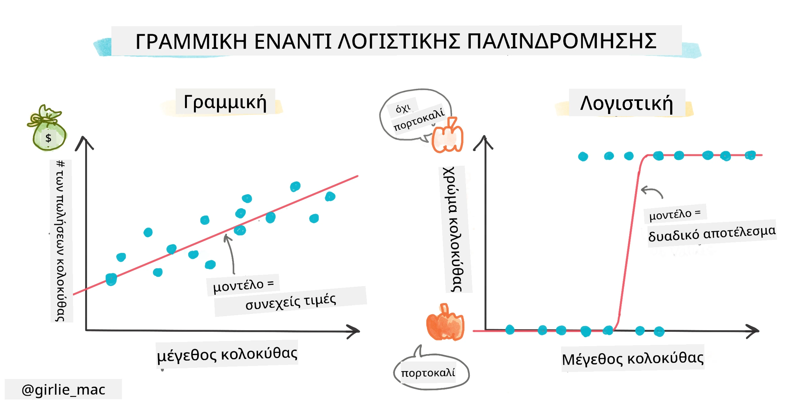
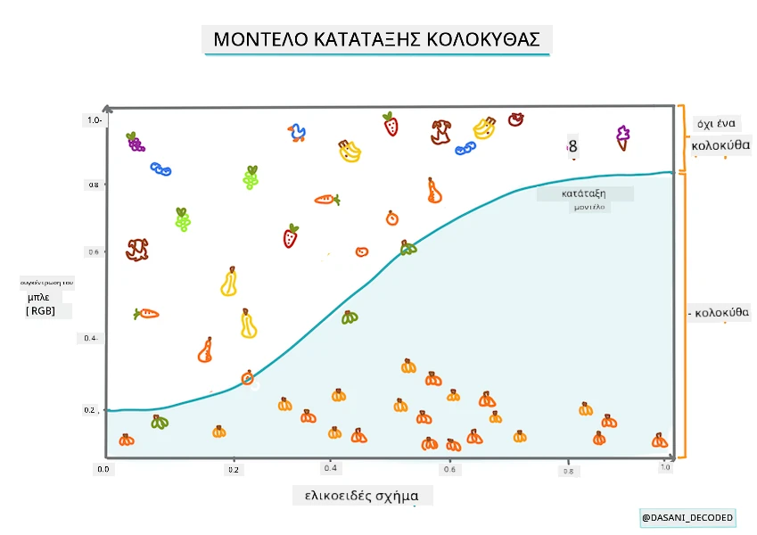
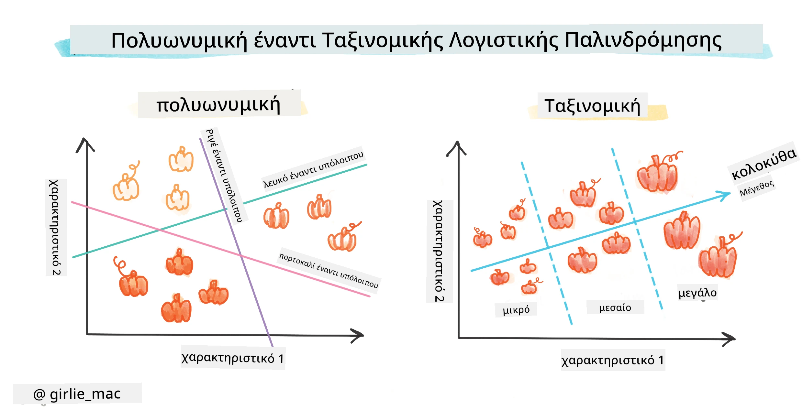
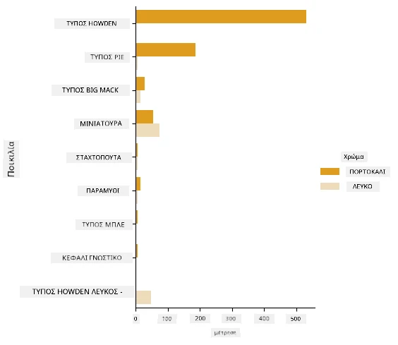
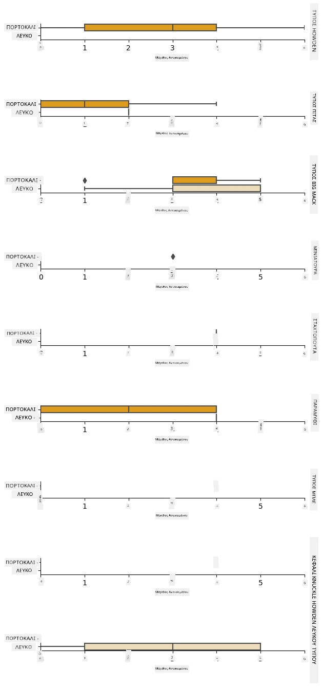
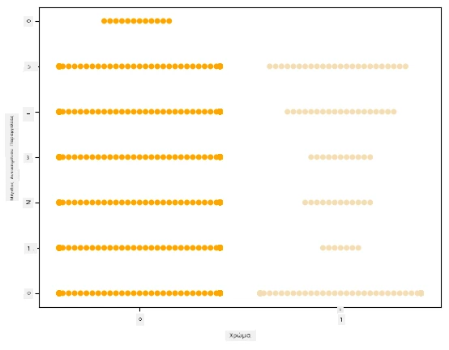
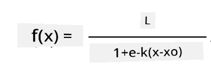
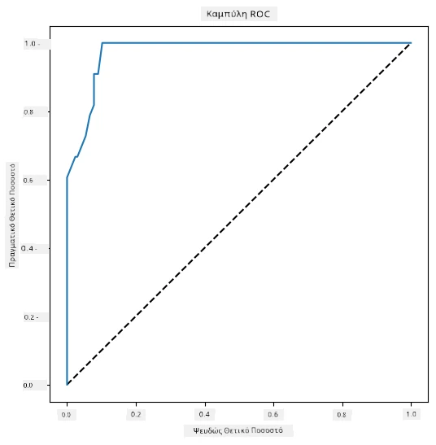

# Λογιστική παλινδρόμηση για την πρόβλεψη κατηγοριών



## [Κουίζ προ-διάλεξης](https://ff-quizzes.netlify.app/en/ml/)

> ### [Αυτό το μάθημα είναι διαθέσιμο σε R!](../../../../2-Regression/4-Logistic/solution/R/lesson_4.html)

## Εισαγωγή

Σε αυτό το τελευταίο μάθημα για την Παλινδρόμηση, μία από τις βασικές _κλασικές_ τεχνικές μηχανικής μάθησης, θα δούμε τη Λογιστική Παλινδρόμηση. Θα χρησιμοποιούσατε αυτή την τεχνική για να ανακαλύψετε μοτίβα για να προβλέψετε δυαδικές κατηγορίες. Είναι αυτή η καραμέλα σοκολάτα ή όχι; Είναι αυτή η ασθένεια μεταδοτική ή όχι; Θα επιλέξει αυτός ο πελάτης αυτό το προϊόν ή όχι;

Σε αυτό το μάθημα, θα μάθετε:

- Μια νέα βιβλιοθήκη για οπτικοποίηση δεδομένων
- Τεχνικές για λογιστική παλινδρόμηση

✅ Εμβαθύνετε την κατανόηση της εργασίας με αυτό τον τύπο παλινδρόμησης σε αυτό το [Μάθημα Learn](https://docs.microsoft.com/learn/modules/train-evaluate-classification-models?WT.mc_id=academic-77952-leestott)

## Προαπαιτούμενο

Έχοντας εργαστεί με τα δεδομένα κολοκύθας, τώρα είμαστε αρκετά εξοικειωμένοι με αυτά ώστε να καταλάβουμε ότι υπάρχει μια δυαδική κατηγορία με την οποία μπορούμε να δουλέψουμε: `Color`.

Ας δημιουργήσουμε ένα μοντέλο λογιστικής παλινδρόμησης για να προβλέψουμε, δεδομένων ορισμένων μεταβλητών, _ποιο χρώμα είναι πιθανό να έχει μια δεδομένη κολοκύθα_ (πορτοκαλί 🎃 ή λευκή 👻).

> Γιατί μιλάμε για δυαδική ταξινόμηση σε ένα μάθημα που αφορά την παλινδρόμηση; Απλά για γλωσσική ευκολία, καθώς η λογιστική παλινδρόμηση είναι [στην πραγματικότητα μέθοδος ταξινόμησης](https://scikit-learn.org/stable/modules/linear_model.html#logistic-regression), έστω και βασισμένη στη γραμμική παλινδρόμηση. Μάθετε για άλλους τρόπους ταξινόμησης δεδομένων στην επόμενη ομάδα μαθημάτων.

## Ορισμός του ερωτήματος

Για τους σκοπούς μας, θα το εκφράσουμε ως δυαδικό: 'Λευκό' ή 'Όχι Λευκό'. Υπάρχει επίσης μια κατηγορία 'ριγέ' στον πίνακά μας, αλλά υπάρχουν λίγα παραδείγματα, οπότε δεν θα την χρησιμοποιήσουμε. Καταλήγει να εξαφανίζεται όταν αφαιρούμε τις κενές τιμές από το dataset, ούτως ή άλλως.

> 🎃 Διασκεδαστικό γεγονός, μερικές φορές αποκαλούμε τις λευκές κολοκύθες 'φαντάσματα'. Δεν είναι πολύ εύκολο να τις χαράξεις, γι' αυτό δεν είναι τόσο δημοφιλείς όσο οι πορτοκαλί, αλλά έχουν ωραία εμφάνιση! Μπορούμε επίσης να αναδιατυπώσουμε την ερώτηση ως: 'Φάντασμα' ή 'Όχι Φάντασμα'. 👻

## Σχετικά με τη λογιστική παλινδρόμηση

Η λογιστική παλινδρόμηση διαφέρει από τη γραμμική παλινδρόμηση, που μάθατε προηγουμένως, σε κάποιους σημαντικούς τρόπους.

[](https://youtu.be/KpeCT6nEpBY "Μηχανική Μάθηση για αρχάριους - Κατανόηση της λογιστικής παλινδρόμησης για ταξινόμηση μηχανικής μάθησης")

> 🎥 Κάντε κλικ στην εικόνα παραπάνω για μια σύντομη επισκόπηση βίντεο της λογιστικής παλινδρόμησης.

### Δυαδική ταξινόμηση

Η λογιστική παλινδρόμηση δεν προσφέρει τις ίδιες λειτουργίες όπως η γραμμική παλινδρόμηση. Η πρώτη δίνει πρόβλεψη για μια δυαδική κατηγορία ("λευκό ή όχι λευκό") ενώ η δεύτερη μπορεί να προβλέψει συνεχή τιμές, για παράδειγμα δεδομένης της προέλευσης μιας κολοκύθας και της εποχής συγκομιδής, _πόσο θα ανέβει η τιμή της_.


> Infographic από [Dasani Madipalli](https://twitter.com/dasani_decoded)

### Άλλες ταξινομήσεις

Υπάρχουν και άλλοι τύποι λογιστικής παλινδρόμησης, όπως η πολυωνυμική και η διατακτική:

- **Πολυωνυμική**, που αφορά περισσότερες από μία κατηγορίες - "Πορτοκαλί, Λευκό, και Ριγέ".
- **Διατακτική**, που αφορά κατηγορίες με σειρά, χρήσιμη αν θέλαμε να ταξινομήσουμε τα αποτελέσματα λογικά, όπως οι κολοκύθες μας που ταξινομούνται σε πεπερασμένο αριθμό μεγεθών (μίνι, μικρή, μέση, μεγάλη, πολύ μεγάλη, τεράστια).



### Οι μεταβλητές ΔΕΝ χρειάζεται να συσχετίζονται

Θυμάστε πώς η γραμμική παλινδρόμηση λειτουργούσε καλύτερα με πιο συσχετισμένες μεταβλητές; Η λογιστική παλινδρόμηση είναι το αντίθετο - οι μεταβλητές δεν χρειάζεται να ευθυγραμμίζονται. Αυτό λειτουργεί για αυτά τα δεδομένα που έχουν κάπως αδύναμους συσχετισμούς.

### Χρειάζεστε πολλά καθαρά δεδομένα

Η λογιστική παλινδρόμηση δίνει πιο ακριβή αποτελέσματα αν χρησιμοποιήσετε περισσότερα δεδομένα· το μικρό μας σύνολο δεδομένων δεν είναι ιδανικό για αυτήν την εργασία, οπότε να το έχετε υπόψη.

[](https://youtu.be/B2X4H9vcXTs "Μηχανική Μάθηση για αρχάριους - Ανάλυση και προετοιμασία δεδομένων για λογιστική παλινδρόμηση")

> 🎥 Κάντε κλικ στην εικόνα παραπάνω για μια σύντομη επισκόπηση βίντεο προετοιμασίας δεδομένων για γραμμική παλινδρόμηση

✅ Σκεφτείτε τους τύπους δεδομένων που θα ευνοούσαν τη λογιστική παλινδρόμηση

## Άσκηση - καθαρισμός δεδομένων

Πρώτα, καθαρίστε λίγο τα δεδομένα, αφαιρώντας τις κενές τιμές και επιλέγοντας μόνο μερικές από τις στήλες:

1. Προσθέστε τον ακόλουθο κώδικα:

    ```python
  
    columns_to_select = ['City Name','Package','Variety', 'Origin','Item Size', 'Color']
    pumpkins = full_pumpkins.loc[:, columns_to_select]

    pumpkins.dropna(inplace=True)
    ```

    Μπορείτε πάντα να ρίξετε μια ματιά στο νέο σας dataframe:

    ```python
    pumpkins.info
    ```

### Οπτικοποίηση - κατηγορηματικό γράφημα

Μέχρι τώρα έχετε φορτώσει ξανά το [αρχικό σημειωματάριο](./notebook.ipynb) με δεδομένα κολοκύθας και το έχετε καθαρίσει ώστε να διατηρήσετε ένα dataset με μερικές μεταβλητές, συμπεριλαμβανομένου του `Color`. Ας οπτικοποιήσουμε το dataframe στο σημειωματάριο χρησιμοποιώντας μια διαφορετική βιβλιοθήκη: [Seaborn](https://seaborn.pydata.org/index.html), που βασίζεται στο Matplotlib που χρησιμοποιήσαμε προηγουμένως.

Το Seaborn προσφέρει κάποιους ωραίους τρόπους να οπτικοποιήσετε τα δεδομένα σας. Για παράδειγμα, μπορείτε να συγκρίνετε τις κατανομές των δεδομένων για κάθε `Variety` και `Color` σε ένα κατηγορηματικό γράφημα.

1. Δημιουργήστε ένα τέτοιο γράφημα χρησιμοποιώντας τη λειτουργία `catplot`, χρησιμοποιώντας τα δεδομένα κολοκύθας `pumpkins`, και προσδιορίζοντας έναν χρωματικό χάρτη για κάθε κατηγορία κολοκύθας (πορτοκαλί ή λευκή):

    ```python
    import seaborn as sns
    
    palette = {
    'ORANGE': 'orange',
    'WHITE': 'wheat',
    }

    sns.catplot(
    data=pumpkins, y="Variety", hue="Color", kind="count",
    palette=palette, 
    )
    ```

    

    Παρατηρώντας τα δεδομένα, μπορείτε να δείτε πώς τα δεδομένα Χρώματος σχετίζονται με τη Ποικιλία.

    ✅ Δεδομένου αυτού του κατηγορηματικού γραφήματος, ποιες είναι μερικές ενδιαφέρουσες εξερευνήσεις που μπορείτε να φανταστείτε;

### Προεπεξεργασία δεδομένων: κωδικοποίηση χαρακτηριστικών και ετικετών
Το dataset κολοκύθας περιέχει τιμές κειμένου για όλες τις στήλες του. Η εργασία με κατηγορηματικά δεδομένα είναι διαισθητική για τους ανθρώπους αλλά όχι για τις μηχανές. Οι αλγόριθμοι μηχανικής μάθησης λειτουργούν καλά με αριθμούς. Γι' αυτό η κωδικοποίηση είναι ένα πολύ σημαντικό βήμα στη φάση προεπεξεργασίας δεδομένων, καθώς μας επιτρέπει να μετατρέψουμε κατηγορηματικά δεδομένα σε αριθμητικά, χωρίς να χάσουμε πληροφορίες. Καλή κωδικοποίηση οδηγεί στην κατασκευή ενός καλού μοντέλου.

Για την κωδικοποίηση χαρακτηριστικών υπάρχουν δύο κύριοι τύποι κωδικοποιητών:

1. Διατακτικός κωδικοποιητής: ταιριάζει καλά για διατακτικές μεταβλητές, που είναι κατηγορηματικές μεταβλητές όπου τα δεδομένα τους ακολουθούν μια λογική σειρά, όπως η στήλη `Item Size` στο dataset μας. Δημιουργεί ένα χάρτη έτσι ώστε κάθε κατηγορία να αντιπροσωπεύεται από έναν αριθμό, που είναι η σειρά της κατηγορίας στη στήλη.

    ```python
    from sklearn.preprocessing import OrdinalEncoder

    item_size_categories = [['sml', 'med', 'med-lge', 'lge', 'xlge', 'jbo', 'exjbo']]
    ordinal_features = ['Item Size']
    ordinal_encoder = OrdinalEncoder(categories=item_size_categories)
    ```

2. Κατηγορικός κωδικοποιητής: ταιριάζει καλά για ονομαστικές μεταβλητές, που είναι κατηγορηματικές μεταβλητές όπου τα δεδομένα τους δεν ακολουθούν λογική σειρά, όπως όλα τα χαρακτηριστικά εκτός της `Item Size` στο dataset μας. Είναι το one-hot encoding, που σημαίνει ότι κάθε κατηγορία αντιπροσωπεύεται από μια δυαδική στήλη: η κωδικοποιημένη μεταβλητή είναι ίση με 1 αν η κολοκύθα ανήκει σε αυτήν την Ποικιλία και 0 αλλιώς.

    ```python
    from sklearn.preprocessing import OneHotEncoder

    categorical_features = ['City Name', 'Package', 'Variety', 'Origin']
    categorical_encoder = OneHotEncoder(sparse_output=False)
    ```
Στη συνέχεια, ο `ColumnTransformer` χρησιμοποιείται για να συνδυάσει πολλούς κωδικοποιητές σε ένα βήμα και να τους εφαρμόσει στις κατάλληλες στήλες.

```python
    from sklearn.compose import ColumnTransformer
    
    ct = ColumnTransformer(transformers=[
        ('ord', ordinal_encoder, ordinal_features),
        ('cat', categorical_encoder, categorical_features)
        ])
    
    ct.set_output(transform='pandas')
    encoded_features = ct.fit_transform(pumpkins)
```
Από την άλλη πλευρά, για να κωδικοποιήσουμε την ετικέτα, χρησιμοποιούμε την κλάση `LabelEncoder` του scikit-learn, η οποία είναι μια βοηθητική κλάση για την κανονικοποίηση ετικετών ώστε να περιέχουν μόνο τιμές μεταξύ 0 και n_classes-1 (εδώ, 0 και 1).

```python
    from sklearn.preprocessing import LabelEncoder

    label_encoder = LabelEncoder()
    encoded_label = label_encoder.fit_transform(pumpkins['Color'])
```
Μόλις έχουμε κωδικοποιήσει τα χαρακτηριστικά και την ετικέτα, μπορούμε να τα συγχωνεύσουμε σε ένα νέο dataframe `encoded_pumpkins`.

```python
    encoded_pumpkins = encoded_features.assign(Color=encoded_label)
```
✅ Ποια είναι τα πλεονεκτήματα της χρήσης διατακτικού κωδικοποιητή για τη στήλη `Item Size`;

### Ανάλυση σχέσεων μεταξύ μεταβλητών

Τώρα που έχουμε προεπεξεργαστεί τα δεδομένα μας, μπορούμε να αναλύσουμε τις σχέσεις μεταξύ των χαρακτηριστικών και της ετικέτας για να κατανοήσουμε σε ποιο βαθμό το μοντέλο θα είναι ικανό να προβλέψει την ετικέτα δεδομένων των χαρακτηριστικών.
Ο καλύτερος τρόπος για να κάνουμε αυτή την ανάλυση είναι η οπτικοποίηση των δεδομένων. Θα χρησιμοποιήσουμε ξανά τη λειτουργία `catplot` του Seaborn, για να οπτικοποιήσουμε τις σχέσεις μεταξύ των `Item Size`, `Variety` και `Color` σε ένα κατηγορηματικό γράφημα. Για καλύτερη οπτικοποίηση των δεδομένων θα χρησιμοποιήσουμε την κωδικοποιημένη στήλη `Item Size` και την μη κωδικοποιημένη στήλη `Variety`.

```python
    palette = {
    'ORANGE': 'orange',
    'WHITE': 'wheat',
    }
    pumpkins['Item Size'] = encoded_pumpkins['ord__Item Size']

    g = sns.catplot(
        data=pumpkins,
        x="Item Size", y="Color", row='Variety',
        kind="box", orient="h",
        sharex=False, margin_titles=True,
        height=1.8, aspect=4, palette=palette,
    )
    g.set(xlabel="Item Size", ylabel="").set(xlim=(0,6))
    g.set_titles(row_template="{row_name}")
```


### Χρησιμοποιήστε ένα swarm plot

Εφόσον το Color είναι δυαδική κατηγορία (Λευκό ή Όχι), απαιτεί 'μια [ειδική προσέγγιση](https://seaborn.pydata.org/tutorial/categorical.html?highlight=bar) για οπτικοποίηση'. Υπάρχουν και άλλοι τρόποι να οπτικοποιήσετε τη σχέση αυτής της κατηγορίας με άλλες μεταβλητές.

Μπορείτε να οπτικοποιήσετε μεταβλητές δίπλα-δίπλα με γραφήματα Seaborn.

1. Δοκιμάστε ένα 'swarm' γράφημα για να δείξετε την κατανομή των τιμών:

    ```python
    palette = {
    0: 'orange',
    1: 'wheat'
    }
    sns.swarmplot(x="Color", y="ord__Item Size", data=encoded_pumpkins, palette=palette)
    ```

    

**Προσοχή**: ο παραπάνω κώδικας μπορεί να παράγει προειδοποίηση, καθώς το seaborn αδυνατεί να παρουσιάσει τόσο μεγάλο αριθμό δεδομένων σε ένα swarm plot. Μια πιθανή λύση είναι η μείωση του μεγέθους των σημείων με την παράμετρο 'size'. Ωστόσο, να γνωρίζετε ότι αυτό επηρεάζει την αναγνωσιμότητα του γραφήματος.


> **🧮 Δείξτε μου τα Μαθηματικά**
>
> Η λογιστική παλινδρόμηση βασίζεται στην έννοια της 'μέγιστης πιθανοφάνειας' χρησιμοποιώντας [συγκεκριμένες σιγμοειδείς συναρτήσεις](https://wikipedia.org/wiki/Sigmoid_function). Μια 'Σιγμοειδής Συνάρτηση' σε μια γραφική παράσταση μοιάζει με το γράμμα 'S'. Παίρνει μια τιμή και την αντιστοιχεί κάπου μεταξύ 0 και 1. Η καμπύλη της ονομάζεται και 'λογιστική καμπύλη'. Ο τύπος της φαίνεται ως εξής:
>
> 
>
> όπου το μέσον της σιγμοειδούς βρίσκεται στο σημείο 0 του x, το L είναι η μέγιστη τιμή της καμπύλης και το k η κλίση της καμπύλης. Αν το αποτέλεσμα της συνάρτησης είναι πάνω από 0.5, η αντίστοιχη ετικέτα θα λάβει την κλάση '1' της δυαδικής επιλογής. Διαφορετικά, θα ταξινομηθεί ως '0'.

## Δημιουργήστε το μοντέλο σας

Η δημιουργία ενός μοντέλου για αυτή τη δυαδική ταξινόμηση είναι εκπληκτικά απλή στο Scikit-learn.

[](https://youtu.be/MmZS2otPrQ8 "Μηχανική Μάθηση για αρχάριους - Λογιστική Παλινδρόμηση για ταξινόμηση δεδομένων")

> 🎥 Κάντε κλικ στην εικόνα παραπάνω για μια σύντομη επισκόπηση βίντεο σχετικά με τη δημιουργία μοντέλου γραμμικής παλινδρόμησης

1. Επιλέξτε τις μεταβλητές που θέλετε να χρησιμοποιήσετε στο μοντέλο ταξινόμησής σας και χωρίστε τα σε σύνολα εκπαίδευσης και δοκιμής καλώντας τη συνάρτηση `train_test_split()`:

    ```python
    from sklearn.model_selection import train_test_split
    
    X = encoded_pumpkins[encoded_pumpkins.columns.difference(['Color'])]
    y = encoded_pumpkins['Color']

    X_train, X_test, y_train, y_test = train_test_split(X, y, test_size=0.2, random_state=0)
    
    ```

2. Τώρα μπορείτε να εκπαιδεύσετε το μοντέλο σας, καλώντας τη μέθοδο `fit()` με τα εκπαιδευτικά δεδομένα σας και να εκτυπώσετε το αποτέλεσμα:

    ```python
    from sklearn.metrics import f1_score, classification_report 
    from sklearn.linear_model import LogisticRegression

    model = LogisticRegression()
    model.fit(X_train, y_train)
    predictions = model.predict(X_test)

    print(classification_report(y_test, predictions))
    print('Predicted labels: ', predictions)
    print('F1-score: ', f1_score(y_test, predictions))
    ```

    Ρίξτε μια ματιά στον πίνακα αποτελεσμάτων του μοντέλου σας. Δεν είναι κακό, δεδομένου ότι έχετε μόνο περίπου 1000 γραμμές δεδομένων:

    ```output
                       precision    recall  f1-score   support
    
                    0       0.94      0.98      0.96       166
                    1       0.85      0.67      0.75        33
    
        accuracy                                0.92       199
        macro avg           0.89      0.82      0.85       199
        weighted avg        0.92      0.92      0.92       199
    
        Predicted labels:  [0 0 0 0 0 0 0 0 0 0 0 0 0 0 0 0 0 0 0 0 1 0 0 1 0 0 0 0 0 0 0 0 1 0 0 0 0
        0 0 0 0 0 1 0 1 0 0 1 0 0 0 0 0 1 0 1 0 1 0 1 0 0 0 0 0 0 0 0 0 0 0 0 0 0
        1 0 0 0 0 0 0 0 1 0 0 0 0 0 0 0 1 0 0 0 0 0 0 0 0 1 0 1 0 0 0 0 0 0 0 1 0
        0 0 0 0 0 0 0 0 0 0 0 0 0 0 0 0 0 0 0 0 0 1 0 0 0 0 0 0 0 0 1 0 0 0 1 1 0
        0 0 0 0 1 0 0 0 0 0 1 0 0 0 0 0 0 0 0 0 0 0 0 0 0 0 0 0 0 0 0 0 0 0 0 0 1
        0 0 0 1 0 0 0 0 0 0 0 0 1 1]
        F1-score:  0.7457627118644068
    ```

## Καλύτερη κατανόηση με πίνακα σύγχυσης

Ενώ μπορείτε να πάρετε μια αναφορά σκορ [όρων](https://scikit-learn.org/stable/modules/generated/sklearn.metrics.classification_report.html?highlight=classification_report#sklearn.metrics.classification_report) εκτυπώνοντας τα παραπάνω αντικείμενα, ίσως κατανοήσετε το μοντέλο σας πιο εύκολα χρησιμοποιώντας έναν [πίνακα σύγχυσης](https://scikit-learn.org/stable/modules/model_evaluation.html#confusion-matrix) για να μας βοηθήσει να καταλάβουμε πώς αποδίδει το μοντέλο.

> 🎓 Ένας '[πίνακας σύγχυσης](https://wikipedia.org/wiki/Confusion_matrix)' (ή 'πίνακας σφάλματος') είναι ένας πίνακας που δείχνει τα αληθή έναντι των ψευδών θετικών και αρνητικών του μοντέλου σας, αξιολογώντας έτσι την ακρίβεια των προβλέψεων.

1. Για να χρησιμοποιήσετε έναν πίνακα σύγχυσης, καλέστε τη συνάρτηση `confusion_matrix()`:

    ```python
    from sklearn.metrics import confusion_matrix
    confusion_matrix(y_test, predictions)
    ```

    Ρίξτε μια ματιά στον πίνακα σύγχυσης του μοντέλου σας:

    ```output
    array([[162,   4],
           [ 11,  22]])
    ```

Στο Scikit-learn, οι γραμμές (άξονας 0) είναι οι πραγματικές ετικέτες και οι στήλες (άξονας 1) είναι οι προβλεπόμενες ετικέτες.

|       |   0   |   1   |
| :---: | :---: | :---: |
|   0   |  TN   |  FP   |
|   1   |  FN   |  TP   |

Τι συμβαίνει εδώ; Ας υποθέσουμε ότι ζητείται από το μοντέλο μας να ταξινομήσει κολοκύθες μεταξύ δύο δυαδικών κατηγοριών, την κατηγορία 'λευκό' και την κατηγορία 'μη-λευκό'.

- Αν το μοντέλο σας προβλέψει μια κολοκύθα ως μη λευκή και αυτή ανήκει πραγματικά στην κατηγορία 'μη λευκό', το ονομάζουμε αληθές αρνητικό, που δείχνεται από τον αριθμό πάνω αριστερά.
- Αν το μοντέλο σας προβλέψει μια κολοκύθα ως λευκή και αυτή ανήκει πραγματικά στην κατηγορία 'μη λευκό', το ονομάζουμε ψευδώς θετικό, που δείχνεται από τον αριθμό κάτω αριστερά.
- Αν το μοντέλο σας προβλέψει μια κολοκύθα ως μη λευκή και αυτή ανήκει πραγματικά στην κατηγορία 'λευκό', το ονομάζουμε ψευδώς αρνητικό, που δείχνεται από τον αριθμό πάνω δεξιά.
- Αν το μοντέλο σας προβλέψει μια κολοκύθα ως λευκή και αυτή ανήκει πραγματικά στην κατηγορία 'λευκό', το ονομάζουμε αληθές θετικό, που δείχνεται από τον αριθμό κάτω δεξιά.


Όπως ίσως έχετε υποθέσει, είναι προτιμότερο να έχουμε μεγαλύτερο αριθμό πραγματικών θετικών και πραγματικών αρνητικών και μικρότερο αριθμό ψευδώς θετικών και ψευδώς αρνητικών, κάτι που υποδηλώνει ότι το μοντέλο αποδίδει καλύτερα.

Πώς σχετίζεται ο πίνακας σύγχυσης με την ακρίβεια και την ανάκληση; Θυμηθείτε, η έκθεση ταξινόμησης που τυπώθηκε παραπάνω έδειξε ακρίβεια (0.85) και ανάκληση (0.67).

Ακρίβεια = tp / (tp + fp) = 22 / (22 + 4) = 0.8461538461538461

Ανάκληση = tp / (tp + fn) = 22 / (22 + 11) = 0.6666666666666666

✅ Ερώτηση: Σύμφωνα με τον πίνακα σύγχυσης, πώς τα πήγε το μοντέλο; Απάντηση: Όχι άσχημα· υπάρχουν αρκετά πραγματικά αρνητικά αλλά και μερικά ψευδώς αρνητικά.

Ας ξαναδούμε τους όρους που είδαμε νωρίτερα με τη βοήθεια της απεικόνισης του πίνακα σύγχυσης για TP/TN και FP/FN:

🎓 Ακρίβεια: TP/(TP + FP) Το ποσοστό των σχετικών περιπτώσεων ανάμεσα στις ανακτηθείσες περιπτώσεις (π.χ. ποίες ετικέτες ήταν σωστά επισημασμένες)

🎓 Ανάκληση: TP/(TP + FN) Το ποσοστό των σχετικών περιπτώσεων που ανακτήθηκαν, είτε επισημάνθηκαν σωστά είτε όχι

🎓 f1-score: (2 * ακρίβεια * ανάκληση)/(ακρίβεια + ανάκληση) Ένας σταθμισμένος μέσος όρος της ακρίβειας και της ανάκλησης, όπου 1 είναι το καλύτερο και 0 το χειρότερο

🎓 Υποστήριξη: Ο αριθμός εμφανίσεων κάθε ανακτηθείσας ετικέτας

🎓 Ακρίβεια: (TP + TN)/(TP + TN + FP + FN) Το ποσοστό των ετικετών που προβλέφθηκαν σωστά για ένα δείγμα.

🎓 Μέσος Όρος Macro: Ο υπολογισμός μετρικών μη σταθμισμένων μέσων για κάθε ετικέτα, χωρίς να λαμβάνεται υπόψη η ανισορροπία των ετικετών.

🎓 Σταθμισμένος Μέσος Όρος: Ο υπολογισμός των μέσων μετρικών για κάθε ετικέτα, λαμβάνοντας υπόψη την ανισορροπία των ετικετών με το να τους δίνει βάρη ανάλογα με την υποστήριξή τους (τον αριθμό των πραγματικών περιπτώσεων για κάθε ετικέτα).

✅ Μπορείτε να σκεφτείτε ποιο μέτρο πρέπει να παρακολουθείτε αν θέλετε το μοντέλο σας να μειώσει τον αριθμό των ψευδώς αρνητικών;

## Οπτικοποιήστε την καμπύλη ROC αυτού του μοντέλου

[](https://youtu.be/GApO575jTA0 "ML for beginners - Analyzing Logistic Regression Performance with ROC Curves")

> 🎥 Κάντε κλικ στην παραπάνω εικόνα για μια σύντομη επισκόπηση βίντεο των καμπυλών ROC

Ας κάνουμε ακόμα μία οπτικοποίηση για να δούμε την λεγόμενη καμπύλη 'ROC':

```python
from sklearn.metrics import roc_curve, roc_auc_score
import matplotlib
import matplotlib.pyplot as plt
%matplotlib inline

y_scores = model.predict_proba(X_test)
fpr, tpr, thresholds = roc_curve(y_test, y_scores[:,1])

fig = plt.figure(figsize=(6, 6))
plt.plot([0, 1], [0, 1], 'k--')
plt.plot(fpr, tpr)
plt.xlabel('False Positive Rate')
plt.ylabel('True Positive Rate')
plt.title('ROC Curve')
plt.show()
```

Χρησιμοποιώντας το Matplotlib, σχεδιάστε το [Receiving Operating Characteristic](https://scikit-learn.org/stable/auto_examples/model_selection/plot_roc.html?highlight=roc) ή ROC του μοντέλου. Οι καμπύλες ROC χρησιμοποιούνται συχνά για να έχουμε μια εικόνα της εξόδου ενός ταξινομητή όσον αφορά τα αληθώς θετικά έναντι των ψευδώς θετικών. "Οι καμπύλες ROC συνήθως εμφανίζουν το ποσοστό αληθών θετικών στον άξονα Υ, και το ποσοστό ψευδών θετικών στον άξονα Χ." Επομένως, η κλίση της καμπύλης και ο χώρος μεταξύ της γραμμής μέσης τιμής και της καμπύλης έχουν σημασία: θέλετε μια καμπύλη που ανεβαίνει γρήγορα και πέρα από τη γραμμή. Στην περίπτωσή μας, υπάρχουν ψευδώς θετικά στην αρχή, και στη συνέχεια η γραμμή ανεβαίνει και περνά σωστά πάνω από:



Τέλος, χρησιμοποιήστε το Scikit-learn [`roc_auc_score` API](https://scikit-learn.org/stable/modules/generated/sklearn.metrics.roc_auc_score.html?highlight=roc_auc#sklearn.metrics.roc_auc_score) για να υπολογίσετε την πραγματική 'Επιφάνεια Κάτω από την Καμπύλη' (AUC):

```python
auc = roc_auc_score(y_test,y_scores[:,1])
print(auc)
```
Το αποτέλεσμα είναι `0.9749908725812341`. Δεδομένου ότι η AUC κυμαίνεται από 0 έως 1, θέλετε υψηλό σκορ, καθώς ένα μοντέλο που είναι 100% σωστό στις προβλέψεις του θα έχει AUC ίση με 1· στην περίπτωσή μας, το μοντέλο είναι _αρκετά καλό_.

Σε μελλοντικά μαθήματα για ταξινομήσεις, θα μάθετε πώς να επαναλαμβάνετε για να βελτιώσετε τα σκορ του μοντέλου σας. Αλλά προς το παρόν, συγχαρητήρια! Ολοκληρώσατε αυτά τα μαθήματα παλινδρόμησης!

---
## 🚀Πρόκληση

Υπάρχουν πολλά ακόμη να αναλυθούν όσον αφορά την λογιστική παλινδρόμηση! Αλλά ο καλύτερος τρόπος να μάθετε είναι να πειραματιστείτε. Βρείτε ένα σύνολο δεδομένων που ταιριάζει σε αυτόν τον τύπο ανάλυσης και φτιάξτε με αυτό ένα μοντέλο. Τι μαθαίνετε; Συμβουλή: δοκιμάστε το [Kaggle](https://www.kaggle.com/search?q=logistic+regression+datasets) για ενδιαφέροντα σύνολα δεδομένων.

## [Quiz μετά το μάθημα](https://ff-quizzes.netlify.app/en/ml/)

## Ανασκόπηση & Αυτομάθηση

Διαβάστε τις πρώτες σελίδες από [αυτό το έγγραφο του Stanford](https://web.stanford.edu/~jurafsky/slp3/5.pdf) για κάποιες πρακτικές χρήσεις της λογιστικής παλινδρόμησης. Σκεφτείτε εργασίες που είναι πιο κατάλληλες για τον ένα ή τον άλλο τύπο εργασιών παλινδρόμησης που έχουμε μελετήσει μέχρι τώρα. Τι θα λειτουργούσε καλύτερα;

## Εργασία 

[Επανάληψη αυτής της παλινδρόμησης](assignment.md)

---

<!-- CO-OP TRANSLATOR DISCLAIMER START -->
**Αποποίηση ευθυνών**:
Αυτό το έγγραφο έχει μεταφραστεί χρησιμοποιώντας την υπηρεσία μετάφρασης με τεχνητή νοημοσύνη [Co-op Translator](https://github.com/Azure/co-op-translator). Ενώ επιδιώκουμε την ακρίβεια, παρακαλούμε να έχετε υπόψη ότι οι αυτοματοποιημένες μεταφράσεις ενδέχεται να περιέχουν λάθη ή ανακρίβειες. Το πρωτότυπο έγγραφο στη μητρική του γλώσσα πρέπει να θεωρείται η αυθεντική πηγή. Για κρίσιμες πληροφορίες, συνιστάται επαγγελματική ανθρώπινη μετάφραση. Δεν φέρουμε ευθύνη για τυχόν παρεξηγήσεις ή λανθασμένες ερμηνείες που προκύπτουν από τη χρήση αυτής της μετάφρασης.
<!-- CO-OP TRANSLATOR DISCLAIMER END -->