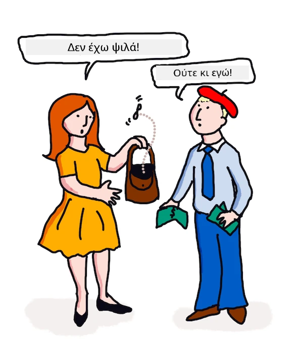

# Μετάφραση και ανάλυση συναισθήματος με ML

Στα προηγούμενα μαθήματα μάθατε πώς να δημιουργείτε έναν βασικό bot χρησιμοποιώντας το `TextBlob`, μια βιβλιοθήκη που ενσωματώνει ML στο παρασκήνιο για να εκτελεί βασικές εργασίες NLP όπως η εξαγωγή ουσιαστικών φράσεων. Μια άλλη σημαντική πρόκληση στη γνωστική γλωσσολογία είναι η ακριβής _μετάφραση_ μιας πρότασης από μια ομιλούμενη ή γραπτή γλώσσα σε άλλη.

## [Προ-μάθημα κουίζ](https://ff-quizzes.netlify.app/en/ml/)

Η μετάφραση είναι ένα πολύ δύσκολο πρόβλημα που επιβαρύνεται από το γεγονός ότι υπάρχουν χιλιάδες γλώσσες και κάθε μία μπορεί να έχει πολύ διαφορετικούς κανόνες γραμματικής. Μια προσέγγιση είναι να μετατρέψουμε τους επίσημους κανόνες γραμματικής για μια γλώσσα, όπως τα Αγγλικά, σε μια δομή που δεν εξαρτάται από τη γλώσσα, και στη συνέχεια να τη μεταφράσουμε επιστρέφοντας σε μια άλλη γλώσσα. Αυτή η προσέγγιση σημαίνει ότι θα κάνατε τα παρακάτω βήματα:

1. **Αναγνώριση**. Αναγνωρίστε ή επισημάνετε τις λέξεις στην είσοδο της γλώσσας ως ουσιαστικά, ρήματα κ.λπ.
2. **Δημιουργία μετάφρασης**. Παραγάγετε άμεση μετάφραση κάθε λέξης στη μορφή της γλώσσας στόχου.

### Παράδειγμα πρότασης, από Αγγλικά στα Ιρλανδικά

Στα 'Αγγλικά', η πρόταση _I feel happy_ αποτελείται από τρεις λέξεις με τη σειρά:

- **υποκείμενο** (I)
- **ρήμα** (feel)
- **επίθετο** (happy)

Ωστόσο, στη γλώσσα 'Ιρλανδικά', η ίδια πρόταση έχει πολύ διαφορετική γραμματική δομή - τα συναισθήματα όπως "*happy*" ή "*sad*" εκφράζονται ως να είναι *πάνω* σου.

Η αγγλική φράση `I feel happy` στα Ιρλανδικά θα ήταν `Tá athas orm`. Μια *κυριολεκτική* μετάφραση θα ήταν `Happy is upon me`.

Ένας ομιλητής των Ιρλανδικών που μεταφράζει στα Αγγλικά θα λέει `I feel happy`, όχι `Happy is upon me`, επειδή κατανοεί το νόημα της πρότασης, ακόμα κι αν οι λέξεις και η δομή της πρότασης είναι διαφορετικές.

Η επίσημη σειρά για την πρόταση στα Ιρλανδικά είναι:

- **ρήμα** (Tá ή is)
- **επίθετο** (athas, ή happy)
- **υποκείμενο** (orm, ή πάνω μου)

## Μετάφραση

Ένα αφελές πρόγραμμα μετάφρασης μπορεί να μεταφράσει μόνο λέξεις, αγνοώντας τη δομή της πρότασης.

✅ Αν έχετε μάθει μια δεύτερη (ή τρίτη ή περισσότερες) γλώσσα ως ενήλικας, ίσως έχετε αρχίσει σκεπτόμενοι στη μητρική σας γλώσσα, μεταφράζοντας μια έννοια λέξη προς λέξη στο κεφάλι σας στη δεύτερη γλώσσα και μετά μιλώντας τη μετάφρασή σας. Αυτό είναι παρόμοιο με ό,τι κάνουν τα αφελή προγράμματα μετάφρασης υπολογιστή. Είναι σημαντικό να ξεπεράσετε αυτή τη φάση για να αποκτήσετε ευφράδεια!

Η αφελής μετάφραση οδηγεί σε κακές (και μερικές φορές αστείες) παραφράσεις: `I feel happy` μεταφράζεται κυριολεκτικά σε `Mise bhraitheann athas` στα Ιρλανδικά. Αυτό σημαίνει (κυριολεκτικά) `εγώ αισθάνομαι χαρά` και δεν είναι έγκυρη ιρλανδική πρόταση. Παρόλο που τα Αγγλικά και τα Ιρλανδικά ομιλούνται σε δύο γειτονικά νησιά, είναι πολύ διαφορετικές γλώσσες με διαφορετικές γραμματικές δομές.

> Μπορείτε να δείτε κάποια βίντεο για τις ιρλανδικές γλωσσικές παραδόσεις όπως [αυτό](https://www.youtube.com/watch?v=mRIaLSdRMMs)

### Προσεγγίσεις μηχανικής μάθησης

Μέχρι τώρα, έχετε μάθει για την προσέγγιση των επίσημων κανόνων στην επεξεργασία φυσικής γλώσσας. Μια άλλη προσέγγιση είναι να αγνοήσουμε το νόημα των λέξεων και _αντίθετα να χρησιμοποιήσουμε μηχανική μάθηση για την ανίχνευση προτύπων_. Αυτό μπορεί να λειτουργήσει στη μετάφραση αν έχετε πολλά κείμενα (ένα *κορπούμ*) ή κείμενα (*κορπούμ*) και στις δύο γλώσσες, την αφετηρία και την στόχο.

Για παράδειγμα, σκεφτείτε το *Pride and Prejudice*, ένα γνωστό αγγλικό μυθιστόρημα που έγραψε η Jane Austen το 1813. Αν συμβουλευτείτε το βιβλίο στα Αγγλικά και μια ανθρώπινη μετάφραση του βιβλίου στα *γαλλικά*, μπορείτε να εντοπίσετε φράσεις που έχουν μεταφραστεί _ιδιωματικά_ στο ένα από το άλλο. Αυτό θα το κάνετε σε λίγο.

Για παράδειγμα, όταν μια αγγλική φράση όπως το `I have no money` μεταφράζεται κυριολεκτικά στα γαλλικά, μπορεί να γίνει `Je n'ai pas de monnaie`. Η "Monnaie" είναι ένα δύσκολο γαλλικό 'false cognate', καθώς 'money' και 'monnaie' δεν είναι συνώνυμα. Μια καλύτερη μετάφραση που μπορεί να κάνει ένας άνθρωπος θα ήταν `Je n'ai pas d'argent`, επειδή μεταφέρει καλύτερα το νόημα ότι δεν έχεις χρήματα (αντί για 'ψιλά' που είναι το νόημα του 'monnaie').



> Εικόνα από [Jen Looper](https://twitter.com/jenlooper)

Αν ένα μοντέλο ML έχει αρκετές ανθρώπινες μεταφράσεις για να χτίσει ένα μοντέλο, μπορεί να βελτιώσει την ακρίβεια των μεταφράσεων αναγνωρίζοντας κοινά πρότυπα σε κείμενα που έχουν ήδη μεταφραστεί από ειδικούς ανθρώπινους ομιλητές και των δύο γλωσσών.

### Άσκηση - μετάφραση

Μπορείτε να χρησιμοποιήσετε το `TextBlob` για να μεταφράσετε προτάσεις. Δοκιμάστε τη διάσημη πρώτη γραμμή του **Pride and Prejudice**:

```python
from textblob import TextBlob

blob = TextBlob(
    "It is a truth universally acknowledged, that a single man in possession of a good fortune, must be in want of a wife!"
)
print(blob.translate(to="fr"))

```

Το `TextBlob` κάνει πάρα πολύ καλή δουλειά στη μετάφραση: "C'est une vérité universellement reconnue, qu'un homme célibataire en possession d'une bonne fortune doit avoir besoin d'une femme!".

Μπορεί να υποστηριχθεί ότι η μετάφραση του TextBlob είναι στην πραγματικότητα πολύ πιο ακριβής από τη γαλλική μετάφραση του βιβλίου το 1932 από τους V. Leconte και Ch. Pressoir:

"C'est une vérité universelle qu'un célibataire pourvu d'une belle fortune doit avoir envie de se marier, et, si peu que l'on sache de son sentiment à cet egard, lorsqu'il arrive dans une nouvelle résidence, cette idée est si bien fixée dans l'esprit de ses voisins qu'ils le considèrent sur-le-champ comme la propriété légitime de l'une ou l'autre de leurs filles."

Σε αυτή την περίπτωση, η μετάφραση που υποστηρίζεται από ML κάνει καλύτερη δουλειά από τον ανθρώπινο μεταφραστή που βάζει περιττές λέξεις στο στόμα του αρχικού συγγραφέα για λόγους «καθαρότητας».

> Τι συμβαίνει εδώ; και γιατί το TextBlob είναι τόσο καλό στη μετάφραση; Λοιπόν, στο παρασκήνιο, χρησιμοποιεί το Google translate, μια εξελιγμένη τεχνητή νοημοσύνη ικανή να αναλύσει εκατομμύρια φράσεις ώστε να προβλέψει τις καλύτερες ακολουθίες για την εργασία που έχει να κάνει. Δεν υπάρχει τίποτα χειροκίνητο εδώ και χρειάζεστε σύνδεση στο ίντερνετ για να χρησιμοποιήσετε το `blob.translate`.

✅ Δοκιμάστε μερικές ακόμα προτάσεις. Ποια είναι καλύτερη, η μετάφραση ML ή η ανθρώπινη; Σε ποιες περιπτώσεις;

## Ανάλυση συναισθήματος

Ένας άλλος τομέας όπου η μηχανική μάθηση λειτουργεί πολύ καλά είναι η ανάλυση συναισθήματος. Μια μη ML προσέγγιση στη συναισθηματική ανάλυση είναι να εντοπίσουμε λέξεις και φράσεις που είναι "θετικές" και "αρνητικές". Στη συνέχεια, δεδομένου ενός νέου κειμένου, υπολογίζουμε τη συνολική αξία των θετικών, αρνητικών και ουδέτερων λέξεων για να προσδιορίσουμε το συνολικό συναίσθημα.

Αυτή η προσέγγιση είναι εύκολο να παραπλανηθεί όπως ίσως έχετε δει στην άσκηση του Marvin - η πρόταση `Great, that was a wonderful waste of time, I'm glad we are lost on this dark road` είναι μια σαρκαστική, αρνητική πρόταση συνανθήματος, αλλά ο απλός αλγόριθμος εντοπίζει τα 'great', 'wonderful', 'glad' ως θετικά και τα 'waste', 'lost' και 'dark' ως αρνητικά. Το συνολικό συναίσθημα επηρεάζεται από αυτές τις αντικρουόμενες λέξεις.

✅ Σταματήστε για λίγο και σκεφτείτε πώς εκφράζουμε τον σαρκασμό ως ανθρώπινοι ομιλητές. Η αλλαγή στην τονικότητα παίζει μεγάλο ρόλο. Δοκιμάστε να πείτε τη φράση "Well, that film was awesome" με διαφορετικούς τρόπους για να ανακαλύψετε πώς η φωνή σας μεταδίδει το νόημα.

### Προσεγγίσεις ML

Η προσέγγιση ML θα ήταν να συλλέξετε χειροκίνητα αρνητικά και θετικά σώματα κειμένων - tweets ή κριτικές ταινιών, ή οτιδήποτε όπου ο άνθρωπος έχει δώσει βαθμολογία *και* γραπτή γνώμη. Στη συνέχεια, μπορούν να εφαρμοστούν τεχνικές NLP στις γνώμες και στις βαθμολογίες, ώστε να εμφανίζονται πρότυπα (π.χ., οι θετικές κριτικές ταινιών έχουν πιο συχνά τη φράση 'Oscar worthy' από ό,τι οι αρνητικές κριτικές ταινιών, ή οι θετικές κριτικές εστιατορίων λένε 'gourmet' πολύ περισσότερο από 'disgusting').

> ⚖️ **Παράδειγμα**: Αν εργαζόσασταν σε ένα γραφείο πολιτικού και υπήρχε κάποιο νέο νομοσχέδιο που συζητείται, οι ψηφοφόροι μπορεί να έστελναν στο γραφείο e-mails υπέρ ή κατά αυτού του νέου νόμου. Ας πούμε ότι σας ανέθεσαν να διαβάσετε τα emails και να τα ταξινομήσετε σε 2 σωρούς, *υπέρ* και *κατά*. Αν υπήρχαν πολλά emails, μπορεί να ήσασταν υπερφορτωμένοι προσπαθώντας να τα διαβάσετε όλα. Δεν θα ήταν ωραίο αν ένα bot μπορούσε να τα διαβάσει όλα για εσάς, να τα κατανοήσει και να σας πει σε ποιο σωρό ανήκει κάθε email;
>
> Ένας τρόπος για να το πετύχετε αυτό είναι να χρησιμοποιήσετε τη Μηχανική Μάθηση. Θα εκπαιδεύατε το μοντέλο με ένα μέρος των emails *κατά* και ένα μέρος των emails *υπέρ*. Το μοντέλο θα συσχέτιζε φράσεις και λέξεις με την πλευρά κατά και την πλευρά υπέρ, *αλλά δεν θα καταλάβαινε κανένα από το περιεχόμενο*, μόνο ότι ορισμένες λέξεις και πρότυπα ήταν πιο πιθανά να εμφανιστούν σε ένα email *κατά* ή *υπέρ*. Μπορείτε να το δοκιμάσετε με μερικά email που δεν χρησιμοποιήσατε στην εκπαίδευση του μοντέλου, και να δείτε αν καταλήγει στο ίδιο συμπέρασμα με εσάς. Τότε, μόλις θα ήσασταν ικανοποιημένοι με την ακρίβεια του μοντέλου, θα μπορούσατε να επεξεργαστείτε τα μελλοντικά email χωρίς να χρειάζεται να διαβάσετε το κάθε ένα.

✅ Αυτή η διαδικασία σας ακούγεται σαν διαδικασίες που έχετε χρησιμοποιήσει σε προηγούμενα μαθήματα;

## Άσκηση - προτάσεις συναισθήματος

Το συναίσθημα μετριέται με *πολικότητα* από -1 έως 1, που σημαίνει ότι το -1 είναι το πιο αρνητικό συναίσθημα και το 1 το πιο θετικό. Το συναίσθημα μετριέται επίσης με βαθμολογία 0 - 1 για αντικειμενικότητα (0) και υποκειμενικότητα (1).

Ρίξτε μια ακόμα ματιά στο *Pride and Prejudice* της Jane Austen. Το κείμενο είναι διαθέσιμο εδώ στο [Project Gutenberg](https://www.gutenberg.org/files/1342/1342-h/1342-h.htm). Το δείγμα παρακάτω δείχνει ένα σύντομο πρόγραμμα που αναλύει τη συναισθηματική πολικότητα και την υποκειμενικότητα/αντικειμενικότητα των πρώτων και τελευταίων προτάσεων του βιβλίου.

Πρέπει να χρησιμοποιήσετε τη βιβλιοθήκη `TextBlob` (που περιγράφεται παραπάνω) για να προσδιορίσετε το `sentiment` (δεν χρειάζεται να γράψετε τον δικό σας υπολογιστή συναισθήματος) στην παρακάτω εργασία.

```python
from textblob import TextBlob

quote1 = """It is a truth universally acknowledged, that a single man in possession of a good fortune, must be in want of a wife."""

quote2 = """Darcy, as well as Elizabeth, really loved them; and they were both ever sensible of the warmest gratitude towards the persons who, by bringing her into Derbyshire, had been the means of uniting them."""

sentiment1 = TextBlob(quote1).sentiment
sentiment2 = TextBlob(quote2).sentiment

print(quote1 + " has a sentiment of " + str(sentiment1))
print(quote2 + " has a sentiment of " + str(sentiment2))
```

Βλέπετε την εξής έξοδο:

```output
It is a truth universally acknowledged, that a single man in possession of a good fortune, must be in want # of a wife. has a sentiment of Sentiment(polarity=0.20952380952380953, subjectivity=0.27142857142857146)

Darcy, as well as Elizabeth, really loved them; and they were
     both ever sensible of the warmest gratitude towards the persons
      who, by bringing her into Derbyshire, had been the means of
      uniting them. has a sentiment of Sentiment(polarity=0.7, subjectivity=0.8)
```

## Πρόκληση - έλεγχος πολικότητας συναισθήματος

Η εργασία σας είναι να προσδιορίσετε, χρησιμοποιώντας την πολικότητα του συναισθήματος, αν το *Pride and Prejudice* έχει περισσότερες απόλυτα θετικές προτάσεις παρά απόλυτα αρνητικές. Για αυτήν την εργασία, μπορείτε να θεωρήσετε ότι βαθμολογία πολικότητας 1 ή -1 είναι απόλυτα θετική ή αρνητική αντίστοιχα.

**Βήματα:**

1. Κατεβάστε ένα [αντίγραφο του Pride and Prejudice](https://www.gutenberg.org/files/1342/1342-h/1342-h.htm) από το Project Gutenberg ως αρχείο .txt. Αφαιρέστε τα μεταδεδομένα στην αρχή και στο τέλος του αρχείου, αφήνοντας μόνο το αρχικό κείμενο
2. Ανοίξτε το αρχείο σε Python και εξαγάγετε τα περιεχόμενα ως συμβολοσειρά
3. Δημιουργήστε ένα TextBlob χρησιμοποιώντας τη συμβολοσειρά του βιβλίου
4. Αναλύστε κάθε πρόταση στο βιβλίο σε βρόχο
   1. Αν η πολικότητα είναι 1 ή -1 αποθηκεύστε την πρόταση σε έναν πίνακα ή λίστα θετικών ή αρνητικών μηνυμάτων
5. Στο τέλος, εκτυπώστε όλες τις θετικές και τις αρνητικές προτάσεις (ξεχωριστά) και τον αριθμό της κάθε κατηγορίας.

Εδώ είναι μια δείγμα [λύσης](https://github.com/microsoft/ML-For-Beginners/blob/main/6-NLP/3-Translation-Sentiment/solution/notebook.ipynb).

✅ Έλεγχος γνώσης

1. Το συναίσθημα βασίζεται στις λέξεις που χρησιμοποιούνται στην πρόταση, αλλά ο κώδικας *καταλαβαίνει* τις λέξεις;
2. Πιστεύετε ότι η πολικότητα του συναισθήματος είναι ακριβής, ή με άλλα λόγια, συμφωνείτε με τις βαθμολογίες;
   1. Συγκεκριμένα, συμφωνείτε ή διαφωνείτε με την απόλυτα **θετική** πολικότητα των παρακάτω προτάσεων;
      * “Τι εξαιρετικός πατέρας έχετε, κορίτσια!” είπε, όταν έκλεισε η πόρτα.
      * “Η εξέτασή σας για τον κ. Darcy έχει τελειώσει, υποθέτω,” είπε η δεσποινίς Bingley· “και παρακαλώ ποιο είναι το αποτέλεσμα;" “Είμαι απόλυτα πεπεισμένη ότι ο κ. Darcy δεν έχει κανένα ελάττωμα.
      * Πώς συμβαίνουν θαυμάσια αυτά τα πράγματα!
      * Έχω τη μεγαλύτερη αντιπάθεια στον κόσμο γι’ αυτά τα πράγματα.
      * Η Charlotte είναι άριστη διαχειρίστρια, τολμώ να πω.
      * “Αυτό είναι πραγματικά απολαυστικό!
      * Είμαι τόσο χαρούμενη!
      * Η ιδέα σου για τα πόνυ είναι απολαυστική.
   2. Οι επόμενες 3 προτάσεις αξιολογήθηκαν με απόλυτα θετικό συναίσθημα, αλλά κατά την προσεκτική ανάγνωση, δεν είναι θετικές προτάσεις. Γιατί η ανάλυση συναισθήματος θεώρησε ότι ήταν θετικές προτάσεις;
      * Ευτυχισμένη θα είμαι, όταν τελειώσει η διαμονή του στο Netherfield!” “Εύχομαι να μπορούσα να σου πω κάτι παρηγορητικό,” απάντησε η Elizabeth· “αλλά είναι εντελώς εκτός των δυνατοτήτων μου.
      * Αν μπορούσα να σε δω τόσο ευτυχισμένη!
      * Η στενοχώρια μας, αγαπητή μου Lizzy, είναι πολύ μεγάλη.
   3. Συμφωνείτε ή διαφωνείτε με την απόλυτα **αρνητική** πολικότητα των παρακάτω προτάσεων;
      - Όλοι είναι απογοητευμένοι με την υπερηφάνειά του.
      - “Θα ήθελα να μάθω πώς συμπεριφέρεται ανάμεσα σε ξένους.” “Τότε θα ακούσεις—αλλά ετοιμάσου για κάτι πολύ τρομερό.
      - Η παύση ήταν για τα συναισθήματα της Elizabeth τρομακτική.
      - Θα ήταν τρομερό!

✅ Κάθε λάτρης της Jane Austen θα καταλάβει ότι συχνά χρησιμοποιεί τα βιβλία της για να κριτικάρει τις πιο γελοίες πλευρές της αγγλικής κοινωνίας της εποχής της Ρέγκενσι. Η Elizabeth Bennett, η κύρια ηρωίδα του *Pride and Prejudice*, είναι έντονη κοινωνική παρατηρήτρια (όπως η συγγραφέας) και η γλώσσα της είναι συχνά πολύ περιεκτική. Ακόμα και ο κ. Darcy (το ερωτικό ενδιαφέρον στην ιστορία) σημειώνει το παιχνιδιάρικο και πειραχτικό λεκτικό ύφος της Elizabeth: "Είχα την ευχαρίστηση της γνωριμίας σας αρκετό καιρό για να ξέρω ότι βρίσκετε μεγάλη απόλαυση καμιά φορά να διατυπώνετε γνώμες που στην πραγματικότητα δεν είναι δικές σας."

---

## 🚀Πρόκληση

Μπορείτε να κάνετε τον Marvin ακόμα καλύτερο αν εξάγετε άλλα χαρακτηριστικά από την είσοδο του χρήστη;

## [Μετά το μάθημα κουίζ](https://ff-quizzes.netlify.app/en/ml/)

## Επισκόπηση & Αυτο-μελέτη


Υπάρχουν πολλοί τρόποι για να εξαχθεί το συναίσθημα από κείμενο. Σκεφτείτε τις επιχειρηματικές εφαρμογές που μπορεί να χρησιμοποιήσουν αυτήν την τεχνική. Σκεφτείτε πώς μπορεί να πάει στραβά. Διαβάστε περισσότερα για προηγμένα συστήματα έτοιμα για επιχειρήσεις που αναλύουν το συναίσθημα όπως το [Azure Text Analysis](https://docs.microsoft.com/azure/cognitive-services/Text-Analytics/how-tos/text-analytics-how-to-sentiment-analysis?tabs=version-3-1?WT.mc_id=academic-77952-leestott). Δοκιμάστε κάποιες από τις προτάσεις από το Pride and Prejudice παραπάνω και δείτε αν μπορεί να ανιχνεύσει την λεπτομέρεια.

## Ανάθεση 

[Ποιητική άδεια](assignment.md)

---

<!-- CO-OP TRANSLATOR DISCLAIMER START -->
**Αποποίηση ευθυνών**:
Αυτό το έγγραφο έχει μεταφραστεί χρησιμοποιώντας την υπηρεσία μετάφρασης με τεχνητή νοημοσύνη [Co-op Translator](https://github.com/Azure/co-op-translator). Ενώ επιδιώκουμε την ακρίβεια, παρακαλούμε να έχετε υπόψη ότι οι αυτοματοποιημένες μεταφράσεις ενδέχεται να περιέχουν λάθη ή ανακρίβειες. Το πρωτότυπο έγγραφο στη μητρική του γλώσσα πρέπει να θεωρείται η αυθεντική πηγή. Για κρίσιμες πληροφορίες, συνιστάται επαγγελματική ανθρώπινη μετάφραση. Δεν φέρουμε ευθύνη για τυχόν παρεξηγήσεις ή λανθασμένες ερμηνείες που προκύπτουν από τη χρήση αυτής της μετάφρασης.
<!-- CO-OP TRANSLATOR DISCLAIMER END -->