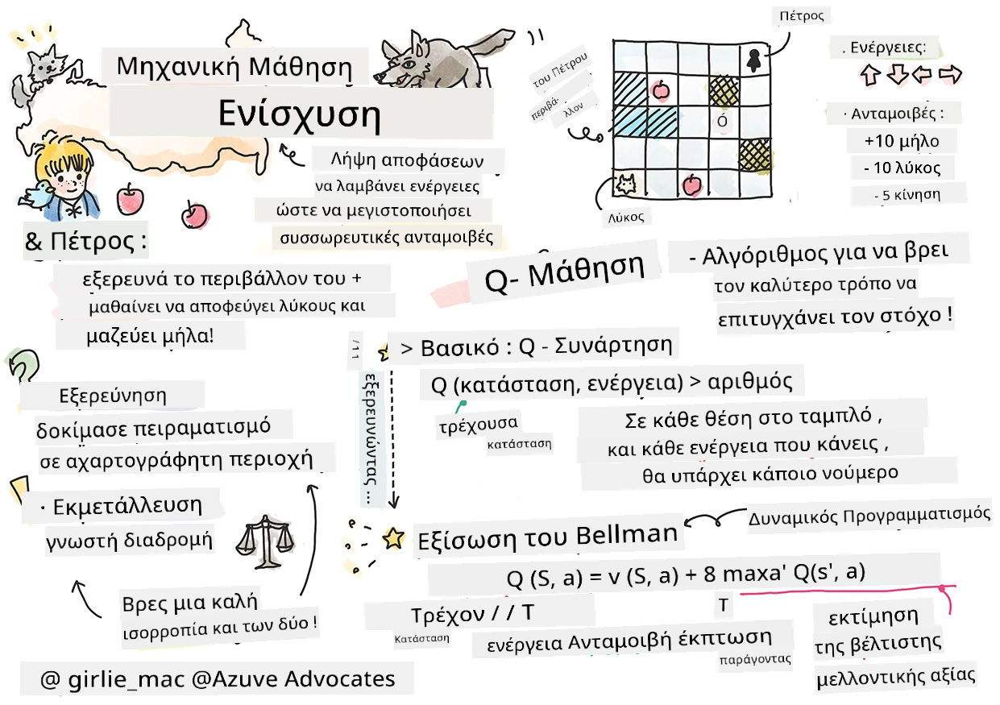

# Εισαγωγή στην Εκμάθηση με Ενίσχυση και στην Q-Μάθηση


> Σκίτσο από [Tomomi Imura](https://www.twitter.com/girlie_mac)

Η εκμάθηση με ενίσχυση περιλαμβάνει τρεις σημαντικές έννοιες: τον πρακτορά (agent), κάποιες καταστάσεις, και ένα σύνολο ενεργειών ανά κατάσταση. Εκτελώντας μια ενέργεια σε μια συγκεκριμένη κατάσταση, ο πρακτοράς λαμβάνει μια ανταμοιβή. Φανταστείτε ξανά το ηλεκτρονικό παιχνίδι Super Mario. Εσείς είστε ο Μάριο, βρίσκεστε σε ένα επίπεδο του παιχνιδιού, όρθιος δίπλα σε μια άκρη γκρεμού. Πάνω σας υπάρχει ένα νόμισμα. Εσείς ως Μάριο, σε ένα επίπεδο του παιχνιδιού, σε μια συγκεκριμένη θέση... αυτή είναι η κατάσταση σας. Μετακίνηση ένα βήμα δεξιά (μια ενέργεια) θα σας έριχνε από την άκρη, και αυτό θα σας έδινε μια χαμηλή αριθμητική βαθμολογία. Ωστόσο, πατώντας το κουμπί άλματος, θα μπορούσατε να σκοράρετε ένα πόντο και να παραμείνετε ζωντανοί. Αυτό είναι ένα θετικό αποτέλεσμα και θα έπρεπε να σας αποδώσει μια θετική αριθμητική βαθμολογία.

Με τη χρήση της εκμάθησης με ενίσχυση και ενός προσομοιωτή (του παιχνιδιού), μπορείτε να μάθετε πώς να παίζετε το παιχνίδι για να μεγιστοποιήσετε την ανταμοιβή, που είναι να παραμείνετε ζωντανοί και να σκοράρετε όσο το δυνατόν περισσότερους πόντους.

[](https://www.youtube.com/watch?v=lDq_en8RNOo)

> 🎥 Κάντε κλικ στην εικόνα παραπάνω για να ακούσετε τον Dmitry να συζητά για την Εκμάθηση με Ενίσχυση

## [Προ-μάθημα κουίζ](https://ff-quizzes.netlify.app/en/ml/)

## Προαπαιτούμενα και Ρύθμιση

Σε αυτό το μάθημα, θα πειραματιστούμε με μερικό κώδικα σε Python. Θα πρέπει να μπορείτε να τρέξετε τον κώδικα του Jupyter Notebook από αυτό το μάθημα, είτε στον υπολογιστή σας είτε κάπου στο cloud.

Μπορείτε να ανοίξετε [το notebook του μαθήματος](https://github.com/microsoft/ML-For-Beginners/blob/main/8-Reinforcement/1-QLearning/notebook.ipynb) και να ακολουθήσετε αυτό το μάθημα για να κατασκευάσετε.

> **Σημείωση:** Αν ανοίγετε αυτόν τον κώδικα από το cloud, χρειάζεται επίσης να κατεβάσετε το αρχείο [`rlboard.py`](https://github.com/microsoft/ML-For-Beginners/blob/main/8-Reinforcement/1-QLearning/rlboard.py), το οποίο χρησιμοποιείται στον κώδικα του notebook. Προσθέστε το στο ίδιο φάκελο με το notebook.

## Εισαγωγή

Σε αυτό το μάθημα, θα εξερευνήσουμε τον κόσμο του **[Ο Πέτρος και ο Λύκος](https://en.wikipedia.org/wiki/Peter_and_the_Wolf)**, εμπνευσμένο από ένα μουσικό παραμύθι του Ρώσου συνθέτη, [Sergei Prokofiev](https://en.wikipedia.org/wiki/Sergei_Prokofiev). Θα χρησιμοποιήσουμε την **Εκμάθηση με Ενίσχυση** για να αφήσουμε τον Πέτρο να εξερευνήσει το περιβάλλον του, να συλλέξει νόστιμα μήλα και να αποφύγει να συναντήσει τον λύκο.

Η **Εκμάθηση με Ενίσχυση** (RL) είναι μια τεχνική μάθησης που μας επιτρέπει να μάθουμε την βέλτιστη συμπεριφορά ενός **πρακτορά** σε κάποιο **περιβάλλον** τρέχοντας πολλά πειράματα. Ένας πρακτοράς σε αυτό το περιβάλλον πρέπει να έχει κάποιο **στόχο**, ο οποίος ορίζεται από μια **συνάρτηση ανταμοιβής**.

## Το περιβάλλον

Για απλότητα, ας θεωρήσουμε τον κόσμο του Πέτρου σαν μια τετράγωνη πίστα διαστάσεων `πλάτος` x `ύψος`, όπως αυτή:


Κάθε κελί αυτής της πίστα μπορεί είτε να είναι:

* **έδαφος**, πάνω στο οποίο μπορεί να περπατήσει ο Πέτρος και άλλα πλάσματα.
* **νερό**, πάνω στο οποίο προφανώς δεν μπορείτε να περπατήσετε.
* ένα **δέντρο** ή **χλόη**, ένα μέρος όπου μπορείτε να ξεκουραστείτε.
* ένα **μήλο**, που αντιπροσωπεύει κάτι που ο Πέτρος θα ήταν χαρούμενος να βρει για να τραφεί.
* έναν **λύκο**, που είναι επικίνδυνος και πρέπει να αποφευχθεί.

Υπάρχει ένα ξεχωριστό Python module, το [`rlboard.py`](https://github.com/microsoft/ML-For-Beginners/blob/main/8-Reinforcement/1-QLearning/rlboard.py), που περιέχει τον κώδικα για να δουλέψουμε με αυτό το περιβάλλον. Επειδή αυτός ο κώδικας δεν είναι σημαντικός για την κατανόηση των εννοιών μας, θα εισαγάγουμε το module και θα το χρησιμοποιήσουμε για να δημιουργήσουμε την δειγματική πίστα (μπλοκ κώδικα 1):

```python
from rlboard import *

width, height = 8,8
m = Board(width,height)
m.randomize(seed=13)
m.plot()
```

Αυτός ο κώδικας θα πρέπει να εκτυπώσει μια εικόνα του περιβάλλοντος παρόμοια με την παραπάνω.

## Ενέργειες και πολιτική

Στο παράδειγμά μας, ο στόχος του Πέτρου θα ήταν να βρει ένα μήλο, αποφεύγοντας τον λύκο και άλλα εμπόδια. Για να το κάνουμε αυτό, μπορεί ουσιαστικά να περπατάει μέχρι να βρει ένα μήλο.

Επομένως, σε κάθε θέση, μπορεί να επιλέξει ανάμεσα στις εξής ενέργειες: πάνω, κάτω, αριστερά και δεξιά.

Θα ορίσουμε αυτές τις ενέργειες ως ένα λεξικό, και θα τις αντιστοιχίσουμε σε ζεύγη αντίστοιχων αλλαγών συντεταγμένων. Για παράδειγμα, η κίνηση δεξιά (`R`) θα αντιστοιχεί στο ζεύγος `(1,0)`. (μπλοκ κώδικα 2):

```python
actions = { "U" : (0,-1), "D" : (0,1), "L" : (-1,0), "R" : (1,0) }
action_idx = { a : i for i,a in enumerate(actions.keys()) }
```

Συνοπτικά, η στρατηγική και ο στόχος αυτού του σεναρίου είναι οι εξής:

- **Η στρατηγική**, του πρακτορά μας (Πέτρος) ορίζεται από την λεγόμενη **πολιτική**. Μια πολιτική είναι μια συνάρτηση που επιστρέφει την ενέργεια για κάθε δοσμένη κατάσταση. Στη δική μας περίπτωση, η κατάσταση του προβλήματος αντιπροσωπεύεται από την πίστα, συμπεριλαμβανομένης της τρέχουσας θέσης του παίκτη.

- **Ο στόχος**, της εκμάθησης με ενίσχυση είναι τελικά να μάθουμε μια καλή πολιτική που θα μας επιτρέψει να λύσουμε το πρόβλημα αποτελεσματικά. Ωστόσο, ως βάση, ας θεωρήσουμε την απλούστερη πολιτική, που ονομάζεται **τυχαίο περπάτημα**.

## Τυχαίο περπάτημα

Ας λύσουμε πρώτα το πρόβλημά μας υλοποιώντας μια στρατηγική τυχαίου περπατήματος. Με το τυχαίο περπάτημα, θα διαλέγουμε τυχαία την επόμενη ενέργεια από τις επιτρεπτές ενέργειες, μέχρι να φτάσουμε στο μήλο (μπλοκ κώδικα 3).

1. Υλοποιήστε το τυχαίο περπάτημα με τον παρακάτω κώδικα:

    ```python
    def random_policy(m):
        return random.choice(list(actions))
    
    def walk(m,policy,start_position=None):
        n = 0 # αριθμός βημάτων
        # ορίστε την αρχική θέση
        if start_position:
            m.human = start_position 
        else:
            m.random_start()
        while True:
            if m.at() == Board.Cell.apple:
                return n # επιτυχία!
            if m.at() in [Board.Cell.wolf, Board.Cell.water]:
                return -1 # φαγώθηκε από λύκο ή πνίγηκε
            while True:
                a = actions[policy(m)]
                new_pos = m.move_pos(m.human,a)
                if m.is_valid(new_pos) and m.at(new_pos)!=Board.Cell.water:
                    m.move(a) # κάντε την πραγματική κίνηση
                    break
            n+=1
    
    walk(m,random_policy)
    ```

    Η κλήση της `walk` θα πρέπει να επιστρέφει το μήκος της αντίστοιχης διαδρομής, το οποίο μπορεί να διαφέρει από τρέξιμο σε τρέξιμο.

1. Εκτελέστε το πείραμα περπατήματος πολλές φορές (π.χ. 100), και εκτυπώστε τα στατιστικά αποτελέσματα (μπλοκ κώδικα 4):

    ```python
    def print_statistics(policy):
        s,w,n = 0,0,0
        for _ in range(100):
            z = walk(m,policy)
            if z<0:
                w+=1
            else:
                s += z
                n += 1
        print(f"Average path length = {s/n}, eaten by wolf: {w} times")
    
    print_statistics(random_policy)
    ```

    Σημειώστε ότι ο μέσος όρος μήκους μιας διαδρομής είναι περίπου 30-40 βήματα, που είναι αρκετά πολλά, δεδομένου ότι η μέση απόσταση από το κοντινότερο μήλο είναι περίπου 5-6 βήματα.

    Μπορείτε επίσης να δείτε πώς μοιάζει η κίνηση του Πέτρου κατά το τυχαίο περπάτημα:

    

## Συνάρτηση ανταμοιβής

Για να κάνουμε την πολιτική μας πιο έξυπνη, πρέπει να καταλάβουμε ποιες κινήσεις είναι "καλύτερες" από άλλες. Για να το κάνουμε αυτό, πρέπει να ορίσουμε τον στόχο μας.

Ο στόχος μπορεί να οριστεί με όρους μιας **συνάρτησης ανταμοιβής**, η οποία θα επιστρέφει κάποια τιμή βαθμολογίας για κάθε κατάσταση. Όσο μεγαλύτερος ο αριθμός, τόσο καλύτερη η συνάρτηση ανταμοιβής. (μπλοκ κώδικα 5)

```python
move_reward = -0.1
goal_reward = 10
end_reward = -10

def reward(m,pos=None):
    pos = pos or m.human
    if not m.is_valid(pos):
        return end_reward
    x = m.at(pos)
    if x==Board.Cell.water or x == Board.Cell.wolf:
        return end_reward
    if x==Board.Cell.apple:
        return goal_reward
    return move_reward
```

Ένα ενδιαφέρον στοιχείο για τις συναρτήσεις ανταμοιβής είναι ότι στις περισσότερες περιπτώσεις, *μας δίνεται ουσιαστική ανταμοιβή μόνο στο τέλος του παιχνιδιού*. Αυτό σημαίνει ότι ο αλγόριθμός μας πρέπει κάπως να θυμάται τα "καλά" βήματα που οδηγούν σε θετική ανταμοιβή στο τέλος, και να αυξάνει τη σημασία τους. Ομοίως, όλες οι κινήσεις που οδηγούν σε κακά αποτελέσματα θα πρέπει να αποθαρρύνονται.

## Q-Μάθηση

Ένας αλγόριθμος που θα συζητήσουμε εδώ ονομάζεται **Q-Μάθηση**. Σε αυτόν τον αλγόριθμο, η πολιτική ορίζεται από μια συνάρτηση (ή μια δομή δεδομένων) που ονομάζεται **Πίνακας Q**. Καταγράφει την "ποιότητα" κάθε ενέργειας σε μια δεδομένη κατάσταση.

Ονομάζεται Πίνακας Q επειδή είναι συχνά βολικό να αντιπροσωπεύεται ως πίνακας ή πολυδιάστατος πίνακας. Εφόσον η πίστα μας έχει διαστάσεις `πλάτος` x `ύψος`, μπορούμε να αναπαραστήσουμε τον Πίνακα Q χρησιμοποιώντας έναν numpy πίνακα με σχήμα `πλάτος` x `ύψος` x `len(actions)`: (μπλοκ κώδικα 6)

```python
Q = np.ones((width,height,len(actions)),dtype=np.float)*1.0/len(actions)
```

Παρατηρήστε ότι αρχικοποιούμε όλες τις τιμές του Πίνακα Q με μια ίση τιμή, στην περίπτωσή μας - 0.25. Αυτό αντιστοιχεί στην πολιτική του "τυχαίου περπατήματος", γιατί όλες οι κινήσεις σε κάθε κατάσταση είναι εξίσου καλές. Μπορούμε να περάσουμε τον Πίνακα Q στη συνάρτηση `plot` για να απεικονίσουμε τον πίνακα στην πίστα: `m.plot(Q)`.


Στο κέντρο κάθε κελιού υπάρχει ένα "βέλος" που δείχνει την προτιμώμενη κατεύθυνση κίνησης. Εφόσον όλες οι κατευθύνσεις είναι ίσες, εμφανίζεται μια τελεία.

Τώρα πρέπει να τρέξουμε την προσομοίωση, να εξερευνήσουμε το περιβάλλον μας και να μάθουμε μια καλύτερη κατανομή τιμών του Πίνακα Q, που θα μας επιτρέψει να βρούμε τον δρόμο προς το μήλο πολύ πιο γρήγορα.

## Η Ουσία της Q-Μάθησης: Η Εξίσωση του Bellman

Μόλις αρχίσουμε να κινούμαστε, κάθε ενέργεια θα έχει μια αντίστοιχη ανταμοιβή, δηλαδή μπορούμε θεωρητικά να επιλέξουμε την επόμενη ενέργεια βασιζόμενοι στην υψηλότερη άμεση ανταμοιβή. Ωστόσο, σε περισσότερες καταστάσεις, η κίνηση δεν θα πετύχει τον στόχο μας να φτάσουμε στο μήλο, και έτσι δεν μπορούμε αμέσως να αποφασίσουμε ποια κατεύθυνση είναι καλύτερη.

> Θυμηθείτε ότι δεν έχει σημασία το άμεσο αποτέλεσμα, αλλά το τελικό αποτέλεσμα, το οποίο θα λάβουμε στο τέλος της προσομοίωσης.

Για να λάβουμε υπόψη αυτήν την καθυστερημένη ανταμοιβή, πρέπει να χρησιμοποιήσουμε τις αρχές του **[δυναμικού προγραμματισμού](https://el.wikipedia.org/wiki/%CE%94%CF%85%CE%BD%CE%B1%CE%BC%CE%B9%CE%BA%CF%8C%CF%82_%CF%80%CF%81%CE%BF%CE%B3%CF%81%CE%B1%CE%BC%CE%BC%CE%B1%CF%84%CE%B9%CF%83%CE%BC%CF%8C%CF%82)**, που μας επιτρέπουν να σκεφτούμε το πρόβλημά μας αναδρομικά.

Ας υποθέσουμε ότι βρισκόμαστε στη κατάσταση *s*, και θέλουμε να μεταβούμε στην επόμενη κατάσταση *s'*. Κάνοντας αυτό, θα λάβουμε την άμεση ανταμοιβή *r(s,a)*, που ορίζεται από τη συνάρτηση ανταμοιβής, συν κάποια μελλοντική ανταμοιβή. Αν υποθέσουμε ότι ο Πίνακας Q αντανακλά σωστά την "ελκυστικότητα" κάθε ενέργειας, τότε στη κατάσταση *s'* θα επιλέξουμε μια ενέργεια *a* που αντιστοιχεί στην μέγιστη τιμή του *Q(s',a')*. Έτσι, η καλύτερη δυνατή μελλοντική ανταμοιβή που θα μπορούσαμε να έχουμε στην κατάσταση *s* θα ορίζεται ως `max`<sub>a'</sub>*Q(s',a')* (το μέγιστο εδώ υπολογίζεται σε όλες τις πιθανές ενέργειες *a'* στην κατάσταση *s'*).

Αυτό δίνει τον **τύπο του Bellman** για τον υπολογισμό της τιμής του Πίνακα Q στην κατάσταση *s*, δεδομένης της ενέργειας *a*:


Εδώ το γ είναι ο λεγόμενος **συντελεστής έκπτωσης** που καθορίζει σε ποιο βαθμό πρέπει να προτιμήσετε την τρέχουσα ανταμοιβή έναντι της μελλοντικής και αντίστροφα.

## Αλγόριθμος εκμάθησης

Δεδομένου του παραπάνω τύπου, μπορούμε τώρα να γράψουμε ψευδοκώδικα για τον αλγόριθμο εκμάθησής μας:

* Αρχικοποιήστε τον Πίνακα Q με ίσες τιμές για όλες τις καταστάσεις και ενέργειες
* Θέστε το ρυθμό εκμάθησης α ← 1
* Επαναλάβετε την προσομοίωση πολλές φορές
   1. Ξεκινήστε από τυχαία θέση
   1. Επαναλάβετε
        1. Επιλέξτε μια ενέργεια *a* στην κατάσταση *s*
        2. Εκτελέστε την ενέργεια μεταβαίνοντας σε νέα κατάσταση *s'*
        3. Αν συναντήσουμε συνθήκη λήξης παιχνιδιού, ή αν η συνολική ανταμοιβή είναι πολύ μικρή - τερματίστε την προσομοίωση  
        4. Υπολογίστε την ανταμοιβή *r* στη νέα κατάσταση
        5. Ενημερώστε τη συνάρτηση Q σύμφωνα με την εξίσωση Bellman: *Q(s,a)* ← *(1-α)Q(s,a)+α(r+γ max<sub>a'</sub>Q(s',a'))*
        6. *s* ← *s'*
        7. Ενημερώστε τη συνολική ανταμοιβή και μειώστε την α.

## Εκμετάλλευση vs. εξερεύνηση

Στον παραπάνω αλγόριθμο, δεν προσδιορίσαμε ακριβώς πώς πρέπει να διαλέξουμε μια ενέργεια στο βήμα 2.1. Αν επιλέγουμε την ενέργεια τυχαία, θα **εξερευνούμε** τυχαία το περιβάλλον, και είναι αρκετά πιθανό να πεθάνουμε συχνά, όπως και να εξερευνήσουμε περιοχές που κανονικά δεν θα πηγαίναμε. Μια εναλλακτική προσέγγιση είναι να **εκμεταλλευτούμε** τις τιμές του Πίνακα Q που ήδη γνωρίζουμε, και έτσι να διαλέξουμε την καλύτερη ενέργεια (με τη μεγαλύτερη τιμή Πίνακα Q) στην κατάσταση *s*. Αυτό, όμως, θα μας εμποδίσει να εξερευνήσουμε άλλες καταστάσεις, και πιθανόν να μην βρούμε την βέλτιστη λύση.

Έτσι, η βέλτιστη προσέγγιση είναι να βρούμε μια ισορροπία μεταξύ εξερεύνησης και εκμετάλλευσης. Αυτό μπορεί να γίνει επιλέγοντας την ενέργεια στην κατάσταση *s* με πιθανότητες αναλογικές με τις τιμές στον Πίνακα Q. Στην αρχή, όταν οι τιμές του Πίνακα Q είναι όλες ίσες, αυτό θα αντιστοιχεί σε τυχαία επιλογή, αλλά όσο μαθαίνουμε περισσότερα για το περιβάλλον μας, θα είναι πιο πιθανό να ακολουθήσουμε την βέλτιστη πορεία, επιτρέποντας ωστόσο στον πρακτορά να διαλέγει την αχαρτογράφητη διαδρομή κατά διαστήματα.

## Υλοποίηση σε Python

Τώρα είμαστε έτοιμοι να υλοποιήσουμε τον αλγόριθμο εκμάθησης. Πριν το κάνουμε αυτό, χρειαζόμαστε επίσης μια συνάρτηση που θα μετατρέπει αυθαίρετους αριθμούς στον Πίνακα Q σε διάνυσμα πιθανοτήτων για τις αντίστοιχες ενέργειες.

1. Δημιουργήστε μια συνάρτηση `probs()`:

    ```python
    def probs(v,eps=1e-4):
        v = v-v.min()+eps
        v = v/v.sum()
        return v
    ```

    Προσθέτουμε λίγα `eps` στο αρχικό διάνυσμα για να αποφύγουμε τη διαίρεση με το 0 στην αρχική περίπτωση, όταν όλα τα στοιχεία του διανύσματος είναι όμοια.

Τρέξτε τον αλγόριθμο εκμάθησης μέσα από 5000 πειράματα, που επίσης ονομάζονται **εποχές**: (μπλοκ κώδικα 8)
```python
    for epoch in range(5000):
    
        # Επιλέξτε αρχικό σημείο
        m.random_start()
        
        # Ξεκινήστε το ταξίδι
        n=0
        cum_reward = 0
        while True:
            x,y = m.human
            v = probs(Q[x,y])
            a = random.choices(list(actions),weights=v)[0]
            dpos = actions[a]
            m.move(dpos,check_correctness=False) # Επιτρέπουμε στον παίκτη να κινηθεί εκτός του πίνακα, κάτι που τερματίζει το επεισόδιο
            r = reward(m)
            cum_reward += r
            if r==end_reward or cum_reward < -1000:
                lpath.append(n)
                break
            alpha = np.exp(-n / 10e5)
            gamma = 0.5
            ai = action_idx[a]
            Q[x,y,ai] = (1 - alpha) * Q[x,y,ai] + alpha * (r + gamma * Q[x+dpos[0], y+dpos[1]].max())
            n+=1
```

Μετά την εκτέλεση αυτού του αλγορίθμου, ο Πίνακας Q θα πρέπει να έχει ενημερωθεί με τιμές που ορίζουν την ελκυστικότητα των διαφορετικών ενεργειών σε κάθε βήμα. Μπορούμε να προσπαθήσουμε να απεικονίσουμε τον Πίνακα Q σχεδιάζοντας ένα διάνυσμα σε κάθε κελί που θα δείχνει στην επιθυμητή κατεύθυνση κίνησης. Για απλότητα, σχεδιάζουμε έναν μικρό κύκλο αντί για το κεφάλι βέλους.


## Έλεγχος της πολιτικής

Δεδομένου ότι ο Πίνακας Q καταγράφει την "ελκυστικότητα" κάθε ενέργειας σε κάθε κατάσταση, είναι αρκετά εύκολο να τον χρησιμοποιήσουμε για να ορίσουμε την αποδοτική πλοήγηση στον κόσμο μας. Στην απλούστερη περίπτωση, μπορούμε να επιλέξουμε την ενέργεια που αντιστοιχεί στην υψηλότερη τιμή Πίνακα Q: (μπλοκ κώδικα 9)

```python
def qpolicy_strict(m):
        x,y = m.human
        v = probs(Q[x,y])
        a = list(actions)[np.argmax(v)]
        return a

walk(m,qpolicy_strict)
```


> Αν δοκιμάσετε τον παραπάνω κώδικα πολλές φορές, μπορεί να παρατηρήσετε ότι μερικές φορές "κολλάει", και πρέπει να πατήσετε το κουμπί STOP στο σημειωματάριο για να τον διακόψετε. Αυτό συμβαίνει επειδή μπορεί να υπάρχουν καταστάσεις όπου δύο καταστάσεις "δείχνουν" η μία στην άλλη όσον αφορά την βέλτιστη Q-Τιμή, οπότε ο πράκτορας καταλήγει να κινείται μεταξύ αυτών των καταστάσεων επ' αόριστον.

## 🚀Πρόκληση

> **Εργασία 1:** Τροποποιήστε τη συνάρτηση `walk` ώστε να περιορίσει το μέγιστο μήκος της διαδρομής σε έναν αριθμό βημάτων (ας πούμε, 100), και παρακολουθήστε τον παραπάνω κώδικα να επιστρέφει αυτήν την τιμή από καιρό σε καιρό.

> **Εργασία 2:** Τροποποιήστε τη συνάρτηση `walk` ώστε να μην επιστρέφει σε μέρη που έχει ήδη βρεθεί προηγουμένως. Αυτό θα αποτρέψει το `walk` από το να κάνει βρόχο, ωστόσο, ο πράκτορας μπορεί ακόμα να "παγιδευτεί" σε μια θέση από την οποία δεν μπορεί να διαφύγει.

## Πλοήγηση

Μια καλύτερη πολιτική πλοήγησης θα ήταν αυτή που χρησιμοποιήσαμε κατά την εκπαίδευση, η οποία συνδυάζει εκμετάλλευση και εξερεύνηση. Σε αυτή την πολιτική, επιλέγουμε κάθε ενέργεια με μια συγκεκριμένη πιθανότητα, ανάλογη με τις τιμές στον Πίνακα Q. Αυτή η στρατηγική μπορεί ακόμα να έχει ως αποτέλεσμα ο πράκτορας να επιστρέψει σε μια θέση που έχει ήδη εξερευνήσει, αλλά, όπως φαίνεται από τον παρακάτω κώδικα, οδηγεί σε πολύ μικρό μέσο μήκος διαδρομής προς την επιθυμητή θέση (θυμηθείτε ότι η `print_statistics` τρέχει την προσομοίωση 100 φορές): (μπλοκ κώδικα 10)

```python
def qpolicy(m):
        x,y = m.human
        v = probs(Q[x,y])
        a = random.choices(list(actions),weights=v)[0]
        return a

print_statistics(qpolicy)
```

Μετά την εκτέλεση αυτού του κώδικα, θα πρέπει να πάρετε ένα πολύ μικρότερο μέσο μήκος διαδρομής από πριν, στο εύρος των 3-6.

## Διερεύνηση της διαδικασίας μάθησης

Όπως έχουμε αναφέρει, η διαδικασία μάθησης είναι μια ισορροπία μεταξύ εξερεύνησης και αξιοποίησης της γνώσης που έχει αποκτηθεί για τη δομή του χώρου προβλήματος. Έχουμε δει ότι τα αποτελέσματα της μάθησης (η ικανότητα να βοηθήσει έναν πράκτορα να βρει μια σύντομη διαδρομή προς τον στόχο) έχουν βελτιωθεί, αλλά είναι επίσης ενδιαφέρον να παρατηρήσουμε πώς συμπεριφέρεται το μέσο μήκος διαδρομής κατά τη διάρκεια της διαδικασίας μάθησης:


Οι παρατηρήσεις μπορούν να συνοψιστούν ως εξής:

- **Το μέσο μήκος διαδρομής αυξάνεται**. Αυτό που βλέπουμε εδώ είναι ότι αρχικά, το μέσο μήκος διαδρομής αυξάνεται. Αυτό πιθανότατα οφείλεται στο γεγονός ότι όταν δεν ξέρουμε τίποτα για το περιβάλλον, είναι πιθανό να παγιδευτούμε σε κακές καταστάσεις, νερό ή λύκο. Καθώς μαθαίνουμε περισσότερο και αρχίζουμε να χρησιμοποιούμε αυτή τη γνώση, μπορούμε να εξερευνήσουμε το περιβάλλον για μεγαλύτερο διάστημα, αλλά ακόμα δεν γνωρίζουμε πολύ καλά πού βρίσκονται τα μήλα.

- **Το μήκος διαδρομής μειώνεται καθώς μαθαίνουμε περισσότερο**. Μόλις μάθουμε αρκετά, γίνεται πιο εύκολο για τον πράκτορα να πετύχει τον στόχο, και το μήκος διαδρομής αρχίζει να μειώνεται. Ωστόσο, παραμένουμε ανοιχτοί στην εξερεύνηση, οπότε συχνά απομακρυνόμαστε από την καλύτερη διαδρομή και εξερευνούμε νέες επιλογές, καθιστώντας τη διαδρομή μεγαλύτερη από την ιδανική.

- **Η αύξηση μήκους συμβαίνει ξαφνικά**. Αυτό που παρατηρούμε επίσης σε αυτό το γράφημα είναι ότι σε κάποιο σημείο, το μήκος αυξήθηκε απότομα. Αυτό υποδηλώνει τη στοχαστική φύση της διαδικασίας, και ότι κάπου μπορεί να "χαλάσουμε" τους συντελεστές του Πίνακα Q, αντικαθιστώντας τους με νέες τιμές. Ιδανικά αυτό θα πρέπει να μειωθεί μειώνοντας το ρυθμό μάθησης (για παράδειγμα, προς το τέλος της εκπαίδευσης, ρυθμίζουμε τις τιμές του Πίνακα Q με μικρές τιμές).

Συνολικά, είναι σημαντικό να θυμόμαστε ότι η επιτυχία και η ποιότητα της διαδικασίας μάθησης εξαρτώνται σημαντικά από παραμέτρους, όπως ο ρυθμός μάθησης, η παρακμή του ρυθμού μάθησης, και ο παράγοντας έκπτωσης. Αυτές συχνά ονομάζονται **υπερπαράμετροι**, για να διαχωριστούν από τις **παραμέτρους**, που βελτιστοποιούμε κατά την εκπαίδευση (για παράδειγμα, οι συντελεστές του Πίνακα Q). Η διαδικασία εύρεσης των καλύτερων τιμών υπερπαραμέτρων ονομάζεται **βελτιστοποίηση υπερπαραμέτρων**, και αξίζει ξεχωριστό θέμα.

## [Κουίζ μετά τη διάλεξη](https://ff-quizzes.netlify.app/en/ml/)

## Ανάθεση
[Ένας πιο ρεαλιστικός κόσμος](assignment.md)

---

<!-- CO-OP TRANSLATOR DISCLAIMER START -->
**Αποποίηση ευθυνών**:
Αυτό το έγγραφο έχει μεταφραστεί χρησιμοποιώντας την υπηρεσία μετάφρασης με τεχνητή νοημοσύνη [Co-op Translator](https://github.com/Azure/co-op-translator). Ενώ επιδιώκουμε την ακρίβεια, παρακαλούμε να έχετε υπόψη ότι οι αυτοματοποιημένες μεταφράσεις ενδέχεται να περιέχουν λάθη ή ανακρίβειες. Το πρωτότυπο έγγραφο στη μητρική του γλώσσα πρέπει να θεωρείται η αυθεντική πηγή. Για κρίσιμες πληροφορίες, συνιστάται επαγγελματική ανθρώπινη μετάφραση. Δεν φέρουμε ευθύνη για τυχόν παρεξηγήσεις ή λανθασμένες ερμηνείες που προκύπτουν από τη χρήση αυτής της μετάφρασης.
<!-- CO-OP TRANSLATOR DISCLAIMER END -->