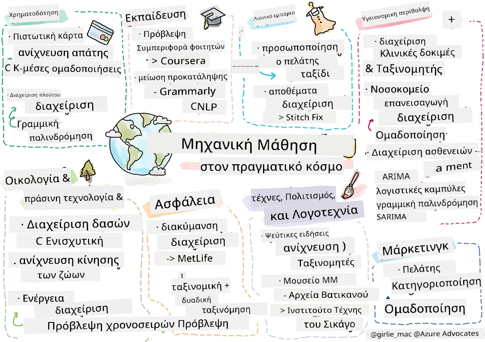

# Επίμετρο: Η μηχανική μάθηση στον πραγματικό κόσμο

> Σκίτσο από την [Tomomi Imura](https://www.twitter.com/girlie_mac)

Σε αυτή τη διδακτική ενότητα, μάθατε πολλούς τρόπους για να προετοιμάσετε δεδομένα για εκπαίδευση και να δημιουργήσετε μοντέλα μηχανικής μάθησης. Δημιουργήσατε μια σειρά από κλασικά μοντέλα παλινδρόμησης, ομαδοποίησης, ταξινόμησης, επεξεργασίας φυσικής γλώσσας και χρονοσειρών. Συγχαρητήρια! Τώρα, ίσως αναρωτιέστε ποιος είναι ο σκοπός τους... ποια είναι τα πραγματικά εφαρμογές αυτών των μοντέλων;

Ενώ μεγάλο ενδιαφέρον στη βιομηχανία έχει προσελκύσει η Τεχνητή Νοημοσύνη, που συνήθως αξιοποιεί τη βαθιά μάθηση, υπάρχουν ακόμα πολύτιμες εφαρμογές για κλασικά μοντέλα μηχανικής μάθησης. Είναι πιθανό να χρησιμοποιείτε κάποιες από αυτές τις εφαρμογές σήμερα! Σε αυτό το μάθημα, θα εξερευνήσετε πώς οκτώ διαφορετικοί κλάδοι και γνωστικά πεδία χρησιμοποιούν αυτού του είδους τα μοντέλα για να κάνουν τις εφαρμογές τους πιο αποδοτικές, αξιόπιστες, έξυπνες και πολύτιμες για τους χρήστες.

## [Προ-μάθημα κουίζ](https://ff-quizzes.netlify.app/en/ml/)

## 💰 Χρηματοοικονομικά

Ο χρηματοοικονομικός τομέας προσφέρει πολλές ευκαιρίες για τη μηχανική μάθηση. Πολλά προβλήματα σε αυτόν τον τομέα μπορούν να μοντελοποιηθούν και να επιλυθούν με τη χρήση της μηχανικής μάθησης.

### Ανίχνευση απάτης με πιστωτικές κάρτες

Μάθαμε για τον [k-means clustering](../../5-Clustering/2-K-Means/README.md) νωρίτερα στο μάθημα, αλλά πώς μπορεί να χρησιμοποιηθεί για την επίλυση προβλημάτων σχετικά με την απάτη πιστωτικών καρτών;

Ο k-means clustering είναι χρήσιμος σε μια τεχνική ανίχνευσης απάτης πιστωτικών καρτών που ονομάζεται **ανίχνευση ανώμαλων τιμών (outlier detection)**. Οι ανώμαλες τιμές, ή αποκλίσεις στις παρατηρήσεις σχετικά με ένα σύνολο δεδομένων, μπορούν να μας πουν αν μια πιστωτική κάρτα χρησιμοποιείται κανονικά ή αν συμβαίνει κάτι ασυνήθιστο. Όπως φαίνεται στο παρακάτω συνδεδεμένο άρθρο, μπορείτε να ταξινομήσετε τα δεδομένα πιστωτικών καρτών χρησιμοποιώντας έναν αλγόριθμο k-means clustering και να αναθέσετε κάθε συναλλαγή σε μια ομάδα βάσει του πόσο ανώμαλη φαίνεται να είναι. Στη συνέχεια, μπορείτε να αξιολογήσετε τις πιο ριψοκίνδυνες ομάδες για κλοπές ή νόμιμες συναλλαγές.
[Αναφορά](https://citeseerx.ist.psu.edu/viewdoc/download?doi=10.1.1.680.1195&rep=rep1&type=pdf)

### Διαχείριση πλούτου

Στη διαχείριση πλούτου, ένα άτομο ή μια εταιρεία διαχειρίζεται επενδύσεις για λογαριασμό των πελατών τους. Η δουλειά τους είναι να διατηρούν και να αυξάνουν τον πλούτο μακροπρόθεσμα, οπότε είναι ουσιώδες να επιλέγουν επενδύσεις που αποδίδουν καλά.

Ένας τρόπος για να αξιολογηθεί η απόδοση μιας συγκεκριμένης επένδυσης είναι μέσω στατιστικής παλινδρόμησης. Η [γραμμική παλινδρόμηση](../../2-Regression/1-Tools/README.md) είναι ένα πολύτιμο εργαλείο για να κατανοήσουμε πώς αποδίδει ένα κεφάλαιο σε σχέση με κάποιο δείκτη αναφοράς. Μπορούμε επίσης να συμπεράνουμε αν τα αποτελέσματα της παλινδρόμησης είναι στατιστικά σημαντικά ή πόσο θα επηρεάζουν τις επενδύσεις ενός πελάτη. Μπορείτε ακόμη να επεκτείνετε την ανάλυσή σας με πολλαπλή παλινδρόμηση, όπου λαμβάνονται υπόψη πρόσθετοι παράγοντες κινδύνου. Για παράδειγμα πώς λειτουργεί αυτό για ένα συγκεκριμένο ταμείο, δείτε το παρακάτω άρθρο για την αξιολόγηση της απόδοσης ταμείων με παλινδρόμηση.
[Αναφορά](http://www.brightwoodventures.com/evaluating-fund-performance-using-regression/)

## 🎓 Εκπαίδευση

Ο τομέας της εκπαίδευσης είναι επίσης μια πολύ ενδιαφέρουσα περιοχή όπου μπορεί να εφαρμοστεί η μηχανική μάθηση. Υπάρχουν ενδιαφέροντα προβλήματα προς επίλυση όπως η ανίχνευση απάτης σε εξετάσεις ή εκθέσεις ή η διαχείριση προκαταλήψεων, σκόπιμων ή αθέλητων, στη διαδικασία διόρθωσης.

### Πρόβλεψη της συμπεριφοράς του φοιτητή

Η [Coursera](https://coursera.com), πάροχος διαδικτυακών ανοιχτών μαθημάτων, έχει ένα εξαιρετικό τεχνολογικό ιστολόγιο όπου συζητούν πολλές μηχανικές αποφάσεις. Σε αυτή την περίπτωση μελέτης, σχεδίασαν μια γραμμή παλινδρόμησης για να εξερευνήσουν τυχόν συσχέτιση ανάμεσα σε χαμηλή βαθμολογία NPS (Net Promoter Score) και τη διακράτηση ή εγκατάλειψη των μαθημάτων.
[Αναφορά](https://medium.com/coursera-engineering/controlled-regression-quantifying-the-impact-of-course-quality-on-learner-retention-31f956bd592a)

### Μείωση προκαταλήψεων

Η [Grammarly](https://grammarly.com), βοηθός γραφής που ελέγχει για ορθογραφικά και γραμματικά λάθη, χρησιμοποιεί εξελιγμένα [συστήματα επεξεργασίας φυσικής γλώσσας](../../6-NLP/README.md) σε όλα τα προϊόντα της. Έχουν δημοσιεύσει μια ενδιαφέρουσα μελέτη περίπτωσης στο τεχνολογικό τους ιστολόγιο για το πώς αντιμετώπισαν την προκατάληψη φύλου στη μηχανική μάθηση, που μάθατε στην [εισαγωγική μας ενότητα για τη δικαιοσύνη](../../1-Introduction/3-fairness/README.md).
[Αναφορά](https://www.grammarly.com/blog/engineering/mitigating-gender-bias-in-autocorrect/)

## 👜 Λιανικό εμπόριο

Ο τομέας του λιανικού εμπορίου μπορεί σίγουρα να ωφεληθεί από τη χρήση της μηχανικής μάθησης, από τη δημιουργία καλύτερης εμπειρίας πελάτη έως τη βέλτιστη διαχείριση αποθεμάτων.

### Εξατομίκευση της εμπειρίας πελάτη

Στη Wayfair, μια εταιρεία που πουλάει οικιακά είδη όπως έπιπλα, η βοήθεια των πελατών να βρουν τα κατάλληλα προϊόντα για τα γούστα και τις ανάγκες τους είναι πρωταρχικής σημασίας. Σε αυτό το άρθρο, μηχανικοί της εταιρείας περιγράφουν πώς χρησιμοποιούν την μηχανική μάθηση και NLP για να "προβάλλουν τα σωστά αποτελέσματα για τους πελάτες". Ειδικότερα, η Μηχανή Πρόθεσης Query τους έχει κατασκευαστεί για να χρησιμοποιεί εξαγωγή οντοτήτων, εκπαίδευση ταξινομητών, εξαγωγή περιουσιακών στοιχείων και γνώμης, καθώς και επισήμανση συναισθημάτων σε κριτικές πελατών. Αυτή είναι μια κλασική περίπτωση χρήσης του NLP στο ηλεκτρονικό εμπόριο.
[Αναφορά](https://www.aboutwayfair.com/tech-innovation/how-we-use-machine-learning-and-natural-language-processing-to-empower-search)

### Διαχείριση αποθεμάτων

Καινοτόμες, ευέλικτες εταιρείες όπως η [StitchFix](https://stitchfix.com), μια υπηρεσία που αποστέλλει ρούχα στους καταναλωτές, βασίζονται σε μεγάλο βαθμό στη μηχανική μάθηση για συστάσεις και διαχείριση αποθεμάτων. Οι ομάδες στυλιστών συνεργάζονται με τις ομάδες εμπορίας τους, στην πραγματικότητα: "ένας από τους επιστήμονες δεδομένων μας έκανε πειράματα με έναν γενετικό αλγόριθμο και τον εφάρμοσε σε ενδύματα για να προβλέψει ποιο θα είναι ένα επιτυχημένο ένδυμα που δεν υπάρχει σήμερα. Το παρουσιάσαμε στην ομάδα εμπορίας και τώρα μπορούν να το χρησιμοποιούν ως εργαλείο."
[Αναφορά](https://www.zdnet.com/article/how-stitch-fix-uses-machine-learning-to-master-the-science-of-styling/)

## 🏥 Υγειονομική περίθαλψη

Ο τομέας της υγειονομικής περίθαλψης μπορεί να αξιοποιήσει τη μηχανική μάθηση για να βελτιστοποιήσει ερευνητικές εργασίες αλλά και λογιστικά προβλήματα όπως η επανεισαγωγή ασθενών ή η πρόληψη εξάπλωσης ασθενειών.

### Διαχείριση κλινικών δοκιμών

Η τοξικότητα στις κλινικές δοκιμές αποτελεί σημαντική ανησυχία για τους φαρμακευτικούς κατασκευαστές. Πόση τοξικότητα είναι ανεκτή; Σε αυτή τη μελέτη, η ανάλυση διαφόρων μεθόδων κλινικών δοκιμών οδήγησε στην ανάπτυξη μιας νέας προσέγγισης για την πρόβλεψη των πιθανοτήτων αποτελεσμάτων κλινικών δοκιμών. Συγκεκριμένα, μπόρεσαν να χρησιμοποιήσουν το random forest για να παραγάγουν έναν [ταξινομητή](../../4-Classification/README.md) που μπορεί να διακρίνει ανάμεσα σε ομάδες φαρμάκων.
[Αναφορά](https://www.sciencedirect.com/science/article/pii/S2451945616302914)

### Διαχείριση επανεισαγωγής νοσοκομείου

Η νοσηλεία στα νοσοκομεία έχει υψηλό κόστος, ειδικά όταν οι ασθενείς πρέπει να επανεισαχθούν. Αυτό το άρθρο αναφέρεται σε μια εταιρεία που χρησιμοποιεί μηχανική μάθηση για να προβλέπει την πιθανότητα επανεισαγωγής χρησιμοποιώντας αλγορίθμους [ομαδοποίησης](../../5-Clustering/README.md). Αυτές οι ομάδες βοηθούν τους αναλυτές να "ανακαλύψουν ομάδες επανεισαγωγών που ενδέχεται να έχουν κοινή αιτία".
[Αναφορά](https://healthmanagement.org/c/healthmanagement/issuearticle/hospital-readmissions-and-machine-learning)

### Διαχείριση ασθενειών

Η πρόσφατη πανδημία έριξε φως στους τρόπους με τους οποίους η μηχανική μάθηση μπορεί να βοηθήσει στην αναχαίτιση της εξάπλωσης ασθενειών. Σε αυτό το άρθρο, θα αναγνωρίσετε τη χρήση ARIMA, λογαριθμικών καμπυλών, γραμμικής παλινδρόμησης και SARIMA. "Αυτή η εργασία είναι απόπειρα υπολογισμού του ρυθμού εξάπλωσης αυτού του ιού και επομένως της πρόβλεψης θανάτων, ανάρρωσεων και επιβεβαιωμένων κρουσμάτων, έτσι ώστε να μας βοηθήσει να προετοιμαστούμε καλύτερα και να επιβιώσουμε."
[Αναφορά](https://www.ncbi.nlm.nih.gov/pmc/articles/PMC7979218/)

## 🌲 Οικολογία και Πράσινη Τεχνολογία

Η φύση και η οικολογία αποτελούνται από πολλά ευαίσθητα συστήματα όπου η αλληλεπίδραση μεταξύ ζώων και φύσης είναι στο επίκεντρο. Είναι σημαντικό να μπορούμε να μετράμε αυτά τα συστήματα με ακρίβεια και να δράσουμε κατάλληλα αν συμβεί κάτι, όπως μια δασική πυρκαγιά ή πτώση του πληθυσμού ζώων.

### Διαχείριση δασών

Μάθατε για τη [Μάθηση με Ενίσχυση](../../8-Reinforcement/README.md) σε προηγούμενα μαθήματα. Μπορεί να είναι πολύ χρήσιμη όταν προσπαθούμε να προβλέψουμε μοτίβα στη φύση. Ειδικότερα, μπορεί να χρησιμοποιηθεί για να παρακολουθεί οικολογικά προβλήματα όπως δασικές πυρκαγιές και τη διάδοση εισβολικών ειδών. Στον Καναδά, μια ομάδα ερευνητών χρησιμοποίησε Μάθηση με Ενίσχυση για να κατασκευάσει μοντέλα δυναμικής δασικών πυρκαγιών από δορυφορικές εικόνες. Χρησιμοποιώντας μια καινοτόμο "διαδικασία χωρικής εξάπλωσης (SSP)", είδαν μια δασική πυρκαγιά ως "πράκτορα σε οποιοδήποτε κελί στο τοπίο." "Το σύνολο ενεργειών που μπορεί να λάβει η φωτιά από μια θέση κάθε στιγμή περιλαμβάνει εξάπλωση προς βορρά, νότο, ανατολή ή δύση ή μη εξάπλωση.

Αυτή η προσέγγιση ανατρέπει το συνηθισμένο περιβάλλον Μάθησης με Ενίσχυση καθώς η δυναμική της αντίστοιχης Διεργασίας Απόφασης Markov (MDP) είναι γνωστή συνάρτηση για την άμεση εξάπλωση πυρκαγιάς." Μάθετε περισσότερα για τους κλασικούς αλγορίθμους που χρησιμοποίησε αυτή η ομάδα στον παρακάτω σύνδεσμο.
[Αναφορά](https://www.frontiersin.org/articles/10.3389/fict.2018.00006/full)

### Ανίχνευση κίνησης ζώων

Ενώ η βαθιά μάθηση έχει δημιουργήσει μια επανάσταση στην οπτική παρακολούθηση κινήσεων ζώων (μπορείτε να φτιάξετε το δικό σας [tracker πολικής αρκούδας](https://docs.microsoft.com/learn/modules/build-ml-model-with-azure-stream-analytics/?WT.mc_id=academic-77952-leestott) εδώ), η κλασική μηχανική μάθηση έχει ακόμη θέση σε αυτό το έργο.

Αισθητήρες παρακολούθησης κινήσεων ζώων εκτροφής και ΙοΤ χρησιμοποιούν αυτού του είδους την οπτική επεξεργασία, αλλά πιο βασικές τεχνικές μηχανικής μάθησης είναι χρήσιμες για την προεπεξεργασία των δεδομένων. Για παράδειγμα, σε αυτό το άρθρο, η στάση προβάτων παρακολουθήθηκε και αναλύθηκε χρησιμοποιώντας διάφορους αλγόριθμους ταξινόμησης. Μπορεί να αναγνωρίσετε την καμπύλη ROC στη σελίδα 335.
[Αναφορά](https://druckhaus-hofmann.de/gallery/31-wj-feb-2020.pdf)

### ⚡️ Διαχείριση Ενέργειας
  
Στα μαθήματά μας για την [πρόβλεψη χρονοσειρών](../../7-TimeSeries/README.md), επικαλεστήκαμε την έννοια των έξυπνων παρκόμετρων για τη δημιουργία εσόδων για μια πόλη με βάση την κατανόηση της ζήτησης και της προσφοράς. Αυτό το άρθρο συζητά με λεπτομέρειες πώς ο συνδυασμός ομαδοποίησης, παλινδρόμησης και πρόβλεψης χρονοσειρών βοήθησε στην εκτίμηση μελλοντικής κατανάλωσης ενέργειας στην Ιρλανδία, βασισμένη σε έξυπνους μετρητές.
[Αναφορά](https://www-cdn.knime.com/sites/default/files/inline-images/knime_bigdata_energy_timeseries_whitepaper.pdf)

## 💼 Ασφάλειες

Ο τομέας των ασφαλειών είναι ένας άλλος τομέας που χρησιμοποιεί μηχανική μάθηση για τη δημιουργία και βελτιστοποίηση βιώσιμων οικονομικών και ασφαλιστικών μοντέλων.

### Διαχείριση μεταβλητότητας

Η MetLife, πάροχος ασφάλισης ζωής, είναι ανοιχτή σχετικά με τον τρόπο με τον οποίο αναλύει και μειώνει τη μεταβλητότητα στα οικονομικά μοντέλα της. Σε αυτό το άρθρο θα εντοπίσετε οπτικοποιήσεις δυαδικής και διατακτικής ταξινόμησης. Θα βρείτε επίσης οπτικοποιήσεις πρόβλεψης.
[Αναφορά](https://investments.metlife.com/content/dam/metlifecom/us/investments/insights/research-topics/macro-strategy/pdf/MetLifeInvestmentManagement_MachineLearnedRanking_070920.pdf)

## 🎨 Τέχνες, Πολιτισμός και Λογοτεχνία

Στις τέχνες, για παράδειγμα στη δημοσιογραφία, υπάρχουν πολλά ενδιαφέροντα προβλήματα. Η ανίχνευση ψευδών ειδήσεων είναι ένα μεγάλο πρόβλημα καθώς έχει αποδειχθεί ότι επηρεάζει την κοινή γνώμη και ακόμα και ότι ανατρέπει δημοκρατίες. Τα μουσεία μπορούν επίσης να ωφεληθούν από τη χρήση μηχανικής μάθησης σε όλα, από την εύρεση συνδέσμων μεταξύ αντικειμένων μέχρι τον σχεδιασμό πόρων.

### Ανίχνευση ψευδών ειδήσεων

Η ανίχνευση ψευδών ειδήσεων έχει γίνει παιχνίδι γάτας και ποντικιού στα σημερινά μέσα ενημέρωσης. Σε αυτό το άρθρο, οι ερευνητές προτείνουν ότι ένα σύστημα που συνδυάζει διάφορες τεχνικές μηχανικής μάθησης που έχουμε μελετήσει μπορεί να δοκιμαστεί και το καλύτερο μοντέλο να αναπτυχθεί: "Αυτό το σύστημα βασίζεται στην επεξεργασία φυσικής γλώσσας για την εξαγωγή χαρακτηριστικών από τα δεδομένα και στη συνέχεια αυτά τα χαρακτηριστικά χρησιμοποιούνται για την εκπαίδευση ταξινομητών μηχανικής μάθησης όπως Naive Bayes, Support Vector Machine (SVM), Random Forest (RF), Stochastic Gradient Descent (SGD) και Logistic Regression (LR)."
[Αναφορά](https://www.irjet.net/archives/V7/i6/IRJET-V7I6688.pdf)

Αυτό το άρθρο δείχνει πώς ο συνδυασμός διαφορετικών πεδίων της μηχανικής μάθησης μπορεί να παράγει ενδιαφέροντα αποτελέσματα που βοηθούν στην αναχαίτιση της εξάπλωσης ψευδών ειδήσεων και την αποφυγή πραγματικής ζημιάς· σε αυτή την περίπτωση, το κίνητρο ήταν η διάδοση φημών για θεραπείες COVID που προκάλεσαν βία από όχλους.

### Μηχανική μάθηση στα μουσεία

Τα μουσεία βρίσκονται στα πρόθυρα μιας επανάστασης ΑΙ όπου η καταγραφή και ψηφιοποίηση συλλογών και η εύρεση συνδέσμων μεταξύ αντικειμένων γίνεται πιο εύκολη καθώς η τεχνολογία προχωρά. Έργα όπως το [In Codice Ratio](https://www.sciencedirect.com/science/article/abs/pii/S0306457321001035#:~:text=1.,studies%20over%20large%20historical%20sources.) βοηθούν να ξεκλειδώσουν τα μυστήρια απρόσιτων συλλογών όπως τα Αρχεία του Βατικανού. Ωστόσο, και η επιχειρηματική πτυχή των μουσείων ωφελείται από τα μοντέλα μηχανικής μάθησης.

Για παράδειγμα, το Art Institute of Chicago έχει δημιουργήσει μοντέλα για την πρόβλεψη των ενδιαφερόντων του κοινού και του πότε θα παρακολουθήσουν εκθέσεις. Ο στόχος είναι η δημιουργία εξατομικευμένων και βελτιστοποιημένων εμπειριών επισκεπτών κάθε φορά που ο χρήστης επισκέπτεται το μουσείο. "Κατά το οικονομικό έτος 2017, το μοντέλο προέβλεψε την προσέλευση και τα έσοδα με ακρίβεια εντός του 1 τοις εκατό, λέει ο Andrew Simnick, ανώτερος αντιπρόεδρος του Art Institute."
[Αναφορά](https://www.chicagobusiness.com/article/20180518/ISSUE01/180519840/art-institute-of-chicago-uses-data-to-make-exhibit-choices)

## 🏷 Μάρκετινγκ

### Τμηματοποίηση πελατών

Οι πιο αποτελεσματικές στρατηγικές μάρκετινγκ στοχεύουν τους πελάτες με διαφορετικούς τρόπους βάσει διαφόρων ομαδοποιήσεων. Σε αυτό το άρθρο συζητούνται οι χρήσεις αλγορίθμων ομαδοποίησης για την υποστήριξη διαφοροποιημένου μάρκετινγκ. Το διαφοροποιημένο μάρκετινγκ βοηθά τις εταιρείες να βελτιώσουν την αναγνώριση της μάρκας, να προσεγγίσουν περισσότερους πελάτες και να κερδίσουν περισσότερα χρήματα.
[Αναφορά](https://ai.inqline.com/machine-learning-for-marketing-customer-segmentation/)

## 🚀 Πρόκληση

Εντοπίστε έναν άλλο τομέα που ωφελείται από μερικές από τις τεχνικές που μάθατε σε αυτό το αναλυτικό πρόγραμμα και ανακαλύψτε πώς χρησιμοποιεί τη μηχανική μάθηση.

## [Τεστ μετά τη διάλεξη](https://ff-quizzes.netlify.app/en/ml/)

## Επανεξέταση & Αυτομελέτη

Η ομάδα επιστήμης δεδομένων της Wayfair έχει αρκετά ενδιαφέροντα βίντεο για το πώς χρησιμοποιούν τη Μηχανική Μάθηση στην εταιρεία τους. Αξίζει [να ρίξετε μια ματιά](https://www.youtube.com/channel/UCe2PjkQXqOuwkW1gw6Ameuw/videos)!

## Ανάθεση

[Κυνήγι θησαυρού Μηχανικής Μάθησης](assignment.md)

---

<!-- CO-OP TRANSLATOR DISCLAIMER START -->
**Αποποίηση ευθυνών**:
Αυτό το έγγραφο έχει μεταφραστεί χρησιμοποιώντας την υπηρεσία μετάφρασης με τεχνητή νοημοσύνη [Co-op Translator](https://github.com/Azure/co-op-translator). Ενώ επιδιώκουμε την ακρίβεια, παρακαλούμε να έχετε υπόψη ότι οι αυτοματοποιημένες μεταφράσεις ενδέχεται να περιέχουν λάθη ή ανακρίβειες. Το πρωτότυπο έγγραφο στη μητρική του γλώσσα πρέπει να θεωρείται η αυθεντική πηγή. Για κρίσιμες πληροφορίες, συνιστάται επαγγελματική ανθρώπινη μετάφραση. Δεν φέρουμε ευθύνη για τυχόν παρεξηγήσεις ή λανθασμένες ερμηνείες που προκύπτουν από τη χρήση αυτής της μετάφρασης.
<!-- CO-OP TRANSLATOR DISCLAIMER END -->