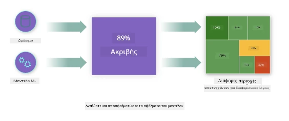
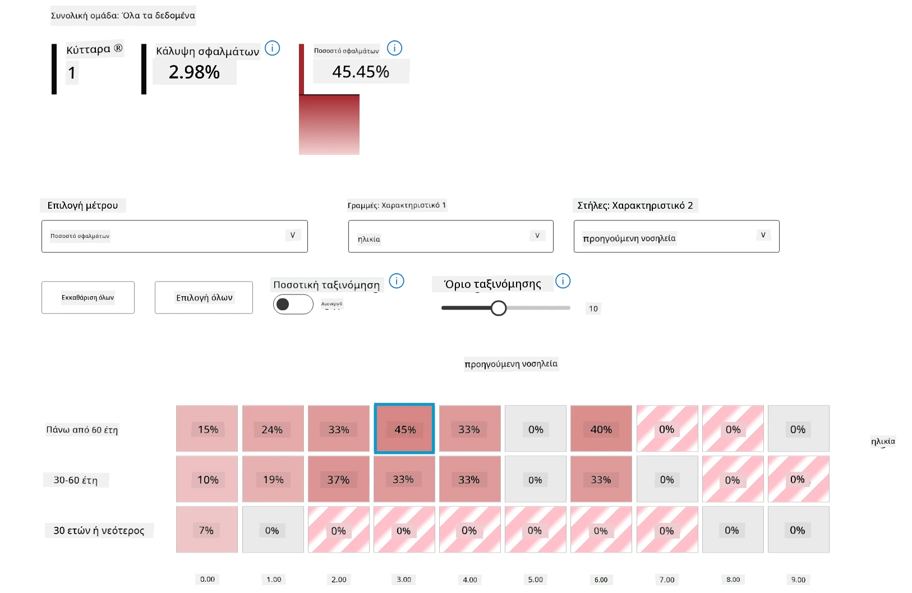
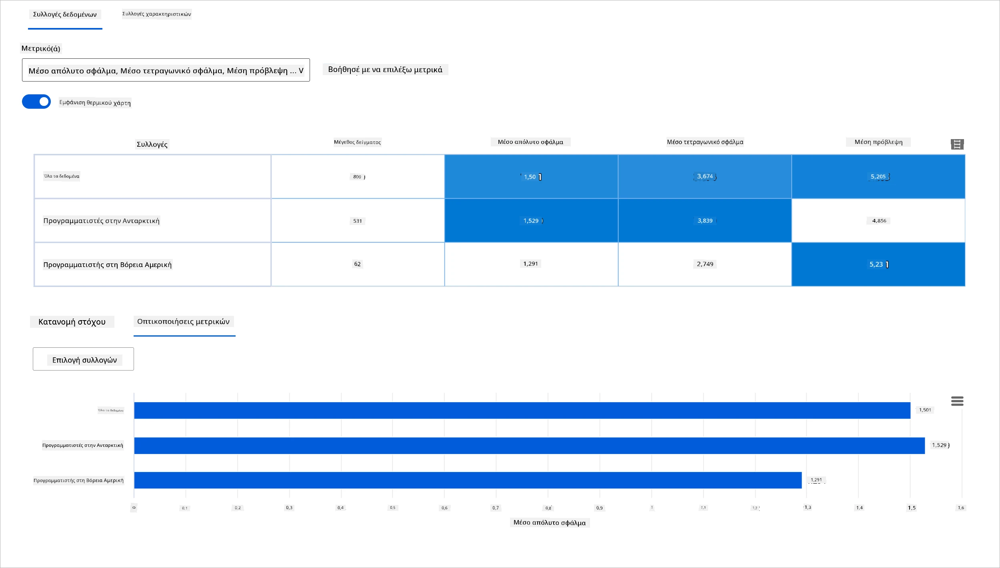
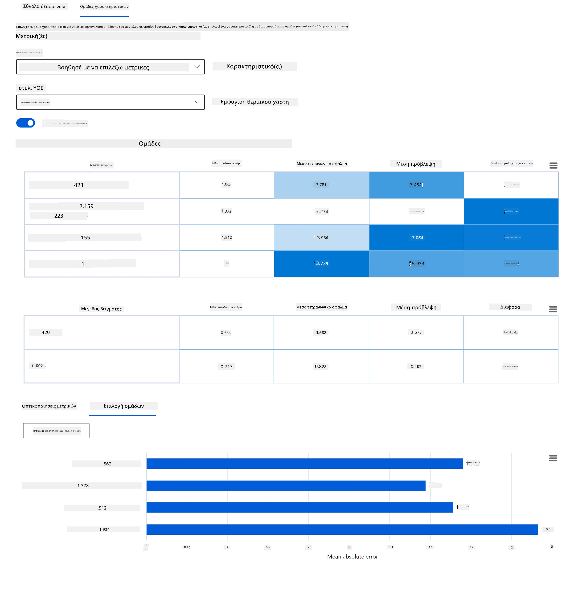
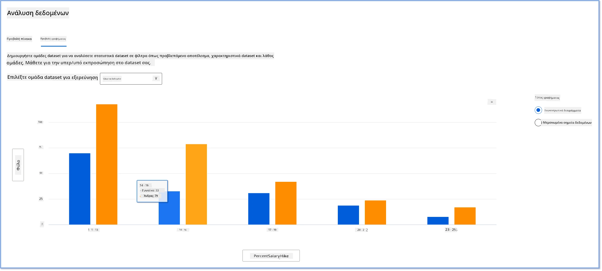
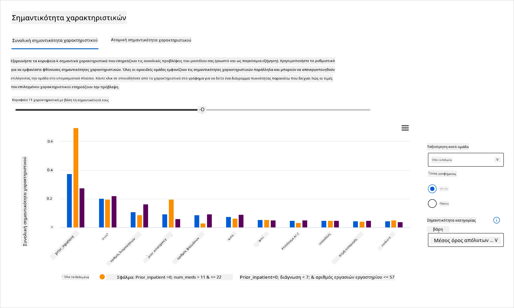
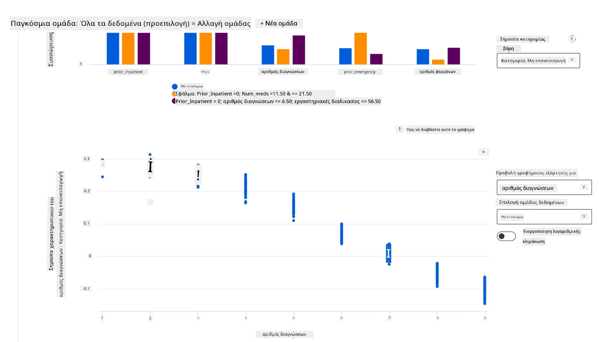

# Μεταγραφή: Αποσφαλμάτωση Μοντέλου στη Μηχανική Μάθηση χρησιμοποιώντας τα συστατικά του Πίνακα Ελέγχου Responsible AI
 

## [Προ-διάλεξη κουίζ](https://ff-quizzes.netlify.app/en/ml/)
 
## Εισαγωγή

Η μηχανική μάθηση επηρεάζει την καθημερινή μας ζωή. Η τεχνητή νοημοσύνη βρίσκει τον δρόμο της σε μερικά από τα πιο σημαντικά συστήματα που μας επηρεάζουν ως άτομα καθώς και την κοινωνία μας, από την υγειονομική περίθαλψη, τα οικονομικά, την εκπαίδευση και την εργασία. Για παράδειγμα, τα συστήματα και τα μοντέλα εμπλέκονται σε καθημερινές εργασίες λήψης αποφάσεων, όπως διαγνώσεις υγείας ή ανίχνευση απάτης. Ως αποτέλεσμα, οι εξελίξεις στην τεχνητή νοημοσύνη σε συνδυασμό με την επιταχυνόμενη υιοθέτηση αντιμετωπίζονται με εξελισσόμενες κοινωνικές προσδοκίες και αυξανόμενη ρύθμιση ως απάντηση. Συνεχώς βλέπουμε περιοχές όπου τα συστήματα τεχνητής νοημοσύνης συνεχίζουν να αποτυγχάνουν να ικανοποιήσουν προσδοκίες· εκθέτουν νέες προκλήσεις· και οι κυβερνήσεις αρχίζουν να ρυθμίζουν τις λύσεις AI. Έτσι, είναι σημαντικό αυτά τα μοντέλα να αναλύονται ώστε να παρέχουν δίκαια, αξιόπιστα, συμπεριληπτικά, διαφανή και υπεύθυνα αποτελέσματα για όλους.

Σε αυτό το πρόγραμμα σπουδών, θα εξετάσουμε πρακτικά εργαλεία που μπορούν να χρησιμοποιηθούν για να αξιολογήσουμε εάν ένα μοντέλο έχει ζητήματα υπεύθυνης AI. Οι παραδοσιακές τεχνικές αποσφαλμάτωσης μηχανικής μάθησης συνήθως βασίζονται σε ποσοτικούς υπολογισμούς όπως η συνολική ακρίβεια ή η μέση απώλεια σφάλματος. Φανταστείτε τι μπορεί να συμβεί όταν τα δεδομένα που χρησιμοποιείτε για να χτίσετε αυτά τα μοντέλα λείπουν ορισμένα δημογραφικά στοιχεία, όπως φυλή, φύλο, πολιτική άποψη, θρησκεία ή εκπροσωπούν δυσανάλογα τέτοια δημογραφικά. Τι γίνεται όταν η έξοδος του μοντέλου ερμηνεύεται έτσι ώστε να ευνοεί κάποια δημογραφικά στοιχεία; Αυτό μπορεί να εισάγει υπερεκπροσώπηση ή υποεκπροσώπηση αυτών των ευαίσθητων ομάδων χαρακτηριστικών, με αποτέλεσμα προβλήματα δικαιοσύνης, συμπερίληψης ή αξιοπιστίας από το μοντέλο. Ένας άλλος παράγοντας είναι ότι τα μοντέλα μηχανικής μάθησης θεωρούνται μαύρα κουτιά, γεγονός που καθιστά δύσκολο να κατανοηθεί και να εξηγηθεί τι οδηγεί στην πρόβλεψη ενός μοντέλου. Όλες αυτές είναι προκλήσεις που αντιμετωπίζουν οι επιστήμονες δεδομένων και οι προγραμματιστές AI όταν δεν διαθέτουν επαρκή εργαλεία για να αποσφαλματώσουν και να αξιολογήσουν τη δικαιοσύνη ή την αξιοπιστία ενός μοντέλου.

Σε αυτό το μάθημα, θα μάθετε για την αποσφαλμάτωση των μοντέλων σας χρησιμοποιώντας:

-	**Ανάλυση Σφαλμάτων**: εντοπίστε πού στην κατανομή των δεδομένων σας έχει το μοντέλο υψηλά ποσοστά σφαλμάτων.
-	**Επισκόπηση Μοντέλου**: εκτελέστε συγκριτική ανάλυση σε διαφορετικές υποομάδες δεδομένων για να ανακαλύψετε ανισότητες στις μετρικές απόδοσης του μοντέλου σας.
-	**Ανάλυση Δεδομένων**: διερευνήστε πού μπορεί να υπάρχει υπερεκπροσώπηση ή υποεκπροσώπηση των δεδομένων σας που μπορεί να προκαλέσει το μοντέλο να ευνοεί ένα δημογραφικό έναντι ενός άλλου.
-	**Σημαντικότητα Χαρακτηριστικών**: κατανοήστε ποια χαρακτηριστικά καθοδηγούν τις προβλέψεις του μοντέλου σε παγκόσμιο ή τοπικό επίπεδο.

## Προαπαιτούμενο

Ως προαπαιτούμενο, παρακαλώ κάντε την επισκόπηση [Responsible AI tools for developers](https://www.microsoft.com/ai/ai-lab-responsible-ai-dashboard)

> 

## Ανάλυση Σφαλμάτων

Οι παραδοσιακές μετρικές απόδοσης μοντέλων που χρησιμοποιούνται για τη μέτρηση της ακρίβειας είναι κυρίως υπολογισμοί βασισμένοι σε σωστές έναντι λανθασμένων προβλέψεων. Για παράδειγμα, η διαπίστωση ότι ένα μοντέλο έχει ακρίβεια 89% με απώλεια σφάλματος 0,001 μπορεί να θεωρηθεί καλή απόδοση. Τα σφάλματα συχνά δεν κατανέμονται ομοιόμορφα στο υποκείμενο σύνολο δεδομένων σας. Μπορεί να έχετε σκορ ακρίβειας μοντέλου 89% αλλά να ανακαλύψετε ότι υπάρχουν διαφορετικές περιοχές των δεδομένων σας όπου το μοντέλο αποτυγχάνει στο 42% των φορών. Το αποτέλεσμα αυτών των προτύπων αποτυχίας με ορισμένες ομάδες δεδομένων μπορεί να οδηγήσει σε ζητήματα δικαιοσύνης ή αξιοπιστίας. Είναι απαραίτητο να κατανοήσουμε τις περιοχές όπου το μοντέλο αποδίδει καλά ή όχι. Οι περιοχές δεδομένων όπου υπάρχουν πολλά λάθη στο μοντέλο σας μπορεί να αποδειχθούν σημαντικό δημογραφικό δεδομένων.

Το συστατικό Ανάλυσης Σφαλμάτων στον πίνακα ελέγχου RAI απεικονίζει πώς η αποτυχία του μοντέλου κατανέμεται σε διάφορες υποομάδες με μια δεντρική απεικόνιση. Αυτό είναι χρήσιμο για τον εντοπισμό χαρακτηριστικών ή περιοχών όπου υπάρχει υψηλό ποσοστό σφαλμάτων στο σύνολο δεδομένων σας. Βλέποντας από πού προέρχονται οι περισσότερες ανακρίβειες του μοντέλου, μπορείτε να αρχίσετε να διερευνάτε την ρίζα του προβλήματος. Μπορείτε επίσης να δημιουργήσετε ομάδες δεδομένων για να εκτελέσετε ανάλυση. Αυτές οι υποομάδες δεδομένων βοηθούν στη διαδικασία αποσφαλμάτωσης για να διαπιστωθεί γιατί η απόδοση του μοντέλου είναι καλή σε μια υποομάδα, αλλά λανθασμένη σε άλλη.

Οι οπτικοί δείκτες στο δεντρικό χάρτη βοηθούν στον ταχύτερο εντοπισμό των προβληματικών περιοχών. Για παράδειγμα, όσο πιο σκούρο κόκκινο έχει ένας κόμβος στο δέντρο, τόσο υψηλότερο είναι το ποσοστό σφάλματος.

Ο θερμικός χάρτης είναι μια άλλη οπτικοποιητική λειτουργία που οι χρήστες μπορούν να χρησιμοποιήσουν για να διερευνήσουν το ποσοστό σφάλματος χρησιμοποιώντας ένα ή δύο χαρακτηριστικά για να βρουν μια συνεισφορά στα σφάλματα του μοντέλου σε ολόκληρο το σύνολο δεδομένων ή τις υποομάδες.

Χρησιμοποιήστε την ανάλυση σφαλμάτων όταν χρειάζεται να:

* Αποκτήσετε βαθιά κατανόηση του τρόπου με τον οποίο οι αποτυχίες μοντέλου κατανέμονται σε ένα σύνολο δεδομένων και μέσα από πολλές διαστάσεις εισόδου και χαρακτηριστικών.
* Χωρίσετε τις συνολικές μετρικές απόδοσης για να ανακαλύψετε αυτόματα λανθασμένες υποομάδες ώστε να ενημερώσετε τα στοχευμένα βήματα μετριασμού.

## Επισκόπηση Μοντέλου

Η αξιολόγηση της απόδοσης ενός μοντέλου μηχανικής μάθησης απαιτεί την απόκτηση μιας ολιστικής κατανόησης της συμπεριφοράς του. Αυτό μπορεί να επιτευχθεί εξετάζοντας περισσότερες από μία μετρικές όπως ποσοστό σφάλματος, ακρίβεια, ανάκληση, ακρίβεια (precision) ή MAE (Μέσο Απόλυτο Σφάλμα) για να βρεθούν ανισότητες μεταξύ των μετρικών απόδοσης. Μια μετρική απόδοσης μπορεί να φαίνεται εξαιρετική, αλλά ανακρίβειες μπορεί να αποκαλυφθούν σε άλλη μετρική. Επιπλέον, η σύγκριση των μετρικών ως προς τις ανισότητες σε ολόκληρο το σύνολο δεδομένων ή υποομάδες βοηθά στο να φωτιστούν οι περιοχές όπου το μοντέλο αποδίδει καλά ή όχι. Αυτό είναι ιδιαίτερα σημαντικό για να δούμε την απόδοση του μοντέλου ανάμεσα σε ευαίσθητα έναντι μη ευαίσθητων χαρακτηριστικών (π.χ. φυλή ασθενούς, φύλο ή ηλικία) για την αποκάλυψη πιθανής αδικίας που μπορεί να έχει το μοντέλο. Για παράδειγμα, η ανακάλυψη ότι το μοντέλο είναι πιο ανακριβές σε μια υποομάδα που περιέχει ευαίσθητα χαρακτηριστικά μπορεί να αποκαλύψει πιθανή αδικία που υπάρχει στο μοντέλο.

Το συστατικό Επισκόπηση Μοντέλου στον πίνακα ελέγχου RAI βοηθά όχι μόνο στην ανάλυση των μετρικών απόδοσης της αναπαράστασης δεδομένων σε μια υποομάδα, αλλά παρέχει στους χρήστες τη δυνατότητα να συγκρίνουν τη συμπεριφορά του μοντέλου σε διαφορετικές υποομάδες.

Η λειτουργία ανάλυσης βάσει χαρακτηριστικών του συστατικού επιτρέπει στους χρήστες να περιορίσουν υποομάδες δεδομένων εντός ενός συγκεκριμένου χαρακτηριστικού για να εντοπίσουν ανωμαλίες σε λεπτομερές επίπεδο. Για παράδειγμα, ο πίνακας ελέγχου έχει ενσωματωμένη νοημοσύνη για αυτόματη δημιουργία υποομάδων για ένα χαρακτηριστικό που επιλέγει ο χρήστης (π.χ., *"time_in_hospital < 3"* ή *"time_in_hospital >= 7"*). Αυτό επιτρέπει σε έναν χρήστη να απομονώσει ένα συγκεκριμένο χαρακτηριστικό από μια μεγαλύτερη ομάδα δεδομένων για να δει εάν είναι σημαντικός παράγοντας που επηρεάζει τα λανθασμένα αποτελέσματα του μοντέλου.

Το συστατικό Επισκόπηση Μοντέλου υποστηρίζει δύο κατηγορίες μετρικών ανισότητας:

**Ανισότητα στην απόδοση του μοντέλου**: Αυτά τα σύνολα μετρικών υπολογίζουν την ανισότητα (διαφορά) στις τιμές της επιλεγμένης μετρικής απόδοσης μεταξύ υποομάδων δεδομένων. Εδώ είναι μερικά παραδείγματα:

* Ανισότητα στο ποσοστό ακρίβειας
* Ανισότητα στο ποσοστό σφάλματος
* Ανισότητα στην ακρίβεια (precision)
* Ανισότητα στην ανάκληση (recall)
* Ανισότητα στο μέσο απόλυτο σφάλμα (MAE)

**Ανισότητα στο ποσοστό επιλογής**: Αυτή η μετρική περιλαμβάνει τη διαφορά στο ποσοστό επιλογής (ευνοϊκή πρόβλεψη) ανάμεσα σε υποομάδες. Ένα παράδειγμα είναι η ανισότητα στα ποσοστά έγκρισης δανείων. Ο ρυθμός επιλογής σημαίνει το κλάσμα των σημείων δεδομένων σε κάθε κατηγορία που ταξινομούνται ως 1 (στη δυαδική ταξινόμηση) ή η κατανομή των τιμών πρόβλεψης (στην παλινδρόμηση).

## Ανάλυση Δεδομένων

> "Αν βασανίσεις τα δεδομένα αρκετά, θα ομολογήσουν οτιδήποτε" - Ronald Coase

Αυτή η δήλωση ακούγεται ακραία, αλλά είναι αλήθεια ότι τα δεδομένα μπορούν να χειραγωγηθούν για να υποστηρίξουν οποιοδήποτε συμπέρασμα. Τέτοια χειραγώγηση μπορεί μερικές φορές να συμβεί ακούσια. Ως άνθρωποι, όλοι έχουμε προκαταλήψεις, και συχνά είναι δύσκολο να γνωρίζουμε συνειδητά πότε εισάγουμε προκατάληψη στα δεδομένα. Η διασφάλιση της δικαιοσύνης στην AI και τη μηχανική μάθηση παραμένει μια πολύπλοκη πρόκληση.

Τα δεδομένα είναι ένα μεγάλο τυφλό σημείο για τις παραδοσιακές μετρικές απόδοσης μοντέλων. Μπορεί να έχετε υψηλές βαθμολογίες ακρίβειας, αλλά αυτό δεν αντικατοπτρίζει πάντα την υποκείμενη προκατάληψη στα δεδομένα που μπορεί να υπάρχει στο σύνολο δεδομένων σας. Για παράδειγμα, αν ένα σύνολο δεδομένων εργαζομένων έχει 27% γυναίκες σε εκτελεστικές θέσεις σε μια εταιρεία και 73% άνδρες στο ίδιο επίπεδο, ένα AI μοντέλο που εκπαιδεύτηκε για διαφήμιση εργασίας σε αυτά τα δεδομένα μπορεί να στοχεύει κυρίως ανδρικό κοινό για θέσεις ανώτερου επιπέδου. Έχοντας αυτή την ανισορροπία στα δεδομένα, το μοντέλο προσανατολίστηκε να ευνοεί ένα φύλο. Αυτό αποκαλύπτει ένα ζήτημα δικαιοσύνης όπου υπάρχει μεροληψία φύλου στο μοντέλο AI.

Το συστατικό Ανάλυσης Δεδομένων στον πίνακα ελέγχου RAI βοηθά στον εντοπισμό περιοχών όπου υπάρχει υπερεκπροσώπηση και υποεκπροσώπηση στο σύνολο δεδομένων. Βοηθά τους χρήστες να διαγνώσουν την ρίζα των σφαλμάτων και των ζητημάτων δικαιοσύνης που εισάγονται από ανισορροπίες δεδομένων ή έλλειψη εκπροσώπησης μιας συγκεκριμένης ομάδας δεδομένων. Αυτό δίνει στους χρήστες τη δυνατότητα να οπτικοποιήσουν σύνολα δεδομένων βάσει προβλεφθέντων και πραγματικών αποτελεσμάτων, ομάδων σφαλμάτων και συγκεκριμένων χαρακτηριστικών. Μερικές φορές η ανακάλυψη μιας υποεκπροσωπούμενης ομάδας δεδομένων μπορεί επίσης να αποκαλύψει ότι το μοντέλο δεν μαθαίνει καλά, εξ ου και οι υψηλές ανακρίβειες. Η ύπαρξη ενός μοντέλου με προκατάληψη στα δεδομένα δεν είναι μόνο θέμα δικαιοσύνης αλλά δείχνει ότι το μοντέλο δεν είναι συμπεριληπτικό ή αξιόπιστο.

Χρησιμοποιήστε την ανάλυση δεδομένων όταν χρειάζεται να:

* Εξερευνήσετε τα στατιστικά του συνόλου δεδομένων σας επιλέγοντας διαφορετικά φίλτρα για να χωρίσετε τα δεδομένα σας σε διαφορετικές διαστάσεις (γνωστές και ως υποομάδες).
* Κατανοήσετε την κατανομή του συνόλου δεδομένων σας σε διάφορες υποομάδες και ομάδες χαρακτηριστικών.
* Καθορίσετε αν τα ευρήματά σας σχετικά με τη δικαιοσύνη, την ανάλυση σφαλμάτων και την αιτιότητα (που προέρχονται από άλλα συστατικά του πίνακα ελέγχου) είναι αποτέλεσμα της κατανομής του συνόλου δεδομένων σας.
* Αποφασίσετε σε ποιες περιοχές να συλλέξετε περισσότερα δεδομένα για να μετριάσετε σφάλματα που προέρχονται από προβλήματα εκπροσώπησης, θόρυβο ετικετών, θόρυβο χαρακτηριστικών, μεροληψία ετικετών και παρόμοιους παράγοντες.

## Ερμηνευσιμότητα Μοντέλου

Τα μοντέλα μηχανικής μάθησης τείνουν να είναι μαύρα κουτιά. Η κατανόηση των βασικών χαρακτηριστικών δεδομένων που καθοδηγούν την πρόβλεψη ενός μοντέλου μπορεί να είναι πρόκληση. Είναι σημαντικό να παρέχεται διαφάνεια στο γιατί ένα μοντέλο κάνει μια συγκεκριμένη πρόβλεψη. Για παράδειγμα, αν ένα σύστημα AI προβλέψει ότι ένας διαβητικός ασθενής κινδυνεύει να επανεισαχθεί σε νοσοκομείο σε λιγότερο από 30 ημέρες, θα πρέπει να μπορεί να παρέχει υποστηρικτικά δεδομένα που οδήγησαν στην πρόβλεψή του. Η παρουσία υποστηρικτικών δεικτών δεδομένων προσφέρει διαφάνεια για να βοηθήσει τους κλινικούς ιατρούς ή τα νοσοκομεία να μπορούν να πάρουν καλά πληροφορημένες αποφάσεις. Επιπλέον, η δυνατότητα εξήγησης γιατί το μοντέλο έκανε μια πρόβλεψη για έναν μεμονωμένο ασθενή επιτρέπει την υπευθυνότητα σε σχέση με τους κανονισμούς υγείας. Όταν χρησιμοποιείτε μοντέλα μηχανικής μάθησης με τρόπους που επηρεάζουν ζωές ανθρώπων, είναι κρίσιμο να κατανοείτε και να εξηγείτε τι επηρεάζει τη συμπεριφορά ενός μοντέλου. Η εξηγησιμότητα και ερμηνευσιμότητα μοντέλου βοηθούν στην απάντηση ερωτήσεων σε σενάρια όπως:

* Αποσφαλμάτωση μοντέλου: Γιατί το μοντέλο μου έκανε αυτό το λάθος; Πώς μπορώ να βελτιώσω το μοντέλο μου;
* Συνεργασία Ανθρώπου-ΑΙ: Πώς μπορώ να κατανοήσω και να εμπιστευτώ τις αποφάσεις του μοντέλου;
* Ρυθμιστική συμμόρφωση: Το μοντέλο μου ικανοποιεί τις νομικές απαιτήσεις;

Το συστατικό Σημαντικότητα Χαρακτηριστικών του πίνακα ελέγχου RAI σας βοηθά να αποσφαλματώσετε και να αποκτήσετε μια ολοκληρωμένη κατανόηση του πώς ένα μοντέλο κάνει προβλέψεις. Είναι επίσης ένα χρήσιμο εργαλείο για επαγγελματίες μηχανικής μάθησης και λήψης αποφάσεων ώστε να εξηγήσουν και να δείξουν αποδεικτικά στοιχεία των χαρακτηριστικών που επηρεάζουν τη συμπεριφορά ενός μοντέλου για τη ρυθμιστική συμμόρφωση. Στη συνέχεια, οι χρήστες μπορούν να εξετάσουν τόσο τις παγκόσμιες όσο και τις τοπικές εξηγήσεις για να επαληθεύσουν ποια χαρακτηριστικά καθοδηγούν μια πρόβλεψη μοντέλου. Οι παγκόσμιες εξηγήσεις απαριθμούν τα πιο σημαντικά χαρακτηριστικά που επηρέασαν τη συνολική πρόβλεψη ενός μοντέλου. Οι τοπικές εξηγήσεις δείχνουν ποια χαρακτηριστικά οδήγησαν στην πρόβλεψη ενός μοντέλου για μια μεμονωμένη περίπτωση. Η δυνατότητα αξιολόγησης τοπικών εξηγήσεων βοηθά επίσης στην αποσφαλμάτωση ή τον έλεγχο μιας συγκεκριμένης περίπτωσης για καλύτερη κατανόηση και ερμηνεία του γιατί ένα μοντέλο έκανε ακριβή ή ανακριβή πρόβλεψη.

* Παγκόσμιες εξηγήσεις: Για παράδειγμα, ποια χαρακτηριστικά επηρεάζουν τη συνολική συμπεριφορά ενός μοντέλου επανεισαγωγής σε νοσοκομείο διαβητικών;
* Τοπικές εξηγήσεις: Για παράδειγμα, γιατί ένας διαβητικός ασθενής άνω των 60 ετών με προηγούμενες νοσηλείες προβλέφθηκε να επανεισαχθεί ή όχι εντός 30 ημερών σε νοσοκομείο;

Στη διαδικασία αποσφαλμάτωσης εξετάζοντας την απόδοση ενός μοντέλου σε διάφορες υποομάδες, η Σημαντικότητα Χαρακτηριστικών δείχνει το επίπεδο επιρροής που έχει ένα χαρακτηριστικό σε όλες τις υποομάδες. Βοηθά να αποκαλυφθούν ανωμαλίες όταν συγκρίνεται το επίπεδο επίδρασης του χαρακτηριστικού στην πρόκληση λανθασμένων προβλέψεων ενός μοντέλου. Το συστατικό Σημαντικότητας Χαρακτηριστικών μπορεί να δείξει ποιες τιμές ενός χαρακτηριστικού επηρέασαν θετικά ή αρνητικά το αποτέλεσμα του μοντέλου. Για παράδειγμα, εάν ένα μοντέλο έκανε μια ανακριβή πρόβλεψη, το συστατικό σας δίνει τη δυνατότητα να ερευνήσετε και να εντοπίσετε ποια χαρακτηριστικά ή τιμές χαρακτηριστικών οδήγησαν στην πρόβλεψη. Αυτό το επίπεδο λεπτομέρειας βοηθά όχι μόνο στην αποσφαλμάτωση αλλά παρέχει διαφάνεια και υπευθυνότητα σε καταστάσεις ελέγχου. Τέλος, το συστατικό μπορεί να σας βοηθήσει να εντοπίσετε ζητήματα δικαιοσύνης. Για να το δείξουμε, εάν ένα ευαίσθητο χαρακτηριστικό όπως η εθνικότητα ή το φύλο έχει μεγάλη επιρροή στην πρόβλεψη ενός μοντέλου, αυτό θα μπορούσε να είναι ένδειξη μεροληψίας λόγω φυλής ή φύλου στο μοντέλο.

Χρησιμοποιήστε την ερμηνευσιμότητα όταν χρειάζεται να:

* Καθορίσετε πόσο αξιόπιστες είναι οι προβλέψεις του συστήματος AI σας κατανοώντας ποια χαρακτηριστικά είναι πιο σημαντικά για τις προβλέψεις.
* Προσεγγίσετε την αποσφαλμάτωση του μοντέλου σας κατανοώντας το πρώτα και προσδιορίζοντας εάν το μοντέλο χρησιμοποιεί υγιή χαρακτηριστικά ή απλώς ψευδείς συσχετίσεις.
* Αποκαλύψετε πιθανές πηγές αδικίας κατανοώντας αν το μοντέλο βασίζει τις προβλέψεις σε ευαίσθητα χαρακτηριστικά ή σε χαρακτηριστικά που σχετίζονται ισχυρά με αυτά.
* Κατασκευάσετε εμπιστοσύνη των χρηστών στις αποφάσεις του μοντέλου σας δημιουργώντας τοπικές εξηγήσεις για να απεικονίσετε τα αποτελέσματά τους.
* Ολοκληρώσετε έναν ρυθμιστικό έλεγχο ενός συστήματος AI για την επαλήθευση μοντέλων και την παρακολούθηση του αντίκτυπου των αποφάσεων μοντέλου στους ανθρώπους.

## Συμπέρασμα

Όλα τα συστατικά του πίνακα ελέγχου RAI είναι πρακτικά εργαλεία που σας βοηθούν να δημιουργήσετε μοντέλα μηχανικής μάθησης που είναι λιγότερο επιβλαβή και πιο αξιόπιστα για την κοινωνία. Βελτιώνει την πρόληψη απειλών για τα ανθρώπινα δικαιώματα· τον διαχωρισμό ή τον αποκλεισμό ορισμένων ομάδων από ευκαιρίες ζωής· και τον κίνδυνο σωματικής ή ψυχολογικής βλάβης. Βοηθά επίσης να οικοδομηθεί εμπιστοσύνη στις αποφάσεις του μοντέλου δημιουργώντας τοπικές εξηγήσεις για να απεικονίσει τα αποτελέσματά τους. Μερικές από τις πιθανές βλάβες μπορούν να χαρακτηριστούν ως:

- **Κατανομή**, αν π.χ. ένα φύλο ή εθνικότητα ευνοείται έναντι άλλου.
- **Ποιότητα υπηρεσίας**. Αν εκπαιδεύσετε τα δεδομένα για ένα συγκεκριμένο σενάριο αλλά η πραγματικότητα είναι πολύ πιο πολύπλοκη, οδηγεί σε υπηρεσία με κακή απόδοση.
- **Στερεοτυπία**. Συνδέοντας μια συγκεκριμένη ομάδα με προκαθορισμένα χαρακτηριστικά.

- **Κατασυκοφάντηση**. Να κριτικάρεις άδικα και να χαρακτηρίζεις κάτι ή κάποιον.
- **Υπερ- ή υπο-αναπαράσταση**. Η ιδέα είναι ότι μια συγκεκριμένη ομάδα δεν εμφανίζεται σε ένα συγκεκριμένο επάγγελμα, και οποιαδήποτε υπηρεσία ή λειτουργία που συνεχίζει να το προωθεί συμβάλλει σε βλάβη.

### Πίνακας εργαλείων Azure RAI
 
[Azure RAI dashboard](https://learn.microsoft.com/en-us/azure/machine-learning/concept-responsible-ai-dashboard?WT.mc_id=aiml-90525-ruyakubu) είναι χτισμένος σε εργαλεία ανοιχτού κώδικα που αναπτύσσονται από κορυφαίους ακαδημαϊκούς οργανισμούς και οργανώσεις, συμπεριλαμβανομένης της Microsoft, και είναι καθοριστικά για επιστήμονες δεδομένων και προγραμματιστές AI ώστε να κατανοήσουν καλύτερα τη συμπεριφορά των μοντέλων, να ανακαλύψουν και να μετριάσουν ανεπιθύμητα ζητήματα από τα μοντέλα AI.

- Μάθετε πώς να χρησιμοποιείτε τα διάφορα συστατικά ελέγχοντας την τεκμηρίωση του RAI dashboard [docs.](https://learn.microsoft.com/en-us/azure/machine-learning/how-to-responsible-ai-dashboard?WT.mc_id=aiml-90525-ruyakubu)

- Δείτε μερικά παραδείγματα σημειωματάριων RAI dashboard [sample notebooks](https://github.com/Azure/RAI-vNext-Preview/tree/main/examples/notebooks) για αποσφαλμάτωση πιο υπεύθυνων σεναρίων AI στο Azure Machine Learning. 
  
---
## 🚀 Πρόκληση 
 
Για να αποτρέψουμε την εισαγωγή στατιστικών ή δεδομένων προκαταλήψεων από την αρχή, πρέπει: 

- να υπάρχει ποικιλία υπόβαθρων και οπτικών μεταξύ των ανθρώπων που εργάζονται στα συστήματα 
- να επενδύσουμε σε σύνολα δεδομένων που αντανακλούν την ποικιλία της κοινωνίας μας 
- να αναπτύξουμε καλύτερες μεθόδους ανίχνευσης και διόρθωσης προκατάληψης όταν αυτή συμβαίνει 

Σκεφτείτε πραγματικά σενάρια όπου η αδικία είναι εμφανής στην κατασκευή και χρήση μοντέλων. Τι άλλο πρέπει να σκεφτούμε; 

## [Μετα-μάθημα κουίζ](https://ff-quizzes.netlify.app/en/ml/)
## Ανασκόπηση & Αυτο-μελέτη 
 
Σε αυτό το μάθημα, μάθατε μερικά από τα πρακτικά εργαλεία για την ενσωμάτωση υπεύθυνου AI στη μηχανική μάθηση.  

Παρακολουθήστε αυτό το εργαστήριο για να εμβαθύνετε στα θέματα: 

- Responsible AI Dashboard: Ένα μέρος για την υλοποίηση του RAI στην πράξη από τους Besmira Nushi και Mehrnoosh Sameki

> 🎥 Κάντε κλικ στην παραπάνω εικόνα για ένα βίντεο: Responsible AI Dashboard: Ένα μέρος για την υλοποίηση του RAI στην πράξη από τους Besmira Nushi και Mehrnoosh Sameki
 
Ανατρέξτε στα ακόλουθα υλικά για να μάθετε περισσότερα για το υπεύθυνο AI και πώς να κατασκευάζετε πιο αξιόπιστα μοντέλα: 

- Εργαλεία RAI της Microsoft για αποσφαλμάτωση μοντέλων ML: [Responsible AI tools resources](https://aka.ms/rai-dashboard)

- Εξερευνήστε το κιτ εργαλείων Responsible AI: [Github](https://github.com/microsoft/responsible-ai-toolbox)

- Κέντρο πόρων RAI της Microsoft: [Responsible AI Resources – Microsoft AI](https://www.microsoft.com/ai/responsible-ai-resources?activetab=pivot1%3aprimaryr4) 

- Ομάδα έρευνας FATE της Microsoft: [FATE: Fairness, Accountability, Transparency, and Ethics in AI - Microsoft Research](https://www.microsoft.com/research/theme/fate/) 

## Ανάθεση εργασίας

[Εξερευνήστε τον πίνακα RAI](assignment.md)

---

<!-- CO-OP TRANSLATOR DISCLAIMER START -->
**Αποποίηση ευθυνών**:
Αυτό το έγγραφο έχει μεταφραστεί χρησιμοποιώντας την υπηρεσία μετάφρασης με τεχνητή νοημοσύνη [Co-op Translator](https://github.com/Azure/co-op-translator). Ενώ επιδιώκουμε την ακρίβεια, παρακαλούμε να έχετε υπόψη ότι οι αυτοματοποιημένες μεταφράσεις ενδέχεται να περιέχουν λάθη ή ανακρίβειες. Το πρωτότυπο έγγραφο στη μητρική του γλώσσα πρέπει να θεωρείται η αυθεντική πηγή. Για κρίσιμες πληροφορίες, συνιστάται επαγγελματική ανθρώπινη μετάφραση. Δεν φέρουμε ευθύνη για τυχόν παρεξηγήσεις ή λανθασμένες ερμηνείες που προκύπτουν από τη χρήση αυτής της μετάφρασης.
<!-- CO-OP TRANSLATOR DISCLAIMER END -->